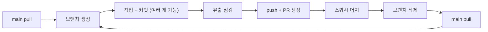

# 브랜치 · PR · 스쿼시 머지 워크플로

`main` 은 **항상 배포 가능한 상태**로 유지하고, 이력은 **작업 단위당 커밋 1개**로 남긴다.
따라서 브랜치에서는 자유롭게 커밋하되 **main 병합은 반드시 스쿼시 머지**로 한다.

## 전체 흐름



---

## 규칙 1: main 에 직접 커밋하지 않는다

`main` 체크아웃 상태에서 커밋 요청을 받으면 **먼저 브랜치를 만든다.**

```bash
git switch -c <type>/<주제-kebab-case>
```

`<type>`: `feat` · `fix` · `docs` · `chore` · `refactor` · `test`

## 규칙 2: 커밋 전 유출 점검 (필수)

이 저장소는 **public 리모트**가 붙어 있다. 스테이징 후 반드시 확인한다.

```bash
git diff --cached --name-only
git diff --cached | grep -nE '<사내-도메인-키워드>|[0-9]{1,3}(\.[0-9]{1,3}){3}' \
  | grep -vE '127\.0\.0\.1|0\.0\.0\.0' && echo "❌ 유출 의심 — 커밋 중단" || echo "✅ clean"
```

실제 호스트명·계정·secret·ingress host·레지스트리 경로가 걸리면 **커밋하지 않고 사용자에게 보고**한다.
`samples/`, `docs/plans/`, `*.secret.env` 는 커밋 대상이 아니다 (`CLAUDE.md` §8).

## 규칙 3: 커밋 메시지

한국어. `<type>: <요약>` 뒤에 **왜 그렇게 했는지**를 본문에 적는다. 무엇을 바꿨는지는 diff 가 말해준다.

```
docs: Keycloak realm 사전 설정 가이드 추가

<배경과 결정 근거>

- <파일별 변경과 그 이유>

Co-Authored-By: Claude Opus 4.8 (1M context) <noreply@anthropic.com>
```

## 규칙 4: PR 생성

```bash
git push -u origin <branch>
gh pr create --base main --title "<type>: <요약>" --body "$(cat <<'EOF'
## 배경
## 변경 사항
## 검증
<실행한 명령과 실제 출력>
## 남은 것

🤖 Generated with [Claude Code](https://claude.com/claude-code)
EOF
)"
```

**검증 섹션은 비우지 않는다.** 실행한 명령과 **실제 출력**을 넣는다. 추측은 검증이 아니다.

## 규칙 5: 스쿼시 머지 후 다음 브랜치

```bash
gh pr merge --squash --delete-branch
git switch main
git pull
git switch -c <다음-작업-브랜치>     # 다음 작업이 정해졌을 때
```

- **`--squash` 를 반드시 붙인다.** 일반 머지·리베이스 머지는 쓰지 않는다.
- `--delete-branch` 로 원격·로컬 브랜치를 정리한다.
- 머지 후 **반드시 `main` 을 pull** 한다. 스쿼시 커밋은 로컬 브랜치 이력과 다르므로,
  pull 없이 이어서 작업하면 이후 PR 에 이미 머지된 변경이 다시 딸려온다.

## 규칙 6: 사용자 승인이 필요한 시점

다음은 **되돌리기 어렵거나 외부에 나가는** 동작이다. 사용자가 명시적으로 요청했을 때만 수행한다.

| 동작 | 승인 필요 |
|---|---|
| 커밋 | 요청 시 |
| push · PR 생성 | 요청 시 |
| **스쿼시 머지** | 요청 시 (PR 생성과 별개로 확인) |
| force push · 이력 재작성 | **항상 별도 확인** |

작업이 끝나면 **무엇을 했고 다음 선택지가 무엇인지** 보고한다. 승인 없이 다음 단계로 넘어가지 않는다.
