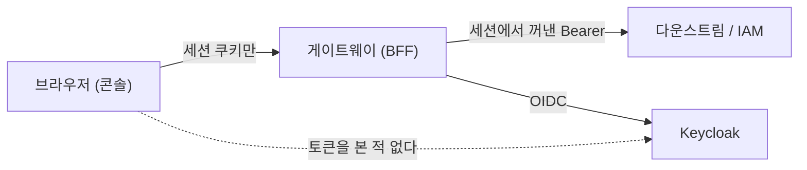

# alpha 검증 콘솔 — 재연 시나리오 가이드

> 샘플 FE(`samples/frontend-demo`)를 alpha 에 띄운 **검증 콘솔**에서, 지금 화면만으로
> 무엇을 어디까지 확인할 수 있는지 정리한다. 각 시나리오는 **조작 → 기대 결과 → 이게 왜
> 증거가 되는가** 순으로 적었다.
>
> 관련: `CLAUDE.md` §6.1(FE 함정 표) · `samples/README.md` §3(일부러 취약하게 둔 곳) ·
> `docs/learning/23` `24` `26` `33`

## 목적

**"동작한다"를 눈으로 확인하는 것**이 아니다. 인가 시스템에서 통과 사례만 보는 것은 아무것도
증명하지 못한다 — 게이트가 전부 열린 상태와 구분되지 않기 때문이다. 그래서 이 가이드는
**거절 사례를 통과 사례와 항상 짝으로** 묶는다.

## 0. 전제 — 읽지 않고 시작하면 헤맨다

### 0.1 좌표

실제 호스트는 이 문서에 적지 않는다(`CLAUDE.md` §8, public 리모트). 값은
`deploy/env/alpha.coord.env` 에 있다.

| 표기 | 무엇 |
|---|---|
| `<console-host>` | 검증 콘솔(FE). `UNIGATE_CONSOLE_HOST` |
| `<gateway-host>` | 게이트웨이. `UNIGATE_GATEWAY_HOST` |

**콘솔과 게이트웨이는 서로 다른 호스트다.** 로컬(Vite dev proxy)은 same-origin 이라
드러나지 않던 것들이 여기서만 드러난다 — CORS·쿠키 가시성·응답 헤더 노출이 전부 여기서 갈린다.

### 0.2 로그인은 사람이 한다

realm 이 **Direct access grants OFF** 라 `curl` 로 사용자 토큰을 만들 수 없다. 토큰은
**브라우저 로그인**으로만 나온다. 자동화가 여기서 멈추는 것은 고장이 아니라 설계다.

### 0.3 FE 는 토큰을 모른다 (BFF)



화면에서 토큰이 보이지 않는 것이 **정상**이다. 보이기 시작하면 BFF 를 쓰는 이유가 사라진다.

### 0.4 지연이 있는 곳

| 무엇 | 지연 | 왜 |
|---|---|---|
| 테넌트 생성 · 멤버십 반영 | outbox 폴링 **최대 10s** | Keycloak group 작업이 비동기다 |
| **claim(소속) 반영** | 위 + access token 잔여수명 **최대 5m** | 게이트는 토큰만 본다 |
| 이메일 변경 확정 | outbox 워커 | 202 를 먼저 받고 나중에 반영된다 |

⚠️ **`/iam/memberships` 는 DB 를 읽어 즉시 보여주고, 게이트는 claim 만 본다.** 그래서
"화면에는 소속이 보이는데 접근은 403" 인 구간이 실제로 생긴다. 고장이 아니다(`docs/learning/33`).

---

## 1. 화면 지도

| 경로 | 화면 | 부르는 API | 무엇을 드러내는가 |
|---|---|---|---|
| `/register` | 가입 | `POST /iam/register` | **로그인 없이 쓰는 유일한 화면.** 공개 경로 + CSRF 예외 + 전용 rate limit(§S0) |
| `/` | 세션 상태 | `GET /iam/debug/whoami` | 세션 유무 · 소속 테넌트 · **alpha 에서는 404 가 정상**(§S3) |
| `/profile` | 프로필 | `GET/PATCH /iam/profile`, `POST /iam/profile/email-change` | 동기 반영 vs **202 비동기 반영**의 차이 |
| `/memberships` | 내 멤버십 | `GET /iam/memberships`, `POST /iam/memberships/{t}/accept` | 초대는 **수락해야** 효력이 생긴다 |
| `/admin` | 관리자 | `POST /iam/admin/tenants`, 멤버 초대·역할변경·해제 | 관리 평면. **역할 없으면 403** |
| `/diagnostics` | 위조 헤더 실험실 | `GET /api/echo` + 원시 헤더 | 게이트가 **무엇을 지우고 무엇을 넣는지** |
| `/t/{tenantId}/orders` | 주문 | `GET/POST /api/orders` (+`X-Requested-Tenant`) | 테넌트 게이트 · 캐시 키 |
| `/t/{tenantId}/orders/{id}` | 주문 상세 | `GET /api/orders/{id}` | 남의 자원은 **404**(존재를 알리지 않는다) |

---

## 2. 지금 계정으로 되는 시나리오

> 현재 alpha realm 에서 시나리오를 돌릴 수 있는 계정은 **관리자 1개**, 테넌트도 **1개**뿐이다(§4).
> 아래에서 🔒 표시가 붙은 둘(S10 · S13)만 그 제약에 걸리고, 나머지는 지금 바로 된다.

### S0. 가입 — 로그인보다 앞선 단계

`/register`. **이 콘솔에서 세션 없이 동작하는 유일한 화면**이라, 서버의 공개 경로 설정을
통째로 검증한다.

| 조작 | 기대 |
|---|---|
| 정상 입력 → 가입 | **201** · `onboardingState: PENDING_IDENTITY` · `userRef: null` |
| 같은 이메일 재요청 | **409** `email_already_registered` |
| 이메일 형식 오류 · 필수값 누락 | **400** |
| (10s 내) Keycloak 확인 | **사용자가 실제로 생성**된다 — outbox 워커가 만든다 |
| 비밀번호 설정 후 **본인 로그인** → `GET /iam/profile` | `onboardingState: **ACTIVE**` · `userRef` 가 **채워진다** |

**마지막 줄이 이 시나리오의 완결점이다.** 가입 응답의 `PENDING_IDENTITY` 와 `userRef: null` 은
"신원 연결이 아직" 이라는 뜻이고, outbox 가 Keycloak 사용자를 만들면 **ACTIVE 로 전이하면서
`userRef` 에 Keycloak sub 가 들어온다.** 실측:

```json
{"email":"scenario-user@example.local","onboardingState":"ACTIVE",
 "userRef":"63beebbc-…","displayName":"Scenario User","consent":null}
```

`userRef` 는 Keycloak 의 sub 와 일치한다. ⚠️ **이 값은 본인 프로필 화면에서만 보인다** —
전이를 확인하려면 그 계정의 비밀번호가 설정돼 있어야 한다.

**세션 없이 되는지 확인하는 법** — 브라우저 콘솔에서 쿠키를 아예 빼고 보낸다:

```js
await fetch('https://<gateway-host>/iam/register',{
  method:'POST', credentials:'omit',                    // ← 쿠키 미전송 = 미인증
  headers:{'Content-Type':'application/json'},
  body:JSON.stringify({email:'…',displayName:'…',firstName:'…',lastName:'…'}),
})
```

응답이 **401/403 이 아니라 409(또는 201)** 이면 요청이 IAM 까지 닿았다는 뜻이다 —
`permitAll` 과 **CSRF 매처 예외**가 둘 다 동작한다는 증거다.

**왜 CSRF 예외인가**: 가입 요청자는 세션도 토큰도 없어 **토큰을 실을 방법 자체가 없다.**
그리고 CSRF 는 "브라우저가 자동으로 실어 보내는 인증 정보를 공격자가 빌려 쓰는 것"을 막는
방어인데, 이 경로는 그 인증 정보를 아예 쓰지 않는다. 방어는 **rate limit** 이 맡는다.

> ⚠️ **가입해도 로그인할 수 없다.** 요청 본문에 비밀번호가 없고, IAM 이 만드는 Keycloak
> 사용자는 credential 없이 `emailVerified=false` 다. **자격증명 설정은 Keycloak 쪽 일**이며
> 이 콘솔의 기능이 아니다. 시나리오 계정을 만들 때 이 단계를 빠뜨리면 "가입은 됐는데 로그인이
> 안 된다" 로 막힌다(§4.3).

**201 인 이유**(202 가 아니라): Keycloak 반영은 아직이지만 **IAM 입장에서 프로필 리소스는
실제로 생성됐다.** 202 를 주면 "아무것도 안 만들어졌다" 는 오해를 준다. 미완성인 것은 신원
연결이고 그건 `onboardingState` 가 드러낸다.

### S1. 미인증 접근 → 로그인 이동

**조작** 시크릿 창으로 `https://<console-host>/` 열기

**기대** Keycloak 로그인 화면으로 **주소창이 이동**(top-level navigation)

**증거** XHR 이 302 를 따라가면 브라우저 콘솔에 CORS 에러만 뜨고 **진짜 원인(미인증)이
가려진다.** 게이트웨이는 XHR 에 302 대신 **401 + `loginUrl`** 을 주고, FE 가 그 값으로
`window.location` 이동한다.

⚠️ `loginUrl` 은 **상대경로**다. cross-origin 배포에서 그대로 쓰면 FE 호스트로 이동해 404 가
난다 → FE 가 API base 를 붙여 절대화한다(`toAbsolute`).

### S2. 로그인 후 FE 로 착지

**기대** 로그인 성공 후 **콘솔 화면**이 뜬다(게이트웨이 루트가 아니라)

**증거** 성공 핸들러 기본 착지는 `/` 다. Keycloak 의 `redirectUris` 는 **인가 코드 배달
주소**일 뿐 착지가 아니다 → `unigate.frontend.base-uri` 가 결정한다. 로그아웃도 같은 값을 본다.

### S3. `/iam/debug/whoami` 404 는 **정상이다**

**조작** `/` 화면

**기대** 붉은 오류가 아니라 안내 문구 — "이 환경에는 프로브가 없다"

**증거** `CallerProbeController` 가 `@Profile("local")` 이다. alpha 에 라우트 자체가 없다.
**환경에 없는 것을 고장으로 표시하면 잘못된 신호**가 되므로 FE 가 404 만 따로 구분한다.

> 그 대가로 alpha 에서는 **소속 목록을 화면이 못 보여준다.** 테넌트를 직접 입력해 이동한다.

### S4. 표시 이름 변경 — 즉시 반영

**조작** `/profile` → 표시 이름 변경 → 저장

**기대** 200, 화면 즉시 갱신

**대조** S5 와 나란히 보라. **같은 화면의 두 필드가 반영 방식이 다르다.**

### S5. 이메일 변경 — 202 + 비동기 확정

**조작** `/profile` → 이메일 변경

**기대** **202** → `pendingEmail` 에 값 표시("반영 중") → 워커가 Keycloak 반영 후 확정

| 재요청 | 결과 |
|---|---|
| 진행 중 같은 요청 | **409** `email_change_in_progress` |
| 현재와 같은 값 | **409** `email_unchanged` |
| 이미 쓰는 주소 | **409** `email_already_in_use` |

**증거** 새로고침해도 "반영 중" 이 유지되는 것이 핵심이다 — 조회 모델에 `pendingEmail` 이
없으면 새로고침 시 상태가 사라져 사용자가 성공으로 오해한다.

### S6. 테넌트 범위 접근 — **통과와 거절을 짝으로**

이 시나리오가 이 콘솔의 핵심이다. **세 요청을 반드시 함께** 본다.

| # | 조작 | 기대 | 거부 주체 |
|---|---|---|---|
| ① | `/t/<소속테넌트>/orders` | **200** | — (통과) |
| ② | `/t/<비소속테넌트>/orders` | **403** `요청한 테넌트에 소속되어 있지 않습니다` | **게이트웨이** `TenantGateFilter` |
| ③ | 테넌트 헤더 **없이** `/api/orders` | **403** | **다운스트림** |

> ③ 은 화면에서 직접 만들기 어렵다 — 콘솔은 항상 헤더를 붙인다. 브라우저 콘솔에서
> `fetch('https://<gateway-host>/api/orders', {credentials:'include'})` 로 확인한다.

**증거** ②가 없으면 ①의 200 은 "게이트가 그냥 다 열렸다" 와 구분되지 않는다. ③은 **소속이
하나뿐이어도 다운스트림이 추측해 채우지 않는다**는 것 — 테넌트 범위 자원은 범위 없이 접근할 수 없다.

### S7. 위조 `X-Tenant-Id` — 게이트가 지우고 검증값을 넣는다

**조작** `/diagnostics` → `X-Requested-Tenant` 에 **소속 테넌트**, `X-Tenant-Id` 에 **아무 값**
→ `/api/echo` 호출

**기대** 다운스트림이 받은 `X-Tenant-Id` = **위조값이 아니라 소속 테넌트**

**증거** 인입 `X-Tenant-Id` 는 **덮어쓰기가 아니라 무조건 제거** 후, 게이트를 통과한 값만
재주입된다. 다운스트림이 이 헤더 하나만 신뢰해도 되는 근거가 이것이다.

⚠️ **브라우저에서는 이 실험이 CORS 에서 먼저 끊길 수 있다.** `X-Tenant-Id` 는 CORS
요청 허용 목록에 **의도적으로 없어서**(클라이언트가 보낼 값이 아니다) preflight 에서 취소되고,
JS 에는 403 이 아니라 `TypeError: Failed to fetch` 로 보인다. **브라우저 CORS 는 방어선이
아니다** — `curl` 은 그냥 통과한다. 진짜 방어는 게이트의 strip 이고 `TenantGateFilterTest` 가 지킨다.

### S8. 위조 `Authorization` — strip 후 세션 토큰 재주입

**조작** `/diagnostics` → "위조 Authorization 헤더 포함" 체크 → 호출

**기대** 다운스트림이 본 Authorization = **Bearer(JWT)** — 위조 문자열이 아니라 세션의 토큰

**증거** 인입 `Authorization` 은 신뢰하지 않는다. 게이트가 지우고 자기가 넣는다.

### S9. IAM 라우트에서 테넌트 헤더가 항상 비어 있다

**조작** `/` 세션 화면의 "IAM 이 실제로 받은 테넌트 헤더"(프로브가 있는 환경에서만 보인다)

**기대** `X-Tenant-Id (검증값)` = **(없음 — 제거됨)**

**증거** IAM 라우트에는 테넌트 게이트를 걸지 않지만 **strip 은 전 구간**이다.

### S10. 남의 주문은 404 — 존재를 알리지 않는다

> 🔒 **지금은 못 한다** — 테넌트가 하나뿐이라 "남의 자원" 이 없다. §4.2 로 `demo2` 를
> 만든 뒤에 가능하다(A6). 절차만 미리 적어 둔다.

**조작** `/t/<내테넌트>/orders/<다른 테넌트의 주문 id>`

**기대** **404** (403 이 아니다)

**증거** 403 은 "있는데 못 본다"를 알려줘 자원 존재 자체가 유출된다. 소유가 아니면 **없는 것과
같게** 응답한다.

### S11. 429 + `Retry-After` — 헤더가 화면까지 온다

**조작** 브라우저 콘솔에서 **한 번의 실행 안에** 버킷 소진 + 화면 액션:

```js
const base='https://<gateway-host>';
await fetch(base+'/csrf',{credentials:'include'});           // CSRF 미리 캐시
const btn=[...document.querySelectorAll('button')].find(b=>b.textContent.trim()==='생성');
for(let i=0;i<30;i++){
  const r=await fetch(base+'/api/orders',{credentials:'include',headers:{'X-Requested-Tenant':'<소속테넌트>'}});
  if(r.status===429){ console.log('Retry-After =', r.headers.get('Retry-After')); break; }
}
btn.click();                                                  // 버킷이 마른 직후
```

**기대** 화면에 `1초 후 다시 시도해 주세요.` · `Retry-After: 1s`

**증거** 429 는 **본문이 아예 없다.** 사용자에게 쓸모 있는 유일한 정보가 헤더에만 있다.
그리고 cross-origin 에서는 서버가 `exposedHeaders` 로 열어야 JS 가 읽는다 — 안 열면
`res.headers.get(...)` 이 **에러 없이 null** 이다(`CorsConfig.EXPOSED_HEADERS`).

> ⚠️ **타이밍**: replenish 5/s 라 버킷이 1초면 회복된다. 소진과 액션 사이에 왕복이 끼면
> 그새 200 이 된다. 반드시 한 실행 안에서 이어 붙인다.

### S12. 쓰기 요청이 되는가 — CSRF 세 조각

**조작** 아무 쓰기 액션(표시 이름 변경 · 주문 생성 · 로그아웃)

**기대** 200/201. **403 이면** CSRF 조각 중 하나가 빠진 것

**증거** cross-origin 에서는 `XSRF-TOKEN` 쿠키를 FE 가 **읽지 못한다**(host-only). 그래서
`GET /csrf` 로 받아 간다. 증상이 "GET 은 전부 200 인데 쓰기만 403" 이라 인증 문제로 보이지 않는다.

### S13. 캐시 키에 테넌트가 빠지면 — 탭 두 개

> 🔒 **지금은 못 한다** — 소속 테넌트가 하나뿐이라 비교 대상이 없다. §4.2 의 `scenario-multi`
> + `demo2` 가 있어야 한다(A5).

**조작** 탭 두 개로 서로 다른 테넌트의 `/t/{id}/orders` 를 연다

**기대** 서로 다른 목록

**증거** 두 요청은 **URL 이 같다**(`/api/orders`). 테넌트는 헤더로만 간다. queryKey 에
테넌트를 안 넣으면 **네트워크 요청조차 나가지 않고** 남의 목록이 그대로 보인다.
**서버가 격리해도 클라이언트 캐시가 무너뜨린다.**

### S14. 관리자 — 테넌트 생성의 PENDING → ACTIVE

**조작** `/admin` → 테넌트 생성

**기대** 201 · 상태 **PENDING** → (최대 10s) → **ACTIVE**

**증거** PENDING 으로 시작하는 이유는 **group 이 없는 테넌트에 멤버를 넣지 않기 위해서**다.
`tenantId` 는 생성 후 변경 불가(Keycloak group 경로와 1:1).

### S15. 로그아웃 착지

**조작** 로그아웃

**기대** 콘솔로 돌아온다(게이트웨이 루트가 아니라)

### S16. 비관리자는 관리 API 를 못 쓴다

**조작** `unigate-admin` 역할이 **없는** 계정(`scenario-*`)으로 로그인 → `/admin` 화면 조작

**기대** 전부 **403** `access_denied`

실측(`scenario-user` 세션):

| 요청 | 결과 |
|---|---|
| `POST /iam/admin/tenants` | **403** `access_denied` |
| `GET /iam/admin/tenants/demo/members` | **403** `access_denied` |
| `GET /iam/profile` | 200 — **인증은 멀쩡하다** |
| `GET /iam/memberships` | 200 `[]` |

**증거** 403 이 나는데 같은 세션의 `/iam/profile` 은 200 이다. 즉 **인증 실패가 아니라 인가
실패**다. 이 구분이 안 되면 "로그인이 풀렸나" 로 헤매게 된다.

> 관리 평면의 역할 검사는 **IAM 소관**이다. 게이트웨이는 route-level role 검사를 하지 않는다
> (`CLAUDE.md` 최상단). 게이트가 통과시킨 요청을 IAM 이 거절하는 것이 정상 동작이다.

### S17. 소속 없는 계정의 테넌트 접근

**조작** 어떤 테넌트에도 속하지 않은 계정으로 `/t/demo/orders`

**기대** **403** `요청한 테넌트에 소속되어 있지 않습니다` (게이트웨이가 거절)

**증거** S6② 와 같은 응답이지만 **원인이 다르다** — S6② 는 "다른 테넌트에 속한 사람이 남의
테넌트를 주장" 이고, 여기는 "아무 데도 안 속한 사람". 게이트 입장에서는 **둘 다 claim 에
없다**는 하나의 사실이라 응답이 같다.

---

## 3. 실패 신호 읽는 법

같은 화면 증상이 원인은 여럿이다. 이 표가 이 문서에서 가장 자주 쓰일 것이다.

| 보이는 것 | 진짜 원인 후보 | 가르는 법 |
|---|---|---|
| **403** | ① 비소속 테넌트(게이트) ② 테넌트 범위 없음(다운스트림) ③ CSRF 누락 ④ 역할 없음 | 본문 `detail` 을 본다. CSRF 는 **GET 은 되고 쓰기만** 실패 |
| **`TypeError: Failed to fetch`** | CORS preflight 거부(허용되지 않은 요청 헤더) | Network 탭에서 **OPTIONS** 를 본다 |
| 콘솔에 **CORS 에러**만 | 미인증 상태에서 XHR 이 302 를 따라감 | 세션부터 확인 |
| 응답 헤더가 **null** | `exposedHeaders` 미노출 | 서버 응답에는 있는데 JS 만 못 본다 |
| 목록이 안 바뀌고 **요청도 안 나감** | queryKey 에 테넌트 누락 | Network 탭이 비어 있다 |
| 소속은 보이는데 **접근 403** | claim 전파 지연 | 최대 5분. `/iam/memberships` 는 DB, 게이트는 claim |
| 로그인이 `Invalid parameter: redirect_uri` | realm 에 주소 미등록 | **게이트웨이 로그에는 아무것도 안 남는다**(거절 주체가 Keycloak) |

---

## 4. ⚠️ 지금 막혀 있는 것 — 계정이 하나뿐이다

원래 alpha realm 에는 **관리자 1개**뿐이었다. 나머지는 부하테스트용·스모크용이라 **역할도
그룹도 비어 있고 용도가 다르다**(그 계정으로 시나리오를 돌리면 부하 기준선이 오염된다).
이것은 실수가 아니라 설정이다 — `setup-realm.sh` 는 alpha 에서 `CREATE_TEST_USERS="false"`
로 테스트 계정을 만들지 않는다(로컬 realm 에만 alice/bob/carol 이 있다).

### ✅ 2026-07-30 — 시나리오 계정·테넌트를 갖췄다

| 계정 | 역할 | 비밀번호 | 초대 상태 |
|---|---|---|---|
| `scenario-user` | 없음(비관리자) | ✅ | `demo` **INVITED** |
| `scenario-invitee` | 없음 | ❌ | `demo` **INVITED** — **일부러 수락하지 않는다**(A2 재료) |
| `scenario-multi` | 없음 | ❌ | `demo` · `demo2` 둘 다 **INVITED** |

테넌트는 `demo` · `demo2` 두 개다. 두 테넌트 모두 Keycloak group 까지 반영됐다
(`/tenants/demo`, `/tenants/demo2`).

**계정은 콘솔의 가입 화면(S0)으로 만들었다.** 예전처럼 Keycloak 관리 콘솔로 나갈 필요가 없다 —
다만 **비밀번호만은 여전히 Keycloak 쪽 작업**이다(§4.3 ②).

> ⚠️ **아직 전부 `INVITED` 다.** 관리 API 에는 **강제 수락이 없다**(`invite` · `changeRole` ·
> `revoke` · `listMembers` · `create` 뿐). 수락은 반드시 **당사자 세션**이어야 한다 — 초대에
> 동의가 필요하다는 설계다. 그래서 A2~A6 은 각 계정이 로그인해 수락한 뒤에야 열린다.

### 4.1 남은 시나리오와 각각의 관문

| # | 시나리오 | 무엇을 증명하는가 | 남은 관문 |
|---|---|---|---|
| ~~A1~~ | ~~비관리자의 관리 API 403~~ | — | ✅ **완료** → S16 으로 옮겼다 |
| A2 | **초대 → 수락** 흐름 | 초대는 수락해야 효력이 생긴다. 수락 전/후 접근 차이 | `scenario-invitee` 를 **INVITED 로 둔 채** 접근을 시도해 보면 된다. 비밀번호만 필요 |
| A3 | **claim 전파 지연(부여)** | 멤버십을 넣어도 최대 5분간 403 | 수락 **직후 바로** 접근해 본다. 타이밍이 핵심이라 미리 준비하고 눌러야 한다 |
| A4 | **멤버 해제 후 지연(회수)** | 해제해도 토큰 만료까지 통과한다 | `scenario-user` 수락 후 관리자가 해제 → 그 세션으로 계속 접근 |
| A5 | **다중 테넌트 전환 · 캐시 키(S13)** | 탭 두 개로 서로 다른 테넌트 | `scenario-multi` 가 양쪽을 수락해야 한다 |
| A6 | **테넌트 격리(S10)** | 남의 자원은 404 | `demo` · `demo2` 에 각각 주문을 만들어 교차 조회 |

> **A3/A4 가 특히 아깝다.** claim 지연은 이 프로젝트에서 가장 자주 오해받는 지점인데
> (`docs/learning/33`), 지금은 **부여 방향을 재로그인으로만** 확인했다. 세션이 살아 있는 채로
> **refresh 만으로 열리는지**는 아직 관찰하지 못했다 — 이걸 확인하면 "재로그인 강제 수단" 이라는
> 미해결 항목 자체가 사라진다. `scenario-user` 의 수락 직후가 그 관측 기회다.

### 4.2 계정·테넌트를 추가하면 열리는 것

제안하는 최소 구성이다. 이름은 **역할이 드러나게** 짓고 실제 조직·사람 이름을 쓰지 않는다
(로컬의 alice/bob/carol 과 같은 규칙).

### 4.2 지금 필요한 것 — 수락뿐이다

계정·테넌트·초대는 전부 갖췄다. 남은 것은 **당사자 로그인 후 수락**이다.

| 해야 할 일 | 누가 | 비고 |
|---|---|---|
| `scenario-invitee` · `scenario-multi` 비밀번호 설정 | 사람(Keycloak) | `scenario-user` 는 완료 |
| `demo` 수락 | `scenario-user` | A3·A4 의 출발점 |
| `demo` · `demo2` 수락 | `scenario-multi` | A5·A6 |
| **수락하지 않음** | `scenario-invitee` | **일부러 INVITED 로 둔다**(A2) |

**A4(회수 지연)** 는 `scenario-user` 수락 후 관리자가 멤버십을 해제하고 관찰한다 — 관리자
자신을 건드리지 않으므로 안전하다.

### 4.3 추가 절차

**계정 생성은 이제 콘솔에서 된다**(S0). 다만 **비밀번호는 콘솔이 다루지 않는다.**

```
① 가입          /register 화면 또는 POST /iam/register
   → 201 PENDING_IDENTITY, userRef=null
   → (≤10s) outbox 워커가 Keycloak 사용자 생성

② 비밀번호 설정  ← ⚠️ **Keycloak 관리 콘솔에서 사람이 한다.** 이 단계 없이는 로그인 불가.
   realm 이 Direct access grants OFF 라 로그인은 브라우저로만 되고,
   비밀번호는 secret 파일로 관리하며 문서·커밋에 남기지 않는다.

③ 테넌트 생성    POST /iam/admin/tenants   {"tenantId":"demo2","displayName":"데모 테넌트 2"}
   → 201 PENDING → (≤10s) ACTIVE

④ 초대          POST /iam/admin/tenants/<t>/members  {"userRef":"<sub>","role":"tenant-member"}
   ⚠️ userRef 는 이메일이 아니라 **Keycloak sub** 다. 콘솔에 사용자 검색이 없으므로
      Keycloak 관리 콘솔에서 확인한다.

⑤ 수락          POST /iam/memberships/<t>/accept     ← 초대받은 당사자가 수락
⑥ 소속이 게이트에 반영되기까지 최대 5분(§0.4)
```

> `scenario-invitee` 는 **④ 까지만** 하고 ⑤를 미뤄두면 A2 의 "수락 전" 상태를 그대로 쓸 수 있다.

> **`userRef` 가 ①의 응답에 없다는 점을 주의**한다. 가입 직후엔 항상 `null` 이고, outbox 가
> 신원을 연결한 뒤에야 채워진다. ④에 쓸 sub 는 **①의 응답이 아니라 Keycloak** 에서 가져온다.

---

## 5. 남은 한계

- **부하 계정과 시나리오 계정을 섞지 않는다.** 섞으면 부하 기준선과 인가 시나리오가 서로를 오염시킨다.
- **`/legacy/orders` · `/echo` 는 일부러 취약하다**(`samples/README.md` §3). 레퍼런스로
  복사하지 않는다. 취약함 자체가 증명 도구다 — default-deny 인가가 **쓰기 경로를 지켜주지
  못한다**는 것을 보이기 위해 남겼다.
- **브라우저 밖 경로는 이 콘솔로 확인할 수 없다.** 세션 쿠키가 브라우저 안에 있어 `curl` 로
  같은 요청을 만들 수 없다. 게이트 strip 처럼 "브라우저가 먼저 막는" 것들은 **단위 테스트가
  최종 근거**다.
- **공개 가입 엔드포인트가 ingress 에 열려 있다.** 인증이 없고 방어는 rate limit 뿐이다.
  검증용 realm 이라 수용하지만, 운영 성격의 realm 이라면 별도 판단이 필요하다.
- **비밀번호는 이 콘솔로 다룰 수 없다.** 계정 생성까지는 화면에서 되지만(S0) 자격증명은
  Keycloak 소관이라, 시나리오 계정을 늘릴 때마다 사람 손이 한 번 들어간다.
- **수락을 관리자가 대신할 수 없다.** 관리 API 에 강제 수락이 없어서, 계정마다 로그인해야
  한다. 브라우저 세션이 하나라 계정을 바꿔가며 검증하는 것이 번거롭다 — 시크릿 창을 병행하면
  두 계정까지는 동시에 볼 수 있다.
