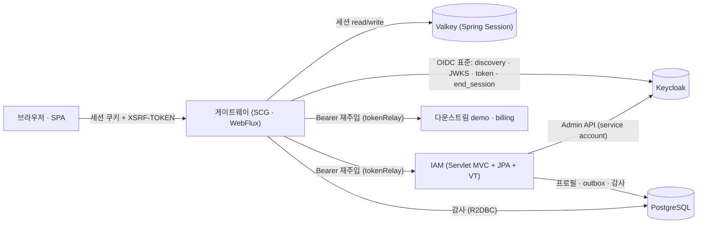
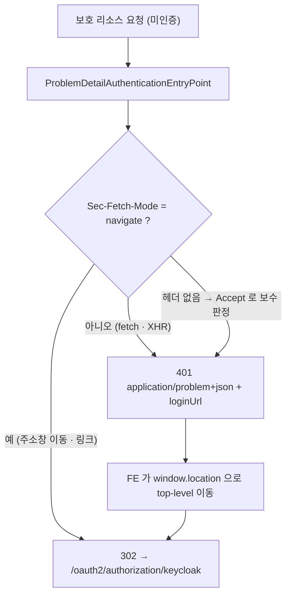
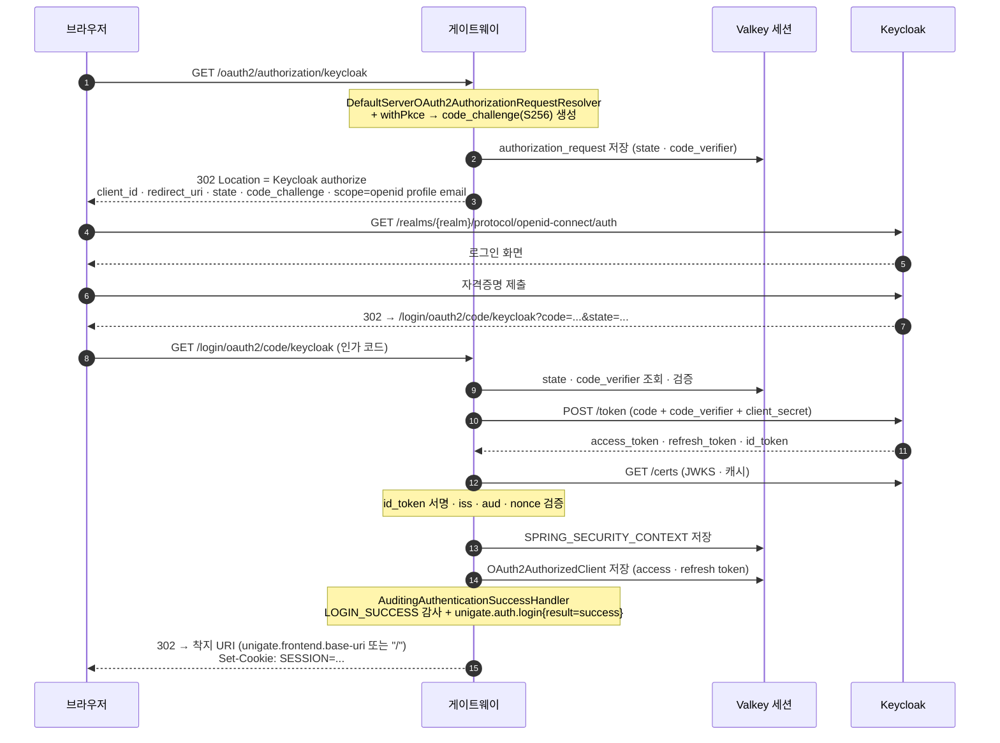
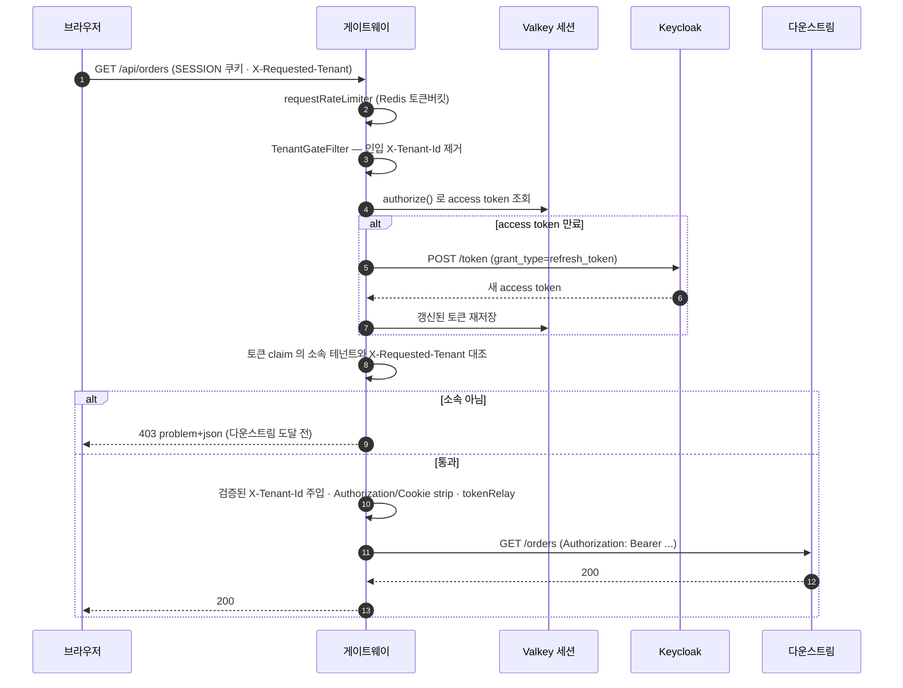
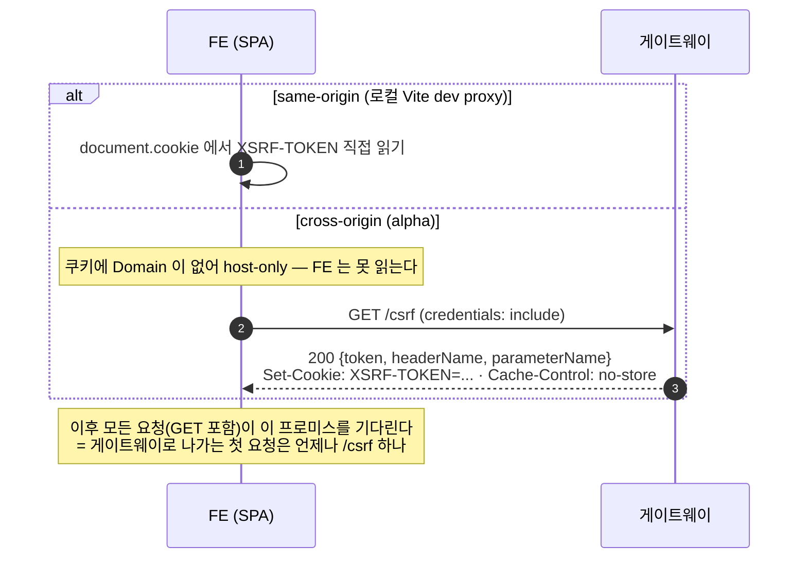
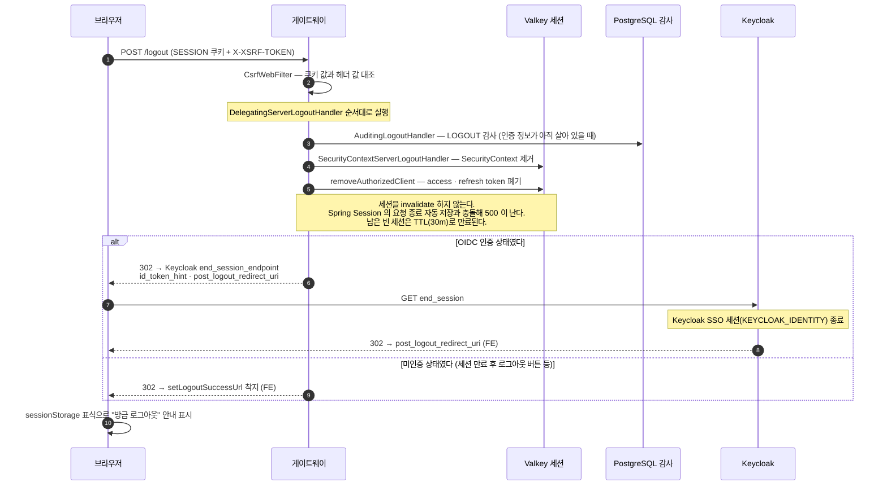
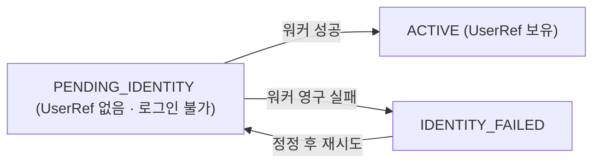
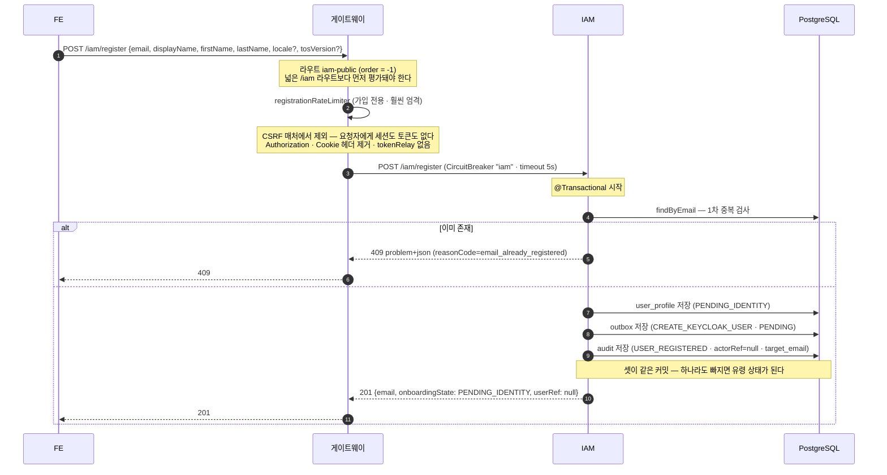
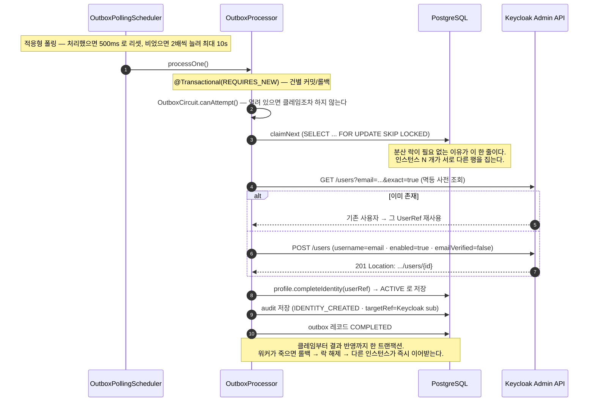
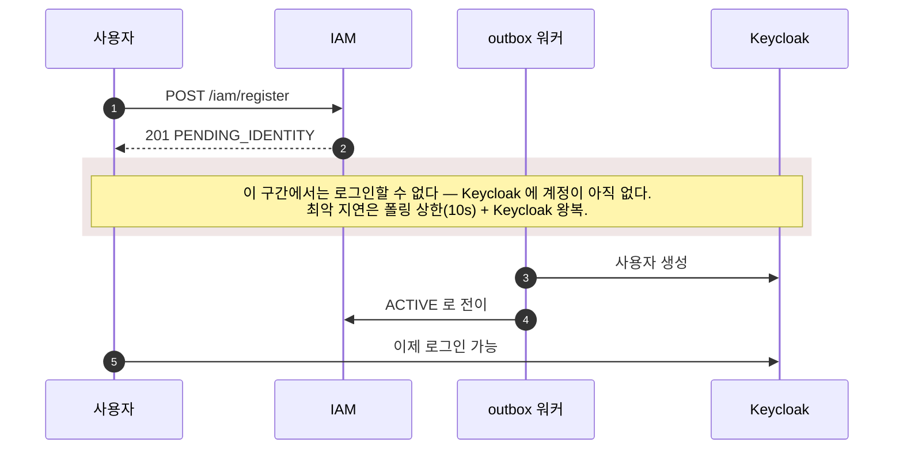

# unigate 인증 시퀀스 — 로그인 · 로그아웃 · 회원등록

> 현재 코드 기준의 **동작 시퀀스 참조 문서**다. 설계 근거는 `docs/PROJECT_SETUP_PLAN.md` ·
> `docs/IAM_PLATFORM_DECISION.md` 에 있고, 이 문서는 **"요청이 실제로 어디를 어떤 순서로 지나는가"** 만 다룬다.
> 각 단계 옆에 근거 코드 경로를 달아 두었으므로, 코드가 바뀌면 이 문서도 함께 바뀌어야 한다.

## 1. 목적(Goal)

세 흐름을 한 장으로 붙잡는다.

| 흐름 | 주체 | 한 줄 요약 |
|---|---|---|
| 로그인 | 게이트웨이(OAuth2 Client · BFF) | Authorization Code + PKCE. 토큰은 **세션에만** 남고 브라우저는 세션 쿠키만 받는다 |
| 로그아웃 | 게이트웨이 | 세션의 민감 내용 폐기 + **Keycloak 세션까지** 종료(RP-Initiated Logout) |
| 회원등록 | IAM(Resource Server) | 공개 라우트로 받아 **IAM DB 먼저 커밋**, Keycloak 반영은 outbox 워커가 나중에 |

## 2. 배경(Context) — 등장 요소

핵심 경계 두 가지만 기억하면 나머지는 따라온다.

- **토큰은 브라우저로 내려가지 않는다.** 게이트웨이 세션(=Valkey)에만 있고, 다운스트림 호출 직전에
  `tokenRelay` 가 `Authorization: Bearer` 로 재주입한다.
- **Keycloak 을 Admin 으로 쓰는 것은 IAM 뿐이다.** 게이트웨이는 OIDC 표준 엔드포인트만 쓴다
  (`CLAUDE.md` §5.1 · `IAM_PLATFORM_DECISION.md` D7).

---

## 3. 로그인 (Authorization Code + PKCE, BFF)

### 3.1 미인증 요청이 갈리는 지점 — 302 인가 401 인가

같은 "미인증" 이지만 응답이 두 갈래다. 판정은
`gateway/.../gatewayIn/ProblemDetailAuthenticationHandlers.kt` 의 `isTopLevelNavigation()` 이 한다.

> **왜 이렇게 갈라야 하나:** `fetch()` 가 302 를 자동으로 따라가면 Keycloak 로그인 페이지를 XHR 로
> 요청하게 되고, 그 응답이 CORS 에 막혀 콘솔에는 **"CORS 에러" 만** 뜬다. 진짜 원인(미인증)이 가려진다.
> 애매하면 401 을 준다 — 잘못된 302 는 원인을 감추지만, 잘못된 401 은 원인을 정확히 말해준다.

### 3.2 로그인 전체 시퀀스

| 단계 | 근거 코드 |
|---|---|
| PKCE 부착 | `config/SecurityConfig.kt` `authorizationRequestResolver()` |
| 토큰 세션 저장 | `config/SecurityConfig.kt` `authorizedClientRepository()` (`WebSessionServerOAuth2AuthorizedClientRepository`) |
| 감사 · 메트릭 · 착지 | `gatewayIn/AuditingAuthenticationHandlers.kt` `AuditingAuthenticationSuccessHandler` |
| 저장된 요청 무시 | `SecurityConfig.requestCache` + 진입점/성공핸들러 각각의 `NoOpServerRequestCache` |

**착지 주소를 세 곳에서 통제하는 이유**: `RedirectServerAuthenticationSuccessHandler` 는
`requestCache.getRedirectUri(exchange).defaultIfEmpty(location)` 이라 **저장된 요청이 설정값을 이긴다.**
alpha 에서 미인증 로그아웃이 남긴 `/login?logout` 이 저장돼 로그인 성공 후 404 로 착지한 적이 있다
(`docs/learning/42`). 그래서 저장(진입점)·읽기(성공 핸들러)·빌더 설정 셋 다 끈다.

### 3.3 로그인 이후 — 인증된 요청과 토큰 갱신

로그인 시퀀스의 산출물(세션 속 토큰)이 실제로 쓰이는 자리다.

- 토큰 갱신 주체는 **토큰을 쓰는 쪽**이다 — `TokenRelayConfig` 의 `refreshToken()` provider.
- 테넌트 게이트도 repository 가 아니라 **manager** 로 토큰을 읽는다. repository 로 읽으면 만료 토큰이
  그대로 나와 게이트를 거는 라우트만 500 이 된다(`TenantGateFilter` KDoc).
- 게이트는 claim 만 본다(coarse). 자원 소유권 판단은 다운스트림 몫이다.

---

## 4. 로그아웃 (RP-Initiated Logout)

### 4.1 먼저 — CSRF 토큰 부트스트랩

`POST /logout` 은 CSRF 보호 대상이라 토큰이 먼저 필요하다. 출처가 배포 형태에 따라 갈린다.

> **GET 까지 기다리게 한 이유는 성능이 아니라 정확성이다.** 게이트웨이는 `XSRF-TOKEN` 쿠키가 없는
> 요청마다 새 토큰을 발급한다. 쿠키 없는 첫 화면에서 `/csrf` 와 다른 요청이 **동시에** 나가면
> 나중 응답이 쿠키를 덮어 double-submit 이 깨진다 — **첫 로그아웃만 403**, 새로고침하면 성공하는
> 형태다. 순차 호출로는 재현되지 않는다(`samples/frontend-demo/src/api/client.ts` · `csrf.ts`).

### 4.2 로그아웃 전체 시퀀스

| 지점 | 근거 코드 |
|---|---|
| 핸들러 체인 · 착지 | `config/SecurityConfig.kt` `logout { }` · `oidcLogoutSuccessHandler()` |
| 감사 | `gatewayIn/AuditingAuthenticationHandlers.kt` `AuditingLogoutHandler` |
| 로그아웃 안내 | `samples/frontend-demo/src/session/logoutNotice.ts` |

**게이트웨이 세션만 지우면 로그아웃이 아니다.** Keycloak SSO 쿠키가 살아 있으면 다음 보호 리소스
접근 시 authorization code 흐름이 **비밀번호 없이 자동 완료**되어, 사용자 체감은 "로그아웃이 안 된"
상태가 된다. 그래서 `end_session_endpoint` 왕복이 필수다.

**두 착지 값이 갈리는 이유**: `setPostLogoutRedirectUri` 는 Keycloak 에 넘기는 문자열이라 `{baseUrl}`
플레이스홀더가 살아 있지만, `setLogoutSuccessUrl` 은 `URI` 로 직접 리다이렉트해 치환 주체가 없다.
같은 문자열을 넣으면 브라우저가 `/%7BbaseUrl%7D/` 로 가서 404 다.

---

## 5. 회원등록 (공개 라우트 + outbox)

### 5.1 왜 두 단계인가

가입은 **IAM DB 쓰기 + Keycloak 사용자 생성** 이라는 두 시스템 쓰기다. 두 시스템에 걸친 원자성은
불가능하므로, 둘 다 로컬 DB 쓰기가 되도록 **"프로필 저장 + outbox 지시 저장" 을 한 트랜잭션**으로 묶고
Keycloak 반영은 워커에게 넘겼다(`IAM_PLATFORM_DECISION.md` §6.3 · §16).

그 대가가 `OnboardingState` 라는 중간 상태다.

### 5.2 1단계 — 동기 구간 (요청 → 201)

- **201 인 이유**: outbox 라 Keycloak 반영은 아직이지만 IAM 입장에서 프로필 리소스는 실제로 생성됐다.
  미완성인 것은 신원 연결이고 그건 `onboardingState` 가 드러낸다.
- **`userRef` 는 가입 직후 항상 null 이다.** FE 는 그 값이 아니라 `onboardingState` 를 봐야 한다.
- 사전 조회와 INSERT 사이 경합은 DB unique 제약이 막고, `DataIntegrityViolationException` 을 잡아
  **409 로 되돌린다**(처리하지 않으면 500 이 나가 사용자에게는 서버 오류로 보인다).

### 5.3 2단계 — 비동기 구간 (outbox 워커 → Keycloak)

**실패 분류가 이 워커의 핵심이다.**

| 예외 | 분류 | 결과 |
|---|---|---|
| `IdentityAlreadyExistsException` | Permanent | 프로필 → `IDENTITY_FAILED`, 감사 `IDENTITY_CREATION_FAILED`, 레코드 DEAD |
| `IdentityProviderUnavailableException` | Retryable | 회로에 실패 계상, 상한까지 재시도 |
| `ProfileConcurrentlyModifiedException` | Retryable (**회로 미계상**) | 우리 DB 안의 경합이지 Keycloak 장애가 아니다 |
| 그 밖의 예외 | Permanent | "모르는 실패는 사람이 봐야 한다" — DEAD 로 보내 DLQ 에서 보이게 한다 |

> 미분류 예외를 그대로 전파시키면 `@Transactional` 롤백이 **클레임과 attempts 증가까지 되돌려**
> 같은 레코드를 영원히 다시 집는다. 재시도 상한도 DEAD 도 그 경로에는 닿지 못한다(P9b 가 고친 루프).

### 5.4 가입 직후 로그인이 안 되는 구간

FE 는 이 구간을 **"처리 중"** 으로 표현해야 한다(`samples/frontend-demo/src/components/PendingBadge.tsx`).

---

## 6. 예외 · 에러 처리(Error Handling)

| 상황 | 응답 | 어디서 |
|---|---|---|
| 미인증 · 브라우저 내비게이션 | 302 → Keycloak | `ProblemDetailAuthenticationEntryPoint` |
| 미인증 · XHR | 401 `problem+json` + `loginUrl` | 같은 곳 |
| 인가 실패 · CSRF 토큰 불일치 | 403 `problem+json` (`access_denied`) | `ProblemDetailAccessDeniedHandler` |
| 소속 아닌 테넌트 요청 | 403 (다운스트림 도달 전) | `TenantGateFilter` |
| 세션 토큰 검증 실패(만료·서명) | 재인증 경로 (500 아님) | `TenantGateFilter.resolveTenants` `onErrorMap` |
| rate limit 초과 | 429 (+ `Retry-After`) | `RateLimitConfig` · `RetryAfterFilter` |
| 다운스트림 · IAM 장애 | 503 fallback | `FallbackRoutes` + resilience4j |
| 가입 이메일 중복 | 409 (`email_already_registered`) | `RegisterController` |
| 가입 검증 실패 | 400 | `@Valid` + `RegisterRequest` 제약 |
| GW 우회 직접 호출(:8090) | 401 `WWW-Authenticate: Bearer` | `IamSecurityConfig` (최종 방어선) |

**403 이 났을 때 어느 조각이 빠졌는지는 응답만 봐서는 구분되지 않는다.** CSRF 세 조각(쿠키 저장소 ·
XOR 핸들러 해제 · 구독 강제 필터)은 하나만 빠져도 증상이 똑같이 403 이다 —
`org.springframework.security.web.server.csrf` 를 TRACE 로 켜야 갈린다(`CLAUDE.md` §6.1).

---

## 7. 운영 고려사항(Operations)

| 항목 | 값 · 위치 | 주의 |
|---|---|---|
| 세션 TTL | `spring.session.timeout: 30m` | 세션 저장소(Valkey)가 곧 **인증 가용성**이다 |
| access token | 5분(realm 설정) | 만료 구간이 반드시 생긴다 → `refreshToken()` provider 필수 |
| 토큰 claim 반영 지연 | 최대 access token 수명 | 멤버십을 해제해도 발급된 토큰은 옛 소속을 담는다(`docs/learning/33`) |
| outbox 최악 반영 지연 | 폴링 상한 10s | `OutboxPollingScheduler.MAX_INTERVAL` |
| 가입 rate limit | 지속 분당 12회 · 버스트 3건 | `unigate.ratelimit.register.*` |
| IAM timeout | 5s (다운스트림은 2s) | 짧게 잡으면 **사용자에겐 실패인데 계정은 생기는** 상태가 된다 |
| 감사 스트림 | GW(R2DBC) · IAM(JPA) 두 갈래 | 가입과 신원 생성은 trace_id 가 아니라 **target_email** 로 이어진다 |

### 환경 분리 배포 시 반드시 함께 맞출 값

FE 를 게이트웨이와 다른 호스트에 두는 순간 **여섯 곳이 동시에 맞아야** 한다. 하나만 어긋나도
증상은 "로그인이 안 된다" 하나로 보인다.

1. `unigate.frontend.base-uri` — 로그인·로그아웃 **양쪽** 착지
2. Keycloak client `redirectUris` — 인가 코드 배달 주소(착지가 아니다)
3. Keycloak client `post.logout.redirect.uris` — 로그아웃 착지
4. `unigate.cors.allowed-origins` — 정확한 origin(와일드카드 불가). **`/csrf` 의 접근 제어가 곧 이것이다**
5. `CorsConfig.EXPOSED_HEADERS` — cross-origin 에서 FE 가 읽어야 하는 응답 헤더(요청 허용 목록과 다른 목록)
6. `unigate.iam.security.expected-audience` + realm 의 audience mapper

## 8. 롤백 · 장애 대응(Runbook)

| 증상 | 먼저 볼 것 |
|---|---|
| 로그인은 되는데 다운스트림만 401 | 세션에 토큰이 있는가 — `authorizedClientRepository` 빈이 세션 기반인지 |
| 로그인 성공 후 엉뚱한 곳 착지 | 설정이 아니라 **그 값을 읽는 코드**. 저장된 요청이 이기고 있지 않은지 |
| 로그아웃 후 재로그인이 비밀번호 없이 통과 | `end_session_endpoint` 왕복이 실제로 일어났는지(discovery 가 살아 있는지) |
| 첫 로그아웃만 403 | `/csrf` 와 다른 요청이 병렬로 나가 쿠키가 덮이지 않았는지 |
| 가입은 201 인데 로그인 불가 | 정상 구간일 수 있다 → `onboardingState` 확인. `IDENTITY_FAILED` 면 DLQ 확인 |
| outbox 가 멈춤 | `OutboxCircuit` 이 열렸는지 · `GET /iam/admin/outbox/dead` 로 DEAD 레코드 확인 |
| 같은 레코드가 무한 재시도 | DB 예외로 트랜잭션이 abort 된 경우(알려진 한계). DB 상태부터 본다 |

**롤백 관점의 비가역 지점**: 가입 요청 하나가 성공하면 Keycloak 사용자라는 **영구 상태**가 만들어진다.
게이트웨이 설정 롤백으로 되돌아가지 않으므로, 가입 라우트의 rate limit 은 되돌릴 수 없는 것을 막는
방어선이다.

---

## 관련 문서

- `docs/IAM_PLATFORM_DECISION.md` — 왜 게이트웨이가 인증을 맡고 IAM 이 Admin 을 봉인하는가(D4 · D7)
- `docs/KEYCLOAK_REALM_SETUP.md` — client · mapper · redirect URI 구성
- `docs/learning/04` 05 09 26 42 — BFF · TokenRelay · RP-Initiated Logout · SPA 통합 · 설정이 덮이는 함정
- `docs/learning/17` 18 22 25 — service account · outbox 워커 · DLQ · 보상
- `docs/ALPHA_CONSOLE_SCENARIOS.md` — 위 흐름을 alpha 콘솔에서 재연하는 방법
