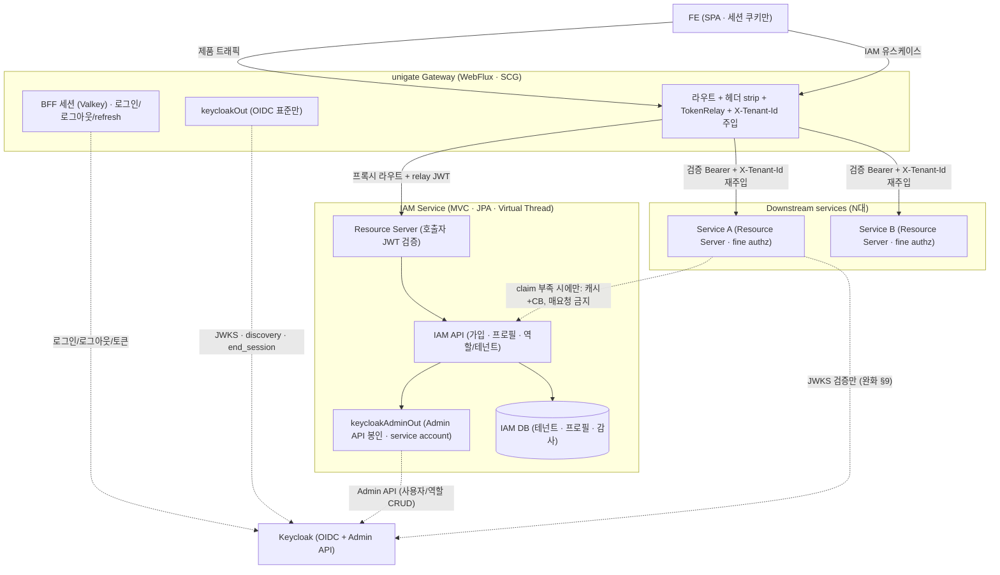
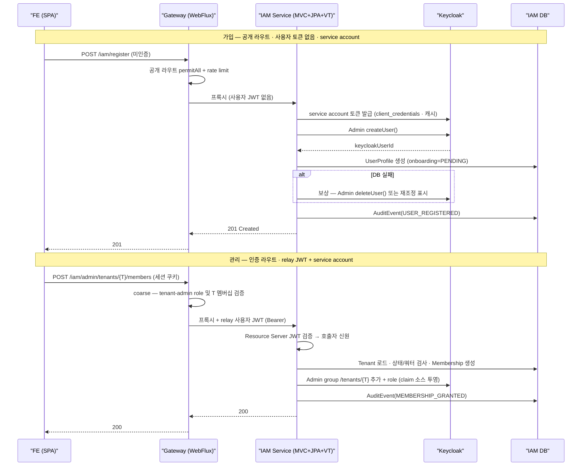

# IAM 플랫폼 확장 결정 문서 (Target Architecture)

> **상태:** 방향·세부 결정 **모두 확정**(O1~O4 닫힘). **Phase 8 착수 명세**로 사용한다.
> 이 문서는 "게이트웨이는 인증만"이라는 대전제를 **MSA IAM 플랫폼**으로 확장하는 목표 아키텍처를,
> 코드보다 먼저 못박는다. 근거는 아키텍처 검토(코드베이스 실측)와 아래 참조 문서다.
>
> 관련: [`PROJECT_SETUP_PLAN.md`](PROJECT_SETUP_PLAN.md) · [`KEYCLOAK_REALM_SETUP.md`](KEYCLOAK_REALM_SETUP.md) ·
> `docs/plans/PHASE_ROADMAP.md`(작업용) · [`learning/06`](learning/06-gateway-trust-boundary-header-forgery.md)

---

## 1. 목적 (Goal)

unigate 의 현재 대전제는 **"게이트웨이는 인증만, 인가는 다운스트림"**(`CLAUDE.md` 최상단)이다.
사용자는 이를 **MSA IAM 플랫폼**으로 확장한다 — 회원관리·권한·테넌트를 다운스트림이 아니라
**공통 프레임워크가** 담당하고, **다운스트림은 Keycloak 을 절대 직접 타지 않는다.**

이 문서는 그 확장의 **목표 아키텍처를 확정**한다. §4(닫힌 결정)가 판단의 근거이고, §6~§10 이 그 실질이다.

## 2. 배경 (Context)

- 현재(Phase 1 완료): 로그인(BFF)·세션(Valkey)·TokenRelay·헤더 strip 까지 동작. 다운스트림 1대(샘플).
- 사용자 구상: ① Keycloak Admin API 보강 ② 로그아웃 ③ 회원 등록(가입) ④ 권한/테넌트를 공통
  프레임워크가 처리 ⑤ 다운스트림 N대 전제.
- **하드 목표(절대 조건):** 다운스트림 앱은 **인증·관리 흐름에서 Keycloak 에 직접 접근하지 않는다.**
  (공개 JWKS 조회는 예외 — §9)
- 이미 깔린 토대:
  - `settings.gradle.kts` 에 모듈 추출 지점이 주석으로 예약됨. `build-logic` 이 `common`/`gateway`
    convention 으로 **스택별 분리 구조** → 두 번째 모듈을 받을 골격이 있다.
  - `unigate-downstream-demo` client 는 Standard flow·Direct grants·Service accounts **전부 OFF**
    (`KEYCLOAK_REALM_SETUP.md`) → **다운스트림은 Keycloak 에 능동적으로 말 걸 자격증명이 없다.**
    하드 목표의 절반이 구조적으로 이미 강제돼 있다.

## 3. 확정된 방향 (Decided)

| # | 결정 | 근거 |
|---|---|---|
| **D1** | IAM 플랫폼 방향으로 간다. `gateway` 모듈 + **별도 `iam` 서비스 모듈**로 구성. | MSA·확장 목표. 추출 골격 이미 존재 |
| **D2** | **하드 목표**: 다운스트림은 인증·관리 흐름에서 Keycloak 무접근. | 사용자 명시 |
| **D3** | 흐름: **FE→GW→다운스트림**(제품), **FE→GW→IAM**(IAM 유스케이스). | 사용자 구상 |
| **D4** | GW–IAM 관계는 **모델 A** — IAM 은 GW 의 **또 하나의 프록시 라우트 + Resource Server**. 모델 B(세션 파사드)는 결합도 때문에 기각. | Phase 1 라우트·strip·relay 기계 재사용, 저결합 |
| **D5** | 다운스트림↔IAM 은 **토큰 claim 자족이 기본**. IAM 동기 호출은 핫패스 배제, 휘발성·대용량 데이터에만 캐시+CB. | 장애 전파·God-IAM 방지 |
| **D6** | **IAM 스택 = Spring Boot MVC + JPA + Virtual Thread.** 게이트웨이는 WebFlux 유지. | §11.1 |
| **D7** | 게이트웨이 `keycloakOut` 은 **OIDC 표준(JWKS·discovery·end_session·token)만** 유지. Admin API 는 넣지 않는다. | 원칙 순수성. Admin 은 IAM 소관 |
| **D8** | **모듈 분리 도입 시점 = Phase 8.** 지금은 준비만(추출 지점 유지 + keycloakOut 순수 유지). | §13 안티패턴 |

### D4·D5 보강 — 토큰 컨텍스트가 둘이다

IAM 서비스는 두 종류의 인증을 다룬다. 헷갈리면 설계가 무너진다.

1. **호출자 신원** = GW 가 relay 한 **사용자 JWT**. IAM 이 Resource Server 로 검증. 단 사용자 토큰에는
   `manage-users` 가 없으므로 **Admin API 호출에는 불충분**하다.
2. **Keycloak Admin 인증** = IAM 자신의 **service account 토큰**(client_credentials). 사용자 토큰과 별개로
   IAM 이 반드시 보유.

가입은 사용자 토큰이 **없는** 상태이므로 IAM 라우트를 둘로 나눈다:
- **공개 라우트**(`/iam/register` 등): permitAll · 사용자 토큰 없음 · IAM 이 service account 로 생성 ·
  **강한 rate limit 필수**(스팸 가입·계정 열거).
- **인증 라우트**(`/iam/profile`, `/iam/admin/**`): authenticated · relay JWT 로 호출자 식별 · Admin 은
  service account 로.

## 4. 닫힌 결정 (Resolved)

§4 는 원래 "Phase 8 전 확정 필요"한 열린 결정이었다. 아래처럼 모두 닫혔다.

| # | 결정 대상 | 결의 | 상세 |
|---|---|---|---|
| **O1** | IAM 도메인 실질 무게 | **진행** — IAM 서비스 신설 | 얇은 패스스루가 아님을 **§6 에서 논증**(관문 통과) |
| **O2** | 다운스트림의 JWKS 접근 | **완화** — 공개 JWKS 조회 허용 | 인증·관리 흐름만 Keycloak 무접근. **§9** |
| **O3** | 멀티테넌시 모델 | **단일 realm + tenant claim** | realm-per-tenant 아님. **§7** |
| **O4** | 재범위화 승인 | **승인** — 인증 게이트웨이 → IAM 플랫폼 | 사용자 명시 승인. CLAUDE.md 반영은 **§14**(2단계) |

> **O1 이 관문이었다.** IAM 이 Keycloak Admin API 를 1:1 로 되파는 얇은 프록시라면 무의미한 간접 계층이다.
> §6 에서 IAM 도메인을 "Keycloak 이 이미 하는 것"과 대조해 **Keycloak=신원 저장소, IAM=멤버십·테넌트·정책
> 오케스트레이터**로 역할이 겹치지 않음을 논증한다 — 그것이 관문 통과의 근거다.

## 5. 책임 경계 (Design)

- **GW** = 인증 + coarse 정책 게이트(route-level role) + 테넌트 식별·전파(검증된 `X-Tenant-Id` 주입) + 인입 헤더 strip.
- **IAM 서비스** = 가입·프로필·역할/테넌트 관리(도메인) + Keycloak Admin 봉인(anti-corruption) + 감사.
- **다운스트림(N대)** = resource-level fine 인가(소유권·상태). 토큰 claim 자족.
- **Keycloak 접점은 GW 와 IAM 에만.** 다운스트림→Keycloak 은 JWKS 서명 검증에 한정(§9).

`X-Tenant-Id` 검증·전파는 §7.3 에서, coarse/fine 경계는 §8 에서 구체화한다.



## 6. IAM 도메인 실질 정의 (O1 관문 닫기)

> **한 줄:** Keycloak 은 *신원 저장소*, IAM 은 *멤버십·테넌트·정책 오케스트레이터*다. 겹치지 않으므로 패스스루가 아니다.

### 6.1 IAM 이 소유하는 것 vs Keycloak 이 이미 하는 것

| 관심사 | Keycloak 이 이미 하는 것 | IAM 이 더하는 것 (무엇이 다른가) |
|---|---|---|
| **신원/자격증명** | 사용자·비밀번호 정책·MFA·페더레이션 **완전 담당** | **재구현 안 함.** IAM 은 `keycloakUserId` 참조만 보관하고 전부 위임 |
| **테넌트** | group/org 는 있으나 **도메인 의미 없음**(상태·쿼터·수명주기 개념 부재) | 테넌트를 **애그리거트로 소유**: 상태기계(PENDING→ACTIVE→SUSPENDED→ARCHIVED)·쿼터(maxUsers·feature flag)·메타. Keycloak group 은 토큰 claim 용 **투영본**일 뿐 |
| **프로필** | user attribute(평면 key-value, 검증·버전 없음, 인증 목적) | **앱 고유 프로필** 소유: 표시 설정·locale·avatar 참조·온보딩 상태·ToS 동의 시각. **토큰에 실으면 안 되는** 구조화·검증된 데이터 |
| **멤버십(user↔tenant)** | group 소속(단일·평면) | **관계 애그리거트**: 한 사용자가 N테넌트에 각기 다른 역할·초대 상태·joined-at·invited-by. Keycloak 이 못 하는 다대다 |
| **역할/권한 오케스트레이션** | 역할 저장·할당(단발) | 할당 **정책**: "테넌트 T 에 role X 로 합류 → Y 도 부여 + 프로필 생성 + 감사". Keycloak 은 최종 역할만 저장, **전이 결정은 IAM** |
| **감사** | admin/login event(자체) | **비즈니스 감사**: 누가 누구를 온보딩·쿼터 변경·역할 부여 사유. P4 gateway 감사(R2DBC)와 **별개 스트림**(§12) |

**패스스루가 아님의 논증:** Keycloak 은 "이 사람이 유효한가"(인증)를 안다. IAM 은 "이 사람이 어느 테넌트에
어떤 역할·프로필·이유로 속하는가"(멤버십/정책)를 안다. IAM 은 Keycloak 을 **여러 저장소 중 하나로 사용**하며,
인증에 필요한 부분집합(group·role·tenant claim)만 Keycloak 에 **투영**한다. Keycloak 은 쿼터·수명주기·초대·동의를
절대 모른다 — 그것이 도메인 무게다.

### 6.2 도메인 모델 후보 (엔티티/VO 수준, 스키마 아님)

- **`Tenant`**(애그리거트 루트): `TenantId`(VO) · `TenantStatus`(enum) · `TenantQuota`(VO: maxUsers·featureFlags) · displayName
- **`Membership`**(루트): `MembershipId` · `TenantId` · `UserRef`(VO — keycloakUserId 봉인) · `TenantRole`(VO) · `MembershipStatus`(INVITED/ACTIVE/REVOKED) · invitedBy · joinedAt
- **`UserProfile`**(루트): `UserRef` · displayName · locale · avatarRef · `OnboardingState` · `ConsentRecord`(VO: tosVersion·acceptedAt)
- **`AuditEvent`**: actor · action · target · reason · occurredAt
- **아웃바운드 포트**: `IdentityProviderPort`(Keycloak Admin: createUser/assignGroup/assignRole — `keycloakAdminOut` 봉인) · `AuditPort`

> **핵심 seam:** `UserRef` VO 가 anti-corruption 경계다. IAM 도메인은 Keycloak 타입을 절대 들고 있지 않고
> 불투명한 subject id 만 감싼다 — `TokenVerifierPort` 가 OIDC 표준만 의존하는 것과 같은 봉인 원리.

### 6.3 대표 유스케이스 오케스트레이션

**UC-1 가입(Register)** — **outbox 패턴**(§16 에서 확정). IAM DB 를 먼저 쓰고 Keycloak 반영은 워커가 한다:

1. 입력 검증(email·displayName) — 도메인 VO
2. **IAM DB 트랜잭션 하나로** 다음을 함께 쓴다(로컬 트랜잭션이라 원자적):
   - `UserProfile`(onboarding=`PENDING_IDENTITY`, UserRef 아직 없음)
   - `OutboxRecord(CREATE_KEYCLOAK_USER)`
   - `AuditEvent("USER_REGISTRATION_REQUESTED")`
3. **커밋 — 여기서 사용자에게 응답한다(202 Accepted 성격).**
4. 워커가 outbox 를 폴링 → `IdentityProviderPort.createUser()`(service account 토큰) → `keycloakUserId` 획득
5. `UserProfile.UserRef` 채우고 onboarding=`ACTIVE` 로 전이 + outbox 레코드 완료 처리

> **왜 순서를 뒤집었나.** "Keycloak 먼저 → IAM DB" 순서는 2 이후 3 이 실패하면 **Keycloak 에 고아 사용자**가
> 남고, 그 보상(삭제) 역시 실패할 수 있어 **끝이 없다.** outbox 는 원자성이 필요한 지점을 **IAM DB 한 곳**으로
> 모으고, 바깥 시스템(Keycloak) 반영은 **재시도 가능한 비동기 작업**으로 바꾼다. 실패해도 outbox 레코드가
> 남아 있어 "잃어버리지 않는다"가 보장된다.

**대가 (반드시 인지할 것):**
- **가입 직후 로그인이 안 될 수 있다.** Keycloak 반영 전이므로 FE 는 "처리 중" 상태를 다뤄야 한다.
  즉시성이 필요하면 워커 대신 **커밋 직후 동기 트리거 + 실패 시 outbox 폴백**으로 완화할 수 있다(하이브리드).
- **이메일 중복을 늦게 발견한다.** 중복 판정의 SoT 는 Keycloak 인데 IAM DB 를 먼저 쓰므로, 4 에서야
  `409` 를 만난다. → `UserProfile` 에 **실패 상태**(`IDENTITY_FAILED`)가 필요하고 사용자에게 알릴 경로가 있어야
  한다. IAM DB 에 email unique 를 걸어 **1차 방어**는 하되 그것이 SoT 는 아니다(경합·기존 사용자 존재).
- **워커·폴링 인프라가 필요하다.** 단일 인스턴스 가정이면 단순하지만, 다중 인스턴스면 레코드 잠금
  (`SELECT ... FOR UPDATE SKIP LOCKED`)이 필요하다.
- **최소 1회 실행**이므로 Keycloak 호출은 **멱등**해야 한다(이미 생성됐는지 조회 후 생성).

**이 분산 일관성이 곧 도메인 복잡도이자 패스스루가 아니라는 증거**다(§6 O1 관문 논증의 실체).

**UC-2 테넌트 배정(Assign / 초대 수락):**
1. 호출자 = relay JWT(§D4). coarse: 대상 테넌트 T 의 tenant-admin 역할 보유 확인(GW coarse gate, §8)
2. Tenant T 로드 → status=ACTIVE·쿼터 미초과 확인(**Keycloak 불가한 도메인 규칙**)
3. `Membership(user, T, role)` 생성(또는 INVITED)
4. `IdentityProviderPort` 로 Keycloak group `/tenants/{T}` 추가 + 역할 할당 → §7 의 claim 소스에 **투영**
5. `AuditPort.record("MEMBERSHIP_GRANTED", reason)` → 커밋
- 쿼터 체크 + 상태 게이트 + 투영이 도메인 로직. group-add 단독은 패스스루지만 그 주변 정책이 가치다.

**UC-3 이메일 변경(ChangeEmail)** — outbox + **보상**(2026-07-27 구현). UC-1 과 구조가 같고
**되돌릴 것이 있다**는 점이 다르다.

1. 도메인이 요청을 받아 `pendingEmail` 에 세운다. **확정 값(`email`)은 건드리지 않는다.**
2. IAM DB 트랜잭션 하나로: 프로필 저장 + `OutboxRecord(UPDATE_KEYCLOAK_EMAIL)` + 감사
3. **202 Accepted** — 확정 값과 대기 값을 함께 반환한다(클라이언트가 "반영 중" 을 표현해야 한다)
4. 워커: Keycloak `PUT /users/{id}`(email, `emailVerified=false`) → 성공 시 `pendingEmail` 을
   확정 값으로 **승격**
5. 영구 실패(그 주소가 남의 것) 시 **보상**: `pendingEmail` 폐기 + `EMAIL_CHANGE_FAILED` 감사

**설계 근거 (되돌릴 것을 작게 만든다):** 요청 즉시 `email` 을 덮어쓰면 ① 반영 전 구간에서
사본이 거짓말을 하고 ② 실패 시 값이 조용히 되돌아가며 ③ 복원용 옛 값이 또 하나의 진실 후보가
된다. 값을 나누면 보상이 **필드 하나 지우기**로 줄고, 확정 값은 전 구간에서 흔들리지 않는다.

**규칙:**
- 보상은 **영구 실패에서만.** 재시도 가능 실패에서 취소하면 외부 시스템이 잠깐 흔들렸다는
  이유로 사용자 요청이 사라진다.
- 외부 반영이 **먼저**, 로컬 확정이 나중. 반대면 실패 시 어긋남을 되돌릴 근거가 없다.
- 보상이 실패해도 outbox 레코드는 **DEAD 로 확정**한다. 못 되돌린 것과 다시 시도할 이유는 다르다.
- `emailVerified` 를 false 로 되돌린다 — 검증되지 않은 주소가 승격되면 비밀번호 재설정 경로가
  계정 탈취 경로가 된다.

> **미결:** 사용자에게 실패를 알리는 경로가 없다(감사만 남는다). 동시 요청은 도메인의
> "진행 중이면 거절" 로 막지만 그건 read-then-write 라 낙관적 락이 최종 방어선이다.

## 7. 단일 realm 테넌시 모델 (O3)

### 7.1 Keycloak 에서 테넌트 표현

| 후보 | 평가 |
|---|---|
| realm role `tenant-{id}` | 단순하나 role 폭증, 계층 불가 |
| **group `/tenants/{id}`**(권장) | 서브그룹으로 테넌트 계층 표현, group attribute 보유 가능. 멤버십 다대다와 정합 |
| user attribute `tenant_id` | 최단순이나 **N테넌트 소속 불가**(단일값) → 도메인 모델(§6.2 Membership 다대다)과 충돌 |

**권장: group per tenant**(`/tenants/{tenantId}`), 테넌트별 역할은 `tenant-{id}-{role}` realm role 또는 composite role.

### 7.2 claim 발행 (mapper 패턴, audience mapper 와 대비)

- audience mapper(`KEYCLOAK_REALM_SETUP.md`)는 **정적** clientId 를 `aud` 에 주입. 테넌트는 **사용자별 동적**
  → **Group Membership mapper** 사용: 소속 group 경로를 `groups` claim 으로 발행.
- `AuthenticatedPrincipal` 은 이미 `groups: List<String>` 을 가진다 → 테넌트가 `groups` 에 `/tenants/{id}`
  형태로 실린다. **기존 도메인 모델에 새 필드 없이** 태울 수 있다.
- 가정/근거/대안:
  - **가정:** 토큰은 **소속 테넌트 배열**(`groups` 의 `/tenants/*`) + 테넌트별 역할(`realm_access.roles`)을 담고,
    요청이 대상 테넌트를 path 로 지정.
  - **근거:** 테넌트 전환에 재로그인 불필요, Membership 다대다와 정합.
  - **대안:** 사용자당 테넌트가 많아 토큰이 비대해지면 **단일 active-tenant**(로그인 시 선택, 전환 시 재발행)
    방식. 토큰 크기 vs 전환 UX 트레이드오프 → **하위 미결(§15)**.

### 7.3 GW 의 검증·전파 (`X-Tenant-Id` 주입)

- GW 필터가 `groups` claim 에서 `/tenants/*` 를 추출해 소속 테넌트 집합을 만든다.
- **대상 테넌트 식별:** path 세그먼트(`/api/{svc}/tenants/{T}/...`) 또는 FE 가 세팅한 `X-Requested-Tenant`.
- GW 가 `대상 T ∈ 소속 집합` 검사 → 통과 시 **검증된 `X-Tenant-Id` 를 주입**. **인입 위조 `X-Tenant-Id` 는
  strip 후 재주입** — Phase 1 의 Authorization strip 패턴(`GatewayRouteConfig.kt`)을 그대로 재사용한다.
  다운스트림은 검증된 헤더만 신뢰.

### 7.4 cross-tenant 차단 — 어디서 강제하나

| 계층 | 강제 대상 |
|---|---|
| **GW** | coarse: "요청 대상 테넌트에 **소속이라도** 하는가"(소속 밖이면 403, 다운스트림 도달 전) |
| **다운스트림** | fine: "테넌트 T 안에서 **이 특정 리소스** 접근 가능한가"(소유권) |
| **IAM** | 관리 동작(membership 변경)의 테넌트 격리를 자기 도메인에서 강제 |

### 7.5 테넌트 온보딩 = IAM 의 CreateTenant 유스케이스

Tenant(status=PENDING) 생성 → Keycloak group `/tenants/{id}` + tenant-admin role 생성 → 생성자에게
tenant-admin Membership 부여 → 감사 → ACTIVE 전이. **Keycloak 엔 "테넌트" 개념이 없으므로 순수 IAM
오케스트레이션**이다.

## 8. coarse/fine 인가 경계 실무 스펙

### 8.1 GW coarse 규칙 예시 (토큰 claim 만으로 판단)

- route-level role: `/api/admin/**` → `realm_access.roles` 에 `unigate-admin` 필요, 없으면 403(다운스트림 도달 전)
- tenant 멤버십 게이트: `/api/{svc}/tenants/{T}/**` → `T ∈ 토큰 테넌트`, 아니면 403
- 인증: 모든 `/api/**` → 인증 세션(Phase 1 완료분)

> **경계 규칙:** GW 는 **토큰 claim + 정적 route 설정만으로** 판단하고 **도메인 조회를 절대 하지 않는다.**
> 이것이 God-gateway 방지선이다.

### 8.2 다운스트림 fine 예시 (도메인 데이터 필요)

- "Order #123 조회 가능?" → `order.ownerId == token.sub` 또는 `order.tenantId == X-Tenant-Id` + 테넌트 내 역할.
  Order 엔티티 필요 → 다운스트림.
- "1만 달러 초과 인보이스 승인?" → 비즈니스 규칙 → 다운스트림.

### 8.3 회색지대 판정 — "이 테넌트의 이 리소스 타입 접근"

- 예: "테넌트 T 멤버는 Reports 기능 사용 가능".
- **판정 기준(한 문장):** *규칙에 다운스트림의 **리소스 타입/기능 이름**이 등장하는 순간 그것은 GW 몫이 아니다.*
  - feature 진입권을 토큰 claim(`features:[reports]`)으로 발행하면 GW 가 coarse 게이트 가능하나, GW route
    설정이 기능 이름에 결합되고 토큰이 비대·staleness → **회피**.
  - feature 가 런타임 토글이면 fresh 검사 필요 → 다운스트림(또는 D5 대로 IAM 조회+캐시).
- **권장:** 리소스 타입/기능 단위 접근은 **기본적으로 다운스트림**. GW 는 "테넌트 멤버십 + broad role"에 머문다.

### 8.4 다운스트림 강제 규약 (2026-07-27 확정 — P9g 실측 후 추가)

> §8.2 는 다운스트림이 `order.tenantId == X-Tenant-Id` 로 비교하면 된다고 적었다. 그 문장은
> **GW 가 반드시 경로에 있다**는 전제를 깔고 있었다. P9g 실측이 그 전제를 깼다 —
> `:8081` 을 직접 때리면 그 헤더는 **그냥 클라이언트가 쓴 값**이다. 아래로 대체한다.

#### 규약 1 — `X-Tenant-Id` 는 권한이 아니라 **선택자**다

토큰이 권한을 말하고, 헤더는 "내 소속 중 **어느 것으로 행동하는가**"만 고른다. 따라서
다운스트림은 **헤더 ∈ 토큰의 소속** 교집합 검사를 항상 한다. 이건 GW 검사의 중복이 아니라
**신뢰 경계가 다르기 때문**이다 — GW 의 검사는 GW 를 지난 요청만 보호한다.

#### 규약 2 — 그 검사는 **엔드포인트가 아니라 기본값**으로 건다

| 방식 | 새 엔드포인트에서 잊으면 |
|---|---|
| 컨트롤러마다 손으로 | **열린다** ← 위조 헤더는 조용히 성공하므로 증상이 없다 |
| `@RequiresTenant` 같은 opt-in 어노테이션 | **열린다** (안 붙이면 그만) |
| **`anyRequest` 인가 규칙 / 필터로 default-deny** | **닫힌다** ← 채택 |

테넌트와 무관한 경로는 **예외 목록에 한 줄로 명시**한다. 예외가 눈에 보여야 한다.
P9c 에서 IAM 관리 API 를 엔드포인트가 아니라 **접두사 전체**로 막은 것과 같은 판단이다.

#### 규약 3 — 자원 격리는 **질의에 강제**한다 (fine)

컨트롤러에서 `order.tenantId == tenant` 를 비교하는 방식은 비교를 잊으면 남의 데이터가 나온다.
대신 **테넌트 없는 질의를 제공하지 않는다.** 잊었을 때의 결과가 "남의 데이터"가 아니라
**컴파일 에러**가 되게 한다(`docs/learning/20` 의 IDOR-free 판단과 같은 방향).

실 DB 라면 base repository · Hibernate `@Filter` · PostgreSQL RLS 순으로 강도가 올라간다.
어느 쪽이든 원칙은 같다 — 테넌트 조건을 **개발자가 기억할 것**에서 **구조가 보장할 것**으로 옮긴다.

#### 규약 4 — 쓰기 경로: 요청 DTO 에 `tenantId` 를 **두지 않는다**

**default-deny(규약 2)는 쓰기 경로를 지켜주지 못한다.** 인가는 "**어느 테넌트로 행동하는가**"만
고정하고, "**어느 테넌트의 자원을 만드는가**"는 본문을 읽는 코드만 안다.

```
X-Tenant-Id: acme         ← 검증 통과. 호출자는 진짜 acme 소속이다
{ "tenantId": "globex" }  ← 인가 계층은 본문을 보지 않는다  → globex 에 자원이 생긴다
```

그래서 **자원의 소유 테넌트는 언제나 검증된 컨텍스트에서만** 온다. 요청 DTO 에 `tenantId` 필드를
두지 않으면 "본문과 헤더가 다르면 어느 쪽을 믿나"라는 문제가 **성립할 자리가 없다.**
저장소의 생성 API 도 테넌트를 파라미터로 받지 않는다(읽기의 "범위 좁히기"와 달리 쓰기는
"소유자 정하기"라 더 위험하다).

관리 API 처럼 대상 테넌트를 **명시해야만 하는** 경우는 예외다 — 그때는 도메인에서 권한을
판단한다(IAM 이 하는 방식).

#### 규약 5 — 예외 목록은 **테스트로 고정**한다

default-deny 의 약점은 **예외 추가 비용이 한 줄**이라는 것이다. 넓은 패턴 하나가 관리 API 까지
공개해도 리뷰에서 그 줄은 가볍게 지나간다. 그래서 정책 상수와 실제 엔드포인트를 대조하는
테스트를 둔다(`IamAuthorizationCoverageTest`).

- 새 엔드포인트가 공개 패턴에 걸리면 실패한다
- 관리 성격 컨트롤러가 관리 접두사 밖에 있으면 실패한다
- **죽은 예외**(대응 엔드포인트가 없는 permitAll 패턴)도 실패한다 — 지금은 무해하지만 나중에
  그 경로에 엔드포인트가 생기면 **무인증으로 태어난다**

> ⚠️ 이 테스트는 클래스패스를 스캔하므로 **프로파일을 켜지 않으면 `@Profile` 컨트롤러가 조용히
> 빠진다.** 대상을 놓치는 커버리지 테스트는 없는 것보다 나쁘다 — 있다고 믿게 만든다.

#### 규약 6 — 없는 것과 남의 것은 **같은 응답**

타 테넌트 자원에 403 을 주면 "그 id 는 존재한다"를 알려주는 셈이다. **404 로 통일**한다.

#### 지금 하지 않는 것 — 공유 스타터 모듈

규약 1~4 를 `downstream-starter` 로 배포하면 서비스마다 복붙이 사라진다. **하지만 지금은
만들지 않는다.** 소비자가 샘플 1개뿐이라 추상화가 검증되지 않은 상태이기 때문이다 —
이 저장소가 이미 두 번 경계한 실수다(`docs/learning/15` §4, P9a 의 "호출자 없는 구현").

**착수 조건:** 다운스트림이 **2대 이상**이 되는 시점. 그때 두 소비자의 요구가 갈리는 지점이
드러나고, 그게 스타터가 감출 것과 노출할 것을 정해준다.

> **네트워크 격리는 대체가 아니라 추가다.** "GW 만 다운스트림에 닿을 수 있게" 하면 규약 1 이
> 필요 없어 보이지만, 같은 클러스터 안의 다른 워크로드·SSRF·내부자를 배제하지 못한다.
> 격리는 공격 표면을 줄이는 것이고, 규약 1 은 **뚫렸을 때 데이터가 새지 않게** 하는 것이다.

## 9. O2 완화의 실무 함의 (다운스트림 JWKS)

### 9.1 다운스트림 JWKS 출처

- **완화 = 다운스트림이 Keycloak 공개 JWKS 를 직접 조회.**
- Spring 설정(placeholder):

```yaml
spring.security.oauth2.resourceserver.jwt:
  issuer-uri: https://<keycloak-host>/realms/unigate   # iss 자동검증 + discovery 로 jwks_uri 발견
  # audiences 검증은 커스텀 JwtValidator 필요 (Spring 기본은 aud 미검증)
```

- `aud` 검증(`unigate-downstream-demo` 포함)은 커스텀 validator 로 추가 — `KEYCLOAK_REALM_SETUP.md` 의
  합격 기준과 연결.

### 9.2 NetworkPolicy

- 완화 → 다운스트림 egress `→ Keycloak:443` **허용**. NetworkPolicy 는 L3/L4 라 path 필터 불가 → 다운스트림이
  이론상 token/admin 엔드포인트도 때릴 수 있으나, **다운스트림엔 client 자격증명이 없어**(downstream client
  Standard/Direct/Service accounts OFF) 의미 있는 호출 불가 → **실질 위험 낮음**.
- **대안(추후 엄격화 시):** GW 가 JWKS 프록시 재서빙 → 다운스트림 `jwk-set-uri: https://<gw-host>/...` →
  다운스트림→Keycloak egress **완전 차단**. 비용: GW JWKS 프록시 책임 + 캐시.

### 9.3 Step 8 영향

Phase 1 Step 8(다운스트림 Resource Server 승격)은 **완화 덕에 가장 단순한 경로**로 닫힌다 — `issuer-uri` 를
Keycloak 직접 지정, JWKS 프록시 복잡도 불필요. **이 결정을 Step 8 명세에 명시한다.**

## 10. FE→GW→IAM 흐름 상세

| 유스케이스 | 라우트 성격 | 토큰 컨텍스트 | Keycloak 접점 |
|---|---|---|---|
| 로그인 | GW 자체(oauth2Login), IAM 아님 | 없음→세션 생성 | GW→KC (authz code·token·JWKS) |
| **가입** | GW→IAM `/iam/register` **공개** | 사용자 토큰 없음; **IAM service account** | IAM→KC Admin (createUser) |
| 로그아웃 | GW 자체(RP-initiated), IAM 아님 | 세션→폐기 | GW→KC end_session |
| 프로필 조회/수정 | GW→IAM `/iam/profile` **인증** | relay 사용자 JWT (IAM RS 검증) | 대체로 없음(프로필=IAM DB). email 등 identity 필드 변경 시만 IAM→KC Admin |
| 관리(테넌트 배정 등) | GW→IAM `/iam/admin/**` **인증 + coarse role** | relay JWT(호출자=admin) + service account(KC 쓰기) | IAM→KC Admin (group/role) |



## 11. 트레이드오프 요약

### 11.1 IAM 스택 = MVC + JPA + Virtual Thread (D6)

WebFlux 강제는 **SCG 제약**이다(`CLAUDE.md` §1.3). IAM 은 SCG 가 아니므로 자유롭고, 워크로드가 IAM 에 더
맞는다: Keycloak Admin client 는 **블로킹**(WebFlux 에선 이벤트 루프 위반 → WebClient 곡예 필요), CRUD/관리
도메인은 JPA 의 관계·트랜잭션이 R2DBC 보다 적합, 저QPS·비임계 경로.

`CLAUDE.md` §1.3 은 VT 정답 케이스를 "Servlet MVC + JPA(블로킹 JDBC)"로 못박고 "이번 범위 밖"이라 했는데,
**IAM 이 정확히 그 시나리오**다. "VT 와 Reactive 를 섞지 말라"는 경고는 **한 앱 안** 얘기이므로, 게이트웨이
(Reactive) / IAM(VT) 로 **앱을 나눠** 쓰는 것은 위반이 아니다. `build-logic` 에 `iam.gradle.kts`(servlet/MVC)
convention 을 `gateway`(webflux) 옆에 추가하면 된다.

### 11.2 결정별 트레이드오프

| 결정 | 선택(권장) | 대안 | 선택 기준 |
|---|---|---|---|
| 테넌트 Keycloak 표현 | group `/tenants/{id}` | realm role / user attribute | 다대다 멤버십·계층 필요 여부 |
| 토큰 테넌트 표현 | 소속 배열 + path 로 대상 지정 | 단일 active-tenant | 사용자당 테넌트 수(토큰 크기) vs 전환 UX |
| JWKS 접근(O2) | 완화(직접 조회) | GW JWKS 프록시 | 엄격 격리 요구 강도 |
| 대전제 갱신 시점 | 2단계(지금 포인터, P8 본문) | 지금 즉시 교체 | Phase 1/2 framing 보존 필요성 |
| 회색지대 인가 | 리소스타입/기능=다운스트림 | 토큰 feature claim 으로 GW coarse | claim 만으로 판단되는가 vs 도메인 조회 필요한가 |

### 11.3 다운스트림↔IAM 통신 (D5)

| 케이스 | 판정 |
|---|---|
| 신원·coarse 역할·테넌트 id·email | **토큰 claim 자족 — 기본값, IAM 호출 불필요** |
| 프로필 상세·대용량 권한 목록·실시간 테넌트 메타·revocation 민감 검사 | IAM 조회가 실제로 필요할 수 있음 |
| 필요 시 통신 | 다운스트림→IAM **직접**(GW 경유 아님) + **캐시·CB·timeout 필수, 매 요청 금지** |

다운스트림→IAM 직접 호출은 하드 목표(D2)를 **깨지 않는다**(IAM≠Keycloak). 그러나 매 요청 동기 호출은
지연·결합·**장애 전파**(IAM 다운→전 다운스트림 다운)를 낳아 "God-gateway 를 God-IAM 으로 옮기는" 셈이 된다.
→ 테넌트·coarse 역할은 **로그인 시 토큰에 주입**하고 claim 자족을 기본으로 강제한다.

## 12. 로드맵 반영 (분해)

`docs/plans/PHASE_ROADMAP.md`(작업용)와 짝으로 유지한다.

| Phase | 조정 |
|---|---|
| **P1.5 로그아웃** | **gateway 유지**. OIDC 표준(`end_session`)·세션 결합. 현재 명백한 공백이라 우선 |
| **P3 N-라우트** | 게이트웨이 라우트 모델 일반화 — 나중에 IAM 도 하나의 라우트로 추가 |
| **P5 UserDirectoryPort** | **P8(IAM)로 이관** — Admin API 를 게이트웨이에 만들었다 떼지 말고 처음부터 IAM 에. GW `keycloakOut` 은 OIDC 표준만 |
| **P8 IAM 서비스 부트스트랩** | 아래 P8a~P8g |
| **P9 정책/테넌시** | 아래 P9a~P9f |

**P8 하위 분해:**
- **P8a**: `iam` 모듈 스캐폴딩(`iam.gradle.kts` MVC+JPA+VT convention · settings include · `common` 상속)
- **P8b**: 도메인 모델(Tenant/Membership/UserProfile 애그리거트 + VO)
- **P8c**: `keycloakAdminOut` 어댑터(service account 토큰 관리 + createUser/assignGroup/assignRole, 블로킹 admin REST)
- **P8d**: 가입 유스케이스 + 공개 라우트 + rate limit + **보상 트랜잭션**
- **P8e**: 프로필 유스케이스 + 인증 라우트
- **P8f**: GW 에 IAM 프록시 라우트(공개/인증 분리)
- **P8g**: IAM 감사(JPA) ↔ P4 gateway 감사(R2DBC) **두 스트림 관계 정리**

**P9 하위 분해:**
- **P9a**: 단일 realm tenant 표현(group `/tenants/{id}` + tenant-role) + Group Membership mapper
- **P9b**: GW 테넌트 claim 검증·전파 필터(`X-Tenant-Id` strip+주입, 대상∈소속 검사)
- **P9c**: 테넌트 온보딩(CreateTenant) 유스케이스
- **P9d**: coarse role gate 규칙(route-level)
- **P9e**: 다운스트림 claim 자족 + fine authz 예시(샘플)
- **P9f**: cross-tenant 차단 검증 테스트

## 13. 함정 / 안티패턴 경고

- **얇은 IAM 패스스루**: IAM 이 Keycloak Admin API 를 1:1 로 되파는 프록시면 무의미한 간접 계층이다. 가치는
  오케스트레이션·테넌트/프로필/감사 도메인·anti-corruption 에서 나와야 한다(§6 이 관문 논증).
- **도메인 실체 전 모듈 분리**: 내용 없는 `iam` 모듈을 먼저 쪼개면 `PROJECT_SETUP_PLAN.md` 의 "단일 모듈 시작,
  점진 추출" 원칙 위반. 분리는 Phase 8.
- **다운스트림 `oauth2-client` 유입**: 개발자가 401 을 만나 다운스트림이 스스로 refresh 하려는 순간 하드 목표가
  샌다. refresh 는 게이트웨이 소관. 다운스트림은 401 을 그대로 반환.
- **다운스트림의 introspection/Admin 직접 호출**: 곧 Keycloak 직접 접근. 금지.
- **동시 도입 scope creep**: 항목 1·3·4 를 한꺼번에 붙이면 프로젝트 정체성이 바뀐다(`CLAUDE.md` §1 "한 단계에
  새 개념 하나"에 반함). 저비용·무충돌인 로그아웃·라우트 모델을 먼저, 인가/테넌트는 마지막.

## 14. 운영 · 보안 고려 (SRE)

- **service account 최소권한**: `realm-admin` 전체가 아니라 `realm-management` 의 `manage-users`/`view-users`/
  `query-users` 만. GW 로그인 client 와 **관리 client 분리** 검토(blast radius 축소).
- **NetworkPolicy**: 다운스트림 파드의 Keycloak(issuer·admin) egress 는 §9.2 대로. GW·IAM 만 관리 접근.
- **다운스트림 의존성 강제**: `oauth2-resource-server` 만, `oauth2-client` **금지**.
- **로그아웃 토큰 폐기 일관성(한계)**: access token 은 stateless JWT 라 로그아웃해도 만료(현재 5분) 전까지
  다운스트림에서 유효하다. 즉시성이 필요하면 (a) 수명 추가 단축, (b) Back-Channel Logout, (c) 다운스트림
  introspection — 셋 다 트레이드오프. 현재 Access(5m)<Session(30m) 구성이 완충.

## 15. CLAUDE.md 대전제 갱신 계획 (O4)

**질문:** 최상단 "게이트웨이는 인증만, 인가는 다운스트림"을 지금 바꾸나, P8 에 바꾸나?

**판정: 2단계 (지금은 포인터, P8 에 본문 교체).**
- **지금:** CLAUDE.md 최상단에 **한 줄 forward-pointer만** 추가하고 본문 문구는 유지:
  > "이 대전제는 IAM 플랫폼으로 확장 결정됨(`docs/IAM_PLATFORM_DECISION.md`). **Phase 8부터 적용**하며
  > Phase 1~7 은 현 문구대로 진행한다."
- **P8 코드 착수 시:** 본문을 coarse/fine 경계로 교체:
  > "unigate 는 MSA 공통 IAM 플랫폼이다. **GW** 는 인증 + **coarse 인가**(route-level role · 테넌트 멤버십 게이트)
  > + 테넌트 전파를, **IAM 서비스** 는 회원·프로필·역할·테넌트 도메인과 Keycloak Admin 봉인을 담당한다.
  > **fine 인가(자원 소유권·상태)는 다운스트림**이 처리한다. 다운스트림은 인증/관리 흐름에서 Keycloak 에
  > 직접 접근하지 않는다(JWKS 서명검증만 허용)."
- 함께 CLAUDE.md **§5 아키텍처**에 `iam` 모듈과 `keycloakAdminOut` 어댑터를 추가.

**근거:** CLAUDE.md 는 모든 에이전트 행동을 규정하는 운영 지침이다. 지금 "인증만 → 인증+coarse authz"로 본문을
바꾸면 **Phase 1/2 진행 중인 작업에 authz 로직을 조기 유입**시킨다(`PHASE1_PLAN.md` "포트는 두 번째 구현이 보일
때"와 충돌). 포인터-노트는 결정을 기록하되 행동 변화를 코드가 실제 착수되는 P8 로 미룬다.

## 16. 미결 / 후속 (하위 결정)

O1~O4 는 닫혔다. 그 아래 **더 세부적인** 결정이 P8/P9 착수 전에 남는다.

- [x] **분산 일관성 전략** — **outbox 패턴으로 확정**(2026-07-26, 사용자 결정). 원안의 "동기 보상으로 시작"을
      기각했다. 이유: 보상 자체가 실패하면 Keycloak 에 고아 사용자가 남고 그 복구가 끝이 없다. outbox 는
      원자성이 필요한 지점을 **IAM DB 한 곳**으로 모으고 바깥 반영을 재시도 가능한 작업으로 바꾼다.
      흐름과 대가는 **§6.3 UC-1** 참조(가입 직후 로그인 불가·중복 발견 지연·워커 필요·멱등성 요구).
      도메인 영향: `UserProfile` 에 `PENDING_IDENTITY`/`IDENTITY_FAILED` 상태가 필요하다.
- [ ] **토큰 테넌트 표현** — 소속 배열 vs 단일 active-tenant(§7.2 대안). 테넌트 수 요건 확인 후 확정.
- [ ] **N대 audience 전략** — 공유 aud vs token-exchange(다운스트림별 최소권한 토큰). P9a/P9e 선행.
- [ ] **email 등 identity 필드 변경 동기화** — Keycloak 소유 필드와 IAM 프로필의 SoT 명확화.
- [ ] IAM DB 스키마(테넌트·프로필·감사)는 위 테넌시·일관성 결정 확정 후 설계.
