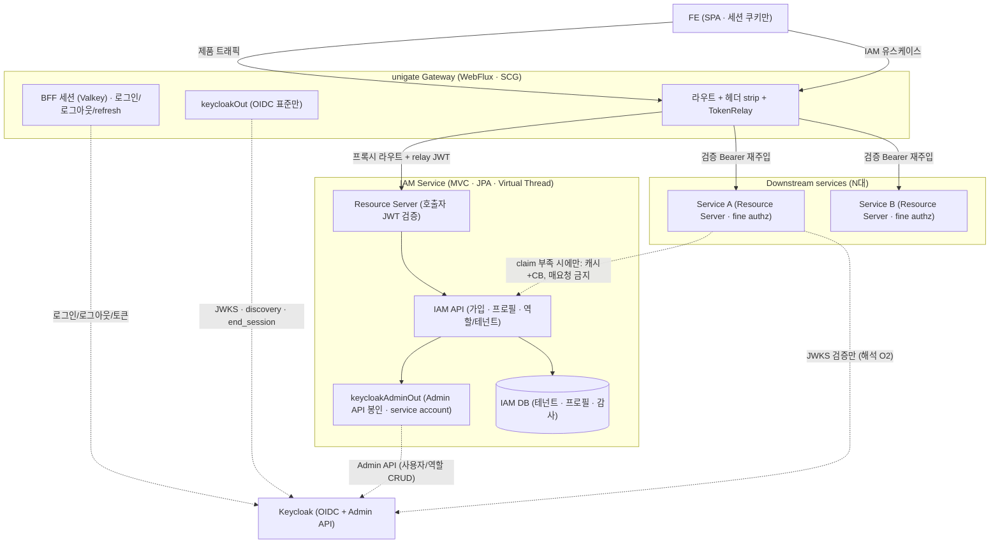

# IAM 플랫폼 확장 결정 문서 (Decision Spike)

> **상태:** 방향은 확정, 세부 결정은 열림. **Phase 8 착수 전 게이트**로 사용한다.
> 이 문서는 "무엇을 정했고 무엇이 아직 안 정해졌나"를 못박아, 대전제 변경이 **코드보다 먼저** 문서로
> 합의되게 한다. 근거는 아키텍처 검토(코드베이스 실측 기반)와 아래 참조 문서다.
>
> 관련: [`PROJECT_SETUP_PLAN.md`](PROJECT_SETUP_PLAN.md) · [`KEYCLOAK_REALM_SETUP.md`](KEYCLOAK_REALM_SETUP.md) ·
> `docs/plans/PHASE_ROADMAP.md`(작업용) · [`learning/06`](learning/06-gateway-trust-boundary-header-forgery.md)

---

## 1. 목적 (Goal)

unigate 의 현재 대전제는 **"게이트웨이는 인증만, 인가는 다운스트림"**(`CLAUDE.md` 최상단)이다.
사용자는 이를 **MSA IAM 플랫폼**으로 확장하려 한다 — 회원관리·권한·테넌트를 다운스트림이 아니라
**공통 프레임워크가** 담당하고, **다운스트림은 Keycloak 을 절대 직접 타지 않는다.**

이 문서는 그 확장의 **방향을 확정**하고, **Phase 8 착수 전에 반드시 닫아야 할 결정**을 목록화한다.

## 2. 배경 (Context)

- 현재(Phase 1 완료): 로그인(BFF)·세션(Valkey)·TokenRelay·헤더 strip 까지 동작. 다운스트림 1대(샘플).
- 사용자 구상: ① Keycloak Admin API 보강 ② 로그아웃 ③ 회원 등록(가입) ④ 권한/테넌트를 공통
  프레임워크가 처리 ⑤ 다운스트림 N대 전제.
- **하드 목표(절대 조건):** 다운스트림 앱은 **인증 흐름에서 Keycloak 에 직접 접근하지 않는다.**
- 이미 깔린 토대:
  - `settings.gradle.kts` 에 모듈 추출 지점이 주석으로 예약됨. `build-logic` 이 `common`/`gateway`
    convention 으로 **스택별 분리 구조** → 두 번째 모듈을 받을 골격이 있다.
  - `unigate-downstream-demo` client 는 Standard flow·Direct grants·Service accounts **전부 OFF**
    (`KEYCLOAK_REALM_SETUP.md`) → **다운스트림은 Keycloak 에 능동적으로 말 걸 자격증명이 없다.**
    하드 목표의 절반이 구조적으로 이미 강제돼 있다.

## 3. 확정된 방향 (Decided)

| # | 결정 | 근거 |
|---|---|---|
| **D1** | IAM 플랫폼 방향으로 간다. `gateway` 모듈 + **별도 `iam` 서비스 모듈**로 구성. | MSA·확장 목표. 추출 골격 이미 존재 |
| **D2** | **하드 목표**: 다운스트림은 인증 흐름에서 Keycloak 무접근. | 사용자 명시 |
| **D3** | 흐름: **FE→GW→다운스트림**(제품), **FE→GW→IAM**(IAM 유스케이스). | 사용자 구상 |
| **D4** | GW–IAM 관계는 **모델 A** — IAM 은 GW 의 **또 하나의 프록시 라우트 + Resource Server**. 모델 B(세션 파사드)는 결합도 때문에 기각. | Phase 1 라우트·strip·relay 기계 재사용, 저결합 |
| **D5** | 다운스트림↔IAM 은 **토큰 claim 자족이 기본**. IAM 동기 호출은 핫패스 배제, 휘발성·대용량 데이터에만 캐시+CB. | 장애 전파·God-IAM 방지 |
| **D6** | **IAM 스택 = Spring Boot MVC + JPA + Virtual Thread.** 게이트웨이는 WebFlux 유지. | §6 참조 |
| **D7** | 게이트웨이 `keycloakOut` 은 **OIDC 표준(JWKS·discovery·end_session·token)만** 유지. Admin API 는 넣지 않는다. | 원칙 순수성. Admin 은 IAM 소관 |
| **D8** | **모듈 분리 도입 시점 = Phase 8.** 지금은 준비만(추출 지점 유지 + keycloakOut 순수 유지). | 아래 §8 안티패턴 |

### D4·D5 보강 — 토큰 컨텍스트가 둘이다

IAM 서비스는 두 종류의 인증을 다룬다. 헷갈리면 설계가 무너진다.

1. **호출자 신원** = GW 가 relay 한 **사용자 JWT**. IAM 이 Resource Server 로 검증. 단 사용자 토큰에는
   `manage-users` 가 없으므로 **Admin API 호출에는 불충분**하다.
2. **Keycloak Admin 인증** = IAM 자신의 **service account 토큰**(client_credentials). 사용자 토큰과 별개로
   IAM 이 반드시 보유.

가입은 사용자 토큰이 **없는** 상태이므로 IAM 라우트를 둘로 나눈다:
- **공개 라우트**(`/iam/register` 등): permitAll · 사용자 토큰 없음 · IAM 이 service account 로 생성 ·
  **강한 rate limit 필수**(스팸 가입·계정 열거).
- **인증 라우트**(`/iam/profile`, `/iam/admin/**`): authenticated · relay JWT 로 호출자 식별 · Admin 은
  service account 로.

## 4. 열린 결정 (Open — Phase 8 전 확정 필요)

| # | 결정 대상 | 기본 권장 | 왜 지금 못 닫나 |
|---|---|---|---|
| **O1 ★** | **IAM 도메인 실질 무게** — 테넌트/프로필/정책/감사에 진짜 내용이 있나? | 있다고 가정하고 진행하되, **비면 iam 서비스 미신설**하고 GW `keycloakOut` 의 `UserDirectoryPort` 로 Admin 직접 사용 | 도메인 실체가 확인돼야 판단 가능. **전체 구상의 선결 관문** |
| **O2** | **JWKS 해석** — 다운스트림 서명 검증용 JWKS 접근을 허용? | **완화**(공개 JWKS 조회는 인증 흐름 아님 → 허용) | 하드 목표(D2)의 해석 범위 결정 필요 |
| **O3** | **멀티테넌시 모델** — realm-per-tenant vs 단일 realm + tenant claim | 단일 realm + claim(경량·가변) | 테넌트 수·격리 강도 요건 미정 |
| **O4 ★** | **재범위화 승인** — "인증 게이트웨이 → MSA IAM 플랫폼" 정체성 전환 | 사용자 명시 승인 필요 | 학습 목표(`CLAUDE.md` §1)의 재정의 |

> **O1 이 관문이다.** IAM 서비스가 Keycloak Admin API 를 1:1 로 되파는 얇은 프록시라면 무의미한
> 간접 계층이다(§8). 가치는 **오케스트레이션 + 테넌트/프로필/감사 도메인 + anti-corruption**에서 나와야 한다.

## 5. 책임 경계 (Design)

- **GW** = 인증 + coarse 정책 게이트(route-level role) + 테넌트 식별·전파(`X-Tenant-Id` 주입) + 인입 헤더 strip.
- **IAM 서비스** = 가입·프로필·역할/테넌트 관리(도메인) + Keycloak Admin 봉인(anti-corruption) + 감사.
- **다운스트림(N대)** = resource-level fine 인가(소유권·상태). 토큰 claim 자족.
- **Keycloak 접점은 GW 와 IAM 에만.** 다운스트림→Keycloak 은 JWKS 서명 검증에 한정(O2 미정).

## 6. 트레이드오프 요약

### 6.1 IAM 스택 = MVC + JPA + Virtual Thread (D6)

WebFlux 강제는 **SCG 제약**이다(`CLAUDE.md` §1.3). IAM 은 SCG 가 아니므로 자유롭고, 워크로드가
IAM 에 더 맞는다: Keycloak Admin client 는 **블로킹**(WebFlux 에선 이벤트 루프 위반 → WebClient 곡예
필요), CRUD/관리 도메인은 JPA 의 관계·트랜잭션이 R2DBC 보다 적합, 저QPS·비임계 경로.

`CLAUDE.md` §1.3 은 VT 정답 케이스를 "Servlet MVC + JPA(블로킹 JDBC)"로 못박고 "이번 범위 밖"이라
했는데, **IAM 이 정확히 그 시나리오**다. "VT 와 Reactive 를 섞지 말라"는 경고는 **한 앱 안** 얘기이므로,
게이트웨이(Reactive) / IAM(VT) 로 **앱을 나눠** 쓰는 것은 위반이 아니다. `build-logic` 에
`iam.gradle.kts`(servlet/MVC) convention 을 `gateway`(webflux) 옆에 추가하면 된다.

### 6.2 다운스트림↔IAM 통신 (D5)

| 케이스 | 판정 |
|---|---|
| 신원·coarse 역할·테넌트 id·email | **토큰 claim 자족 — 기본값, IAM 호출 불필요** |
| 프로필 상세·대용량 권한 목록·실시간 테넌트 메타·revocation 민감 검사 | IAM 조회가 실제로 필요할 수 있음 |
| 필요 시 통신 | 다운스트림→IAM **직접**(GW 경유 아님) + **캐시·CB·timeout 필수, 매 요청 금지** |

다운스트림→IAM 직접 호출은 하드 목표(D2)를 **깨지 않는다**(IAM≠Keycloak). 그러나 매 요청 동기 호출은
지연·결합·**장애 전파**(IAM 다운→전 다운스트림 다운)를 낳아 "God-gateway 를 God-IAM 으로 옮기는" 셈이
된다. → 테넌트·coarse 역할은 **로그인 시 토큰에 주입**하고 claim 자족을 기본으로 강제한다.

## 7. 로드맵 반영

`docs/plans/PHASE_ROADMAP.md`(작업용)에 아래를 반영한다. 이 문서와 로드맵은 짝으로 유지한다.

| Phase | 조정 |
|---|---|
| **P1.5 로그아웃** | **gateway 유지**. OIDC 표준(`end_session`)·세션 결합. 현재 명백한 공백이라 우선 |
| **P3 N-라우트** | 게이트웨이 라우트 모델 일반화 — 나중에 IAM 도 하나의 라우트로 추가 |
| **P5 UserDirectoryPort** | **재고** — IAM 으로 가기로 했으면 Admin API 를 게이트웨이에 만들었다 떼지 말고 **처음부터 IAM(P8)** 에. GW `keycloakOut` 은 OIDC 표준만 |
| **결정 게이트** | 이 문서의 §4(O1~O4) 확정 — **P8 코드 착수 전** |
| **P8 IAM 서비스 부트스트랩** | `iam` 모듈 생성(MVC+JPA+VT) · Admin 어댑터 · 가입/프로필 · service account · GW 에 IAM 프록시 라우트. **모듈 분리는 여기서** |
| **P9 정책/테넌시** | IAM 에 테넌트 도메인 · 테넌트 claim 발행(Keycloak mapper) · 다운스트림 토큰 claim 자족 확립 |

## 8. 함정 / 안티패턴 경고

- **얇은 IAM 패스스루**: IAM 이 Keycloak Admin API 를 1:1 로 되파는 프록시면 무의미한 간접 계층이다.
  가치는 오케스트레이션·테넌트/프로필/감사 도메인·anti-corruption 에서 나와야 한다(O1 관문).
- **도메인 실체 전 모듈 분리**: 내용 없는 `iam` 모듈을 먼저 쪼개면 `PROJECT_SETUP_PLAN.md` 의
  "단일 모듈 시작, 점진 추출" 원칙 위반. 분리는 Phase 8.
- **다운스트림 `oauth2-client` 유입**: 개발자가 401 을 만나 다운스트림이 스스로 refresh 하려는 순간
  하드 목표가 샌다. refresh 는 게이트웨이 소관. 다운스트림은 401 을 그대로 반환.
- **다운스트림의 introspection/Admin 직접 호출**: 곧 Keycloak 직접 접근. 금지.
- **동시 도입 scope creep**: 항목 1·3·4 를 한꺼번에 붙이면 프로젝트 정체성이 바뀐다(`CLAUDE.md` §1
  "한 단계에 새 개념 하나"에 반함). 저비용·무충돌인 로그아웃·라우트 모델을 먼저, 인가/테넌트는 마지막.

## 9. 운영 · 보안 고려 (SRE)

- **service account 최소권한**: `realm-admin` 전체가 아니라 `realm-management` 의 `manage-users`/
  `view-users`/`query-users` 만. GW 로그인 client 와 **관리 client 분리** 검토(blast radius 축소).
- **NetworkPolicy**: 다운스트림 파드의 Keycloak(issuer·admin) egress 차단. GW·IAM 만 접근.
- **다운스트림 의존성 강제**: `oauth2-resource-server` 만, `oauth2-client` **금지**.
- **로그아웃 토큰 폐기 일관성(한계)**: access token 은 stateless JWT 라 로그아웃해도 만료(현재 5분) 전까지
  다운스트림에서 유효하다. 즉시성이 필요하면 (a) 수명 추가 단축, (b) Back-Channel Logout,
  (c) 다운스트림 introspection — 셋 다 트레이드오프. 현재 Access(5m)<Session(30m) 구성이 완충.

## 10. 미결 / 후속

- §4 의 O1~O4 를 실제로 닫는 것은 **별도 결정 세션**(planner/analyst RFC 권장)에서 한다.
- IAM DB 스키마(테넌트·프로필·감사)는 O3(테넌시 모델) 확정 후 설계.
- 로그아웃(P1.5)은 이 확장과 독립적으로 먼저 진행 가능하다 — 그 시점에 Keycloak admin 접근이 생기면
  `learning/06` §6 의 "refresh 실패 재현"도 함께 관찰한다.
