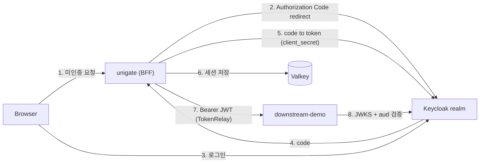

# unigate — Keycloak Realm 사전 설정 가이드

> Phase 1(핵심 인증 게이트웨이) 착수를 위한 Keycloak realm/client 구성 문서.
> 자동화 스크립트: [`scripts/keycloak/setup-realm.sh`](../scripts/keycloak/setup-realm.sh)

---

## 1. 목적 (Goal)

unigate 게이트웨이가 **Authorization Code Flow(BFF)** 로 로그인을 처리하고, 발급받은 access token을
**TokenRelay** 로 다운스트림에 전달했을 때 다운스트림이 **JWKS 서명 + `aud` 검증**에 성공하는 상태를 만든다.

---

## 2. 배경 (Context)

### 2.1 환경별 realm 분리

Keycloak **인스턴스는 공유**하고 **realm으로 격리**한다. 로컬 실험이 alpha의 사용자·정책·client를
오염시키지 않게 하기 위해 환경별로 realm을 나눈다.

| 환경 | realm | issuer URI |
|---|---|---|
| local | `test` | `https://<keycloak-host>/realms/test` |
| alpha | `unigate` | `https://<keycloak-host>/realms/unigate` |

> issuer는 `KEYCLOAK_ISSUER_URI` 환경변수로만 주입되므로 realm이 달라도 **애플리케이션 코드 변경은 없다.**
> 로컬도 원격 Keycloak(`<keycloak-host>`)을 사용한다 — 로컬에 Keycloak 컨테이너를 띄우지 않는다.

### 2.2 구성 요소

| 리소스 | 이름 | 역할 |
|---|---|---|
| Client (confidential) | `unigate-client` | 게이트웨이. 토큰을 **받는** 주체 |
| Client (audience 전용) | `unigate-downstream-demo` | 다운스트림 예시 앱. 토큰을 **검증하는** 주체 |
| Protocol Mapper | `downstream-audience` | access token `aud`에 다운스트림 clientId 주입 |
| Realm roles | `unigate-user`, `unigate-admin` | 인가 정책 골격 |
| Group | `unigate-users` | `unigate-user` 역할 자동 부여 |
| Users (local 전용) | `alice`, `bob` | 인가 성공/실패 케이스 |

---

## 3. 설계 (Design)



### 3.1 client를 2개로 나누는 이유

Keycloak이 발급하는 access token의 `aud`에는 기본적으로 **다운스트림 clientId가 들어가지 않는다.**
`azp`(authorized party)만 `unigate-client`로 채워질 뿐이다. 이 상태로 TokenRelay를 하면
다운스트림 resource server의 audience 검증이 실패한다.

따라서 다운스트림을 **로그인 흐름에 참여하지 않는 client**로 등록하고, `unigate-client`의
dedicated scope에 **Audience Mapper**를 달아 `aud`에 주입한다. 다운스트림이 늘어나도 mapper만
추가하면 되므로 확장 비용이 낮다.

### 3.2 리다이렉트 URI 규칙

Spring Security의 기본 콜백 경로는 `{baseUrl}/login/oauth2/code/{registrationId}` 이고,
`application-local.yml`의 registration 키가 `keycloak` 이므로 마지막 세그먼트는 `keycloak` 이다.

```
http://localhost:8080/login/oauth2/code/keycloak     # local
http://127.0.0.1:8080/login/oauth2/code/keycloak     # local
https://<alpha-ingress-host>/login/oauth2/code/keycloak   # alpha
```

> **와일드카드 금지.** `http://localhost:8080/*` 같은 패턴은 open redirect 표면이 된다.

---

## 4. 구성 상세 (Configuration)

### 4.1 Realm Settings

| 위치 | 항목 | 값 | 근거 |
|---|---|---|---|
| General | Frontend URL | 공란 또는 `https://<keycloak-host>` | issuer/JWKS가 내부주소로 노출되면 검증 실패 |
| Sessions | SSO Session Idle | `30m` (1800s) | `spring.session.timeout: 30m` 과 정렬 |
| Sessions | SSO Session Max | `10h` (36000s) | |
| Tokens | Access Token Lifespan | `5m` (300s) | 짧게 유지하고 refresh로 갱신 |
| Tokens | Revoke Refresh Token | **OFF** | ON은 refresh rotation. 동시 refresh 시 race로 401 발생 → Phase 3에서 재검토 |
| Login | User registration | OFF | 불필요한 가입 표면 제거 |
| Login | Verify email | OFF | 로컬 테스트 마찰 제거 |
| Keys | 활성 RS256 키 | 존재 확인 | Phase 2 JWKS 서명검증의 전제 |

### 4.2 Client ①: `unigate-client`

**Settings**

| 항목 | 값 |
|---|---|
| Client authentication | **ON** (confidential) |
| Authorization | OFF |
| Standard flow | **ON** |
| Direct access grants (ROPC) | **OFF** |
| Implicit flow | OFF |
| Service accounts roles | **ON** (Phase 5 `UserDirectoryPort` Admin API 대비) |
| Valid redirect URIs | §3.2 참조 |
| Valid post logout redirect URIs | `http://localhost:8080/` (alpha는 `https://<host>/`) |
| Web origins | `http://localhost:8080` (`*` 금지) |

**Advanced**

- Proof Key for Code Exchange (PKCE): `S256`
  Spring Security 6는 confidential client에서도 PKCE를 지원한다. 인가 코드 가로채기 방어.

**Credentials**

- Client secret을 복사해 아래에 주입한다. **커밋 금지.**
  - local: `.env` 또는 `application-local-secret.yml` (`.gitignore` 대상)
  - alpha: `deploy/helm/unigate/values-alpha.secret.yaml` (`.gitignore` 대상)

### 4.3 Client ②: `unigate-downstream-demo`

| 항목 | 값 |
|---|---|
| Client authentication | ON |
| Standard flow | **OFF** |
| Direct access grants | **OFF** |
| Service accounts roles | **OFF** |
| redirect URI | 불필요 |

로그인에 쓰지 않고 `aud` 값의 이름표 역할만 한다.

### 4.4 Audience Mapper (누락 시 다운스트림 401)

`Clients` → `unigate-client` → `Client scopes` → `unigate-client-dedicated` → `Add mapper` → `By configuration` → **Audience**

| 항목 | 값 |
|---|---|
| Name | `downstream-audience` |
| Included Client Audience | `unigate-downstream-demo` |
| Add to access token | **ON** |
| Add to ID token | OFF |

적용 후 access token payload:

```json
{
  "iss": "https://<keycloak-host>/realms/test",
  "aud": ["unigate-downstream-demo", "account"],
  "azp": "unigate-client"
}
```

### 4.5 Roles / Groups / Users

- Realm roles: `unigate-user`, `unigate-admin`
- Group `unigate-users` → Role mapping에 `unigate-user`
- 테스트 사용자 (**local `test` realm 전용**, alpha에는 생성하지 않는다)

| username | 그룹 | 용도 |
|---|---|---|
| `alice` | `unigate-users` | 인증·인가 성공 경로 |
| `bob` | 없음 | 인증 성공 / 인가 실패(403) 경로 |

> 비밀번호는 **Temporary OFF**로 설정한다. ON이면 첫 로그인에서 비밀번호 변경 화면이 떠 자동화 테스트가 막힌다.

### 4.6 Full scope allowed — 지금은 ON 유지

`Full scope allowed`를 OFF로 두면 토큰이 작아지고 최소권한 원칙에 맞지만, Scope 탭에
`unigate-user` / `unigate-admin`을 **명시적으로 추가**해야 `realm_access.roles`가 토큰에 실린다.
추가를 누락하면 "로그인은 되는데 권한만 비어 있는" 진단하기 성가신 상태가 된다.
**Phase 1은 ON, Phase 5(인가 정책 정립) 시점에 OFF로 조인다.**

---

## 5. 자동 구성 스크립트

```bash
# 호스트·계정은 환경변수로 주입한다 (스크립트에 하드코딩하지 않는다)
export KEYCLOAK_URL="https://<keycloak-host>"
export KEYCLOAK_ADMIN_USER="<admin-user>"

# 로컬(test realm) — 테스트 사용자 포함. 비밀번호는 대화형 입력(화면 미출력)
scripts/keycloak/setup-realm.sh --env local

# alpha(unigate realm) — 테스트 사용자 미생성
scripts/keycloak/setup-realm.sh --env alpha --alpha-host <alpha-ingress-host>

# 변경 없이 계획만 확인
scripts/keycloak/setup-realm.sh --env local --dry-run
```

스크립트는 **멱등**하다. 이미 존재하는 realm/client/role/user는 생성 대신 갱신하므로 반복 실행해도 안전하다.
완료 시 `unigate-client` 의 client secret과 그대로 붙여넣을 수 있는 `export` 블록을 출력한다.

**출력을 파일로 남길 때**는 반드시 `.gitignore` 대상 경로를 쓴다.

```bash
scripts/keycloak/setup-realm.sh --env local | tee /dev/tty \
  | grep '^export KEYCLOAK_' > keycloak.secret.env
chmod 600 keycloak.secret.env      # .gitignore 의 **/*.secret.env 패턴에 걸린다
```

> - 관리자 비밀번호는 파일에 저장하지 않는다. `KEYCLOAK_ADMIN_PASSWORD` 환경변수 또는 대화형 입력으로만 받는다.
> - **실제 호스트명·계정·secret 은 커밋 대상 파일(문서·스크립트·values)에 기재하지 않는다.** 본 문서의
>   `<keycloak-host>` / `<alpha-ingress-host>` / `<admin-user>` 는 모두 placeholder다.

---

## 6. 동작 검증 (Verification)

게이트웨이 코드 없이 즉시 확인 가능하다.

```bash
REALM=test
BASE=https://<keycloak-host>/realms/$REALM

# 1) discovery — issuer / 엔드포인트
curl -s $BASE/.well-known/openid-configuration \
  | jq '{issuer, authorization_endpoint, token_endpoint, jwks_uri}'

# 2) JWKS — RS256 활성 키 (Phase 2 서명검증 전제)
curl -s $BASE/protocol/openid-connect/certs | jq '.keys[] | {kid, alg, use}'

# 3) client secret 유효성 + aud mapper 확인
#    JWT payload 는 base64url + 패딩 생략이라 `base64 -d` 로는 깨진다. 패딩을 복원해 디코딩한다.
curl -s -X POST $BASE/protocol/openid-connect/token \
  -d grant_type=client_credentials \
  -d client_id=unigate-client \
  --data-urlencode "client_secret=$KEYCLOAK_OAUTH_CLIENT_SECRET" \
  | jq -r .access_token \
  | python3 -c 'import sys,base64,json; p=sys.stdin.read().strip().split(".")[1]; print(json.dumps(json.loads(base64.urlsafe_b64decode(p+"="*(-len(p)%4)))))' \
  | jq '{iss, aud, azp}'
```

**합격 기준**

- [ ] 1번의 `issuer` 가 `https://<keycloak-host>/realms/<realm>` 과 정확히 일치
- [ ] 2번에 `alg: RS256`, `use: sig` 키가 최소 1개
- [ ] 3번의 `aud` 배열에 `unigate-downstream-demo` 포함 ← §4.4 mapper 정상 동작

---

## 7. 예외 / 트러블슈팅 (Error Handling)

| 증상 | 원인 | 조치 |
|---|---|---|
| `invalid_redirect_uri` | redirect URI 불일치 | §3.2의 3개 URI가 **완전 일치**하는지 확인. 끝의 `/` 유무까지 |
| 다운스트림 401 `invalid_token` (aud) | Audience Mapper 누락 | §4.4 재확인 → §6-3번으로 검증 |
| 게이트웨이 기동 시 issuer 검증 실패 | `KEYCLOAK_ISSUER_URI` 와 discovery의 `issuer` 불일치 | realm 이름 오타, Frontend URL 설정 확인 |
| 로그인은 되는데 권한이 비어 있음 | Full scope allowed OFF + role scope 미매핑 | §4.6 |
| 첫 로그인에서 비밀번호 변경 화면 | 사용자 비밀번호 Temporary=ON | Credentials 탭에서 Temporary OFF로 재설정 |
| 간헐적 401 (토큰 갱신 시점) | Revoke Refresh Token ON에 의한 rotation race | §4.1 대로 OFF |

---

## 8. 운영 고려사항 (Operations)

- **토큰 수명 관계**: Access Token(5m) < Spring Session(30m). 그 사이 구간은 refresh token이 메꾼다.
- **Keycloak 장애 시**: Phase 2의 JWKS 로컬 캐시로 **기존 토큰 검증은 생존**, **신규 로그인만 불가**.
  키 회전 대비 `kid` 미스 시 1회 재조회한다.
- **realm 공유 주의**: `test` realm을 다른 용도와 공유한다면 Sessions/Tokens 값 변경이 타 사용자에게 영향을 준다.
- **alpha 승격 시**: `--env alpha` 로 동일 구성을 `unigate` realm에 재현하되, 테스트 사용자는 생성하지 않는다.

---

## 9. 보안 체크리스트

- [ ] redirect URI에 와일드카드 없음
- [ ] Web origins에 `*` 없음
- [ ] Direct access grants(ROPC) OFF — 크리덴셜 스터핑 표면 제거
- [ ] PKCE `S256` 활성
- [ ] client secret 미커밋 — `git check-ignore -v <파일>` 로 확인
- [ ] Keycloak 관리자 비밀번호가 스크립트/문서/셸 히스토리에 남지 않음
      (`HISTCONTROL=ignorespace` 활용, 또는 대화형 입력 사용)
- [ ] alpha realm에는 테스트 계정 미존재
- [ ] **커밋 대상에 실제 호스트명이 없음** — 아래로 확인

```bash
# 커밋 전 실제 좌표 유출 점검
git diff --cached | grep -nE '<사내-도메인-키워드>|[0-9]{1,3}(\.[0-9]{1,3}){3}' && echo "유출 의심" || echo "clean"
```

---

## 10. 롤백 / 런북 (Runbook)

| 상황 | 조치 |
|---|---|
| 설정을 처음부터 다시 | Admin Console → Realm settings → Action → **Delete realm** → 스크립트 재실행 |
| client secret 유출 의심 | `unigate-client` → Credentials → **Regenerate** → 주입 대상(`.env`, `values-alpha.secret.yaml`) 갱신 → 게이트웨이 재기동 |
| 잘못된 mapper로 다운스트림 전면 401 | mapper 삭제 후 §4.4 재생성. 기존 발급 토큰은 access token 수명(5m) 후 자연 소멸 |
| 관리자 비밀번호 교체 | master realm → Users → admin → Credentials → Reset password |

---

## 11. 게이트웨이 주입 환경변수

```bash
# --- local (test realm) ---
export KEYCLOAK_ISSUER_URI="https://<keycloak-host>/realms/test"
export KEYCLOAK_OAUTH_CLIENT_ID="unigate-client"
export KEYCLOAK_OAUTH_CLIENT_SECRET="<Credentials 탭 값>"
```

```yaml
# --- alpha (unigate realm) : values-alpha.secret.yaml (gitignore 대상) ---
secrets:
  data:
    KEYCLOAK_ISSUER_URI: "https://<keycloak-host>/realms/unigate"
    KEYCLOAK_OAUTH_CLIENT_ID: "unigate-client"
    KEYCLOAK_OAUTH_CLIENT_SECRET: "<secret>"
```
