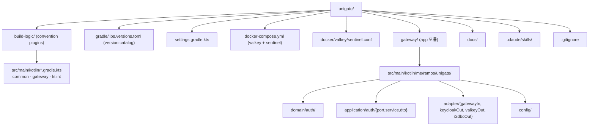
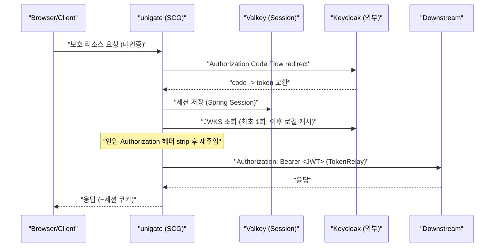
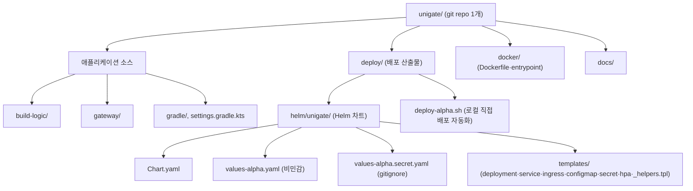
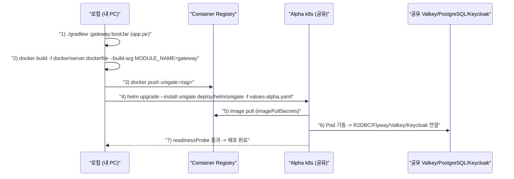

# unigate — 중앙 인증 게이트웨이 프로젝트 설계·구성 계획서

> Spring Cloud Gateway + Kotlin(Coroutine) + Keycloak(OIDC) 기반 표준 인증 게이트웨이 (토이 프로젝트)
> 본 문서는 **Phase 0: 프로젝트 스캐폴딩** 범위에 집중한다. 실제 인증 로직 구현은 후속 Phase.
>
> **확정 사항** — base package: `me.ramos.unigate` · 영속성: **R2DBC**(감사로그/클라이언트 메타) + PostgreSQL · Alpha 배포: **로컬 → 공유 k8s 직접 배포**(CI/CD 없음), Valkey/PostgreSQL 공유 · Keycloak: **인스턴스 공유 · realm 격리(전용 `unigate` realm)**.

---

## 1. 결론 요약 (3줄)

- 표준 빌드 체계(Gradle 8.14.3 / Kotlin 2.1.21 / Spring Boot 3.5.4 / Spring Cloud 2025.0.0 / JDK 21 / `build-logic` convention plugins + version catalog)를 채택하되, 게이트웨이는 **Reactive(WebFlux)** 스택이라 별도 **`gateway` 전용 convention**을 둔다.
- 헥사고날(Port & Adapter) 구조로 `domain / application(port·service) / adapter(in·out) / config` 레이어를 잡고, Keycloak·Valkey를 **어댑터로 격리**한다. 초기엔 **단일 `gateway` 모듈**로 시작해 공용 로직은 `core/*`로 점진 추출한다.
- 로컬 개발환경은 **valkey + valkey-sentinel** docker-compose 패턴(network namespace 공유)을 사용하고, Keycloak은 **외부 제공 엔드포인트/realm**을 환경변수로 주입한다.

---

## 2. 접근 방식 / 설계 의도

### 2.1 SCG(WebFlux) 스택의 핵심 차이 (반드시 인지)

| 항목 | 일반 Servlet 백엔드 | unigate | 영향 |
|---|---|---|---|
| 웹 스택 | Servlet MVC (`spring-boot-starter-web`) | **Reactive WebFlux** (SCG) | MVC용 convention 재사용 불가 → `gateway` convention 신설 |
| DB 접근 | JPA (blocking) | **R2DBC** (감사로그·클라이언트 메타) | R2DBC 어댑터 신설 |
| 세션 | HttpSession | **Spring Session Data Redis Reactive** | Valkey 연동을 reactive로 |
| 외부 호출 | OpenFeign(blocking) | **WebClient + coroutine `awaitBody()`** | `mono { }` 브리지로 suspend 연결 |

> **결정 근거**: SCG는 Netty/WebFlux 위에서만 동작한다. Servlet 스택(`spring-boot-starter-web`)이 클래스패스에 섞이면 자동설정 충돌로 게이트웨이가 뜨지 않는다. 따라서 convention 레벨에서 스택을 분리한다.

### 2.2 헥사고날 레이어

```
adapter → application → domain   (단방향만 허용)
```

- **domain**: 순수 비즈니스 로직. Spring 어노테이션 금지. 외부 의존성 0.
- **application**: domain에만 의존. 포트 인터페이스로 외부와 소통. adapter import 금지.
- **adapter**: application 포트를 구현(out)하거나 호출(in).

도메인 포트 매핑:

| 포트 | 종류 | 역할 | 초기 어댑터 |
|---|---|---|---|
| `TokenVerifierPort` | out | JWT 서명 검증 (JWKS 로컬 캐싱) | `keycloakOut` (OIDC 표준) |
| `TokenIssuerPort` | out | 토큰 발급/교환 (확장 옵션) | `keycloakOut` |
| `UserDirectoryPort` | out | 멤버/그룹 조회 | `keycloakOut` (Admin API) |
| `SessionPolicyPort` | out | 세션 정책(동시 로그인 등) | `keycloakOut` / `valkeyOut` |

> **격리 원칙**: 어댑터는 OIDC 표준 스펙(discovery, JWKS)에만 의존하고 Keycloak 고유 API는 어댑터 내부에 봉인한다. → 추후 Okta/자체 IdP 교체 시 어댑터만 교체.

### 2.3 모듈 전략 — "단일 모듈 시작, 점진 추출"

토이 초기부터 멀티모듈은 과하다. **Phase 0에선 `gateway` 단일 앱 모듈**만 두고 헥사고날은 **패키지 레벨**로 표현한다. `build-logic` + `settings.gradle.kts`는 확장형 골격으로 세팅해 `core/common-*` 추출을 언제든 받을 수 있게 남긴다.

---

## 3. 구현 (Phase 0 산출물 명세)

### 3.1 최종 디렉토리 구조



**패키지 트리 (`gateway/src/main/kotlin/me/ramos/unigate/`)**

```
├── UnigateApplication.kt
├── config/
│   ├── GatewayRouteConfig.kt        # SCG 라우트 + TokenRelay/헤더 strip
│   ├── SecurityConfig.kt            # OAuth2 Client(Authorization Code)
│   ├── SessionConfig.kt             # Spring Session Redis Reactive
│   ├── R2dbcConfig.kt               # R2DBC 연결/트랜잭션(reactive)
│   └── ResilienceConfig.kt          # Resilience4j CB/Bulkhead, RateLimiter
├── adapter/
│   ├── gatewayIn/                   # Driving: GlobalFilter, ExceptionHandler(RFC7807)
│   ├── keycloakOut/                 # Driven: JWKS 캐시, WebClient(suspend)
│   ├── valkeyOut/                   # Driven: 세션/토큰버킷/정책
│   └── r2dbcOut/                    # Driven: 감사로그/클라이언트 메타 (entity·repository·mapper)
├── application/
│   └── auth/
│       ├── port/
│       │   ├── inbound/             # VerifyRequestInPort 등
│       │   └── outbound/            # TokenVerifierPort, UserDirectoryPort, AuditLogPort ...
│       ├── service/                 # UseCase 구현 (suspend)
│       ├── dto/
│       └── exception/
└── domain/
    └── auth/
        ├── model/                   # AuthenticatedPrincipal, Claims, AuditEvent
        ├── vo/                      # Audience, Subject, TokenId
        └── exception/               # DomainException(sealed)
```

### 3.2 버전 카탈로그 (`gradle/libs.versions.toml`)

핵심 버전을 고정하고, WebFlux/Reactive/R2DBC 계열 라이브러리를 구성한다.

```toml
[versions]
kotlin = "2.1.21"
spring-boot = "3.5.4"
spring-cloud = "2025.0.0"
kotlinx-coroutines = "1.10.2"
# (kotest, mockk, archunit, testcontainers, postgresql, flyway ...)

[libraries]
# --- Reactive Gateway ---
spring-cloud-starter-gateway-server-webflux = { module = "org.springframework.cloud:spring-cloud-starter-gateway-server-webflux" }
spring-boot-starter-webflux = { module = "org.springframework.boot:spring-boot-starter-webflux", version.ref = "spring-boot" }
spring-boot-starter-oauth2-client = { module = "org.springframework.boot:spring-boot-starter-oauth2-client", version.ref = "spring-boot" }
spring-boot-starter-oauth2-resource-server = { module = "org.springframework.boot:spring-boot-starter-oauth2-resource-server", version.ref = "spring-boot" }
spring-session-data-redis = { module = "org.springframework.session:spring-session-data-redis" }
spring-boot-starter-data-redis-reactive = { module = "org.springframework.boot:spring-boot-starter-data-redis-reactive", version.ref = "spring-boot" }
spring-cloud-starter-circuitbreaker-reactor-resilience4j = { module = "org.springframework.cloud:spring-cloud-starter-circuitbreaker-reactor-resilience4j" }
kotlinx-coroutines-reactor = { module = "org.jetbrains.kotlinx:kotlinx-coroutines-reactor", version.ref = "kotlinx-coroutines" }
# --- R2DBC(런타임) + Flyway(마이그레이션, JDBC) ---
spring-boot-starter-data-r2dbc = { module = "org.springframework.boot:spring-boot-starter-data-r2dbc", version.ref = "spring-boot" }
r2dbc-postgresql = { module = "org.postgresql:r2dbc-postgresql" }        # 버전은 Boot BOM 관리
postgresql = { module = "org.postgresql:postgresql", version.ref = "postgresql" }   # Flyway(JDBC)용
flyway-core = { module = "org.flywaydb:flyway-core", version.ref = "flyway" }
flyway-postgresql = { module = "org.flywaydb:flyway-database-postgresql", version.ref = "flyway" }
# --- 관측성: actuator, micrometer-registry-prometheus ---
```

> ⚠️ **주의**: Spring Cloud 2025.0.0에서 게이트웨이 스타터는 `spring-cloud-starter-gateway` → **`spring-cloud-starter-gateway-server-webflux`**(reactive)로 리네이밍되었다.

### 3.3 `build-logic` convention plugins

`common`(JDK 21 toolchain, ktlint, JUnit5) / `ktlint` 를 두고, MVC 전제 대신 **`gateway`** convention을 신설한다.

```kotlin
// build-logic/src/main/kotlin/gateway.gradle.kts
import org.springframework.boot.gradle.tasks.bundling.BootJar

plugins {
  id("org.springframework.boot")
  id("io.spring.dependency-management")
  kotlin("plugin.spring")
}

val catalog = extensions.findByType<VersionCatalogsExtension>()?.named("libs")

dependencyManagement {
  imports {
    catalog?.let {
      mavenBom("org.springframework.cloud:spring-cloud-dependencies:${it.findVersion("spring-cloud").get()}")
    }
  }
}

dependencies {
  catalog?.let {
    add("implementation", it.findLibrary("kotlin-stdlib").get())
    add("implementation", it.findLibrary("kotlin-reflect").get())
    add("implementation", it.findLibrary("spring-cloud-starter-gateway-server-webflux").get())
    add("implementation", it.findLibrary("kotlinx-coroutines-reactor").get())
    add("testImplementation", it.findLibrary("archunit-junit5").get())  // 헥사고날 가드
  }
}

tasks {
  named<BootJar>("bootJar") { enabled = true; archiveFileName.set("app.jar") }
  named<Jar>("jar") { enabled = false }
}
```

> **데몬 JVM 고정**: `gradle/gradle-daemon-jvm.properties`(`toolchainVersion=21`)로 Gradle 데몬 JVM을 21로 고정한다. Gradle 8.14.3은 Java 26(class file major 70) 등 최신 JDK를 지원하지 않아, IDE Gradle JVM이 신규 JDK로 잡히면 `Unsupported class file major version` 오류가 난다.

### 3.4 docker-compose (valkey + sentinel)

```yaml
# docker-compose.yml (핵심만)
services:
  postgres:                                  # R2DBC 런타임 + Flyway 마이그레이션 대상
    image: postgres:16
    container_name: unigate-postgres
    environment: { POSTGRES_DB: unigate, POSTGRES_USER: testuser, POSTGRES_PASSWORD: testpass, TZ: Asia/Seoul }
    ports: ["5432:5432"]
    volumes: ["postgres_data:/var/lib/postgresql/data"]

  valkey:
    image: valkey/valkey:7.2.8
    container_name: unigate-valkey
    command: [valkey-server, --port, "6379", --protected-mode, "no", --appendonly, "yes"]
    ports: ["6379:6379", "26379:26379"]     # 데이터 + 센티넬 포트 동시 노출

  valkey-sentinel:
    image: valkey/valkey:7.2.8
    container_name: unigate-valkey-sentinel
    network_mode: "service:valkey"           # network namespace 공유 → 127.0.0.1:6379 감시
    depends_on: { valkey: { condition: service_healthy } }
    volumes: ["./docker/valkey/sentinel.conf:/etc/valkey-ro/sentinel.conf:ro"]
    command: [sh, -c, "cp /etc/valkey-ro/sentinel.conf /tmp/sentinel.conf && exec valkey-sentinel /tmp/sentinel.conf"]

volumes:
  postgres_data:
```

> **R2DBC + Flyway 조합 주의**: R2DBC는 스키마 마이그레이션을 제공하지 않는다. **Flyway(JDBC, 부팅 시 1회)**로 스키마를 관리하고 **런타임 CRUD는 R2DBC(reactive)**로 처리한다. Flyway는 부팅 시점에만 동작하므로 이벤트 루프를 막지 않는다.

> **Sentinel**: `sentinel monitor mymaster 127.0.0.1 6379 1`, `announce-ip 127.0.0.1`, `announce-port 26379`. Sentinel 컨테이너가 valkey의 network namespace를 공유해 `127.0.0.1:6379`로 master를 감시한다.

> **Keycloak은 compose에 미포함** (Phase 0). 외부 제공 엔드포인트/realm을 `application-local.yml` + 환경변수로 주입. 후속 Phase에서 로컬 mock Keycloak을 옵션 profile로 추가 가능.

### 3.5 로컬 인증 흐름 (참고)



### 3.6 `.gitignore`

- 유지: `.gradle`, `build/`, `!gradle/wrapper/gradle-wrapper.jar`, `.idea/**`, `.kotlin`, `.DS_Store`, `.vscode/`, `out/`, `bin/`
- 도구 상태: `.omc/`, `**/.omc`, `.omx/`, `.codex/*`(+ skills 예외), `.claude/settings.local.json`
- secret: `**/*.secret.env`, `secrets/`, `application-*-secret.yml`, `docs/plans`
- **배포 secret(필수)**: `deploy/**/*.secret.yaml`, `deploy/**/*.secret.yml` (`*.secret.yaml.example`는 예외 허용) — Helm values 평문 secret 커밋 금지

### 3.7 Claude Code Skills

| 차용 | Skill | 사유 |
|---|---|---|
| ✅ | `kotlin-style` | Kotlin 스타일 규칙 |
| ✅ | `architecture` | 헥사고날 레이어·의존성 방향 (핵심) |
| ✅ | `domain-model` | 도메인 모델 규칙 |
| ✅ | `usecase` | UseCase(포트 의존, Result DTO) 규칙 — suspend 함수로 작성 |
| ✅ | `testing` | Kotest BehaviorSpec + MockK |
| ✅ | `convention-check` | 컨벤션 검증 |
| ✅ | `ai-memory-plan` | 복잡 작업 맥락 유지 |
| △ 개작 | `rest-controller` | MVC 전제 → **WebFlux/GlobalFilter 어댑터**용으로 개작 필요 |

---

## 4. 운영 체크리스트 (SRE 관점)

- **Actuator**: `/actuator/health`(readiness에 Valkey 연결 포함), `/actuator/prometheus` 노출.
- **Graceful shutdown**: `server.shutdown=graceful` + 진행 요청 drain, k8s `preStop` 여유.
- **관측성**: Micrometer + 분산 트레이싱(`traceparent` 전파), 로그인 성공/실패·토큰 발급·CB open 메트릭.
- **Resilience 기본값**: connect/response timeout 짧게, 멱등 호출만 제한적 retry, Keycloak 통신 별도 CB + Bulkhead.
- **JWKS 캐시**: TTL + 백그라운드 갱신, `kid` 미스 시 1회 재조회(키 회전 대비) → Keycloak 일시 장애 생존.
- **감사 로그**: 표준 프레임워크 승격 필수 요건 (Phase 후속).

## 5. 보안 체크리스트

- 인입 `Authorization`/커스텀 헤더 **strip 후 재주입** (다운스트림은 게이트웨이 경유만 허용 — NetworkPolicy/mTLS 전제).
- Secret 하드코딩 금지 → 환경변수 / k8s Secret. Keycloak client secret은 로컬에서도 `.gitignore` 대상 파일로 격리.
- 토큰 검증은 introspection 대신 **JWKS 로컬 서명 검증** (외부 결합·지연 최소화).
- 로그인/토큰 엔드포인트에 **더 엄격한 rate limit** (크리덴셜 스터핑 방어).
- 민감정보(토큰/비밀번호) 로깅 금지. 표준 에러는 RFC 7807 Problem Detail(401/403/429 + 원인 코드).

## 6. Phase 0 작업 순서 (완료)

1. [x] `settings.gradle.kts` + `gradle.properties` + wrapper(8.14.3) + `.editorconfig`/`.gitattributes`
2. [x] `build-logic` (`common`, `gateway`, `ktlint` convention)
3. [x] `gradle/libs.versions.toml` (reactive/R2DBC 라이브러리)
4. [x] `gateway` 모듈 스켈레톤 + `UnigateApplication.kt` + 헥사고날 패키지 (`me.ramos.unigate`)
5. [x] R2DBC 연결/Flyway 마이그레이션 골격 (`db/migration/V1__init_audit_log.sql`)
6. [x] `application.yml` / `application-local.yml` / `application-alpha.yml`
7. [x] `docker-compose.yml` + `docker/valkey/sentinel.conf` (postgres + valkey + sentinel)
8. [x] `.gitignore`
9. [x] `.claude/skills/` 큐레이션
10. [x] `git init` + 커밋 + `./gradlew build` 스모크 검증 (컴파일·ktlint·test 그린, bootJar 생성)

---

## 7. 리포지토리 구조 (소스 + Helm 차트 mono-repo)

> 소스코드와 배포 산출물을 **디렉토리로 분리**하되 **단일 git repository**로 관리한다.



> **주의**: `deploy/`의 namespace·image repo·ingress host 등 환경 좌표는 **아직 확정 전 placeholder**다. 실제 배포 시점에 확정 값으로 교체한다.

## 8. Alpha 환경 배포 (로컬 → k8s 직접 배포)

> **전제**: k8s 클러스터·Valkey·PostgreSQL을 **공유 자원**으로 사용. CI/CD 없이 **로컬에서 직접** 배포. (필요 시 스크립트를 Action으로 승격)

### 8.1 배포 파이프라인



### 8.2 배포 요건

| 항목 | 값/규칙 |
|---|---|
| `_helpers.tpl` 접두사 | `unigate.*` |
| `global.name` / namespace | `unigate` / (배포 네임스페이스 확정 필요) |
| 이미지 repo | `<container-registry>/unigate` |
| **DB 접속 (핵심)** | **R2DBC(런타임) + Flyway(JDBC) 이원화** (§8.3) |
| Keycloak realm | **인스턴스 공유·realm 격리** → 전용 `unigate` realm |
| context-path / probe | 게이트웨이는 루트 서빙 → `/actuator/health/{readiness,liveness}` |
| prometheus path | `/actuator/prometheus` |
| ingress host | unigate 전용 host 발급 필요 |
| security context | readOnlyRootFS + tmp PVC + runAsNonRoot(1001) |

### 8.3 공유 자원 접속 (secret 매핑) — ⚠️ R2DBC 이원화

런타임 R2DBC(`r2dbc://`)와 마이그레이션 Flyway(`jdbc://`) 두 URL이 모두 필요하다.

```yaml
# values-alpha.secret.yaml (예시 · gitignore 대상 · 실제값은 커밋 금지)
secrets:
  data:
    # 런타임 (reactive)
    SPRING_R2DBC_URL: "r2dbc:postgresql://<pg-host>:5432/unigate"
    SPRING_R2DBC_USERNAME: "<user>"
    SPRING_R2DBC_PASSWORD: "<pw>"
    # 마이그레이션 (부팅 시 1회, JDBC)
    SPRING_FLYWAY_URL: "jdbc:postgresql://<pg-host>:5432/unigate"
    SPRING_FLYWAY_USER: "<user>"
    SPRING_FLYWAY_PASSWORD: "<pw>"
    # Valkey Sentinel (공유)
    VALKEY_SENTINEL_NODES: "<valkey-sentinel-host>:26379"
    VALKEY_SENTINEL_MASTER: "mymaster"
    VALKEY_PASSWORD: "<pw>"
    # Keycloak (인스턴스 공유 · realm 격리 → 전용 realm 'unigate')
    KEYCLOAK_ISSUER_URI: "https://<keycloak-host>/realms/unigate"
    KEYCLOAK_OAUTH_CLIENT_ID: "unigate-client"
    KEYCLOAK_OAUTH_CLIENT_SECRET: "<secret>"
```

> **Keycloak realm 격리**: Keycloak **인스턴스는 공유**하되 **realm은 unigate 전용으로 분리**한다. JWKS/issuer/client 모두 `realms/unigate` 기준. Keycloak 관리자에게 **전용 realm `unigate` + OAuth client `unigate-client` 사전 생성**을 요청한다.

> **공유 DB 주의**: 공유 PostgreSQL 인스턴스에 unigate 전용 **database `unigate`를 사전 생성**해야 한다 (Flyway는 스키마 안의 테이블만 관리, DB 자체는 생성 못 함).

> 🔒 **보안 (필수)**: 비민감 값만 `values-alpha.yaml`에 두고, secret은 `values-alpha.secret.yaml`(gitignore) 또는 `--set`/외부 overlay로 주입한다. 평문 secret 커밋 금지.

### 8.4 로컬 배포 자동화 스크립트 (`deploy/deploy-alpha.sh` 골격)

```bash
#!/usr/bin/env bash
set -euo pipefail
TAG="$(date +%Y%m%d%H%M%S)-$(git rev-parse --short HEAD)"
REG="<container-registry>/unigate"

./gradlew :gateway:bootJar
docker build -f docker/server.dockerfile --build-arg MODULE_NAME=gateway -t "${REG}:${TAG}" .
docker push "${REG}:${TAG}"
helm upgrade --install unigate deploy/helm/unigate \
  -f deploy/helm/unigate/values-alpha.yaml \
  -f deploy/helm/unigate/values-alpha.secret.yaml \
  --set global.image.tag="${TAG}" \
  --namespace <ns> --create-namespace
```

### 8.5 배포 사전 준비 체크리스트 (Phase 1)

1. [ ] 공유 PostgreSQL에 `unigate` DB 생성
2. [ ] Keycloak 전용 realm `unigate` + OAuth client `unigate-client` 생성
3. [ ] 배포 네임스페이스 / ingress host / container registry 경로 확정
4. [ ] `values-alpha.secret.yaml` 작성 (커밋 금지)
5. [ ] `helm template` 렌더 검증 → 실제 배포 스모크

---

## 9. 대안 및 트레이드오프

| 결정 | 선택 | 대안 | 선택 기준 |
|---|---|---|---|
| 모듈 구조 | 단일 `gateway` 시작 | 멀티모듈 즉시 | 토이 초기 속도 우선. 공용화 필요 시점에 `core/*` 추출 |
| 웹 스택 | Reactive(WebFlux) | Servlet + SCG-MVC | SCG 정식 스택은 WebFlux. Coroutine/R2DBC 요구와 정합 |
| 세션 | Spring Session Redis Reactive | 완전 stateless(JWT만) | BFF + Token Relay 설계 요구. stateless 트레이드오프는 향후 논의 |
| Keycloak 로컬 | 외부 엔드포인트 주입 | compose에 Keycloak 포함 | 엔드포인트/realm 외부 제공 → Phase 0은 외부 주입 |
| Keycloak realm | 인스턴스 공유 · realm 격리(`unigate`) | 공유 realm 재사용 | 격리로 인증 정책·client·유저 독립 |
| Alpha 배포 | 로컬 → 공유 k8s 직접(helm) | GitHub Action CI/CD | 토이 범위. 필요 시 `deploy-alpha.sh` → Action으로 승격 |
| 게이트웨이 스타터 | `...gateway-server-webflux` | 구 `spring-cloud-starter-gateway` | 2025.0.0 리네이밍 반영 |

---

## 10. 남은 확인 사항

1. **Keycloak 전용 realm(`unigate`) 정보**: issuer URI / OAuth client(`unigate-client`) id·secret.
2. **공유 자원 좌표**: PostgreSQL 호스트/계정, unigate 전용 DB 생성, 배포 네임스페이스, ingress host, container registry 경로.
3. **초기 스키마 범위**: 감사로그 테이블만으로 시작할지, 클라이언트 메타(온보딩 YAML 대응) 테이블도 함께 잡을지.
4. **게이트웨이 context-path**: 루트 서빙(`/actuator/...`) 확정 여부 (probe 경로 결정).
