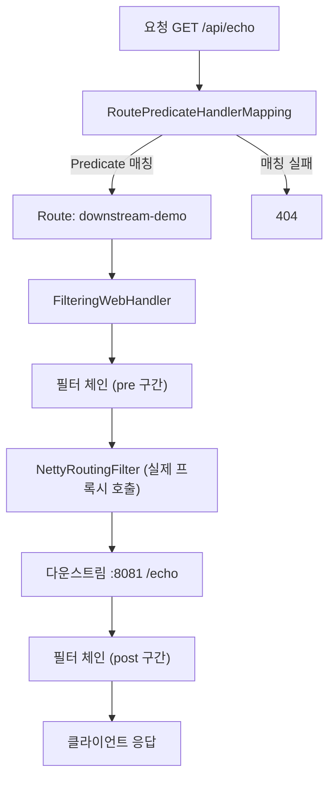

# 01. Spring Cloud Gateway — 라우트와 필터 체인

> 요청이 `@RestController` 로 가지 않고 **Route(Predicate + Filter)** 를 통과해 다운스트림으로 프록시되는 구조.
> 관련: Phase 1 Step 2 · 코드 `gateway/src/main/kotlin/me/ramos/unigate/config/GatewayRouteConfig.kt`

## 1. 왜 필요했나

Phase 1 Step 2 에서 `/api/**` 요청을 샘플 다운스트림(`localhost:8081`)으로 넘겨야 했다.
그런데 게이트웨이에는 **컨트롤러가 하나도 없다.** 핸들러 메서드가 없는데 요청이 어떻게
처리되어 다른 서버로 나가는지가 이해되지 않으면, 이후 TokenRelay·헤더 strip 을 어디에
끼워 넣어야 하는지 판단할 수 없다.

## 2. 익숙한 방식과의 대조

| | Spring MVC | Spring Cloud Gateway |
|---|---|---|
| 요청 도착점 | `@RestController` 의 핸들러 메서드 | **Route** (핸들러 메서드 없음) |
| 매칭 방식 | `@GetMapping("/echo")` 애노테이션 | **Predicate** (`path`, `method`, `header`, `host` …) |
| 가로채기 | `HandlerInterceptor`, `Filter` | **GlobalFilter**(전역) / **GatewayFilter**(라우트별) |
| 응답 생성 | 메서드 반환값 | **다운스트림 응답을 중계** |
| 로직 위치 | 애플리케이션 코드 | 대부분 **설정**(라우트 정의) |

핵심 차이는 게이트웨이가 **응답을 만들지 않는다**는 점이다. 요청을 받아 변형하고 넘긴 뒤,
돌아온 응답을 다시 변형해 돌려준다. 그래서 모든 기능이 "필터 체인의 어느 지점에 끼울 것인가"
문제로 환원된다.

## 3. 동작 원리

Route 하나는 4가지로 구성된다.

| 구성 | 이 프로젝트의 값 | 역할 |
|---|---|---|
| id | `downstream-demo` | 식별자 (로그·메트릭에 노출) |
| Predicate | `path("/api/**")` | 이 라우트가 처리할지 판단 |
| Filters | `stripPrefix(1)` | 통과하는 요청/응답 변형 |
| URI | `http://localhost:8081` | 프록시 대상 |



**필터는 pre/post 두 구간을 갖는다.** `chain.filter(exchange)` 호출 **전** 코드가 pre,
그 뒤에 이어 붙인 코드가 post 다. 하나의 필터가 요청과 응답을 모두 만질 수 있다.

`stripPrefix(1)` 은 경로의 첫 세그먼트를 제거한다. `/api/echo` → `/echo`.
**쿼리스트링은 유지된다.**

> `.uri("http://localhost:8081")` 의 **경로 부분은 무시된다.** 다운스트림 경로는 URI 가 아니라
> 필터(`stripPrefix`, `setPath`, `rewritePath`)로 결정한다. 여기에 `/echo` 를 적어도 반영되지 않는다.

## 4. 직접 확인한 것

> ✍️ **직접 실행하고 결과를 기록하는 섹션.**

사전 준비:
```bash
docker compose up -d
(cd samples/downstream-demo && ./gradlew bootRun)   # :8081
source ./keycloak.secret.env && ./gradlew :gateway:bootRun   # :8080
```

확인 1 — 게이트웨이 경유 시 다운스트림이 받는 경로/헤더
```bash
curl -s 'localhost:8080/api/echo?foo=bar' -H 'X-Test: via-gateway' | jq
```
관찰 포인트: `path` 가 `/api/echo` 인가 `/echo` 인가? `host` 헤더는 누구로 찍히는가? `query` 는 살아있는가?

```
# 출력 붙여넣기
```

관찰:

확인 2 — Predicate 에 매칭되지 않는 경로
```bash
curl -s -o /dev/null -w '%{http_code}\n' localhost:8080/nope
```
관찰 포인트: 게이트웨이가 직접 404 를 내는가, 다운스트림까지 가는가?

```
# 출력 붙여넣기
```

확인 3 — 다운스트림을 **끄고** 같은 요청을 보내면?
관찰 포인트: 어떤 상태코드가 나오는가? 이 응답은 누가 만든 것인가?

```
# 출력 붙여넣기
```

## 5. 함정 / 실패 모드

| 함정 | 증상 | 원인 | 해결 |
|---|---|---|---|
| **Spring Security 기본 체인이 전부 보호** | `/actuator/health` 조차 302 → `/oauth2/authorization/keycloak` | `spring-boot-starter-oauth2-client` 가 클래스패스에 있고 client registration 이 설정되면, `SecurityConfig` 를 **작성하지 않아도** 기본 체인이 자동 구성되어 모든 경로에 인증을 요구한다 | `SecurityWebFilterChain` 을 직접 정의해 정책을 명시 |
| `stripPrefix` 누락 | 다운스트림 404 | `/api/echo` 가 그대로 전달됨 | `stripPrefix(1)` 또는 `rewritePath` |
| `.uri()` 에 경로 포함 | 경로가 반영되지 않음 | SCG 는 URI 의 path 를 쓰지 않는다 | 필터로 경로 조작 |
| Host 헤더 변경 | 다운스트림이 원래 호스트를 모름 | 기본적으로 다운스트림 주소로 재작성 | 필요 시 `preserveHostHeader` 또는 `X-Forwarded-*` |
| **`.then()` 으로 post 처리** | 다운스트림 연결 실패·타임아웃·클라이언트 이탈 시 **post 로그가 통째로 사라짐** | `Mono.then()` 은 `onComplete` 에서만 실행된다. `onError`/`cancel` 에서는 구독조차 되지 않는다 | `.doFinally { signal -> }` — 세 종결 시그널 모두에서 실행 |

> **`.then()` 함정이 특히 나쁜 이유**: 정상 요청에서는 완벽하게 동작하므로 개발 중에 드러나지 않는다.
> 그러다 정작 **조사가 필요한 순간(연결 실패·타임아웃)에만 침묵한다.** 관찰 도구가 관찰이
> 필요할 때 사라지는 셈이다. `doFinally` 의 `signal` 값(`onComplete`/`onError`/`cancel`)을 함께
> 찍으면 "왜 status 가 null 인가"까지 로그만으로 판단할 수 있다.

> **첫 번째 함정이 이 단계에서 실제로 발생했다.** actuator 가 302 를 반환해 헬스체크가 불가능했다.
> 증상만 보면 게이트웨이 라우팅 문제처럼 보이지만 원인은 Security 자동 구성이었다.
> k8s 환경이었다면 **readiness probe 가 계속 실패해 파드가 기동되지 않았을 것**이다.

## 6. 남은 의문

> ✍️ **직접 작성하는 섹션.** 다음 학습의 진입점이다.

- [ ] GlobalFilter 와 GatewayFilter 는 실행 순서가 어떻게 정해지는가? (`Ordered`)
- [ ] 다운스트림이 죽었을 때 게이트웨이는 어떤 응답을 만드는가? 이 동작을 어디서 바꾸는가?
- [ ] 
