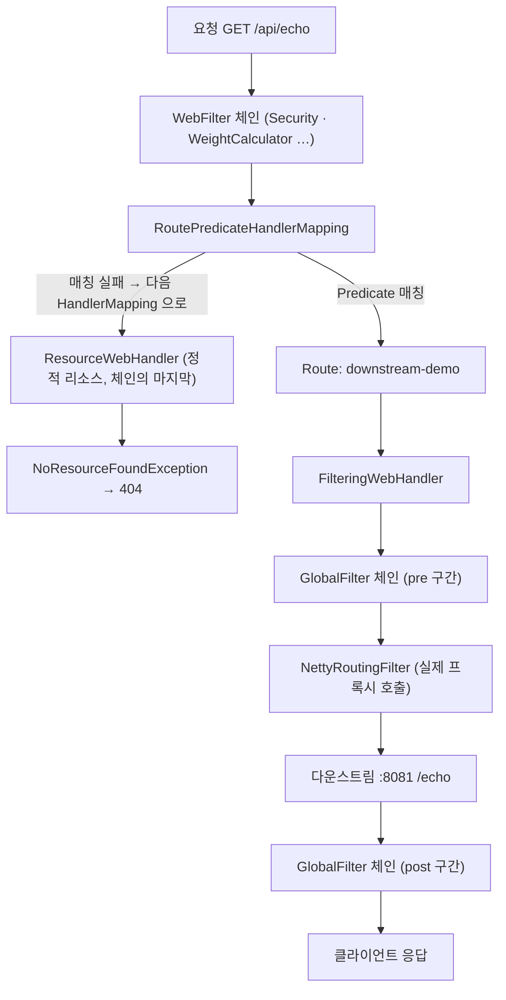

# 01. Spring Cloud Gateway — 라우트와 필터 체인

> 요청이 `@RestController` 로 가지 않고 **Route(Predicate + Filter)** 를 통과해 다운스트림으로 프록시되는 구조.
> 관련: Phase 1 Step 2 · 코드 `gateway/src/main/kotlin/me/ramos/unigate/config/GatewayRouteConfig.kt`

## 1. 왜 필요했나

Phase 1 Step 2 에서 `/api/**` 요청을 샘플 다운스트림(`localhost:8081`)으로 넘겨야 했다.
그런데 게이트웨이에는 **컨트롤러가 하나도 없다.** 핸들러 메서드가 없는데 요청이 어떻게
처리되어 다른 서버로 나가는지가 이해되지 않으면, 이후 TokenRelay·헤더 strip 을 어디에
끼워 넣어야 하는지 판단할 수 없다.

## 2. 익숙한 방식과의 대조

| | Spring MVC | Spring Cloud Gateway |
|---|---|---|
| 요청 도착점 | `@RestController` 의 핸들러 메서드 | **Route** (핸들러 메서드 없음) |
| 매칭 방식 | `@GetMapping("/echo")` 애노테이션 | **Predicate** (`path`, `method`, `header`, `host` …) |
| 가로채기 | `HandlerInterceptor`, `Filter` | **GlobalFilter**(전역) / **GatewayFilter**(라우트별) |
| 응답 생성 | 메서드 반환값 | **다운스트림 응답을 중계** |
| 로직 위치 | 애플리케이션 코드 | 대부분 **설정**(라우트 정의) |

핵심 차이는 게이트웨이가 **응답을 만들지 않는다**는 점이다. 요청을 받아 변형하고 넘긴 뒤,
돌아온 응답을 다시 변형해 돌려준다. 그래서 모든 기능이 "필터 체인의 어느 지점에 끼울 것인가"
문제로 환원된다.

## 3. 동작 원리

Route 하나는 4가지로 구성된다.

| 구성 | 이 프로젝트의 값 | 역할 |
|---|---|---|
| id | `downstream-demo` | 식별자 (로그·메트릭에 노출) |
| Predicate | `path("/api/**")` | 이 라우트가 처리할지 판단 |
| Filters | `stripPrefix(1)` | 통과하는 요청/응답 변형 |
| URI | `http://localhost:8081` | 프록시 대상 |



**필터는 pre/post 두 구간을 갖는다.** `chain.filter(exchange)` 호출 **전** 코드가 pre,
그 뒤에 이어 붙인 코드가 post 다. 하나의 필터가 요청과 응답을 모두 만질 수 있다.

`stripPrefix(1)` 은 경로의 첫 세그먼트를 제거한다. `/api/echo` → `/echo`.
**쿼리스트링은 유지된다.**

> `.uri("http://localhost:8081")` 의 **경로 부분은 무시된다.** 다운스트림 경로는 URI 가 아니라
> 필터(`stripPrefix`, `setPath`, `rewritePath`)로 결정한다. 여기에 `/echo` 를 적어도 반영되지 않는다.

### WebFilter 와 GlobalFilter 는 층이 다르다

위 그림에서 **라우트 매칭이 경계선**이다. 그 앞은 WebFlux 의 `WebFilter` 층(Spring Security 가
여기 산다), 뒤가 SCG 의 `GlobalFilter` 층이다. 순서는 확인 3 의 스택트레이스 체크포인트로
관찰할 수 있다 — 목록은 **안쪽부터** 나열되므로 실행 순서는 아래에서 위로 읽는다.

```
*__checkpoint ⇢ WeightCalculatorWebFilter          ← 가장 안쪽 = 가장 나중
*__checkpoint ⇢ AuthorizationWebFilter
   ...
*__checkpoint ⇢ WebFilterChainProxy                (Security 체인 전체)
*__checkpoint ⇢ HTTP GET "/api/echo" [ExceptionHandlingWebHandler]   ← 가장 바깥 = 가장 먼저
```

`RequestLoggingFilter`(`GlobalFilter`)는 이 목록에 **없다.** 훨씬 안쪽이기 때문이다.

여기서 나오는 결론 두 가지:

- **인증은 라우팅보다 먼저 결정된다.** Security 가 막으면 라우트는 평가조차 되지 않는다.
- **`GlobalFilter` 는 "모든 요청"이 아니라 "라우트에 매칭된 요청"의 필터다.** 매칭 실패 요청까지
  보려면 `WebFilter` 를 써야 한다 (§5).

### 매칭 실패 시 404 는 누가 만드는가

`RoutePredicateHandlerMapping` 이 매칭에 실패해도 **거기서 404 를 만들지 않는다.** WebFlux 의
`HandlerMapping` 은 **여러 개가 순서대로** 시도되고, 아무도 안 맡으면 마지막 후보인
**정적 리소스 핸들러**까지 흘러간다. 확인 2 의 로그가 이를 보여준다.

```
Resolved [NoResourceFoundException: 404 NOT_FOUND "No static resource nope."] for HTTP GET /nope
```

`"No static resource nope."` 라는 문구가 **오해를 부른다.** 정적 파일 설정 문제처럼 읽히지만
실제 의미는 **"어떤 핸들러도 이 요청을 맡지 않았다"** 이다. 게이트웨이에서 이 메시지를 보면
정적 리소스가 아니라 **라우트 정의(Predicate)를 의심해야 한다.**

## 4. 직접 확인한 것

> ✍️ **직접 실행하고 결과를 기록하는 섹션.**

사전 준비:
```bash
docker compose up -d
(cd samples/downstream-demo && ./gradlew bootRun)   # :8081
source ./keycloak.secret.env && ./gradlew :gateway:bootRun   # :8080
```

확인 1 — 게이트웨이 경유 시 다운스트림이 받는 경로/헤더
```bash
curl -s 'localhost:8080/api/echo?foo=bar' -H 'X-Test: via-gateway' | jq
```
관찰 포인트: `path` 가 `/api/echo` 인가 `/echo` 인가? `host` 헤더는 누구로 찍히는가? `query` 는 살아있는가?

```
# 출력 붙여넣기
## curl 결과
➜  ~ curl -s 'localhost:8080/api/echo?foo=bar' -H 'X-Test: via-gateway' | jq
{
  "method": "GET",
  "path": "/echo",
  "query": "foo=bar",
  "headers": {
    "user-agent": "curl/8.7.1",
    "accept": "*/*",
    "x-test": "via-gateway",
    "host": "localhost:8081",
    "content-length": "0"
  },
  "authorization": {
    "present": false,
    "jwt": null,
    "payload": null,
    "rawValue": null
  }
}
➜  ~

## downstream-demo 로그
2026-07-20T20:40:01.148+09:00  INFO 99488 --- [downstream-demo] [nio-8081-exec-2] me.ramos.downstream.EchoController       : echo 요청 수신: path=/echo, headers=[user-agent, accept, x-test, host, content-length]

## Unigate 로그
2026-07-20T20:40:01.144+09:00  INFO 2573 --- [unigate] [     parallel-4] m.r.u.a.gatewayIn.RequestLoggingFilter   : [pre ] GET /api/echo thread=parallel-4
2026-07-20T20:40:01.151+09:00  INFO 2573 --- [unigate] [ctor-http-nio-5] m.r.u.a.gatewayIn.RequestLoggingFilter   : [post] GET /api/echo status=200 OK signal=onComplete elapsedMs=6 thread=reactor-http-nio-5
```

관찰: 다운스트림은 path를 `/echo` 로 받았다. `stripPrefix(1)` 필터가 적용된 것이다. `host` 헤더는 다운스트림 주소(`localhost:8081`)로 바뀌었다. 쿼리스트링(`foo=bar`)은 그대로 살아있다. `X-Test` 헤더도 그대로 전달됐다.

확인 2 — Predicate 에 매칭되지 않는 경로
```bash
curl -s -o /dev/null -w '%{http_code}\n' localhost:8080/nope
```
관찰 포인트: 게이트웨이가 직접 404 를 내는가, 다운스트림까지 가는가?

```
# 출력 붙여넣기
## curl 결과
➜  ~ curl -s -o /dev/null -w '%{http_code}\n' localhost:8080/nope
404

## Unigate 로그 — 기본 레벨(INFO)에서는 게이트웨이·다운스트림 양쪽 모두 한 줄도 없음

## application-local.yml 에 아래를 추가한 뒤 재기동하면 비로소 보인다
##   logging.level.org.springframework.boot.autoconfigure.web.reactive.error: DEBUG
2026-07-20T20:52:26.962+09:00 DEBUG 9818 --- [unigate] [     parallel-3] a.w.r.e.AbstractErrorWebExceptionHandler : [6725852c-1] Resolved [NoResourceFoundException: 404 NOT_FOUND "No static resource nope."] for HTTP GET /nope
```

확인 3 — 다운스트림을 **끄고** 같은 요청을 보내면?
관찰 포인트: 어떤 상태코드가 나오는가? 이 응답은 누가 만든 것인가?

```
# 출력 붙여넣기
## curl 결과
➜  ~ curl -s -o /dev/null -w '%{http_code}\n' localhost:8080/api/echo
500

## Unigate 로그
2026-07-20T20:44:02.523+09:00  INFO 2573 --- [unigate] [     parallel-8] m.r.u.a.gatewayIn.RequestLoggingFilter   : [pre ] GET /api/echo thread=parallel-8
2026-07-20T20:44:02.530+09:00 ERROR 2573 --- [unigate] [tor-http-nio-10] a.w.r.e.AbstractErrorWebExceptionHandler : [6dedc5cf-6]  500 Server Error for HTTP GET "/api/echo"

io.netty.channel.AbstractChannel$AnnotatedConnectException: Connection refused: localhost/127.0.0.1:8081
	Suppressed: reactor.core.publisher.FluxOnAssembly$OnAssemblyException:
Error has been observed at the following site(s):
	*__checkpoint ⇢ org.springframework.cloud.gateway.filter.WeightCalculatorWebFilter [DefaultWebFilterChain]
	*__checkpoint ⇢ AuthorizationWebFilter [DefaultWebFilterChain]
	*__checkpoint ⇢ ExceptionTranslationWebFilter [DefaultWebFilterChain]
	*__checkpoint ⇢ LogoutWebFilter [DefaultWebFilterChain]
	*__checkpoint ⇢ ServerRequestCacheWebFilter [DefaultWebFilterChain]
	*__checkpoint ⇢ SecurityContextServerWebExchangeWebFilter [DefaultWebFilterChain]
	*__checkpoint ⇢ ReactorContextWebFilter [DefaultWebFilterChain]
	*__checkpoint ⇢ HttpHeaderWriterWebFilter [DefaultWebFilterChain]
	*__checkpoint ⇢ ServerWebExchangeReactorContextWebFilter [DefaultWebFilterChain]
	*__checkpoint ⇢ org.springframework.security.web.server.WebFilterChainProxy [DefaultWebFilterChain]
	*__checkpoint ⇢ HTTP GET "/api/echo" [ExceptionHandlingWebHandler]
Original Stack Trace:
Caused by: java.net.ConnectException: Connection refused
	at java.base/sun.nio.ch.Net.pollConnect(Native Method) ~[na:na]
	at java.base/sun.nio.ch.Net.pollConnectNow(Net.java:694) ~[na:na]
	at java.base/sun.nio.ch.SocketChannelImpl.finishConnect(SocketChannelImpl.java:973) ~[na:na]
	at io.netty.channel.socket.nio.NioSocketChannel.doFinishConnect(NioSocketChannel.java:336) ~[netty-transport-4.1.123.Final.jar:4.1.123.Final]
	at io.netty.channel.nio.AbstractNioChannel$AbstractNioUnsafe.finishConnect(AbstractNioChannel.java:339) ~[netty-transport-4.1.123.Final.jar:4.1.123.Final]
	at io.netty.channel.nio.NioEventLoop.processSelectedKey(NioEventLoop.java:784) ~[netty-transport-4.1.123.Final.jar:4.1.123.Final]
	at io.netty.channel.nio.NioEventLoop.processSelectedKeysOptimized(NioEventLoop.java:732) ~[netty-transport-4.1.123.Final.jar:4.1.123.Final]
	at io.netty.channel.nio.NioEventLoop.processSelectedKeys(NioEventLoop.java:658) ~[netty-transport-4.1.123.Final.jar:4.1.123.Final]
	at io.netty.channel.nio.NioEventLoop.run(NioEventLoop.java:562) ~[netty-transport-4.1.123.Final.jar:4.1.123.Final]
	at io.netty.util.concurrent.SingleThreadEventExecutor$4.run(SingleThreadEventExecutor.java:998) ~[netty-common-4.1.123.Final.jar:4.1.123.Final]
	at io.netty.util.internal.ThreadExecutorMap$2.run(ThreadExecutorMap.java:74) ~[netty-common-4.1.123.Final.jar:4.1.123.Final]
	at io.netty.util.concurrent.FastThreadLocalRunnable.run(FastThreadLocalRunnable.java:30) ~[netty-common-4.1.123.Final.jar:4.1.123.Final]
	at java.base/java.lang.Thread.run(Thread.java:1583) ~[na:na]

2026-07-20T20:44:02.534+09:00  INFO 2573 --- [unigate] [tor-http-nio-10] m.r.u.a.gatewayIn.RequestLoggingFilter   : [post] GET /api/echo status=500 INTERNAL_SERVER_ERROR signal=onError elapsedMs=10 thread=reactor-http-nio-10

```

## 5. 함정 / 실패 모드

| 함정 | 증상 | 원인 | 해결 |
|---|---|---|---|
| **Spring Security 기본 체인이 전부 보호** | `/actuator/health` 조차 302 → `/oauth2/authorization/keycloak` | `spring-boot-starter-oauth2-client` 가 클래스패스에 있고 client registration 이 설정되면, `SecurityConfig` 를 **작성하지 않아도** 기본 체인이 자동 구성되어 모든 경로에 인증을 요구한다 | `SecurityWebFilterChain` 을 직접 정의해 정책을 명시 |
| `stripPrefix` 누락 | 다운스트림 404 | `/api/echo` 가 그대로 전달됨 | `stripPrefix(1)` 또는 `rewritePath` |
| `.uri()` 에 경로 포함 | 경로가 반영되지 않음 | SCG 는 URI 의 path 를 쓰지 않는다 | 필터로 경로 조작 |
| Host 헤더 변경 | 다운스트림이 원래 호스트를 모름 | 기본적으로 다운스트림 주소로 재작성 | 필요 시 `preserveHostHeader` 또는 `X-Forwarded-*` |
| **`.then()` 으로 post 처리** | 다운스트림 연결 실패·타임아웃·클라이언트 이탈 시 **post 로그가 통째로 사라짐** | `Mono.then()` 은 `onComplete` 에서만 실행된다. `onError`/`cancel` 에서는 구독조차 되지 않는다 | `.doFinally { signal -> }` — 세 종결 시그널 모두에서 실행 |
| **다운스트림 장애가 `500` 으로 나간다** | 다운스트림만 죽었는데 게이트웨이가 500 을 반환 | SCG 는 `ConnectException` 을 **매핑하지 않는다.** 처리되지 않은 예외가 WebFlux 범용 핸들러(`AbstractErrorWebExceptionHandler`)까지 올라가 기본값 500 이 된다 | `ErrorWebExceptionHandler` 로 `ConnectException`→502, `TimeoutException`→504 매핑. 장애 전파 차단까지 필요하면 `circuitBreaker` 필터 + fallback |
| **`GlobalFilter` 는 매칭 실패 요청을 못 본다** | 라우트에 없는 경로로 온 요청이 **접근 로그에 흔적조차 없음** | `GlobalFilter` 체인은 라우트 매칭 **성공 후** `FilteringWebHandler` 가 실행한다 (§3) | 전수 접근 로그가 필요하면 `WebFilter` 로 구현 |
| **4xx 는 기본 로그 레벨에서 보이지 않는다** | 500 은 `ERROR` 로 찍히는데 404 는 한 줄도 안 남음 | `AbstractErrorWebExceptionHandler` 는 5xx 를 `ERROR`, 4xx 를 `DEBUG` 로 남긴다. 기본 레벨(INFO)에서는 4xx 가 통째로 묻힌다 | `logging.level.org.springframework.boot.autoconfigure.web.reactive.error: DEBUG` |
| **`"No static resource X."` 메시지의 오독** | 정적 리소스 설정 문제로 보임 | 실제로는 **어떤 HandlerMapping 도 맡지 않아** 마지막 후보인 정적 리소스 핸들러까지 흘러간 것 (§3) | 정적 파일이 아니라 **라우트 Predicate** 를 확인한다 |
| **상태코드를 고치면 원인 로그가 사라진다** | 500→502 매핑 후 다운스트림 장애가 기본 레벨에서 **무음**이 됨 | 처리되지 않은 예외는 `ERROR` + 스택트레이스로 남지만, `ResponseStatusException` 은 **"의도된 응답"** 으로 간주되어 `DEBUG` 로 내려간다 | 변환 시점에 **직접 `WARN` 을 남긴다.** 원인 예외를 함께 넘겨 스택트레이스를 보존한다 |

> **`.then()` 함정이 특히 나쁜 이유**: 정상 요청에서는 완벽하게 동작하므로 개발 중에 드러나지 않는다.
> 그러다 정작 **조사가 필요한 순간(연결 실패·타임아웃)에만 침묵한다.** 관찰 도구가 관찰이
> 필요할 때 사라지는 셈이다. `doFinally` 의 `signal` 값(`onComplete`/`onError`/`cancel`)을 함께
> 찍으면 "왜 status 가 null 인가"까지 로그만으로 판단할 수 있다.
>
> **확인 3 에서 실측으로 검증됐다.** 다운스트림을 끄자 `signal=onError` 로 종결됐는데 post 로그는
> 살아남았다. `.then()` 이었다면 이 줄이 없어, "pre 는 있는데 끝난 흔적이 없는" 로그가 됐을 것이다.
> 또한 에러 핸들러의 `ERROR` 로그(`.530`)가 post(`.534`)보다 **먼저** 찍혔다. 응답이 커밋된 뒤에
> `doFinally` 가 돌았기 때문에 `status=500` 이 제대로 남았다. 순서가 반대였다면 `status=null` 이다.

> **`500` 이 왜 문제인가 (운영 관점)**: 상태코드는 **누구를 봐야 하는지**를 알려주는 신호다.
> `500` 은 "게이트웨이 자신의 버그", `502/503` 은 "업스트림 장애"를 뜻한다. 다운스트림이 죽었을 뿐인데
> 500 이 나가면 온콜이 게이트웨이 코드부터 뒤지게 되고, LB·클라이언트는 재시도해도 안전한 요청을
> 재시도하지 않는다. 대시보드의 5xx 도 전부 게이트웨이 탓으로 집계된다.

> **매칭 실패 요청이 로그에 없다는 것의 무게**: 오타 경로·스캐닝·FE 의 잘못된 호출이 전부
> **무음으로 404** 가 된다. "요청이 안 온다"와 "라우트에 안 걸렸다"를 게이트웨이 로그만으로
> 구분할 수 없다. 확인 2 에서 게이트웨이·다운스트림 **양쪽 모두 로그가 없었던** 것이 이 증상이다.
>
> 원인이 **둘 겹쳐** 있다는 점이 중요하다. ① `GlobalFilter` 미도달 ② 4xx 가 `DEBUG` 레벨.
> 로그 레벨만 올려도 404 자체는 보이지만, 그건 **에러 핸들러가 남기는 사후 기록**이지 접근 로그가
> 아니다. 정상 200 요청과 나란히 놓고 볼 수 있는 전수 접근 로그는 여전히 `WebFilter` 가 필요하다.

> **"고쳤더니 안 보이게 됐다"** — `DownstreamErrorMappingFilter` 를 넣고 나서야 드러난 부작용이다.
> 500 일 때는 처리되지 않은 예외라서 `ERROR` + 스택트레이스가 남았는데, `ResponseStatusException`
> 으로 바꾸자 Spring 이 이를 **의도된 응답**으로 보고 `DEBUG` 로 낮췄다. 상태코드는 정확해졌는데
> 원인은 기본 레벨에서 사라진 것이다.
>
> 교훈은 **"예외를 의도된 응답으로 바꾸는 순간 관측 책임도 같이 넘어온다"** 는 것이다.
> 프레임워크가 대신 남겨주던 로그가 사라지므로, 변환하는 쪽이 직접 남겨야 한다.
> `DownstreamErrorMappingFilter` 는 변환과 `WARN` 로깅을 **같은 함수 안에서** 하여 둘이 분리되지
> 않게 했다.

> **첫 번째 함정이 이 단계에서 실제로 발생했다.** actuator 가 302 를 반환해 헬스체크가 불가능했다.
> 증상만 보면 게이트웨이 라우팅 문제처럼 보이지만 원인은 Security 자동 구성이었다.
> k8s 환경이었다면 **readiness probe 가 계속 실패해 파드가 기동되지 않았을 것**이다.

## 6. 남은 의문

> ✍️ **직접 작성하는 섹션.** 다음 학습의 진입점이다.

### 이번에 답이 나온 것

- [x] **다운스트림이 죽었을 때 게이트웨이는 어떤 응답을 만드는가?**
      → `500`. SCG 는 `ConnectException` 을 매핑하지 않고, WebFlux 범용 핸들러
      `AbstractErrorWebExceptionHandler` 가 기본값으로 만든다. (확인 3)
- [x] **매칭 실패 시 404 는 누가 만드는가?**
      → `RoutePredicateHandlerMapping` 이 아니다. 아무 `HandlerMapping` 도 맡지 않아
      마지막 후보인 정적 리소스 핸들러까지 흘러가 `NoResourceFoundException` 이 난다. (확인 2)
- [x] **`GlobalFilter` 는 모든 요청을 보는가?**
      → 아니다. 라우트에 매칭된 요청만 본다. `/nope` 은 `[pre ]` 조차 남지 않았다. (확인 2)

### 아직 모르는 것

- [x] **`ConnectException` → 502 매핑을 어디에 넣을 것인가?**
      → `GlobalFilter` 의 `onErrorMap` 으로 **예외를 변환**한다
      (`adapter/gatewayIn/DownstreamErrorMappingFilter.kt`).
      커스텀 `ErrorWebExceptionHandler` 도 후보였으나, 바꾸려는 것이 "어떻게 그릴 것인가"가 아니라
      **"이 예외가 무슨 뜻인가" 하나뿐**이라 변환이 더 작고 회귀 위험이 낮다. 핸들러를 직접
      구현하면 404·인증 실패 등 지금 잘 도는 경로까지 떠안는다.
      응답 본문 형식을 게이트웨이 표준으로 통일해야 할 때 비로소 핸들러가 필요해진다.
- [ ] **`pre` 는 왜 `parallel-*` 인가?**
      확인 1(200)·확인 3(500) 은 물론, **라우트 매칭조차 못 한 확인 2(404)의 에러 핸들러도
      `parallel-3`** 이었다. 즉 스케줄러 전환은 SCG 필터 체인이 아니라 **그 앞의 `WebFilter` 층**
      에서 일어난다. 어느 `WebFilter` 인지가 남았다.
      → `02-webflux-event-loop.md` §6 과 **같은 사안**이다. 조사 방법도 거기에 있다.
- [ ] **`GlobalFilter` 와 `GatewayFilter` 의 실행 순서는 어떻게 정해지는가?** (`Ordered`)
      `RequestLoggingFilter` 는 `HIGHEST_PRECEDENCE` 를 줬는데, 라우트별 `GatewayFilter` 와
      섞였을 때 어떤 순서가 되는가?
- [ ] **전수 접근 로그를 `WebFilter` 로 만든다면 어디에 둬야 하는가?**
      Security 체인보다 앞인가 뒤인가. 앞이면 인증 실패 요청도 찍히지만, 그 시점엔 아직
      사용자 식별 정보가 없다.
- [ ] **읽기/응답 타임아웃은 어떤 예외로 오는가?**
      `DownstreamErrorMappingFilter` 는 지금 **연결 계열(`ConnectException`)만** 매핑한다.
      다운스트림이 살아 있으면서 **응답만 늦는** 경우는 아직 재현해보지 않았다.
      → 재현 방법: 샘플 BE 에 의도적으로 지연되는 엔드포인트를 두고,
        `spring.cloud.gateway.httpclient.response-timeout` 을 짧게 준 뒤 어떤 예외가 오는지 확인한다.
        (`ReadTimeoutException` 인가 `TimeoutException` 인가 → 504 매핑 추가)
- [ ] **`circuitBreaker` 를 언제 도입할 것인가?**
      상태코드 정정(완료)과 **장애 전파 차단**은 다른 문제다. 다운스트림이 계속 죽어 있을 때
      매 요청이 연결 시도로 40ms 씩 소모하는 것을 언제부터 막아야 하는가.
      의존성(`spring-cloud-starter-circuitbreaker-reactor-resilience4j`)은 이미 들어와 있다.
- [ ] 
