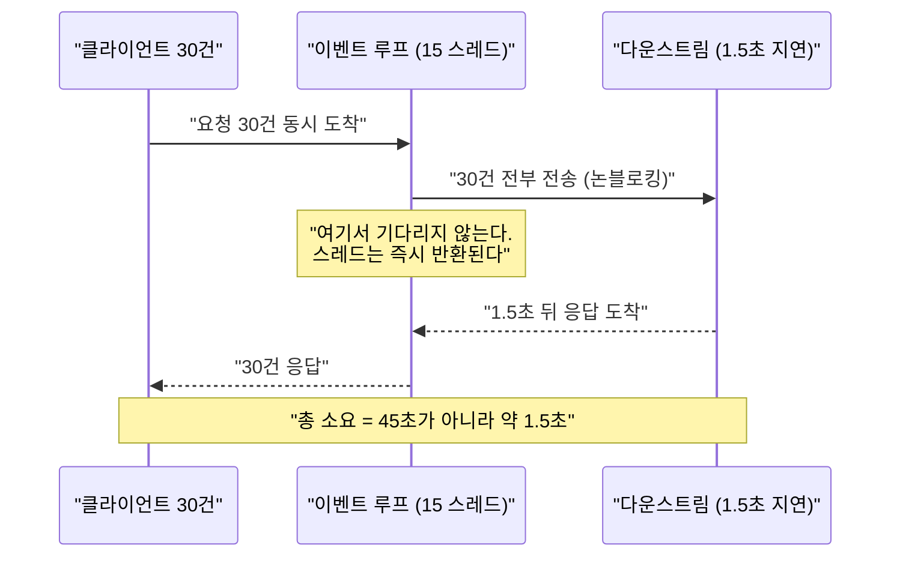
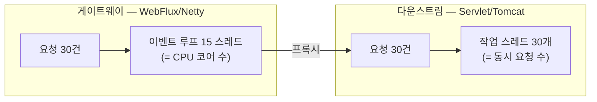

# 02. WebFlux 이벤트 루프 — 요청당 스레드가 없다

> 스레드는 요청에 묶이지 않는다. 하나의 요청이 **여러 스레드를 옮겨 다니며** 처리된다.
> 관련: Phase 1 Step 3 · 코드 `gateway/src/main/kotlin/me/ramos/unigate/adapter/gatewayIn/RequestLoggingFilter.kt`

## 1. 왜 필요했나

Step 3 에서 관찰용 `GlobalFilter` 를 붙였다. 목적은 기능이 아니라, **"이벤트 루프를 막으면
전체가 멈춘다"** 는 경고가 실제로 무슨 뜻인지 확인하는 것이었다.

Servlet 감각으로는 "요청 하나에 스레드 하나"가 당연하다. 이 전제가 깨진다는 걸 눈으로
확인하지 않으면, 앞으로 어떤 코드가 위험한지 판단할 수 없다. 특히 이후 단계에서
Keycloak 호출·DB 접근을 필터 안에 넣게 되므로 지금 짚고 가야 한다.

## 2. 익숙한 방식과의 대조

| | Servlet MVC (Tomcat) | WebFlux (Netty) |
|---|---|---|
| 스레드 모델 | 요청당 스레드 1개 | **이벤트 루프 N개** (N ≈ CPU 코어 수) |
| 기본 풀 크기 | 200 (`server.tomcat.threads.max`) | 코어 수 |
| 동시성 한계 | **스레드 수**가 곧 동시 처리 한계 | 스레드 수와 무관 (I/O 대기가 스레드를 점유하지 않음) |
| 블로킹 호출 | 그 스레드만 묶임, 나머지 199개는 정상 | **이벤트 루프가 묶여 무관한 요청까지 멈춤** |
| 요청 추적 | `ThreadLocal` (MDC, `SecurityContextHolder`) | **ThreadLocal 사용 불가** → Reactor Context |
| 부하 시 증상 | 스레드풀 고갈 → 큐 대기 | 이벤트 루프 점유 → **전체 지연 폭발** |

핵심은 마지막 두 줄이다. Servlet 에서 블로킹은 **국소적 손해**지만, WebFlux 에서는
**전역 장애**가 된다.

## 3. 동작 원리

이벤트 루프 스레드는 I/O 를 **기다리지 않는다.** 다운스트림 호출을 보낸 뒤 즉시 다른 요청을
처리하러 가고, 응답이 도착하면 그때 이어서 처리한다. 그래서 "대기 중인 요청"이 스레드를
점유하지 않는다.



### 스레드 수는 요청 수가 아니라 **하드웨어**에 묶인다

이 프로젝트에는 두 스택이 **나란히** 있다. 게이트웨이는 WebFlux(Netty), 샘플 다운스트림은
Servlet(Tomcat)이다. 같은 30건을 흘려보내면 한 요청이 두 모델을 연달아 지나가므로,
**같은 실험의 로그 안에서 두 스레드 모델을 직접 비교할 수 있다.**

| | 다운스트림 (Tomcat) | 게이트웨이 (Netty) |
|---|---|---|
| 요청 수 | 30 | 30 |
| **사용된 스레드 종류** | **30** (`nio-8081-exec-1`~`30`) | **15** (`parallel-1`~`15` / `reactor-http-nio-1`~`15`) |
| 스레드가 늘어나는 기준 | **동시 요청 수** | **CPU 코어 수** (`hw.ncpu` = 15) |

Tomcat 은 요청마다 스레드를 하나씩 꺼내 썼고, Netty 는 15개로 30건을 처리했다.
요청이 300건이었다면 Tomcat 은 스레드를 300개(풀 한도까지) 쓰려 했겠지만, Netty 는 **그대로 15개**다.



여기서 §2 표의 마지막 두 줄이 왜 그렇게 되는지가 따라 나온다.

- Tomcat 에서 한 스레드를 블로킹하면 **그 요청 하나**가 늦어진다. 나머지는 다른 스레드가 처리한다.
- Netty 에서 한 스레드를 블로킹하면 **전체 처리 용량의 1/15 가 사라진다.** 15개를 다 막으면
  게이트웨이는 아무 요청도 받지 못한다 — 그 15개가 전부이기 때문이다.

> **"스레드를 늘리면 되지 않나"가 통하지 않는 이유**가 이것이다. Netty 의 15는 풀 크기 설정이
> 아니라 **CPU 코어 수에 맞춘 값**이다. 코어보다 많은 이벤트 루프를 두면 컨텍스트 스위칭만
> 늘어난다. 늘려서 해결할 문제가 아니라, **막지 않아야** 하는 문제다.

### 필터의 pre / post 구간

`GlobalFilter` 하나가 요청과 응답을 모두 다룬다.

```kotlin
// pre — chain.filter() 호출 전
return chain.filter(exchange)
    .then(Mono.fromRunnable {
        // post — 다운스트림 응답이 돌아온 뒤
    })
```

**pre 와 post 는 같은 스레드에서 실행된다는 보장이 없다.** 이것이 ThreadLocal 이 깨지는
직접적인 이유다.

## 4. 직접 확인한 것

> ✍️ **직접 실행하고 결과를 기록하는 섹션.**

사전 준비: 게이트웨이(:8080) + 샘플 다운스트림(:8081) 기동, docker compose 기동.

확인 1 — 동시성: 30건 × 1.5초 지연을 동시에 보내면 총 몇 초가 걸리는가?
```bash
time (for i in $(seq 1 30); do
  curl -s -o /dev/null "localhost:8080/api/echo?delayMs=1500&n=$i" &
done; wait)
```
관찰 포인트: 직렬이면 45초다. 실제로는? 이 차이가 논블로킹의 값어치다.

```
# 출력 붙여넣기
## curl
➜  ~ time (for i in $(seq 1 30); do
  curl -s -o /dev/null "localhost:8080/api/echo?delayMs=1500&n=$i" &
done; wait)
( for i in $(seq 1 30); do; curl -s -o /dev/null  &; done; wait; )  0.08s user 0.18s system 15% cpu 1.652 total

## 다운스트림 로그
2026-07-20T21:23:07.103+09:00  INFO 33682 --- [downstream-demo] [io-8081-exec-25] me.ramos.downstream.EchoController       : echo 요청 수신: path=/echo, headers=[user-agent, accept, host, content-length]
2026-07-20T21:23:07.104+09:00  INFO 33682 --- [downstream-demo] [io-8081-exec-17] me.ramos.downstream.EchoController       : echo 요청 수신: path=/echo, headers=[user-agent, accept, host, content-length]
2026-07-20T21:23:07.104+09:00  INFO 33682 --- [downstream-demo] [nio-8081-exec-3] me.ramos.downstream.EchoController       : echo 요청 수신: path=/echo, headers=[user-agent, accept, host, content-length]
2026-07-20T21:23:07.104+09:00  INFO 33682 --- [downstream-demo] [nio-8081-exec-8] me.ramos.downstream.EchoController       : echo 요청 수신: path=/echo, headers=[user-agent, accept, host, content-length]
2026-07-20T21:23:07.104+09:00  INFO 33682 --- [downstream-demo] [io-8081-exec-19] me.ramos.downstream.EchoController       : echo 요청 수신: path=/echo, headers=[user-agent, accept, host, content-length]
2026-07-20T21:23:07.104+09:00  INFO 33682 --- [downstream-demo] [io-8081-exec-15] me.ramos.downstream.EchoController       : echo 요청 수신: path=/echo, headers=[user-agent, accept, host, content-length]
2026-07-20T21:23:07.104+09:00  INFO 33682 --- [downstream-demo] [io-8081-exec-23] me.ramos.downstream.EchoController       : echo 요청 수신: path=/echo, headers=[user-agent, accept, host, content-length]
2026-07-20T21:23:07.103+09:00  INFO 33682 --- [downstream-demo] [io-8081-exec-12] me.ramos.downstream.EchoController       : echo 요청 수신: path=/echo, headers=[user-agent, accept, host, content-length]
2026-07-20T21:23:07.104+09:00  INFO 33682 --- [downstream-demo] [nio-8081-exec-9] me.ramos.downstream.EchoController       : echo 요청 수신: path=/echo, headers=[user-agent, accept, host, content-length]
2026-07-20T21:23:07.105+09:00  INFO 33682 --- [downstream-demo] [io-8081-exec-26] me.ramos.downstream.EchoController       : echo 요청 수신: path=/echo, headers=[user-agent, accept, host, content-length]
2026-07-20T21:23:07.105+09:00  INFO 33682 --- [downstream-demo] [io-8081-exec-29] me.ramos.downstream.EchoController       : echo 요청 수신: path=/echo, headers=[user-agent, accept, host, content-length]
2026-07-20T21:23:07.105+09:00  INFO 33682 --- [downstream-demo] [nio-8081-exec-6] me.ramos.downstream.EchoController       : echo 요청 수신: path=/echo, headers=[user-agent, accept, host, content-length]
2026-07-20T21:23:07.105+09:00  INFO 33682 --- [downstream-demo] [io-8081-exec-22] me.ramos.downstream.EchoController       : echo 요청 수신: path=/echo, headers=[user-agent, accept, host, content-length]
2026-07-20T21:23:07.105+09:00  INFO 33682 --- [downstream-demo] [nio-8081-exec-5] me.ramos.downstream.EchoController       : echo 요청 수신: path=/echo, headers=[user-agent, accept, host, content-length]
2026-07-20T21:23:07.105+09:00  INFO 33682 --- [downstream-demo] [io-8081-exec-18] me.ramos.downstream.EchoController       : echo 요청 수신: path=/echo, headers=[user-agent, accept, host, content-length]
2026-07-20T21:23:07.105+09:00  INFO 33682 --- [downstream-demo] [io-8081-exec-10] me.ramos.downstream.EchoController       : echo 요청 수신: path=/echo, headers=[user-agent, accept, host, content-length]
2026-07-20T21:23:07.105+09:00  INFO 33682 --- [downstream-demo] [io-8081-exec-30] me.ramos.downstream.EchoController       : echo 요청 수신: path=/echo, headers=[user-agent, accept, host, content-length]
2026-07-20T21:23:07.105+09:00  INFO 33682 --- [downstream-demo] [io-8081-exec-27] me.ramos.downstream.EchoController       : echo 요청 수신: path=/echo, headers=[user-agent, accept, host, content-length]
2026-07-20T21:23:07.105+09:00  INFO 33682 --- [downstream-demo] [nio-8081-exec-7] me.ramos.downstream.EchoController       : echo 요청 수신: path=/echo, headers=[user-agent, accept, host, content-length]
2026-07-20T21:23:07.105+09:00  INFO 33682 --- [downstream-demo] [io-8081-exec-24] me.ramos.downstream.EchoController       : echo 요청 수신: path=/echo, headers=[user-agent, accept, host, content-length]
2026-07-20T21:23:07.105+09:00  INFO 33682 --- [downstream-demo] [io-8081-exec-14] me.ramos.downstream.EchoController       : echo 요청 수신: path=/echo, headers=[user-agent, accept, host, content-length]
2026-07-20T21:23:07.105+09:00  INFO 33682 --- [downstream-demo] [io-8081-exec-20] me.ramos.downstream.EchoController       : echo 요청 수신: path=/echo, headers=[user-agent, accept, host, content-length]
2026-07-20T21:23:07.103+09:00  INFO 33682 --- [downstream-demo] [io-8081-exec-28] me.ramos.downstream.EchoController       : echo 요청 수신: path=/echo, headers=[user-agent, accept, host, content-length]
2026-07-20T21:23:07.105+09:00  INFO 33682 --- [downstream-demo] [io-8081-exec-11] me.ramos.downstream.EchoController       : echo 요청 수신: path=/echo, headers=[user-agent, accept, host, content-length]
2026-07-20T21:23:07.105+09:00  INFO 33682 --- [downstream-demo] [nio-8081-exec-4] me.ramos.downstream.EchoController       : echo 요청 수신: path=/echo, headers=[user-agent, accept, host, content-length]
2026-07-20T21:23:07.105+09:00  INFO 33682 --- [downstream-demo] [io-8081-exec-21] me.ramos.downstream.EchoController       : echo 요청 수신: path=/echo, headers=[user-agent, accept, host, content-length]
2026-07-20T21:23:07.104+09:00  INFO 33682 --- [downstream-demo] [nio-8081-exec-2] me.ramos.downstream.EchoController       : echo 요청 수신: path=/echo, headers=[user-agent, accept, host, content-length]
2026-07-20T21:23:07.105+09:00  INFO 33682 --- [downstream-demo] [io-8081-exec-16] me.ramos.downstream.EchoController       : echo 요청 수신: path=/echo, headers=[user-agent, accept, host, content-length]
2026-07-20T21:23:07.106+09:00  INFO 33682 --- [downstream-demo] [io-8081-exec-13] me.ramos.downstream.EchoController       : echo 요청 수신: path=/echo, headers=[user-agent, accept, host, content-length]
2026-07-20T21:23:07.106+09:00  INFO 33682 --- [downstream-demo] [nio-8081-exec-1] me.ramos.downstream.EchoController       : echo 요청 수신: path=/echo, headers=[user-agent, accept, host, content-length]

## Unigate 로그
2026-07-20T21:23:05.527+09:00  INFO 29336 --- [unigate] [     parallel-8] m.r.u.a.gatewayIn.RequestLoggingFilter   : [pre ] GET /api/echo thread=parallel-8
2026-07-20T21:23:05.528+09:00  INFO 29336 --- [unigate] [     parallel-9] m.r.u.a.gatewayIn.RequestLoggingFilter   : [pre ] GET /api/echo thread=parallel-9
2026-07-20T21:23:05.530+09:00  INFO 29336 --- [unigate] [    parallel-10] m.r.u.a.gatewayIn.RequestLoggingFilter   : [pre ] GET /api/echo thread=parallel-10
2026-07-20T21:23:05.531+09:00  INFO 29336 --- [unigate] [    parallel-11] m.r.u.a.gatewayIn.RequestLoggingFilter   : [pre ] GET /api/echo thread=parallel-11
2026-07-20T21:23:05.533+09:00  INFO 29336 --- [unigate] [    parallel-12] m.r.u.a.gatewayIn.RequestLoggingFilter   : [pre ] GET /api/echo thread=parallel-12
2026-07-20T21:23:05.533+09:00  INFO 29336 --- [unigate] [     parallel-1] m.r.u.a.gatewayIn.RequestLoggingFilter   : [pre ] GET /api/echo thread=parallel-1
2026-07-20T21:23:05.533+09:00  INFO 29336 --- [unigate] [    parallel-13] m.r.u.a.gatewayIn.RequestLoggingFilter   : [pre ] GET /api/echo thread=parallel-13
2026-07-20T21:23:05.533+09:00  INFO 29336 --- [unigate] [     parallel-2] m.r.u.a.gatewayIn.RequestLoggingFilter   : [pre ] GET /api/echo thread=parallel-2
2026-07-20T21:23:05.533+09:00  INFO 29336 --- [unigate] [    parallel-14] m.r.u.a.gatewayIn.RequestLoggingFilter   : [pre ] GET /api/echo thread=parallel-14
2026-07-20T21:23:05.533+09:00  INFO 29336 --- [unigate] [     parallel-3] m.r.u.a.gatewayIn.RequestLoggingFilter   : [pre ] GET /api/echo thread=parallel-3
2026-07-20T21:23:05.533+09:00  INFO 29336 --- [unigate] [    parallel-15] m.r.u.a.gatewayIn.RequestLoggingFilter   : [pre ] GET /api/echo thread=parallel-15
2026-07-20T21:23:05.534+09:00  INFO 29336 --- [unigate] [     parallel-4] m.r.u.a.gatewayIn.RequestLoggingFilter   : [pre ] GET /api/echo thread=parallel-4
2026-07-20T21:23:05.535+09:00  INFO 29336 --- [unigate] [     parallel-5] m.r.u.a.gatewayIn.RequestLoggingFilter   : [pre ] GET /api/echo thread=parallel-5
2026-07-20T21:23:05.537+09:00  INFO 29336 --- [unigate] [     parallel-7] m.r.u.a.gatewayIn.RequestLoggingFilter   : [pre ] GET /api/echo thread=parallel-7
2026-07-20T21:23:05.537+09:00  INFO 29336 --- [unigate] [     parallel-6] m.r.u.a.gatewayIn.RequestLoggingFilter   : [pre ] GET /api/echo thread=parallel-6
2026-07-20T21:23:05.539+09:00  INFO 29336 --- [unigate] [     parallel-9] m.r.u.a.gatewayIn.RequestLoggingFilter   : [pre ] GET /api/echo thread=parallel-9
2026-07-20T21:23:05.539+09:00  INFO 29336 --- [unigate] [     parallel-8] m.r.u.a.gatewayIn.RequestLoggingFilter   : [pre ] GET /api/echo thread=parallel-8
2026-07-20T21:23:05.540+09:00  INFO 29336 --- [unigate] [    parallel-10] m.r.u.a.gatewayIn.RequestLoggingFilter   : [pre ] GET /api/echo thread=parallel-10
2026-07-20T21:23:05.541+09:00  INFO 29336 --- [unigate] [    parallel-11] m.r.u.a.gatewayIn.RequestLoggingFilter   : [pre ] GET /api/echo thread=parallel-11
2026-07-20T21:23:05.542+09:00  INFO 29336 --- [unigate] [    parallel-13] m.r.u.a.gatewayIn.RequestLoggingFilter   : [pre ] GET /api/echo thread=parallel-13
2026-07-20T21:23:05.542+09:00  INFO 29336 --- [unigate] [    parallel-12] m.r.u.a.gatewayIn.RequestLoggingFilter   : [pre ] GET /api/echo thread=parallel-12
2026-07-20T21:23:05.543+09:00  INFO 29336 --- [unigate] [    parallel-14] m.r.u.a.gatewayIn.RequestLoggingFilter   : [pre ] GET /api/echo thread=parallel-14
2026-07-20T21:23:05.543+09:00  INFO 29336 --- [unigate] [    parallel-15] m.r.u.a.gatewayIn.RequestLoggingFilter   : [pre ] GET /api/echo thread=parallel-15
2026-07-20T21:23:05.544+09:00  INFO 29336 --- [unigate] [     parallel-1] m.r.u.a.gatewayIn.RequestLoggingFilter   : [pre ] GET /api/echo thread=parallel-1
2026-07-20T21:23:05.544+09:00  INFO 29336 --- [unigate] [     parallel-2] m.r.u.a.gatewayIn.RequestLoggingFilter   : [pre ] GET /api/echo thread=parallel-2
2026-07-20T21:23:05.545+09:00  INFO 29336 --- [unigate] [     parallel-3] m.r.u.a.gatewayIn.RequestLoggingFilter   : [pre ] GET /api/echo thread=parallel-3
2026-07-20T21:23:05.546+09:00  INFO 29336 --- [unigate] [     parallel-4] m.r.u.a.gatewayIn.RequestLoggingFilter   : [pre ] GET /api/echo thread=parallel-4
2026-07-20T21:23:05.546+09:00  INFO 29336 --- [unigate] [     parallel-7] m.r.u.a.gatewayIn.RequestLoggingFilter   : [pre ] GET /api/echo thread=parallel-7
2026-07-20T21:23:05.546+09:00  INFO 29336 --- [unigate] [     parallel-6] m.r.u.a.gatewayIn.RequestLoggingFilter   : [pre ] GET /api/echo thread=parallel-6
2026-07-20T21:23:05.548+09:00  INFO 29336 --- [unigate] [     parallel-5] m.r.u.a.gatewayIn.RequestLoggingFilter   : [pre ] GET /api/echo thread=parallel-5
2026-07-20T21:23:07.149+09:00  INFO 29336 --- [unigate] [ctor-http-nio-6] m.r.u.a.gatewayIn.RequestLoggingFilter   : [post] GET /api/echo status=200 OK signal=onComplete elapsedMs=1615 thread=reactor-http-nio-6
2026-07-20T21:23:07.149+09:00  INFO 29336 --- [unigate] [tor-http-nio-10] m.r.u.a.gatewayIn.RequestLoggingFilter   : [post] GET /api/echo status=200 OK signal=onComplete elapsedMs=1615 thread=reactor-http-nio-10
2026-07-20T21:23:07.149+09:00  INFO 29336 --- [unigate] [ctor-http-nio-2] m.r.u.a.gatewayIn.RequestLoggingFilter   : [post] GET /api/echo status=200 OK signal=onComplete elapsedMs=1606 thread=reactor-http-nio-2
2026-07-20T21:23:07.149+09:00  INFO 29336 --- [unigate] [ctor-http-nio-3] m.r.u.a.gatewayIn.RequestLoggingFilter   : [post] GET /api/echo status=200 OK signal=onComplete elapsedMs=1607 thread=reactor-http-nio-3
2026-07-20T21:23:07.150+09:00  INFO 29336 --- [unigate] [ctor-http-nio-3] m.r.u.a.gatewayIn.RequestLoggingFilter   : [post] GET /api/echo status=200 OK signal=onComplete elapsedMs=1616 thread=reactor-http-nio-3
2026-07-20T21:23:07.149+09:00  INFO 29336 --- [unigate] [tor-http-nio-15] m.r.u.a.gatewayIn.RequestLoggingFilter   : [post] GET /api/echo status=200 OK signal=onComplete elapsedMs=1608 thread=reactor-http-nio-15
2026-07-20T21:23:07.150+09:00  INFO 29336 --- [unigate] [ctor-http-nio-2] m.r.u.a.gatewayIn.RequestLoggingFilter   : [post] GET /api/echo status=200 OK signal=onComplete elapsedMs=1616 thread=reactor-http-nio-2
2026-07-20T21:23:07.150+09:00  INFO 29336 --- [unigate] [tor-http-nio-13] m.r.u.a.gatewayIn.RequestLoggingFilter   : [post] GET /api/echo status=200 OK signal=onComplete elapsedMs=1616 thread=reactor-http-nio-13
2026-07-20T21:23:07.150+09:00  INFO 29336 --- [unigate] [tor-http-nio-12] m.r.u.a.gatewayIn.RequestLoggingFilter   : [post] GET /api/echo status=200 OK signal=onComplete elapsedMs=1621 thread=reactor-http-nio-12
2026-07-20T21:23:07.150+09:00  INFO 29336 --- [unigate] [ctor-http-nio-6] m.r.u.a.gatewayIn.RequestLoggingFilter   : [post] GET /api/echo status=200 OK signal=onComplete elapsedMs=1613 thread=reactor-http-nio-6
2026-07-20T21:23:07.150+09:00  INFO 29336 --- [unigate] [ctor-http-nio-6] m.r.u.a.gatewayIn.RequestLoggingFilter   : [post] GET /api/echo status=200 OK signal=onComplete elapsedMs=1607 thread=reactor-http-nio-6
2026-07-20T21:23:07.150+09:00  INFO 29336 --- [unigate] [ctor-http-nio-8] m.r.u.a.gatewayIn.RequestLoggingFilter   : [post] GET /api/echo status=200 OK signal=onComplete elapsedMs=1617 thread=reactor-http-nio-8
2026-07-20T21:23:07.151+09:00  INFO 29336 --- [unigate] [ctor-http-nio-8] m.r.u.a.gatewayIn.RequestLoggingFilter   : [post] GET /api/echo status=200 OK signal=onComplete elapsedMs=1612 thread=reactor-http-nio-8
2026-07-20T21:23:07.151+09:00  INFO 29336 --- [unigate] [ctor-http-nio-8] m.r.u.a.gatewayIn.RequestLoggingFilter   : [post] GET /api/echo status=200 OK signal=onComplete elapsedMs=1607 thread=reactor-http-nio-8
2026-07-20T21:23:07.151+09:00  INFO 29336 --- [unigate] [ctor-http-nio-1] m.r.u.a.gatewayIn.RequestLoggingFilter   : [post] GET /api/echo status=200 OK signal=onComplete elapsedMs=1605 thread=reactor-http-nio-1
2026-07-20T21:23:07.151+09:00  INFO 29336 --- [unigate] [ctor-http-nio-4] m.r.u.a.gatewayIn.RequestLoggingFilter   : [post] GET /api/echo status=200 OK signal=onComplete elapsedMs=1604 thread=reactor-http-nio-4
2026-07-20T21:23:07.151+09:00  INFO 29336 --- [unigate] [ctor-http-nio-1] m.r.u.a.gatewayIn.RequestLoggingFilter   : [post] GET /api/echo status=200 OK signal=onComplete elapsedMs=1615 thread=reactor-http-nio-1
2026-07-20T21:23:07.151+09:00  INFO 29336 --- [unigate] [ctor-http-nio-9] m.r.u.a.gatewayIn.RequestLoggingFilter   : [post] GET /api/echo status=200 OK signal=onComplete elapsedMs=1612 thread=reactor-http-nio-9
2026-07-20T21:23:07.151+09:00  INFO 29336 --- [unigate] [tor-http-nio-10] m.r.u.a.gatewayIn.RequestLoggingFilter   : [post] GET /api/echo status=200 OK signal=onComplete elapsedMs=1623 thread=reactor-http-nio-10
2026-07-20T21:23:07.151+09:00  INFO 29336 --- [unigate] [tor-http-nio-13] m.r.u.a.gatewayIn.RequestLoggingFilter   : [post] GET /api/echo status=200 OK signal=onComplete elapsedMs=1606 thread=reactor-http-nio-13
2026-07-20T21:23:07.152+09:00  INFO 29336 --- [unigate] [ctor-http-nio-3] m.r.u.a.gatewayIn.RequestLoggingFilter   : [post] GET /api/echo status=200 OK signal=onComplete elapsedMs=1603 thread=reactor-http-nio-3
2026-07-20T21:23:07.152+09:00  INFO 29336 --- [unigate] [tor-http-nio-12] m.r.u.a.gatewayIn.RequestLoggingFilter   : [post] GET /api/echo status=200 OK signal=onComplete elapsedMs=1611 thread=reactor-http-nio-12
2026-07-20T21:23:07.152+09:00  INFO 29336 --- [unigate] [ctor-http-nio-2] m.r.u.a.gatewayIn.RequestLoggingFilter   : [post] GET /api/echo status=200 OK signal=onComplete elapsedMs=1605 thread=reactor-http-nio-2
2026-07-20T21:23:07.152+09:00  INFO 29336 --- [unigate] [tor-http-nio-14] m.r.u.a.gatewayIn.RequestLoggingFilter   : [post] GET /api/echo status=200 OK signal=onComplete elapsedMs=1621 thread=reactor-http-nio-14
2026-07-20T21:23:07.152+09:00  INFO 29336 --- [unigate] [ctor-http-nio-7] m.r.u.a.gatewayIn.RequestLoggingFilter   : [post] GET /api/echo status=200 OK signal=onComplete elapsedMs=1618 thread=reactor-http-nio-7
2026-07-20T21:23:07.152+09:00  INFO 29336 --- [unigate] [ctor-http-nio-7] m.r.u.a.gatewayIn.RequestLoggingFilter   : [post] GET /api/echo status=200 OK signal=onComplete elapsedMs=1608 thread=reactor-http-nio-7
2026-07-20T21:23:07.152+09:00  INFO 29336 --- [unigate] [ctor-http-nio-5] m.r.u.a.gatewayIn.RequestLoggingFilter   : [post] GET /api/echo status=200 OK signal=onComplete elapsedMs=1609 thread=reactor-http-nio-5
2026-07-20T21:23:07.152+09:00  INFO 29336 --- [unigate] [tor-http-nio-15] m.r.u.a.gatewayIn.RequestLoggingFilter   : [post] GET /api/echo status=200 OK signal=onComplete elapsedMs=1619 thread=reactor-http-nio-15
2026-07-20T21:23:07.153+09:00  INFO 29336 --- [unigate] [ctor-http-nio-5] m.r.u.a.gatewayIn.RequestLoggingFilter   : [post] GET /api/echo status=200 OK signal=onComplete elapsedMs=1615 thread=reactor-http-nio-5
2026-07-20T21:23:07.153+09:00  INFO 29336 --- [unigate] [tor-http-nio-11] m.r.u.a.gatewayIn.RequestLoggingFilter   : [post] GET /api/echo status=200 OK signal=onComplete elapsedMs=1622 thread=reactor-http-nio-11
```

확인 2 — 스레드 수: 요청 30건을 몇 개의 스레드가 처리했는가?
```bash
# 게이트웨이 로그에서 (실행 직후, 로그 flush 를 위해 잠깐 기다린 뒤)
grep '\[pre \]'  gateway.log | sed -E 's/.*thread=([^ ]+).*/\1/' | sort | uniq -c
grep '\[post\]'  gateway.log | sed -E 's/.*thread=([^ ]+).*/\1/' | sort | uniq -c
sysctl -n hw.ncpu    # 코어 수와 비교
```
관찰 포인트: 스레드 종류가 30개인가, 코어 수만큼인가?

```
# 확인 1 의 게이트웨이 로그를 gateway.log 로 저장한 뒤 집계
$ grep '[pre ]' gateway.log | sed -E 's/.*thread=([^ ]+).*/\1/' | sort | uniq -c
   2 parallel-1
   2 parallel-10
   2 parallel-11
   2 parallel-12
   2 parallel-13
   2 parallel-14
   2 parallel-15
   2 parallel-2
   2 parallel-3
   2 parallel-4
   2 parallel-5
   2 parallel-6
   2 parallel-7
   2 parallel-8
   2 parallel-9

$ grep '[post]' gateway.log | sed -E 's/.*thread=([^ ]+).*/\1/' | sort | uniq -c
   2 reactor-http-nio-1
   2 reactor-http-nio-10
   1 reactor-http-nio-11
   2 reactor-http-nio-12
   2 reactor-http-nio-13
   1 reactor-http-nio-14
   2 reactor-http-nio-15
   3 reactor-http-nio-2
   3 reactor-http-nio-3
   1 reactor-http-nio-4
   2 reactor-http-nio-5
   3 reactor-http-nio-6
   2 reactor-http-nio-7
   3 reactor-http-nio-8
   1 reactor-http-nio-9

# 요약
pre  요청=30 스레드종류=15
post 요청=30 스레드종류=15

# 다운스트림(Tomcat) 과 비교
다운스트림 요청 수: 30
다운스트림 스레드 번호 유니크 수: 30

$ sysctl -n hw.ncpu
15
```

**요청 30건을 15개 스레드가 처리했고, 그 15는 CPU 코어 수와 정확히 일치한다.**
같은 30건을 받은 Tomcat 은 스레드를 30개 썼다.

`[pre ]` 는 15개가 **정확히 2회씩** 균등하게 쓰였고, `[post]` 는 1~3회로 들쭉날쭉하다.
전자는 스케줄러가 순서대로 배분한 결과, 후자는 다운스트림 응답이 **도착한 순서대로**
그 시점에 비어 있는 이벤트 루프가 집어간 결과다. 같은 15개 풀이라도 배분 방식이 다르다.

확인 3 — pre 와 post 의 스레드 **이름 접두사**를 비교한다.
```bash
grep -E '\[pre |\[post\]' gateway.log \
  | sed -E 's/.*(\[pre \]|\[post\]).*thread=([a-z-]+)-[0-9]+.*/\1 \2/' | sort | uniq -c
```
관찰 포인트: 같은 요청의 pre 와 post 가 같은 스레드에서 실행되는가?
같지 않다면 — `ThreadLocal` 에 값을 넣었다면 post 에서 읽을 수 있겠는가?

```
$ grep -E '\[pre |\[post\]' gateway.log \
    | sed -E 's/.*(\[pre \]|\[post\]).*thread=([a-z-]+)-[0-9]+.*/\1 \2/' | sort | uniq -c
  30 [post] reactor-http-nio
  30 [pre ] parallel
```

**30건 전부, 예외 없이 pre 와 post 의 스레드 종류가 다르다.** 같은 요청인데 pre 는
`parallel-*`(Reactor 공용 병렬 스케줄러), post 는 `reactor-http-nio-*`(Netty 이벤트 루프)다.
"가끔 다를 수 있다"가 아니라 **이 구조에서는 항상 다르다.**

`ThreadLocal` 에 값을 넣었다면 post 에서는 **읽히지 않는다.** 값이 비어 있거나, 더 나쁘게는
그 스레드를 재사용한 **다른 요청의 값**이 읽힌다. 뒤엣것이 진짜 위험하다 — 에러가 나지 않고
조용히 틀린 값을 쓰기 때문이다. (§5)

> pre 가 왜 `parallel-*` 인지는 아직 답하지 못했다. §6 참조.

확인 4 (선택, **주의**) — 이벤트 루프를 일부러 막아본다.
필터의 pre 구간에 `Thread.sleep(3000)` 을 넣고 동시 요청 30건을 보내면 총 시간이 어떻게 되는가?
**확인 후 반드시 되돌린다.**

```bash
# 다운스트림 지연을 0 으로 두어 게이트웨이의 블로킹만 측정한다
time (for i in $(seq 1 30); do
  curl -s -o /dev/null "localhost:8080/api/echo?delayMs=0&n=$i" &
done; wait)
```

```
# 출력 붙여넣기
## curl
( for i in $(seq 1 30); do; curl -s -o /dev/null  &; done; wait; )  0.08s user 0.20s system 3% cpu 9.149 total

## Unigate 로그 — [pre ] 가 3초 간격으로 갈라진다
2026-07-20T21:40:13.583  [pre ] … parallel-8   ┐
2026-07-20T21:40:13.583  [pre ] … parallel-1   │ 1차: 15건 동시 (parallel-1 ~ 15)
   … (15건, 전부 같은 밀리초)                   ┘
2026-07-20T21:40:16.614  [pre ] … parallel-5   ┐
2026-07-20T21:40:16.614  [pre ] … parallel-3   │ 2차: 14건 (3.031초 뒤)
   … (14건)                                     ┘
2026-07-20T21:40:19.619  [pre ] … parallel-4     3차: 1건 (다시 3.005초 뒤)

## [post] 도 같은 3파로 갈라진다
2026-07-20T21:40:16.724  [post] … status=200 signal=onComplete elapsedMs=3141   (15건)
2026-07-20T21:40:19.622  [post] … status=200 signal=onComplete elapsedMs=3007   (14건)
2026-07-20T21:40:22.633  [post] … status=200 signal=onComplete elapsedMs=3013   (1건)

## 다운스트림 — sleep 이 끝난 뒤에야 요청이 도착한다 (15 / 14 / 1 건)
2026-07-20T21:40:16.675  echo 요청 수신 …  (15건)
2026-07-20T21:40:19.620  echo 요청 수신 …  (14건)
2026-07-20T21:40:22.629  echo 요청 수신 …  (1건)
```

집계:

| | 확인 1 (블로킹 없음) | 확인 4 (`Thread.sleep(3000)`) |
|---|---|---|
| 총 소요 | **1.652초** | **9.149초** |
| `[pre ]` 분포 | 30건 거의 동시 | **15 / 14 / 1 — 3파로 분리** |
| 스레드 수 | 15 | 15 (동일) |
| 최대 `elapsedMs` | 1623 | **3141** |

관찰:

## 5. 함정 / 실패 모드

| 함정 | 증상 | 원인 | 해결 |
|---|---|---|---|
| 이벤트 루프에서 블로킹 | **저부하 정상, 고부하에서 전체 지연 폭발** | JDBC·`Thread.sleep`·동기 HTTP 가 루프 스레드를 점유 | R2DBC·WebClient 사용. 불가피하면 `Schedulers.boundedElastic()` 로 격리 |
| `.block()` 호출 | `IllegalStateException: block()/blockFirst()/blockLast() are blocking, which is not supported in thread reactor-http-nio-N` | 논블로킹 스레드에서 블로킹 시도 | 프로덕션 코드에서 금지. coroutine 경계는 `mono { }` / `awaitBody()` |
| `ThreadLocal` / MDC 사용 | 값이 비어 있거나 **다른 요청의 값이 섞임** | pre/post 가 다른 스레드에서 실행 | Reactor Context 사용 |
| 스레드 이름으로 요청 추적 | 로그가 뒤섞여 추적 불가 | 스레드 ≠ 요청 | traceId 를 Context 로 전파 (Phase 4) |
| **지연 지표가 큐 대기를 놓친다** | 대시보드는 3초인데 **클라이언트는 9초를 기다림** | 필터가 재는 시간은 "스레드를 잡은 뒤"부터다. 스레드를 기다린 시간은 측정 구간 **밖**이다 | 요청 **도착 시각**부터 재거나, 큐 대기를 별도 지표로 노출 |

> **가장 위험한 것은 첫 번째 줄이다.** 블로킹 코드는 **개발 중에는 아무 문제가 없어 보인다.**
> 요청이 하나뿐이면 스레드가 남아돌기 때문이다. 부하가 걸려야 드러난다.

### 확인 4 가 예측을 빗나간 지점

실험 전 예측은 **6초**였다. 30건 ÷ 15스레드 = 2배치, 배치당 3초. 실제는 **9.149초**였다.

`[pre ]` 가 15 / **14** / **1** 로 갈라진 것이 원인이다. 2배치가 아니라 3파였다.
30개 작업이 15개 스레드에 2개씩 균등 배분되지 않고, 어떤 스레드는 3개를 받고
어떤 스레드는 1개만 받았다. 마지막 1건은 앞선 두 라운드를 모두 기다린 뒤에야 시작했다.

교훈은 두 가지다.

1. **블로킹의 대가는 "몇 배치인가"로 깔끔하게 나눠떨어지지 않는다.** 스케줄러의 작업 배분은
   균등하지 않고, 그 불균등이 **꼬리 지연(tail latency)** 으로 나타난다. 평균이 아니라
   **가장 늦은 요청**이 사용자 경험을 결정한다.
2. **내부 지표만 보면 이 문제가 보이지 않는다.** 위 표를 다시 보라 —
   가장 늦게 끝난 요청의 `elapsedMs` 조차 **3013** 이다. 3초짜리 요청으로 기록된다.
   그런데 그 클라이언트가 실제로 기다린 시간은 **9초**다. 차이 6초는 전부
   "스레드가 나기를 기다린 시간"이고, 필터의 타이머는 그 구간이 **끝난 뒤에** 시작한다.

> 두 번째가 특히 위험하다. 장애 상황에서 **대시보드는 정상으로 보인다.** p99 레이턴시가
> 3초로 안정적인데 사용자는 9초를 기다리고 타임아웃을 겪는다. "우리 쪽 지표는 문제없다"는
> 말이 나오는 전형적인 구조다. 지연을 잴 때는 **어디서부터 재는지**가 무엇을 재는지만큼 중요하다.

## 6. 남은 의문

> ✍️ **직접 작성하는 섹션.**

- [ ] 관찰된 사실: `[pre ]` 는 `parallel-*` 스레드, `[post]` 는 `reactor-http-nio-*` 스레드에서 찍혔다.
      Netty 이벤트 루프(`reactor-http-nio-*`)에서 시작한 요청이 왜 `GlobalFilter` 진입 시점엔
      `parallel-*`(Reactor 공용 병렬 스케줄러)로 옮겨가 있는가? 어느 구성요소가 스케줄러를 바꾸는가?
      → 조사 방법: `GlobalFilter` 앞단에 `WebFilter` 를 하나 두고 거기서도 스레드 이름을 찍어,
        전환 지점이 WebFilter 체인 이전인지 이후(`FilteringWebHandler`)인지 좁힌다.
- [ ] `Schedulers.boundedElastic()` 은 몇 개까지 늘어나는가? 그 한계에 걸리면 어떤 증상이 나는가?
- [ ]
