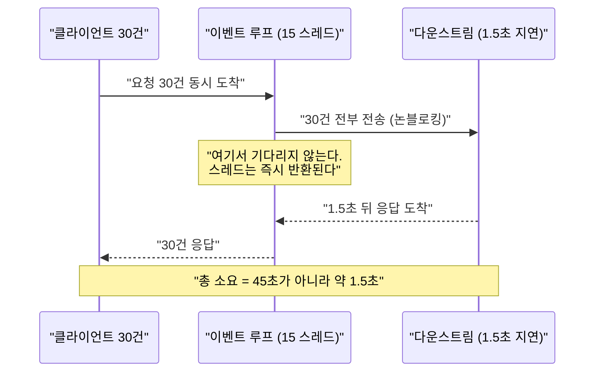

# 02. WebFlux 이벤트 루프 — 요청당 스레드가 없다

> 스레드는 요청에 묶이지 않는다. 하나의 요청이 **여러 스레드를 옮겨 다니며** 처리된다.
> 관련: Phase 1 Step 3 · 코드 `gateway/src/main/kotlin/me/ramos/unigate/adapter/gatewayIn/RequestLoggingFilter.kt`

## 1. 왜 필요했나

Step 3 에서 관찰용 `GlobalFilter` 를 붙였다. 목적은 기능이 아니라, **"이벤트 루프를 막으면
전체가 멈춘다"** 는 경고가 실제로 무슨 뜻인지 확인하는 것이었다.

Servlet 감각으로는 "요청 하나에 스레드 하나"가 당연하다. 이 전제가 깨진다는 걸 눈으로
확인하지 않으면, 앞으로 어떤 코드가 위험한지 판단할 수 없다. 특히 이후 단계에서
Keycloak 호출·DB 접근을 필터 안에 넣게 되므로 지금 짚고 가야 한다.

## 2. 익숙한 방식과의 대조

| | Servlet MVC (Tomcat) | WebFlux (Netty) |
|---|---|---|
| 스레드 모델 | 요청당 스레드 1개 | **이벤트 루프 N개** (N ≈ CPU 코어 수) |
| 기본 풀 크기 | 200 (`server.tomcat.threads.max`) | 코어 수 |
| 동시성 한계 | **스레드 수**가 곧 동시 처리 한계 | 스레드 수와 무관 (I/O 대기가 스레드를 점유하지 않음) |
| 블로킹 호출 | 그 스레드만 묶임, 나머지 199개는 정상 | **이벤트 루프가 묶여 무관한 요청까지 멈춤** |
| 요청 추적 | `ThreadLocal` (MDC, `SecurityContextHolder`) | **ThreadLocal 사용 불가** → Reactor Context |
| 부하 시 증상 | 스레드풀 고갈 → 큐 대기 | 이벤트 루프 점유 → **전체 지연 폭발** |

핵심은 마지막 두 줄이다. Servlet 에서 블로킹은 **국소적 손해**지만, WebFlux 에서는
**전역 장애**가 된다.

## 3. 동작 원리

이벤트 루프 스레드는 I/O 를 **기다리지 않는다.** 다운스트림 호출을 보낸 뒤 즉시 다른 요청을
처리하러 가고, 응답이 도착하면 그때 이어서 처리한다. 그래서 "대기 중인 요청"이 스레드를
점유하지 않는다.



### 필터의 pre / post 구간

`GlobalFilter` 하나가 요청과 응답을 모두 다룬다.

```kotlin
// pre — chain.filter() 호출 전
return chain.filter(exchange)
    .then(Mono.fromRunnable {
        // post — 다운스트림 응답이 돌아온 뒤
    })
```

**pre 와 post 는 같은 스레드에서 실행된다는 보장이 없다.** 이것이 ThreadLocal 이 깨지는
직접적인 이유다.

## 4. 직접 확인한 것

> ✍️ **직접 실행하고 결과를 기록하는 섹션.**

사전 준비: 게이트웨이(:8080) + 샘플 다운스트림(:8081) 기동, docker compose 기동.

확인 1 — 동시성: 30건 × 1.5초 지연을 동시에 보내면 총 몇 초가 걸리는가?
```bash
time (for i in $(seq 1 30); do
  curl -s -o /dev/null "localhost:8080/api/echo?delayMs=1500&n=$i" &
done; wait)
```
관찰 포인트: 직렬이면 45초다. 실제로는? 이 차이가 논블로킹의 값어치다.

```
# 출력 붙여넣기
```

확인 2 — 스레드 수: 요청 30건을 몇 개의 스레드가 처리했는가?
```bash
# 게이트웨이 로그에서 (실행 직후, 로그 flush 를 위해 잠깐 기다린 뒤)
grep '\[pre \]'  gateway.log | sed -E 's/.*thread=([^ ]+).*/\1/' | sort | uniq -c
grep '\[post\]'  gateway.log | sed -E 's/.*thread=([^ ]+).*/\1/' | sort | uniq -c
sysctl -n hw.ncpu    # 코어 수와 비교
```
관찰 포인트: 스레드 종류가 30개인가, 코어 수만큼인가?

```
# 출력 붙여넣기
```

확인 3 — pre 와 post 의 스레드 **이름 접두사**를 비교한다.
```bash
grep -E '\[pre |\[post\]' gateway.log \
  | sed -E 's/.*(\[pre \]|\[post\]).*thread=([a-z-]+)-[0-9]+.*/\1 \2/' | sort | uniq -c
```
관찰 포인트: 같은 요청의 pre 와 post 가 같은 스레드에서 실행되는가?
같지 않다면 — `ThreadLocal` 에 값을 넣었다면 post 에서 읽을 수 있겠는가?

```
# 출력 붙여넣기
```

확인 4 (선택, **주의**) — 이벤트 루프를 일부러 막아본다.
필터의 pre 구간에 `Thread.sleep(3000)` 을 넣고 동시 요청 30건을 보내면 총 시간이 어떻게 되는가?
**확인 후 반드시 되돌린다.**

```
# 출력 붙여넣기
```

## 5. 함정 / 실패 모드

| 함정 | 증상 | 원인 | 해결 |
|---|---|---|---|
| 이벤트 루프에서 블로킹 | **저부하 정상, 고부하에서 전체 지연 폭발** | JDBC·`Thread.sleep`·동기 HTTP 가 루프 스레드를 점유 | R2DBC·WebClient 사용. 불가피하면 `Schedulers.boundedElastic()` 로 격리 |
| `.block()` 호출 | `IllegalStateException: block()/blockFirst()/blockLast() are blocking, which is not supported in thread reactor-http-nio-N` | 논블로킹 스레드에서 블로킹 시도 | 프로덕션 코드에서 금지. coroutine 경계는 `mono { }` / `awaitBody()` |
| `ThreadLocal` / MDC 사용 | 값이 비어 있거나 **다른 요청의 값이 섞임** | pre/post 가 다른 스레드에서 실행 | Reactor Context 사용 |
| 스레드 이름으로 요청 추적 | 로그가 뒤섞여 추적 불가 | 스레드 ≠ 요청 | traceId 를 Context 로 전파 (Phase 4) |

> **가장 위험한 것은 첫 번째 줄이다.** 블로킹 코드는 **개발 중에는 아무 문제가 없어 보인다.**
> 요청이 하나뿐이면 스레드가 남아돌기 때문이다. 부하가 걸려야 드러난다.

## 6. 남은 의문

> ✍️ **직접 작성하는 섹션.**

- [ ] 관찰된 사실: `[pre ]` 는 `parallel-*` 스레드, `[post]` 는 `reactor-http-nio-*` 스레드에서 찍혔다.
      Netty 이벤트 루프(`reactor-http-nio-*`)에서 시작한 요청이 왜 `GlobalFilter` 진입 시점엔
      `parallel-*`(Reactor 공용 병렬 스케줄러)로 옮겨가 있는가? 어느 구성요소가 스케줄러를 바꾸는가?
      → 조사 방법: `GlobalFilter` 앞단에 `WebFilter` 를 하나 두고 거기서도 스레드 이름을 찍어,
        전환 지점이 WebFilter 체인 이전인지 이후(`FilteringWebHandler`)인지 좁힌다.
- [ ] `Schedulers.boundedElastic()` 은 몇 개까지 늘어나는가? 그 한계에 걸리면 어떤 증상이 나는가?
- [ ]
