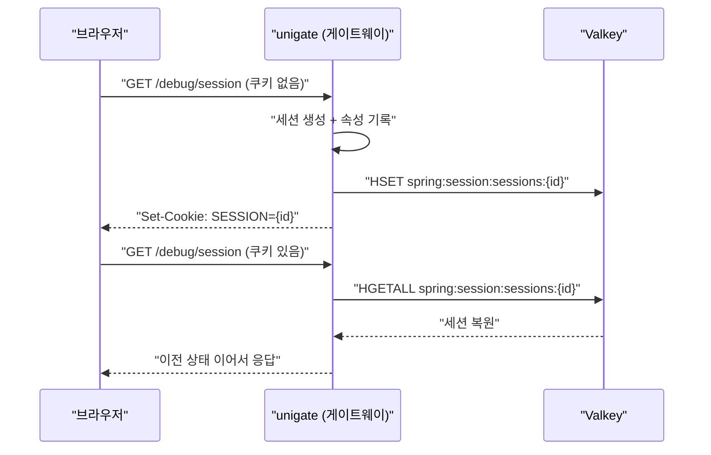

# 03. Spring Session + Valkey — 세션이 서버 메모리를 떠나면

> 세션을 외부 저장소로 빼면 **애플리케이션 재시작에도 로그인이 유지**된다.
> 대신 세션 접근이 네트워크 I/O가 되고, 애플리케이션 코드가 **Redis 클라이언트 스레드 위에서** 돌기 시작한다.
> 관련: Phase 1 Step 4 · 코드 `gateway/src/main/kotlin/me/ramos/unigate/adapter/gatewayIn/SessionProbeConfig.kt`

## 1. 왜 필요했나

Step 4 에서 세션을 Valkey 에 붙였다. **OAuth2 로그인보다 먼저** 붙인 것은 순서 상의 의도다.

세션 저장이 깨진 상태에서 로그인을 붙이면 증상이 **"로그인 무한 리다이렉트"** 로 나타난다.
로그인 → 콜백 → 토큰 저장 실패 → 다시 미인증 → 로그인… 이 상태에서는 원인이 Keycloak
설정인지, 세션인지, 필터 순서인지 **구분할 방법이 없다.**

세션만 독립적으로 검증해두면, 이후 로그인이 실패했을 때 "세션은 아니다"를 확정할 수 있다.

> 설정은 `application-local.yml` 의 `spring.session.store-type: redis` 만으로 충분했다.
> **별도의 `SessionConfig` 클래스는 필요하지 않았다** — Boot 자동 구성이 처리한다.

## 2. 익숙한 방식과의 대조

| | HttpSession (Servlet, 서버 메모리) | WebSession + Spring Session (Valkey) |
|---|---|---|
| 저장 위치 | 애플리케이션 JVM 힙 | **외부 저장소(Valkey)** |
| 앱 재시작 | **세션 전부 소실** → 전원 재로그인 | **유지됨** |
| 스케일아웃 | sticky session 필요 | 아무 인스턴스나 처리 가능 |
| 조회 비용 | 메모리 접근 (즉시) | **네트워크 I/O** (논블로킹) |
| 반환형 | `HttpSession` (동기) | `Mono<WebSession>` (비동기) |
| 저장 객체 | 아무거나 | **직렬화 가능**해야 함 |
| 실패 모드 | 없음 (메모리에 있으면 있음) | 저장소 장애 시 **인증된 요청이 전부 500** (§6 실측) |

BFF 패턴에서는 access token 을 세션에 보관하므로, 세션이 곧 로그인 상태다.
그래서 세션 저장소의 가용성이 **인증 시스템 전체의 가용성**이 된다.

## 3. 동작 원리



Valkey 에 저장되는 형태는 **hash** 이고, 필드는 다음과 같다.

| 필드 | 의미 |
|---|---|
| `sessionAttr:*` | 애플리케이션이 넣은 속성 (BFF 에서는 여기에 토큰이 들어간다) |
| `creationTime` | 생성 시각 |
| `lastAccessedTime` | 마지막 접근 시각 |
| `maxInactiveInterval` | 유휴 만료 시간 |

키에는 **TTL 이 걸려 있고, 접근할 때마다 갱신된다.** 즉 `timeout: 30m` 은
"생성 후 30분"이 아니라 **"마지막 접근 후 30분"** 이다.

> **세션은 게으르게 저장된다.** 속성을 하나도 넣지 않으면 세션 ID 는 만들어져도
> 저장소에 기록되지 않는다. 빈 세션으로 저장소를 채우지 않기 위한 설계다.

## 4. 직접 확인한 것

```bash
docker exec unigate-valkey valkey-cli FLUSHALL      # baseline
```

확인 1 — 세션 생성과 쿠키
```bash
curl -s -c /tmp/c.txt -D /tmp/h.txt localhost:8080/debug/session | jq
grep -i set-cookie /tmp/h.txt
```
관찰 포인트: 쿠키 이름은? `HttpOnly` 는 붙었는가? `Secure` 는? `SameSite` 값은?
(로컬은 http 라 `Secure` 가 없다 — 운영에서는 어떻게 되어야 하는가?)

```
$ curl -s -c /tmp/c.txt -D /tmp/h.txt localhost:8080/debug/session | jq
{
  "sessionId": "763025de",
  "visitCount": 1,
  "createdAt": "2026-07-21T00:01:19.575346Z",
  "maxIdleTime": "PT30M",
  "thread": "parallel-4"
}

$ grep -i set-cookie /tmp/h.txt
set-cookie: SESSION=763025de-467a-4ec6-b468-700b46a0be1b; Path=/; HTTPOnly; SameSite=Lax
```

관찰:
- **쿠키 이름 = `SESSION`** (WebFlux/Spring Session 기본). Servlet 의 `JSESSIONID` 에 대응.
- **`HttpOnly` O** — JS(`document.cookie`)로 못 읽는다 → XSS 로 세션(=BFF 에서는 토큰) 탈취를 막는다.
- **`Secure` X** — 로컬 http 라 안 붙었다. 운영은 HTTPS + `Secure` 를 **강제**해야 쿠키 평문 전송을 막는다(§5 함정 표).
- **`SameSite=Lax`** — top-level GET 네비게이션에는 쿠키가 실린다(OAuth2 로그인 리다이렉트 복귀에 필요). 크로스사이트 POST/XHR 에는 안 실려 CSRF 를 완화한다.

확인 2 — 상태가 이어지는가
```bash
curl -s -b /tmp/c.txt localhost:8080/debug/session | jq -c
curl -s -b /tmp/c.txt localhost:8080/debug/session | jq -c
```
관찰 포인트: `sessionId` 는 유지되는가? `visitCount` 는 증가하는가?

```
$ curl -s -b /tmp/c.txt localhost:8080/debug/session | jq -c
{"sessionId":"763025de","visitCount":2,"createdAt":"2026-07-21T00:01:19.575Z","maxIdleTime":"PT30M","thread":"lettuce-nioEventLoop-5-2"}
$ curl -s -b /tmp/c.txt localhost:8080/debug/session | jq -c
{"sessionId":"763025de","visitCount":3,"createdAt":"2026-07-21T00:01:19.575Z","maxIdleTime":"PT30M","thread":"lettuce-nioEventLoop-5-2"}
```

관찰: `sessionId` 유지(`763025de`), `visitCount` 2 → 3 증가. 쿠키로 **같은 세션을 Valkey 에서 복원**한다.
(스레드가 1차 `parallel-4` 에서 `lettuce-nioEventLoop-*` 로 바뀐 이유는 확인 5 참조.)

확인 3 — 저장소에 실제로 무엇이 들어갔는가
```bash
KEY=$(docker exec unigate-valkey valkey-cli KEYS 'spring:session:sessions:*' | head -1)
docker exec unigate-valkey valkey-cli TYPE  "$KEY"
docker exec unigate-valkey valkey-cli HKEYS "$KEY"
docker exec unigate-valkey valkey-cli TTL   "$KEY"
```

```
KEY=spring:session:sessions:763025de-467a-4ec6-b468-700b46a0be1b
$ ... TYPE  "$KEY"   ->  hash
$ ... HKEYS "$KEY"   ->  sessionAttr:visitCount
                        creationTime
                        lastAccessedTime
                        maxInactiveInterval
$ ... TTL   "$KEY"   ->  1797        # 약 30분, 접근 시 갱신
```

관찰:
- 타입은 **hash**. 애플리케이션 속성은 `sessionAttr:` 접두사가 붙는다(`sessionAttr:visitCount`). 나머지는 프레임워크 메타(생성·최근접근·유휴만료).
- **TTL 갱신 확인**: 요청 직전 `1773` → 요청 1회 후 `1799`. `timeout: 30m` 은 "생성 후 30분"이 아니라 **"마지막 접근 후 30분"** 임이 관측된다(§3).
- 세션 키가 2개 보였다(`763025de`, `3ab4aedc`). 뒤엣것은 기동 확인용 readiness 요청이 남긴 **고아 세션**(쿠키를 저장하지 않은 요청도 속성이 들어가면 저장된다). 우리 쿠키 세션은 `763025de`.

확인 4 ★ — **게이트웨이를 재시작하고 같은 쿠키로 요청한다.**
```bash
# 게이트웨이 종료 -> 재기동 후
curl -s -b /tmp/c.txt localhost:8080/debug/session | jq -c   # 이어지는가?
curl -s              localhost:8080/debug/session | jq -c   # 대조군: 새 세션인가?
```
관찰 포인트: 이것이 외부 세션 저장소를 쓰는 **유일하고 결정적인 이유**다.
`HttpSession` 이었다면 결과가 어땠겠는가?

```
# --- 게이트웨이 프로세스 종료 → 재기동(새 JVM) 후 ---

$ curl -s -b /tmp/c.txt localhost:8080/debug/session | jq -c   # 같은 쿠키 (이어지는가?)
{"sessionId":"763025de","visitCount":5,"createdAt":"2026-07-21T00:01:19.575Z","maxIdleTime":"PT30M","thread":"lettuce-nioEventLoop-5-2"}

$ curl -s              localhost:8080/debug/session | jq -c   # 대조군: 쿠키 없음 (새 세션?)
{"sessionId":"17fbcff7","visitCount":1,"createdAt":"2026-07-21T00:02:15.098Z","maxIdleTime":"PT30M","thread":"parallel-4"}
```

관찰(결정적):
- **같은 쿠키**: `sessionId=763025de`, `createdAt` 이 **재시작 이전 시각(00:01:19) 그대로**, `visitCount` 도 이어진다(재시작 전 4 → 5). 세션이 프로세스 힙이 아니라 **Valkey 에 있었으므로 새 JVM 이 그대로 복원**했다.
- **대조군**: 새 `sessionId=17fbcff7`, `visitCount=1`, `createdAt` 이 재시작 이후. 쿠키가 없으니 새 세션.
- `HttpSession`(JVM 힙)이었다면 재시작으로 **모든 세션이 소실**되어, 같은 쿠키를 보내도 서버가 알아보지 못하고 `visitCount=1` 새 세션으로 떨어졌을 것이다. 이 차이가 외부 세션 저장소를 쓰는 이유다 — BFF 에서는 곧 "게이트웨이 재배포에도 로그인이 유지된다"를 뜻한다.

확인 5 — 각 응답의 `thread` 필드를 비교한다.
관찰 포인트: 1차 요청과 2차 이후 요청의 스레드 이름 접두사가 다른가? 왜 그럴까?

```
요청                          thread
─────────────────────────────────────────────────
1차 (세션 없음 · 신규 생성)    parallel-4
2차 이후 (세션 있음 · 복원)     lettuce-nioEventLoop-5-2
대조군 (쿠키 없음 · 신규 생성)   parallel-4
```

관찰:
- 세션을 **Valkey 에서 읽어온 요청**(2차 이후)은 그 조회를 완료한 **Lettuce(Redis 클라이언트) 이벤트 루프**에서 후속 코드가 이어진다 → `lettuce-nioEventLoop-*`.
- 세션이 **없어 새로 만드는 요청**(1차·대조군)은 저장소에서 복원할 게 없어 HTTP 이벤트 루프(`parallel-*`)에서 그대로 실행된다.
- 즉 "어느 스레드에서 실행되는가"는 **직전에 완료된 비동기 작업이 결정**한다(§5). 여기서 블로킹하면 HTTP 루프가 아니라 Redis 커넥션 루프가 멈춰 **모든 요청의 세션 조회가 함께 막힌다** — 그래서 논블로킹 규율은 전 구간에 적용된다.

## 5. 함정 / 실패 모드

| 함정 | 증상 | 원인 | 해결 |
|---|---|---|---|
| **Redis 클라이언트 스레드에서 블로킹** | Redis 커넥션 전체 정지 → **모든 요청의 세션 조회가 멈춤** | 세션 조회 후속 코드가 `lettuce-nioEventLoop-*` 위에서 실행된다 (아래 설명) | 세션 접근 이후 코드에서도 블로킹 금지 |
| 속성 미기록 | 세션이 저장소에 안 보임 | 속성이 없으면 저장하지 않는다 (게으른 저장) | 정상 동작. 저장이 필요하면 속성을 넣는다 |
| 큰 객체를 세션에 저장 | 요청마다 지연 증가 | **매 요청 직렬화/역직렬화 + 네트워크 왕복** | 세션에는 최소한만. 토큰 외 캐시 데이터 금지 |
| 직렬화 호환성 | 배포 후 기존 세션에서 역직렬화 실패 | 저장된 클래스 구조가 바뀜 | 직렬화 포맷을 명시적으로 관리(JSON 등), 배포 시 세션 무효화 정책 |
| `Secure` 쿠키 누락 | 운영에서 쿠키 평문 전송 | 로컬 http 기준 설정을 그대로 배포 | 운영은 HTTPS + `Secure` 강제 |
| 저장소 장애 | **로그인한 사용자만 500** (로그아웃이 아니다) | 세션을 읽지 못해 인증 판단 자체가 불가능 | Sentinel HA, 장애 시 동작 정의. 실측은 §6 |

### 관찰된 사실 — 애플리케이션 코드가 Lettuce 스레드에서 돈다

프로브 응답의 `thread` 필드가 이렇게 나왔다.

| 요청 | thread |
|---|---|
| 1차 (세션 없음) | `parallel-2` |
| 2차 이후 (세션 있음) | `lettuce-nioEventLoop-5-2` |

세션을 Valkey 에서 읽어오는 비동기 작업이 완료된 **그 스레드에서 후속 코드가 이어진다.**
`lettuce-nioEventLoop-*` 는 **Redis 클라이언트의 이벤트 루프**다.

여기서 블로킹하면 문제가 [02](02-webflux-event-loop.md) 보다 더 나쁘다.
HTTP 이벤트 루프가 아니라 **Redis 커넥션의 루프**가 멈추므로, 그 순간 모든 요청의
세션 조회가 함께 막힌다.

> 교훈: "어느 스레드에서 실행되는가"는 **직전에 완료된 비동기 작업이 결정한다.**
> 코드만 보고 짐작할 수 없다. 그래서 논블로킹 규율은 특정 구간이 아니라 **전 구간**에 적용된다.
>
> ⚠️ **단, 이 설명은 2차 요청(`lettuce-*`)에만 맞다.** 1차 요청이 `parallel-*` 인 것은
> 비동기 완료 스레드 때문이 아니라 `ReactiveRedisSessionRepository.createSession()` 이
> `publishOn(Schedulers.parallel())` 를 **명시적으로 걸기 때문**이다. 두 가지 원인이 섞여 있었다.
> 소스 근거는 §6 첫 항목.

## 6. 남은 의문

### 이번에 답이 나온 것

- [x] **1차 요청은 왜 `parallel-*` 이고 2차부터는 `lettuce-*` 인가?**
      → **1차는 Valkey 를 조회하지 않는다.** 쿠키가 없으니 복원할 세션이 없고, 대신 `createSession()`
      경로를 탄다. 그 경로에 `publishOn(Schedulers.parallel())` 이 **명시돼 있다.**

      ```java
      // spring-session-data-redis / ReactiveRedisSessionRepository.java
      public Mono<RedisSession> createSession() {
          return Mono.fromSupplier(() -> this.sessionIdGenerator.generate())
                  .subscribeOn(Schedulers.boundedElastic())
                  .publishOn(Schedulers.parallel())      // ← 여기
                  ...
      }

      public Mono<RedisSession> findById(String id) {
          return this.sessionRedisOperations.opsForHash().entries(sessionKey)   // Schedulers 호출 없음
                  ...
      }
      ```

      | 요청 | 경로 | Redis 명령 | 이후 스레드 |
      |---|---|---|---|
      | 1차 (쿠키 없음) | `createSession()` | **없음** | `parallel-*` (명시적 `publishOn`) |
      | 2차 (쿠키 있음) | `findById()` | `HGETALL` | `lettuce-nioEventLoop-*` (응답 수신 스레드) |

      "직전에 완료된 비동기 작업이 스레드를 결정한다"는 §5 의 설명은 2차에만 해당한다.
      1차는 **라이브러리가 스케줄러를 명시적으로 지정**한 결과다. 두 가지가 섞여 있었다.

      호출 지점은 Security 체인의 `ServerRequestCacheWebFilter` 다.
      전체 추적은 [02](02-webflux-event-loop.md) §4 확인 5.

- [x] **TTL 은 요청마다 정말 갱신되는가?**
      → **그렇다.** 요청 직전/직후 TTL 을 3회 연속 관찰했다.

      ```
      TTL=1769  → 요청 1회 → TTL=1800
      TTL=1797  → 요청 1회 → TTL=1800
      TTL=1797  → 요청 1회 → TTL=1800
      ```

      매번 정확히 `1800`(=30분)으로 리셋된다. `timeout: 30m` 은 "생성 후 30분"이 아니라
      **"마지막 접근 후 30분"** 임이 확정됐다. 활동 중인 사용자의 세션은 만료되지 않는다.

- [x] **세션 직렬화 포맷은 현재 무엇인가?**
      → **JDK(Java) 직렬화다.** 저장된 값의 첫 바이트를 그대로 읽었다.

      ```
      $ docker exec unigate-valkey valkey-cli --no-raw HGET "spring:session:sessions:<id>" \
          "sessionAttr:SPRING_SECURITY_CONTEXT"
      "\xac\xed\x00\x05sr\x00=org.springframework.security.core.context.SecurityContextImpl\x00\x00...
      ```

      `\xac\xed\x00\x05` 는 **Java 직렬화 스트림의 매직 넘버(`0xACED0005`)** 이고, 뒤이어
      `sr`(TC_OBJECT)과 FQCN 이 평문으로 박혀 있다. 즉 **클래스 이름과 필드 구조가 저장 포맷의 일부**다.

      운영 배포 시 함의:
      - Spring Security 클래스의 `serialVersionUID` 가 바뀌는 버전 업그레이드는 기존 세션의
        역직렬화를 깨뜨릴 수 있다. 롤링 배포 중이라면 **구/신 버전 파드가 같은 세션을 두고 갈린다.**
      - BFF 는 토큰까지 세션에 넣으므로(04 문서) 영향 범위가 "로그인 풀림"이다.
      - 대안은 JSON 직렬화기(`GenericJackson2JsonRedisSerializer`)로 바꾸는 것이지만,
        Spring Security 타입들은 Jackson 모듈 등록이 필요해 그 자체로 별도 작업이 된다.
      - 최소한의 대비는 **버전 업그레이드 시 세션 무효화 정책을 미리 정해두는 것**이다.

- [x] **세션 저장소가 죽으면 정확히 어떻게 되는가?** (§5 "전원 로그아웃"의 실제 확인)
      → **로그아웃이 아니라 500 이다.** `docker stop unigate-valkey` 후 관측했다.

      ```
      정상 상태                        Valkey 정지 후
      ─────────────────────────────────────────────────────
      /debug/whoami       = 200        /debug/whoami   = 500
      /api/echo           = 200        /api/echo       = 500
      /actuator/health    = 200        health          = 503
      readiness           = 200        readiness       = 503  ({"status":"DOWN"})
                                       liveness        = 200
                                       쿠키 없는 요청   = 302  (로그인 리다이렉트는 정상)
      ```
      ```
      RedisConnectionFailureException: Unable to connect to Redis
        *__checkpoint ⇢ ServerRequestCacheWebFilter [DefaultWebFilterChain]
      ```

      해석:
      - **"전원 로그아웃"이라는 표현은 정확하지 않았다.** 로그아웃이라면 로그인 화면으로 유도되지만,
        실제로는 세션을 **읽을 수 없어** 인증 판단 자체가 불가능해 500 이 난다.
      - 예외 발생 지점이 `ServerRequestCacheWebFilter` 다. 위 첫 항목에서 본 그 필터다 —
        **모든 요청이 세션을 건드린다**는 사실이 장애 시에 이런 형태로 드러난다.
      - 세션 쿠키가 **없는** 요청은 302 로 정상 동작한다. 즉 "로그인은 되는데 로그인한 사람만 500" 이다.
      - **liveness 가 200 을 유지한 것이 중요하다.** readiness 만 DOWN 이므로 k8s 는 트래픽만 끊고
        파드를 재시작하지 않는다. liveness 에 redis 를 넣었다면 Valkey 장애가 **전 파드 재시작 루프**로
        번졌을 것이다. `application.yml` 의 readiness 그룹에만 `redis` 를 넣은 설정이 옳았다.

### 아직 모르는 것

- [ ] **Sentinel failover 가 일어나면 진행 중인 세션은 어떻게 되는가?**
      → 현재 `docker-compose.yml` 은 **마스터 1 + sentinel 1** 구성이라 승격할 replica 가 없다.
      failover 자체를 재현할 수 없어 미확인으로 남긴다. 실험하려면 replica 를 추가해야 한다.

      다만 관련해서 하나 관측됐다. **마스터만 재시작하면 게이트웨이가 곧바로 회복하지 못한다.**
      `docker stop/start unigate-valkey` 후 게이트웨이를 재기동하니
      `Cannot connect Redis Sentinel at redis://127.0.0.1:26379` 로 연결에 실패했고,
      **sentinel 컨테이너까지 재시작**한 뒤에야 정상화됐다.
      복구 절차가 "마스터만 살리면 된다"가 아니라는 뜻이다 — 런북에 반영할 사항.
