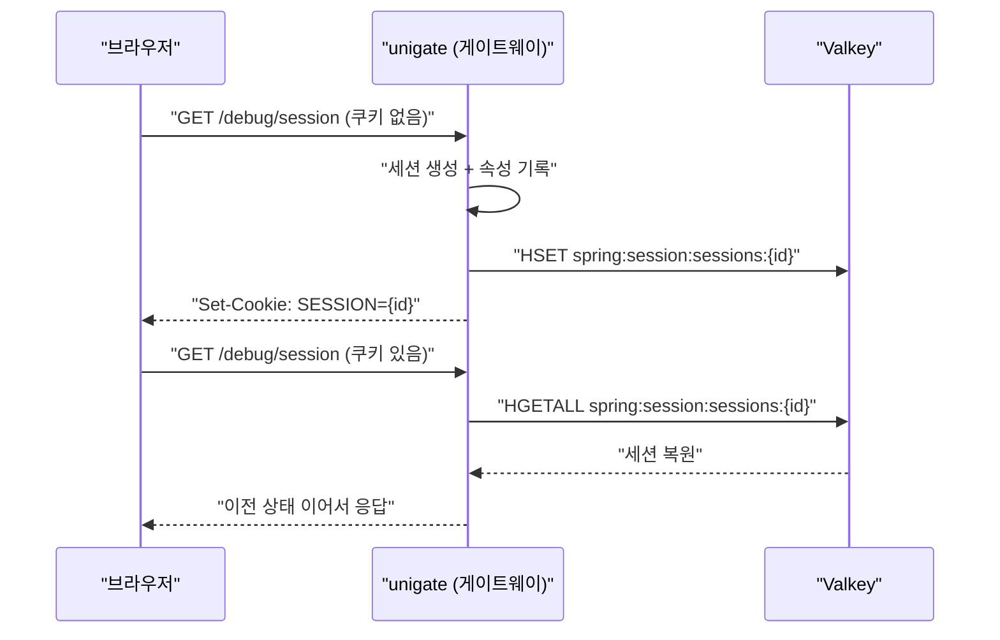

# 03. Spring Session + Valkey — 세션이 서버 메모리를 떠나면

> 세션을 외부 저장소로 빼면 **애플리케이션 재시작에도 로그인이 유지**된다.
> 대신 세션 접근이 네트워크 I/O가 되고, 애플리케이션 코드가 **Redis 클라이언트 스레드 위에서** 돌기 시작한다.
> 관련: Phase 1 Step 4 · 코드 `gateway/src/main/kotlin/me/ramos/unigate/adapter/gatewayIn/SessionProbeConfig.kt`

## 1. 왜 필요했나

Step 4 에서 세션을 Valkey 에 붙였다. **OAuth2 로그인보다 먼저** 붙인 것은 순서 상의 의도다.

세션 저장이 깨진 상태에서 로그인을 붙이면 증상이 **"로그인 무한 리다이렉트"** 로 나타난다.
로그인 → 콜백 → 토큰 저장 실패 → 다시 미인증 → 로그인… 이 상태에서는 원인이 Keycloak
설정인지, 세션인지, 필터 순서인지 **구분할 방법이 없다.**

세션만 독립적으로 검증해두면, 이후 로그인이 실패했을 때 "세션은 아니다"를 확정할 수 있다.

> 설정은 `application-local.yml` 의 `spring.session.store-type: redis` 만으로 충분했다.
> **별도의 `SessionConfig` 클래스는 필요하지 않았다** — Boot 자동 구성이 처리한다.

## 2. 익숙한 방식과의 대조

| | HttpSession (Servlet, 서버 메모리) | WebSession + Spring Session (Valkey) |
|---|---|---|
| 저장 위치 | 애플리케이션 JVM 힙 | **외부 저장소(Valkey)** |
| 앱 재시작 | **세션 전부 소실** → 전원 재로그인 | **유지됨** |
| 스케일아웃 | sticky session 필요 | 아무 인스턴스나 처리 가능 |
| 조회 비용 | 메모리 접근 (즉시) | **네트워크 I/O** (논블로킹) |
| 반환형 | `HttpSession` (동기) | `Mono<WebSession>` (비동기) |
| 저장 객체 | 아무거나 | **직렬화 가능**해야 함 |
| 실패 모드 | 없음 (메모리에 있으면 있음) | 저장소 장애 시 **전원 로그아웃** |

BFF 패턴에서는 access token 을 세션에 보관하므로, 세션이 곧 로그인 상태다.
그래서 세션 저장소의 가용성이 **인증 시스템 전체의 가용성**이 된다.

## 3. 동작 원리



Valkey 에 저장되는 형태는 **hash** 이고, 필드는 다음과 같다.

| 필드 | 의미 |
|---|---|
| `sessionAttr:*` | 애플리케이션이 넣은 속성 (BFF 에서는 여기에 토큰이 들어간다) |
| `creationTime` | 생성 시각 |
| `lastAccessedTime` | 마지막 접근 시각 |
| `maxInactiveInterval` | 유휴 만료 시간 |

키에는 **TTL 이 걸려 있고, 접근할 때마다 갱신된다.** 즉 `timeout: 30m` 은
"생성 후 30분"이 아니라 **"마지막 접근 후 30분"** 이다.

> **세션은 게으르게 저장된다.** 속성을 하나도 넣지 않으면 세션 ID 는 만들어져도
> 저장소에 기록되지 않는다. 빈 세션으로 저장소를 채우지 않기 위한 설계다.

## 4. 직접 확인한 것

> ✍️ **직접 실행하고 결과를 기록하는 섹션.**

```bash
docker exec unigate-valkey valkey-cli FLUSHALL      # baseline
```

확인 1 — 세션 생성과 쿠키
```bash
curl -s -c /tmp/c.txt -D /tmp/h.txt localhost:8080/debug/session | jq
grep -i set-cookie /tmp/h.txt
```
관찰 포인트: 쿠키 이름은? `HttpOnly` 는 붙었는가? `Secure` 는? `SameSite` 값은?
(로컬은 http 라 `Secure` 가 없다 — 운영에서는 어떻게 되어야 하는가?)

```
# 출력 붙여넣기
```

확인 2 — 상태가 이어지는가
```bash
curl -s -b /tmp/c.txt localhost:8080/debug/session | jq -c
curl -s -b /tmp/c.txt localhost:8080/debug/session | jq -c
```
관찰 포인트: `sessionId` 는 유지되는가? `visitCount` 는 증가하는가?

```
# 출력 붙여넣기
```

확인 3 — 저장소에 실제로 무엇이 들어갔는가
```bash
KEY=$(docker exec unigate-valkey valkey-cli KEYS 'spring:session:sessions:*' | head -1)
docker exec unigate-valkey valkey-cli TYPE  "$KEY"
docker exec unigate-valkey valkey-cli HKEYS "$KEY"
docker exec unigate-valkey valkey-cli TTL   "$KEY"
```

```
# 출력 붙여넣기
```

확인 4 ★ — **게이트웨이를 재시작하고 같은 쿠키로 요청한다.**
```bash
# 게이트웨이 종료 -> 재기동 후
curl -s -b /tmp/c.txt localhost:8080/debug/session | jq -c   # 이어지는가?
curl -s              localhost:8080/debug/session | jq -c   # 대조군: 새 세션인가?
```
관찰 포인트: 이것이 외부 세션 저장소를 쓰는 **유일하고 결정적인 이유**다.
`HttpSession` 이었다면 결과가 어땠겠는가?

```
# 출력 붙여넣기
```

확인 5 — 각 응답의 `thread` 필드를 비교한다.
관찰 포인트: 1차 요청과 2차 이후 요청의 스레드 이름 접두사가 다른가? 왜 그럴까?

```
# 출력 붙여넣기
```

## 5. 함정 / 실패 모드

| 함정 | 증상 | 원인 | 해결 |
|---|---|---|---|
| **Redis 클라이언트 스레드에서 블로킹** | Redis 커넥션 전체 정지 → **모든 요청의 세션 조회가 멈춤** | 세션 조회 후속 코드가 `lettuce-nioEventLoop-*` 위에서 실행된다 (아래 설명) | 세션 접근 이후 코드에서도 블로킹 금지 |
| 속성 미기록 | 세션이 저장소에 안 보임 | 속성이 없으면 저장하지 않는다 (게으른 저장) | 정상 동작. 저장이 필요하면 속성을 넣는다 |
| 큰 객체를 세션에 저장 | 요청마다 지연 증가 | **매 요청 직렬화/역직렬화 + 네트워크 왕복** | 세션에는 최소한만. 토큰 외 캐시 데이터 금지 |
| 직렬화 호환성 | 배포 후 기존 세션에서 역직렬화 실패 | 저장된 클래스 구조가 바뀜 | 직렬화 포맷을 명시적으로 관리(JSON 등), 배포 시 세션 무효화 정책 |
| `Secure` 쿠키 누락 | 운영에서 쿠키 평문 전송 | 로컬 http 기준 설정을 그대로 배포 | 운영은 HTTPS + `Secure` 강제 |
| 저장소 장애 | **전원 로그아웃** | 세션 = 로그인 상태 | Sentinel HA, 장애 시 동작 정의 |

### 관찰된 사실 — 애플리케이션 코드가 Lettuce 스레드에서 돈다

프로브 응답의 `thread` 필드가 이렇게 나왔다.

| 요청 | thread |
|---|---|
| 1차 (세션 없음) | `parallel-2` |
| 2차 이후 (세션 있음) | `lettuce-nioEventLoop-5-2` |

세션을 Valkey 에서 읽어오는 비동기 작업이 완료된 **그 스레드에서 후속 코드가 이어진다.**
`lettuce-nioEventLoop-*` 는 **Redis 클라이언트의 이벤트 루프**다.

여기서 블로킹하면 문제가 [02](02-webflux-event-loop.md) 보다 더 나쁘다.
HTTP 이벤트 루프가 아니라 **Redis 커넥션의 루프**가 멈추므로, 그 순간 모든 요청의
세션 조회가 함께 막힌다.

> 교훈: "어느 스레드에서 실행되는가"는 **직전에 완료된 비동기 작업이 결정한다.**
> 코드만 보고 짐작할 수 없다. 그래서 논블로킹 규율은 특정 구간이 아니라 **전 구간**에 적용된다.

## 6. 남은 의문

> ✍️ **직접 작성하는 섹션.**

- [ ] 1차 요청은 왜 `parallel-*` 이고 2차부터는 `lettuce-*` 인가?
      1차도 Valkey 를 조회했을 텐데 무엇이 다른가?
- [ ] TTL 은 요청마다 정말 갱신되는가? (`TTL` 을 연속 관찰해 확인)
- [ ] Sentinel failover 가 일어나면 진행 중인 세션은 어떻게 되는가?
- [ ] 세션 직렬화 포맷은 현재 무엇인가? 운영 배포 시 클래스 변경을 어떻게 다룰 것인가?
- [ ]
