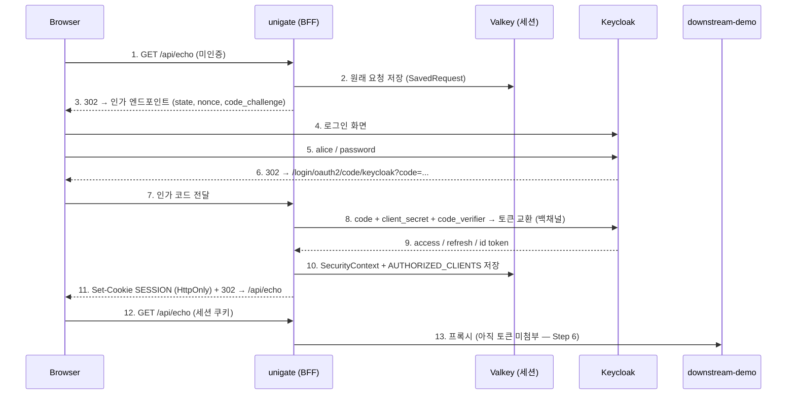

# 04. OAuth2 Authorization Code + BFF

> 토큰을 브라우저에 주지 않으면 무엇이 좋아지고, 그 대가로 무엇을 떠안는가.
> 관련: Phase 1 Step 5 · 코드 `gateway/src/main/kotlin/me/ramos/unigate/config/SecurityConfig.kt`,
> `gateway/src/main/kotlin/me/ramos/unigate/adapter/gatewayIn/AuthProbeConfig.kt`

## 1. 왜 필요했나

Step 4까지 게이트웨이는 **아무나 통과할 수 있는 프록시**였다. 라우팅(`/api/**` → 8081)도 되고
세션도 Valkey에 저장됐지만, 정작 "누가 요청했는가"를 모르는 상태였다.

Step 5는 여기에 인증을 붙인다. 다만 방식이 두 갈래다.

| 방식 | 토큰을 누가 갖는가 | 이번 선택 |
|---|---|---|
| SPA가 직접 OIDC (public client) | **브라우저** (localStorage/메모리) | ✗ |
| BFF (Backend For Frontend) | **게이트웨이 세션** — 브라우저는 세션 쿠키만 | ✅ |

BFF를 고른 이유는 XSS 내성이다. 브라우저에 토큰이 있으면 스크립트 하나가 주입되는 순간
토큰이 통째로 유출되고, 공격자는 그 토큰으로 게이트웨이를 거치지 않고 리소스 서버를 직접 때린다.
BFF에서는 브라우저가 가진 것이 `HttpOnly` 세션 쿠키뿐이라 **스크립트가 읽을 수 없다.**

대가는 §5에 정리했다. 공짜가 아니다.

## 2. 익숙한 방식과의 대조

| | Servlet + Spring Security (MVC) | 여기서의 방식 (WebFlux) | 왜 다른가 |
|---|---|---|---|
| 설정 진입점 | `@EnableWebSecurity` + `SecurityFilterChain` | `@EnableWebFluxSecurity` + `SecurityWebFilterChain` | 서블릿 필터가 아니라 `WebFilter` 체인 |
| 빌더 타입 | `HttpSecurity` | `ServerHttpSecurity` | 반환형이 `Mono` 기반 |
| 인증 정보 접근 | `SecurityContextHolder` (ThreadLocal) | `ReactiveSecurityContextHolder` (Reactor Context) | **요청당 스레드가 없어 ThreadLocal이 성립하지 않는다** |
| 세션 | `HttpSession` | `WebSession` | 조회가 논블로킹(`Mono<WebSession>`) |
| 로그인 후 복귀 | `SavedRequest` (`HttpSessionRequestCache`) | `WebSessionServerRequestCache` | 개념은 동일 |

`SecurityContextHolder`가 왜 안 되는지가 핵심이다. MVC는 요청 하나가 스레드 하나를 점유하므로
ThreadLocal에 인증 정보를 넣어두면 그 요청 처리 내내 아무 데서나 꺼낼 수 있었다.
WebFlux는 한 요청이 여러 스레드를 오가므로 ThreadLocal이 **엉뚱한 사용자의 정보를 반환**하거나
비어 있게 된다. 그래서 인증 정보는 스레드가 아니라 **Reactor Context**(요청 흐름에 붙어 다니는 맵)에 실린다.

코드에서 `ReactiveSecurityContextHolder` 대신 `request.principal()`을 쓴 것도 같은 맥락이다
(`AuthProbeConfig.kt`) — 요청 객체에서 직접 꺼내는 편이 컨텍스트 전파 실수를 줄인다.

## 3. 동작 원리

### 3.1 전체 흐름



**8번이 BFF의 핵심이다.** 토큰 교환은 브라우저를 거치지 않는 서버 간 통신(백채널)이라
토큰이 브라우저 주소창·JS·히스토리 어디에도 남지 않는다. 브라우저가 만지는 건 11번의 세션 쿠키뿐이다.

### 3.2 PKCE — confidential client에도 필요하다

인가 요청에 `code_challenge`(랜덤값의 SHA-256)를 실어 보내고, 토큰 교환 때 원본 `code_verifier`를
제시해 "이 코드를 요청한 자와 교환하는 자가 동일함"을 증명한다. 인가 코드가 리다이렉트 도중
탈취돼도 verifier가 없으면 토큰으로 바꿀 수 없다.

Spring Security는 **public client에만 PKCE를 자동 적용**한다. unigate는 client secret을 가진
confidential client이므로 명시 설정이 필요하다.

```kotlin
DefaultServerOAuth2AuthorizationRequestResolver(clientRegistrationRepository).apply {
  setAuthorizationRequestCustomizer(OAuth2AuthorizationRequestCustomizers.withPkce())
}
```

### 3.3 세션에 무엇이 담기는가

로그인이 끝나면 Valkey의 세션 해시에 두 덩어리가 들어간다. **역할이 다르고, 하나만 있어도 반쪽이다.**

| 세션 속성 | 담는 것 | 없으면 |
|---|---|---|
| `SPRING_SECURITY_CONTEXT` | 누가 로그인했는가 (`OidcUser`, 권한) | 로그인 자체가 풀린다 |
| `...WebSessionServerOAuth2AuthorizedClientRepository.AUTHORIZED_CLIENTS` | access / refresh token | **로그인은 유지되는데 다운스트림 호출만 실패한다** |

두 번째가 §5의 함정으로 이어진다.

## 4. 직접 확인한 것

사전 준비:

```bash
docker compose up -d
(cd samples/downstream-demo && ./gradlew bootRun)     # 터미널 1 — 8081
source ./keycloak.secret.env && ./gradlew :gateway:bootRun   # 터미널 2 — 8080
```

### 확인 1 — 인증 정책이 경로별로 갈리는가

```bash
curl -s -o /dev/null -w "health=%{http_code}\n"     localhost:8080/actuator/health
curl -s -o /dev/null -w "prometheus=%{http_code}\n" localhost:8080/actuator/prometheus
curl -s -o /dev/null -w "api=%{http_code}\n"        localhost:8080/api/echo
```

관찰 포인트: 어떤 것이 200이고 어떤 것이 302인가. `/actuator/prometheus`가 왜 열려 있지 않은가.

```
health=200
prometheus=302
api=302
```

관찰:
- `/actuator/health` 만 200. k8s probe 는 인증 정보를 실을 수 없으므로 반드시 열려야 한다.
- `/actuator/prometheus` 는 **302로 로그인 리다이렉트된다.** 의도적으로 공개 목록에서 뺐다.
  메트릭에는 경로·상태코드 분포가 담겨 공격자에게 정찰 정보가 된다. 다만 이 상태로는
  Prometheus 스크래핑이 불가능하므로, Phase 4에서 management port 분리나 네트워크 정책으로 다뤄야 한다.
  **"지금 안전하다"와 "운영에서 동작한다"가 아직 양립하지 않는 지점**이다.
- `/api/echo` 는 302. 인증이 라우팅보다 먼저 결정되므로 다운스트림에는 요청이 닿지도 않는다.

### 확인 2 — 인가 요청에 PKCE가 실리는가

```bash
curl -s -D - -o /dev/null localhost:8080/oauth2/authorization/keycloak | grep -i '^location'
```

관찰 포인트: `code_challenge` / `code_challenge_method` / `state` / `nonce`가 각각 무엇을 막는가.
`SecurityConfig`에서 `authorizationRequestResolver` 빈을 주석 처리하면 무엇이 사라지는가.

```
Location: <keycloak-host>/realms/test/protocol/openid-connect/auth?response_type=code
  client_id=unigate-client
  scope=openid%20profile%20email
  state=HLkxXWkYo3gn7Ur2YruDrp8EqfFSUmRXEDcfF8ANGj8%3D
  redirect_uri=http://localhost:8080/login/oauth2/code/keycloak
  nonce=v8lpQ6r1yFtNkj0LJsR8S3XDQH4xtyFjfpXSRBIdXKI
  code_challenge=0-ICryy59kQK5ZskZgCAWx3ycN-qAXmQ176aqlf29d0
  code_challenge_method=S256
```

관찰 — 파라미터 4개가 서로 다른 공격을 막는다.

| 파라미터 | 막는 것 | 검증 시점 |
|---|---|---|
| `state` | **CSRF** — 공격자가 자기 인가 코드를 피해자 브라우저에 주입 | 콜백에서 세션에 저장된 값과 대조 |
| `nonce` | **id token 재사용(replay)** | id token 의 `nonce` 클레임과 대조 |
| `code_challenge` (S256) | **인가 코드 가로채기** — 코드를 훔쳐도 verifier 가 없으면 토큰 교환 불가 | 토큰 교환 시 Keycloak 이 검증 |
| `redirect_uri` | **open redirect** | Keycloak 에 등록된 값과 완전 일치해야 함 |

- `code_challenge_method=S256` 이 실제로 실렸다. `authorizationRequestResolver` 빈을 빼면
  `code_challenge` / `code_challenge_method` **두 줄만 사라진다.** 나머지는 그대로다 —
  그래서 이 실수는 눈에 잘 띄지 않는다(§5.2).
- `redirect_uri` 가 `http://localhost:8080/...` 로 나간다. Keycloak 에 등록된 값과 **끝의 `/` 까지**
  일치해야 한다. 불일치 시 `invalid_redirect_uri` 로 로그인 화면조차 뜨지 않는다.

### 확인 3 — 브라우저로 로그인 (이 단계는 반드시 브라우저로)

브라우저에서 `http://localhost:8080/api/echo` 접속 → alice 로그인.

관찰 포인트:
- 주소창이 몇 번 바뀌는가 (게이트웨이 → Keycloak → 게이트웨이 → 원래 경로)
- 개발자도구 Network에서 `/login/oauth2/code/keycloak` 응답의 `Set-Cookie`
- Application 탭 → Cookies → `SESSION`의 `HttpOnly` 체크 여부
- 콘솔에서 `document.cookie`를 실행하면 `SESSION`이 보이는가 **(보이면 안 된다)**

발급된 쿠키 원문 (curl 로 확인):

```
set-cookie: SESSION=510d41db-c57f-4d2b-a4cc-642d4269920c; Path=/; HTTPOnly; SameSite=Lax
```

관찰:
- **`HttpOnly` 가 붙어 있다.** 따라서 `document.cookie` 로는 읽을 수 없다 — BFF 가 XSS 내성을
  얻는 근거가 이 한 속성이다. 토큰을 localStorage 에 두는 구조에는 이런 방어선이 없다.
- **`SameSite=Lax`.** OAuth2 로그인은 Keycloak 에서 게이트웨이로 돌아오는 **top-level GET 네비게이션**
  이라 Lax 에서도 쿠키가 실린다. `Strict` 였다면 콜백에 쿠키가 실리지 않아 로그인이 완성되지 않는다.
- **`Secure` 가 없다.** 로컬이 http 이기 때문이다. 운영은 HTTPS + `Secure` 를 강제해야 한다.
  이 설정을 그대로 배포하면 세션 쿠키가 평문으로 흐른다.
- 로그인 후 복귀 경로도 확인됐다. `Accept: text/html` 로 요청하면 최종 URL 이
  `http://localhost:8080/api/echo` 로 정확히 돌아온다(§5.4 참조).

> 브라우저 개발자도구에서의 육안 확인(주소창 전환 횟수, Application 탭의 HttpOnly 체크,
> 콘솔 `document.cookie` 실행)은 직접 해볼 것. 위 쿠키 속성으로부터 결과는 예측되지만,
> **실제로 안 보이는 것을 눈으로 확인하는 것과 추론하는 것은 다르다.**

### 확인 4 — 세션에 토큰이 들어갔는가

```bash
curl -s -b <세션쿠키> localhost:8080/debug/whoami | jq
docker exec unigate-valkey valkey-cli HKEYS "spring:session:sessions:<세션ID>"
```

관찰 포인트: `AUTHORIZED_CLIENTS` 속성의 유무, `accessToken.expiresAt`까지 남은 시간.

```json
{
    "authenticated": true,
    "principalName": "115f2213-2d36-4bf0-a187-b124f7817b7d",
    "authorities": ["OIDC_USER", "SCOPE_email", "SCOPE_openid", "SCOPE_profile"],
    "sessionId": "2fd0a8d0",
    "idToken": {
        "present": true,
        "sub": "115f2213-2d36-4bf0-a187-b124f7817b7d",
        "preferredUsername": "alice",
        "expiresAt": "2026-07-24T02:19:39Z"
    },
    "accessToken": {
        "present": true, "tokenType": "Bearer",
        "issuedAt":  "2026-07-24T02:14:39.940261Z",
        "expiresAt": "2026-07-24T02:19:39.940261Z",
        "scopes": ["openid", "email", "profile"]
    },
    "refreshTokenPresent": true
}
```
```
$ docker exec unigate-valkey valkey-cli HKEYS "spring:session:sessions:2fd0a8d0-..."
sessionAttr:WebSessionOAuth2ServerAuthorizationRequestRepository.AUTHORIZATION_REQUEST
creationTime
sessionAttr:WebSessionServerOAuth2AuthorizedClientRepository.AUTHORIZED_CLIENTS
lastAccessedTime
maxInactiveInterval
sessionAttr:SPRING_SECURITY_CONTEXT
```

관찰:
- **`AUTHORIZED_CLIENTS` 가 Valkey 세션에 들어와 있다.** `SecurityConfig` 에 저장소를 명시한 결과다.
  이 설정 전에는 이 키가 **없었다** — §5.1 이 그 기록이다.
- `principalName` 이 `alice` 가 아니라 **UUID(`sub`)** 다. Keycloak 이 발급하는 불변 식별자이고
  `preferredUsername` 은 바뀔 수 있다. 감사 로그에는 UUID 를 남겨야 한다.
- `authorities` 에 **역할이 없다.** `SCOPE_*` 와 `OIDC_USER` 뿐이다. realm role(`unigate-user`)은
  access token 안에 있지만 게이트웨이가 파싱하지 않았다. 게이트웨이는 인증만 하고 인가는
  다운스트림이 한다는 설계와 일치한다.
- **access token 수명이 5분**(02:14:39 → 02:19:39)인데 **세션은 30분**이다. 둘의 수명이 다르다는
  사실이 §6 첫 질문으로 이어진다.
- `AUTHORIZATION_REQUEST` 가 로그인 완료 후에도 세션에 남아 있다. 로그인 진행 중 `state`/PKCE
  verifier 를 담아두는 항목인데, 정리되지 않고 잔류한다.

### 확인 5 — 재시작해도 토큰이 살아남는가 ★

게이트웨이만 재시작(Valkey는 그대로)한 뒤 **같은 세션 쿠키로** `/debug/whoami`.

```bash
# 재시작 전후를 비교한다
curl -s -b <세션쿠키> localhost:8080/debug/whoami | jq '{authenticated, accessToken}'
```

관찰 포인트: `authenticated`와 `accessToken.present`가 **따로 논다면** 무엇을 뜻하는가.
`SecurityConfig`의 `authorizedClientRepository` 빈을 주석 처리하고 같은 실험을 반복해 본다.

**(A) `authorizedClientRepository` 빈이 없을 때** — 실제로 처음 겪은 상태

```json
// 재시작 전
{ "authenticated": true, "accessToken": { "present": true, ... }, "refreshTokenPresent": true }

// 재시작 후 — 같은 세션 쿠키
{ "authenticated": true, "accessToken": { "present": false }, "refreshTokenPresent": false }
```

**(B) `WebSessionServerOAuth2AuthorizedClientRepository` 를 명시한 뒤**

```json
// 재시작 후 — 같은 세션 쿠키
{
  "authenticated": true,
  "sessionId": "2fd0a8d0",
  "accessToken": { "present": true, "issuedAt": "2026-07-24T02:14:39.940261Z", ... },
  "refreshTokenPresent": true
}
```

관찰:
- (A)에서 **`authenticated` 와 `accessToken.present` 가 갈라졌다.** 이것이 핵심 증상이다.
  인증 정보(`SPRING_SECURITY_CONTEXT`)는 Valkey 에 있어 살아남았고, 토큰만 JVM 힙에 있어 사라졌다.
- 사용자 입장에서는 **여전히 로그인 상태**다. 재로그인 안내도 뜨지 않는다.
  다운스트림 호출만 조용히 실패한다. 원인을 찾기 가장 어려운 형태의 고장이다.
- (B)에서는 `issuedAt` 이 **재시작 이전 시각 그대로**다. 새 JVM 이 Valkey 에서 토큰을 복원한 것이지
  새로 발급받은 게 아니다.
- 이 차이를 만든 것은 **설정 한 줄**이다. Spring Session 을 붙였다고 토큰까지 세션에 가지 않는다.

### 확인 6 — 다운스트림에 무엇이 도착하는가

```bash
curl -s -b <세션쿠키> localhost:8080/api/echo | jq
```

관찰 포인트: `authorization.present`가 왜 `false`인가(Step 6의 출발점).
그리고 `headers.cookie`에 **세션 쿠키가 그대로 넘어가 있지 않은가**(Step 7에서 다룰 문제).

```json
{
    "method": "GET",
    "path": "/echo",
    "query": null,
    "headers": {
        "user-agent": "curl/8.7.1",
        "accept": "*/*",
        "cookie": "SESSION=2fd0a8d0-bc70-4864-91ec-bb9a413b7258",
        "host": "localhost:8081",
        "content-length": "0"
    },
    "authorization": { "present": false, "jwt": null, "payload": null, "rawValue": null }
}
```

관찰 — 두 가지가 모두 **아직 잘못된 상태**다.

1. **`authorization.present == false`.** 세션에는 access token 이 분명히 있는데(확인 4)
   다운스트림에는 실려 가지 않는다. 토큰을 세션에 담는 것과 다운스트림에 전달하는 것은
   **별개의 작업**이다. 이것이 Step 6(TokenRelay)이 필요한 이유다.
   → 지금 다운스트림은 **누가 요청했는지 전혀 모른다.**

2. **`cookie: SESSION=...` 이 그대로 넘어갔다.** 게이트웨이의 세션 쿠키가 다운스트림까지
   전달되고 있다. 다운스트림이 쓸 일이 없는 값이고, **그 자체가 세션 하이재킹 수단**이다.
   다운스트림이 침해되면 게이트웨이 세션을 그대로 흉내 낼 수 있다.
   → Step 7(헤더 strip)에서 지워야 할 대상이 `Authorization` 만이 아니라는 뜻이다.

세션 ID 앞 8자(`2fd0a8d0`)가 확인 4 의 `sessionId` 와 일치한다 — 같은 세션이 맞다.

## 5. 함정 / 실패 모드

### 5.1 토큰만 인메모리에 남는다 ★ 이번에 실제로 겪은 것

**증상**: 게이트웨이 재시작 후 `/debug/whoami`가 이렇게 답한다.

```json
{ "authenticated": true, "accessToken": { "present": false }, "refreshTokenPresent": false }
```

로그인은 살아 있는데 토큰만 없다. 이 상태에서는 재로그인 유도도 뜨지 않는다
(Spring Security 입장에서 사용자는 **인증된 상태**이기 때문이다).

**원인**: Spring Session을 붙여도 토큰까지 세션에 가지는 않는다. Spring Security의 기본
`AuthenticatedPrincipalServerOAuth2AuthorizedClientRepository`는 **인증된 사용자**의 토큰을
`InMemoryReactiveOAuth2AuthorizedClientService` — 즉 JVM 힙 — 에 넣는다.
세션은 Valkey에, 토큰은 힙에 나뉘어 저장된 것이다.

**해결**: 저장소를 세션 기반으로 명시한다.

```kotlin
@Bean
fun authorizedClientRepository(): ServerOAuth2AuthorizedClientRepository =
  WebSessionServerOAuth2AuthorizedClientRepository()
```

**왜 위험한가**: 로컬 단일 인스턴스에서는 재시작할 때만 드러나서 "원래 그런가 보다"로 넘어가기 쉽다.
replica가 2개 이상이면 **로그인한 인스턴스가 아닌 곳으로 라우팅될 때마다** 토큰이 없다.
즉 간헐적으로만 실패하고, 재현이 안 되는 형태로 나타난다.

### 5.2 confidential client에 PKCE가 빠진다

**증상**: 로그인 **화면에 닿기도 전에** Keycloak이 `invalid_request`로 거절한다.
컴파일도 기동도 정상이고, 브라우저로 처음 로그인할 때만 드러난다.

**원인**: Keycloak client에 PKCE `S256`이 강제돼 있는데 인가 요청에 `code_challenge`가 없다.
Spring Security가 confidential client에는 PKCE를 자동 적용하지 않기 때문이다(§3.2).

### 5.3 필수 프로필이 비어 콜백에 도달하지 못한다

**증상**: 자격증명은 맞는데 로그인 마지막에 "Update Account Information" 화면이 끼어들고,
`/login/oauth2/code/keycloak` 콜백까지 가지 못한다.

**원인**: Keycloak의 declarative user profile은 `firstName`/`lastName`을 기본 required로 둔다.
`setup-realm.sh`가 `lastName`을 넣지 않아 alice가 미완성 프로필로 생성돼 있었다.

**해결**: 스크립트가 두 항목을 모두 채우고, **이미 존재하는 사용자도 갱신**하도록 고쳤다
(존재하면 건너뛰는 upsert는 기존 계정을 영원히 고치지 못한다).

### 5.4 curl로 검증하면 "로그인 후 복귀"가 안 되는 것처럼 보인다

**증상**: 로그인은 성공하는데 원래 요청(`/api/echo`)이 아니라 `/`로 가서 404가 난다.

**원인**: `WebSessionServerRequestCache`는 **`text/html`을 원하는 GET 요청만** 저장한다.
소스에 조건이 그대로 있다.

```java
// spring-security-web / WebSessionServerRequestCache.java
private static ServerWebExchangeMatcher createDefaultRequestMatcher() {
    ServerWebExchangeMatcher get = ServerWebExchangeMatchers.pathMatchers(HttpMethod.GET, "/**");
    ServerWebExchangeMatcher notFavicon = new NegatedServerWebExchangeMatcher(
            ServerWebExchangeMatchers.pathMatchers("/favicon.*"));
    MediaTypeServerWebExchangeMatcher html = new MediaTypeServerWebExchangeMatcher(MediaType.TEXT_HTML);
    html.setIgnoredMediaTypes(Collections.singleton(MediaType.ALL));   // ← Accept: */* 는 제외
    return new AndServerWebExchangeMatcher(get, notFavicon, html);
}
```

`setIgnoredMediaTypes(ALL)` 때문에 curl 의 기본 `Accept: */*` 는 매칭되지 않는다.
저장된 요청이 없으니 복귀할 곳도 없어 기본값 `/` 로 간다.
`-H 'Accept: text/html'` 을 붙이면 정상적으로 `/api/echo` 로 돌아온다 — 실측으로 확인했다.

```
$ curl ... -H 'Accept: text/html' ...
로그인 후 최종 URL=http://localhost:8080/api/echo
```

**교훈**: 브라우저 전제 기능을 curl로 검증하면 **코드가 아니라 클라이언트 때문에** 실패한다.
이 단계를 브라우저로 검증하라는 계획(`PHASE1_PLAN.md` Step 5)에는 이런 이유가 있었다.

### 5.5 BFF가 떠안는 대가

XSS 내성을 얻는 대신 다음을 감수한다.

| 대가 | 내용 |
|---|---|
| 세션 저장소 = 인증 가용성 | Valkey가 죽으면 전원 로그아웃된다. 토큰까지 세션에 넣었으므로 영향이 더 커졌다 |
| 세션 payload 증가 | 토큰(특히 JWT)이 세션에 들어가 크기가 커진다 |
| JDK 직렬화 의존 | Spring Security 클래스의 `serialVersionUID`가 바뀌는 버전 업그레이드 시 기존 세션 역직렬화가 깨질 수 있다(롤링 배포 중 간헐적 로그인 풀림) |
| CSRF가 실제 위협이 됨 | 쿠키 인증은 브라우저가 교차 사이트 요청에도 쿠키를 자동 전송한다. 그래서 이번에 `csrf().disable()`을 걷어냈다 |
| SPA 연동 난이도 | XHR 리다이렉트·SameSite·CORS credentials 문제가 따라온다 (`CLAUDE.md` §6.1) |

## 6. 남은 의문

### 이번에 답이 나온 것

- [x] **access token 이 만료되면 누가 갱신하는가?** → **지금은 아무도 갱신하지 않는다.**

      토큰 만료 시각(02:19:39)이 지난 뒤 관측했다.

      ```
      현재(UTC) = 2026-07-24T02:20:49Z
        authenticated = True
        issuedAt      = 2026-07-24T02:14:39.940261Z
        expiresAt     = 2026-07-24T02:19:39.940261Z
        만료까지      = -69 초 → 이미 만료됨
        refreshToken  = True

      $ curl -b <쿠키> localhost:8080/api/echo
        status=200
      ```

      만료된 지 69초가 지났는데 `issuedAt` 이 그대로다 — **갱신 시도조차 없었다.**
      그런데도 `/api/echo` 는 200 이다.

      이유는 **세션 인증과 토큰 수명이 분리돼 있기 때문**이다. 게이트웨이의 인증 판단은
      세션(30분)만 보고, access token 은 "세션에 보관된 데이터"일 뿐이다.
      토큰 갱신은 **토큰을 실제로 쓰는 쪽**이 `ReactiveOAuth2AuthorizedClientManager` 를 통해
      요청할 때 일어난다. 지금은 TokenRelay 가 없어 **아무도 토큰을 쓰지 않으므로** 갱신 계기가 없다.

      → Step 6 에서 바뀔 지점이다. `TokenRelay` 필터는 `AuthorizedClientManager` 를 거치므로
      만료된 토큰을 만나면 refresh token 으로 갱신한 뒤 전달한다.
      **지금 상태(만료 토큰이 세션에 방치됨)가 정상이 아니라는 것**을 알고 넘어가야 한다.

      **[Step 6 후속]** 실제로 그렇게 됐다. `refreshToken()` provider 를 넣은 뒤 실측하니
      만료 87초 뒤 재호출에서 `iat` 이 갱신됐고(1784866678 → 1784867065), 갱신본이 세션에도
      write-back 됐다. 갱신 계기는 **TokenRelay 가 토큰을 쓰려는 요청** 그 자체다.
      전체 실측은 [05](05-token-relay.md) §4 확인 3·4.

- [x] **로그아웃은 무엇을 지워야 끝나는가?** → 아직 구현하지 않았고, **CSRF 때문에 기본 로그아웃조차 막힌다.**

      ```
      POST /logout (CSRF 토큰 없음) = 403
      GET  /logout                  = 200   (로그아웃 확인 페이지)
      → 그 뒤 whoami                = 200   (세션 그대로 살아있음)
      ```

      `POST /logout` 이 403 인 것은 **CSRF 가 실제로 동작한다는 증거**이기도 하다(§5.5의 대가).
      SPA 에서 로그아웃하려면 CSRF 토큰을 받을 방법부터 마련해야 한다.

      그리고 게이트웨이 세션만 지우는 것으로는 끝나지 않는다. Keycloak 의 SSO 세션이 남아 있으면
      다시 로그인 버튼을 눌렀을 때 **자격증명 입력 없이 즉시 재로그인**된다.
      "로그아웃했는데 로그아웃이 안 된 것처럼 보이는" 상태다.
      끊으려면 RP-Initiated Logout(`OidcClientInitiatedServerLogoutSuccessHandler`)이 필요하고,
      realm 에 등록된 post logout redirect URI 와 맞물려야 한다.

- [x] **세션 쿠키가 다운스트림까지 전달되는 것은 왜 문제인가?**
      → 확인 6 에서 `cookie: SESSION=2fd0a8d0-...` 이 그대로 넘어갔다.
      다운스트림은 이 값을 쓸 일이 없는데, **그 쿠키만 있으면 게이트웨이에서 alice 로 행세할 수 있다.**
      다운스트림이 침해되거나 요청을 로깅하기만 해도 세션이 새어 나간다.

      Step 7 의 범위가 "인입 `Authorization` strip" 하나가 아니라는 뜻이다. 최소한
      **게이트웨이 세션 쿠키는 다운스트림으로 나가기 전에 제거**해야 한다.

### 아직 모르는 것

> **refresh 동작에 관한 의문은 [05](05-token-relay.md) §6 으로 옮겼다.**
> 원래 여기에 두 개(refresh token 자체 만료 시 사용자 화면 · 동시 요청의 refresh race)를 적어뒀는데,
> 05 에 **글자만 다른 같은 질문**이 그대로 또 있었다. 갱신 계기를 만드는 것은 TokenRelay 이므로
> (위 [Step 6 후속] 참조) 05 가 주인이다. **같은 의문이 두 곳에 흩어져 있으면 어느 쪽도 닫히지 않는다** —
> 30 번 문서가 정리한 "같은 실패의 재발" 과 같은 종류의 문제다.

- [ ] **세션 수명(30분)과 토큰 수명(5분)이 어긋나는 구간의 사용자 경험.**
      위 첫 항목에서 "세션 인증과 토큰 수명이 분리돼 있다"까지는 확인했다. 그 분리가
      **불리하게 작용하는 조합**(세션은 살아 있는데 refresh 가 실패)에서 무엇이 보이는지는 미확인.
      → 실패 조건 자체는 [05](05-token-relay.md) §6 에서 다룬다. 여기서 남는 것은
      **게이트웨이가 그때 302 를 줄지 401 을 줄지**이고, 그 갈림은 [14](14-problem-detail-xhr-auth-boundary.md) 의 규칙을 따른다.
