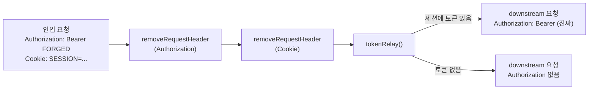
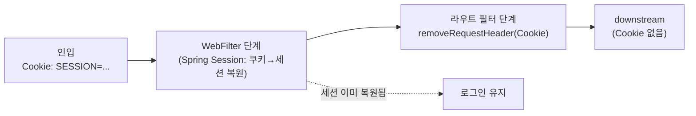

# 06. 게이트웨이 신뢰 경계와 헤더 위조 방어

> 게이트웨이는 클라이언트가 보낸 `Authorization` 을 **절대 신뢰하지 않는다.** 무조건 제거하고,
> 세션에서 꺼낸 토큰만 다시 붙인다. 이 "제거 후 재주입"이 tokenRelay 의 "덮어쓰기"와 어떻게 다른가.
> 관련: Phase 1 Step 7 · 코드 `gateway/src/main/kotlin/me/ramos/unigate/config/GatewayRouteConfig.kt`

## 1. 왜 필요했나

05 문서(TokenRelay) §5 에서 이미 구멍을 봤다. tokenRelay 는 위조 `Authorization` 헤더를
덮어쓰는 것처럼 보이지만, 그건 **토큰이 있을 때만**이다. 토큰이 없는 요청 — 미인증, 로그아웃,
refresh 실패 — 에서는 `defaultIfEmpty(exchange)` 로 아무것도 하지 않아 **인입 위조 헤더가
그대로 다운스트림에 도달한다.**

다운스트림이 Step 8 에서 JWT 를 검증하기 시작하면 위조 토큰은 서명에서 걸린다. 하지만 그건
"다운스트림이 방어해줄 것"이라는 가정에 인증을 맡기는 것이다. 게이트웨이가 인증 경계라면,
**신뢰할 수 없는 입력은 게이트웨이에서 끊어야 한다.** 다운스트림은 게이트웨이가 붙인 헤더만
받아야 하고, 클라이언트가 무엇을 보냈는지는 몰라야 한다.

여기에 05 §4 에서 관찰한 두 번째 누출도 함께 막는다 — **게이트웨이 세션 쿠키(`SESSION=...`)가
다운스트림으로 그대로 넘어가고 있었다.** tokenRelay 는 Authorization 만 추가할 뿐 다른 헤더를
정리하지 않기 때문이다.

## 2. 익숙한 방식과의 대조

| | Servlet 필터/인터셉터 감각 | 여기서의 방식 (SCG 라우트 필터) | 왜 다른가 |
|---|---|---|---|
| 위조 헤더 차단 | 컨트롤러 진입 전 `HandlerInterceptor` 에서 검사·거부 | 라우트 필터 체인에서 `removeRequestHeader` 로 **제거** | 게이트웨이는 요청을 거부하는 게 아니라 **정제해서 프록시**한다. 인증은 이미 앞단(SecurityWebFilterChain)에서 끝났고, 여기선 downstream 으로 나갈 헤더를 다듬는다 |
| 신뢰 헤더 주입 | `request.setAttribute` / 별도 헤더를 컨트롤러가 신뢰 | 세션→토큰을 필터가 재주입, 인입분은 선삭제 | "누가 이 헤더를 넣었는가"가 신뢰의 근거. 게이트웨이가 넣은 것만 신뢰 대상 |
| 순서 통제 | `@Order` / `FilterRegistrationBean` 우선순위 | 라우트 필터는 **선언 순서 = 실행 순서**(order 0 안정 정렬) | §3.2 |

핵심은 **"제거"와 "덮어쓰기"는 다른 연산**이라는 점이다. 덮어쓰기는 "새 값이 있을 때만" 이전 값을
지운다. 제거는 새 값의 유무와 무관하게 항상 비운다. 신뢰 경계에서 필요한 건 후자다.

## 3. 동작 원리

### 3.1 무조건 제거 → 조건부 재주입



두 경로 모두 **위조 FORGED 는 사라진다.** 토큰이 있으면 진짜 토큰으로, 없으면 아무 헤더 없이
나간다. tokenRelay 단독일 때는 "토큰 없음" 경로에서 FORGED 가 살아남았다(05 §5). 앞에
무조건 strip 을 두면 그 경로가 닫힌다.

### 3.2 왜 strip 이 tokenRelay 보다 앞이어야 하는가 (순서가 곧 보안)

라우트 로컬 필터(`stripPrefix` / `removeRequestHeader` / `tokenRelay`)는 전부 `Ordered` 를
구현하지 않는다. SCG 는 이들을 order **0** 으로 래핑하고(`GatewayFilterSpec.filter` →
`OrderedGatewayFilter(f, 0)`), 필터 정렬은 `AnnotationAwareOrderComparator` 의 **안정 정렬**이라
**order 가 같으면 선언한 순서가 그대로 실행 순서**가 된다. (SCG 4.3.0 바이트코드로 확인)

그래서 순서가 의미를 가진다.

| 배치 | 토큰 있음 (정상 사용자) | 토큰 없음 (위조 공격) |
|---|---|---|
| **strip → relay** (채택) | strip 후 relay 가 진짜 토큰 주입 ✅ | strip 으로 FORGED 제거, relay 는 무동작 ✅ |
| relay → strip (오답) | relay 가 넣은 **진짜 토큰까지 strip 이 제거** ❌ | FORGED 제거 ✅ |

즉 strip 을 뒤에 두면 위조는 막지만 **정상 요청이 깨진다.** relay 가 방금 붙인 토큰을 지워
downstream 이 401 을 낸다. strip 은 반드시 relay **앞**이다.

> `Cookie` strip 은 tokenRelay 와 무관(relay 는 Cookie 를 안 건드림)하므로 순서 제약이 없다.
> 다만 "인입 정제 → 재주입" 이라는 의미 묶음을 위해 Authorization strip 과 함께 앞에 둔다.

### 3.3 세션 쿠키를 떼도 로그인이 유지되는 이유

`removeRequestHeader(Cookie)` 가 세션 쿠키를 지우는데 왜 로그인이 안 풀리나? **경계가 다르기
때문이다.** Spring Session 은 라우팅보다 **앞선 WebFilter 단계**에서 쿠키를 읽어 세션을 이미
복원한다(03 문서). 라우트 필터는 그 **뒤**에서 도는 downstream 프록시 준비 단계라, 여기서
Cookie 를 떼도 게이트웨이의 세션 해석에는 영향이 없다. 사라지는 건 **downstream 으로 나갈
복사본**뿐이다.



## 4. 직접 확인한 것

> 2026-07-24 실측. 게이트웨이(:8080)·다운스트림 demo(:8081) 기동, 아래 방식으로 로그인 후 검증.
> 비밀번호·토큰·세션 쿠키 원문은 마스킹했다(§8).

**세션 쿠키 확보 방식(브라우저 없이):** `keycloak.secret.env` 를 source 해 비밀번호를 `$TEST_USER_PASSWORD`
참조로만 다루고, curl 쿠키 자(cookie jar)로 Authorization Code 로그인 전 과정을 재현했다:
`GET /api/echo` → (게이트웨이) `/oauth2/authorization/keycloak` → (Keycloak) authorize → 로그인 폼
파싱 → 자격증명 POST → 콜백(`/login/oauth2/code/keycloak?code=…`) → 인증된 `SESSION` 쿠키 확보.

> **함정(실측 중 발견):** 쿠키 자에서 `grep SESSION` 으로 값을 뽑으니 Keycloak 의
> `KC_AUTH_SESSION_HASH`·`KEYCLOAK_SESSION` 까지 잡혀 **엉뚱한 값**이 나왔고, 그걸 실으니 게이트웨이가
> `302 + Set-Cookie: SESSION=; Max-Age=0` 으로 세션을 무효화했다. 넷스케이프 쿠키 자에서 이름이
> 정확히 `SESSION` 인 줄만 골라야 한다: `awk -F'\t' '$6=="SESSION" && $1 ~ /localhost/ {print $7}'`.

확인 1 ★ — 위조 `Authorization` 이 다운스트림에서 사라졌는가 (Step 7 핵심 검증)
```bash
curl -s -b "SESSION=$S" -H 'Authorization: Bearer FORGED' localhost:8080/api/echo | jq '{
  forged_survived_in_authz: ((.headers.authorization // "") | contains("FORGED")),
  authz_is_real_jwt: .authorization.jwt,
  authz_present: .authorization.present,
  authz_prefix: ((.headers.authorization // "none")[0:14]),
  identity: (.authorization.payload | fromjson | {sub, preferred_username, aud})
}'
```
```json
{
  "forged_survived_in_authz": false,
  "authz_is_real_jwt": true,
  "authz_present": true,
  "authz_prefix": "Bearer eyJhbGc",
  "identity": {
    "sub": "115f2213-2d36-4bf0-a187-b124f7817b7d",
    "preferred_username": "alice",
    "aud": ["unigate-downstream-demo", "account"]
  }
}
```

관찰:
- **`forged_survived_in_authz: false`.** 위조 `Bearer FORGED` 가 다운스트림 응답에서 사라졌다.
  `removeRequestHeader(Authorization)` 가 인입 헤더를 비운 결과다.
- **`authz_is_real_jwt: true`** 이고 `identity.sub` 가 `115f2213-…7b7d` — 05 문서 §4 의 alice UUID 와
  정확히 일치한다. 즉 FORGED 를 지우고 **세션에서 꺼낸 진짜 alice 토큰**으로 재주입됐다.
- `aud` 에 `unigate-downstream-demo` 가 그대로 있다 — strip/재주입이 토큰 내용을 훼손하지 않았다.

확인 2 ★ — 토큰이 없는데 위조 헤더만 보내면?
```bash
curl -s -o /dev/null -w 'HTTP %{http_code} → %{redirect_url}\n' \
  -H 'Authorization: Bearer FORGED' localhost:8080/api/echo
```
```
HTTP 302 → http://localhost:8080/oauth2/authorization/keycloak
```

관찰:
- **미인증 요청은 302 로 끊긴다.** 위조 헤더를 실었어도 다운스트림에 **닿지 못한다** — 인증
  (SecurityWebFilterChain)이 라우팅보다 앞이라(01 문서), tokenRelay·strip 이 도는 라우트 단계까지
  가기 전에 로그인 리다이렉트로 빠진다. 이 경로에선 strip 이 필요 없다(애초에 다운스트림 미도달).
- 그래서 Step 7 strip 이 실제로 지키는 대상은 이 케이스가 아니라 **"인증은 됐지만 토큰이 없는"**
  상태(refresh 실패 등)다. 그 상태는 로컬에서 인위적으로 만들어야 재현되는데, 이번엔 재현하지
  않았다 → §6 에 남긴다. (strip 자체의 동작은 확인 1 에서 이미 검증됨: 헤더를 무조건 비운다.)

확인 3 ★ — 게이트웨이 세션 쿠키가 다운스트림으로 새지 않는가
```bash
curl -s -b "SESSION=$S" localhost:8080/api/echo | jq '{
  header_keys: (.headers | keys),
  cookie_leaked: (.headers | has("cookie")),
  authorization_present: (.headers | has("authorization"))
}'
```
```json
{
  "header_keys": ["accept", "authorization", "content-length", "host", "user-agent"],
  "cookie_leaked": false,
  "authorization_present": true
}
```

관찰:
- **`header_keys` 에 `cookie` 가 없다.** 05 문서 §4 에서 다운스트림이 받던 `SESSION=…` 쿠키가
  `removeRequestHeader(Cookie)` 로 사라졌다. 05 §4 가 "Step 7 의 과제"로 남긴 누출이 닫혔다.
- 동시에 `authorization` 은 남아 있다(진짜 토큰). 즉 **떼야 할 것(Cookie)만 떼고 필요한 것
  (Authorization)은 유지**됐다.
- Cookie 를 뗐는데도 이 요청 자체는 **200 으로 정상 응답**했다 — 게이트웨이의 세션 인식은 라우팅
  이전 WebFilter 에서 이미 끝났기 때문(§3.3). 로그인이 풀리지 않았다.

확인 4 — 정상 사용자 요청은 그대로 동작하는가 (회귀 확인)
```bash
curl -s -b "SESSION=$S" localhost:8080/api/echo | jq '.authorization.present'
```
```
true
```

관찰:
- **`true`.** strip 을 tokenRelay **앞**에 뒀기에 relay 가 주입한 진짜 토큰이 살아남았다.
  strip-after-relay 오답이었다면 relay 가 넣은 토큰을 strip 이 지워 여기서 `false`(또는 다운스트림
  401)가 됐을 것이다(§3.2 표). 정상 경로 무회귀 확인.

확인 5 ★ — "인증은 됐지만 토큰이 없는" 상태 재현 후 위조 헤더 (§6 Q1 추적, **예상과 다른 결과**)
```bash
# Valkey 세션 해시에서 인증 컨텍스트(SPRING_SECURITY_CONTEXT)는 남기고
# authorized client(토큰) 속성만 삭제한다 → "로그인 유지 + 토큰 없음" 상태.
KEY='spring:session:sessions:<sessionId>'
docker exec unigate-valkey valkey-cli HDEL "$KEY" \
  'sessionAttr:org.springframework.security.oauth2.client.web.server.WebSessionServerOAuth2AuthorizedClientRepository.AUTHORIZED_CLIENTS'
curl -s -b "SESSION=$S" localhost:8080/debug/whoami | jq '{authenticated, "accessToken.present": .accessToken.present, refreshTokenPresent}'
curl -s -o /dev/null -w 'HTTP %{http_code}\n' -b "SESSION=$S" -H 'Authorization: Bearer FORGED' localhost:8080/api/echo
```
```json
// whoami — 상태 재현 성공: 인증은 유지, 토큰만 사라짐
{ "authenticated": true, "accessToken.present": false, "refreshTokenPresent": false }
```
```
// /api/echo (위조 헤더 + 토큰 없음) — 다운스트림에 닿지 않는다
HTTP 302 → Location: https://<keycloak-host>/realms/test/protocol/openid-connect/auth
             ?response_type=code&client_id=unigate-client&code_challenge=…&code_challenge_method=S256
// 게이트웨이 로그:
[post] GET /api/echo status=302 FOUND signal=onError elapsedMs=1
```

관찰(★ 예상과 달랐다):
- 예상은 "토큰 없음 → tokenRelay 가 `defaultIfEmpty(exchange)` 로 통과 → **위조 헤더가 다운스트림
  도달**"이었다(§1·§5 의 서술). 실제로는 **302 로 Keycloak 재인가**가 떴고 다운스트림에 닿지 않았다.
- 결정적 단서는 로그의 **`signal=onError`** — 302 가 정상 흐름이 아니라 **에러 시그널**로 만들어졌다.
  즉 tokenRelay 가 토큰을 못 구하자 **재인가 필요 예외**(`ClientAuthorizationRequiredException` 계열)를
  던졌고, Spring Security 의 리다이렉트 필터가 그 예외를 잡아 **새 authorization 요청**(fresh
  `code_challenge` = 새 PKCE)으로 바꿨다.
- 왜 예상과 달랐나: `defaultIfEmpty` 통과는 principal 이 **Authentication 이 아닐 때**(익명)만 탄다.
  인증된 principal 이 토큰만 없으면 tokenRelay 는 manager 를 호출하고, manager 가 재인가를 요구하며
  예외로 끊는다. 우리 정책은 `/api/**` 를 `authenticated()` 로 묶으므로 익명은 애초에 이 라우트에
  못 온다 → **이 config 에선 "인증 + 토큰 없음"의 통과 경로가 실질적으로 닫혀 있다.**
- 그럼 strip 은 무의미한가? **아니다.** strip 은 tokenRelay 가 무엇을 하든 **그 앞에서 무조건** 인입
  Authorization 을 비운다. 재인가 예외가 안 나는 경로(예: 라우트를 `permitAll` 로 바꾸거나, manager 가
  예외 대신 empty 를 반환하는 설정)에서도 위조는 이미 제거돼 있다. 관측된 1차 방어는 재인가 리다이렉트,
  strip 은 그와 무관하게 항상 도는 **무조건 방어선**이다(defense-in-depth).

확인 6 ★ — strip 의 단독 가치 격리 실험 (§6 Q1-하위2, **로컬 임시·원복·커밋 안 함**)
```bash
# pass-through 경로를 태우려면 익명 principal 이 tokenRelay 라우트에 닿아야 한다.
# 그래서 /api/** 를 (local 한정) 임시 permitAll 로 열고, 익명으로 위조 헤더를 보낸다.
# 두 상태를 각각 재시작해 비교: [State1] strip 있음 vs [State2] strip 줄 주석.
curl -s -H 'Authorization: Bearer FORGED' localhost:8080/api/echo | jq '{
  http_reached_downstream: (.path == "/echo"),
  forged_survived: ((.headers.authorization // "") | contains("FORGED")),
  authorization_value: (.headers.authorization // "없음")
}'
```
```json
// [State 1] permitAll + strip 있음  — 익명 위조 헤더가 제거된다
{ "http_reached_downstream": true, "forged_survived": false, "authorization_value": "없음" }

// [State 2] permitAll + strip 주석  — 익명 위조 헤더가 그대로 통과한다
{ "http_reached_downstream": true, "forged_survived": true, "authorization_value": "Bearer FORGED" }
```

관찰:
- **이게 strip 의 단독 가치를 눈으로 본 유일한 실험이다.** 확인 5 의 "인증+토큰없음" 은 이 config 에서
  302 재인가로 가려져 strip 효과가 드러나지 않았다. 익명이 라우트에 닿는 조건(permitAll)을 만들자
  비로소 pass-through 경로가 살아나고, 거기서 **strip 유무가 결과를 가른다.**
- State 2 에서 `Bearer FORGED` 가 다운스트림에 그대로 도달했다 — tokenRelay 의 `defaultIfEmpty(exchange)`
  가 익명 요청을 손대지 않고 흘려보낸 것이다(§3.1, 05 §5). strip 을 다시 켜면(State 1) 위조가 사라진다.
  **§1·§5 가 서술한 "토큰 없으면 위조 통과"는 이 조건에서 실재함이 확인됐다.**
- 실험용 변경(permitAll, strip 주석)은 **`git checkout` 으로 원복**했고 커밋하지 않았다. 원복 후
  익명 `/api/echo` 는 다시 302(=`authenticated()` 복구)로 끊긴다.

## 5. 함정 / 실패 모드

| 함정 | 증상 | 원인 | 해결 |
|---|---|---|---|
| **strip 을 relay 뒤에 배치** | 정상 사용자도 다운스트림 401 | relay 가 넣은 진짜 토큰을 strip 이 제거 | strip 은 반드시 relay **앞** (§3.2) |
| **tokenRelay 에 방어를 위임** | 토큰 없는 요청의 위조 헤더 통과 | `defaultIfEmpty(exchange)` — 토큰 없으면 무동작 | 무조건 `removeRequestHeader` 를 따로 둔다 |
| **필터 순서를 order 로만 조정하려다 혼선** | 예상과 다른 순서로 실행 | 라우트 로컬 필터는 전부 order 0 → **선언 순서**가 결정 | 코드에 적은 순서 = 실행 순서임을 신뢰(§3.2) |
| **Cookie strip 이 로그인을 푼다고 오해** | (실제로는 안 풀림) | 세션은 앞선 WebFilter 에서 이미 복원됨 | downstream 전달분만 제거된다(§3.3) |
| **대소문자로 우회 시도** | `authorization:` 소문자로 보내면? | — | `removeRequestHeader` 는 HttpHeaders(대소문자 무시)라 함께 제거됨 |

### "제거"와 "덮어쓰기"의 차이 ★

이 단계 전체가 이 한 문장이다. tokenRelay 의 `setBearerAuth` 는 **덮어쓰기**다 — 새 토큰이 있을
때만 이전 값을 지운다. 신뢰 경계에서 필요한 건 **제거**다 — 새 값의 유무와 무관하게 항상 비운다.

덮어쓰기에 방어를 맡기면 "로그인한 사용자는 안전한데 로그인 안 한 공격자만 위조 헤더를
통과시키는" 거꾸로 된 방어가 된다(05 §5). 제거를 앞에 두면 그 역설이 사라진다: **누구의
요청이든 인입 Authorization 은 먼저 0 이 되고**, 그 위에 게이트웨이가 신뢰하는 값만 얹힌다.

### 어디까지 strip 할 것인가

지금은 `Authorization` 과 `Cookie` 만 뗀다. 하지만 신뢰 경계 원칙은 "게이트웨이가 주입하는
모든 신뢰 헤더는 인입분을 먼저 제거"다. 나중에 게이트웨이가 `X-User-Id` 같은 신원 헤더를
직접 주입하게 되면(다운스트림이 그걸 신뢰하는 순간), **그 헤더도 반드시 인입분을 strip** 해야
한다. 안 하면 클라이언트가 `X-User-Id: admin` 을 위조해 보낼 수 있다.

### 실측 정정: "토큰 없음"의 실제 동작 (§4 확인 5) ★

이 문서 §1·§5(표의 "tokenRelay 에 방어를 위임" 행)는 **"토큰이 없으면 `defaultIfEmpty` 로 위조 헤더가
그대로 다운스트림에 도달한다"** 고 서술했다. 확인 5 에서 그 전제를 직접 실험했더니 **이 config 에선
그렇게 되지 않았다.**

- 인증된 사용자의 토큰만 지우면(HDEL), 다음 요청은 통과가 아니라 **302 재인가**로 끊긴다.
  tokenRelay 가 manager 를 호출하다 재인가 필요 예외를 던지고(`signal=onError`), 리다이렉트 필터가
  그걸 새 authorization 요청으로 바꾼다. 위조 헤더는 다운스트림에 닿지 못한다.
- `defaultIfEmpty` 통과는 **principal 이 Authentication 이 아닐 때(익명)**만 탄다. 그런데 `/api/**` 는
  `authenticated()` 라 익명은 라우트에 오기 전에 302 로 끊긴다. 즉 **현재 정책에서 "위조가 다운스트림에
  통과"하는 경로는 실질적으로 닫혀 있다.**

그럼 §1·§5 의 서술은 틀렸나? **원리로는 맞지만, 이 config 에서 관측되는 1차 방어가 strip 이 아니라
재인가 리다이렉트라는 점이 빠져 있었다.** strip 의 가치는 여전하다 — tokenRelay 의 동작(통과/예외)과
무관하게 **무조건** 인입 Authorization 을 비우므로, 라우트를 `permitAll` 로 열거나 manager 설정이
바뀌어 통과 경로가 살아나는 순간에도 위조는 이미 제거돼 있다. **strip = 조건 무관 방어선, 재인가
리다이렉트 = 이 config 의 우연한 1차 차단.** 두 번째가 있다고 첫 번째를 빼면 안 된다.

## 6. 남은 의문

검증 중 실제로 드러난, 아직 못 닫은 질문들.

- [x] ~~"인증은 됐지만 토큰이 없는" 상태를 재현해 위조 헤더 방어를 확인한다.~~ → **확인 5 에서 재현·검증.**
      Valkey 세션에서 `AUTHORIZED_CLIENTS` 속성만 HDEL 하면 그 상태가 된다. **결과가 예상과 달랐다** —
      통과가 아니라 302 재인가로 끊겼다(§4 확인 5, §5 "실측 정정"). 남은 하위 질문:
  - [ ] ⏸ **(보류 — 재현 도구 부족)** **refresh 실패**(access 만료 + refresh token 도 폐기)일 때도
        302 재인가로 끊기나, 아니면 05 §5 가 우려한 "다운스트림 401 + 재로그인 유도 없음"이 되나?
        재현하려면 refresh token 을 서버측에서 폐기해야 하는데, **Keycloak admin 자격증명이 없고**
        (env 엔 issuer·client·test-user 만) refresh token 값은 세션 안에만 있어(BFF) revoke 도 못 부른다.
        → admin API 접근이 생기는 시점(로그아웃/회원관리 보강 작업)에 관찰한다.
  - [x] ~~tokenRelay `defaultIfEmpty` 통과 경로에서 strip 없이 위조가 통과하는지 격리 실험.~~
        → **확인 6 에서 검증.** `/api/**` 를 임시 permitAll 로 열어 익명 요청을 태우니, strip 없으면
        `Bearer FORGED` 가 다운스트림 통과, strip 있으면 제거됨. **strip 의 단독 가치를 눈으로 확인.**
- [ ] `X-Forwarded-*` 는 SCG 의 `ForwardedHeadersFilter` 가 관리한다는데, 이 strip 과 순서/책임이
      겹치지 않나? 클라이언트가 `X-Forwarded-For` 를 위조하면 지금 구조에서 어디까지 신뢰되나?
- [ ] 다운스트림이 여럿이 되면 strip 목록을 라우트마다 복붙하게 된다. 공통 GlobalFilter 로 올리는 게
      맞나(경계 한 곳에 모으기), 라우트별 명시가 더 안전한가(명시성)? §5 의 `X-User-Id` 확장까지 오면
      이 결정이 커진다.
- [ ] Cookie 를 통째로 떼는 게 항상 맞나? 다운스트림이 자기 쿠키를 쓰는 설계라면(이 프로젝트 전제엔
      없지만) 무엇을 남기고 무엇을 뗄지 어떻게 구분하나?
