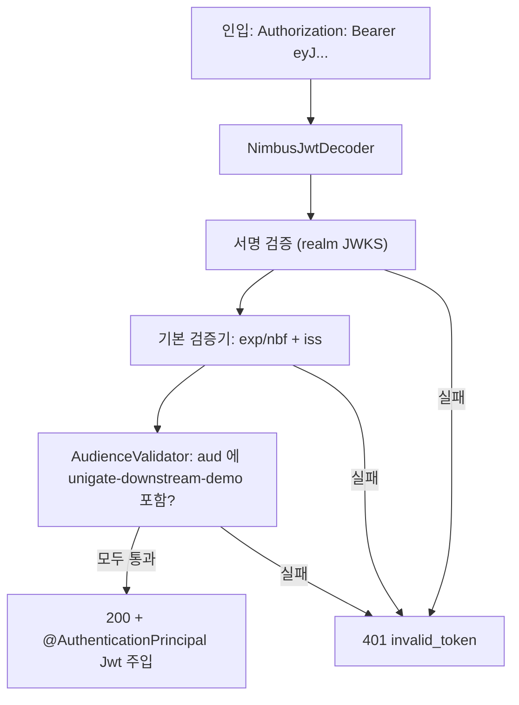

# 07. 다운스트림 Resource Server — 게이트웨이가 준 토큰을 검증한다

> 한 줄 요약 — Resource Server 는 기본적으로 **서명·만료·iss 만** 검증하고 **`aud` 는 보지 않는다**. `aud` 를 직접 끼우지 않으면 같은 realm 의 아무 토큰이나 통과한다.
> 관련: Phase 1 Step 8 · 코드 `samples/downstream-demo/**`(커밋 제외) · 선행 [06](06-gateway-trust-boundary-header-forgery.md)

## 1. 왜 필요했나

Step 7 까지 게이트웨이는 인입 위조 `Authorization` 을 **무조건 제거**하고, 세션(Valkey)의 진짜
access token 만 재주입했다([06](06-gateway-trust-boundary-header-forgery.md)). 그런데 다운스트림
(`downstream-demo`)은 그때까지 **받은 토큰을 검증하지 않는 순수 에코 서버**였다. 즉 게이트웨이를
믿고 무엇이든 처리했다.

문제는 **신뢰 경계가 게이트웨이 한 겹뿐**이라는 것이다. 누군가 게이트웨이를 우회해 다운스트림
(`:8081`)에 직접 요청하면(같은 네트워크·사이드카·SSRF 등) 아무 검증 없이 통과한다. Step 8 은
다운스트림을 **Resource Server 로 승격**해 "이 토큰이 진짜이고, 나를 향한 것인가"를 스스로 검증하게
만든다. 그래야 게이트웨이 우회 경로까지 닫힌다(defense in depth).

> 참고: 이건 헥사고날 산출물이 아니라 **샘플 앱**(`samples/`, 커밋 제외)의 변경이다. 다만 검증하는
> 개념(Resource Server · `aud`)은 Phase 2(게이트웨이 자체 JWKS 검증)에서 그대로 다시 만난다.

## 2. 익숙한 방식과의 대조

| | 익숙한 방식 (MVC 세션 인증) | 여기서의 방식 (Resource Server) | 왜 다른가 |
|---|---|---|---|
| 인증 상태 | 서버 세션(JSESSIONID)에 로그인 보관 | **stateless** — 세션 없음 | 매 요청이 Bearer JWT 하나로 자기증명. 서버는 상태를 안 가짐 |
| 신뢰 근거 | 로그인 시 검증 후 세션에 기록 | 매 요청마다 **토큰 서명 재검증** | 토큰은 위조 불가한 서명이 붙어 있어 상태 없이도 신뢰 가능 |
| 로그인 화면 | 앱이 폼/리다이렉트 제공 | **없음** — 401 만 반환 | 로그인은 BFF(게이트웨이)의 일. 다운스트림은 검증만 |
| CSRF | 필요(세션 쿠키 기반) | **불필요** | 쿠키가 아니라 Authorization 헤더로 인증 → CSRF 표면 없음 |

핵심 전환: **"로그인을 기억한다"(세션)에서 "매번 증명을 확인한다"(토큰)로.** BFF 구조에서
로그인·세션·CSRF 는 전부 게이트웨이가 지고, 다운스트림은 검증만 하는 얇은 자원 서버가 된다.

## 3. 동작 원리

`spring-boot-starter-oauth2-resource-server` 를 넣고 `oauth2ResourceServer { jwt {} }` 를 켜면
Spring Security 가 인입 `Authorization: Bearer` 를 가로채 `JwtDecoder` 로 검증한다. 기본
`JwtDecoders.fromIssuerLocation(issuer)` 는 issuer 의 discovery 로 JWKS URL 을 찾아 공개키를 받아둔다.

**기본 검증기(`JwtValidators.createDefaultWithIssuer`)가 보는 것:**

- 서명 — realm JWKS 의 공개키로 검증 (대칭키·introspection 아님, 로컬 검증)
- 만료 — `exp` / `nbf`
- 발급자 — `iss` 가 설정한 issuer 와 일치하는가

**보지 않는 것: `aud`.** 그래서 같은 realm 이 발급한 다른 대상용 토큰(예: Keycloak 이 늘 끼워 넣는
`account` audience 토큰)도 서명·iss 만 맞으면 통과한다 — 우리를 향한 토큰이 아닌데도. 이것이
`AudienceValidator` 를 직접 더해야 하는 이유다.



`DelegatingOAuth2TokenValidator(기본검증기, AudienceValidator)` 로 둘을 합쳐 `JwtDecoder` 에 물린다.
검증을 다 통과해야만 컨트롤러의 `@AuthenticationPrincipal Jwt` 가 채워진다 — 즉 **응답의 `principal`
값이 존재한다는 것 자체가 "검증 통과"의 증거**다.

## 4. 직접 확인한 것

> Keycloak `test` realm · 게이트웨이 `:8080` · 다운스트림 `:8081`. 토큰 원문은 마스킹한다(§8).
> `alice` 로그인은 BFF 브라우저 플로우로 수행(직접 grant 는 `unigate-client` 에서 막혀 있음 →
> `unauthorized_client: Client not allowed for direct access grants`).

**① 인증 없는 요청 / 형식 오류 토큰 → 401 (Resource Server 활성 증명)**

```
$ curl -s -D - -o /dev/null localhost:8081/echo
HTTP 401
WWW-Authenticate: Bearer

$ curl -s -D - -o /dev/null localhost:8081/echo -H 'Authorization: Bearer FORGED'
HTTP 401
WWW-Authenticate: Bearer error="invalid_token",
  error_description="An error occurred while attempting to decode the Jwt: Malformed token", ...
```

**② 정상 토큰 — 게이트웨이를 거친 실제 end-to-end (브라우저 BFF) → 200**

브라우저로 `localhost:8080/api/echo` → Keycloak 로그인(`alice`) → 다운스트림 응답 도달. 응답 발췌:

```json
{
  "method": "GET",
  "path": "/echo",
  "authorization": {
    "present": true, "jwt": true,
    "payload": "{ ... \"iss\":\"https://<keycloak-host>/realms/test\",
                  \"aud\":[\"unigate-downstream-demo\",\"account\"],
                  \"azp\":\"unigate-client\", \"preferred_username\":\"alice\" ... }"
  },
  "principal": "115f2213-2d36-4bf0-a187-b124f7817b7d"
}
```

`principal`(= 검증된 JWT 의 `sub`)이 채워졌다 → 서명·iss·aud 검증을 **모두 통과**했다는 뜻.
`aud` 에 `unigate-downstream-demo` 가 들어 있다(Keycloak Audience Mapper, `KEYCLOAK_REALM_SETUP.md` §4.4).

**③ 그 토큰을 다운스트림에 직접 재생 → 200 (stateless 확인)**

```
$ curl -s -o /dev/null -w "HTTP %{http_code}\n" localhost:8081/echo -H "Authorization: Bearer eyJ...<sig>"
HTTP 200      # principal=115f2213-..., aud=[unigate-downstream-demo, account]
```

쿠키·세션 없이 Bearer 토큰만으로 통과 — 다운스트림이 stateless 하다는 증거.

**④ 서명 조작 토큰 → 401 (서명 검증 동작)**

서명부 마지막 한 글자만 바꿔 재전송:

```
$ curl ... -H "Authorization: Bearer eyJ...<sig의 끝 글자 변조>"
HTTP 401
WWW-Authenticate: Bearer error="invalid_token",
  error_description="... Signed JWT rejected: Invalid signature", ...
```

**⑤ `aud` 불일치 → 401 (통제된 A/B)**

`aud` 는 서명에 묶여 위조할 수 없으므로, **기대 audience 만 다른 두 번째 인스턴스**(`:8082`,
`DOWNSTREAM_EXPECTED_AUDIENCE=unigate-nonexistent`)를 띄워 **완전히 동일한 토큰**을 보냈다:

```
$ curl ... localhost:8081/echo   # 기대 aud = unigate-downstream-demo
8081 HTTP 200
$ curl ... localhost:8082/echo   # 기대 aud = unigate-nonexistent
8082 HTTP 401  → WWW-Authenticate: Bearer error="invalid_token", error_description="Invalid token"
```

같은 토큰(같은 서명·iss·exp)이 한쪽은 200, 다른 쪽은 401. 두 인스턴스의 **유일한 차이가
`expected-audience` 뿐**이므로 이 401 은 서명·만료가 아니라 **`AudienceValidator` 가 원인**이다.
(8082 로그: `JwtAuthenticationProvider : Failed to authenticate since the JWT was invalid`)

## 5. 함정 / 실패 모드

- **`aud` 기본 미검증(가장 중요).** `jwt {}` 만 켜고 끝내면 서명·iss 만 본다. Keycloak 은 모든
  토큰에 `account` audience 를 넣으므로, `aud` 를 안 보면 **다운스트림용이 아닌 토큰도 통과**한다.
  증상은 조용하다 — 평소엔 잘 되다가, 다른 클라이언트 토큰이 흘러들어도 막지 못한다. 커스텀
  `AudienceValidator` 로만 닫힌다.
- **stateless 를 안 걸면 세션이 생긴다.** Resource Server 라도 기본은 세션 정책이 느슨해
  `JSESSIONID` 가 생길 수 있다. BFF 다운스트림엔 불필요하고 자원 낭비 → `SessionCreationPolicy.STATELESS`.
- **`fromIssuerLocation` 은 부팅 시 Keycloak 을 때린다.** 기동 시점에 issuer discovery/JWKS 를
  1회 조회한다. Keycloak 이 죽어 있으면 다운스트림이 **기동 자체에 실패**한다(키 회전 대응·지연
  로딩은 Phase 2 주제).
- **BFF 우회 = 검증 없으면 무방비.** Step 7 의 헤더 strip 은 게이트웨이를 **지나는** 요청만
  지킨다. 다운스트림 검증이 없으면 게이트웨이를 **건너뛴** 직접 요청은 그대로 뚫린다. Step 8 이
  그 두 번째 방어선이다.

## 6. 남은 의문

- **`spring.security.oauth2.resourceserver.jwt.audiences` 프로퍼티(Boot 3.4+)** 로도 `aud`
  검증이 된다고 알려져 있다. 커스텀 validator 대신 그 프로퍼티만으로 동일한 401 이 나는지는 미실측.
  (여기선 "왜 기본이 미검증인가"를 코드로 드러내려 커스텀 validator 를 택함.)
- **만료 토큰의 실제 401 메시지**는 관측하지 못했다(토큰 수명 5분, 만료 재현 전에 검증 종료).
  `exp` 검증이 기본 검증기에 있는 건 확인했으나 메시지 문자열은 미확인.
- **다운스트림 JWKS 캐싱·`kid` 회전** — 게이트웨이(Phase 2)와 동일한 문제를 다운스트림도 갖는다.
  키 회전 시 캐시 미스 재조회가 실제로 어떻게 도는지는 Phase 2에서 확인 예정.
