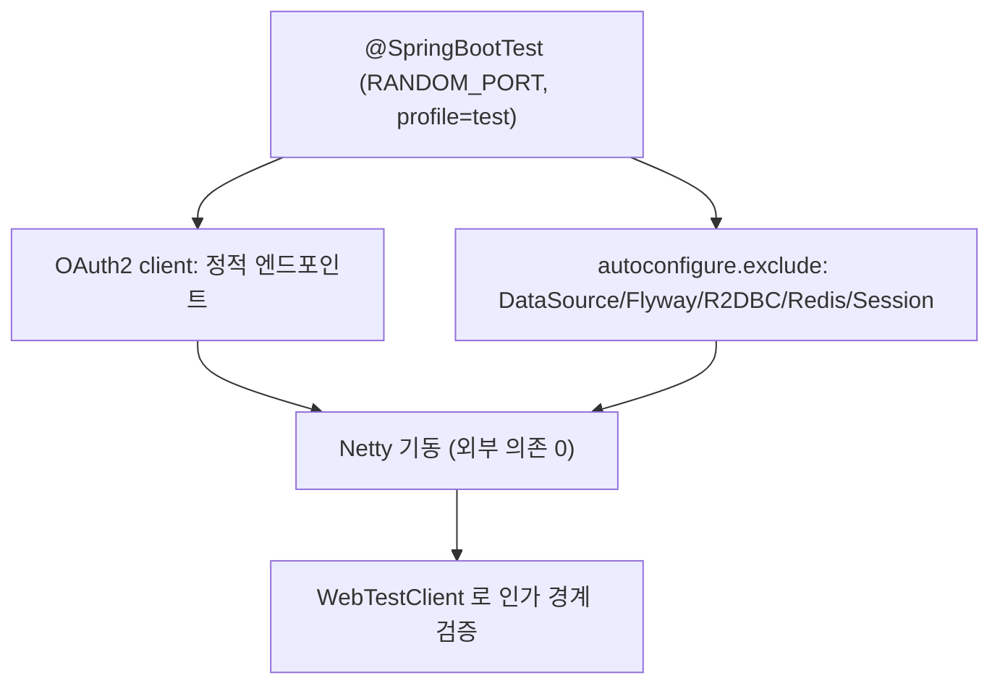

# 08. Keycloak·DB 에 의존하는 BFF 게이트웨이를 오프라인으로 통합 테스트하기

> 한 줄 요약 — `issuer-uri` discovery 와 DB/Redis 자동구성 때문에 이 게이트웨이는 그냥 `@SpringBootTest` 하면 부팅조차 안 된다. **정적 provider 엔드포인트 + autoconfigure 제외**로 외부 의존 0 인 통합 테스트를 만든다.
> 관련: Phase 1 Step 9 · 코드 `gateway/src/test/.../integration/GatewaySecurityIntegrationTest.kt` · `application-test.yml`

## 1. 왜 필요했나

Phase 1 마감에서 "로그인 경계가 실제로 서는가"를 **자동 회귀 테스트**로 고정하려 했다. 그런데
게이트웨이를 테스트로 부팅하는 것 자체가 막혔다. 이유가 셋 겹친다:

1. **OAuth2 client** — `spring.security.oauth2.client...issuer-uri` 는 부팅 시 Keycloak 의
   `.well-known/openid-configuration` 을 **HTTP 로 조회**해 엔드포인트를 채운다. Keycloak 이 없으면
   `ReactiveClientRegistrationRepository` 빈 생성이 실패한다.
2. **R2DBC / Flyway** — `spring.r2dbc.url` / `spring.datasource.url` 이 없으면 자동구성이
   "URL 을 못 정했다"며 **기동 자체를 실패**시킨다(연결 시도 이전에).
3. **Valkey(Redis) 세션** — 세션 저장소 자동구성이 붙는다.

셋 다 외부 인프라라 CI 에서 못 띄운다. Testcontainers 로 Keycloak+PG 를 올리는 방법도 있으나
(로컬 전용·무거움), Phase 1 의 검증 대상은 **SecurityConfig 의 인가 경계**뿐이라 과하다.

## 2. 익숙한 방식과의 대조

| | 익숙한 방식 (MVC + JPA 슬라이스) | 여기서의 방식 (WebFlux BFF) | 왜 다른가 |
|---|---|---|---|
| 컨트롤러 단위 테스트 | `@WebMvcTest` 로 웹 계층만 슬라이스 | SCG 는 컨트롤러가 없다 — 필터 체인이 전부 | 슬라이스할 "컨트롤러"가 없어 풀 컨텍스트를 띄우되 외부의존만 잘라낸다 |
| 외부 IdP | 보통 mock/stub 으로 주입 | **정적 provider 엔드포인트**로 discovery 자체를 제거 | issuer-uri 는 부팅 시 네트워크. 엔드포인트를 직접 박으면 호출이 사라진다 |
| DB | `@DataJpaTest` + Testcontainers | 자동구성 **제외**(이 테스트는 DB 를 안 씀) | 감사로그(R2DBC)는 Phase 4 관심사. Phase 1 인가 경계와 무관 |

## 3. 동작 원리

두 개의 레버로 "외부 의존 0 부팅"을 만든다. 둘 다 `application-test.yml` 에 있다.

**(1) discovery 제거 — issuer-uri 대신 정적 엔드포인트.** ClientRegistration 은 issuer-uri 로
자동 조회하는 대신, `authorization-uri` / `token-uri` / `jwk-set-uri` / `user-info-uri` 를 직접 주면
**네트워크 없이** 구성된다. 로그인을 완료하지 않고 **리다이렉트 시작까지만** 검증하므로 이 엔드포인트는
실제로 호출되지 않는다 — 존재하지 않는 포트(`:1`)를 박아도 된다. mock 서버조차 필요 없다.

**(2) 외부 자동구성 제외 — `spring.autoconfigure.exclude`.** DataSource·Flyway·R2DBC·Redis·Session
자동구성을 명시적으로 뺀다. 이러면 URL 이 없어도 부팅이 실패하지 않는다.



검증은 `WebTestClient.bindToServer()`(리다이렉트 자동 추적 안 함)로 302 를 그대로 관찰한다.

## 4. 직접 확인한 것

`application-test.yml`(정적 엔드포인트 + 5개 자동구성 제외)과 `GatewaySecurityIntegrationTest`(4개
케이스) 작성 후 실행. **Docker·Keycloak 미기동 상태**에서:

```
$ ./gradlew :gateway:test --tests "me.ramos.unigate.integration.GatewaySecurityIntegrationTest"

  ...
  Netty started on port 60459 (http)
  Started GatewaySecurityIntegrationTest in 1.167 seconds

GatewaySecurityIntegrationTest > 로그인 시작 요청은 PKCE(S256)를 붙여 ... 리다이렉트한다() PASSED
GatewaySecurityIntegrationTest > 미인증 요청은 라우팅 이전에 로그인 시작점으로 리다이렉트된다() PASSED
GatewaySecurityIntegrationTest > 공개 경로 actuator health 는 인증 없이 200 을 준다() PASSED
GatewaySecurityIntegrationTest > 위조 Authorization 헤더를 실어도 미인증이면 리다이렉트로 차단된다() PASSED

BUILD SUCCESSFUL in 9s
```

전체 빌드(`./gradlew build` — 컴파일 + ktlint + 전체 테스트)도 GREEN:

```
> Task :gateway:ktlintTestSourceSetCheck
> Task :gateway:check
> Task :gateway:build
BUILD SUCCESSFUL in 8s
```

무엇이 고정됐나:
- 공개 경로(`/actuator/health`) 인증 없이 200
- 미인증 `/api/echo` → 302, `Location` 이 `/oauth2/authorization/keycloak` (라우팅 전 차단)
- 위조 `Authorization: Bearer FORGED` 를 실어도 미인증이면 302 로 차단
- `/oauth2/authorization/keycloak` → 302, `Location` 에 `code_challenge=...&code_challenge_method=S256`
  (confidential client PKCE 회귀 가드)

## 5. 함정 / 실패 모드

- **issuer-uri 를 그대로 두면 부팅이 Keycloak 을 때린다.** 테스트가 "네트워크 없음/타임아웃"으로
  느려지거나 실패한다. 증상이 컨텍스트 로딩 단계라 어떤 테스트가 원인인지도 안 보인다. →
  provider 엔드포인트를 정적으로 박아 discovery 를 아예 없앤다.
- **r2dbc/datasource 자동구성은 URL 이 없으면 "연결 실패"가 아니라 "기동 실패"다.** 연결을
  시도하기도 전에 URL 미정으로 컨텍스트가 안 뜬다. 제외 목록에서 하나라도 빠지면 그 지점에서 막힌다.
- **health 그룹이 없는 기여자를 참조하면 경고가 뜬다.** base 설정의 `readiness.include: ...,redis`
  는 redis 자동구성을 뺀 순간 붕 뜬다 → test 프로파일에서 `readiness.include: readinessState` 로 덮었다.
- **이건 "로그인 성공" 경로를 검증하지 않는다.** 세션에 토큰을 심어야 하는 TokenRelay·헤더 재주입의
  성공 케이스는 여기 없다(그건 Step 6~8 에서 수동 e2e 로 확인). 이 테스트의 범위는 **인가 경계**다.

## 6. 남은 의문

- **성공 로그인 경로의 자동 검증**은 미완이다. 세션에 `OAuth2AuthorizedClient` 를 주입해 TokenRelay·
  헤더 strip 의 성공 케이스까지 자동화하려면 mock OIDC(JWKS 서명 포함) 또는 Testcontainers Keycloak 이
  필요하다. Phase 2(게이트웨이 자체 JWKS 검증) 착수 시 이 인프라를 함께 지을지 결정해야 한다.
- **정적 엔드포인트 vs Testcontainers Keycloak** 의 경계 — 어디까지 정적으로 버티고 어디부터 실제
  IdP 가 필요한지는 성공 경로를 자동화하는 시점에 다시 판단한다.
