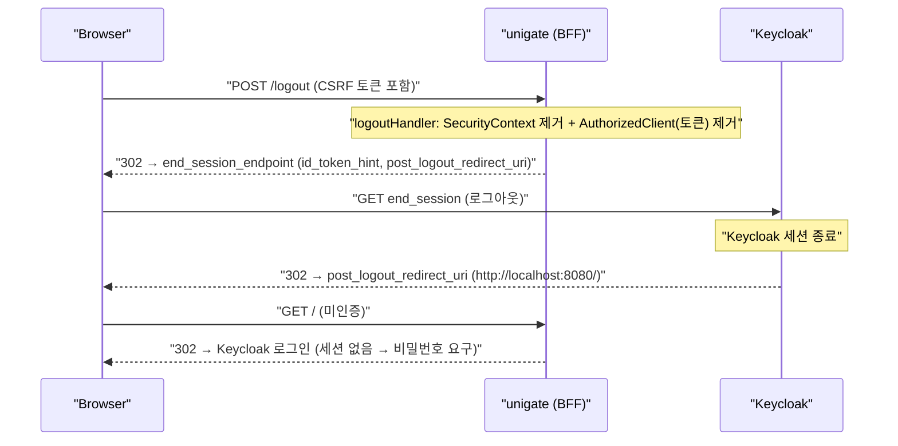

# 09. RP-Initiated Logout — 진짜 로그아웃과 Spring Session 무효화 함정

> 한 줄 요약 — 게이트웨이 세션만 지우면 Keycloak SSO 가 살아 있어 **비밀번호 없이 자동 재로그인**된다. `end_session_endpoint` 로 Keycloak 세션까지 끝내야 진짜 로그아웃이다. 단, Spring Session(reactive)에서 세션 `invalidate()` 는 자동저장과 충돌해 500 을 낸다.
> 관련: Phase 1.5 · 코드 `config/SecurityConfig.kt` · `adapter/gatewayIn/LogoutProbeConfig.kt`(local) · 선행 [04](04-oauth2-authorization-code-bff.md)

## 1. 왜 필요했나

BFF 는 토큰을 세션(Valkey)에 숨기고 브라우저엔 세션 쿠키만 준다([04](04-oauth2-authorization-code-bff.md)).
그래서 "로그아웃"은 두 곳을 동시에 정리해야 한다:

1. **게이트웨이 세션** — 여기의 SecurityContext 와 토큰(access/refresh)을 폐기한다.
2. **Keycloak 세션** — Keycloak 은 브라우저에 자기 SSO 쿠키(`KEYCLOAK_IDENTITY`)를 심어 뒀다.
   이걸 안 끝내면, 로그아웃 후 보호 리소스에 다시 접근할 때 authorization code 흐름이
   **로그인 화면 없이 자동 완료**된다 — 사용자 체감은 "로그아웃이 안 된" 상태.

②를 처리하는 게 OIDC **RP-Initiated Logout**이다: 로그아웃 후 사용자를 Keycloak 의
`end_session_endpoint` 로 보내 Keycloak 세션까지 종료시킨다.

## 2. 익숙한 방식과의 대조

| | 게이트웨이 세션만 클리어 | RP-Initiated Logout | 왜 다른가 |
|---|---|---|---|
| 게이트웨이 | 미인증됨 | 미인증됨 | 동일 |
| Keycloak SSO | **살아 있음** | **종료됨** | end_session 왕복 유무 |
| 재접근 시 | 비밀번호 없이 자동 재로그인 | **재로그인(비밀번호) 강제** | Keycloak 세션이 남았나 |

즉 게이트웨이 세션만 지우는 로그아웃은 **로그아웃처럼 보이지만 아니다.** 다음 클릭 한 번에 되돌아온다.

## 3. 동작 원리



- **logoutHandler**(게이트웨이 정리): `SecurityContextServerLogoutHandler`(컨텍스트 제거) +
  `authorizedClientRepository.removeAuthorizedClient(...)`(토큰 제거). 둘 다 세션 **업데이트**다.
- **logoutSuccessHandler**(Keycloak 정리): `OidcClientInitiatedServerLogoutSuccessHandler`.
  `end_session_endpoint`(discovery 메타데이터)로 리다이렉트하며 `id_token_hint` + `post_logout_redirect_uri` 를 붙인다.

## 4. 직접 확인한 것

> Keycloak `test` realm · 게이트웨이 `:8080` · 브라우저 BFF. 토큰 원문은 다루지 않는다.

**(가장 값진 관찰) 처음 구현은 500 으로 터졌다.** `WebSessionServerLogoutHandler` 로 세션을
`invalidate()` 했더니 POST /logout 이 500:

```
[..] Resolved [IllegalStateException: Session was invalidated] for HTTP POST /logout
[..] 500 Server Error for HTTP POST "/logout"
java.lang.IllegalStateException: Session was invalidated
    at org.springframework.session.data.redis.ReactiveRedisSessionRepository.lambda$save$2(ReactiveRedisSessionRepository.java:150)
```

원인: Spring Session(reactive Redis)은 **요청 종료 시 세션을 자동 저장**한다. 그런데 로그아웃이
세션을 invalidate 하면 그 자동 저장이 "무효화된 세션을 save" 하려다 터진다. → 무효화 대신
**민감 attribute(컨텍스트·토큰)만 제거**하도록 바꿔 해결(§5).

**수정 후 브라우저 e2e** — 로그아웃 프로브(`/debug/logout`)로 상태를 관찰:

```
로그아웃 전:  상태: 로그인됨 (principal=115f2213-...-b124f7817b7d)
[로그아웃 버튼 클릭 → POST /logout]
→ 브라우저가 Keycloak "Sign in to your account" 화면으로 튕김  ← 500 없음, 재로그인 강제
로그아웃 후:  상태: 로그인 안 됨
```

로그아웃 직후 보호 경로(`/`)로 갔을 때 **Keycloak 로그인 폼이 다시 뜬 것**이 핵심 증거다.
Keycloak 세션이 살아 있었다면 폼 없이 자동 로그인됐을 것이다 → RP-Initiated Logout 이 실제로 동작.

**오프라인 통합 테스트** (`./gradlew :gateway:test`, Docker·Keycloak 없이):

```
tests="5" skipped="0" failures="0" errors="0"
 - CSRF 토큰 없는 POST logout 은 403 으로 거부된다
 - 로그인 시작 요청은 PKCE(S256)를 붙여 ... 리다이렉트한다
 - 미인증 요청은 라우팅 이전에 로그인 시작점으로 리다이렉트된다
 - 공개 경로 actuator health 는 인증 없이 200 을 준다
 - 위조 Authorization 헤더를 실어도 미인증이면 리다이렉트로 차단된다
```

## 5. 함정 / 실패 모드

- **Spring Session(reactive) + `session.invalidate()` = 자동저장 500(가장 아팠던 지점).**
  WebFlux 는 요청 끝에 세션을 자동 save 하는데, 로그아웃이 세션을 무효화하면 그 save 가
  `IllegalStateException: Session was invalidated` 로 터진다. **무효화 대신 attribute 제거**로
  회피했다(컨텍스트·토큰만 지움). 대가: 빈 세션 레코드가 TTL(30m)까지 남는다 — 민감 내용은
  이미 없으므로 보안상 무해하지만, "완전 무효화"는 아니다(§6).
- **CSRF 보호된 POST /logout 을 FE 없이 트리거하기.** 로그아웃은 상태 변경이라 CSRF 로 보호된다.
  아직 SPA 가 없어, 토큰이 박힌 폼을 서버가 그려주는 `LogoutProbeConfig`(local)를 만들었다.
  WebFlux 의 `CsrfToken` 은 지연 평가라 **구독해야** 토큰이 세션에 저장된다는 점에 주의(코드 주석 참조).
- **post_logout_redirect_uri 는 Keycloak 등록값과 정확히 일치해야 한다.** `{baseUrl}/` →
  `http://localhost:8080/`. 불일치 시 Keycloak 이 `invalid_redirect_uri` 로 거절한다.
- **`end_session_endpoint` 는 discovery 메타데이터에서만 온다.** 그래서 정적 엔드포인트만 주는
  테스트 프로파일에선 Keycloak 왕복을 자동 검증할 수 없다 → 그 부분은 브라우저 e2e 로 확인.

## 6. 남은 의문

- **완전한 세션 무효화**를 하려면? Spring Session reactive 에서 invalidate 와 자동저장 충돌을
  깔끔히 푸는 방법(커스텀 WebSessionStore, save 억제 등)은 아직 확인 못 했다. 지금은 attribute
  제거로 우회 중이고, 빈 세션이 TTL 로 만료되길 기다린다.
- **FE 연동 시 CSRF 전달** — SPA 는 세션의 CSRF 토큰을 직접 못 읽는다. 쿠키(`XSRF-TOKEN`) 방식으로
  넘길 때 WebFlux 지연평가 함정(SecurityConfig 의 CSRF TODO)을 어떻게 푸는지는 FE 단계에서.
- **Back-channel logout** — 다운스트림이 이미 발급한 토큰은 로그아웃 후에도 만료 전까지 유효하다.
  Keycloak back-channel logout 통지까지 필요한지는 다운스트림 세션 개념이 생길 때 판단한다.
