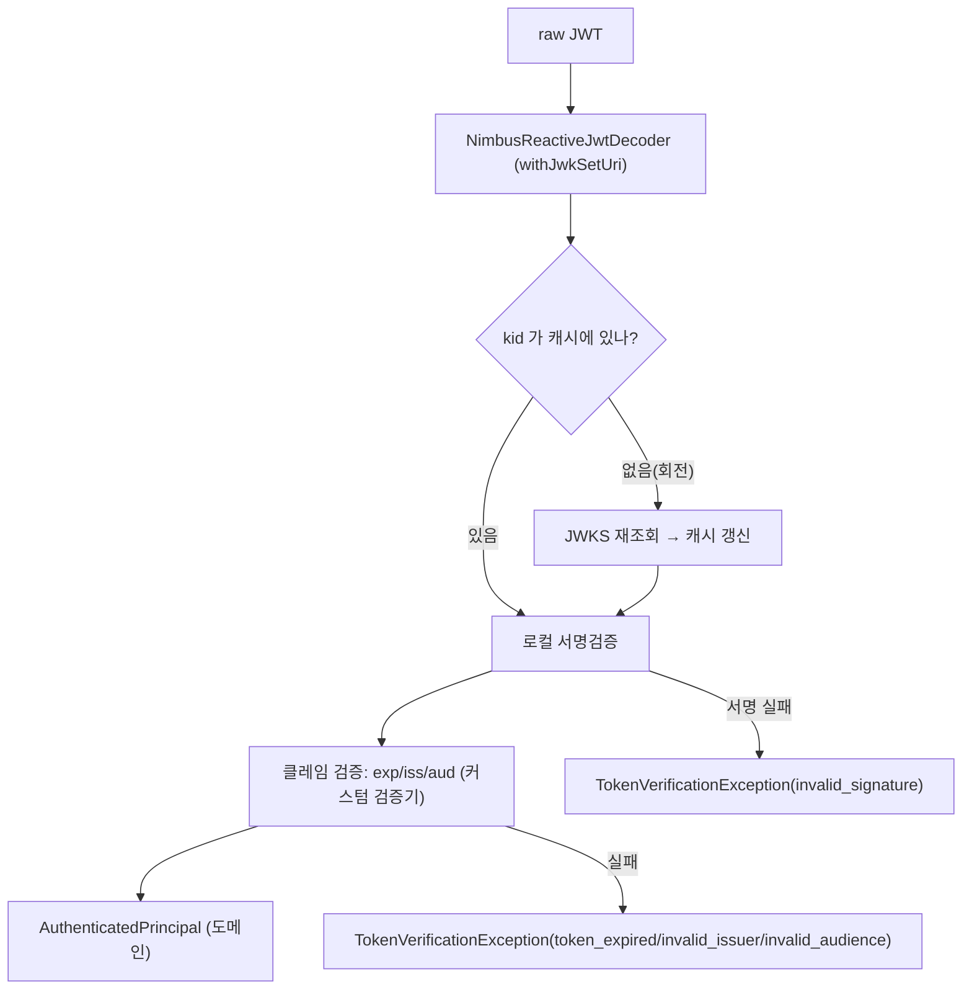

# 10. JWKS 로컬 검증 — introspection 없이 토큰을 신뢰하기

> 한 줄 요약 — 공개키(JWKS)를 한 번 받아 캐시하면, 이후엔 매 요청 Keycloak 왕복(introspection) 없이 **로컬에서 서명만** 검증한다. 키가 바뀌면(`kid` 미스) 그때만 다시 받아온다.
> 관련: Phase 2 · 코드 `adapter/keycloakOut/**` · 포트 `application/.../TokenVerifierPort`

## 1. 왜 필요했나

로드맵의 "Keycloak 의존 최소화". 토큰을 검증하는 방법은 둘이다:

- **introspection** — 매 요청마다 Keycloak `/introspect` 를 호출해 "이 토큰 유효해?"를 묻는다.
  요청 경로에 외부 왕복이 얹혀 **지연·결합·장애 전파**가 생긴다.
- **JWKS 로컬 검증** — 발급자의 공개키(JWKS)를 받아 캐시하고, 토큰 서명을 **로컬에서** 검증한다.
  Keycloak 이 잠시 죽어도 캐시된 키로 검증이 계속된다.

이번엔 헥사고날 **포트가 처음 실제로 구현되는 지점**이기도 하다(`TokenVerifierPort` ← `keycloakOut`).
아직 요청 흐름에 물리진 않은 **빌딩블록**이며, 소비자(coarse authz·감사)는 Phase 8/9 에서 붙는다.

## 2. 익숙한 방식과의 대조

| | introspection | JWKS 로컬 검증 (채택) |
|---|---|---|
| 검증 위치 | Keycloak(원격) | 게이트웨이(로컬) |
| 요청당 외부호출 | **매번** | 없음(키는 캐시, 미스 시만 조회) |
| Keycloak 장애 | 검증 불가 → 전면 실패 | 캐시로 생존 |
| 최신성 | 즉시 폐기 반영 | 토큰 만료까지 유효(트레이드오프) |

## 3. 동작 원리



- **`withJwkSetUri` (지연 로딩)** — `fromIssuerLocation` 은 부팅 시 discovery 를 HTTP 로 조회해
  Keycloak 에 부팅이 묶인다. `withJwkSetUri` 는 첫 검증 때 JWKS 를 가져오므로 부팅과 분리된다.
- **캐싱 + kid 회전** — Nimbus `RemoteJWKSet` 가 JWKS 를 캐시하고, 캐시에 없는 `kid` 를 만나면
  재조회한다. 키 롤오버 중에도 검증이 끊기지 않는다.
- **구분된 원인 코드** — exp/iss/aud 를 각각의 커스텀 검증기로 잡아 `token_expired`/`invalid_issuer`/
  `invalid_audience` 를 남긴다(서명 실패는 `invalid_signature`). "왜 401 인가"가 로그·응답에 바로 뜬다.
- **keycloakOut 봉인** — JWKS URL 조립(`/protocol/openid-connect/certs`)과 역할 위치(`realm_access.roles`)
  같은 Keycloak 고유 지식은 어댑터 안에만 있고, 밖으론 IdP 중립 `AuthenticatedPrincipal` 만 나간다.

## 4. 직접 확인한 것

> 자가서명 RSA 키로 JWT 를 만들고 공개키(JWKS)를 MockWebServer 로 띄워 검증했다. Docker·Keycloak 없이 CI 실행.

**단위 + 통합 9케이스 GREEN**:

```
KeycloakTokenVerifierTest (L1, 디코더 모킹 — 매핑·예외번역)
  ✓ 성공 JWT → subject·email·groups(realm_access.roles)·audiences 매핑
  ✓ aud 불일치 → invalid_audience   ✓ 서명 실패 → invalid_signature   ✓ 형식오류 → malformed_token
KeycloakTokenVerifierJwksTest (통합, 실제 crypto)
  ✓ 정상 서명 → 검증·매핑     ✓ JWKS 없는 키로 서명 → invalid_signature
  ✓ 만료 → token_expired      ✓ aud 상이 → invalid_audience
  ✓ 키 회전 — 캐시에 없는 kid → JWKS 재조회 후 검증
```

**kid 회전 재조회를 계측으로 확인**: 같은 디코더로 k1 검증(JWKS 1회 조회, 캐시) → 응답 JWKS 를
`{k1,k2}` 로 교체 → k2 로 서명한 토큰 검증 시 **조회 횟수가 늘어남**(캐시 미스 → 재조회)을 단언했다.

## 5. 함정 / 실패 모드

- **reactive 디코더의 예외 문구가 servlet 과 다르다(실측).** 서명 실패 시 servlet 은
  "...Invalid signature" 지만 reactive `NimbusReactiveJwtDecoder` 는 **"Failed to validate the token"**
  을 던진다. "signature" 문자열만 보고 매핑했다가 `malformed_token` 으로 오분류돼서, 두 문구를 모두
  서명 실패로 매핑하도록 고쳤다. (교훈: 문자열 매칭은 취약 — exp/iss/aud 는 커스텀 검증기로 잡는다.)
- **`exp < iat` 은 "만료"가 아니라 "형식 오류"다.** 만료 테스트를 만들 때 exp 만 과거로 두고 iat 는
  now 로 뒀더니 디코더가 **"expiresAt must be after issuedAt"** 로 거부했다(만료가 아님). iat 도 exp
  앞으로 옮겨야 진짜 만료 토큰이 된다. → 실제 관찰한 메시지로 원인을 잡았다.
- **`fromIssuerLocation` 은 부팅을 Keycloak 에 묶는다.** discovery 를 부팅 시 조회하므로 Keycloak 이
  없으면 기동 실패. 소비자 없는 빌딩블록엔 지연 로딩(`withJwkSetUri`)이 맞다.
- **최신성 트레이드오프.** 로컬 검증은 토큰이 만료될 때까지 유효하다 — 즉시 폐기(로그아웃·차단)가
  필요하면 별도 수단(짧은 만료 + refresh, back-channel logout)이 필요하다.

## 6. 남은 의문

- **기대 audience 확정** — 지금은 설정값(`unigate-downstream-demo`)이지만, 이 검증기의 진짜 소비자가
  정해지는 Phase 8/9 에서 "게이트웨이가 무엇을 향한 토큰을 받는가"에 맞춰 확정해야 한다.
- **JWKS 캐시 TTL·rate limit 세부** — Nimbus 기본 캐시 정책(만료·최소 재조회 간격)을 운영 관점에서
  튜닝할 필요가 있는지(키 회전 빈도 대비)는 Phase 3(Resilience)에서 CB·타임아웃과 함께 본다.
- **키 회전 중 Keycloak 실장애** — 캐시에 없는 kid + JWKS 조회 실패가 겹치면? 재시도·폴백 정책 미검증.
