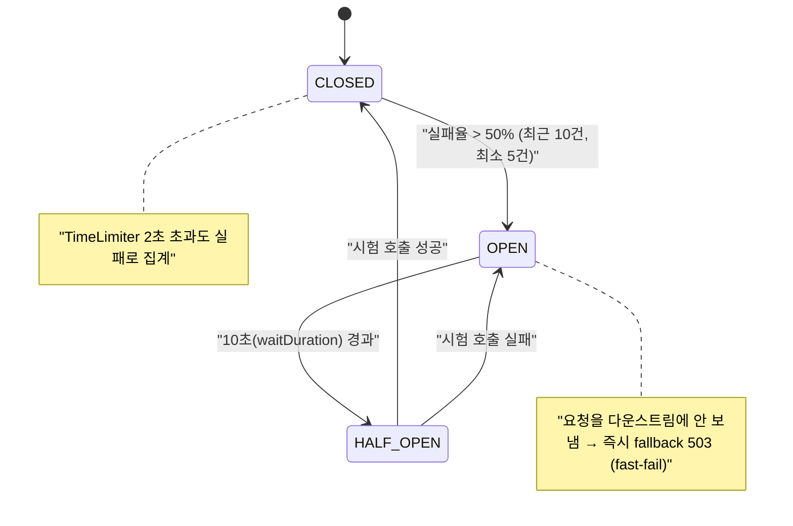

# 11. Resilience — 토큰버킷 Rate Limiting + Circuit Breaker

> 한 줄 요약 — 게이트웨이는 모든 트래픽의 단일 통로다. 폭주는 **토큰버킷(Redis)** 으로 429 하고, 다운스트림 장애는 **Circuit Breaker + Timeout** 으로 빠르게 실패시켜(fallback 503) 전파를 끊는다.
> 관련: Phase 3 · 코드 `config/RateLimitConfig.kt` · `config/GatewayRouteConfig.kt` · `adapter/gatewayIn/FallbackRoutes.kt`

## 1. 왜 필요했나

게이트웨이가 단일 통로라는 건, 여기가 느려지거나 막히면 **모든 서비스가 같이 막힌다**는 뜻이다.
두 가지 위협을 라우트 경로에서 방어한다:

- **폭주** — 한 클라이언트가 요청을 쏟아부어 자원을 독점(크리덴셜 스터핑 포함). → rate limiting.
- **다운스트림 장애 전파** — 다운스트림이 느려지면 게이트웨이 요청들이 타임아웃까지 매달려
  스레드·커넥션이 고갈되고, 장애가 게이트웨이로 번진다. → Circuit Breaker + Timeout.

## 2. 익숙한 방식과의 대조

| | 순진한 방식 | 여기서의 방식 | 왜 다른가 |
|---|---|---|---|
| 한도 카운터 | 인스턴스 in-memory | **Redis 토큰버킷** | replica N개면 in-memory 는 한도가 N배로 샌다. Redis 는 공유 버킷 |
| 다운스트림 지연 | 타임아웃까지 매달림 | **CB + TimeLimiter → fast-fail** | 장애 시 매달리면 게이트웨이째 고갈. CB 는 빠르게 끊어 격리 |
| 장애 응답 | 500/빈 응답 | **RFC 7807 503 Problem Detail** | 원인·재시도 가능성을 구조화해 전달 |

## 3. 동작 원리

**Rate limiting** — SCG `RedisRateLimiter` 가 토큰 보충/소비를 **Lua 스크립트**로 원자 처리한다.
`replenishRate`(초당 보충) < `burstCapacity`(버킷 최대)로 두어 짧은 폭주는 흡수하되 지속 초과는 429.
**키 해석**: 인증되면 `sub`, 미인증은 IP — `ReactiveSecurityContextHolder`(Reactor Context)에서 읽는다.

**Circuit Breaker** — 다운스트림 호출을 감싸 상태를 관리한다.



CB open 시 요청은 다운스트림을 건너뛰고 `forward:/fallback/downstream` → 503 Problem Detail 로 간다.

## 4. 직접 확인한 것

> 브라우저 BFF 로그인(alice) 세션으로 `/api/echo` 를 호출. 인증이 있어야 라우트(필터)에 도달한다.

**Rate limiting** — 동시 요청 25개(`replenishRate=5, burstCapacity=10`):

```
결과: { "200": 10, "429": 15 }        ← 버킷 용량(10)만 통과, 나머지 429
응답 헤더: x-ratelimit-burst-capacity=10, x-ratelimit-replenish-rate=5,
          x-ratelimit-requested-tokens=1, x-ratelimit-remaining=9
```

**Circuit Breaker + Timeout** — 느린 다운스트림(`?delayMs=5000`, 타임아웃 2초)에 순차 요청:

```
요청 0~4: status=503, ms≈2053, 2020, 2026, 2029, 2032   ← TimeLimiter 2초 → fallback (5초 안 기다림)
요청 5~9: status=503, ms≈9, 15, 16, 11, 14              ← CB OPEN → fast-fail (다운스트림 시도 없음)
10초 경과 후 정상 요청: status=200                        ← half-open → 성공 → CLOSED (복구)
```

5회 실패로 회로가 열리자 지연이 **2000ms → 10ms** 로 급락했다 — 다운스트림에 더는 가지 않는다는 증거.
fallback 응답은 `application/problem+json`, `reasonCode=downstream_unavailable`(오프라인 테스트로 별도 확인).

## 5. 함정 / 실패 모드

- **`RedisRateLimiter` 는 reactive Redis 빈을 부팅 시 요구한다.** 오프라인 통합 테스트가 Redis
  자동구성을 제외하고 있어 컨텍스트가 깨졌다 → Redis autoconfig 는 살리되(Lettuce 는 지연 연결이라
  부팅 시 접속 안 함) **redis health ping 만 껐다**(`management.health.redis.enabled=false`)로 health 200 유지.
- **미인증 `/api` 는 rate limiter 를 안 탄다.** 미인증 요청은 Security 가 라우팅 **전에** 302 로
  돌려보내 필터 체인에 도달하지 못한다. 그래서 rate limit·CB 검증은 **인증 세션**이 있어야 한다
  (브라우저 로그인). "로그인 엔드포인트 자체"의 강화 limit 은 SCG 라우트가 아니라 별도 WebFilter 필요.
- **fallback 경로는 공개로.** CB 가 `forward` 로 넘기는 `/fallback/**` 를 인증 필요로 두면 forward 시
  재인증에 걸릴 수 있어 permitAll 로 뒀다(503 만 반환, 민감정보 없음).
- **키 해석은 Reactor Context 의존.** `ReactiveSecurityContextHolder` 가 값을 주는 건 SCG 필터가
  SecurityWebFilterChain 이 채운 Context 안에서 돌기 때문. 이 순서가 깨지면 sub 를 못 읽고 전부 IP 로 샌다.

## 6. 남은 의문

- **로그인/토큰 엔드포인트 강화 limit** — `/oauth2/authorization/**` 는 SCG 라우트가 아니라 별도
  WebFilter 로 rate limit 을 걸어야 한다(크리덴셜 스터핑 방어). 이번 범위에서 제외, 후속.
- **Keycloak 통신 CB/Bulkhead** — 토큰 교환·JWKS·refresh 는 Security/디코더 내부라 SCG CB 밖이다.
  별도 Resilience4j 로 감쌀지 Phase 후속에서 판단.
- **CB open·429 메트릭** — 관측성(Phase 4)에서 Micrometer 로 회로 상태·rate limit 히트를 지표화한다.
- **운영값 튜닝** — replenish/burst·timeout·failureRate 기본값은 로컬 검증용. 실제 트래픽에 맞춘 튜닝 필요.
