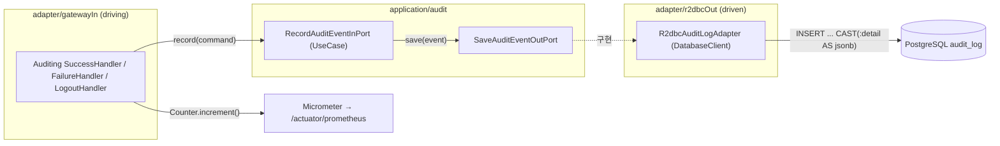

# 12. 관측성 + 감사로그 — R2DBC 를 처음 쓰다

> 한 줄 요약 — "누가·언제 로그인/로그아웃했나"를 R2DBC 로 audit_log 에 남기고 Micrometer 로 지표화한다. R2DBC 엔 JPA 의 영속성 컨텍스트가 없어 저장은 **명시적 INSERT**, 그리고 **논블로킹**이어야 한다.
> 관련: Phase 4 · 코드 `adapter/r2dbcOut/R2dbcAuditLogAdapter.kt` · `adapter/gatewayIn/AuditingAuthenticationHandlers.kt` · `application/audit/**`

## 1. 왜 필요했나

인증 게이트웨이는 **누가 들어오고 나갔는지**를 남겨야 한다(감사). 동시에 로그인 성공/실패·회로
상태를 **지표로 관측**해야 운영이 가능하다. 이 Phase 는 그 둘을 붙이면서 **헥사고날 포트가 처음
R2DBC 어댑터로 구현**되는 지점이다(`domain/audit` → `application/audit`(InPort/OutPort/UseCase)
→ `adapter/r2dbcOut`).

## 2. 익숙한 방식과의 대조

| | JPA / Servlet 방식 | 여기서의 방식 | 왜 다른가 |
|---|---|---|---|
| 저장 | `@Entity` + `save()`, 더티체킹·flush 자동 | `DatabaseClient` **명시 INSERT** | R2DBC 엔 영속성 컨텍스트·더티체킹이 **없다**. 저장은 직접 쓴다 |
| 블로킹 | JDBC 블로킹이라도 스레드풀이 흡수 | `awaitSingle()` **논블로킹** | 이벤트 루프에서 블로킹하면 전체가 멈춘다(§4) |
| 로그인 이벤트 | `AuthenticationEventPublisher` 자동 발행 | **커스텀 success/failure 핸들러** | WebFlux 는 인증 이벤트를 기본 발행하지 않는다 |

## 3. 동작 원리



- **인증 핸들러(driving)** 가 감사 Command 를 만들어 InPort 로 넘기고, 같은 자리에서 Micrometer
  카운터를 올린 뒤 기본 리다이렉트로 위임한다.
- **UseCase** 는 Command→도메인 이벤트 변환만 하고 OutPort 로 저장을 위임한다(기술 무지).
- **r2dbcOut 어댑터** 가 `DatabaseClient` 로 INSERT 를 실행한다. `detail`(Map)은 JSON 문자열로
  직렬화 후 `CAST(:detail AS jsonb)` 로 넣어 드라이버 고유 타입 의존을 피한다(어댑터가 저장형식 봉인).

## 4. 직접 확인한 것

> 브라우저 BFF 로그인(alice) → 로그아웃. 실제 PostgreSQL(audit_log) 과 /actuator/prometheus 관찰.

**감사 행 — R2DBC INSERT 가 실제로 기록**:

```
 id |  event_type   |               subject                | client_id |   detail
----+---------------+--------------------------------------+-----------+---------------------------
  1 | LOGIN_SUCCESS | 115f2213-...-b124f7817b7d            | keycloak  | {"preferredUsername":"alice"}
  2 | LOGOUT        | 115f2213-...-b124f7817b7d            |           |
```

`detail` 이 jsonb 로 정상 저장됐다(Map → JSON 문자열 → `CAST(... AS jsonb)`).

**메트릭 — Micrometer → Prometheus**:

```
unigate_auth_login_total{application="unigate",result="success"} 1.0
resilience4j_circuitbreaker_state{name="downstream",state="closed"} 1.0   ← Resilience4j 가 자동 노출
spring_cloud_gateway_requests_seconds_count{routeId="downstream-demo",status="OK"} 1
```

로그인 카운터는 우리가 심었고, CB 상태·라우트 지표는 Resilience4j/SCG 가 **자동 바인딩**한다(코드 불필요).
자동 테스트 21개 GREEN(감사 UseCase 단위 + 오프라인 부팅 포함).

## 5. 함정 / 실패 모드

- **R2DBC 엔 영속성 컨텍스트가 없다.** JPA 습관(`save()` 후 알아서 flush)으로 접근하면 안 된다 —
  저장은 명시적 INSERT 로 직접 쓰고, 결과(`rowsUpdated()`)를 `awaitSingle()` 로 논블로킹 대기한다.
- **JSONB 바인딩.** 드라이버 고유 `Json` 타입에 컴파일 의존하면 어댑터가 드라이버에 묶인다. 문자열
  직렬화 + SQL `CAST(:detail AS jsonb)` 로 우회했다.
- **WebFlux 는 인증 이벤트를 기본 발행하지 않는다.** Servlet 감각으로 `@EventListener` 를 기다리면
  아무 일도 안 일어난다 → oauth2Login 의 success/failure 핸들러를 직접 갈아끼워야 한다.
- **감사가 로그인을 막지 않게.** 감사 저장 실패가 로그인 흐름을 깨면 안 되므로 호출부(핸들러)에서
  `runCatching` 으로 감싸 실패를 로그로만 남긴다. "삼킬지 말지"는 UseCase 가 아니라 경계의 정책이다.
- **오프라인 테스트가 R2DBC/Redis 빈을 요구.** RedisRateLimiter·R2dbcAuditLogAdapter 때문에 그
  autoconfig 를 제외하면 부팅이 깨진다 → 살리되 **health ping 만 끄고**(redis/r2dbc), r2dbc 는 dummy
  URL + `pool.initial-size=0` 으로 부팅 시 접속을 없앴다(감사 저장은 로그인 시점에만 일어난다).
- **LOGIN_FAILURE 는 배선했지만 수동 트리거가 어렵다.** 비밀번호 오류는 Keycloak 단에서 끝나
  게이트웨이 failure 핸들러까지 오지 않는다(code 교환 실패라야 온다). UseCase 단위 테스트로 대체 검증.

## 6. 남은 의문

- **trace_id 채우기** — 컬럼은 있으나 이번 범위(트레이싱 제외)에선 null 이다. 분산 트레이싱
  (micrometer-tracing) 을 붙이면 traceId 를 감사·로그에 상관지을 수 있다 → Phase 4 후속.
- **감사 저장 신뢰성** — 지금은 로그인 흐름 안에서 await 한다(실패 시 유실, 로그인은 진행). 유실을
  줄이려면 아웃박스·재시도가 필요한지, 아니면 이 정도 신뢰성으로 충분한지는 요건에 달렸다.
- **보존·조회 정책** — audit_log 의 파티셔닝·보존기간·조회 API 는 감사 요건이 구체화될 때.
