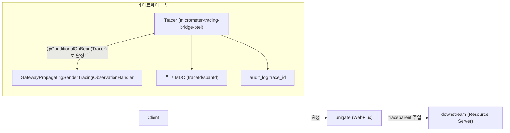

# 13. 분산 트레이싱 — traceparent 전파와 Reactor 컨텍스트

> 한 줄 요약 — WebFlux 는 요청당 스레드가 없어 traceId 가 ThreadLocal 로 따라다니지 않는다. `spring.reactor.context-propagation=auto` 가 그걸 메우지만, **효력은 Reactor 연산자 경계까지**다. `mono { }` 코루틴 안에서는 복원되지 않는다.
> 관련: Phase 4 · 코드 `adapter/gatewayIn/TraceIdResolver.kt` · `adapter/gatewayIn/AuditingAuthenticationHandlers.kt` · `gateway/src/main/resources/application.yml`

## 1. 왜 필요했나

Phase 4 에서 감사로그(`audit_log`)를 만들 때 `trace_id` 컬럼을 미리 뚫어놨지만 **항상 비어 있었다.**
감사 한 줄과 애플리케이션 로그를 잇는 열쇠가 그 컬럼인데 값이 없으니 쓸모가 없었다.

게이트웨이는 요청이 **자기 안에서 끝나지 않는다.** 브라우저 → 게이트웨이 → 다운스트림으로 이어지므로
"이 요청이 느렸다/실패했다"를 조사하려면 세 구간을 하나로 묶는 식별자가 필요하다. 그게 traceId다.

## 2. 익숙한 방식과의 대조

| | Servlet + MDC 방식 | 여기서의 방식 | 왜 다른가 |
|---|---|---|---|
| traceId 보관 | `ThreadLocal`(MDC). 요청당 스레드라 요청 내내 유지 | Reactor Context ↔ ThreadLocal **복원** | 연산자마다 스레드가 바뀐다. ThreadLocal 은 그냥은 안 따라온다 |
| 다운스트림 전파 | 인터셉터에서 헤더 직접 주입 | **SCG 가 자동 주입** | `Tracer` 빈만 있으면 게이트웨이가 알아서 붙인다 |
| 로그 상관관계 | `%X{traceId}` 를 직접 패턴에 추가 | Boot 가 자동 추가 | 트레이싱 의존성이 클래스패스에 있으면 기본 패턴에 들어간다 |
| 실패 증상 | 대개 컴파일/런타임 에러 | **조용히 null** | 예외가 없어 DB 를 열어보기 전까지 모른다 |

## 3. 동작 원리



핵심은 **의존성 한 줄이 연쇄를 일으킨다**는 것이다.

1. `micrometer-tracing-bridge-otel` 을 넣으면 `Tracer` 빈이 생긴다.
2. SCG 의 `GatewayMetricsAutoConfiguration$ObservabilityConfiguration$GatewayTracingConfiguration` 이
   `@ConditionalOnBean(Tracer)` 라서 그때 깨어나 `GatewayPropagatingSenderTracingObservationHandler` 를 등록한다.
3. 그 핸들러가 다운스트림으로 나가는 프록시 요청에 `traceparent` 를 붙인다.

즉 **전파 필터를 직접 짤 필요가 없다.** 이건 추측이 아니라 jar 를 열어 확인했다(§4).

### W3C traceparent 형식

```
00-2d582e2398fe81b58285a582bab832fc-c8c76fc4701c7cf1-01
│  │                                │                │
│  │                                │                └ flags (01 = sampled)
│  │                                └ parent span id (16 hex)
│  └ trace id (32 hex) ─ 이게 구간을 묶는 열쇠
└ version
```

## 4. 직접 확인한 것

### (1) SCG 가 전파를 담당한다는 근거 — jar 의 어노테이션 직접 확인

```bash
javap -v -p 'org/springframework/cloud/gateway/config/GatewayMetricsAutoConfiguration$ObservabilityConfiguration.class'
```

```
org.springframework.boot.autoconfigure.condition.ConditionalOnBean(
  value=[class Lio/micrometer/observation/ObservationRegistry;]
)
org.springframework.boot.autoconfigure.condition.ConditionalOnProperty(
  name=["spring.cloud.gateway.server.webflux.observability.enabled"]
  matchIfMissing=true
)
```

`matchIfMissing=true` → **설정하지 않아도 켜져 있다.** 그리고 중첩 설정:

```
GatewayTracingConfiguration:
  ConditionalOnClass(value=[class Lio/micrometer/tracing/Tracer;])
  ConditionalOnBean(value=[class Lio/micrometer/tracing/Tracer;])
  → gatewayPropagatingSenderTracingObservationHandler(Tracer, Propagator, TracingProperties)
```

### (2) 다운스트림이 실제로 traceparent 를 받는다

alice 로 BFF 로그인 후 `GET /api/echo` (게이트웨이 → 샘플 다운스트림 프록시). 다운스트림이 되돌려준
수신 헤더:

```
traceparent: 00-2d582e2398fe81b58285a582bab832fc-c8c76fc4701c7cf1-01
```

### (3) 로그 상관관계 — 스레드가 바뀌어도 traceId 는 유지된다

같은 요청의 게이트웨이 로그(`RequestLoggingFilter` 의 pre/post):

```
15:02:20.870 INFO [lettuce-nioEventLoop-5-2] [2d582e2398fe81b58285a582bab832fc-5739defed7ce5196]
    RequestLoggingFilter : [pre ] GET /api/echo thread=lettuce-nioEventLoop-5-2
15:02:20.917 INFO [reactor-http-nio-8]       [2d582e2398fe81b58285a582bab832fc-5739defed7ce5196]
    RequestLoggingFilter : [post] GET /api/echo status=200 OK signal=onComplete elapsedMs=47 thread=reactor-http-nio-8
```

여기서 세 가지가 한꺼번에 보인다.

- **pre 와 post 의 스레드가 다르다** (`lettuce-nioEventLoop-5-2` → `reactor-http-nio-8`).
  요청당 스레드가 없다는 §02 문서의 주장이 그대로 재현된다.
- 그런데 **traceId 는 같다** (`2d582e...`). `context-propagation=auto` 가 스레드 경계에서 복원한 결과다.
- 로그의 traceId 가 다운스트림이 받은 traceparent 의 traceId 와 **동일**하다 → 두 서비스의 기록이 이어진다.

spanId 는 다르다(로그 `5739defed7ce5196` vs traceparent `c8c76fc4701c7cf1`). 게이트웨이의 **서버 span** 과
다운스트림을 부르는 **클라이언트 span** 이 별개이기 때문이며, 정상 동작이다.

### (4) 미인증 401 응답에도 traceId 가 실린다

```bash
curl -s -i -H "Sec-Fetch-Mode: cors" http://localhost:8080/api/echo
```

```
HTTP/1.1 401 Unauthorized
Content-Type: application/problem+json

{"type":"about:blank","title":"Authentication Required","status":401,
 "detail":"인증이 필요합니다. loginUrl 로 이동해 로그인하세요.","instance":"/api/echo",
 "reasonCode":"authentication_required","loginUrl":"/oauth2/authorization/keycloak",
 "traceId":"c0d5cacfbeaa378245fb5c65f34defc0"}
```

사용자가 이 값을 그대로 알려주면 로그를 그 요청 하나로 좁힐 수 있다.

### (5) 감사로그의 trace_id — 실패와 수정이 같은 표에 남았다

```
 id |  event_type   |             trace_id
----+---------------+----------------------------------
  4 | LOGIN_SUCCESS | 82ede57fd8ca212ea7d172f15b1dafc8   ← 수정 후
  3 | LOGIN_SUCCESS |                                    ← 수정 전 (비어 있음)
  2 | LOGOUT        |
```

id 3 과 4 는 **같은 코드 경로**이고 다른 것은 traceId 를 읽는 위치뿐이다. 원인은 §5.

## 5. 함정 / 실패 모드

### 함정 1 (직접 겪음): `mono { }` 안에서 읽은 traceId 는 항상 null

**증상** — 컴파일 정상, 예외 없음, 로그인도 정상. 그런데 `audit_log.trace_id` 가 전부 비어 있다.
**DB 를 열어보기 전까지 아무 신호가 없다.**

```kotlin
// ❌ 잘못된 코드 — 항상 null
override fun onAuthenticationSuccess(...): Mono<Void> =
  mono { audit(authentication) }        // 이 안에서 tracer.currentSpan() → null
    .then(delegate.onAuthenticationSuccess(...))
```

**원인** — `spring.reactor.context-propagation=auto` 는 **Reactor 연산자 경계**에서 ThreadLocal 을
복원한다. `mono { }` 의 본문은 Reactor 연산자가 아니라 **코루틴 실행 컨텍스트**다. Reactor Context 는
코루틴으로 넘어가지만 `Tracer` 가 들여다보는 **ThreadLocal 은 복원되지 않는다.**

**해결** — Reactor 연산자(`Mono.defer`) 안에서 먼저 읽어 **값으로** 코루틴에 넘긴다.
조립 시점이 아니라 구독 시점이어야 하므로 `defer` 가 필요하다.

```kotlin
// ✅ 고친 코드
override fun onAuthenticationSuccess(...): Mono<Void> =
  Mono.defer {
    val traceId = traceIdResolver.currentTraceId()   // 여기서는 복원돼 있다
    mono { audit(authentication, traceId) }          // 값으로 전달
  }.then(delegate.onAuthenticationSuccess(...))
```

> 교훈: **"Reactor 컨텍스트가 전파된다"와 "ThreadLocal 이 복원된다"는 다른 말이다.** 코루틴 경계를
> 넘길 때는 컨텍스트에 기대지 말고 **값으로 넘기는 편**이 안전하다.

### 함정 2: 샘플링은 "저장 여부"가 아니라 "span 을 만들지 여부"다

`management.tracing.sampling.probability` 기본값은 **0.1(10%)** 이다. 샘플링에서 빠진 요청은 traceId
자체가 없어 **로그에도 남지 않는다.** 감사·보안이 목적인 게이트웨이에서 기본값을 그대로 두면
"장애가 난 그 요청"이 하필 90% 에 속해 사후 추적이 불가능해질 수 있다. 그래서 환경변수로 뽑아뒀다.

반대로 운영에서 1.0 은 수집·저장 비용이 크다. 백엔드가 정해지는 Phase 6 에서 조정한다.

### 함정 3: traceId 가 null 인 것은 버그가 아닐 수 있다

샘플링 제외·트레이싱 비활성·요청 스코프 밖에서는 정상적으로 null 이다. 호출부는 반드시 null 을
견뎌야 한다(`ProblemDetail` 에서는 아예 필드를 넣지 않고, 감사로그는 null 로 저장한다).

### 함정 4: exporter 없이도 트레이싱은 "동작"한다

`micrometer-tracing-bridge-otel` 만 넣고 exporter 를 넣지 않았다. span 생성·전파·로그 상관관계는
전부 되지만 **어디에도 보내지 않는다.** 이 상태를 "트레이싱이 안 된다"고 오해하기 쉽다.
지금 단계에서 필요한 것은 상관관계뿐이라 의도적으로 이렇게 뒀다.

## 6. 남은 의문

- **exporter 를 붙였을 때도 잘 될까.** [spring-cloud-gateway#3904](https://github.com/spring-cloud/spring-cloud-gateway/issues/3904)
  가 **우리와 같은 스택**(Boot 3.5.x + Spring Cloud 2025.0.0 + `micrometer-tracing-bridge-otel`)에서
  OTLP export 가 안 된다고 보고했고 아직 open 이다. 보고자도 "traceId 전파 자체는 정상"이라 적었고
  우리가 확인한 것도 거기까지다. **Phase 6 에서 collector 를 붙일 때 반드시 재검증해야 한다.**
- `Mono.defer` 대신 `deferContextual` 로 Reactor Context 에서 직접 꺼내는 방법이 더 견고한가?
  지금은 ThreadLocal 복원에 의존하고 있는데, 복원이 보장되지 않는 다른 지점이 또 있는지 모른다.
- 로그아웃(LOGOUT) 경로의 traceId 는 실측하지 못했다. CSRF 토큰이 필요해 curl 로 로그아웃을
  완주하지 못했다. 코드 경로는 로그인과 동일하게 고쳤지만 **확인은 안 된 상태**다.
- 다운스트림(Servlet + Tomcat) 쪽에서 받은 traceparent 를 이어받아 자기 span 을 만들고 있는가?
  게이트웨이가 보낸 것만 확인했고, 다운스트림의 수신 처리는 보지 않았다.
