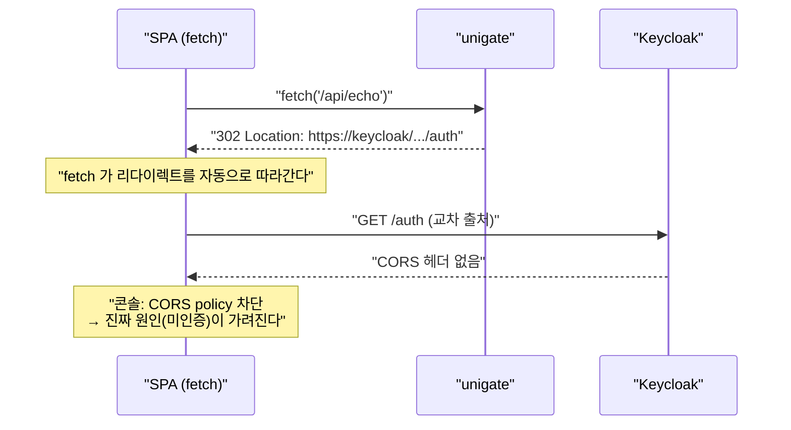

# 14. RFC 9457 Problem Detail 과 XHR 인증 경계

> 한 줄 요약 — 미인증 응답을 **무조건 302** 로 주면 SPA 의 `fetch()` 에서는 원인 불명의 CORS 에러로 둔갑한다. 요청이 브라우저 내비게이션인지 XHR 인지 갈라, 후자에는 401 + `problem+json` 에 로그인 URL 을 실어 보낸다.
> 관련: Phase 4 · 코드 `adapter/gatewayIn/ProblemDetailAuthenticationHandlers.kt` · `config/SecurityConfig.kt`

## 1. 왜 필요했나

두 가지가 겹쳐 있었다.

1. **에러 응답 형식이 제각각이었다.** CB fallback 은 `problem+json`(503) 인데, 다운스트림 장애(502/504)는
   Spring 기본 에러 본문이고, 인증 실패는 302 리다이렉트, CSRF 거부는 `text/plain` 이었다.
   클라이언트가 에러를 일관되게 다룰 수 없다.
2. **BFF + SPA 조합의 알려진 함정이 코드에 TODO 로만 남아 있었다**(`CLAUDE.md` §6.1).
   샘플 FE 를 붙이기 전에 이걸 풀어야 한다.

## 2. 익숙한 방식과의 대조

| | Servlet MVC 방식 | 여기서의 방식 | 왜 다른가 |
|---|---|---|---|
| 에러 본문 | `@RestControllerAdvice` + `@ExceptionHandler` | `ServerAuthenticationEntryPoint` / `ServerAccessDeniedHandler` | 인증 실패는 컨트롤러에 **도달하기 전** 필터에서 끝난다. Advice 가 못 잡는다 |
| Problem Detail | `spring.mvc.problemdetails.enabled` | `spring.webflux.problemdetails.enabled` | 스택별로 프로퍼티가 다르다. 둘 다 기본 **false**(opt-in) |
| 미인증 응답 | 대개 302 하나로 충분 | 요청 성격에 따라 **302 / 401 분기** | SPA 가 `fetch()` 로 부르면 302 가 CORS 에러로 둔갑한다 |

## 3. 동작 원리

### 왜 302 가 SPA 에서 재앙이 되는가



두 가지가 동시에 잘못된다.

- **원인이 가려진다.** 개발자가 보는 것은 CORS 에러뿐이라 인증 문제인 줄 모른다.
- **쓸모도 없다.** 로그인 화면은 주소창에 떠야 하는데 XHR 응답으로 HTML 을 받아봐야 소용없다.

### 분기 규칙

| 요청 | 응답 | 이유 |
|---|---|---|
| 브라우저 top-level 이동 | 302 → Keycloak | 주소창이 이동해야 로그인 화면이 보인다 |
| XHR / fetch | 401 + `problem+json` (`loginUrl` 동봉) | FE 가 `window.location` 으로 **직접** 이동시킨다 |

리다이렉트 판단을 `fetch` 가 아니라 **애플리케이션 코드**가 하게 만드는 것이 요점이다.

### 무엇으로 판정하는가

1순위는 **`Sec-Fetch-Mode`** 다. 모던 브라우저가 자동으로 붙이고 **스크립트가 위조할 수 없는**
(forbidden header) 값이라 `X-Requested-With` 같은 관례적 헤더보다 신뢰도가 높다.

- 주소창 이동·링크 클릭 → `navigate`
- `fetch()` / XHR → `cors` · `same-origin` · `no-cors`

헤더가 없으면(구형 브라우저·curl·서버간 호출) `Accept` 로 폴백하되, **와일드카드 전체 허용은
내비게이션으로 치지 않는다.** `fetch()` 의 기본 Accept 가 정확히 그 값이기 때문이다.

즉 **애매하면 401** 을 준다. 잘못된 302 는 원인을 감추지만, 잘못된 401 은 그 자체로 원인을 말해준다.

## 4. 직접 확인한 것

### (1) XHR 미인증 → 401 problem+json

```bash
curl -s -i -H "Sec-Fetch-Mode: cors" http://localhost:8080/api/echo
```

```
HTTP/1.1 401 Unauthorized
Content-Type: application/problem+json
content-length: 301

{"type":"about:blank","title":"Authentication Required","status":401,
 "detail":"인증이 필요합니다. loginUrl 로 이동해 로그인하세요.","instance":"/api/echo",
 "reasonCode":"authentication_required","loginUrl":"/oauth2/authorization/keycloak",
 "traceId":"c0d5cacfbeaa378245fb5c65f34defc0"}
```

### (2) 브라우저 top-level 이동 → 종전대로 302 (회귀 없음)

```bash
curl -s -i -H "Sec-Fetch-Mode: navigate" -H "Accept: text/html" http://localhost:8080/api/echo
```

```
HTTP/1.1 302 Found
Location: /oauth2/authorization/keycloak
```

### (3) 자동 테스트 — 17개 전부 통과

`ProblemDetailAuthenticationHandlersTest`(판정 로직 8케이스) +
`GatewaySecurityIntegrationTest`(경계 9케이스):

```
GatewaySecurityIntegrationTest > XHR 미인증 요청은 302 가 아니라 401 Problem Detail 과 loginUrl 을 받는다() PASSED
GatewaySecurityIntegrationTest > Accept 가 application_json 인 미인증 요청도 401 Problem Detail 을 받는다() PASSED
GatewaySecurityIntegrationTest > 브라우저 top-level 이동은 종전대로 302 로 Keycloak 에 보낸다() PASSED
GatewaySecurityIntegrationTest > CSRF 토큰 없는 POST logout 은 403 Problem Detail 로 거부된다() PASSED
GatewaySecurityIntegrationTest > CB fallback 경로는 공개이며 503 Problem Detail 을 반환한다() PASSED
```

### (4) 기본값 확인 — 추측하지 않고 메타데이터를 읽었다

```bash
unzip -p spring-boot-autoconfigure-3.5.4.jar META-INF/spring-configuration-metadata.json | ...
```

```
spring.webflux.problemdetails.enabled | type=Boolean | default=False | Whether RFC 9457 Problem Details support should be enabled.
spring.reactor.context-propagation    | type=ContextPropagationMode | default=limited
```

여기서 두 가지를 알게 됐다. Problem Detail 은 **켜야 쓸 수 있고**(기본 false), Spring 은 이미
**RFC 9457** 이라고 부른다 — RFC 7807 은 9457 로 개정되며 obsolete 됐다.

## 5. 함정 / 실패 모드

### 함정 1 (직접 겪음): CSRF 거부는 `exceptionHandling` 을 타지 않는다

`exceptionHandling { accessDeniedHandler(...) }` 를 설정했는데도 CSRF 403 만 형식이 달랐다.

**증상** — 통합 테스트가 이렇게 실패했다:

```
java.lang.AssertionError: Response header 'Content-Type'=[text/plain] is not compatible with [application/problem+json]

< 403 FORBIDDEN
< Content-Type: [text/plain]
Access Denied
```

**원인** — `CsrfWebFilter` 가 자체 `accessDeniedHandler`(기본 `HttpStatusServerAccessDeniedHandler`)를
**직접** 호출한다. `exceptionHandling` 의 핸들러는 인가(authorization) 단계 예외만 처리한다.

**해결** — 같은 핸들러를 `csrf` 쪽에도 명시적으로 꽂는다.

```kotlin
.csrf { csrf -> csrf.accessDeniedHandler(accessDeniedHandler) }
```

> 교훈: Spring Security 의 "전역 예외 처리"는 생각보다 전역이 아니다. 필터가 자기 핸들러를 들고
> 있으면 그쪽이 이긴다.

### 함정 2: 403 에 리다이렉트를 주면 무한 루프가 된다

401(미인증)은 로그인으로 보내면 해결되지만, 403(권한 없음)은 **로그인해도 그대로 403** 이다.
여기에 302 를 주면 로그인 → 403 → 로그인 → … 이 반복된다. 그래서 `AccessDeniedHandler` 는
절대 리다이렉트하지 않는다.

### 함정 3: 파일 상단 KDoc 이 ktlint 에 걸린다

```
ProblemDetailAuthenticationHandlers.kt:51:1 a KDoc may not be preceded by a KDoc (cannot be auto-corrected)
```

선언에 붙지 않은 채 떠 있는 파일 설명용 `/** */` 뒤에 또 KDoc·EOL 주석이 오면 걸린다.
파일 전체 설명은 KDoc 이 아니라 **일반 블록 주석 `/* */`** 으로 쓰면 된다(의미상으로도 맞다).

### 함정 4: 주석 안의 와일드카드 표기가 블록 주석을 끝내버린다

MIME 와일드카드(`별표-슬래시-별표`)를 KDoc 안에 그대로 쓰면 그 중간의 `*/` 에서 **주석이 조기 종료**돼
컴파일 에러가 난다. 백틱으로 감싸도 컴파일러는 모른다. 문장으로 풀어 쓰는 편이 안전하다.

### 함정 5: 에러 본문에 내부 정보를 담지 않는다

`AccessDeniedException.message` 를 그대로 넣으면 내부 정책·필터 구현이 드러날 수 있어 넣지 않았다.
`DownstreamErrorMappingFilter` 의 `reason` 도 같은 이유로 서버 로그에만 남는다(`CLAUDE.md` §8).

## 6. 남은 의문

- **429(rate limit)만 아직 problem+json 이 아니다.** SCG 의 `RequestRateLimiter` 는 상태코드만
  세팅하고 본문 훅이 없어, 형식을 맞추려면 별도 필터가 필요하다. 이번 범위에서 제외했다.
- FE 가 401 을 받아 `window.location` 으로 이동하는 흐름은 **아직 실제 SPA 로 검증하지 않았다.**
  샘플 FE(`samples/frontend-demo`)를 붙이는 시점에 확인해야 한다.
- `Sec-Fetch-Mode` 를 보내지 않는 클라이언트가 실제로 얼마나 되는지 모른다. 폴백(Accept 기반)이
  충분한지는 실사용 로그를 봐야 안다.
- `problem.type` 을 `about:blank` 로 두고 있다. 에러 종류별 문서 URL 을 부여하는 게 RFC 의 의도인데,
  문서 사이트(Phase 7)가 생기면 그때 연결하는 것이 맞는지.
