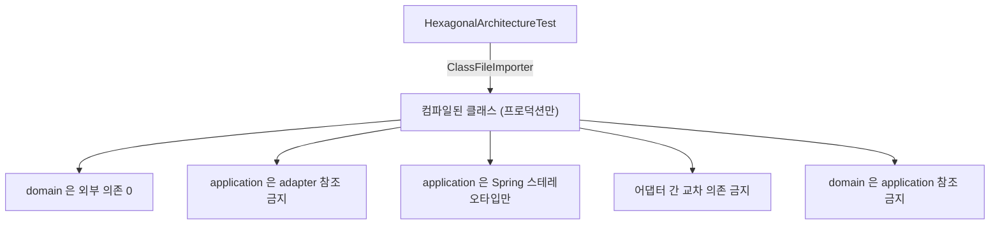

# 15. ArchUnit — 아키텍처 규칙을 문서에서 테스트로 옮기기

> 한 줄 요약 — `adapter → application → domain` 단방향은 Phase 4 까지 **문서로만** 지켜졌다. ArchUnit 으로 규칙을 코드로 옮기면 리뷰어의 기억이 아니라 빌드가 막는다. 단, **통과만 하는 가드는 믿을 수 없어** 일부러 위반을 넣어 검증해야 한다.
> 관련: Phase 5 · 코드 `gateway/src/test/.../architecture/HexagonalArchitectureTest.kt` · `AuditSinkSwappabilityTest.kt`

## 1. 왜 필요했나

`CLAUDE.md` §5 에 "의존성 방향은 `adapter → application → domain` 단방향만 허용한다"고 적혀 있었지만
강제 수단이 없었다. Phase 4 까지 오면서 어댑터가 4종으로 늘었고, 이 시점이 규칙을 자동화하기에
**가장 싼 때**다. 아키텍처 위반은 한 번 섞이면 되돌리는 비용이 급격히 커지기 때문이다.

착수 전 수동 실사에서는 위반이 없었다. 그래서 이 작업의 목적은 "위반을 찾는 것"이 아니라
**"지금의 깨끗한 상태를 고정하는 것"** 이다.

## 2. 익숙한 방식과의 대조

| | 지금까지 | 여기서의 방식 | 왜 다른가 |
|---|---|---|---|
| 규칙 표현 | 문서(`CLAUDE.md`)와 코드 리뷰 | **테스트 코드** | 문서는 읽지 않으면 그만이고, 리뷰는 사람이 놓친다 |
| 위반 발견 시점 | 리뷰 중 운이 좋으면 / 나중에 | **빌드 실패** | `./gradlew build` 가 막는다 |
| 위반 근거 | "이건 좀 아닌 것 같은데요" | 규칙에 `because(...)` 로 이유가 박혀 있다 | 실패 메시지가 곧 설명이다 |

## 3. 동작 원리



ArchUnit 은 **소스가 아니라 컴파일된 바이트코드**를 읽는다. 이 점이 뒤에 나올 함정 1 의 원인이 된다.

### 왜 `@ArchTest` 가 아니라 평범한 `@Test` 인가

ArchUnit 의 JUnit5 확장(`@AnalyzeClasses` + `@ArchTest`)은 **static 필드**에 규칙을 두는 것을 전제한다.
Kotlin 의 `val` 은 private 필드 + getter 로 컴파일돼 그대로는 잡히지 않고, `companion object` +
`@JvmField` 같은 우회가 필요해 의도가 흐려진다.

규칙을 `check(classes)` 로 직접 실행하면 **어떤 클래스 집합에 무엇을 검사하는지가 코드에 그대로
드러난다.** Kotlin 에서는 이쪽이 더 명확해서 그렇게 했다.

## 4. 직접 확인한 것

### (1) 첫 실행 — 4/5 통과, 1개가 예상 밖으로 실패

```
HexagonalArchitectureTest > domain 은 순수 Kotlin 이어야 한다 — Spring 도 다른 레이어도 모른다() FAILED
    Method <me.ramos.unigate.domain.auth.model.AuthenticatedPrincipal.getSubject()>
        is annotated with <org.jetbrains.annotations.NotNull> in (AuthenticatedPrincipal.kt:0)
    Method <me.ramos.unigate.domain.auth.model.AuthenticatedPrincipal.getEmail()>
        is annotated with <org.jetbrains.annotations.Nullable> in (AuthenticatedPrincipal.kt:0)
    ... (총 18건)
```

**우리가 쓴 의존이 아니다.** 소스에는 `@NotNull` 이 한 글자도 없다 — 원인은 함정 1 참조.

### (2) 허용 목록 조정 후 — 5/5 통과

```
HexagonalArchitectureTest > 어댑터끼리 서로 의존하지 않는다() PASSED
HexagonalArchitectureTest > domain 은 순수 Kotlin 이어야 한다 — Spring 도 다른 레이어도 모른다() PASSED
HexagonalArchitectureTest > application 은 adapter 를 알아서는 안 된다 — 의존은 포트를 통해 역전된다() PASSED
HexagonalArchitectureTest > domain 은 application 을 알아서는 안 된다() PASSED
HexagonalArchitectureTest > application 은 Spring 스테레오타입 외의 프레임워크를 쓰지 않는다() PASSED
BUILD SUCCESSFUL
```

### (3) **가드가 진짜 막는지 검증** — 일부러 위반을 넣어봤다

전부 통과하는 규칙은 그 자체로는 아무것도 증명하지 않는다. 대상 클래스를 0개 잡고 있어도 통과하기
때문이다. 그래서 `domain` 에 Spring 어노테이션을 임시로 붙였다.

```kotlin
@org.springframework.stereotype.Component   // ← 일부러 주입한 위반
data class AuditEvent(
```

결과:

```
HexagonalArchitectureTest > domain 은 순수 Kotlin 이어야 한다 — Spring 도 다른 레이어도 모른다() FAILED
    java.lang.AssertionError: Architecture Violation [Priority: MEDIUM] -
    Rule 'no classes that reside in a package 'me.ramos.unigate.domain..' should depend on classes that
    reside outside of packages ['me.ramos.unigate.domain..', 'java..', 'javax..', 'kotlin..',
    'org.jetbrains.annotations..'], because domain 은 순수 Kotlin 이어야 한다 (CLAUDE.md §5).
    Spring 어노테이션이나 DB/HTTP 타입이 들어오면 도메인이 인프라에 묶인다.' was violated (1 times):
    Class <me.ramos.unigate.domain.audit.model.AuditEvent>
        is annotated with <org.springframework.stereotype.Component> in (AuditEvent.kt:0)
```

정확히 그 클래스를 짚었고, `because(...)` 에 쓴 이유가 실패 메시지에 그대로 나온다. 확인 후 원복했다.

### (4) 교체가능성 실증 — 설정 한 줄로 구현이 바뀐다

`SaveAuditEventOutPort` 에 두 번째 구현(`LoggingAuditLogAdapter`)을 붙이고 `@ConditionalOnProperty` 로
갈아끼웠다.

```
AuditSinkSwappabilityTest > unigate.audit.sink 를 설정하지 않으면 > R2DBC 어댑터가 주입된다() PASSED
AuditSinkSwappabilityTest > unigate.audit.sink=log 로 바꾸면 > 로깅 어댑터로 교체된다() PASSED
AuditSinkSwappabilityTest > unigate.audit.sink=log 로 바꾸면 > UseCase 는 구현이 바뀌어도 그대로 조립된다() PASSED
```

**`application`·`domain` 코드는 한 줄도 바뀌지 않았다.** 그게 이 테스트가 증명하려던 전부다.

## 5. 함정 / 실패 모드

### 함정 1 (직접 겪음): Kotlin 컴파일러가 넣은 어노테이션이 위반으로 잡힌다

**증상** — 소스에 없는 `org.jetbrains.annotations.NotNull` / `Nullable` 이 domain 위반으로 18건 잡혔다.

**원인** — Kotlin 컴파일러가 Java 상호운용을 위해 파라미터·반환값에 이 어노테이션을 **자동 삽입**한다.
ArchUnit 은 소스가 아니라 **바이트코드**를 읽으므로 이걸 외부 의존으로 본다.

**해결** — 허용 목록에 `org.jetbrains.annotations..` 를 넣는다. 런타임 동작이 없는 순수 어노테이션이라
"도메인이 인프라에 묶인다"는 위험은 생기지 않는다.

> 교훈: **JVM 아키텍처 도구를 Kotlin 에 쓸 때는 "내가 쓴 것"과 "컴파일러가 넣은 것"을 구분해야 한다.**

### 함정 2: 통과하는 가드는 아무것도 증명하지 않는다

패키지 이름에 오타가 있으면 대상 클래스가 0개가 되고, 규칙은 **조용히 통과**한다. 그러면 아무것도
막지 않는 가드를 "우리 아키텍처는 안전하다"는 증거로 착각하게 된다.

그래서 §4(3) 처럼 **일부러 위반을 넣어 실패를 확인**했다. 새 규칙을 추가할 때마다 해야 하는 절차다.
(ArchUnit 1.x 는 대상이 비면 실패시키는 기본값이 있어 1차 방어는 되지만, 그것만 믿을 일은 아니다.)

### 함정 3: ktlint 가 한글 `@Nested` 클래스명을 거부한다

```
AuditSinkSwappabilityTest.kt:40:15 Class or object name should start with an uppercase letter and use camel case
```

테스트 **함수** 이름은 백틱으로 한글을 쓸 수 있지만 **클래스** 이름은 안 된다.
클래스명은 영문 PascalCase 로 두고 `@DisplayName` 으로 한글 설명을 붙이면 둘 다 만족한다.

### 함정 4: 규칙을 너무 좁게 잡으면 진짜 위험을 놓친다

`application` 규칙을 "`@Service` 만 허용" 이 아니라 "Spring 전체 금지" 로 잡으면 지금 코드가 깨지고,
반대로 "Spring 전부 허용" 으로 두면 `ServerWebExchange` 가 UseCase 파라미터로 들어와도 통과한다.
그래서 **스테레오타입만 허용하고 web/data/security/http/micrometer/reactor 는 금지**로 나눴다.
경계를 어디에 그을지가 규칙 작성의 본질이다.

## 6. 남은 의문

- **`config` 패키지는 규칙 밖에 있다.** `me.ramos.unigate.config` 는 domain/application/adapter 어디에도
  속하지 않아 아무거나 참조할 수 있다. `SecurityConfig` 가 어댑터 빈을 주입받아야 하니 의도적이긴 한데,
  이대로 두면 규칙을 우회하는 통로가 될 수 있다. 별도 규칙이 필요한가?
- **미사용 포트는 못 잡는다.** `TokenVerifierPort` 는 구현만 있고 호출자가 없는데 ArchUnit 규칙은
  전부 통과한다. "죽은 추상화"를 아키텍처 테스트로 검출할 수 있는지, 그게 적절한지 모르겠다.
- 포트 **명명 규칙**(`...InPort` / `...OutPort`)이나 UseCase 가 반드시 `suspend` 여야 한다는 규칙도
  ArchUnit 으로 강제할 수 있다. 지금은 넣지 않았다 — 규칙이 많아지면 오히려 안 읽히기 때문인데,
  어디까지가 적정선인지는 아직 감이 없다.
- `LoggingAuditLogAdapter` 를 운영에서 쓴다면 Logback `AsyncAppender` 확인이 필요하다(동기 파일
  appender 는 이벤트 루프에서 디스크 I/O 를 일으킨다). 실제로 측정해보진 않았다.
