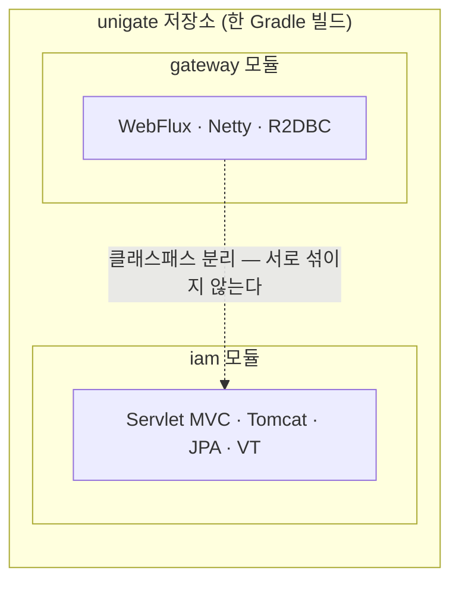

# 16. 한 저장소에 Reactive와 Virtual Thread를 함께 두기

> 한 줄 요약 — `CLAUDE.md` §1.3 은 "unigate 는 VT 를 쓰지 않는다"고 못박았지만, 그 근거는 **SCG 가 WebFlux 전용**이라는 제약이었다. IAM 은 SCG 가 아니므로 제약이 없다. "VT 와 Reactive 를 섞지 말라"는 경고는 **한 앱 안** 이야기다.
> 관련: Phase 8 · 코드 `build-logic/src/main/kotlin/iam.gradle.kts` · `iam/src/main/resources/application.yml` · `iam/.../ThreadProbeController.kt`

## 1. 왜 필요했나

Phase 8 에서 `iam` 모듈을 신설하며 스택을 골라야 했다. 지금까지 배운 것과 정면으로 충돌하는 것처럼
보이는 선택이었다.

- `CLAUDE.md` §1.3: **"unigate 는 VT 를 쓰지 않는다"**
- `CLAUDE.md` §4: **"`spring-boot-starter-web` 금지. WebFlux만"**

그런데 IAM 은 이 둘을 **정확히 반대로** 한다. 지침을 어기는 것인지, 아니면 지침이 원래 그런 뜻이
아니었는지 가릴 필요가 있었다.

## 2. 익숙한 방식과의 대조

| | `gateway` (Phase 1~5) | `iam` (Phase 8) | 왜 다른가 |
|---|---|---|---|
| 웹 | WebFlux + SCG (Netty) | **Servlet MVC (Tomcat)** | SCG 는 WebFlux 위에서만 동작. IAM 은 SCG 가 아니다 |
| DB | R2DBC (논블로킹) | **JPA / JDBC** | 관리 도메인 CRUD 는 관계·트랜잭션이 중요 |
| 블로킹 | **금지** (이벤트 루프가 멈춘다) | **정상** (VT 가 캐리어를 반납한다) | 동시성 모델이 다르다 |
| UseCase | `suspend` 함수 | 평범한 블로킹 함수 | 코루틴 경계가 없다 |
| 스레드 | 이벤트 루프 소수 | 요청당 VT (사실상 무제한) | — |

## 3. 동작 원리

### 지침의 진짜 범위

`CLAUDE.md` §1.3 을 다시 읽으면 근거가 **조건부**임이 드러난다.

> Spring Cloud Gateway 는 **WebFlux 위에서만** 동작한다. Servlet 스택을 클래스패스에 넣으면
> 자동설정이 충돌해 기동 자체가 실패한다. 따라서 unigate 는 Reactive 를 택했고 …

즉 "VT 금지"는 **원칙이 아니라 SCG 제약의 파생**이다. 제약이 없는 곳에서는 결론도 달라진다.

"VT 와 Reactive 를 섞지 말라"는 경고 역시 **한 애플리케이션 안**에서 두 동시성 모델을 겹쳐 쓰면
이점이 상쇄된다는 뜻이다. 앱을 나누면 각자 자기 모델을 온전히 쓴다.



**클래스패스가 모듈 단위로 분리되기 때문에 충돌하지 않는다.** 한 모듈에 두 스택을 넣었다면
자동설정이 깨졌을 것이다.

### 왜 IAM 워크로드가 VT 에 맞는가

- **Keycloak Admin client 가 블로킹이다.** WebFlux 였다면 이벤트 루프를 막지 않으려고 별도
  스레드풀로 퍼내는 곡예가 필요했다. VT 는 그냥 블로킹해도 캐리어 스레드를 반납한다.
- 관리 도메인 CRUD 는 JPA 의 관계 매핑·트랜잭션이 R2DBC 보다 적합하다.
- 저QPS·비임계 경로라 reactive 의 복잡도를 지불할 이유가 없다.

## 4. 직접 확인한 것

### (1) VT 가 실제로 켜졌는가 — `isVirtual()` 로 확인

`spring.threads.virtual.enabled=true` 는 **설정만 보고는 적용 여부를 알 수 없다.** 잘못돼도 앱은
정상 기동하고 요청도 처리되며, 부하가 걸려야 차이가 드러난다. 그래서 프로브를 만들었다.

```bash
curl -s http://localhost:8090/debug/thread
```

```json
{
    "threadName": "tomcat-handler-1",
    "virtual": true,
    "threadToString": "VirtualThread[#61,tomcat-handler-1]/runnable@ForkJoinPool-1-worker-1",
    "javaVersion": "21.0.11+10-LTS"
}
```

**예상과 달랐던 점:** VT 라고 이름이 비어 있지 않다. Tomcat 이 `tomcat-handler-N` 이라는 이름을
붙인다. 플랫폼 스레드 시절 이름(`http-nio-8090-exec-N`)과 다를 뿐 "이름이 있다"는 점은 같아서
**이름만으로는 구분할 수 없다.** `isVirtual()` 이 필요한 이유다.

`toString()` 의 `/runnable@ForkJoinPool-1-worker-1` 이 **캐리어 스레드**다. VT 는 블로킹 시 이
캐리어를 반납하고, 재개할 때 다른 캐리어에 올라탈 수 있다.

### (2) 두 스택이 한 저장소에서 공존하는가

두 앱을 동시에 띄우고 각자의 웹 서버를 확인했다.

```
gateway :8080  /actuator/health => 200
iam     :8090  /actuator/health => 200

gw2.log:Netty started on port 8080
iam.log:Tomcat started on port 8090
```

**Netty 와 Tomcat 이 같은 빌드 안에서 각자 뜬다.** 한 모듈에 섞었다면 자동설정 충돌로 기동조차
못 했을 것이다.

### (3) 도메인 테스트 39개 통과

```
$ ./gradlew :iam:test --rerun-tasks
실제 PASSED: 39
실제 FAILED: 0
BUILD SUCCESSFUL
```

## 5. 함정 / 실패 모드

### 함정 1 (직접 겪음): Kotlin 은 **중첩 블록 주석**을 지원한다

KDoc 안에 Keycloak group 경로 와일드카드를 쓴 순간 컴파일이 깨졌다.

```
e: TenantId.kt:33:1 Syntax error: Unclosed comment.
e: Tenant.kt:5:46 Unresolved reference 'TenantId'.     ← 연쇄 피해
```

원인은 주석 안에 있던 `/` + `*` 조합이다. **Java 는 중첩 주석을 지원하지 않지만 Kotlin 은 한다.**
그래서 주석 내부의 `/*` 가 새 주석을 열고, 닫히지 않아 파일 끝까지 주석으로 먹혔다.
백틱으로 감싸도 소용없다 — 컴파일러는 마크다운을 모른다.

> Phase 4 에서 겪은 "`*/` 가 주석을 조기 종료" 와 **짝을 이루는 반대 방향 함정**이다.
> 하나는 너무 일찍 닫히고, 하나는 열리기만 하고 안 닫힌다.
> **교훈: KDoc 안에 경로·글로브 패턴을 쓸 때는 상수 참조(`[GROUP_PREFIX]`)로 바꾸는 편이 안전하다.**

### 함정 2 (직접 겪음): 빈 패키지에 ArchUnit 규칙을 걸면 실패한다

`application` 레이어 규칙을 미리 넣었더니:

```
Rule '...' failed to check any classes. This means either that no classes have been passed to the
rule at all, or that no classes passed to the rule matched the `that()` clause. To allow rules being
evaluated without checking any classes you can either use `ArchRule.allowEmptyShould(true)` ...
```

P8b 까지는 `application` 패키지가 비어 있으니 당연하다. **`allowEmptyShould(true)` 로 통과시키고
싶은 유혹이 크지만 그렇게 하지 않았다** — 그건 아무것도 검사하지 않는 규칙을 "안전하다"는 증거로
위장하는 것이다([15](15-archunit-dependency-guard.md) §5 함정 2). 규칙은 `application` 이 실제로
생기는 P8d 로 미루고 이유를 주석에 남겼다.

역으로 보면 **ArchUnit 의 이 기본 동작이 §15 에서 걱정하던 "빈 규칙" 을 실제로 막아준 사례**다.

### 함정 3: VT 의 pinning — `synchronized` 안에서 블로킹하면 이점이 사라진다

VT 가 블로킹 시 캐리어를 반납하는 것은 **`synchronized` 블록 밖**에서의 이야기다. `synchronized`
안에서 블로킹하면 캐리어가 **pin** 되어 플랫폼 스레드를 붙잡는다. JDK 21 기준이며, 커넥션 풀이나
드라이버가 `synchronized` 를 쓰는지 확인해야 한다.

이번 Phase 에서는 **측정하지 않았다.** JDBC 커넥션 풀(HikariCP)을 실제로 태워보는 P8d 이후의 숙제다.

### 함정 4: 모듈을 헷갈리면 정반대 조언이 된다

`CLAUDE.md` §4 의 함정표("블로킹 금지", "`.block()` 금지")는 전부 `gateway` 이야기다. IAM 에서는
**블로킹이 정상**이다. 그래서 §4·§5 에 모듈 구분을 명시적으로 박아뒀다. 이 구분이 없으면
"IAM 에서 JDBC 를 쓰면 안 된다" 같은 잘못된 결론이 나온다.

## 6. 남은 의문

- **VT 의 실제 이득을 측정하지 않았다.** `isVirtual=true` 는 "켜졌다"만 말해주고 "빨라졌다"는
  말해주지 않는다. 부하 테스트로 플랫폼 스레드 대비 동시성을 비교해야 의미가 있다.
- **pinning 이 실제로 일어나는가.** HikariCP·PostgreSQL JDBC 드라이버가 `synchronized` 를 쓰는지,
  `-Djdk.tracePinnedThreads=full` 로 관찰해야 한다.
- **outbox 워커를 무엇으로 돌릴 것인가.** `@Scheduled` 폴링이 가장 단순하지만 다중 인스턴스면
  `SELECT ... FOR UPDATE SKIP LOCKED` 가 필요하다. 아직 안 정했다(P8d).
- **IAM DB 를 별도 데이터베이스로 둘 것인가.** 지금은 로컬에서 `unigate_iam` 을 따로 만들었지만,
  Phase 6 의 "공유 PostgreSQL" 방침과 어떻게 맞출지는 미정이다.
- 도메인 모델과 JPA 엔티티를 분리하기로 했는데(ArchUnit 으로 강제), **매핑 비용**이 얼마나 될지는
  실제로 `jpaOut` 어댑터를 쓰는 P8d 에서야 안다.
