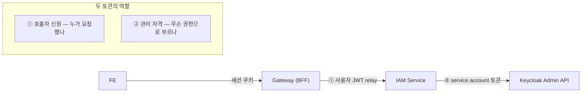
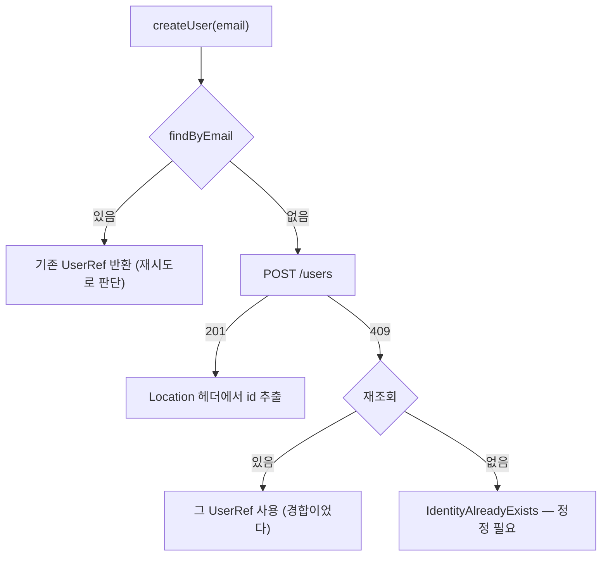

# 17. service account 토큰과 멱등한 Admin API 호출

> 한 줄 요약 — IAM 은 **두 종류의 토큰**을 다룬다(사용자 JWT ≠ 관리 자격). 그리고 outbox 가 최소 1회 실행이라 Admin API 호출은 **멱등해야** 한다. VT 환경에서 토큰 캐시를 지킬 때는 `synchronized` 가 아니라 `ReentrantLock` 을 쓴다.
> 관련: Phase 8c · 코드 `iam/.../keycloakAdminOut/*` · `application/user/port/outbound/IdentityProviderPort.kt` · `scripts/keycloak/setup-realm.sh`

## 1. 왜 필요했나

P8d(가입 유스케이스)를 만들려면 Keycloak 에 사용자를 생성할 수단이 필요하다. 그런데 막상 붙이려니
두 가지가 걸렸다.

1. **무슨 자격으로 부르나?** 가입은 사용자 토큰이 아예 없는 상태다.
2. **두 번 불리면?** outbox 워커는 최소 1회 실행이라 같은 요청이 재시도될 수 있다.

## 2. 익숙한 방식과의 대조

| | 익숙한 방식 | 여기서의 방식 | 왜 다른가 |
|---|---|---|---|
| 외부 API 인증 | 사용자 토큰을 그대로 전달 | **애플리케이션 자신의 토큰**(`client_credentials`) | 사용자 토큰엔 `manage-users` 가 없다 |
| 재시도 | "실패하면 다시" 정도 | **멱등 설계 필수** | outbox 는 최소 1회 실행이라 중복이 정상 경로다 |
| 캐시 동기화 | `synchronized` | **`ReentrantLock`** | VT 에서 `synchronized` + 블로킹 = pinning |
| 외부 라이브러리 | 공식 admin client 사용 | **`RestClient` 직접 호출** | 라이브러리 타입이 퍼지면 봉인이 느슨해진다 |

## 3. 동작 원리

### 토큰이 두 종류다 — 이걸 헷갈리면 설계가 무너진다



| | 출처 | 쓰임 | 왜 다른 게 필요한가 |
|---|---|---|---|
| **호출자 신원** | 게이트웨이가 relay 한 사용자 JWT | "누가 요청했는가" 식별 | 사용자 토큰엔 `manage-users` 가 **없다** |
| **관리 자격** | IAM 자신의 `client_credentials` 토큰 | Admin API 호출 | **가입은 사용자 토큰이 아예 없다** |

### 멱등 생성 — 조회 → 생성 → (409면) 재조회



**마지막 재조회가 핵심이다.** 첫 조회와 생성 사이에 다른 워커가 만들었을 수 있고(경합), 그때 409 를
실패로 처리하면 그 가입은 **영영 진행되지 않는다.**

### 예외를 두 종류로 나눈 이유

outbox 워커가 "재시도할지 / 사용자에게 정정을 요구할지"를 판단해야 한다. 그 판단 근거를 예외 타입에
담았다.

- `IdentityProviderUnavailableException` → **재시도 대상**(통신 실패, 5xx)
- `IdentityAlreadyExistsException` → **재시도 무의미**, `UserProfile` 을 `IDENTITY_FAILED` 로

## 4. 직접 확인한 것

### (0) 실제 Keycloak 으로 가정 검증 — **전부 맞았다**

`unigate-iam` client 를 realm 에 만든 뒤 실제 Admin API 를 호출했다(테스트 사용자는 만든 뒤 삭제).

```
✅ 토큰 발급 성공
   토큰의 realm-management 역할: manage-users,view-users,query-groups,query-users

─── 가정 1: 없는 이메일 조회 → 200 + 빈 배열 ───
  HTTP 200 / 본문: []                          ✅
─── 가정 2: 사용자 생성 → 201 + Location 헤더 ───
  HTTP 201                                      ✅
  Location 있음 — 마지막 세그먼트: <uuid>       ✅
─── 가정 3: 같은 이메일 재생성 → 409 Conflict ───
  HTTP 409                                      ✅
─── 가정 4: exact=true 조회로 1건 ───
  건수: 1                                       ✅
```

어댑터가 전제한 네 가지(201+Location / 409 / `exact=true` / 빈 배열)가 실제와 일치했다.
`query-groups` 는 부여하지 않았는데 함께 실렸다 — Keycloak 이 composite 로 묶어둔 것으로 보인다.

### (1) 어댑터 동작 — MockWebServer 10케이스

실제 Keycloak 없이 HTTP 계약을 고정했다.

```
KeycloakIdentityProviderAdapterTest > 사용자를 생성하면 Location 헤더에서 id 를 뽑아 UserRef 로 돌려준다() PASSED
KeycloakIdentityProviderAdapterTest > 이미 존재하는 이메일이면 생성하지 않고 기존 참조를 재사용한다() PASSED
KeycloakIdentityProviderAdapterTest > 생성 도중 409 가 나면 재조회해서 그 참조를 쓴다() PASSED
KeycloakIdentityProviderAdapterTest > 409 인데 재조회에도 없으면 정정이 필요한 실패로 분류한다() PASSED
KeycloakIdentityProviderAdapterTest > 서버 오류는 재시도 가능한 예외로 분류한다() PASSED
KeycloakIdentityProviderAdapterTest > 토큰은 캐시되어 매 호출마다 재발급하지 않는다() PASSED
KeycloakIdentityProviderAdapterTest > 만료가 임박한 토큰은 재발급한다() PASSED
KeycloakIdentityProviderAdapterTest > 생성 응답에 Location 이 없으면 실패로 처리한다() PASSED
KeycloakIdentityProviderAdapterTest > 토큰 요청은 client_credentials 로 나간다() PASSED
BUILD SUCCESSFUL
```

**이 테스트가 증명하는 것과 못 하는 것을 구분해야 한다.** 멱등 로직·토큰 캐싱·예외 분류는 우리가 짠
코드라 여기서 확실히 검증된다. 반면 "Keycloak 이 정말 201 + Location 을 주는가" 같은 것은 **우리 가정**이고
MockWebServer 는 그 가정을 흉내 낼 뿐이다 — 그래서 §4(0)에서 실제 서버로 따로 확인했다.

### (2) ArchUnit — 봉인이 유지되는가

`application` 패키지가 P8c 에서 처음 생겨, P8b 에서 미뤄뒀던 규칙을 이제 넣었다.

```
IamHexagonalArchitectureTest > application 은 adapter 를 알아서는 안 된다() PASSED
IamHexagonalArchitectureTest > application 은 웹·영속성 기술을 직접 쓰지 않는다() PASSED
... 총 6규칙 PASSED
```

두 번째 규칙이 실질적으로 봉인을 지킨다 — `IdentityProviderPort` 가 `RestClient` 나 Keycloak 응답 타입을
시그니처에 노출하는 순간 빌드가 깨진다.

### (3) 전체 빌드

```
$ ./gradlew build
BUILD SUCCESSFUL
```

## 5. 함정 / 실패 모드

### 함정 1: OAuth2 응답은 snake_case 다

```kotlin
// ❌ 이렇게 두면 accessToken 이 null 이 된다
data class TokenResponse(val accessToken: String, val expiresIn: Long)
```

토큰 응답은 `{"access_token": "...", "expires_in": 300}` 인데 Kotlin 프로퍼티는 camelCase 라 매핑되지
않는다. `@JsonProperty` 를 명시해야 한다. 전역 `property-naming-strategy` 를 SNAKE_CASE 로 바꾸는
방법도 있지만 **앱 전체의 직렬화를 바꾸므로** 쓰지 않았다.

### 함정 2 (VT 고유): `synchronized` 로 토큰 캐시를 지키면 pinning 이 난다

토큰 캐시는 여러 요청이 동시에 만료를 감지해 중복 발급하는 것을 막아야 하므로 락이 필요하다.
그런데 **`synchronized` 블록 안에서 블로킹하면 캐리어 스레드가 pin** 되어 VT 의 이점이 사라진다(JDK 21).
토큰 발급은 네트워크 호출이라 정확히 그 상황이다.

`ReentrantLock` 은 VT 를 인지해 대기 시 캐리어를 반납하므로 pinning 이 없다.

```kotlin
private val lock = ReentrantLock()   // ← synchronized 가 아니다

fun accessToken(): String {
  cached?.takeIf { it.usableAt(Instant.now()) }?.let { return it.value }   // 빠른 경로
  return lock.withLock {
    cached?.takeIf { it.usableAt(Instant.now()) }?.let { return@withLock it.value }  // 이중 검사
    issueToken().also { cached = it }.value
  }
}
```

이중 검사가 없으면 락을 기다리던 스레드들이 줄줄이 재발급을 일으킨다.

### 함정 3 (직접 겪음): `fullScopeAllowed: false` 로 두면 역할이 **토큰에 실리지 않는다**

"최소권한" 을 의도해 `fullScopeAllowed: false` 로 만들었는데, 그 결과 Admin API 가 **전부 403** 이었다.
역할 부여는 분명히 성공했는데도 그랬다.

토큰을 열어보니 원인이 나왔다.

```json
{ "resource_access": null, "realm_access": null, "scope": "email profile" }
```

full scope 를 끄면 **client scope 에 명시적으로 추가한 역할만** 토큰에 실린다. service account 사용자에
역할을 붙여도 토큰에는 안 들어간다. 고친 뒤:

```
토큰의 realm-management 역할: manage-users,view-users,query-groups,query-users
```

**이 client 에서는 `fullScopeAllowed: true` 가 안전하다.** `standardFlowEnabled: false` 라 사용자가
로그인하지 않으므로, 토큰에 실리는 것은 **service account 에 부여된 역할뿐**이기 때문이다.

> 이 프로젝트의 `KEYCLOAK_REALM_SETUP.md` §4.6 이 **이미 같은 함정을 경고**하고 있었는데
> (게이트웨이 client 의 `realm_access.roles` 누락), 다른 맥락이라 알아보지 못하고 그대로 반복했다.
> **증상이 "인증은 되는데 권한만 없다" 라 secret 을 먼저 의심하게 되는 것**이 이 함정의 고약한 점이다.

그래서 검증 스크립트가 이제 **토큰의 역할부터** 확인하고, 비어 있으면 즉시 멈춘다.

### 함정 4 (실측으로 확인된 **실제 버그**): `+` 가 든 이메일은 조회되지 않는다

처음엔 "이론상 위험"으로만 적어뒀는데, 실제 Keycloak 으로 재보니 **진짜였다.**

```
raw(+ 그대로) 조회 건수: 0   /   %2B 인코딩 조회 건수: 1
```

`+` 는 URI 쿼리에서 **합법 문자**라 `UriComponentsBuilder.encode()` 가 인코딩하지 않는다. 그런데 서버는
쿼리를 `application/x-www-form-urlencoded` 로 해석해 **`+` 를 공백으로 디코딩**한다. 두 규칙이 어긋난다.

**왜 치명적인가:** `createUser` 의 멱등 검사가 기존 사용자를 못 찾고 → 생성 시도 → 409 → 재조회도 같은
이유로 실패 → `IdentityAlreadyExistsException`. **`alice+tag@…` 같은 이메일은 영영 가입할 수 없다.**
그리고 이 실패는 gmail alias 를 쓰는 사용자에게만 나타나 재현이 어렵다.

해결은 `URLEncoder`(form 규칙)로 인코딩해 `+` → `%2B` 로 보내는 것이다. 서버가 form 규칙으로 디코딩하니
이쪽이 짝이 맞는다.

### 함정 5 (직접 겪음): 이미 인코딩한 URL 을 `uri(String)` 에 넘기면 **이중 인코딩**된다

함정 4 를 고치자마자 다음이 나왔다.

```
Expecting actual:
  "/admin/realms/test/users?email=alice%252Btag%2540example.local&exact=true"
to contain:
  "email=alice%2Btag%40example.local"
```

`%252B` 는 `%2B` 의 `%` 가 다시 `%25` 로 인코딩된 것이다. `RestClient.uri(String)` 은 넘긴 문자열을
**URI 템플릿으로 보고 인코딩**하기 때문이다. 이미 인코딩한 값은 `URI.create(...)` 로 **`URI` 객체**를
넘겨야 한다 — 그건 있는 그대로 쓰인다.

> 교훈: 인코딩은 **한 곳에서만** 해야 한다. 어디서 하는지 모른 채 방어적으로 한 번 더 하면 깨진다.

### 함정 6 (직접 겪음): 검증 스크립트가 실패를 성공으로 오판했다

처음 검증에서 이런 출력을 봤다.

```
─── 가정 4: exact=true 조회로 방금 만든 사용자 1건 ───
  건수: 1
  ✅ 정확히 1건
```

그런데 그 직전 단계는 전부 403 이었다. `jq 'length'` 로 건수를 셌는데, 403 응답 본문
`{"error":"HTTP 403 Forbidden"}` 은 **객체이고 키가 1개**라 길이가 1로 나온 것이다.

**검증 도구 자체가 틀리면 실패가 성공으로 보인다.** 배열인지 먼저 확인하도록 고쳤다.
(`docs/learning/15` §5 의 "통과하는 가드는 아무것도 증명하지 않는다" 와 같은 교훈이 다른 형태로 나타났다.)

### 함정 5: 예외 메시지에 secret 이 섞일 수 있다

토큰 요청은 form 본문에 `client_secret` 을 담는다. 그 요청이 실패했을 때 원인 예외 메시지를 그대로
상위로 넘기거나 로그에 찍으면 **secret 이 로그에 남을 수 있다.** 그래서 사람이 읽는 메시지는 우리가
만든 문장만 쓰고 원인은 `cause` 로만 보존한다(`CLAUDE.md` §8).

## 6. 남은 의문

- **`query-groups` 는 부여하지 않았는데 토큰에 실렸다.** Keycloak 이 composite role 로 묶어둔 것으로
  추측하지만 확인하지 않았다. 최소권한을 정확히 따지려면 실제로 어떤 역할이 딸려오는지 알아야 한다.
- **역할 재부여 POST 의 멱등성**은 직접 확인하지 않았다. 스크립트를 두 번 실행해도 오류가 없었으니
  최소한 실패하지는 않지만, 중복 매핑이 쌓이는지까지는 보지 않았다.
- **토큰 캐시가 인스턴스 로컬이다.** 다중 인스턴스면 각자 토큰을 받는데, Keycloak 세션 수·발급 부하
  관점에서 문제가 되는 규모가 언제인지 모르겠다.
- **`username` 에 이메일을 그대로 쓰고 있다.** Keycloak 의 username 정책(대소문자·길이·중복)이 이메일과
  완전히 겹치는지 확인하지 않았다. 이메일 변경 시 username 도 따라가야 하는지도 미정이다(§16 미결).
- **`invalidate()` 호출 시점이 조회 경로에만 있다.** 생성 경로에서 401 을 만나면 캐시를 비우지 않는다.
  실제로 그 경로가 발생하는지(토큰 수명 대비 호출 간격) 확인하지 않았다.
- VT pinning 을 **측정하지는 않았다.** `ReentrantLock` 을 쓴 것은 문서상 근거에 따른 예방이고,
  `-Djdk.tracePinnedThreads=full` 로 실제 확인한 것은 아니다([16](16-virtual-thread-vs-reactive-two-modules.md) §6 과 같은 숙제).
