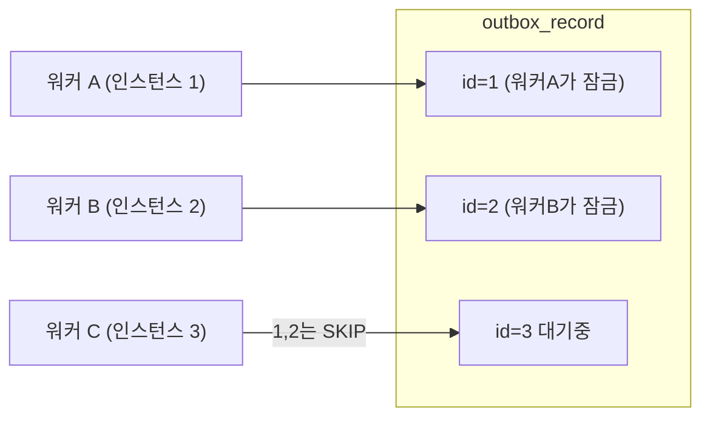

# 18. 다중 인스턴스 outbox 워커 — SKIP LOCKED와 트랜잭션 경계

> 한 줄 요약 — 워커 중복 실행을 막는 지점은 **스케줄러가 아니라 DB 행 잠금**이다. `FOR UPDATE SKIP LOCKED` 를 쓰면 분산 락(ShedLock)이 필요 없고, 오히려 분산 락이 **병목**이 된다. 그리고 클레임부터 결과 반영까지를 한 트랜잭션에 두면 워커가 죽어도 다른 인스턴스가 자동으로 이어받는다.
> 관련: Phase 8d · 코드 `application/outbox/**` · `adapter/jpaOut/repository/OutboxRecordJpaRepository.kt` · `adapter/schedulerIn/OutboxPollingScheduler.kt`

## 1. 왜 필요했나

가입은 **IAM DB 쓰기 + Keycloak 사용자 생성**이라는 두 시스템 쓰기다. outbox 로 가기로 정했으니
(§16 결정) 실제로 "지시를 나중에 처리하는 워커" 를 만들어야 했다.

그런데 이 서비스는 **다중 인스턴스로 뜬다.** 그러면 워커도 여러 개가 동시에 돈다. 여기서 두 가지를
정해야 했다.

1. 여러 워커가 **같은 지시를 두 번 처리하는 것**을 어떻게 막나?
2. 워커가 처리 도중 **죽으면** 그 지시는 어떻게 되나?

## 2. 익숙한 방식과의 대조

| | 흔한 방식 | 여기서의 방식 | 왜 다른가 |
|---|---|---|---|
| 중복 실행 방지 | 스케줄러에 **분산 락**(ShedLock 등) | **DB 행 잠금**(`SKIP LOCKED`) | 분산 락은 한 번에 하나만 돌려 **병목**이 된다 |
| 처리 단위 | 배치로 N건 조회 후 루프 | **건별 클레임 + 건별 트랜잭션** | 실패가 격리되고 락 유지 시간이 짧다 |
| 워커 사망 대비 | `IN_PROGRESS` + 타임아웃 회수 | **트랜잭션 롤백으로 자동 해제** | 회수 로직 자체가 새로운 버그 원천 |
| 재시도 | 즉시 재시도 or 고정 간격 | **지수 백오프 + 영구 실패 분리** | 고칠 수 없는 실패를 10번 반복하지 않는다 |

## 3. 동작 원리

### `FOR UPDATE SKIP LOCKED` 가 하는 일

```sql
SELECT * FROM outbox_record
WHERE status = 'PENDING' AND next_attempt_at <= :now
ORDER BY next_attempt_at
LIMIT 1
FOR UPDATE SKIP LOCKED
```

- `FOR UPDATE` — 선택한 행을 **트랜잭션이 끝날 때까지** 잠근다.
- `SKIP LOCKED` — **이미 잠긴 행은 기다리지 않고 건너뛴다.**



`SKIP LOCKED` 가 없으면 워커 B 는 워커 A 가 끝날 때까지 **대기**한다. 기능은 동작하므로
테스트는 통과하고, 다만 **인스턴스를 늘려도 처리량이 안 늘어난다.** 조용한 실패다.

### 왜 분산 락이 필요 없나

`@Scheduled` 를 여러 인스턴스에 띄우면 보통 ShedLock 같은 분산 락을 건다. 여기서는 **불필요하다** —
중복을 막는 지점이 스케줄러가 아니라 DB 이기 때문이다. 오히려 분산 락을 걸면 한 번에 한 인스턴스만
일하게 되어 **다중 인스턴스의 이점이 사라진다.**

### 트랜잭션 경계 — 이 Phase 에서 가장 중요한 판단

클레임부터 결과 반영까지를 **한 트랜잭션**에 넣었다. 외부 호출(Keycloak)이 그 안에 들어가므로
DB 커넥션을 잡고 있게 된다.

| | 택한 방식 (트랜잭션 내 처리) | 대안 (claim → 처리 → 반영) |
|---|---|---|
| 워커가 죽으면 | 롤백 → **락 해제 → 다른 인스턴스가 즉시 이어받음** | `IN_PROGRESS` 로 **멈춤** |
| stale lock | 없음 | 있음 → 타임아웃 회수 필요 |
| 커넥션 | 외부 호출 동안 점유 | 빨리 반납 |

**다중 인스턴스에서는 인스턴스가 죽는 것이 예외가 아니라 일상**이다(롤링 배포, 오토스케일, OOM).
그때 자동으로 이어받는 성질이 커넥션 점유보다 값지다고 판단했다.

## 4. 직접 확인한 것

### (1) 다중 워커 동시 클레임 — 중복 없음

워커 4개가 레코드 8개를 동시에 집게 했다(실제 PostgreSQL 16).

```
OutboxConcurrencyIntegrationTest > 여러 워커가 동시에 집어도 같은 레코드를 두 번 집지 않는다() PASSED
OutboxConcurrencyIntegrationTest > 이미 잠긴 행은 건너뛰고 다음 행을 집는다() PASSED
OutboxConcurrencyIntegrationTest > 백오프로 미뤄진 레코드는 시간이 되기 전까지 집히지 않는다() PASSED
```

두 번째 테스트가 `SKIP LOCKED` 의 정의를 직접 확인한다 — 워커 1이 트랜잭션을 **열어둔 채** 행을
잡고 있는 동안, 워커 2가 **대기하지 않고 다른 행**을 받는다.

### (2) 가입 전 구간

```
RegisterFlowIntegrationTest > 가입하면 프로필과 outbox 지시가 함께 저장된다() PASSED
RegisterFlowIntegrationTest > 워커가 처리하면 신원이 채워지고 ACTIVE 가 된다() PASSED
RegisterFlowIntegrationTest > Keycloak 중복이면 프로필이 IDENTITY_FAILED 로 가고 지시는 DEAD 가 된다() PASSED
RegisterFlowIntegrationTest > 같은 이메일로 다시 가입하면 409 이고 outbox 가 늘지 않는다() PASSED
RegisterFlowIntegrationTest > 이메일 형식이 틀리면 400 이고 아무것도 저장되지 않는다() PASSED
RegisterFlowIntegrationTest > 동시에 같은 이메일로 가입해도 한 건만 성공하고 500 이 나지 않는다() PASSED
```

첫 번째가 outbox 의 전제("프로필과 지시는 같은 커밋")를 지킨다. `@Transactional` 이 빠지면 이 테스트만
깨진다 — 단위 테스트로는 잡히지 않는다.

### (3) 동시 가입 경합 — 재현은 못 했지만 방어는 넣었다

4개 스레드로 같은 이메일을 동시에 가입시켜 봤다.

```
동시 가입 응답 상태들: [201, 409, 409, 409]
생성된 프로필 수: 1
생성된 outbox 수: 1
```

**우려했던 500 은 나오지 않았다.** 사전 조회(check)가 모두 제때 걸려 DB unique 위반까지 가지 않았다.

다만 이것을 "경합이 안전하다" 는 증거로 삼지 않았다. 사전 조회와 INSERT 사이는 여전히
check-then-act 구간이고, 부하가 높거나 인스턴스가 여럿이면 확률이 오른다. 그래서
`DataIntegrityViolationException → 409` 핸들러를 **재현하지 못한 채로** 추가했다.

> **재현되지 않는다는 것이 안전하다는 뜻은 아니다.** 특히 동시성 버그는 테스트 환경에서 조용하다가
> 운영에서 드러난다.

### (4) 집계

```
단위 PASSED: 66
통합 PASSED: 9
./gradlew build → BUILD SUCCESSFUL
```

## 5. 함정 / 실패 모드

### 함정 1 (직접 겪음): Testcontainers 가 Docker 29 에서 뜨지 않았다

처음엔 Testcontainers 로 작성했는데 컨테이너를 못 띄웠다.

```
UnixSocketClientProviderStrategy: failed with exception BadRequestException (Status 400: {"ID":"","Containers":0,...})
Could not find a valid Docker environment.
```

진단 과정:

| 확인 | 결과 |
|---|---|
| `docker info` | 정상 (Docker 29.6.2, 컨테이너 9개) |
| 소켓에 `curl /info` | **200 정상** |
| 소켓에 `curl /v1.55/info`, `/v1.44/info` | 전부 200 |
| Java(docker-java)의 같은 요청 | **400** |

즉 소켓도 API 버전도 문제가 아니고 **docker-java 쪽 비호환**이었다. Testcontainers 를 1.21.4 로
올리려 했지만 **Spring Boot BOM 이 1.21.3 으로 되돌렸다**(`-> 1.21.3 (c)`).

**해결: 목적으로 되돌아갔다.** 필요한 것은 "Testcontainers 를 쓰는 것" 이 아니라 **실제 PostgreSQL 에서
SKIP LOCKED 를 확인하는 것**이었다. `docker compose` 로 이미 띄우는 로컬 PostgreSQL 에 JDBC 로 직접
붙으니 Docker 소켓 API 를 거치지 않아 문제가 사라졌고, 검증 강도는 같다.

> 교훈: 도구가 막히면 **도구를 고치려 들기 전에 목적을 다시 본다.** 우회로가 더 단순한 경우가 있다.

### 함정 2: `SKIP LOCKED` 없이도 테스트는 통과한다

`SKIP LOCKED` 를 빼도 중복 처리는 일어나지 않는다(`FOR UPDATE` 만으로도 배타성은 보장). 다만 워커들이
**직렬화**되어 인스턴스를 늘려도 처리량이 안 는다. 기능 테스트로는 절대 안 잡히고, 부하를 걸어야
드러난다. 그래서 "잠긴 행을 건너뛰는가" 를 **명시적으로** 테스트했다.

### 함정 3: Hibernate 힌트로 `SKIP LOCKED` 를 걸면 조용히 무시될 수 있다

`jakarta.persistence.lock.timeout = -2` 힌트로도 걸 수 있지만 방언·버전에 따라 해석이 달라
**조용히 일반 `FOR UPDATE` 로 동작할 위험**이 있다. native 쿼리로 SQL 을 직접 쓰면 무엇이 실행되는지
의심할 여지가 없다.

### 함정 4: 스케줄러에서 예외가 새면 다음 실행이 취소된다

`@Scheduled` 메서드에서 예외가 밖으로 나가면 이후 스케줄이 **중단될 수 있다.** outbox 워커가 멈추면
가입이 조용히 쌓이기만 한다. 그래서 폴링 메서드 전체를 `try-catch` 로 감쌌다.

### 함정 5: `@EnableScheduling` 을 빠뜨리면 아무 일도 안 일어난다

`@Scheduled` 는 `@EnableScheduling` 이 없으면 **조용히 무시된다.** 빈은 등록되고 앱도 정상 기동하는데
outbox 만 영원히 쌓인다. "가입은 되는데 Keycloak 에 안 생긴다" 는 증상이라 원인을 찾기 어렵다.

### 함정 6: outbox 레코드는 오래 남는다 — 민감정보 금지

실패한 레코드는 재시도 대기로 **며칠씩 DB 에 남을 수 있다.** payload 에 비밀번호를 넣지 않았고,
`last_error` 에도 외부 예외 메시지를 그대로 넣지 않는다(토큰이 섞일 수 있다). 대신 분류 코드
(`identity_provider_unavailable`)만 저장한다 — 테스트로 회귀를 막았다.

## 6. 남은 의문

- **커넥션 점유가 실제로 문제되는 지점**을 모른다. 트랜잭션 안에서 Keycloak 을 부르므로 외부 지연이
  길어지면 커넥션 풀이 마른다. 풀 크기·배치 크기·타임아웃의 적정값은 부하를 걸어봐야 안다.
- **VT pinning 을 여전히 측정하지 못했다.** HikariCP 를 실제로 태우게 됐으니
  `-Djdk.tracePinnedThreads=full` 로 확인할 수 있는 조건은 갖춰졌다.
- **DEAD 레코드 운영 절차가 없다.** 지금은 사람이 DB 를 봐야 한다. 알림·재처리 API 가 필요한지,
  아니면 그 정도 빈도가 아닌지 판단할 데이터가 없다.
- **COMPLETED 레코드 정리**를 하지 않는다. 계속 쌓이면 테이블이 커지는데, 부분 인덱스 덕분에 클레임
  성능은 유지된다. 보관 기간 정책이 필요한 시점이 언제인지 모르겠다.
- **가입 직후 로그인 불가**를 FE 가 어떻게 다룰지 아직 정하지 않았다. 폴링? 안내 문구? P8e/P8f 의 숙제다.
- **경합 방어 코드가 실제로 타는 것을 못 봤다**(§4-(3)). `DataIntegrityViolationException` 핸들러를
  넣었지만 4스레드 실측에서는 사전 조회가 다 걸려 거기까지 가지 않았다. 확실히 검증하려면 사전 조회를
  일부러 지연시키는 식의 장치가 필요한데, 그건 프로덕션 경로를 왜곡한다 — 어떻게 검증할지 모르겠다.
- **rate limit 이 아직 없다.** 가입은 공개 엔드포인트라 스팸·계정 열거의 표적이다. 게이트웨이가 담당할
  몫이지만 P8f 전까지는 **무방비**이므로 이 엔드포인트를 외부에 노출하면 안 된다.
