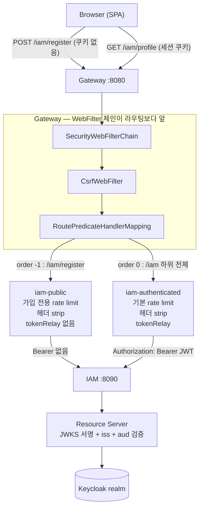

# 19. GW→IAM 프록시 라우트 — 공개/인증 분리와 가입 rate limit

> 한 줄 요약 — 같은 접두사(`/iam`)를 **공개 라우트와 인증 라우트로 쪼개는 순간** 순서·CSRF·rate limit·audience 네 군데가 동시에 문제가 된다. 어느 것도 컴파일이나 기동으로는 드러나지 않고, 전부 "브라우저에서 눌러 봐야" 알게 된다.
> 관련: Phase 8f · 코드 `gateway/config/GatewayRouteConfig.kt` · `gateway/config/RateLimitConfig.kt` · `gateway/config/SecurityConfig.kt` · `iam/config/IamSecurityConfig.kt`

## 1. 왜 필요했나

P8d 에서 가입 API(`POST /iam/register`)를 만들었지만 **IAM 은 `:8090` 에 혼자 떠 있었다.** 게이트웨이를
거치는 경로가 없으니 브라우저에서 쓸 수 없었고, 무엇보다 **rate limit 이 하나도 걸려 있지 않았다.**
가입은 미인증 공개 쓰기 엔드포인트이고, 성공 요청 하나가 Keycloak 사용자 + outbox 레코드라는
**영구 상태**를 만든다. 조회 API 의 과다 호출과 무게가 다르다.

그래서 P8e(프로필)보다 P8f 를 앞당겼다 — 무방비 상태를 오래 두지 않으려고.

작업 자체는 "라우트 하나 더 추가" 로 보였다. 실제로는 그렇지 않았다.

## 2. 익숙한 방식과의 대조

| | Servlet MVC 방식 | 여기서의 방식 | 왜 다른가 |
|---|---|---|---|
| 경로별 권한 | 한 앱 안에서 `SecurityFilterChain` 하나 | **두 앱이 각자 판단** — GW 는 coarse(인증됐나), IAM 은 자기 경계 | GW 를 우회해 IAM 에 직접 붙는 경로가 실재한다 |
| 경로 우선순위 | `@RequestMapping` 이 가장 구체적인 것을 고름 | **라우트를 순서대로 훑어 처음 매칭된 하나** | SCG 는 "가장 구체적" 을 찾지 않는다. 순서가 곧 정책 |
| 요청 인증 | 세션 쿠키(서버 상태) | GW=세션 쿠키 / IAM=**Bearer(무상태)** | 같은 요청이 경계를 넘으며 인증 방식이 바뀐다 |
| CSRF | 쿠키 인증이므로 항상 켠다 | GW=켬 / IAM=**끔** | 쿠키를 안 쓰는 쪽에는 CSRF 의 전제가 없다 |

세 번째·네 번째 줄이 이 문서의 핵심이다. **한 요청이 게이트웨이를 지나면서 인증 컨텍스트가 교체된다.**
브라우저는 세션 쿠키를 보내고, 게이트웨이는 그것을 세션에서 꺼낸 JWT 로 **바꿔서** IAM 에 보낸다.

## 3. 동작 원리



핵심은 **왼쪽 두 갈래가 서로 다른 필터 체인을 탄다**는 것이다. 공개 라우트에는 `tokenRelay` 가 없고
(relay 할 토큰이 없다), 인증 라우트에는 있다. Keycloak 쓰기는 어느 쪽이든 IAM 이 **자기 service
account** 로 한다 — 사용자 토큰에는 `manage-users` 가 없다(17번 문서).

### 3.1 rate limit 을 "초당 1회보다 느리게" 잡는 법

`RedisRateLimiter(replenishRate, burstCapacity, requestedTokens)` 에서 `replenishRate` 는 **Int** 다.
분당 12회 같은 값을 직접 못 쓴다. 대신 **요청당 소비 토큰을 키운다.**

| 설정 | 값 | 효과 |
|---|---|---|
| `replenish-rate` | 1 | 초당 1토큰 보충 |
| `requested-tokens` | 5 | 요청 1건 = 5토큰 → 지속 처리율 **분당 12회** |
| `burst-capacity` | 15 | 15토큰 = **연속 3건**까지 즉시 허용 |

⚠️ `burstCapacity < requestedTokens` 로 두면 버킷이 가득 차도 요청 1건을 감당하지 못해 **모든 요청이
429** 다. 부팅은 정상이고 "가입만 전부 실패" 로만 드러난다. 그래서 빈 생성 시 `require` 로 막았다.

## 4. 직접 확인한 것

### 4.1 GW(:8080) → IAM(:8090) 가입 프록시

```
$ curl -s -w 'status=%{http_code}\n' -X POST http://localhost:8080/iam/register \
    -H 'Content-Type: application/json' \
    -d '{"email":"p8f-1785063137@example.local","displayName":"P8F 검증","firstName":"P8F","lastName":"Verify"}'
status=201
{"email":"p8f-1785063137@example.local","onboardingState":"PENDING_IDENTITY","userRef":null}

$ # 같은 이메일 재요청
status=409
{"type":"about:blank","title":"Email Already Registered","status":409,
 "detail":"이미 가입된 이메일입니다.","instance":"/iam/register","reasonCode":"email_already_registered"}
```

`instance` 가 `/iam/register` 인 것에 주목한다 — **stripPrefix 를 쓰지 않아서** IAM 이 받은 경로가
그대로다. `/api` 라우트 습관대로 `stripPrefix(1)` 을 붙였다면 IAM 은 `/register` 를 받고 404 를 냈을 것이다.

### 4.2 가입 rate limit — 연속 3건 후 429

```
$ for i in $(seq 1 6); do ... POST /iam/register ... done
req#1 -> 201  (x-ratelimit-remaining=10)
req#2 -> 201  (x-ratelimit-remaining=5)
req#3 -> 201  (x-ratelimit-remaining=0)
req#4 -> 429  (x-ratelimit-remaining=0)
req#5 -> 429  (x-ratelimit-remaining=0)
req#6 -> 429  (x-ratelimit-remaining=0)
```

`remaining` 이 15 → 10 → 5 → 0 으로 **5씩** 줄어든다. `requestedTokens=5` 가 실제로 반영된 증거다.

### 4.3 버킷이 라우트별로 분리되는가 — Valkey 실측

```
$ docker exec unigate-valkey valkey-cli --scan --pattern 'request_rate_limiter*'
request_rate_limiter.{iam-public.0:0:0:0:0:0:0:1}.tokens
request_rate_limiter.{iam-public.0:0:0:0:0:0:0:1}.timestamp
```

키가 `{routeId.식별자}` 형태다. `spring-cloud-gateway-server` 4.3.0 소스에서도 확인:

```java
static List<String> getKeys(String id, String routeId) {
    String prefix = "request_rate_limiter.{" + routeId + "." + id + "}.";
```

즉 **같은 IP 라도 라우트마다 버킷이 다르다.** 파라미터가 전혀 다른 두 limiter 가 같은 키를 덮어쓸
걱정을 하지 않아도 됐다. (키에 routeId 가 없던 구버전 감각으로 접근했다면 KeyResolver 를 하나 더
만들었을 것이다 — 불필요한 코드였다.)

식별자가 `0:0:0:0:0:0:0:1` 인 것은 IPv6 루프백이다. 미인증이라 `sub` 가 없어 IP 폴백이 탔다는 뜻이고,
설계대로다.

### 4.4 인증 라우트는 미인증이면 막힌다

```
$ curl -H 'Sec-Fetch-Mode: cors' http://localhost:8080/iam/profile
401 {"type":"about:blank","title":"Authentication Required","status":401,
     "detail":"인증이 필요합니다. loginUrl 로 이동해 로그인하세요.","instance":"/iam/profile",
     "reasonCode":"authentication_required","loginUrl":"/oauth2/authorization/keycloak",
     "traceId":"146800eef547cc3a6abd1a81822b52b2"}

$ curl -H 'Sec-Fetch-Mode: navigate' -H 'Accept: text/html' http://localhost:8080/iam/profile
302 -> /oauth2/authorization/keycloak
```

14번 문서의 XHR/브라우저 분기가 새 라우트에도 그대로 적용된다 — 라우트를 추가했을 뿐인데
Problem Detail·traceId·loginUrl 이 공짜로 따라왔다.

### 4.5 게이트웨이를 우회해 IAM 에 직접 붙으면

```
$ curl -o /dev/null -w '%{http_code}\n' http://localhost:8090/iam/debug/whoami
401
$ curl -H 'Authorization: Bearer FORGED' ... http://localhost:8090/iam/debug/whoami
401
$ curl -o /dev/null -w '%{http_code}\n' http://localhost:8090/actuator/health
200
```

**이게 P8f 에서 IAM 에 Resource Server 를 붙인 이유다.** 이 방어가 없으면 클러스터 안에서 `:8090` 에
닿는 누구나 IAM 의 모든 API 를 쓸 수 있다. GW 의 보호는 GW 를 지나는 요청에만 적용된다.

### 4.6 실제 Keycloak 토큰으로 Resource Server 검증 경로 확인

realm 에 `iam-audience` 매퍼를 넣기 **전** 상태에서, 현재 토큰의 `aud` 를 확인했다:

```
$ # client_credentials 로 받은 access token 을 디코드
{"aud": ["unigate-downstream-demo", "account"], "azp": "unigate-client"}

$ curl -H "Authorization: Bearer $TOKEN" http://localhost:8090/iam/debug/whoami
status=401
WWW-Authenticate: Bearer error="invalid_token",
  error_description="An error occurred while attempting to decode the Jwt: The aud claim is not valid"
```

그다음 `IAM_EXPECTED_AUDIENCE=unigate-downstream-demo` 로 **임시 override** 해 재기동하고 같은 토큰으로
호출했다. 이번엔 실제 JWKS 서명검증 + `iss` + `aud` 를 전부 통과한다:

```
$ curl -H "Authorization: Bearer $TOKEN" http://localhost:8090/iam/debug/whoami
status=200
{"subject":"3c6164fa-82fc-4643-a555-cbd7f48570b4",
 "preferredUsername":"service-account-unigate-client","email":null,
 "issuer":"https://<keycloak-host>/realms/test",
 "audience":["unigate-downstream-demo","account"],
 "authorizedParty":"unigate-client","expiresAt":"2026-07-26T10:59:14Z"}

$ # 마지막 한 글자를 바꿔 서명을 깨뜨린 토큰
status=401
WWW-Authenticate: Bearer error="invalid_token",
  error_description="An error occurred while attempting to decode the Jwt: Signed JWT rejected: Invalid signature"
```

이 두 실측으로 **디코더 경로 전체(JWKS 조회 → 서명 → iss → aud)** 가 실제 Keycloak 토큰에 대해
동작함을 확인했다. 남은 것은 realm 에 `iam-audience` 매퍼를 넣는 일뿐이다(§6).

### 4.7 가입 후 outbox 워커가 신원을 채웠는가

```
$ psql -d unigate_iam -c "select email, onboarding_state, user_ref is not null ..."
rl-3-1785063170@example.local|ACTIVE|set
rl-2-1785063170@example.local|ACTIVE|set
rl-1-1785063170@example.local|ACTIVE|set
p8f-1785063137@example.local|ACTIVE|set

$ select status, count(*) from outbox_record group by status;
COMPLETED|4
```

브라우저 → GW → IAM → outbox 워커 → Keycloak Admin 까지 **전 구간이 실제로 이어진다.**

### 4.8 자동 테스트

```
$ ./gradlew build -x integrationTest
BUILD SUCCESSFUL
  총 121개 (gateway + iam), 실패 0

$ ./gradlew :iam:integrationTest      # 실제 PostgreSQL
BUILD SUCCESSFUL — 9개 통과 (보안 추가 후에도 가입 흐름 회귀 없음)
```

## 5. 함정 / 실패 모드

### 함정 1 — `RateLimiter` 빈이 둘이 되는 순간 기동이 깨진다

라우트마다 limiter 를 **명시**하고 있는데도 부팅이 실패했다.

```
Parameter 0 of method requestRateLimiterGatewayFilterFactory
  in org.springframework.cloud.gateway.config.GatewayAutoConfiguration
  required a single bean, but 2 were found:
    - redisRateLimiter
    - registrationRateLimiter
```

원인: SCG 의 `RequestRateLimiterGatewayFilterFactory` **자체**가 `RateLimiter<?>` 를 생성자로 받는다.
라우트별 지정과 무관하게 팩토리 빈에 기본값이 하나 필요하다. → 넓은 쪽에 `@Primary`.

**기본값을 어느 쪽으로 하느냐가 안전 문제다.** 가입용 초강력 limiter 를 primary 로 두면, 새 라우트가
limiter 지정을 깜빡했을 때 그 라우트가 사실상 죽는다. 실수했을 때 **덜 아픈 쪽**을 기본으로 둔다.

### 함정 2 — 미인증 POST 는 401 이 아니라 403 이다

`/iam/registerX`(공개 목록에 없는 경로)로 POST 했더니 401 을 기대했는데 **403** 이 왔다.

`CsrfWebFilter` 가 인가 판정보다 **앞**에서 돈다. CSRF 토큰이 없으면 "누구냐(401)" 를 묻기 전에
"안 된다(403)" 로 끝난다. 방어 자체는 더 이른 단계에서 성립하니 문제는 아니지만, **"미인증 = 401"
이라고 단정하면 진단을 헛짚는다** — 403 을 보고 권한 설정을 뒤지게 되는데 실제 원인은 CSRF 다.

이건 `/iam/register` 를 CSRF 예외로 뺀 이유이기도 하다. 가입 요청자는 세션도 CSRF 토큰도 없으므로,
예외를 빼지 않으면 **가입 POST 는 IAM 에 닿지도 못하고 항상 403** 이다.

> CSRF 를 빼도 되는 근거: CSRF 는 "브라우저가 자동으로 실어 보내는 인증 정보(세션 쿠키)를 공격자가
> 빌려 쓰는 것" 을 막는다. 이 엔드포인트는 그 인증 정보를 아예 쓰지 않으므로 피해자 권한으로
> 무언가를 대신 시킬 수 없다. 공격자가 할 수 있는 건 자기 손으로도 되는 "가입 요청 보내기" 뿐이고,
> 그건 rate limit 의 영역이다. **그래서 예외는 정확히 이 한 경로로 한정한다.**

### 함정 3 — `.order()` 는 `.path()` 앞에서만 호출된다

```kotlin
route.path("/iam/register").order(-1)   // ❌ Unresolved reference 'order'
route.order(-1).path("/iam/register")   // ✅
```

`order` 는 `PredicateSpec` 의 메서드이고 `path()` 는 `BooleanSpec` 을 반환한다. 컴파일 에러라 즉시
드러나서 다행이지만, **order 를 아예 안 쓰고 선언 순서에만 기대는 쪽이 더 위험하다** — 조용히
동작하다가 나중에 라우트를 재배치하면 가입 요청이 인증 라우트로 빨려 들어간다.

### 함정 4 — KDoc 안에 `/xxx/**` 를 쓰면 파일 끝까지 주석이 된다

Kotlin 블록 주석은 **중첩된다.** KDoc 본문에 `` `/iam/**` `` 라고 적으면 `m/**` 부분이 **새 블록 주석
시작**으로 읽힌다. 그 뒤로 파일 전체가 주석이 되고, 에러는 엉뚱한 곳에 뜬다:

```
SecurityConfig.kt:78:34 Unresolved reference 'LOCAL_ONLY_PUBLIC_PATHS'
SecurityConfig.kt:144:15 Syntax error: Missing '}'
SecurityConfig.kt:280:1  Syntax error: Unclosed comment
```

세 에러 모두 **원인 위치(146행 KDoc)를 가리키지 않는다.** 기존 코드가 이런 경로를 항상 `//` 줄
주석에만 쓰고 있었던 게 우연이 아니었다는 걸 뒤늦게 알았다. → KDoc 에서는 `/iam` 하위 전체처럼 풀어 쓴다.

### 함정 5 — `jwt()` post-processor 는 토큰 검증기를 지나가지 않는다

`spring-security-test` 의 `jwt()` 는 **이미 검증된 것으로 간주**하고 `JwtAuthenticationToken` 을
SecurityContext 에 직접 넣는다. 즉 `JwtDecoder` 도 `aud` 검증기도 **한 번도 실행되지 않는다.**

그래서 `audienceValidator` 를 통째로 지워도 슬라이스 테스트는 전부 초록불이다. 가장 조용히 깨지는
보안 통제를 테스트가 전혀 지키지 못하는 상태가 된다. → 검증기를 `internal` 로 열고
`JwtAudienceValidationTest` 에서 직접 겨냥했다.

### 함정 6 — audience mapper 누락의 증상이 "그냥 401"

`aud` 에 IAM 이 없으면 로그인도 정상, `/api/**` 도 정상인데 **IAM 인증 라우트만 전부 401** 이다.
GW 로그에는 relay 성공으로 남고 IAM 에도 스택트레이스가 없다.

다행히 Spring Security 6.5 는 `WWW-Authenticate` 헤더에 이유를 담아준다:

```
error_description="An error occurred while attempting to decode the Jwt: The aud claim is not valid"
```

**응답 본문이 아니라 헤더를 봐야 보인다.** 브라우저 개발자도구에서 헤더를 안 펼치면 못 본다.

## 6. 남은 의문

- **realm 에 `iam-audience` 매퍼를 아직 넣지 못했다.** `setup-realm.sh` 에 추가는 했지만 실행에
  Keycloak admin 자격증명이 필요하다. 그 전까지 GW→IAM **인증 라우트는 401 이다**(공개 가입 라우트는
  정상). 지금 인증 라우트에 있는 것은 local 전용 프로브뿐이라 사용자 영향은 없지만, P8e(프로필)
  착수 전에는 반드시 넣어야 한다.
- **IAM 의 401 응답 본문이 비어 있다.** 게이트웨이는 Phase 4 에서 Problem Detail 로 통일했는데 IAM 은
  Resource Server 기본값(빈 본문 + `WWW-Authenticate`)이다. OAuth2 표준으로는 맞지만 형식이 갈린다.
  FE 가 IAM 401 을 직접 보는 경로가 생기면(세션은 살아 있는데 토큰만 거부되는 경우) 통일이 필요하다.
- **IP 기반 가입 제한의 한계.** NAT·회사망 뒤의 여러 사용자가 한 버킷을 공유한다. 실제 서비스라면
  IP 만으로는 부족하고 CAPTCHA·이메일 검증 같은 다른 축이 필요하다. 어디까지가 게이트웨이의 일이고
  어디부터가 IAM 도메인의 일인지 아직 선을 못 그었다.
- **CB timeout 을 IAM 은 5초로 뒀다.** 가입이 Keycloak Admin 왕복을 포함해서인데, 그럼 게이트웨이가
  먼저 끊었을 때 **IAM 은 계속 처리해 "사용자에겐 실패인데 계정은 생기는"** 상태가 될 수 있다.
  outbox 라 실제로는 프로필 커밋 시점이 짧지만, 이 어긋남을 FE 에 어떻게 표현할지는 미정이다.
- **`x-ratelimit-remaining` 헤더가 클라이언트에 그대로 나간다.** 공격자에게 한도를 알려주는 셈인데,
  정상 클라이언트의 백오프에는 유용하다. 공개 엔드포인트에서 이 트레이드오프를 어떻게 잡는 게
  일반적인지 확인하지 못했다.
