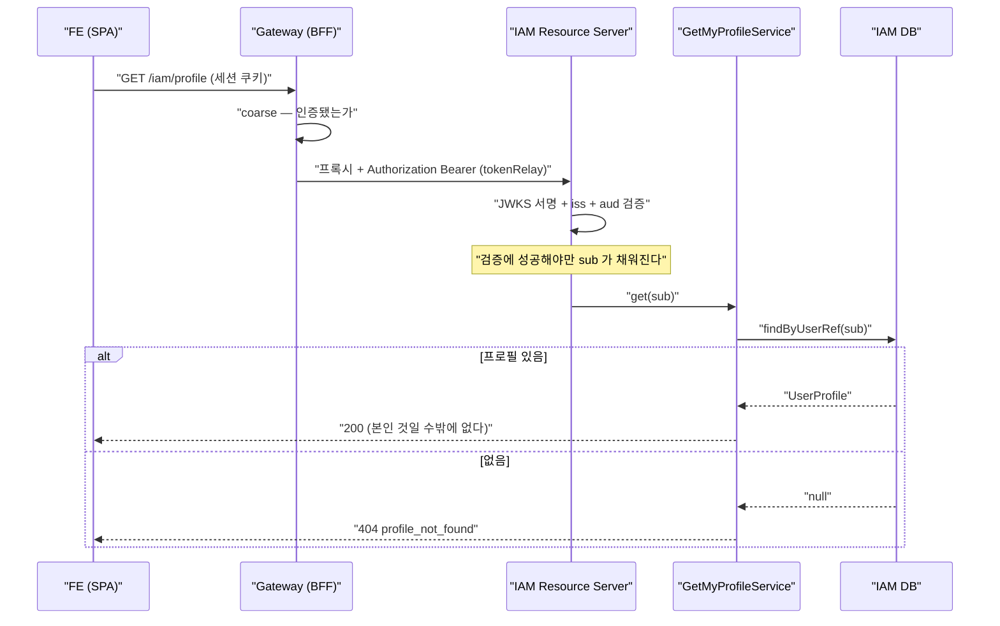

# 20. 호출자 신원으로 자원을 정하기 — 검사하지 않아도 되게 만드는 설계

> 한 줄 요약 — "이 자원이 호출자 것인가" 를 **잘 검사하는 것보다 검사할 필요가 없게 만드는 것**이 안전하다. 대상을 경로·본문이 아니라 검증된 토큰의 `sub` 로만 정하면 IDOR 이 성립할 자리가 사라진다. 그 대신 조회 키가 `email` 이 아니라 `UserRef` 여야 하고, 그 값은 outbox 워커가 채운다.
> 관련: Phase 8e · 코드 `iam/application/user/service/**` · `iam/adapter/iamIn/ProfileController.kt` · `iam/adapter/iamIn/ProblemDetailSecurityHandlers.kt`

## 1. 왜 필요했나

P8f 에서 `iam-authenticated` 라우트와 Resource Server 를 깔았지만, 그 뒤에 있는 것은 local 전용
프로브뿐이었다. **빈 관(pipe)** 만 깔려 있는 상태였다.

프로필 API 는 그 관을 처음으로 실제 쓰는 유스케이스다. 그러면서 지금까지 없던 질문이 하나 생긴다:

> 게이트웨이는 "인증됐는가" 까지만 본다(coarse). **"이 프로필이 호출자 것인가" 는 누가 보는가?**

`CLAUDE.md` 는 fine 인가를 다운스트림이 한다고 적어뒀고, 여기서는 IAM 자신이 다운스트림이다.
즉 이 판단은 IAM 이 해야 한다. 그런데 **어떻게** 하느냐가 이 문서의 주제다.

## 2. 익숙한 방식과의 대조

| | 흔히 쓰는 방식 | 여기서의 방식 | 왜 다른가 |
|---|---|---|---|
| 엔드포인트 | `GET /profiles/{id}` | `GET /iam/profile` | 대상을 지목할 수단을 주지 않는다 |
| 인가 | 매 핸들러에서 `id.owner == token.sub` 검사 | **검사 코드가 없다** | 검사할 것이 없다 |
| 실수했을 때 | 검사 한 곳을 빠뜨리면 전체가 뚫림 | 빠뜨릴 검사가 없음 | 실패 모드 자체가 다르다 |
| 조회 키 | DB PK 또는 email | **`UserRef`(= JWT `sub`)** | email 은 Keycloak 에서 바뀔 수 있다 |

세 번째 줄이 핵심이다. 검사 기반 설계는 **개발자가 매번 옳게 행동해야** 안전하다. 엔드포인트가
10개면 10번 옳아야 하고, 11번째를 추가하는 사람도 그 규칙을 알아야 한다. 반면 대상을 토큰에서만
가져오면 **틀릴 방법이 없다.**

## 3. 동작 원리



인가 판정이 다이어그램에 **박스로 나타나지 않는다.** `findByUserRef(sub)` 라는 한 줄이
"호출자 본인" 이라는 조건을 이미 포함하고 있기 때문이다.

### 3.1 왜 조회 키가 email 이 아닌가

가입 흐름은 email 로 찾는다 — 토큰이 없으니 그것뿐이다. 하지만 프로필 흐름에서 email 을 쓰면 안 된다.

- IAM DB 의 `email` 은 **가입 시점 사본**이고 SoT 는 Keycloak 이다(`UserProfile` KDoc).
- 사용자가 Keycloak 에서 이메일을 바꾸면 토큰의 `email` 클레임과 IAM DB 의 값이 어긋난다.
- 그 순간 조회가 **조용히 0건**이 되어 "로그인은 되는데 프로필이 없다" 가 된다.

`sub` 는 Keycloak 사용자 id 이고 불변이다. 그래서 `UserRef` 로 찾는다.

### 3.2 그 `UserRef` 는 outbox 워커가 채운다

```
가입 → user_profile(user_ref=NULL, PENDING_IDENTITY)  ← 이 시점엔 프로필 API 로 조회 불가
     → 워커가 Keycloak createUser → user_ref 채움, ACTIVE
     → 이제부터 GET /iam/profile 가능
```

즉 **프로필 API 는 outbox 워커가 동작해야 비로소 쓸 수 있다.** 둘은 별개 기능처럼 보이지만
`user_ref` 하나로 묶여 있다. 통합 테스트가 가입부터 시작하는 이유다.

## 4. 직접 확인한 것

### 4.1 실제 Keycloak 토큰인데 프로필이 없을 때

```
$ curl -H "Authorization: Bearer $TOKEN" http://localhost:8090/iam/profile
status=404
{"type":"about:blank","title":"Profile Not Found","status":404,
 "detail":"이 계정에 연결된 프로필이 없습니다. 가입 절차를 완료해야 합니다.",
 "instance":"/iam/profile","reasonCode":"profile_not_found"}
```

토큰(`sub=3c6164fa-…`)은 realm 이 발급한 진짜다. 서명·`iss`·`aud` 전부 통과했고 **인증은 성공**했다.
없는 것은 IAM 쪽 자원이라 404 다. 이 상태가 실재한다는 것 자체가 확인 대상이었다.

### 4.2 조회 · 부분 갱신 (실제 토큰)

`user_ref` 가 그 `sub` 인 프로필을 만들어두고 호출했다.

> 로그인 가능한 실사용자 토큰을 curl 로 얻을 수 없어(realm 이 Direct access grants OFF) **워커가
> 만들었을 법한 행을 SQL 로 직접 넣고** 검증했다. 검증 대상은 API 동작이므로 강도는 같다.
> 확인 후 그 행은 삭제했다.

```
# 조회
{"email":"p8e-live@example.local","displayName":"라이브 검증","locale":"ko-KR",
 "onboardingState":"ACTIVE","userRef":"3c6164fa-82fc-4643-a555-cbd7f48570b4",
 "consent":{"tosVersion":"v0","acceptedAt":"2026-07-26T11:30:36.264540Z","valid":false}}

# 표시 이름만 PATCH
$ curl -X PATCH -d '{"displayName":"부분 갱신됨"}' ...
{"displayName":"부분 갱신됨","locale":"ko-KR", ...}

# ⚠️ 응답이 아니라 DB 를 다시 읽어서 확인
$ psql -c "select display_name, locale, email from user_profile where user_ref='...'"
부분 갱신됨|ko-KR|p8e-live@example.local
```

`locale` 이 그대로다 — 보내지 않은 필드는 변경되지 않는다. `valid: false` 는 서버가 계산한 값으로,
저장된 `v0` 가 현재 정책(`v1`)과 다르다는 뜻이다.

### 4.3 약관 버전 대조

```
# 구버전(v0)에 동의 시도 — 현재 정책은 v1
status=409
{"title":"Consent Version Mismatch","status":409,"reasonCode":"consent_version_mismatch",
 "currentTosVersion":"v1"}

# 현재 버전(v1) 동의
{"tosVersion":"v1","acceptedAt":"2026-07-26T11:30:50.131076Z","valid":true}
$ psql -c "select consent_tos_version ..."  ->  v1
```

`currentTosVersion` 을 409 본문에 실어주므로 클라이언트가 **한 번의 왕복**으로 재시도할 수 있다.

### 4.4 에러 응답 형식 통일 (P8f 가 남긴 숙제)

```
# IAM 직접, 토큰 없음
status=401
{"type":"about:blank","title":"Unauthorized","status":401,
 "detail":"유효한 액세스 토큰이 필요합니다.","instance":"/iam/profile",
 "reasonCode":"authentication_required"}
WWW-Authenticate: Bearer

# IAM 직접, 위조 토큰
status=401
{... 같은 본문 ...}
WWW-Authenticate: Bearer error="invalid_token",
  error_description="An error occurred while attempting to decode the Jwt: Malformed token"

# 게이트웨이 경유, 세션 없음 (XHR)
{"title":"Authentication Required","status":401,"instance":"/iam/profile",
 "reasonCode":"authentication_required","loginUrl":"/oauth2/authorization/keycloak",
 "traceId":"a67b03a70153b07a4486056fcba4d3ed"}
```

P8f 까지 IAM 의 401 은 **본문이 비어 있었다.** 이제 GW 와 같은 `reasonCode` 어휘를 쓴다.
본문은 같고 **헤더의 상세는 다르다** — 거부 사유는 표준 `WWW-Authenticate` 에만 담는다(§5 함정 3).

### 4.5 자동 테스트

```
$ ./gradlew build -x integrationTest
BUILD SUCCESSFUL — 140개 통과, 실패 0   (P8f 121개 → 신규 19개)

$ ./gradlew :iam:integrationTest        # 실제 PostgreSQL
BUILD SUCCESSFUL — 17개 통과 (기존 9 + 프로필 8)
```

## 5. 함정 / 실패 모드

### 함정 1 — `@JvmInline value class` 를 Spring 주입 대상으로 쓰면 기동이 깨진다

약관 정책 값이 하나뿐이라 인라인 클래스로 만들었다.

```kotlin
@JvmInline
value class ConsentPolicy(val currentTosVersion: String)
```

컴파일 정상, 단위 테스트 정상, **슬라이스 테스트도 정상**. 그런데 통합 테스트에서 기동이 깨졌다:

```
Error creating bean with name 'getMyProfileService':
  Unsatisfied dependency expressed through constructor parameter 2:
  No qualifying bean of type 'kotlin.jvm.internal.DefaultConstructorMarker' available
```

인라인 클래스는 생성자 시그니처에서 원시 타입으로 **지워지고**, Kotlin 이 뒤에
`DefaultConstructorMarker` 를 덧붙인다. Spring 은 그것을 주입 대상으로 착각한다.

**언제 드러나느냐가 고약하다.** 단위 테스트는 객체를 직접 생성하고, 슬라이스 테스트는 InPort 를
모킹하므로 서비스를 아예 만들지 않는다. 풀 컨텍스트가 뜨는 곳에서만 터진다.

> 구분 기준: **빈으로 등록되는 타입에는 인라인 클래스를 쓰지 않는다.** 도메인 VO
> (`UserRef`, `TenantId`)는 값으로만 오가므로 여전히 인라인이 옳다.

### 함정 2 — 도메인을 바꿔놓고 `save` 를 잊으면 **응답은 성공으로 보인다**

JPA 습관대로면 더티체킹이 알아서 반영한다. 그런데 여기서는 도메인 모델이 영속 객체가 아니다
(ArchUnit 이 도메인의 `@Entity` 를 막았고, 어댑터가 별개 엔티티로 매핑한다).

`save` 를 빠뜨리면:
- DB 는 그대로
- **응답에는 바뀐 값이 담긴다**(메모리상 객체를 그대로 매핑하므로)
- 단위 테스트도 통과한다(리포지토리를 모킹하니까)

즉 **모든 신호가 성공을 가리키는데 데이터만 사라진다.** 새로고침해야 비로소 드러난다.
통합 테스트에서 **응답이 아니라 DB 를 다시 읽어** 확인하는 이유가 이것이다.

### 함정 3 — entry point 를 갈아끼우면 `WWW-Authenticate` 가 사라진다

Problem Detail 본문을 넣으면서 KDoc 에 이렇게 적었다:

> "Spring Security 가 이미 넣어둔 WWW-Authenticate 를 덮지 않는다"

**틀린 전제였다.** 그 헤더를 넣던 주체가 바로 내가 교체한 `BearerTokenAuthenticationEntryPoint` 다.
테스트가 잡아줬다:

```
java.lang.AssertionError: Response should contain header 'WWW-Authenticate'
```

해결: 상태코드와 헤더는 **표준 구현에 위임**하고 본문만 얹는다.

```kotlin
delegate.commence(request, response, authException)  // 상태코드 + WWW-Authenticate
response.writeProblem(objectMapper, request)         // 본문만 추가
```

상태코드까지 위임에 맡기는 것도 중요하다. Bearer 규약에서 실패는 401 만이 아니다
(`invalid_request` → 400, `insufficient_scope` → 403). 401 로 못 박으면 그 구분이 사라진다.

### 함정 4 — `oauth2ResourceServer` 는 **자기 entryPoint** 를 따로 본다

`exceptionHandling { authenticationEntryPoint(...) }` 만 지정하면 절반만 바뀐다.
`BearerTokenAuthenticationFilter` 가 인증에 실패했을 때는 `oauth2ResourceServer` 에 설정된
entry point 를 쓰기 때문이다. 결과적으로

- 토큰이 **아예 없는** 401 → 새 형식
- 토큰이 **잘못된** 401 → 옛 형식(빈 본문)

두 경로의 응답이 갈린다. 둘 다 지정해야 한다. 응답을 나란히 비교해보기 전엔 눈치채기 어렵다.

### 함정 5 — 프로필 없음에 401 을 주면 무한 로그인 루프

"인증 관련이니 401" 이 자연스러워 보이지만, 클라이언트는 401 을 보고 재로그인한다. 로그인은
성공한다(Keycloak 에 사용자가 있으니까). 그리고 다시 401 을 받는다. **끝나지 않는다.**

401 은 "네가 누군지 모르겠다" 이고 여기서는 안다. 없는 것은 자원이므로 404 다.
(Phase 4 에서 CSRF 403 에 리다이렉트를 주지 않기로 한 것과 같은 판단이다.)

### 함정 6 — ktlint: 파일 머리말 KDoc 은 다음 선언의 KDoc 과 충돌한다

```
ProfileSupport.kt:18:1 a KDoc may not be preceded by a KDoc (cannot be auto-corrected)
```

파일 전체를 설명하는 `/** ... */` 를 맨 위에 두고 바로 아래 함수에도 KDoc 을 달면 걸린다.
`package` 선언 앞이 아닌 이상 "파일 KDoc" 이라는 개념이 없어서, 그냥 **연속된 두 KDoc** 으로 읽힌다.
→ 머리말은 `//` 줄 주석으로 쓴다.

## 6. 남은 의문

- **JIT provisioning 을 할 것인가.** 지금은 Keycloak 에만 있는 사용자에게 404 를 준다. 자동 생성하면
  조회가 쓰기를 유발하고, **약관 동의 없는 프로필**이 조용히 생긴다. 그래서 안 했는데, 그러면
  페더레이션 IdP 로 처음 로그인한 사용자는 어떤 화면을 보게 되나? 온보딩 흐름을 아직 못 그렸다.
- **동시 수정 시 last-write-wins.** `@Version` 낙관적 락을 두지 않았다. 본인만 고치는 자원이라
  충돌 확률이 낮다고 판단했지만, 여러 탭·기기에서 동시에 고치는 경우를 실제로 재현해보지 않았다.
- **email 변경 유스케이스.** Keycloak 반영이 필요해 또 outbox 를 타야 한다. 그런데 가입과 달리
  **실패 시 되돌릴 것이 있다**(이전 email). outbox 레코드에 이전 값을 담아야 하는지, 아니면
  프로필에 "변경 대기 중" 상태를 두어야 하는지 정하지 못했다.
- **`CallerProbeController` 를 남길지.** 프로필 API 와 역할이 겹치지만, 프로필이 보여주지 않는
  **토큰 자체의 사실**(`aud`, `azp`)을 보여준다. 그 진단 가치 때문에 남겼는데, P9 에서 테넌트
  claim 이 붙으면 다시 판단해야 한다.
- **Result DTO 를 3개 유스케이스가 공유한다.** `MyProfileResult` 하나를 조회·수정·동의가 모두
  반환한다. 지금은 반환할 것이 같아서 자연스럽지만, 유스케이스마다 필요한 필드가 갈라지기 시작하면
  공유가 결합이 된다. 그 시점을 어떻게 알아챌지 기준이 없다.
