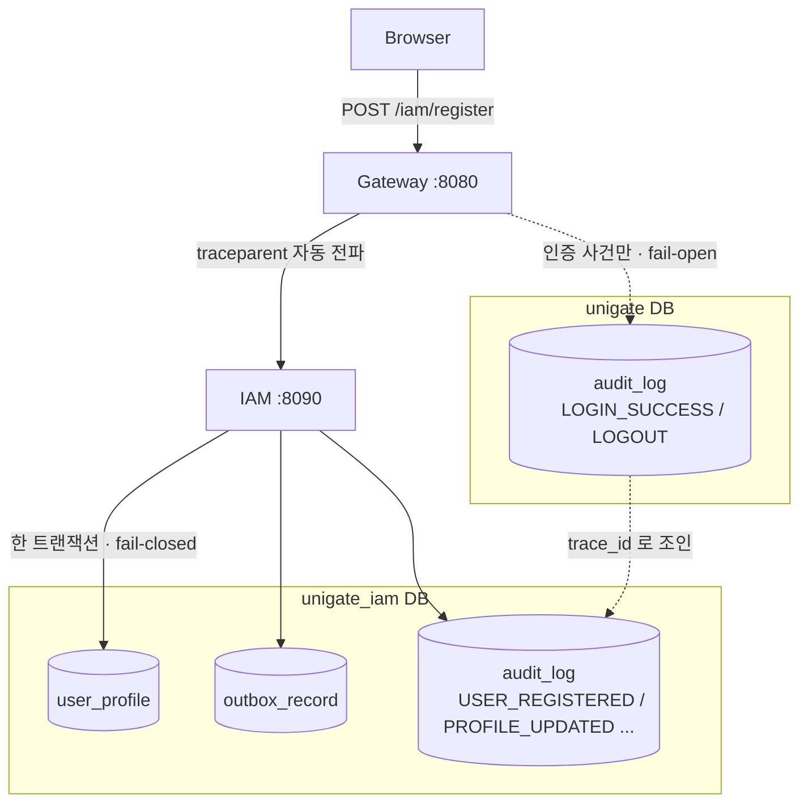

# 21. 감사 스트림 두 개 — 합치지 않고 traceId 로 잇기

> 한 줄 요약 — 감사를 **합칠 것인가**보다 먼저 정할 것은 **어느 트랜잭션에 속하는가**다. GW 는 감사 실패가 로그인을 막지 않게 삼키고(fail-open), IAM 은 감사를 업무 커밋의 일부로 둔다(fail-closed). 같은 "감사" 라는 이름 아래 정반대 선택이며, 둘 다 근거가 있다.
> 관련: Phase 8g · 코드 `iam/domain/audit/**` · `iam/adapter/jpaOut/JpaAuditLogAdapter.kt` · `iam/application/**/service/*.kt`

## 1. 왜 필요했나

Phase 4 에서 게이트웨이에 감사로그를 붙였다. 하지만 Phase 8 로 IAM 이 생긴 뒤, **도메인에서 일어나는
일은 어디에도 남지 않고 있었다.** 가입도, 프로필 수정도, 약관 동의도.

IAM 플랫폼에서 이건 단순한 누락이 아니다. "누가 언제 무엇에 동의했는가" 는 **법적 근거**로 쓰이는
기록이고, `user_profile.consent_*` 는 현재 상태만 담아 재동의하면 이전 동의가 덮인다. 즉 이력을
남길 곳이 아예 없었다.

그런데 감사를 추가하려는 순간 결정할 게 두 개 나온다. 코드보다 이게 먼저였다.

## 2. 익숙한 방식과의 대조

| | 흔한 방식 | 여기서의 선택 | 왜 |
|---|---|---|---|
| 저장 위치 | 감사 테이블 하나에 전부 | **모듈별로 분리** | DB 가 이미 갈려 있다. 합치려면 IAM 이 GW DB 에 datasource 를 하나 더 물어야 한다 |
| 상관관계 | 같은 테이블이라 그냥 조회 | **`trace_id` 로 조인** | 요청 하나가 두 서비스를 지나며 같은 trace 를 공유한다 |
| 트랜잭션 | 로깅처럼 취급(비동기·실패 무시) | **업무 커밋의 일부** | 감사 없는 도메인 변경을 만들지 않는다 |
| 이벤트 발행 | outbox 로 안전하게 | **outbox 를 쓰지 않는다** | outbox 는 *이중 시스템* 문제를 푸는 도구다. 여기는 단일 DB 쓰기다 |

네 번째 줄이 가장 헷갈렸다. 이 프로젝트는 가입에 이미 outbox 를 쓰고 있어서 "감사도 outbox 로" 가
자연스러워 보였다. 하지만 outbox 가 존재하는 이유는 **IAM DB 와 Keycloak 이라는 서로 다른 두
시스템**에 원자적으로 쓸 수 없기 때문이다. 감사는 `user_profile` 과 **같은 PostgreSQL** 로의 쓰기라
이미 같은 `@Transactional` 안에서 원자적이다. 여기에 outbox 를 얹으면 얻는 것 없이 지연과 실패
모드만 늘어난다 — 패턴의 cargo cult 다.

## 3. 동작 원리



### 3.1 트랜잭션 경계가 곧 정책이다

```kotlin
@Transactional
override fun register(command: RegisterUserCommand): RegisterUserResult {
    val saved = userProfileRepository.save(profile)   // 업무
    outboxPort.enqueue(...)                           // Keycloak 반영 지시
    recordAuditEventOutPort.record(...)               // 감사 ← 같은 커밋
    ...
}
```

세 쓰기가 함께 커밋되거나 함께 롤백된다. 그래서 **"가입은 됐는데 감사가 없다"** 도,
**"감사는 남았는데 가입은 실패했다"** 도 나올 수 없다.

대가는 가용성이다. 감사 테이블에 문제가 생기면 가입이 막힌다. **게이트웨이는 정반대로 택했다** —
`AuditingAuthenticationHandlers` 가 감사 실패를 삼켜 로그인을 막지 않는다. 판단 기준은 이랬다:

| | 막히면 | 기록이 없으면 |
|---|---|---|
| GW 인증 | 사용자가 **아무것도 못 한다** | 로그인 이력 일부 유실 |
| IAM 도메인 변경 | 그 기능만 못 쓴다 | **누가 무엇을 바꿨는지 영원히 모른다** |

### 3.2 `actor` 와 `target` 을 지금부터 나눈다

현재 유스케이스는 전부 자기 것만 다뤄 둘이 항상 같다. 그래도 컬럼을 나눴다.

Phase 9 의 관리 API 가 생긴 **뒤에** 컬럼을 추가하면 그 이전 기록은 영영 null 이다.
감사는 소급해 채울 수 없는 몇 안 되는 데이터다.

## 4. 직접 확인한 것

### 4.1 GW → IAM 으로 traceId 가 이어진다

게이트웨이를 통해 가입한 뒤, GW 로그의 traceId 와 IAM 감사 행의 traceId 를 대조했다.

```
# GW 로그
2026-07-26T20:54:07.010 INFO [unigate] [parallel-2]
  [83684b6c12bc265d43fd7cd6467fb41d-6c50e3cf45491a2b] RequestLoggingFilter : [pre ] POST /iam/register

# IAM 감사 (unigate_iam.audit_log)
USER_REGISTERED | (null) | p8g-…@example.local | 83684b6c12bc265d43fd7cd6467fb41d |
  {"locale": "ko-KR", "tosVersion": "v1", "onboardingState": "PENDING_IDENTITY"}
```

**같은 값이다.** 두 서비스가 각자 DB 에 쓰지만 한 요청으로 묶어 볼 수 있다는 뜻이다.
GW 가 별도 코드 없이 `traceparent` 를 전파하고(Phase 4), IAM 이 그 span 을 이어받아 감사에 찍었다.

같은 traceId 로 GW 의 `audit_log` 를 조회하면 **0건**이다. 정상이다 — GW 감사는 인증 사건만 남기고
프록시 요청은 대상이 아니다.

### 4.2 한 사용자의 이력이 재구성된다

가입 → 워커의 신원 생성 → 인증 라우트로 프로필 수정까지 한 뒤 조회했다.

```
event_type        | actor_ref  | target_ref | trace_id         | detail
------------------+------------+------------+------------------+--------------------------------
USER_REGISTERED   | (null)     | (null)     | 83684b6c12bc26…  | {"locale":"ko-KR","tosVersion":"v1",
                  |            |            |                  |  "onboardingState":"PENDING_IDENTITY"}
IDENTITY_CREATED  | (null)     | e7557037-… | c4e154a7e981ec…  | {"onboardingState":"ACTIVE"}
PROFILE_UPDATED   | 3c6164fa-… | 3c6164fa-… | 4d5e5f90a21f0f…  | {"displayName":{"after":"감사 확인용",
                  |            |            |                  |   "before":"P8G 감사"}}
```

읽히는 것들:
- **`actor_ref` 가 null 인 두 행이 각각 다른 이유다.** 가입은 미인증 요청(행위자 토큰이 없다),
  신원 생성은 워커(행위자가 사람이 아니다).
- **`target_ref` 는 신원 생성 이후에야 생긴다.** 그 전 구간의 사건은 `target_email` 로만 가리킬 수
  있고, 그게 그 컬럼이 존재하는 이유다.
- **세 행의 traceId 가 전부 다르다.** 서로 다른 요청/실행이다.

### 4.3 자동 테스트

```
$ ./gradlew build -x integrationTest
BUILD SUCCESSFUL — 147개 통과, 실패 0     (P8e 140 → 신규 7)

$ ./gradlew :iam:integrationTest          # 실제 PostgreSQL
BUILD SUCCESSFUL — 26개 통과              (P8e 17 → 신규 9)
```

통합 테스트가 겨냥한 것은 단위 테스트로 잡히지 않는 셋이다: **traceId 가 실제로 찍히는가**(포트를
모킹하면 그 코드가 아예 안 돈다), **JSONB 매핑이 되는가**(H2·mock 으로는 재현 안 됨),
**fail-closed 가 성립하는가**(진짜 트랜잭션이 있어야 확인된다).

## 5. 함정 / 실패 모드

### 함정 1 — "워커는 traceId 가 없다" 는 **틀린 예상이었다**

코드 주석에 이렇게 적었다:

> ⚠️ outbox 워커의 감사는 대체로 traceId 가 없다. 워커는 원래 요청과 다른 스레드·다른 시각에 돌기 때문이다.

띄워서 확인해보니 **값이 있었다.** Spring 의 `@Scheduled` 실행이 Micrometer observation 으로 감싸져
**자기 span** 을 만든다.

```
USER_REGISTERED   trace_id=83684b6c12bc265d43fd7cd6467fb41d   ← HTTP 요청
IDENTITY_CREATED  trace_id=c4e154a7e981ecfeb7a6fad78e822cb3   ← 스케줄러 (다른 trace)
```

결론("traceId 로는 가입과 신원 생성을 이을 수 없다")은 같지만 **이유가 다르다.** "없어서" 가 아니라
"달라서" 다. 전자로 이해하면 나중에 값이 찍히는 걸 보고 *"이제 이을 수 있겠네"* 라고 잘못 판단한다.

> 통합 테스트에서는 `processOne()` 을 직접 부르므로 null 이 나온다. 그래서 단언을
> `isNull()` 이 아니라 **`isNotEqualTo(가입 traceId)`** 로 바꿨다 — 지켜야 할 성질은 "없다" 가
> 아니라 "같지 않다" 이고, 그건 테스트와 운영 양쪽에서 성립한다.
> **테스트 환경의 우연을 단언하면 그게 규칙인 줄 알게 된다.**

### 함정 2 — 변경 전 값을 붙잡는 위치

```kotlin
val previousDisplayName = profile.displayName   // ← 반드시 변경 **전**
command.displayName?.let(profile::changeDisplayName)
```

이 두 줄을 아래로 옮기면 before 와 after 가 같은 값이 된다. **기록은 남지만 아무 정보도 담지 않는다.**
"프로필이 수정됐다" 만 알고 무엇이 어떻게 바뀌었는지는 모르는 감사가 되는데, 그건 감사가 아니다.
에러도 경고도 없다.

### 함정 3 — jsonb 는 되읽을 때 **정규화되어 있다**

```
Expecting actual:
  "{"tosVersion": "v2", "previousVersion": "v1"}"
to contain:
  ""previousVersion":"v1""
```

넣을 때는 Jackson 이 공백 없이 만들지만, PostgreSQL 이 jsonb 로 파싱해 저장하고 되돌려줄 때는
**공백과 키 순서가 달라진다.** 문자열로 단언하면 내용이 맞는데도 실패한다.
→ 파싱해서 **구조로** 비교한다.

### 함정 4 — Hibernate 에서 jsonb 컬럼에 String 을 넣으면 거절당한다

```
column "detail" is of type jsonb but expression is of type character varying
```

`@JdbcTypeCode(SqlTypes.JSON)` 하나로 해결된다. 게이트웨이는 R2DBC 라 같은 문제를 SQL 의
`CAST(:detail AS jsonb)` 로 풀었다 — **같은 문제, 다른 층위의 해법**이다.

### 함정 5 — 재시도 실패까지 감사에 남기면 확정 사건이 묻힌다

outbox 워커의 `IdentityProviderUnavailableException` 경로에서는 **감사를 남기지 않는다.**
재시도 대상 실패는 아직 진행 중인 상태이지 확정된 사건이 아니다. 남기면 Keycloak 이 몇 분 흔들릴
때마다 같은 사건이 10건씩 쌓여, 정작 봐야 할 `IDENTITY_CREATION_FAILED` 가 그 안에 묻힌다.

같은 이유로 **조회는 감사하지 않는다.** 남기면 감사 테이블이 사실상 액세스 로그가 된다.
감사 스트림의 가치는 "무엇이 담겼는가" 만큼 **"무엇을 담지 않았는가"** 에서 온다.

### 함정 6 — 영구 실패 감사는 `catch` 블록 **안**에 있어야 한다

```kotlin
} catch (e: IdentityAlreadyExistsException) {
    markProfileIdentityFailed(record.payload)
    outboxPort.update(record.failedPermanently("identity_already_exists"))
    recordIdentityFailure(record.payload, "identity_already_exists")   // ← 여기
}
```

이 경로는 예외를 삼켜 **실패를 상태로 기록하고 커밋한다.** 그래서 감사도 함께 커밋된다.
밖으로 빼면 정상 경로에서도 실행되고, 예외를 다시 던지는 구조였다면 롤백돼 사라진다.

## 6. 남은 의문

- **감사 보존 정책이 없다.** `audit_log` 는 무한히 쌓인다. 법적 보존 기간(보통 수년)과 스토리지
  비용의 균형을 어디서 잡을지, 파티셔닝을 쓸지 아카이빙을 할지 정하지 않았다.
- **fail-closed 의 실제 위험을 재현해보지 않았다.** 감사 테이블에 문제가 생겼을 때 가입이 정말
  전부 막히는지, 그때 어떤 에러가 사용자에게 보이는지 확인하지 못했다. 이 선택의 대가를 눈으로
  본 적이 없다는 뜻이다.
- **감사 조회 API 가 없다.** 지금은 운영자가 SQL 로 본다. API 를 만들면 그 자체가 인가 설계를
  요구한다 — 사용자가 자기 감사를 볼 수 있어야 하나? 관리자는 누구의 것까지?
- **두 스트림을 실제로 조인해본 적은 없다.** traceId 가 일치하는 것은 확인했지만, GW 감사에 행이
  남는 경우(로그인)와 IAM 감사를 **함께** 조회하려면 브라우저 로그인이 필요해 아직 못 했다.
  DB 가 다르므로 SQL 한 방으로는 안 되고, 조회 도구(로그 수집기·BI)가 필요하다는 점도 미해결이다.
- **`detail` 스키마가 자유 형식이다.** 이벤트 종류마다 키가 다르고 강제되지 않는다. 지금은
  종류가 적어 괜찮지만, 늘어나면 "이 이벤트의 detail 에 뭐가 들어 있더라" 를 코드에서 찾아야 한다.
