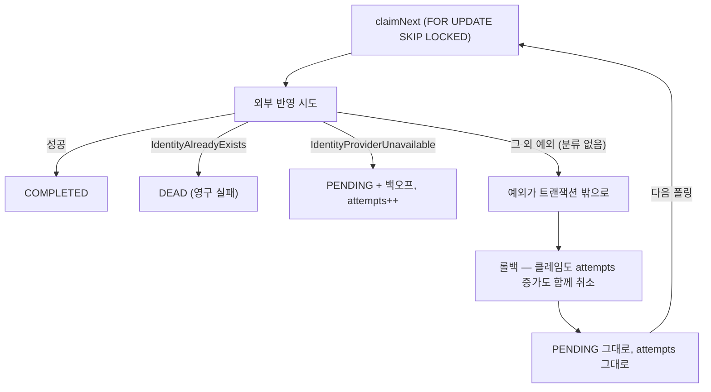

# 22. 죽지 못하는 레코드 — outbox DLQ 와 회로 차단기

> 재시도 상한이 있어도 **상한에 닿지 못하는 실패 경로**가 있다. 그리고 재시도 횟수를 줄이는 결정은
> 회로 차단기와 짝을 이룰 때만 안전하다.
> 관련: Phase 9b · 커밋 `1ac4537` · 코드 `iam/src/main/kotlin/.../application/outbox/service/OutboxProcessor.kt`

## 1. 왜 필요했나

Phase 9d 에서 멤버십을 Keycloak group 에 투영해야 한다. 그건 **IAM DB 쓰기 + Keycloak 쓰기**라
Phase 8d 에서 만든 outbox 를 그대로 쓰게 된다. 즉 outbox 의 **두 번째 소비자**가 생긴다.

그 전에 기존 워커를 다시 읽다가, 재시도 상한(`MAX_ATTEMPTS`)이 **닿지 않는 경로**가 있다는 것을
발견했다. 소비자를 늘리기 전에 닫아야 했다 — 약한 기반 위에 사용처를 늘리면 같은 결함이 그대로
복제된다.

계기는 "DEAD 레코드를 어떻게 운영하나(알림·재처리)"라는 미해결 항목이었고, 사내 프로젝트의 DLQ
구현을 참고하면서 **저장소를 바꿔야 하는가**라는 질문으로 번졌다.

## 2. 익숙한 방식과의 대조

| | 메시지 브로커 기반 DLQ | 여기서의 방식 (DB) | 왜 다른가 |
|---|---|---|---|
| 실패한 메시지 | ACK 를 생략해 pending 유지 → 재전달 | 행의 `status`·`next_attempt_at` 갱신 | 브로커가 없다. 워커가 DB 에서 집어 **외부 API 를 직접** 부른다 |
| DLQ 이관 | `XADD` 한 번(같은 매체) | 같은 행의 `status = DEAD` | 매체가 같아야 "이관 실패 시 원본 ACK 생략" 같은 수가 성립한다 |
| 재시도 횟수 | 브로커의 delivery count | 컬럼 `attempts` | 같은 개념이지만 **시간 척도가 다르다**(§5 함정 2) |
| 재처리 | DLQ → 원본 스트림으로 재주입 | `status` 를 PENDING 으로 되돌림 | 같은 테이블이라 훨씬 단순하다 |

### 왜 Valkey Streams 로 옮기지 않았나

이미 Valkey 가 게이트웨이에서 돌고 있어 자연스러운 선택으로 보였다. 세 가지 때문에 접었다.

1. **이중 쓰기가 되살아난다.** `outbox_record` 를 DEAD 로 UPDATE 하는 것과 DLQ 스트림에 쓰는 것은
   서로 다른 시스템이라 원자적이지 않다. 스트림→스트림이면 "이관 실패 시 ACK 생략"으로 풀 수 있지만
   **DB→스트림에는 그 수가 없다.** outbox 를 도입한 이유(원자성이 필요한 지점을 DB 한 곳으로 모은다)를
   정면으로 되돌리는 셈이다.
2. **IAM 에는 Valkey 연결이 아예 없다.** 외부 의존이 PostgreSQL·Keycloak 둘뿐인데, **장애 때 쓰는
   기능**인 DLQ 를 새 인프라 위에 올리면 "장애 때 DLQ 도 못 쓴다"가 된다.
3. **스트림의 강점이 이 용도에 필요 없다.** DEAD 는 정상 운영 시 0건이고 재처리는 관리자 수동이다.
   고처리량 fan-out·consumer group 분배 중 쓸 게 없다.

> 브로커가 정말 맞는 시점은 **IAM 이 다른 서비스에 이벤트를 발행하고 소비자가 여럿이 될 때**다.
> 지금은 소비자가 Keycloak 하나라 브로커가 푸는 문제가 없다. 도구가 아니라 **문제의 모양**이 기준이다.

## 3. 동작 원리

### 3.1 상한에 닿지 못하는 실패 경로



마지막 경로가 문제다. `@Transactional` 이 롤백하는 대상에는 **클레임과 `attempts` 증가도 포함**된다.
그래서 레코드는 아무 흔적 없이 원래 상태로 돌아가고, 다음 폴링에서 다시 집힌다. 재시도 상한도 DEAD 도
이 경로에는 **영원히 닿지 못한다.**

실제로 그런 경로가 둘 있었다.

- `createKeycloakUser()` 안의 `?: error("outbox 지시에 대응하는 프로필이 없습니다")` → `IllegalStateException`
- payload 역직렬화 실패

둘 다 **재시도로 낫지 않는** 버그성 실패인데 무한히 재시도됐다.

### 3.2 분류를 타입으로 드러내기

처리(try/catch)와 반영(상태 전이·회로·감사)이 한 `try` 블록에 섞여 있어 "이 예외가 어떤 상태로
가는가"가 코드를 다 읽어야 보였다. 분류를 값으로 만들어 분리했다.

```kotlin
private sealed interface ProcessOutcome {
  data object Success : ProcessOutcome
  data class Retryable(val reason: String, val exceptionClass: String) : ProcessOutcome
  data class Permanent(
    val reason: String,
    val exceptionClass: String,
    val onPermanentFailure: (payload: String) -> Unit,
  ) : ProcessOutcome
}
```

그리고 마지막에 이걸 넣었다.

```kotlin
} catch (e: Exception) {
  ProcessOutcome.Permanent("unclassified_failure", e.javaClass.name) { ... }
}
```

**"모르는 실패는 일단 재시도"가 아니라 "모르는 실패는 사람이 봐야 한다"** 가 맞는 기본값이다.
모르는 것을 자동으로 반복하는 것은 문제를 감출 뿐이다.

### 3.3 회로 차단기 — 진짜 이유는 성능이 아니다

재시도 상한을 10 → 5 로 줄이려 했다. 그런데 그것만 하면 **지금보다 나빠진다.**

```
Keycloak 다운 → 워커가 계속 집어 실패 → attempts 소진 → 잘못 없는 정상 가입이 DEAD
```

10회는 백오프 상한(5분)까지 타면 25분 남짓 버틴다. 5회면 약 2.5분이다. 즉 **짧은 롤링 재시작에도
정상 건이 죽는다.** 여기서 깨달은 것은 10이라는 숫자가 두 가지를 **한 축에 뭉뚱그린** 값이었다는 점이다.

| 질문 | 누가 답해야 하나 |
|---|---|
| "외부 시스템이 죽었는가" | 회로 차단기 — **클레임 자체를 멈춘다** |
| "이 레코드가 가망 있는가" | `MAX_ATTEMPTS` |

축을 나누자 5로 충분해졌다. 외부 장애 동안에는 `attempts` 가 아예 오르지 않기 때문이다.

```kotlin
if (!circuit.canAttempt()) {
  log.warn("outbox 회로 열림 — 이번 주기는 클레임하지 않는다")
  return false
}
```

**클레임보다 먼저** 묻는 것이 핵심이다. 집고 나서 판단하면 이미 `attempts` 가 오른 뒤다.

### 3.4 왜 resilience4j 를 쓰지 않았나

게이트웨이는 Phase 3 에서 resilience4j 를 썼다. 여기서는 쓰지 않았다.

| | resilience4j | 여기서 필요한 것 |
|---|---|---|
| 모델 | 호출을 **감싼다**(decorator) | 호출 **전에 상태를 묻는다**(gate) |
| 동시성 제어 | 슬라이딩 윈도우·half-open 동시 호출 제한 | 워커는 한 번에 1건 순차 처리라 불필요 |
| 레이어 | 기술 의존 → 포트·어댑터가 필요 | 순수 Kotlin 이라 `application` 에 그대로 |

필요한 것이 상태 3개와 카운터 하나뿐인데 라이브러리를 들이면 **포트를 하나 더 만들게 된다**.
Phase 5 에서 경계했던 "소비자 없는 추상화"가 늘어나는 방향이다.

대신 VT 함정을 피해야 했다. `synchronized` 안에서 블로킹하면 캐리어 스레드가 pin 되므로
(P8c 에서 `ReentrantLock` 을 택한 것과 같은 이유), 상태를 불변 스냅샷으로 묶어 `AtomicReference` 로
통째 교체한다 — 락 자체가 없다.

## 4. 직접 확인한 것

### 4.1 적응형 폴링 — 간격이 실제로 배가된다

고정 5초를 버리고 "처리했으면 500ms 리셋, 비었으면 배로 늘려 10초 상한"으로 바꿨다.
`@Scheduled(fixedDelay)` 는 기동 시 값이 고정되어 런타임에 못 바꾸므로 `TaskScheduler` 로 자기
재예약하는 구조가 됐다.

실제로 띄워 클레임 쿼리가 나간 시각을 뽑았다.

```
11:40:49.611 → 50.648     (+1.0s)
             → 52.657     (+2.0s)
             → 56.668     (+4.0s)
             → 41:04.685  (+8.0s)
             → 41:14.703  (+10.0s)  ← 상한 도달
             → 41:24.715  (+10.0s)
             → 41:34.731  (+10.0s)
```

### 4.2 마이그레이션과 스키마

```
Migrating schema "public" to version "4 - add outbox dlq metadata"
Successfully applied 1 migration to schema "public", now at version v4 (execution time 00:00.022s)
```

### 4.3 테스트

```
$ ./gradlew build -x :iam:integrationTest    →  BUILD SUCCESSFUL (단위·슬라이스 117개)
$ ./gradlew :iam:integrationTest             →  33개 PASSED (신규 5)
```

신규 통합 테스트가 확인한 것: DEAD 메타(`dead_at`·`last_exception_class`)의 DB 왕복, 보존 기간이
지난 `COMPLETED` 삭제, **`DEAD` 는 365일이 지나도 삭제되지 않음**, 상태별 집계, 게이지의 registry
등록과 값.

### 4.4 오진 하나 — 401 을 "등록 실패"로 읽었다

게이지를 만든 뒤 확인하려고 메트릭을 긁었다.

```
$ curl -s http://localhost:8090/actuator/prometheus | grep unigate_iam_outbox_records
(아무것도 없음)

$ grep -c "count(*)" boot.log
0
```

"게이지가 등록되지 않았고, 그래서 `count` 쿼리도 안 나갔다"고 판단해 `MeterBinder` 를 직접 등록
방식으로 바꿨다. **그런데 바꿔도 똑같았다.** 그제야 응답 본문을 봤다.

```json
{"type":"about:blank","title":"Unauthorized","status":401,
 "detail":"유효한 액세스 토큰이 필요합니다.","instance":"/actuator/prometheus",
 "reasonCode":"authentication_required"}
```

`/actuator/prometheus` 는 **인증이 필요하다**. `IamSecurityConfig.PUBLIC_PATHS` 가 health·info 만 열고
prometheus 는 P8f 에서 **의도적으로 제외**했다(메트릭에 내부 구조가 드러난다).

스크랩이 거부되니 게이지 함수가 호출되지 않았고, 그래서 `count` 쿼리도 로그에 없었다 —
**증거가 오진을 뒷받침하는 것처럼 보였다.** `MeterBinder` 로 되돌리고, registry 를 직접 조회하는
통합 테스트로 확인했다.

```kotlin
val gauge = meterRegistry.find("unigate.iam.outbox.records")
  .tag("status", OutboxStatus.DEAD.name).gauge()
assertThat(gauge!!.value()).isEqualTo(1.0)
```

## 5. 함정 / 실패 모드

### 함정 1 — 롤백은 "실패 기록"까지 되돌린다

가장 값진 배움이다. 실패를 **상태로 기록**하려면 그 트랜잭션이 **커밋돼야** 한다. 예외를 그대로
전파시키면 기록 의도 자체가 롤백된다.

> 증상: 로그에 같은 오류가 5초마다 영원히 찍힌다. `attempts` 는 계속 0이다.
> 원인: 미분류 예외 → 트랜잭션 롤백 → 클레임과 attempts 증가가 함께 취소.
> 해결: 예외를 잡아 상태 전이로 바꾼 뒤 커밋시킨다.

남아 있는 한계도 알고 둔다. **DB 예외로 트랜잭션이 이미 abort 된 경우**에는 뒤이은 `update` 도
실패해 결국 롤백된다. 그건 정상 동작에 가깝다 — DB 가 아픈 상황에서 DEAD 를 확정하는 것이 더 위험하다.

### 함정 2 — 같은 숫자라도 척도가 다르면 의미가 다르다

참고한 구현의 `maxDeliveryCount` 기본값이 5였다. 그대로 가져오려다 멈췄다. 그쪽 5는 **브로커 재전달
횟수**이고 간격은 pending 스캔 주기다. 이쪽 5는 **지수 백오프(10초~5분) 위의 횟수**라 버티는 시간이
전혀 다르다. **숫자를 옮길 때는 그 숫자가 사는 시간 축을 함께 봐야 한다.**

### 함정 3 — 상태기계가 엄격하면 재시도 경로에서 터진다

테스트가 잡아준 것이다.

```
InvalidStateTransition: 온보딩 상태를 IDENTITY_FAILED 에서 IDENTITY_FAILED 로 바꿀 수 없습니다
```

outbox 는 **최소 1회 실행**이라 같은 지시가 두 번 올 수 있고, 관리자가 DEAD 를 재처리하면 확실히 두 번
온다. 그때 이미 실패 상태인 프로필에 또 `failIdentity()` 를 부르면 도메인이 거부하고, 그 예외가
미분류로 잡혀 **실패 처리 도중에 또 실패**한다.

도메인 규칙을 느슨하게 푸는 대신 워커에서 걸렀다. 상태기계는 엄격한 편이 낫고, **"같은 결과라면
다시 하지 않는다"는 호출자의 책임**이다.

### 함정 4 — 검증 경로가 막혀 있으면 없는 것처럼 보인다

§4.4 의 401 오진이다. 교훈은 두 가지다.

- **응답 본문을 먼저 본다.** grep 결과가 비었다는 것은 "값이 없다"가 아니라 "패턴이 없다"일 뿐이다.
- 고쳤는데 증상이 그대로면 **진단을 의심한다.** 첫 수정이 안 먹혔을 때 멈췄어야 했다.

### 함정 5 — 벌크 삭제에서 조건 하나가 안전장치다

```sql
DELETE FROM outbox_record WHERE status = 'COMPLETED' AND updated_at < :threshold
```

`status` 조건을 빼면 **DEAD 까지 지운다.** 사람이 봐야 할 것을 조용히 없애는 것이라, outbox 의
"잃어버리지 않는다"는 약속이 깨진다. 그래서 "DEAD 는 365일이 지나도 남는다"를 테스트로 고정했다.

`deleteBy...` 파생 쿼리를 쓰지 않은 이유도 있다 — 그건 대상을 **전부 엔티티로 조회한 뒤 한 건씩**
삭제한다. 정리 대상이 수만 건이면 그만큼 힙에 올라온다.

## 6. 남은 의문

- **회로 차단기가 인스턴스 로컬이다.** 인스턴스 10개면 각자 5번씩, 총 50번 실패를 겪고서야 전부
  멈춘다. 공유하지 않은 것은 의도였지만(장애 대응 장치가 또 다른 인프라에 의존하면 안 된다),
  인스턴스 수가 커지면 이 대가가 어디서 문제가 되는지 아직 모른다.
- **`OPEN_DURATION` 30초의 근거가 약하다.** Keycloak 롤링 재시작 시간을 짐작해 잡았을 뿐 실측하지
  않았다. 실제 재시작을 재보고 조정해야 한다.
- **DB 예외로 트랜잭션이 abort 된 경우는 여전히 재시도 루프**다(§5 함정 1). "정상에 가깝다"고
  판단했지만, DB 가 오래 아프면 그 사이 로그가 어떻게 쌓이는지는 겪어보지 않았다.
- **DEAD 재처리를 아직 못 한다.** 메트릭으로 "쌓였다"는 것만 알 수 있고, 조회·재주입 수단은 P9c 다.
  그때 §5 함정 3(멱등성)이 실제로 시험될 것이다.
- 적응형 폴링의 상한 10초가 곧 **최악의 반영 지연**이다. 가입 직후 로그인 UX 와 어떻게 맞물리는지는
  FE 를 붙여봐야 안다.
