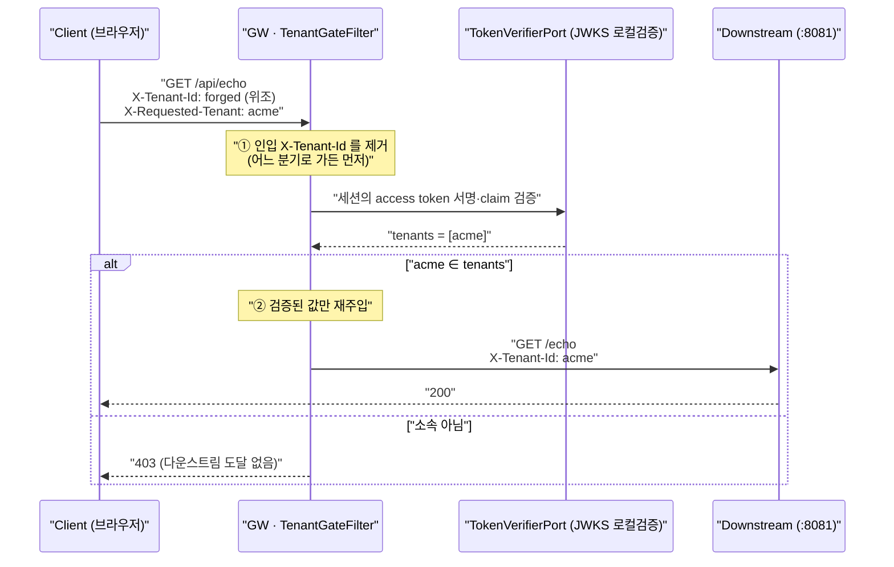

# 23. 게이트웨이의 첫 인가 — coarse 테넌트 게이트와 "제거 후 재주입"

> 게이트웨이는 **소속인지**까지만 본다. 그 판단의 절반은 통과·거부가 아니라 **인입 헤더를 지우는 것**이다.
> 관련: Phase 9f · 커밋 `5b57742` · 코드 `gateway/src/main/kotlin/me/ramos/unigate/adapter/gatewayIn/TenantGateFilter.kt`

## 1. 왜 필요했나

Phase 9e 에서 토큰에 `groups` claim(`/tenants/acme`)이 실리기 시작했다. 그런데 **그 claim 을 읽는
코드가 아직 없었다.** 게이트웨이의 인가는 Phase 1 이후 줄곧 "인증됐는가" 하나뿐이었고
(`anyExchange().authenticated()`), 그건 인증이지 인가가 아니다.

멀티테넌시에서 다운스트림은 "이 요청이 **어느 테넌트의** 요청인가"를 알아야 한다. 이 값을 어디서
얻는가가 문제였다.

| 후보 | 왜 안 되나 |
|---|---|
| 클라이언트가 보낸 `X-Tenant-Id` 를 그대로 쓴다 | 헤더 하나 바꾸면 남의 테넌트 데이터를 읽는다. 인증은 통과한 **정상 사용자**가 공격자가 된다 |
| 다운스트림이 토큰을 직접 파싱한다 | 다운스트림마다 같은 코드를 복제한다. 하나가 빠뜨리면 그 서비스만 뚫린다 |
| 게이트웨이가 IAM 에 멤버십을 물어본다 | 모든 요청이 IAM 호출을 동반한다. 게이트웨이가 도메인을 아는 God-gateway 로 미끄러진다 |

남는 답이 **"게이트웨이가 토큰 claim 으로 검증해서 헤더로 넣어준다"** 였다. 이게 Phase 9f 다.

## 2. 익숙한 방식과의 대조

|  | Servlet MVC (`iam` 모듈에서 실제로 쓰는 방식) | 게이트웨이 (여기서의 방식) | 왜 다른가 |
|---|---|---|---|
| 인가를 거는 위치 | `@PreAuthorize` / `SecurityFilterChain` 의 경로 규칙 | `GatewayFilter` — **라우트 정의에 붙인다** | 게이트웨이엔 컨트롤러가 없다. 판단 대상이 "메서드"가 아니라 "라우트"다 |
| 판단 근거 | 필요하면 DB 를 조회한다 (`membershipRepository`) | **토큰 claim 뿐.** 도메인 조회 금지 | 조회를 허용하는 순간 모든 요청에 왕복이 붙고, 게이트웨이가 도메인을 알게 된다 |
| 판단의 깊이 | "이 자원의 소유자인가" 까지 (fine) | "이 테넌트 소속인가" 까지 (coarse) | 게이트웨이는 자원을 모른다. 자원 상태를 아는 쪽이 최종 판단을 해야 한다 |
| 인가 실패 응답 | 403 (`AccessDeniedException`) | 403 (`ResponseStatusException`) | 같다. **401 이 아닌 것**이 중요하다 — §5 함정 4 |
| 신뢰하는 입력 | 검증된 `Authentication` | 검증된 토큰 claim. **인입 헤더는 전부 불신** | 게이트웨이는 신뢰 경계 그 자체다 |
| 적용 범위 | 기본이 "전부 적용" | **라우트별로 켠다** | actuator·fallback 은 테넌트와 무관하다. 전역 필터로 만들면 그 경로까지 지나간다 |

> **`@PreAuthorize` 로는 못 하는 이유가 하나 더 있다.** 게이트웨이는 WebFlux 라 메서드가 아니라
> `Mono` 파이프라인 위에서 판단해야 한다. 그리고 판단 결과를 **다음 홉의 요청 헤더로 바꿔 써야**
> 하는데, 이건 인가 어노테이션의 일이 아니다 — 인가와 요청 변형이 한 자리에서 일어난다.

## 3. 동작 원리

### 3.1 두 헤더를 이름으로 갈라 놓는다

```
X-Requested-Tenant   클라이언트의 주장.   신뢰하지 않는다. 검증의 입력.
X-Tenant-Id          게이트가 검증한 값.  다운스트림이 신뢰한다. 검증의 출력.
```

같은 이름을 썼다면 코드 안에서 "검증 전 값"과 "검증 후 값"이 **구별되지 않는다.** 이름이 다르면
`X-Tenant-Id` 를 읽는 코드는 무조건 검증된 값을 읽는다는 뜻이 된다.

### 3.2 흐름



### 3.3 "제거"와 "덮어쓰기"는 다른 연산이다

이 필터에서 가장 중요한 줄은 통과·거부 분기가 아니라 **맨 앞의 제거**다.

```kotlin
// ⚠️ **가장 먼저** 인입 헤더를 지운다. 아래 어느 분기로 가든 이 제거는 유효해야 한다.
val stripped = stripInboundTenantHeader(exchange)

val requested = stripped.request.headers.getFirst(HEADER_REQUESTED_TENANT)
if (requested.isNullOrBlank()) {
    return@GatewayFilter chain.filter(stripped)   // 통과시키되, 헤더는 이미 없다
}
```

덮어쓰기만 했다면 **덮어쓸 값이 없는 요청**(테넌트를 지정하지 않은 요청)에서 인입 헤더가 그대로
흘러간다. 그 순간 위조 헤더가 다운스트림에 도달한다.

같은 이유로 **게이트를 걸지 않는 라우트**(IAM 관리 평면)에서도 `removeRequestHeader` 로 지운다.
게이트를 안 거치는 경로일수록 새어나갈 위험이 크다.

> 이건 Phase 1 Step 7 에서 `Authorization` 헤더에 적용한 원칙과 **완전히 같다**
> ([06](06-gateway-trust-boundary-header-forgery.md)). 신뢰 정보는 존재 자체를 지우고,
> 게이트웨이가 만든 값만 넣는다.

### 3.4 자기가 받은 토큰을 왜 다시 검증하나

Phase 2 에서 만들고 **소비자가 없던** `TokenVerifierPort` 가 여기서 처음 쓰인다. 세션에서 꺼낸
토큰인데 서명을 다시 보는 건 중복처럼 보인다. 그대로 둔 이유:

1. **세션 저장소(Valkey)가 오염되는 경로를 배제할 수 없다.** 인가 판단의 입력은 검증된 값이어야 한다.
2. **비용이 작다.** JWKS 가 캐시돼 있어 네트워크 왕복 없는 로컬 서명 검증이다
   ([10](10-jwks-local-verification.md)). Phase 2 의 설계 목적이 정확히 이것이었다.

### 3.5 판단할 수 없으면 거부한다 (fail-closed)

```kotlin
.flatMap { token -> mono { tokenVerifier.verify(token).tenants } }
// 토큰을 못 얻으면 소속이 없는 것으로 본다 — **열어주지 않는다.**
.defaultIfEmpty(emptyList())
```

빈 리스트에는 어떤 테넌트도 속하지 않으므로 403 이 된다. 인가에서 "판단할 수 없음"은 통과가 아니다.

> 감사 로그의 fail-open 과 **정반대**인데 둘 다 근거가 있다 —
> 기록을 못 남기는 것과 권한을 잘못 여는 것은 손해의 성질이 다르다
> ([21](21-two-audit-streams-and-transaction-boundary.md) §3).

## 4. 직접 확인한 것

GW 는 Phase 9f 코드로 재기동한 상태(`15:10` 시점, PID 74717), IAM `:8090`, 샘플 다운스트림 `:8081`
기동. 브라우저로 **carol** 로그인(realm 이 Direct access grants OFF 라 curl 로는 실사용자 토큰을 못 얻는다).

### 4.1 출발점 — 토큰에 무엇이 실려 있나

```js
await fetch('/iam/debug/whoami', {credentials:'same-origin'}).then(r=>r.text())
```

```json
{"subject":"ea1271ad-...","preferredUsername":"carol","email":"carol@example.local",
 "issuer":"https://<keycloak-host>/realms/test",
 "audience":["unigate-iam","unigate-downstream-demo","account"],
 "authorizedParty":"unigate-client",
 "groups":["/tenants/acme","/unigate-users"],"tenants":["acme"],
 "expiresAt":"2026-07-27T06:15:02Z"}
```

DB 의 멤버십과 일치한다.

```
$ docker exec unigate-postgres psql -U testuser -d unigate_iam -c "select tenant_id, user_ref, role, status from membership;"
 tenant_id |               user_ref               |     role     | status
-----------+--------------------------------------+--------------+--------
 acme      | ea1271ad-8bc3-4a2b-961a-1bb8857a2e40 | tenant-admin | ACTIVE
```

### 4.2 게이트를 거는 라우트(`/api/**`) — 4가지

브라우저 콘솔에서 같은 세션으로 4번 호출하고, 다운스트림이 **실제로 받은** 헤더를 되비추게 했다.

```js
const call = async (name, headers) => {
  const r = await fetch('/api/echo', {credentials:'same-origin', headers});
  const body = await r.json();
  return {case:name, status:r.status, downstreamSaw: pick(body.headers), principal: body.principal};
};
```

```json
[
 {"case":"① 소속 테넌트 요청","status":200,
  "downstreamSaw":{"x-requested-tenant":"acme","x-tenant-id":"acme"},
  "principal":"ea1271ad-..."},
 {"case":"② 비소속 테넌트 요청","status":403,
  "downstreamSaw":{}},
 {"case":"③ 위조 X-Tenant-Id 만","status":200,
  "downstreamSaw":{},
  "principal":"ea1271ad-..."},
 {"case":"④ 위조 + 정상 동시","status":200,
  "downstreamSaw":{"x-requested-tenant":"acme","x-tenant-id":"acme"},
  "principal":"ea1271ad-..."}
]
```

관찰:
- **③ 이 이 필터의 핵심이다.** 게이트가 판단할 대상이 없어 요청은 통과했는데(200), 위조 헤더는
  다운스트림에 **도달하지 않았다.** 덮어쓰기 방식이었다면 `forged-tenant` 가 그대로 갔을 자리다.
- **④** 위조값과 주장이 함께 와도 다운스트림이 본 것은 검증된 `acme` 하나다.

### 4.3 403 은 GW 에서 났는가 — 양쪽 로그로 교차 확인

응답만 봐서는 GW 가 막았는지 다운스트림이 막았는지 알 수 없다. 두 로그를 함께 봤다.

```
# GW
15:10:26.511 DEBUG ... TenantGateFilter : 테넌트 게이트 통과 tenant=acme 소속=1
15:10:26.705  WARN ... TenantGateFilter : 테넌트 게이트 거부 요청테넌트=evilcorp 소속아님
15:10:26.737 DEBUG ... TenantGateFilter : 테넌트 게이트 통과 tenant=acme 소속=1
```

```
# 다운스트림 — 요청 3건만 도달(①③④). ② 는 없다.
15:10:26.650 echo 요청 수신: ... headers=[..., x-requested-tenant, ..., x-tenant-id, authorization, ...]   ← ①
15:10:26.729 echo 요청 수신: ... headers=[..., accept-language, authorization, traceparent, ...]            ← ③ (x-tenant-id 없음)
15:10:26.740 echo 요청 수신: ... headers=[..., x-requested-tenant, ..., x-tenant-id, authorization, ...]   ← ④
```

관찰: ③ 의 헤더 목록에 `x-tenant-id` 가 **아예 없다.** 응답 본문뿐 아니라 다운스트림이 인식한
헤더 이름 목록에서도 사라졌다. 그리고 ② 는 다운스트림에 **줄 자체가 없다** — 도달 전에 끊겼다.

### 4.4 미인증 요청에 위조 헤더를 실으면

```bash
curl -s -H 'X-Requested-With: XMLHttpRequest' \
     -H 'X-Tenant-Id: forged-tenant' -H 'X-Requested-Tenant: acme' \
     http://localhost:8080/api/echo
```

```
status=401
{"type":"about:blank","title":"Authentication Required","status":401,
 "detail":"인증이 필요합니다. loginUrl 로 이동해 로그인하세요.",
 "instance":"/api/echo","reasonCode":"authentication_required",
 "loginUrl":"/oauth2/authorization/keycloak","traceId":"b062d3b8..."}
```

다운스트림 요청 수신 건수는 그대로 **3** 이었다(`grep -c "echo 요청 수신"`). 인증 필터가 먼저
끊으므로 게이트까지 오지도 않는다 — 게이트는 **인증 이후**의 방어선이다.

### 4.5 게이트를 걸지 않는 라우트(`/iam/**`) 도 지워지는가

여기엔 관측 수단이 없었다. `CallerProbeController`(local 전용)에 **IAM 이 실제로 받은** 헤더를
노출하는 필드를 추가해 관측 가능하게 만들었다.

처음엔 `X-Tenant-Id` 하나만 노출했는데, 결과가 **전부 `null`** 이라 "제거된 것"인지 "프로브가
헤더를 못 읽는 것"인지 구분되지 않았다. 그래서 **제거 대상이 아닌** `X-Requested-Tenant` 를
대조군으로 함께 노출했다.

```json
[
 {"case":"⑤ IAM 라우트 · 위조 X-Tenant-Id 만","status":200,
  "X-Tenant-Id(검증값·제거대상)":null, "X-Requested-Tenant(주장·대조군)":null},
 {"case":"⑥ IAM 라우트 · 위조 + 주장 동시","status":200,
  "X-Tenant-Id(검증값·제거대상)":null, "X-Requested-Tenant(주장·대조군)":"acme"},
 {"case":"⑦ IAM 라우트 · 헤더 없음(기준선)","status":200,
  "X-Tenant-Id(검증값·제거대상)":null, "X-Requested-Tenant(주장·대조군)":null}
]
```

관찰: **⑥ 하나가 결론을 만든다.** 같은 요청에서 한 헤더는 도착했고(`acme`) 다른 하나는 사라졌다.
프로브가 헤더를 못 읽는 게 아니라 GW 가 **선택적으로 제거**한 것이다. ⑤ 만 있었다면 같은
`null` 을 보고 잘못된 확신을 얻었을 것이다.

### 4.6 빌드

```
BUILD SUCCESSFUL in 13s
41 actionable tasks: 4 executed, 37 up-to-date
```

## 5. 함정 / 실패 모드

| 함정 | 증상 | 원인 | 해결 |
|---|---|---|---|
| **덮어쓰기로 끝낸다** | 정상 요청은 전부 잘 되고, **테넌트를 지정하지 않은 요청에서만** 위조 헤더가 다운스트림에 도달 | 덮어쓸 값이 없는 경로에는 덮어쓰기가 일어나지 않는다 | 분기 **이전에** 무조건 제거. 게이트를 걸지 않는 라우트에도 `removeRequestHeader` |
| **`null` 하나로 "제거됐다"고 결론** (실제로 겪음, §4.5) | 검증이 통과한 것처럼 보이는데 아무것도 증명하지 못한 상태 | "제거됨"과 "애초에 관측 불가"가 같은 `null` 로 보인다 | **제거되지 않는 헤더를 대조군**으로 함께 관측. P9a 의 "전부 null 단언은 매핑 누락을 못 잡는다"와 같은 함정 |
| `GlobalFilter` 로 만든다 | actuator·fallback 요청까지 토큰 검증을 태운다 | 전역 필터는 라우트 매칭과 무관하게 전부 통과한다 | `GatewayFilter` 팩토리로 만들어 **라우트에 붙인다** |
| 인가 실패에 401/302 를 준다 | 로그인 → 다시 403 → 다시 로그인. **무한 루프** | 401 은 "로그인하면 해결된다"는 뜻인데, 소속이 아닌 건 로그인해도 안 바뀐다 | 누구인지 아는데 권한이 없으면 **403** |
| 게이트에서 IAM 에 멤버십을 조회 | 지연이 요청마다 늘고, IAM 장애가 전 라우트 장애가 된다 | coarse 경계를 넘었다 | 판단 근거를 **claim 으로 제한**. 최신성이 필요하면 그건 다운스트림의 fine 인가 |
| 게이트를 최종 방어선으로 믿는다 | GW 를 우회해 `:8090`·`:8081` 을 직접 때리면 유효한 토큰만으로 통과 | 게이트는 "빨리 거절"이지 자원 보호가 아니다 | 다운스트림도 자기 인가를 갖는다. 검증은 P9g |
| 멤버십 해제 직후에도 통과 | 해제했는데 최대 5분 동안 옛 소속으로 접근된다 | claim 은 **발급 시점의 사실**이다. 토큰 만료 전엔 안 바뀐다 | 인지하고 문서화한다(P9d 의 한계와 같은 뿌리). 즉시 차단이 필요하면 별도 수단이 필요하다 |

## 6. 남은 의문

- [ ] **요청마다 서명 검증하는 비용을 실측하지 않았다.** JWKS 캐시 히트라 네트워크는 없지만 RSA 서명
      검증 CPU 는 든다. 부하를 걸었을 때 이벤트 루프 지연에 유의미하게 잡히는지 아직 모른다.
- [ ] **여러 테넌트에 소속된 사용자**가 `X-Requested-Tenant` 를 생략하면 지금은 그냥 통과한다
      (헤더 없이). 다운스트림이 "테넌트 미지정"을 어떻게 다뤄야 하는지는 정하지 않았다 —
      기본 테넌트를 GW 가 골라주는 건 위험해 보이는데, 근거를 정리하지 못했다.
- [ ] `X-Requested-Tenant` 는 IAM 라우트로 **통과된다**(§4.5 ⑥). IAM 이 이 값을 쓰지 않는다는 보장은
      지금은 코드 관례뿐이다. 강제할 수단(예: 그 라우트에서도 제거)이 필요한지 판단 못 했다.
- [ ] GW 우회 직격(`:8081`, `:8090`)에 위조 `X-Tenant-Id` 를 실었을 때 무엇이 막는지 — 다운스트림의
      fine 인가 예시와 함께 P9g 에서 확인할 것.
