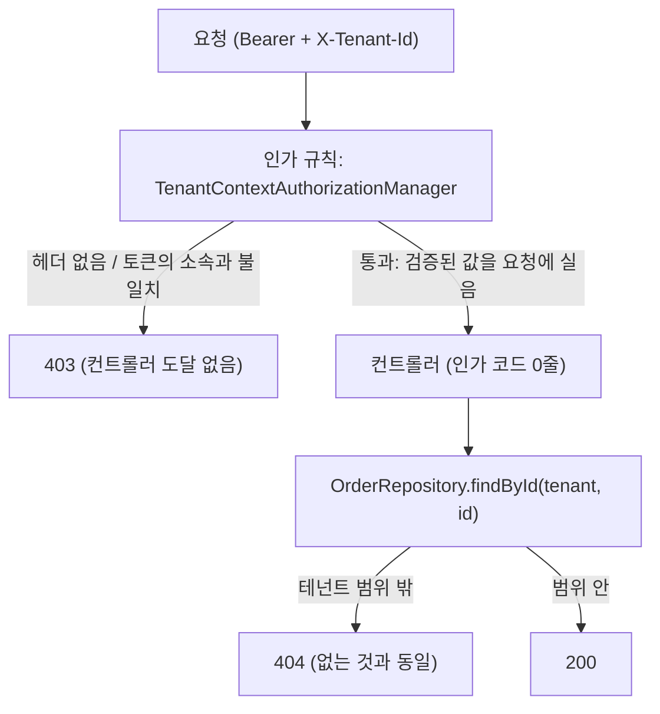

# 24. 잊으면 닫히는 기본값 — 다운스트림 테넌트 격리를 구조로 옮기기

> 같은 검사를 엔드포인트마다 넣는 것과, 넣지 않아도 걸리게 만드는 것은 **보안 등급이 다르다.**
> 관련: Phase 9g 후속 · 커밋 `8e75eea` 이후 · 코드 `samples/downstream-demo/.../TenantContext.kt` (커밋 제외)

## 1. 왜 필요했나

P9g 실측에서 이런 결과가 나왔다.

```
소속 0개인 alice + 유효한 토큰 + X-Tenant-Id: acme  (GW 우회 직격)
  → /orders   403   ← 컨트롤러가 직접 검사해서 막았다
  → /echo     200, acme 그대로 도달
```

`/orders` 는 막고 `/echo` 는 뚫렸다. 둘의 차이는 **검사 코드를 넣었는가**뿐이다. 그러면 질문은
"검사를 잘 짰는가"가 아니라 **"다음 엔드포인트를 만들 때 잊지 않을 수 있는가"** 가 된다.

잊었을 때 증상이 없다는 점이 이 문제를 특히 나쁘게 만든다. 위조 헤더는 **성공한다.** 테스트도
통과하고 로그도 조용하다. 몇 달 뒤 남의 테넌트 데이터가 섞여 나오고서야 알게 된다.

## 2. 익숙한 방식과의 대조

| | 흔한 방식 | 여기서 택한 방식 | 왜 다른가 |
|---|---|---|---|
| 검사 위치 | 컨트롤러/서비스 메서드 안 | **인가 규칙(`anyRequest`)** | 새 엔드포인트가 자동으로 포함된다 |
| 적용 대상 지정 | `@RequiresTenant` 를 **붙인 곳** | **예외를 명시한 곳만 제외** | opt-in 은 잊으면 열리고, opt-out 은 잊으면 닫힌다 |
| 테넌트 값 취득 | `request.getHeader("X-Tenant-Id")` | **`TenantContext` 타입 파라미터** | 타입이 곧 "검증을 통과했다"는 증거다 |
| 자원 조회 | `findById(id)` 후 소유자 비교 | **`findById(tenant, id)` 만 존재** | 비교를 잊을 수 있지만, 없는 함수는 못 부른다 |
| 잊었을 때 | 조용히 열린다 | **403 또는 컴파일 에러** | 실패가 눈에 보인다 |

> **`@PreAuthorize` 로 하면 되지 않나?** 그것도 opt-in 이다. 어노테이션을 안 붙인 메서드는
> 아무 검사도 받지 않는다. 문제의 본질이 "붙이는 걸 잊는 것"이므로 붙여야 하는 방식은 답이 아니다.

## 3. 동작 원리

### 3.1 두 층으로 나눈다



- **①층(coarse 재확인)** — 기계적이고 도메인 무관하다. 그래서 **전역 규칙**으로 올릴 수 있다.
- **②층(fine, 자원 격리)** — 도메인 지식이 필요하다. 전역 규칙으로는 못 만들지만, **질의에
  테넌트를 강제**하면 잊을 수 없게 된다.

### 3.2 예외는 한 곳에 모여 눈에 보인다

```kotlin
authorizeHttpRequests {
    authorize("/public/**", permitAll)
    // ⚠️ 이 한 줄이 곧 "여기는 테넌트 격리가 없다" 는 선언이다
    authorize("/echo", authenticated)
    // 기본값: 인증 + X-Tenant-Id 가 토큰의 소속과 일치
    authorize(anyRequest, TenantContextAuthorizationManager())
}
```

순서가 곧 정책이다. **마지막 줄이 기본값**이고, 위험한 쪽(예외)이 의도적인 한 줄을 요구한다.

### 3.3 헤더를 읽는 코드를 없앤다

컨트롤러는 `X-Tenant-Id` 를 직접 읽지 않고 `TenantContext` 를 파라미터로 받는다. 이 타입의
인스턴스가 존재한다는 것 자체가 "토큰과 대조를 통과했다"는 뜻이다.

게이트웨이에서 `X-Requested-Tenant`(주장)와 `X-Tenant-Id`(검증값)를 **이름**으로 갈라 놓은 것
([23](23-coarse-authz-tenant-gate.md) §3.1)과 같은 발상이고, 여기서는 **타입**으로 가른다.

### 3.4 안전하지 않은 질의를 표현할 수 없게 한다

```kotlin
class OrderRepository {
    // findById(id) 는 **없다**
    fun findById(tenant: TenantContext, id: String): Order? = ...
    fun findAll(tenant: TenantContext): List<Order> = ...
}
```

`docs/learning/20` 의 "대상을 토큰 `sub` 로만 정하면 IDOR 이 성립할 자리가 없다"와 같은 방향이다.
여기서는 대상을 **테넌트로만** 정한다.

## 4. 직접 확인한 것

### 4.1 검사가 한 줄도 없는 새 엔드포인트가 막히는가

"새 엔드포인트를 만들며 잊었다"를 그대로 재현하려고 `/invoices` 를 만들었다. **테넌트에 관한
코드가 하나도 없다.** alice(소속 0개) 토큰으로 `:8081` 을 직접 때렸다.

```json
[{"case":"검사 없는 새 엔드포인트 /invoices + 위조 X-Tenant-Id","status":403,"body":""},
 {"case":"검사 없는 새 엔드포인트 /invoices + 헤더 없음","status":403,"body":""},
 {"case":"/orders + 위조 X-Tenant-Id","status":403,"body":""},
 {"case":"예외 목록에 있는 /echo + 위조 X-Tenant-Id","status":200,"body":{"sawTenantHeader":"acme"}}]
```

관찰:
- **`/invoices` 가 403 이다.** 컨트롤러는 아무것도 하지 않는다 — 문 앞에서 막혔다.
  P9g 시점이었다면 여기서 200 이 나왔을 자리다.
- `/echo` 는 여전히 200 이고 `acme` 가 도달한다. **예외로 명시했기 때문이다.**
  뚫린 게 아니라 "여기는 격리가 없다"고 선언한 결과이고, 그 선언이 설정 파일 한 줄로 보인다.

### 4.2 테넌트 없는 질의는 컴파일되는가

일부러 써 봤다.

```kotlin
fun unsafeLookupAttempt(repo: OrderRepository): Order? = repo.findById("acme-1")
```

```
e: _ProbeUnsafeLookup.kt:4:72 Argument type mismatch: actual type is 'String', but 'TenantContext' was expected.
e: _ProbeUnsafeLookup.kt:4:72 No value passed for parameter 'id'.
BUILD FAILED in 463ms
```

관찰: 잊었을 때의 결과가 **런타임 데이터 유출이 아니라 빌드 실패**다. 이게 ②층에서 노린 성질이다.

### 4.3 정상 경로가 여전히 열려 있는가 (회귀)

"전부 막혔다"는 안전한 게 아니라 고장난 것이다. carol(`tenants:["acme"]`) 로 GW 를 경유해 확인했다.

```json
[{"case":"내 테넌트 자원","status":200,"body":{"id":"acme-1","tenantId":"acme","item":"노트북 거치대"}},
 {"case":"목록","status":200,"body":[{"id":"acme-1","tenantId":"acme"},{"id":"acme-2","tenantId":"acme"}]},
 {"case":"남의 테넌트 자원","status":404,"body":{"reasonCode":"order_not_found"}},
 {"case":"없는 자원","status":404,"body":{"reasonCode":"order_not_found"}},
 {"case":"비소속 테넌트 주장","status":403,"body":{"detail":"요청한 테넌트에 소속되어 있지 않습니다"}},
 {"case":"테넌트 미지정","status":403,"body":""}]
```

관찰:
- **목록에 `globex-1` 이 아예 없다.** 필터링을 컨트롤러가 한 게 아니라 저장소가 테넌트 범위
  밖을 애초에 돌려주지 않았다. ②층이 실제로 동작한다는 증거다.
- 남의 것과 없는 것이 **같은 404** 다 — 존재 여부가 새지 않는다.
- **"테넌트 미지정"이 400 에서 403 으로 바뀌었다.** 이건 대가다 — §5 마지막 행.

### 4.4 처음 시도가 500 이었다 — value class 함정

위 회귀 측정을 처음 돌렸을 때 `/orders` 만 **500** 이었다(`/invoices` 는 200).

```
NullPointerException: Parameter specified as non-null is null:
  method me.ramos.downstream.TenantContext.constructor-impl, parameter tenantId
```

`TenantContext` 를 `@JvmInline value class` 로 만든 것이 원인이었다. 자세한 것은 §5.
`data class` 로 바꾸자 위 4.3 결과가 나왔다.

### 4.5 쓰기 경로는 default-deny 가 지켜주지 않는다

읽기에서 "검사를 잊어도 막힌다"를 봤으니 쓰기도 그럴 것 같지만, **아니다.** 확인하려고
본문의 `tenantId` 를 그대로 쓰는 엔드포인트(`/legacy/orders`)를 만들었다. carol(`acme` 소속)이
**GW 를 정상 경유**해서 호출했다.

```json
[{"case":"생성 · 정상","status":201,"body":{"id":"acme-100","tenantId":"acme","item":"모니터암"}},
 {"case":"생성 · 본문에 tenantId 위조 시도","status":201,"body":{"id":"acme-101","tenantId":"acme","item":"침투시도"}},
 {"case":"수정 · 남의 테넌트 자원","status":404,"body":{"reasonCode":"order_not_found"}},
 {"case":"수정 · 내 자원","status":200,"body":{"id":"acme-1","item":"노트북 거치대 v2"}},
 {"case":"⚠️ legacy · 본문의 tenantId 를 그대로 쓰는 엔드포인트","status":201,
  "body":{"id":"globex-102","tenantId":"globex","item":"침투"}}]
```

관찰:
- **마지막 줄이 뚫린 것이다.** `acme` 에만 속한 사용자가 `globex` 소유의 자원을 만들었다.
  인가 규칙은 **정직하게 통과**했다 — 헤더는 진짜 소속이었으니까. 인가는 "어느 테넌트로
  행동하는가"만 고정하고 **본문이 말하는 테넌트는 보지 않는다.**
- 두 번째 줄이 안전한 이유는 검사 때문이 아니라 **DTO 에 `tenantId` 필드가 없어서**다.
  값이 담길 자리가 없으니 무시된다.

그리고 만들어진 `globex-102` 는 carol 의 목록에 **보이지 않는다.**

```json
{"acme목록":["acme-1:acme","acme-2:acme","acme-100:acme","acme-101:acme"],"globex침투건이보이는가":false}
```

만든 사람조차 다시 못 보는 오염이다 — 남의 테넌트에 조용히 쌓인다.

### 4.6 예외 목록을 테스트로 고정하기 (IAM, 커밋 대상)

샘플은 커밋되지 않으므로, 같은 성격의 가드를 **IAM 모듈**에 넣었다
(`IamAuthorizationCoverageTest`). 정책 상수(`PUBLIC_PATHS`·`ADMIN_PATHS`)와 클래스패스에서
스캔한 실제 엔드포인트를 대조한다.

```
Given: IAM 의 모든 REST 엔드포인트 > When: 클래스패스에서 수집하면 > Then: 하나 이상 발견된다 PASSED
… > When: 공개(permitAll) 패턴과 대조하면 > Then: 의도한 것만 공개다 PASSED
… > When: 관리(admin) 경로와 대조하면 > Then: 관리 컨트롤러의 경로는 전부 관리 접두사 아래에 있다 PASSED
… > When: 공개 목록의 각 패턴을 거꾸로 보면 > Then: 대응하는 엔드포인트가 없는 공개 패턴은 없다 PASSED
```

**통과만 하는 가드는 무의미하므로**([15](15-archunit-dependency-guard.md) §4) 일부러 어겨봤다 —
`PUBLIC_PATHS` 에 `/iam/admin` 하위를 넣었다.

```
Then: 의도한 것만 공개다 — 새 엔드포인트가 공개 패턴에 걸리면 여기서 깨진다 FAILED
  Collection should contain ["/iam/register", "/debug/thread"] in any order, but was
  ["/iam/admin/outbox/dead", "/iam/admin/outbox/dead/{id}/requeue", "/iam/register",
   "/iam/admin/tenants/{tenantId}/members", "/iam/admin/tenants/{tenantId}/members/{userRef}",
   "/iam/admin/tenants", "/debug/thread"]
```

관리 API 6개가 공개로 분류됐다는 것을 **경로 이름까지 찍어** 알려준다.

**여기서도 한 번 틀렸다.** 처음엔 `/debug/thread` 가 목록에 안 잡혀 실패했다. 원인은
클래스패스 스캐너가 `@Conditional` 을 **평가**한다는 것 — `@Profile("local")` 컨트롤러는
프로파일이 꺼져 있으면 후보에서 빠진다. 프로파일을 켜서 스캔하도록 고쳤다.
**대상을 조용히 놓치는 커버리지 테스트는 커버리지가 없는 것보다 나쁘다** — 있다고 믿게 만든다.

## 5. 함정 / 실패 모드

| 함정 | 증상 | 원인 | 해결 |
|---|---|---|---|
| **KDoc 안의 `/tenants/*`** (실제로 겪음) | `Syntax error: Unclosed comment` — 주석에 쓴 경로 때문에 파일 전체가 안 열린다 | **Kotlin 은 블록 주석이 중첩된다.** 주석 안의 `/*` 가 새 주석을 연다 | 주석에 `/*` 를 쓰지 않는다. 경로 예시는 접두사만 적거나 백틱으로 감싼다 |
| `AuthorizationManager.check` 가 deprecated 인데 `authorize` 만 구현 | `Class is not abstract and does not implement abstract member` | Security 6.4+ 가 `authorize` 를 권장하지만 **`check` 는 여전히 abstract** 다 | `check` 를 구현하고 `@Suppress("OVERRIDE_DEPRECATION")`. 버전 올릴 때 재확인 |
| `TenantContext` 를 argument resolver 없이 받기 | 요청 본문으로 바인딩을 시도해 **요청이 준 값**이 들어온다 | Spring 은 모르는 타입을 모델 속성으로 취급한다 | resolver 를 등록하고, 값이 없으면 **즉시 예외**로 터뜨린다(조용히 null 을 주지 않는다) |
| 예외 목록이 늘어나는 것을 방치 | 시간이 지나면 "기본값이 안전"이 사실상 무의미해진다 | 예외 추가는 한 줄이라 리뷰에서 가볍게 지나간다 | 예외 줄마다 **왜 테넌트와 무관한지** 주석을 강제한다. 늘어나면 그 자체가 신호다 |
| **`TenantContext` 를 `@JvmInline value class` 로** (실제로 겪음, §4.4) | 그 파라미터를 받는 엔드포인트만 **500**. `constructor-impl, parameter tenantId` NPE | value class 는 컴파일되며 **파라미터 타입이 `String` 으로 펴진다.** resolver 의 `parameterType == TenantContext::class.java` 가 영원히 거짓이 되고 Spring 이 `null` 을 바인딩한다 | 주입되는 자리에는 평범한 `data class`. `docs/learning/20` §5 함정 1 과 **같은 함정** |
| 소속이 하나뿐인 사용자에게 헤더를 자동 채워주기 | 편해 보이지만, 그 규칙이 **다중 소속 사용자에게 잘못 적용**된다 | "하나뿐이니 자명하다"는 가정이 사용자마다 다르다 | 헤더가 없으면 거부한다. 무엇으로 행동하는지는 **호출자가 밝힌다** |
| **읽기에서 통했으니 쓰기도 안전할 것이라 믿기** (실증, §4.5) | 인가는 통과하는데 **남의 테넌트에 자원이 생긴다.** 만든 사람도 못 본다 | 인가는 "어느 테넌트로 행동하는가"만 보고 **본문을 보지 않는다** | 요청 DTO 에 `tenantId` 를 두지 않는다. 저장소의 생성 API 도 테넌트를 파라미터로 받지 않는다 |
| **`@Profile` 컨트롤러가 커버리지 스캔에서 누락** (실제로 겪음, §4.6) | 커버리지 테스트가 **통과**한다. 그 엔드포인트는 검사 대상에서 사라진 채 | `ClassPathScanningCandidateComponentProvider` 가 `@Conditional` 을 평가한다 | 스캐너 environment 에 프로파일을 명시적으로 켠다. 놓친 커버리지는 없는 것보다 나쁘다 |
| — (함정이 아니라 **치른 대가**) | "테넌트 미지정"이 400 → **403** 이 됐다. 클라이언트는 "권한 없음"과 "요청이 불완전함"을 구분 못 한다 | 인가 계층은 allow/deny 만 말할 수 있다. 컨트롤러에서 올렸으니 표현력이 줄어든 것 | 감수한다. 잊어도 닫히는 것과 응답이 친절한 것 중 전자를 골랐다. 필요하면 `AccessDeniedHandler` 에서 사유를 갈라 붙일 수 있다 |

## 6. 남은 의문

- [x] ~~**예외 목록을 테스트로 고정할 수 있을까.**~~ → §4.6. 인가 규칙 자체를 열거하는 대신
      **정책 상수와 실제 엔드포인트를 대조**했다. 다만 이건 "정책이 의도와 다른 것"만 잡고,
      "정책이 동작하지 않는 것"은 못 잡는다 — 둘은 다른 테스트가 필요하다.
- [ ] **샘플 다운스트림에는 같은 가드가 없다.** 테스트 의존성이 없어 IAM 에만 넣었다. 그런데
      정작 default-deny 를 쓰는 쪽은 샘플이다. 스타터를 만들 때 이 테스트도 함께 제공해야 하나?
- [ ] **스타터로 뽑는 시점의 판단 기준.** 다운스트림 2대째가 오면 만들기로 했는데(§8.4),
      두 서비스의 요구가 갈리는 지점을 미리 알 수는 없다. 무엇이 갈리면 "아직 이르다"인가?
- [ ] Repository 강제는 **인메모리 샘플**이라 성립이 쉬웠다. 실제 JPA 에서 base repository /
      Hibernate `@Filter` / RLS 중 무엇이 "잊으면 0건"을 가장 확실히 보장하는지는 안 해봤다.
- [x] ~~이 구조는 **읽기**만 확인했다.~~ → §4.5 에서 쓰기까지 봤고, **default-deny 가 쓰기를
      지켜주지 못한다**는 것이 드러났다. 규약(DTO 에 `tenantId` 금지)으로 막았다.
- [ ] 그 규약은 **관례일 뿐 강제가 아니다.** "요청 DTO 에 `tenantId` 필드가 없다"를 테스트로
      고정할 수 있을까 — ArchUnit 으로 패키지 내 DTO 필드명을 검사하는 방식이 떠오르는데,
      정당한 예외(관리 API 는 대상 테넌트를 받아야 한다)를 어떻게 구분할지 모르겠다.
