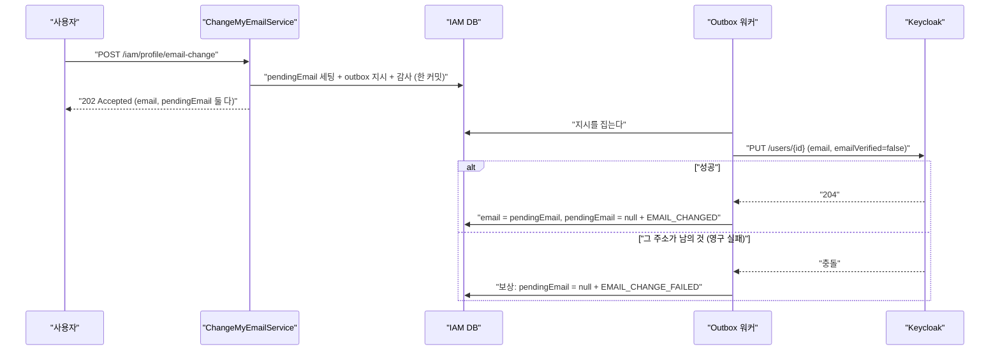

# 25. 되돌릴 것이 있는 outbox — 이메일 변경과 보상

> 분산 쓰기에서 어려운 건 성공이 아니라 **실패한 뒤의 상태**다. 되돌릴 것을 작게 만드는 게 설계다.
> 관련: Phase 9 이후 · 코드 `iam/src/main/kotlin/.../domain/user/model/UserProfile.kt` ·
> `.../application/user/service/ChangeMyEmailService.kt` · `.../outbox/service/OutboxProcessor.kt`

## 1. 왜 필요했나

email 의 SoT 는 Keycloak 이고 IAM 이 가진 것은 **가입 시점 사본**이다. 그래서 프로필 수정 API 는
표시 이름·locale 만 바꾸고 email 은 손대지 않았다(`UpdateMyProfileService` KDoc). 바꾸려면
Keycloak 반영이 필요하고, 그건 **두 시스템 쓰기**라 또 outbox 를 타야 한다.

가입도 같은 구조지만 결정적으로 다른 점이 있다.

| | 가입 | 이메일 변경 |
|---|---|---|
| 실패했을 때의 상태 | 만들어지지 않은 사용자 | **이미 쓰고 있던 계정** |
| 되돌릴 것 | 없다 (상태만 `IDENTITY_FAILED` 로) | **있다** — 로컬에 남긴 요청 |
| 사용자에게 보이는 것 | "가입이 안 됐다" | "바뀐 줄 알았는데 아니었다" |

즉 이 유스케이스에서 처음으로 **보상(compensation)** 이 필요해진다.

## 2. 익숙한 방식과의 대조

| | 단일 DB 트랜잭션 | 여기서의 방식 | 왜 다른가 |
|---|---|---|---|
| 원자성 | `@Transactional` 하나로 끝 | IAM DB 커밋 + **나중에** Keycloak | 두 시스템에 걸친 트랜잭션이 없다 |
| 실패 처리 | 롤백 | **보상** (앞선 로컬 변경을 되돌린다) | 이미 커밋된 것은 롤백할 수 없다 |
| 실패를 아는 시점 | 즉시 | 워커가 돌 때 (수 초 뒤) | 응답은 "접수" 이지 "완료" 가 아니다 |
| 사용자 응답 | 200 (끝) | **202 Accepted** | 끝나지 않았다는 사실을 코드로 말한다 |

## 3. 동작 원리

### 3.1 확정 값과 요청 값을 나눈다 — 보상을 싸게 만들려고

가장 단순한 설계는 "요청받자마자 `email` 을 덮어쓰고, 실패하면 되돌린다" 이다. 그런데 그러면
**되돌릴 대상이 진실 그 자체**가 된다.

```
[덮어쓰기]  email = new  →  실패  →  email = old 로 복원
              ↑ 반영 전 구간에서 화면은 new, 로그인은 old  (사본이 거짓말을 한다)
              ↑ 복원하려면 old 를 어딘가 보관해야 한다  (또 하나의 진실 후보)
```

그래서 필드를 하나 더 둔다.

```
email        Keycloak 과 일치한다고 믿는 값  — 표시·조회에 쓴다. 변경 중에도 흔들리지 않는다
pendingEmail 반영 대기 중인 요청값          — 아직 아무 데도 쓰이지 않는다
```

성공하면 승격(`applyEmailChange`), 영구 실패하면 폐기(`cancelEmailChange`). **보상이
"필드 하나 지우기"** 로 줄어든다.

### 3.2 흐름



### 3.3 순서는 Keycloak 이 먼저다

로컬을 먼저 확정하면 Keycloak 반영 실패 시 "IAM 은 새 주소, Keycloak 은 옛 주소" 가 되고,
그 어긋남을 되돌릴 근거가 사라진다. 외부 반영이 성공한 뒤 로컬을 맞추면 최악의 경우가
**"Keycloak 은 반영됐는데 로컬 커밋 실패"** 인데, 그건 재시도가 **멱등하게** 고친다
(어댑터가 "이미 그 주소면 성공" 으로 처리하므로).

### 3.4 실패의 종류를 가른다

| 실패 | 판정 | 보상 | 근거 |
|---|---|---|---|
| Keycloak 통신 불가 | **재시도** | 하지 않는다 | 다음 시도에 성공할 수 있다. 여기서 취소하면 Keycloak 이 잠깐 흔들렸다는 이유로 사용자 요청이 사라진다 |
| 그 주소가 남의 것 | **영구** | 요청 폐기 | 재시도해도 결과가 같다 |
| 미분류 예외 | **영구** | 요청 폐기 | "모르는 실패는 사람이 봐야 한다"(P9b) |

## 4. 직접 확인한 것

실제 Keycloak(dev realm) · 실제 PostgreSQL · carol 브라우저 세션.
carol 은 realm 에서 직접 만든 사용자라 IAM 프로필 행이 없어, 실측용으로 한 행을 넣고 시작했다.

### 4.1 마이그레이션

```
Migrating schema "public" to version "6 - add user profile pending email"
Successfully applied 1 migration to schema "public", now at version v6
 pending_email       | character varying(255)   |           |          |
```

### 4.2 보상 경로 — **1차 방어는 통과하고 Keycloak 이 거절**하는 요청

`alice@example.local` 은 Keycloak 에는 있고 IAM DB 에는 없다. 로컬 중복 검사로는 잡히지 않는,
정확히 "늦게 발견되는 충돌" 이다.

```json
{"① 접수":{"status":202,"body":{"email":"carol@example.local","pendingEmail":"alice@example.local"}},
 "② 접수 직후 프로필":{"email":"carol@example.local", …},
 "③ 진행 중에 또 요청":{"status":409,"body":{"reasonCode":"email_change_in_progress"}}}
```

몇 초 뒤 워커가 처리한 결과:

```
        email        | pending_email
---------------------+---------------
 carol@example.local |                 ← 확정 값은 그대로, 요청만 사라졌다

       event_type       |    target_email     |       reason_code       |                  detail
------------------------+---------------------+-------------------------+-------------------------------------------
 EMAIL_CHANGE_FAILED    | carol@example.local | identity_already_exists | {"requestedEmail": "alice@example.local"}
 EMAIL_CHANGE_REQUESTED | carol@example.local |                         | {"requestedEmail": "alice@example.local"}

 id |      event_type       | status | attempts |       last_error
----+-----------------------+--------+----------+-------------------------
 10 | UPDATE_KEYCLOAK_EMAIL | DEAD   |        1 | identity_already_exists
```

관찰:
- **확정 값이 한 번도 흔들리지 않았다.** 사용자 화면의 email 은 시종일관 `carol@example.local` 이다.
- `attempts=1` — 재시도 없이 한 번에 DEAD 다. 남의 주소는 기다려도 내 것이 되지 않는다.
- 감사 두 건이 남아 "무엇을 시도했고 왜 실패했는지" 가 복원된다.

### 4.3 성공 경로 — Keycloak 실물까지

보상 뒤 다시 요청이 되는지부터 봤다(보상을 빠뜨렸다면 여기서 영영 막힌다).

```json
{"① 보상 뒤 재요청":{"status":202,"body":{"email":"carol@example.local","pendingEmail":"carol.changed@example.local"}},
 "② 접수 직후 조회":{"email":"carol@example.local","pendingEmail":"carol.changed@example.local", …}}
```

워커 처리 후:

```
            email            | pending_email
-----------------------------+---------------
 carol.changed@example.local |

       event_type       |        target_email         |                                  detail
------------------------+-----------------------------+---------------------------------------------------------------------------
 EMAIL_CHANGED          | carol.changed@example.local | {"after": "carol.changed@example.local", "before": "carol@example.local"}
 EMAIL_CHANGE_REQUESTED | carol@example.local         | {"requestedEmail": "carol.changed@example.local"}

 id |  status   | attempts
----+-----------+----------
 11 | COMPLETED |        1
```

**Keycloak 실물**(Admin API 조회):

```json
{"username": "carol", "email": "carol.changed@example.local", "emailVerified": false}
```

관찰:
- `username` 은 `carol` 그대로다. 이메일만 바뀐다(포트 KDoc 의 결정).
- `emailVerified` 가 **false 로 떨어졌다.** 의도한 동작이다 — 검증되지 않은 주소가 검증된 것으로
  승격되면 비밀번호 재설정 메일이 그 주소로 가는 순간 계정 탈취 경로가 된다.
- 감사의 `target_email` 이 접수 사건은 **옛 주소**, 확정 사건은 **새 주소**다. 둘을 이으면
  "무엇이 무엇으로" 가 복원된다.

원복도 **같은 유스케이스로** 했다(두 번째 성공 실측). 그 뒤 `emailVerified` 만 Admin API 로 되돌렸다.

```json
{"username": "carol", "email": "carol@example.local", "emailVerified": true}
```

### 4.4 같은 값으로 요청하면

```json
{"status":409,"body":{"title":"Email Unchanged","reasonCode":"email_unchanged"}}
```

### 4.5 그룹 이벤트의 영구 실패가 무한 루프였다 (같이 고친 결함)

이 작업을 하며 워커의 영구 실패 처리가 payload 를 **항상 가입 payload 로 역직렬화**한다는 걸
발견했다. 새 이벤트 타입을 붙이기 전에 재현 테스트부터 썼다.

```
OutboxProcessorTest > 그룹 이벤트가 영구 실패해도 DEAD 로 확정된다 — 보상 핸들러에서 터지지 않는다 FAILED
  com.fasterxml.jackson.module.kotlin.MissingKotlinParameterException:
    Instantiation of [class CreateKeycloakUserPayload] value failed for JSON property email
    due to missing (therefore NULL) value for creator parameter email
```

보상 핸들러 안에서 예외가 나면 `@Transactional(REQUIRES_NEW)` 가 롤백되고, **클레임과 attempts
증가까지 되돌아간다** — P9b 가 고친 무한 재시도 루프가 다른 경로로 되살아난 것이다.
수정 후:

```
OutboxProcessorTest > 그룹 이벤트가 영구 실패해도 DEAD 로 확정된다 — 보상 핸들러에서 터지지 않는다 PASSED
```

### 4.6 빌드

```
BUILD SUCCESSFUL
```

## 5. 함정 / 실패 모드

| 함정 | 증상 | 원인 | 해결 |
|---|---|---|---|
| **보상을 빠뜨린다** | 한 번 실패한 뒤로 그 사용자는 **영영 이메일을 못 바꾼다** | `pendingEmail` 이 남아 도메인이 "진행 중" 으로 보고 다음 요청을 거절한다 | 영구 실패 경로에서 반드시 요청을 폐기한다. 테스트로 고정했다 |
| **보상이 이벤트 타입을 안 가린다** (실제로 겪음, §4.5) | 그 타입의 영구 실패가 **무한 재시도 루프**가 된다 | 보상 핸들러가 payload 를 하나의 타입으로만 역직렬화 | `when(eventType)` 으로 분기 — 타입이 늘면 컴파일러가 결정을 요구한다 |
| **보상이 터지면 레코드가 확정되지 않는다** | 위와 같은 루프 | 보상 실패 예외가 트랜잭션을 롤백 | 보상 호출을 감싸고, 실패해도 **DEAD 는 확정**한다. 못 되돌린 것과 다시 시도할 이유는 다르다 |
| **확정 값을 먼저 덮어쓴다** | 반영 전 구간에서 화면과 로그인이 어긋나고, 실패 시 값이 조용히 되돌아간다 | 사본이 SoT 인 척한다 | 요청 값을 따로 둔다(§3.1) |
| **재시도 가능 실패에서 보상한다** | Keycloak 이 몇 초 흔들렸다고 사용자의 요청이 사라진다 | 실패 분류를 안 가림 | 보상은 **영구 실패에서만**. 테스트로 고정했다 |
| `save` 가 email 로 행을 찾는다 | 변경 확정 후 저장하면 **프로필이 두 줄**이 되려 한다(UNIQUE 로 폭발) | 어댑터가 email 을 식별자로 썼다 — "email 은 안 바뀐다" 는 전제였다 | `userRef`(불변) 우선으로 찾는다. 전제가 깨지는 시점을 KDoc 이 예고해 뒀었다 |
| 조회 응답에 `pendingEmail` 이 없다 (실측에서 발견) | 새로고침하면 "반영 중" 이 사라져 사용자가 "안 바뀌었다" 고 오해한다 | 접수 응답에만 담았다 | 조회 모델에도 싣는다 |
| `emailVerified` 를 그대로 둔다 | 검증 안 된 주소가 검증된 것으로 승격 → 비밀번호 재설정 경로로 **계정 탈취** | Keycloak 은 email 만 바꾸면 verified 를 유지한다 | 변경 시 **false 로 되돌린다** |

## 6. 남은 의문

- [ ] **사용자에게 실패를 어떻게 알리는가.** `EMAIL_CHANGE_FAILED` 감사는 남지만 알림 경로가 없다.
      지금은 사용자가 프로필을 다시 조회해 `pendingEmail` 이 사라진 걸 봐야 안다 —
      "실패했다" 와 "아직 처리 중" 을 구분할 수단이 없다. 실패 사유를 프로필에 남겨야 할까?
- [ ] **동시 변경 요청의 최종 방어선.** 도메인이 "진행 중이면 거절" 로 막지만, 그건 **읽은 뒤
      쓰는** 검사라 동시 요청 둘이 모두 통과할 수 있다(낙관적 락 미적용 — 로드맵 6번 항목).
      여기서 겹치면 outbox 지시 두 개가 순서 보장 없이 처리된다.
- [ ] **`emailVerified=false` 의 대가를 재현하지 않았다.** realm 이 "이메일 인증 필수" 로 설정돼
      있으면 변경 직후 로그인이 막힐 수 있다. 지금 realm 은 그 설정이 꺼져 있어 드러나지 않았다.
- [ ] **`username` 이 옛 주소로 남는다.** 가입 시 username=email 로 만들기 때문에, 변경 후
      username 은 가입 시점의 흔적이 된다. realm 의 `editUsernameAllowed` 를 켜고 함께 바꾸는 게
      맞는지, 아니면 username 을 애초에 email 과 분리해야 했는지 결론을 못 냈다.
