# 26. BFF 에 SPA 를 붙이며 배운 것 — 토큰이 없는 프론트엔드

> FE 는 토큰을 모른다. 그래서 어려운 것은 인증이 아니라 **origin·쿠키·"아직 반영 안 됨"** 이었다.
> 관련: Phase 9 이후 · 코드 `samples/frontend-demo/` · 커밋 `3c5aca5` · `31e4a78` · `4ae899b`

## 1. 왜 필요했나

여기까지의 검증은 전부 `curl` 과 브라우저 콘솔이었다. 그건 "요청 하나가 어떻게 처리되는가" 는
보여주지만, **여러 요청이 이어지는 흐름**(로그인 → 테넌트 선택 → 쓰기 → 비동기 반영)은 못 본다.
그리고 앞으로 alpha 에 올릴 FE 가 실제로 어떤 제약을 받는지도 알 수 없었다.

샘플 FE 를 붙이자마자 **첫 로그인부터 막혔다.** 그 뒤로 나온 것들이 이 문서다.

## 2. 익숙한 방식과의 대조

| | 흔한 SPA (토큰을 FE 가 들고 있음) | 여기서의 방식 (BFF) |
|---|---|---|
| 토큰 보관 | `localStorage`/메모리 | **게이트웨이 세션.** FE 는 존재조차 모른다 |
| 요청 인증 | `Authorization: Bearer …` 를 FE 가 붙인다 | **세션 쿠키.** Bearer 는 GW→다운스트림 구간에만 있다 |
| 로그인 | FE 가 Keycloak 과 직접 왕복(PKCE) | FE 는 **주소창을 옮길 뿐**. 왕복은 GW 가 한다 |
| CSRF | 필요 없다(쿠키를 안 쓰므로) | **필요하다.** 쿠키로 인증하므로 공격 표면이 실재 |
| XSS 로 토큰 탈취 | 가능 | **불가능**(FE 에 토큰이 없다) |
| 로그아웃 | 저장소에서 토큰 삭제 | GW 세션 폐기 + Keycloak `end_session` |
| 배포 형태의 제약 | 없음(어느 origin 이든 됨) | **origin 이 설계 변수**가 된다 — §3 |

> **FE 가 Bearer 를 다루는 구조가 애매해 보이는 것은 당연하다.** 그럴 자리가 없기 때문이다.
> 애매함의 실체는 Bearer 가 아니라 **FE 와 GW 를 같은 origin 에 둘 것인가**였다.

## 3. 동작 원리 — origin 이 설계 변수다

```mermaid
flowchart LR
    subgraph local ["local (same-origin)"]
      FE1["FE :5173 (Vite)"] -->|"dev proxy"| GW1["Gateway :8080"]
    end
    subgraph alpha ["alpha (cross-origin)"]
      FE2["FE (콘솔 호스트)"] -->|"CORS + credentials"| GW2["Gateway (별도 호스트)"]
    end
    GW1 --> D1["IAM · Downstream"]
    GW2 --> D2["IAM · Downstream"]
```



| | local | alpha |
|---|---|---|
| 배치 | dev proxy 로 **same-origin 을 만든다** | 콘솔·게이트웨이가 **다른 호스트** |
| CORS | 불필요 | **필수**(정확한 origin + credentials) |
| API base | 빈 문자열(상대경로) | 게이트웨이 origin |
| `loginUrl` 처리 | 상대경로 그대로 | **절대경로로 바꿔야 한다**(§5) |

그래서 **로컬에서 잘 되는 것이 alpha 에서 그대로 되지 않는다.** 그 차이를 `vite.config.ts` 와
`api/env.ts` 두 곳에만 두고, 나머지 코드는 `VITE_API_BASE_URL` 만 본다.

### 3.1 잊을 수 있는 자리를 없앤다

401 분기·CSRF 헤더·테넌트 헤더를 `api/client.ts` **한 곳**에 모았다. 페이지마다 흩어지면
"어디서 빠뜨렸지" 를 추적할 수 없다 — 서버에서 `anyRequest` 로 default-deny 를 만든 것과 같은
판단이다([24](24-fail-closed-by-default-tenant-guard.md)).

같은 이유로 다운스트림 호출 함수는 **테넌트를 인자로 강제**한다. 빠뜨리면 컴파일이 안 된다.

## 4. 직접 확인한 것

### 4.1 첫 로그인이 막혔다 — `Invalid parameter: redirect_uri`

FE 를 띄우고 로그인을 누르자 Keycloak 이 거절했다.

```
We are sorry...
Invalid parameter: redirect_uri
(redirect_uri=http://localhost:5173/login/oauth2/code/keycloak)
```

원인: dev proxy 가 Host 를 그대로 넘기므로 **게이트웨이가 만드는 redirect_uri 도 5173** 이 된다.
realm 에는 8080 만 등록돼 있었다.

**게이트웨이 로그에는 아무것도 남지 않았다.** 302 는 정상 발행됐고 거절은 Keycloak 이 했기 때문이다.
`setup-realm.sh` 에 5173 을 추가하고 재실행하니 로그인 화면이 정상 렌더됐고, carol 로 로그인해
**5173 으로 복귀**하는 것까지 확인했다.

### 4.2 게이트웨이가 무엇을 지우고 무엇을 넣는가 (FE 세션으로)

로그인한 뒤 브라우저에서:

```json
[{"case":"acme 주문 목록","status":200,"body":[{"id":"acme-1","tenantId":"acme"}, …]},
 {"case":"globex(비소속) 목록","status":403,"body":{"detail":"요청한 테넌트에 소속되어 있지 않습니다"}},
 {"case":"주문 생성 (CSRF)","status":201,"body":{"id":"acme-103","tenantId":"acme"}},
 {"case":"위조 헤더","status":200,"다운스트림이본_XTenantId":"acme","authorization":"JWT(게이트 재주입)"}]
```

마지막 줄이 요점이다 — `X-Tenant-Id: globex` 와 위조 `Authorization` 을 함께 실었는데,
다운스트림이 본 것은 **검증된 `acme`** 와 게이트가 재주입한 JWT 였다.

세션 화면에서는 IAM 쪽도 확인했다.

```
X-Tenant-Id (검증값)   : (없음 — 제거됨)
X-Requested-Tenant(주장): (없음)
```

### 4.3 cross-origin 을 로컬에서 재현했다 (alpha 배포 없이)

FE 를 `--mode alpha` 로 다른 포트(5174)에 띄워 cross-origin 배치를 흉내 냈다.
게이트웨이의 CORS 허용 목록이 비어 있을 때:

```json
{"label":"cross-origin → GW /iam/debug/whoami","ok":false,"error":"TypeError: Failed to fetch"}
```

`UNIGATE_CORS_ALLOWED_ORIGINS=http://localhost:5174` 로 재기동하니 게이트웨이 로그가 갈렸고,

```
CORS 활성 — 허용 origin 1개          (주입 시)
CORS 비활성 — 허용 origin 이 없다     (미주입 시)
```

같은 호출이 전부 통과했다.

```json
[{"label":"GET (단순 요청)","status":200,"body":"carol"},
 {"label":"GET + 테넌트 헤더 (preflight 유발)","status":200,"body":[…5건…]},
 {"label":"POST + CSRF 헤더 (preflight + 쿠키)","status":201,"body":{"id":"acme-104"}}]
```

관찰 두 가지:
- **preflight 와 자격증명이 둘 다 동작했다.** alpha 의 cross-origin 배치가 성립한다는 근거다.
- **쿠키는 포트를 구분하지 않는다.** 5174 에서 보낸 요청에 8080 에서 만든 세션 쿠키가 실렸다
  (응답의 `carol`). 쿠키는 origin 이 아니라 **호스트** 기준이다 — CORS 와는 다른 규칙이다.

### 4.4 claim 과 도메인 목록이 어긋나는 순간

관리자 화면으로 두 번째 테넌트를 만들고 워커가 프로비저닝을 끝낸 직후:

```
   id   |  display_name   | status          14 | ADD_GROUP_MEMBER      | COMPLETED | 1
 acme   | 에이컴 주식회사 | ACTIVE          13 | CREATE_KEYCLOAK_GROUP | COMPLETED | 1
 globex | 글로벡스        | ACTIVE
```

화면:

```
토큰 claim : acme
도메인 목록: acme(ACTIVE), globex(ACTIVE)
globex 행  → "claim 에 있는가: 없음"
```

같은 상태에서 실제 호출:

```json
[{"case":"acme (claim 에 있음)","status":200,"detail":"6건"},
 {"case":"globex (도메인엔 멤버, claim 엔 없음)","status":403,"detail":"요청한 테넌트에 소속되어 있지 않습니다"}]
```

**"목록에 있어도 claim 에 없으면 403"** 이 화면과 응답으로 동시에 증명됐다. 재로그인해야 claim 이
갱신된다 — 캐시 무효화로 해결되는 문제가 아니다.

### 4.5 value class 함정이 세 번 나왔다

같은 뿌리([20](20-caller-identity-and-idor-free-design.md) §5 함정 1)가 **서로 다른 세 자리**에서 되살아났다.

```
① 컨트롤러 파라미터 (샘플 FE 작업 중)
   NullPointerException: Parameter specified as non-null is null:
     method TenantContext.constructor-impl, parameter tenantId
   → value class 는 파라미터 타입이 String 으로 펴져 argument resolver 가 매칭되지 않는다

② mockk answers 블록
   ClassCastException: class java.lang.String cannot be cast to class TenantId
   → 런타임 인자는 이미 String 이다

③ mockk any() + 형식 검증 value class
   initializationError — 전체 스위트에서만 실패(단독 실행은 통과)
   → mockk 가 시그니처용 더미를 임의 문자열로 만드는데, TenantId 의 slug 검증에 걸린다
```

③ 이 특히 고약했다 — **단독 실행은 통과하고 전체 스위트에서만** 깨져서 원인이 코드가 아니라
실행 순서에 있는 것처럼 보였다.

## 5. 함정 / 실패 모드

| 함정 | 증상 | 원인 | 해결 |
|---|---|---|---|
| **dev proxy 주소가 realm 에 없다** (§4.1) | 로그인이 `Invalid parameter: redirect_uri`. **게이트웨이 로그는 조용하다** | 프록시가 Host 를 넘겨 redirect_uri 가 dev 주소가 된다 | realm 에 dev origin 등록. 대안(changeOrigin)은 로그인 후 FE 를 벗어난다 |
| **`loginUrl` 을 상대경로 그대로 사용** | cross-origin 배포에서 로그인 이동이 **FE 호스트 404** | 그 경로는 게이트웨이에만 있다 | `toAbsolute()` 로 API base 를 붙인다. same-origin 에서는 무해해 **로컬에서 절대 안 드러난다** |
| CORS 를 필터 빈으로만 등록 | preflight(OPTIONS, 자격증명 없음)가 **401** 로 끊기고 콘솔엔 CORS 에러만 | 인증 필터가 먼저 돈다 | 보안 체인에 `.cors {}` 로 연결 |
| `fetch` 가 302 를 따라가게 둔다 | 콘솔에 **CORS 에러**만 뜨고 원인(미인증)이 가려진다 | XHR 은 리다이렉트를 자동으로 따라간다 | 401 + `loginUrl` 로 갈라 **top-level 이동**([14](14-problem-detail-xhr-auth-boundary.md)) |
| queryKey 에 테넌트를 빼먹는다 | 다른 테넌트 목록이 그대로 보이고 **네트워크 요청조차 안 나간다** | 테넌트는 헤더로만 전달돼 URL 이 같다 | 키에 테넌트 포함. 서버가 격리해도 **클라이언트 캐시가 무너뜨린다** |
| 4xx 를 재시도한다 | 429 에서 토큰버킷을 더 소진시켜 상황이 악화된다 | 기본 retry 정책 | 4xx 는 재시도 금지 |
| 응답이 전부 problem+json 이라고 가정 | 본문 없는 429 에서 `res.json()` 이 던져 **상태코드가 가려진다** | 다운스트림은 수제 맵, 429 는 본문 없음 | 텍스트로 읽고 파싱 실패를 견디는 파서 |
| **성공과 보상을 응답으로 구분하려 한다** | 이메일 변경이 됐는지 취소됐는지 화면이 모른다 | 둘 다 `pendingEmail: null` 로 끝난다([25](25-email-change-outbox-compensation.md)) | FE 가 요청 값을 기억해 비교 — **새로고침하면 그것도 못 한다**(서버 쪽 미해결) |
| 관리 메뉴를 역할로 숨긴다 | "서버가 막았는가" 를 확인할 수 없다 | 편의를 위한 숨김이 검증을 가린다 | 숨기지 않는다. 403 이 그대로 보이는 것이 이 앱의 목적 |
| **로그인 후 착지가 게이트웨이 루트다** (§5.1) | **로그인은 성공하는데 FE 가 안 뜬다.** 세션도 정상, 로그도 깨끗 | 성공 핸들러의 기본 착지가 `/` 이고, 401+`loginUrl` 방식이라 저장된 요청도 없다 | `unigate.frontend.base-uri` 로 FE 절대주소 주입. **로그아웃도 같은 값**을 봐야 한다 |

| **CSRF 쿠키를 FE 가 못 읽는다** (§5.2) | **GET 은 전부 200 인데 쓰기만 403.** 로그아웃·프로필 수정 등 전부 | `XSRF-TOKEN` 쿠키에 `Domain` 이 없어 **host-only** — 다른 호스트인 FE 의 `document.cookie` 에 안 보인다 | 게이트웨이에 `GET /csrf` 를 두고 FE 가 조회. 접근 제어는 **CORS 허용 목록**이 대신한다 |

### 5.1 "로그인은 됐는데 화면이 안 뜬다" — Keycloak 을 의심하게 되는 함정

alpha 에서 실제로 겪었다. 로그인 폼까지 잘 뜨고, 자격증명도 통과하고, 세션 쿠키도 발급되는데
브라우저가 게이트웨이 루트에 멈춘다. 거기엔 FE 가 없어 **401** 이다.

**Keycloak 을 고치려 들기 쉽다.** 리다이렉트가 틀렸으니 `redirectUris` 문제처럼 보이기 때문이다.
그런데 경계를 나눠보면 Keycloak 은 이미 제 몫을 다했다.

| 구간 | 누가 정하는가 | 값 |
|---|---|---|
| 인가 코드를 **어디로 배달**할지 | Keycloak `redirectUris` | `https://<gw>/login/oauth2/code/keycloak` |
| 코드를 받은 뒤 **어디로 착지**할지 | **게이트웨이의 성공 핸들러** | 기본 `/` ← 여기가 문제였다 |

**세션이 만들어졌다는 것 자체가 Keycloak 이 성공했다는 증거다.** 코드가 콜백에 도착했기 때문에
세션이 생긴 것이고, 그 순간 Keycloak 의 역할은 끝난다.

`RedirectServerAuthenticationSuccessHandler` 를 인자 없이 만들면 착지가 `/` 다(저장된 요청 우선).
그런데 이 게이트웨이는 미인증 XHR 에 **401 + `loginUrl`** 을 주는 방식이라([14](14-problem-detail-xhr-auth-boundary.md))
요청을 저장하지 않는다. 저장한다 해도 그건 FE 페이지가 아니라 API 경로다. 결국 항상 `/` 다.

**로컬에서는 절대 드러나지 않는다** — Vite dev proxy 로 same-origin 이라 `/` 가 곧 FE 다.
이 문서의 다른 두 함정(`loginUrl` 상대경로 · CORS)과 정확히 같은 성격이고, 그래서 세 번째로 같은
교훈이 반복된다: **origin 을 분리하는 순간 "기본값이면 되던 것"들이 한꺼번에 틀린다.**

로그아웃도 같은 문제를 갖고 있었다. `setPostLogoutRedirectUri("{baseUrl}/")` 의 `{baseUrl}` 은
**언제나 게이트웨이 자신**이다. realm 에는 FE 호스트가 `post.logout.redirect.uris` 에 이미
등록돼 있었지만(`setup-realm.sh --console-host`), 게이트웨이가 그 값을 **쓰지 않고 있었다** —
"허용돼 있다" 와 "사용한다" 는 다르다.

### 5.2 GET 은 되는데 쓰기만 403 — CSRF 쿠키가 FE 에 안 보인다

§5.1 을 고쳐 FE 를 실제로 쓸 수 있게 되자 **그 다음 벽**이 나왔다. 로그아웃을 누르면 403 이고,
프로필 수정도 403 인데, **조회는 전부 200** 이다.

```json
{"title":"Access Denied","status":403,"instance":"/logout","reasonCode":"access_denied"}
```

읽기가 되니 인증 문제는 아니다. 그런데 CSRF 세 조각(§CLAUDE.md 6.1 — 쿠키 저장소·XOR 해제·
구독 강제)은 서버에 다 갖춰져 있고 로컬에서는 잘 돈다. **네 번째 조각이 있었다.**

같은 코드를 두 origin 에서 실행해 대조하면 바로 갈린다.

```js
document.cookie.includes('XSRF-TOKEN')
```

| 실행 위치 | 결과 |
|---|---|
| FE (`...-console.<도메인>`) | **false** — 보이는 건 분석 쿠키뿐 |
| 게이트웨이 (`...-unigate.<도메인>`) | **true** |

게이트웨이가 내리는 쿠키에 **`Domain` 속성이 없다.**

```
set-cookie: XSRF-TOKEN=<value>; Path=/                          ← host-only
set-cookie: SESSION=<value>; Path=/; Secure; HTTPOnly; SameSite=Lax
```

**`SESSION` 은 잘 실리는데 `XSRF-TOKEN` 만 안 보이는 것**이 헷갈리는 지점이다. 둘의 판정 기준이
다르기 때문이다.

| | 기준 | 결과 |
|---|---|---|
| 쿠키 **전송**(SameSite) | **site** = 등록가능 도메인 | 형제 호스트끼리 통과 → 인증은 정상 |
| `document.cookie` **읽기** | **host** | 다른 호스트의 쿠키는 목록에 없음 → 토큰을 못 싣는다 |

FE 는 토큰이 있을 때만 실어 보내도록 짜여 있었다(`{token && <input _csrf>}`,
`if (token) headers[CSRF_HEADER]`). 그래서 **조용히 토큰 없이 나가고 403** 이 된다.

#### 두 가지 해법과 선택 기준

| | 방법 | 대가 |
|---|---|---|
| ① | 쿠키에 `Domain=<상위도메인>` 부여 | 한 줄로 끝난다. 대신 **그 도메인의 모든 호스트**에 토큰이 뿌려진다 |
| ② | 게이트웨이가 `GET /csrf` 로 토큰을 반환 | 엔드포인트 하나가 는다. 대신 **범위가 안 넓어진다** |

②를 택했다. BFF 의 전제가 "브라우저에 최소한만 준다" 인데 ①은 정확히 반대 방향이다.

②가 안전한 근거는 **CORS 허용 목록이 그대로 접근 제어**가 된다는 것이다. 공격자가 이 경로를
직접 부르면 자기 쿠키에 묶인 새 토큰을 받을 뿐이고, 피해자 브라우저에서 응답을 읽으려면
CORS 를 통과해야 한다. `allowCredentials = true` 인 이상 와일드카드 origin 은 **규격상 불가능**하다.

> ⚠️ 뒤집으면, 이 엔드포인트의 안전성은 **허용 origin 목록이 정확한지에 전적으로 달려 있다.**
> 거기에 넓은 값이 들어가는 순간 CSRF 방어가 통째로 사라진다.

응답에 토큰뿐 아니라 **헤더·파라미터 이름까지** 담았다. 클라이언트가 `X-XSRF-TOKEN` 을
하드코딩하면 서버가 이름을 바꿨을 때 그 어긋남이 또 **403 하나로만** 드러나기 때문이다.

FE 쪽에서는 토큰이 **비동기**가 되는 것이 부작용이다. 로그아웃 버튼을 토큰이 오기 전까지
**비활성**으로 두었다 — 실패를 설명 불가능한 403 대신 "아직 준비 안 됨" 이라는 보이는 상태로
바꾸는 편이 낫다.

## 6. 남은 의문

- [ ] **재로그인을 강제할 수단이 없다.** 초대 수락 후 claim 이 갱신되려면 재로그인해야 하는데,
      지금은 화면 문구로 안내할 뿐이다. GW 가 "토큰을 새로 받아라" 를 알릴 방법(강제 refresh,
      세션에 신호 저장)이 있는지 모르겠다.
- [ ] **`Failed to fetch` 는 아무것도 설명하지 않는다.** CORS·네트워크·인증서 실패가 전부 같은
      문구다. 개발 중에는 GW 로그와 대조해 알아냈는데, 운영에서 사용자가 겪으면 무엇을 물어봐야
      하는지 모른다.
- [ ] **DTO 타입이 수동 사본이다.** 백엔드 필드가 바뀌어도 컴파일러가 못 잡는다. `springdoc` 이
      없어 OpenAPI 생성 경로가 없는데, 산출물 코드에 의존성을 더할 만큼의 이득인지 판단 못 했다.
- [ ] **테넌트 전환 시 캐시 정책.** 지금은 키에 테넌트를 넣어 격리했지만, 로그아웃·계정 전환에서
      `queryClient.clear()` 만으로 충분한지 확인하지 않았다.
