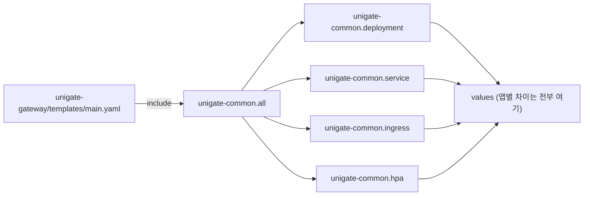
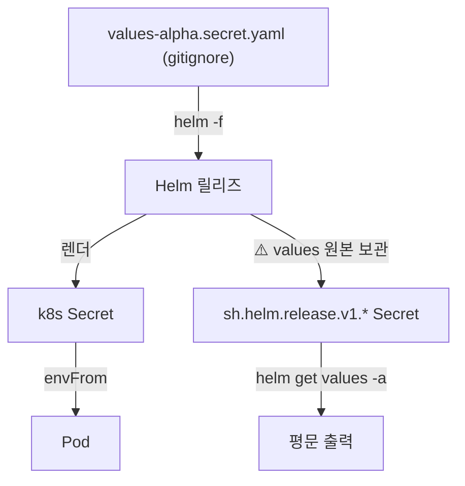

# 27. 모듈별 Helm 차트와 실전 배포 — 비밀이 새는 경로, 그리고 조용히 틀리는 것들

> 앱이 하나에서 넷으로 늘 때 차트를 복제하지 않는 법, 비밀이 git 말고도 새는 두 번째 경로,
> 그리고 배포에서 만난 세 가지 오진 유발 증상.
> 관련: Phase 6 · 커밋 `5c28720` · 코드 `deploy/helm/unigate-common/**` · `deploy/deploy-alpha.sh`

## 1. 왜 필요했나

Phase 8 이후 배포 대상이 **앱 4개**(gateway · iam · demo-be · demo-fe)가 됐는데,
배포 자산은 Phase 0 에서 만든 **게이트웨이 1개 전제** 그대로였다. 실사해 보니 상태가 더 나빴다:

- IAM 은 bootJar 잔 이름이 `iam.jar` 인데 `.dockerignore` 화이트리스트가 `app.jar` 만 허용해
  **빌드 컨텍스트에서 아예 제외**됐다 — 이미지 빌드 자체가 불가능
- 차트가 단일 워크로드 전제라 `helm template` 결과에 Deployment 가 하나뿐
- alpha 프로필이 fallback 없이 요구하는 환경변수 8개가 secret 예시에 없음

여기서 두 가지 설계 결정이 필요했다: **차트를 어떻게 나눌 것인가**, **비밀을 어떻게 넣을 것인가**.

## 2. 익숙한 방식과의 대조

### 2.1 차트 구조

| | 앱마다 차트 복제 (사내 참조 프로젝트 방식) | library chart 공유 (택한 것) |
|---|---|---|
| 템플릿 | 앱마다 `templates/` 8개 파일 복제 | **1벌**. 앱 차트는 `include` 한 줄 |
| 수정 비용 | 4곳을 고쳐야 한다 | 한 곳 |
| 자족성 | 차트 하나로 완결 (ArgoCD 등록 단순) | `helm dependency update` 선행 필요 |
| 갈라짐 | **시간이 지나면 복제본들이 서서히 달라진다** | 구조적으로 불가능 |

복제 방식이 틀린 건 아니다. 사내 참조 프로젝트는 팀이 여럿이고 앱마다 요구가 달라 자족성이
더 중요했을 수 있다. 여기서는 앱 4개 중 3개가 거의 같은 JVM 앱이라 복제 비용이 이득보다 컸다.

### 2.2 비밀 주입

| | Helm values 에 담기 | 차트 밖 Secret (택한 것) |
|---|---|---|
| 정의 위치 | `values-*.secret.yaml` (gitignore) | `.env` (gitignore) → `kubectl create secret` |
| 차트 역할 | Secret 을 **만든다** | 이름으로 **참조만** 한다 (`envFrom`) |
| git 노출 | gitignore 로 막는다 | 같음 |
| **`helm get values -a`** | **평문이 나온다** ← | 나오지 않는다 |
| 수명주기 | 릴리즈와 함께 | 분리 (수동 정리 필요) |

## 3. 동작 원리

### 3.1 library chart

`Chart.yaml` 의 `type: library` 는 "이 차트는 렌더 가능한 리소스를 갖지 않는다"는 선언이다.
`templates/` 안의 파일이 전부 `_` 로 시작하고 `define` 만 들어 있다.



앱 차트의 `templates/` 에는 이 한 줄만 있다:

```
{{ include "unigate-common.all" . }}
```

`.`(현재 컨텍스트)를 넘기므로 라이브러리 안에서 `.Values` 는 **앱 차트의 values** 를 가리킨다.

### 3.2 비밀이 새는 두 번째 경로

이게 이번에 새로 안 것이다. Helm 은 릴리즈의 values 를 **클러스터에 Secret 으로 보관한다**
(`sh.helm.release.v1.<release>.v<N>`). 롤백을 지원하려면 이전 values 를 알아야 하기 때문이다.



즉 **git 을 막아도 네임스페이스 read 권한자에게는 그대로 보인다.** 두 경로를 모두 막으려면
비밀이 values 를 거치지 않아야 하고, 그래서 차트에서 `secret.yaml` 템플릿을 들어냈다.

### 3.3 좌표와 비밀을 나눈 이유

| 범주 | 예 | 성격 | 대응 |
|---|---|---|---|
| 진짜 비밀 | DB 비밀번호 · client secret | 유출 시 즉시 피해 | k8s Secret |
| 실제 좌표 | 네임스페이스 · ingress host · 레지스트리 | 피해는 없지만 public 저장소에 못 올린다 | 임시 values 파일로 주입 |

좌표를 Secret 에 넣으면 **무엇이 진짜 비밀인지 흐려지고**, 호스트 하나 바꾸려고 secret 을
다시 만들어야 한다. 반대로 좌표를 values 에 커밋하면 §8 위반이다.

한 가지 요령: 클러스터 내부 통신은 **같은 네임스페이스의 짧은 Service 이름**을 쓰면
네임스페이스가 값에 박히지 않는다.

```yaml
IAM_URI: "http://unigate-iam-svc"          # 커밋 가능
# IAM_URI: "http://unigate-iam-svc.<ns>.svc.cluster.local"   # 좌표가 박힌다
```

## 4. 직접 확인한 것

### 4.1 렌더 가드가 실제로 막는가

빈 값으로 뜨는 것보다 렌더가 실패하는 편이 낫다고 판단해 `fail` 을 넣었다. 확인:

```bash
helm template unigate-gateway ./unigate-gateway -f ./unigate-gateway/values-alpha.yaml \
  --set global.namespace=test-ns --set global.image.repository=r/gw --set global.image.tag=t1
```

```
Error: execution error at (unigate-gateway/templates/main.yaml:6:3):
ingress.hosts[].host 가 비어 있습니다 — 배포 스크립트의 --set 주입을 확인하세요.
```

이미지 저장소를 빼면:

```
Error: execution error at (unigate-iam/templates/main.yaml:1:3):
image.repository (또는 global.image.repository) 가 비어 있습니다 — 레지스트리 경로를 주입하세요.
```

관찰: 빈 host 로 Ingress 가 생기면 "모든 호스트" 규칙이 되어 **다른 서비스의 트래픽까지 삼킬 수
있다.** 렌더 단계에서 끊는 편이 안전하다.

### 4.2 lint · dry-run

```bash
for c in unigate-common unigate-gateway unigate-iam unigate-demo-be unigate-demo-fe; do
  helm lint $c; done
```

```
1 chart(s) linted, 0 chart(s) failed      (5개 전부)
```

```bash
./deploy/deploy-alpha.sh --dry-run --skip-build all
```

```
(dry-run) unigate-iam 렌더 통과
(dry-run) unigate-demo-be 렌더 통과
(dry-run) unigate-gateway 렌더 통과
(dry-run) unigate-demo-fe 렌더 통과
```

관찰: 순서가 `iam → demo-be → gateway → demo-fe` 로 나온다. GW 가 앞의 두 Service 를 URI 로
참조하므로 스크립트가 순서를 강제한다.

### 4.3 빈 값 가드

secret 파일에 빈 키가 남아 있으면 배포를 막게 했다. 실제로 걸렸다:

```
ERROR [gateway] deploy/env/alpha.gateway.secret.env 에 빈 값이 있습니다:
SPRING_R2DBC_USERNAME SPRING_R2DBC_PASSWORD
```

관찰: 빈 문자열이 주입되면 앱은 뜨지만 placeholder 미해결 예외가 **나지 않고**
잘못된 좌표로 조용히 동작한다. fail-closed 설계가 무력해지는 자리라 배포 단계에서 끊는다.

### 4.4 FE 런타임 주입 (k8s 와 같은 제약으로 로컬 재현)

```bash
docker run --rm -p 18080:8080 --read-only --tmpfs /tmp --user 101:101 \
  -e API_BASE_URL=https://gw.example.test unigate-demo-fe:local-test
```

```
INFO: runtime config 생성 완료 (apiBaseUrl=https://gw.example.test)
```

```bash
curl -D- localhost:18080/config.js
```

```
HTTP/1.1 200 OK
Cache-Control: no-store, no-cache, must-revalidate
window.__UNIGATE_CONFIG__ = { apiBaseUrl: "https://gw.example.test" };
```

빌드된 `index.html`:

```html
<head>
  <script type="module" crossorigin src="/assets/index-CEPO_VpD.js"></script>
</head>
<body>
  <div id="root"></div>
  <script src="/config.js"></script>
</body>
```

관찰: vite 가 앱 번들을 `<head>` 로 옮겼는데도 `config.js` 가 먼저 실행된다.
module 스크립트는 defer 처럼 동작해 DOM 파싱 후 실행되고, `config.js` 는 일반 스크립트라
파싱 중 즉시 실행되기 때문이다. **`type="module"` 을 붙였다면 순서가 뒤집혔을 것이다.**

### 4.5 실배포 — 가입 e2e

```
POST /iam/register        → 201  PENDING_IDENTITY
outbox_record             → CREATE_KEYCLOAK_USER | COMPLETED | attempts=1
user_profile              → ACTIVE | user_ref=0aed02cb-…
Keycloak realm 'unigate'  → 사용자 실제 생성 (enabled=true, emailVerified=false)
재요청                     → 409 email_already_registered
```

브라우저 로그인 후 두 감사 스트림을 대조:

```
GW  (unigate.audit_log)        LOGIN_SUCCESS | subject=0aed02cb-6801-4cc3-b404-eb734432a349
IAM (unigate_iam.user_profile)                user_ref=0aed02cb-6801-4cc3-b404-eb734432a349
```

관찰: 가입으로 만든 신원(IAM → outbox → Keycloak Admin API)과 브라우저 로그인으로 인증된
주체(GW → Keycloak OIDC)가 **동일한 `sub`** 다. 두 서비스가 각자 다른 DB 에 쓰면서도
하나의 신원 체계를 공유한다는 것이 실물로 확인됐다.

### 4.6 Flyway 직렬화 (다중 인스턴스)

IAM 을 replica 2 로 띄웠을 때 두 파드의 로그:

```
zghkr → o.f.core.internal.command.DbMigrate : Successfully applied 6 migration
vnb7c → o.f.core.internal.command.DbMigrate : Schema "public" is up to date. No migration necessary.
```

관찰: 15초 차이로 동시에 떴는데 마이그레이션은 **한 번만** 적용됐다. Flyway 가 DB 잠금으로
직렬화한다는 것을 문서로만 알고 있었는데 실물로 확인됐다.

## 5. 함정 / 실패 모드

### 5.1 arm64 이미지를 amd64 노드에 배포 — 레지스트리는 멀쩡히 보인다

**증상**

```
Failed to pull image "<registry>/unigate-iam:2026...":
rpc error: code = NotFound desc = failed to pull and unpack image ...:
no match for platform in manifest: not found
```

**왜 헷갈리나**: Harbor 웹 UI 에는 이미지가 **정상적으로 보이고 Pull 카운트까지 올라간다.**
push 는 실제로 성공했기 때문이다. 거절한 것은 레지스트리가 아니라 **노드의 containerd** 다.
그래서 push 권한이나 프로젝트 설정을 의심하게 된다.

**원인**: Apple Silicon(arm64)에서 `docker build` 하면 arm64 이미지가 만들어진다.

```
로컬 빌드 : linux/arm64
클러스터   : <worker-node>-0~2  →  amd64
```

**해결**: `--platform linux/amd64` 명시. 그리고 **push 전에** 확인해 끊는다:

```bash
built="$(docker image inspect "${image}" --format '{{.Os}}/{{.Architecture}}')"
[[ "${built}" == "${UNIGATE_PLATFORM}" ]] || die "..."
```

이 오류는 레지스트리를 통과한 뒤 파드 단계에서야 드러나므로, **늦게 발견될수록 원인이 멀어진다.**

FE 는 한 걸음 더 필요했다. 빌드 스테이지까지 amd64 로 강제하면 `npm ci` 와 `vite build` 가
QEMU 에뮬레이션으로 돌아 몇 배 느려진다. 정적 산출물은 아키텍처와 무관하므로:

```dockerfile
FROM --platform=$BUILDPLATFORM node:22-alpine AS build   # 네이티브
...
FROM nginxinc/nginx-unprivileged:1.27-alpine             # 빌드 명령의 --platform 적용
```

### 5.2 `The connection attempt failed` — 인증 실패가 **아니라는 것**이 단서

**증상**: IAM 파드가 CrashLoopBackOff. 로그:

```
Caused by: org.flywaydb.core.internal.exception.FlywaySqlException:
  Unable to obtain connection from database: The connection attempt failed.
Caused by: org.postgresql.util.PSQLException: The connection attempt failed.
```

**왜 헷갈리나**: 로컬 psql 로는 같은 자격증명으로 접속이 된다. 그래서 비밀번호나 권한을 의심한다.

**진단의 결정적 지점**: PostgreSQL 은 **인증 실패를 반드시 로그에 남긴다.**

```
2026-07-28 17:07:19 KST [1876] unigate_gw@unigate FATAL: password authentication failed
```

그런데 파드가 뜬 시각 전후로 **DB 서버 로그에 시도 기록이 한 건도 없었다.**
기록이 없다는 것은 연결이 서버까지 오지 않았다는 뜻이다 → 네트워크 문제.

```bash
kubectl run db-probe --rm -i --image=curlimages/curl -- \
  sh -c 'nc -z -w 5 <db-private-ip> 5432 && echo OPEN || echo BLOCKED'
```

```
<db-private-ip>      OPEN        ← 사설 IP
<db-public-ip>    BLOCKED     ← 공인 IP(FIP)
```

**원인**: DB 에 사설 IP 와 FIP 가 둘 다 있는데 secret 에 FIP 를 넣었다. 파드는 사설망에서
붙어야 하고, FIP 는 보안그룹에서 클러스터 IP 가 허용되지 않아 막힌다.

**교훈**: `password authentication failed` 와 `The connection attempt failed` 는 **다른 층위의
실패**다. 전자는 인증, 후자는 TCP. 이 구분을 알면 조사 범위가 절반으로 준다.
그리고 `log_connections = on` 을 켜 두면 "도달했는가"를 바로 답할 수 있다.

### 5.3 requests 는 예약이지 사용량이 아니다

**증상**: gateway 파드만 `Pending`. IAM·demo-be 는 떴다.

```
0/4 nodes are available: 1 node(s) were unschedulable,
                         2 Insufficient cpu, 2 Insufficient memory.
```

**함정**: 노드가 실제로 바쁜 게 아니었다.

```
노드                            CPU 예약    CPU 실사용
<worker-node>-0     99%          6%
<worker-node>-1     88%          8%
<worker-node>-2     99%          7%
```

다른 워크로드가 requests 를 실사용의 15배 넘게 잡아둔 탓에 **스케줄러가 새 파드를 거절**한
것이지, CPU 가 부족한 게 아니었다. 메모리는 성격이 달라 실사용도 61~87% 로 진짜 쓰이고 있었다.

**판단 기준**:

| 상황 | 조치 |
|---|---|
| 예약만 꽉 참 (실사용 낮음) | requests 를 실사용에 맞게 낮춘다 |
| 실사용도 높음 | 노드 증설 외에는 답이 없다 |

여기서는 CPU 는 전자, 메모리는 후자였다. 그래서 **CPU request 만 낮추고 memory 는 유지**했다.
스케일 상한을 정하는 것은 CPU 가 아니라 메모리였다.

> ⚠️ 이 조치에는 대가가 있다. request 를 낮추면 HPA 의 utilization(실사용÷request)이
> 부풀려져 오토스케일이 과민해진다. 상세는 [28](28-k6-loadtest-silent-failures.md) §5.3.

### 5.4 `kubectl apply` 는 last-applied annotation 을 되살린다

TLS secret 을 네임스페이스 간 복사할 때, `last-applied-configuration` annotation 에
**인증서 개인키가 통째로** 들어 있다. jq 로 지우고 apply 했는데 다시 생겼다 —
`kubectl apply` 가 스스로 그 annotation 을 만들기 때문이다.

```bash
kubectl get secret ssl-common -o json \
  | jq 'del(.metadata.annotations, ...)' \
  | kubectl apply -f -          # ← 여기서 annotation 이 재생성된다
```

**해결**: 사후에 제거하거나, 애초에 `--server-side` 로 apply 한다(그 방식은 이 annotation 을
쓰지 않는다).

### 5.5 gitignore 는 제외된 디렉토리 안을 보지 않는다

```gitignore
loadtest/results/          # ← 디렉토리째 제외
!loadtest/results/.gitkeep # ← 먹지 않는다
```

디렉토리가 제외되면 git 은 그 안을 아예 들여다보지 않아 하위 예외가 적용되지 않는다.

```gitignore
loadtest/results/*
!loadtest/results/.gitkeep
```

## 6. 남은 의문

- **`IDENTITY_CREATED` 의 `trace_id` 가 alpha 에서는 null 이다.** 로컬 검증(P8g)에서는
  "`@Scheduled` 가 Micrometer observation 으로 감싸져 자기 span 을 만든다"고 정정했는데,
  alpha 에서는 값이 없다. 결론(가입↔신원생성을 traceId 로 못 잇는다)은 같지만 이유가 다르다.
  샘플링 확률·observation 자동설정 차이 중 무엇인지 아직 모른다.

- **Helm 릴리즈 secret 의 values 는 어디까지 남는가.** `helm get values -a` 로 보이는 것은
  확인했지만, revision history(`revisionHistoryLimit`)에 따라 **과거 revision 의 values 도
  함께 남는지** 확인하지 않았다. 남는다면 한 번이라도 values 에 비밀을 넣은 릴리즈는
  그 이력까지 지워야 한다.

- **library chart 의 버전 관리.** 지금은 `file://../unigate-common` 로컬 참조라
  앱 차트와 항상 같이 움직인다. 차트를 저장소에 publish 하게 되면 앱마다 다른 버전을 참조할 수
  있게 되는데, 그때 "템플릿 1벌"이라는 이점이 유지되는지는 다시 봐야 한다.

- **ssl-common 인증서 갱신.** cert-manager 관리가 아니라 수동 인증서라, 원본이 갱신돼도
  복사본은 따라가지 않는다. reflector 같은 동기화 수단이 필요한지, 아니면 cert-manager 로
  옮기는 게 맞는지 판단하지 못했다.
