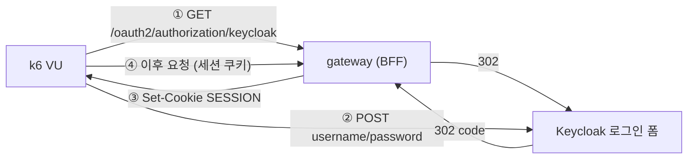
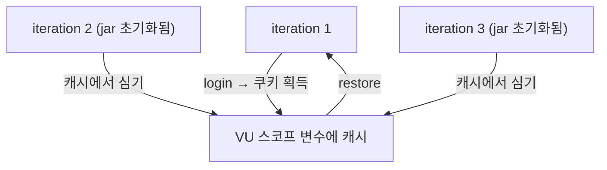

# 28. 부하테스트가 조용히 실패하는 법 — 세션, 검사, 그리고 HPA 지표의 왜곡

> 요청은 계속 나가고 checks 는 100% 통과하는데 실제로는 아무것도 측정하지 않을 수 있다.
> 그걸 어떻게 알아채는가.
> 관련: Phase 6 · 커밋 `883bbbb` · 코드 `loadtest/lib/session.js` · `loadtest/SCENARIOS.md`

## 1. 왜 필요했나

alpha 에 4개 앱을 올린 뒤([27](27-helm-library-chart-and-alpha-deploy.md)) 처음으로 부하를
줘 봤다. 목표는 두 가지였다:

- 게이트웨이의 rate limit 이 **어디서 끊는가**
- 앱이 **얼마를 처리하고** HPA 가 제때 따라오는가

착수 전에 이미 알고 있던 제약이 하나 있었다. rate limit 키가 `sub`(인증된 사용자)라
운영 설정 그대로 부하를 주면 **초당 5 요청에서 전부 429 로 튕겨 애플리케이션에 도달하지 않는다.**
그러면 CPU 가 안 올라 HPA 도 반응하지 않고, 측정되는 것은 앱 용량이 아니라 Valkey 토큰버킷의
처리량이다. 그래서 시나리오를 둘로 나눴다.

정작 문제는 다른 데 있었다. **스크립트가 세 군데 틀렸는데 전부 조용히 틀렸다.**

## 2. 익숙한 방식과의 대조

| | 흔한 부하테스트 (REST + Bearer) | 여기서 (BFF + 세션) |
|---|---|---|
| 인증 취득 | Direct Access Grants 로 토큰 발급 | **통하지 않는다.** GW 는 `oauth2Login` 만 설정된 OAuth2 Client 라 Bearer 를 인증으로 안 받는다 |
| 자격 보관 | 헤더에 토큰 문자열 | **쿠키 jar** — 그리고 이 jar 의 수명이 함정이다 |
| VU 초기화 | `setup()` 에서 토큰 받아 공유 | 사용자별 로그인이 **SSO 세션 때문에 서로 간섭**한다 |

k6 의 쿠키 수명은 이 표에서 가장 중요한 줄이다:

| 상태 | 수명 |
|---|---|
| 쿠키 jar | **iteration** — 반복마다 초기화된다 |
| 모듈 최상위 변수 | **VU** — iteration 을 넘어 유지되고 VU 끼리는 독립 |
| `setup()` 반환값 | 전역 — 모든 VU 가 공유 |

## 3. 동작 원리

### 3.1 BFF 에 부하를 주려면 로그인 플로우를 통과해야 한다



Keycloak 이 HTML 폼을 주므로 `kc-form-login` 의 action URL 을 파싱해 POST 한다.
`&amp;` 를 되돌리지 않으면 쿼리 파라미터가 깨져 Keycloak 이 "invalid request" 를 내는데,
증상만 보면 자격증명 문제로 오해한다.

### 3.2 세션을 iteration 너머로 나르기



```js
let cachedSession = null   // 모듈 최상위 = VU 스코프

export function ensureSession(baseUrl, username, password) {
  if (cachedSession === null || cachedUser !== username) {
    login(baseUrl, username, password)
    cachedSession = extractSessionCookie(baseUrl)
    cachedUser = username
  }
  restoreSession(baseUrl, cachedSession)   // 매 iteration
}
```

**`setup()` 에서 한꺼번에 로그인하지 않는 이유**는 §5.2 에 있다.

## 4. 직접 확인한 것

### 4.1 같은 스크립트, 정반대 결과

두 회차 모두 부하 프로파일과 대상이 동일하다. 다른 것은 세션 처리뿐이다.

| | 1차 (결함) | 2차 (수정 후) |
|---|---|---|
| `unigate_throttled_429` | **0건** | 632건 (50.80%) |
| `unigate_accepted_2xx` | 20건 | 612건 |
| `http_req_failed` | **92.56%** | 0.08% |
| HPA CPU | 오르지 않음 | 167%/60% |
| **checks** | **100% 통과** | 100% 통과 |

1차 요약(발췌):

```
unigate_throttled_429..........: 0      0/s
unigate_accepted_2xx...........: 20     0.13318/s
http_req_failed................: 92.56% 1245 out of 1345
checks_succeeded...............: 100.00% 2530 out of 2530
```

관찰: **429 가 0건인 것을 "rate limit 이 넉넉하구나"로 읽을 뻔했다.** 실제로는 요청이 미인증이라
백엔드에 도달조차 못 했다.

### 4.2 시나리오 A — rate limit 경계 (수정 후)

```
unigate_throttled_429 ......: 632    (50.80% of 1244)
unigate_accepted_2xx .......: 612
unigate_ratelimit_remaining : avg=1.89  min=0  med=0  max=9
http_req_duration ..........: p(95)=47.95ms
  { status:429 } ...........: p(95)=25.44ms
checks .....................: 100% (3734/3734)

✓ p(95)<200  →  http_req_duration{status:429} p(95)=25.44ms
✓ rate<0.01  →  http_req_failed{expected_response:true} 0.00%
```

관찰 세 가지:

1. `remaining` 의 **중앙값이 0** 이다 — 버킷이 실제로 바닥까지 갔다가 회복했다.
   평균만 보면 1.89 라 여유가 있어 보이는데, 중앙값이 실상을 말한다.
2. **429 가 통과보다 빠르다**(25.44ms < 47.95ms). 거절 경로가 백엔드를 타지 않고
   게이트웨이에서 끝난다는 뜻이다.
3. 429 를 `expected_response` 에 포함시켜 실패로 세지 않았다. 안 그러면
   **정책이 잘 동작할수록 테스트가 실패**하는 거꾸로 된 판정이 된다.

### 4.3 시나리오 B — 용량 · HPA

```
요청 수 .....................: 28,270      (42.82 req/s)
iterations ..................: 28,090
실패율 ......................: 0.127%
429 발생 ....................: 0
checks ......................: 84,342 / 0  (100%)
unigate_target_duration .....: avg=31.03ms med=28.48ms p(95)=46.33ms max=610.15ms

✓ p(95)<1000   ✓ p(99)<2000   ✓ 429==0   ✓ checks>0.99
```

HPA 를 15초 간격으로 함께 기록했다:

| 시각 | HPA CPU | 파드 | 국면 |
|---|---|---|---|
| 18:19:56 | 24%/60% | 2 | 웜업 |
| 18:20:58 | **257%** | 2 | 임계 초과 → 트리거 |
| 18:21:43 | — | **4** | 새 파드 Running (45초 만에) |
| 18:24:47 | **400%** | 4 | 피크 (상한에 막힘) |
| 18:29:51 | 174% | 4 | 램프다운 |
| 18:30:52 | 36% | 4 | scaleDown 안정화 창(300s) 대기 |

파드별 CPU 도 기록됐다:

```
[18:20:42]   unigate-gateway-deploy-...-dp4vq cpu=125m mem=487Mi
[18:20:42]   unigate-gateway-deploy-...-rwnbm cpu=132m mem=465Mi
```

관찰: **모든 파드가 고르게 부하를 받았다.** 세션이 파드 로컬이었다면 특정 파드에만 몰리거나
대부분 401 이 났을 것이다 — Spring Session + Valkey 가 다중 인스턴스에서 동작한다는 실증이다.
(Phase 6 W6 항목이 여기서 부수적으로 닫혔다.)

### 4.4 완화가 반영됐는지 확인

시나리오 B 는 완화 오버레이가 전제다. 반영 여부를 눈으로 확인:

```bash
kubectl -n <ns> get deploy unigate-gateway-deploy \
  -o jsonpath='{range .spec.template.spec.containers[0].env[*]}{.name}={.value}{"\n"}{end}' | grep RATELIMIT
```

```
RATELIMIT_BURST_CAPACITY=20000
RATELIMIT_REPLENISH_RATE=10000
```

테스트 후 원복하면 이 env 자체가 사라진다(애플리케이션 기본값 5/10 사용):

```
(RATELIMIT env 없음)
```

## 5. 함정 / 실패 모드

### 5.1 쿠키 jar 는 VU 가 아니라 iteration 단위다

**증상**: 429 가 0건인데 성공도 20건뿐. 나머지는 전부 실패인데 **checks 는 100% 통과.**

**원인**: `if (!__ITER) login(...)` — "VU 마다 한 번만 로그인" 이라는 흔한 패턴을 썼다.
k6 의 쿠키 jar 는 **iteration 마다 초기화**되므로 두 번째 반복부터 세션이 사라진다.

**왜 발견이 늦었나** — 이게 핵심이다:

- 요청·응답은 계속 오간다 → 처리량 그래프는 정상으로 보인다
- 당시 검사는 `429는 헤더로 사유를 준다`(429가 아니면 자동 통과)와 `5xx가 아니다`(401도 통과)
  둘뿐이었다 → **401 을 잡는 검사가 하나도 없었다**
- 429 가 0건인 것이 오히려 "여유롭다"로 읽힌다

**교훈**: **성공 조건만 검사하면 실패가 침묵한다.** 그래서 이 검사를 넣었다:

```js
'인증이 유지된다 (401/302 아님)': (r) => r.status !== 401 && r.status !== 302,
```

같은 원리가 모니터링 필터에도 적용된다 — 성공 마커만 grep 하면 crashloop 이 침묵으로 지나간다.

### 5.2 `setup()` 에서 여러 사용자를 로그인하면 두 번째부터 실패한다

**증상**:

```
GoError: 로그인 폼을 찾지 못했습니다 (status=404).
  at login (loadtest/lib/session.js:52)
  at setup (loadtest/scenario-b-capacity.js:79)
```

**원인**: 첫 사용자 로그인 뒤 **Keycloak 의 SSO 세션 쿠키**가 jar 에 남는다. 두 번째
`/oauth2/authorization/keycloak` 요청은 로그인 폼을 거치지 않고 바로 통과해 버리고,
폼을 찾지 못해 끊긴다.

**해결**: VU 별로 로그인한다. VU 마다 jar 가 독립이라 **다른 사용자의 SSO 세션이 섞일 자리가
구조적으로 없다.** 로그인 횟수는 VU 수만큼이지만 VU 당 1회뿐이라 IdP 부하는 미미하다.

> 대안으로 매 로그인 전에 jar 를 비우는 방법도 있다. 다만 GW 도메인뿐 아니라 **Keycloak 도메인의
> 쿠키까지** 지워야 해서, 지울 대상을 빠뜨리면 같은 증상이 다시 난다. VU 분리가 더 견고하다.

### 5.3 request 를 낮추면 HPA 가 과민해진다

**관찰**: HPA 가 **400%/60%** 까지 갔는데 응답은 **p95 46ms · 실패 0.127%** 로 멀쩡했다.

**원인**: HPA 의 utilization 은 **실사용 ÷ request** 다.

```
cpu request = 50m,  파드당 실사용 ≈ 200m   →  400%
```

[27](27-helm-library-chart-and-alpha-deploy.md) §5.3 에서 스케줄을 통과시키려고 request 를
`100m → 50m` 로 낮췄는데, 그 값이 **HPA 의 분모**이기도 했다. 노드에는 CPU 가 7코어 이상
유휴였고 실제 지연도 짧았다. 앱이 포화된 게 아니라 **지표가 부풀려진 것**이다.

**구조적 긴장점**:

| 쓰임 | 요구 방향 |
|---|---|
| 스케줄링 | request 가 **작아야** 빈 노드에 들어간다 |
| 오토스케일링 | request 가 **실사용에 가까워야** utilization 이 진실을 말한다 |

**둘이 같은 값을 공유하는데 요구가 반대**다. 포화된 클러스터에서는 스케줄 통과를 우선할 수밖에
없고, 그 대가로 HPA 판단이 왜곡된다.

**판단 기준**: 부하 수치를 "앱 성능"으로 읽으려면 request 가 실사용에 가까워야 한다.
그렇지 않은 상태에서 나온 HPA 반응은 **스케일아웃이 동작한다는 증거일 뿐 용량의 증거가 아니다.**

### 5.4 `handleSummary` 는 기본 요약을 대체한다

**증상**: 실행은 끝났는데 콘솔에 threshold 판정도 checks 도 없다.

```
{
  "p95_ms": 46.32,
  "requests": 28270,
  ...
}
```

**원인**: `handleSummary` 를 정의하면 k6 의 기본 텍스트 요약이 **통째로 대체된다.**
핵심 지표만 JSON 으로 뱉게 짰더니 "통과했는지 알 수 없는" 실행이 됐다.

**해결**: threshold 판정을 직접 렌더한다. **판정이 보이지 않는 요약은 요약이 아니다.**

```js
for (const [name, metric] of Object.entries(data.metrics)) {
  for (const [expr, res] of Object.entries(metric.thresholds ?? {})) {
    lines.push(`  ${res.ok ? '✓' : '✗'} ${name} ${expr}`)
  }
}
```

덤으로 `loadtest/results/` 디렉토리가 없어 파일 저장도 실패했다. k6 는 없는 디렉토리를
만들지 않는다:

```
could not open 'loadtest/results/scenario-b-summary.json': no such file or directory
```

### 5.5 계정 준비의 함정 — `temporary` 플래그

가입 API 는 비밀번호를 받지 않으므로 Keycloak Admin API 로 따로 걸어야 한다.

```json
{"type":"password","value":"...","temporary":false}
```

`temporary: true`(기본값)면 로그인 직후 **비밀번호 변경 화면**으로 넘어가고, k6 는 폼에서 멈춘다.
증상은 "로그인 실패" 로만 보여 자격증명을 의심하게 된다.

## 6. 남은 의문

- **최대 처리량을 아직 모른다.** 이번 수치(42.8 req/s, p95 46ms)는 HPA 상한 4에 막힌 값이다.
  노드 여유를 확보하고 request 를 실사용에 맞게(200m 정도) 되돌려야 진짜 용량이 나온다.
  그때 병목이 게이트웨이인지, IAM 인지, DB 커넥션 풀인지도 함께 갈라야 한다.

- **파드별 요청 수를 세지 않았다.** 파드별 CPU 가 고르게 올랐다는 것으로 분산을 추정했지만,
  액세스 로그나 파드별 카운터가 있으면 더 확실하다. 세션 공유를 엄밀히 증명하려면
  "파드 A 가 발급한 세션으로 파드 B 가 응답했다"를 직접 보여야 한다.

- **로컬에서 ingress 를 통해 쏘는 것의 영향.** 인터넷 구간이 병목에 얼마나 기여했는지 모른다.
  클러스터 안에서 k6 Job 으로 돌려 대조해야 갈린다.

- **scaleDown 을 끝까지 관찰하지 못했다.** 안정화 창이 300초라 램프다운 후에도 replica 가
  4로 남아 있었다. 실제로 언제 어떻게 줄어드는지, 줄어들 때 in-flight 요청이 끊기지 않는지는
  확인하지 않았다.

- **429 를 받은 클라이언트의 재시도 정책이 없다.** 이번 측정은 "거절이 빠르다"까지만 봤다.
  실제 클라이언트가 429 를 받고 어떻게 행동해야 하는지(backoff·Retry-After)는 정하지 않았고,
  응답에 `Retry-After` 를 넣고 있는지도 확인하지 않았다.
