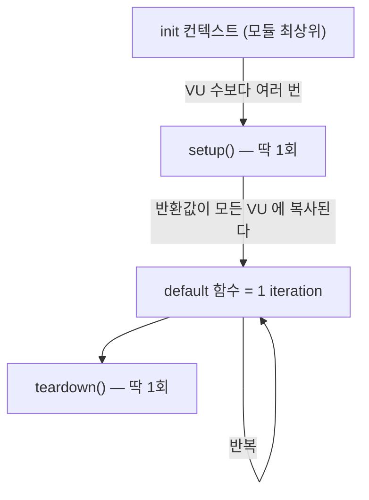

# 29. k6 실행 모델 — 생명주기 · executor · 판정

> k6 스크립트는 위에서 아래로 한 번 실행되는 프로그램이 아니다.
> 어느 코드가 몇 번 도는지, 실패가 어떻게 종료코드가 되는지를 모르면 조용히 틀린다.
> 관련: Phase 6 · 커밋 `883bbbb` · 코드 `loadtest/lib/session.js` · `loadtest/scenario-a-ratelimit.js`

## 1. 왜 필요했나

[28](28-k6-loadtest-silent-failures.md) 에서 부하테스트가 세 군데 틀렸는데 전부 조용했다.
사후에 원인을 정리하다 보니 셋 다 뿌리가 하나였다 — **k6 의 실행 모델을 몰랐다.**

| 28 에서 겪은 증상 | 실제로 몰랐던 것 |
|---|---|
| 두 번째 iteration 부터 세션이 사라진다 | 쿠키 jar 의 **수명 단위**가 무엇인가 |
| checks 100% 인데 아무것도 측정 안 됨 | check 와 threshold 가 **다른 물건**이라는 것 |
| `handleSummary` 를 넣었더니 판정이 사라졌다 | 요약이 **대체**된다는 것 |

그래서 도구 자체를 한 번 정리했다. 이 문서는 unigate 시나리오 실행법이 아니라
(그건 [`loadtest/README.md`](../../loadtest/README.md)) **k6 라는 도구를 어떻게 이해할 것인가**다.

## 2. 익숙한 방식과의 대조

JUnit 통합테스트를 쓰던 감각으로 k6 를 읽으면 거의 모든 줄이 어긋난다.

| | JUnit 통합테스트 | k6 |
|---|---|---|
| 실행 단위 | 테스트 메서드 1회 | **VU × iteration** — 같은 함수가 수만 번 돈다 |
| 상태 공유 | 필드·`@BeforeEach` | 스코프가 **셋**(init / VU / 전역)이고 수명이 다르다 |
| 성공 판정 | assert 실패 = 테스트 실패 | **check 실패는 테스트 실패가 아니다**(§3.3) |
| 부하 개념 | 없음 | executor 가 **부하 모양**을 정한다(§3.2) |
| 결과 | 통과/실패 | 통계 분포. "몇 %가 몇 ms 안에" |

가장 위험한 착각은 3행이다. **JUnit 의 assert 처럼 생겼는데 그렇게 동작하지 않는다.**

## 3. 동작 원리

### 3.1 생명주기 — 코드가 어디에 있느냐로 실행 횟수가 정해진다



| 위치 | 실행 시점 | 할 수 있는 것 |
|---|---|---|
| **init**(모듈 최상위) | 스크립트 파싱 시. **VU 수보다 많이 돈다**(§4.1) | `import`, 파일 읽기, 상수 정의 |
| **`setup()`** | 부하 시작 전 1회 | 준비 작업. 반환값이 각 VU 에 **복사**된다 |
| **default 함수** | VU 당 반복. 이게 1 iteration | 실제 요청 |
| **`teardown()`** | 끝난 뒤 1회 | 정리 |

**init 에서 HTTP 요청을 할 수 없다**(k6 가 막는다). 로그인을 init 에 두려던 시도가 여기서 막히고,
그래서 "그럼 첫 iteration 에서 하자"는 패턴으로 흘러가 28 의 함정에 빠진다.

### 3.2 스코프가 셋이고 수명이 다르다

이게 28 §5.1 의 뿌리다.

| 담는 곳 | 수명 | VU 간 |
|---|---|---|
| 쿠키 jar | **iteration** — 반복마다 초기화 | 독립 |
| 모듈 최상위 변수 | **VU** — iteration 을 넘어 유지 | 독립 |
| `setup()` 반환값 | 전역 — 시작 시 고정 | **공유**(복사본) |

세션 쿠키를 iteration 너머로 나르려면 **jar 가 아니라 모듈 최상위 변수**에 둬야 한다.
`lib/session.js` 의 `cachedSession` 이 정확히 그 자리다.

> `setup()` 반환값은 **읽기 전용으로 취급**해야 한다. VU 마다 복사본이라 거기에 쓴 값은
> 다른 VU 에 보이지 않는다. "전역이니까 공유되겠지" 로 카운터를 넣으면 조용히 어긋난다.

### 3.3 check 와 threshold 는 다른 물건이다 (가장 중요)

이름이 둘 다 "검사"라 헷갈리는데 **역할이 완전히 다르다.**

| | `check()` | `thresholds` |
|---|---|---|
| 무엇 | 응답 하나가 조건에 맞는가 | **집계 지표**가 기준을 넘었는가 |
| 실패하면 | 카운터만 올린다. **테스트는 계속 통과** | **종료코드 99**. CI 가 빨간불 |
| 언제 쓰나 | 무엇이 틀렸는지 **진단**하려고 | 합격/불합격을 **판정**하려고 |

**check 만 있는 스크립트는 절대 실패하지 않는다.** 100% 실패해도 exit 0 이다(§4.2 실측).
CI 에 물려 놓고 초록불을 보며 안심하는 상태가 여기서 만들어진다.

**판단 기준:** check 는 진단, threshold 는 판정. 판정이 필요하면 **check 결과를 threshold 로
승격**한다:

```js
thresholds: {
  checks: ['rate>0.99'],   // 이 한 줄이 check 실패를 종료코드로 만든다
}
```

시나리오 B 가 `checks: ['rate>0.99']` 를 넣은 이유이고, 시나리오 A 가 429 를
`expected_response` 에 넣은 이유도 같은 계열이다 — **무엇을 실패로 셀지는 자동으로 정해지지 않는다.**

### 3.4 executor — 부하의 "모양"

executor 는 **무엇을 고정할지**를 고르는 것이다.

| 계열 | 고정하는 것 | 응답이 느려지면 | 답하는 질문 |
|---|---|---|---|
| `*-vus` (`constant-vus`, `ramping-vus`) | **동시 사용자 수** | 요청을 **덜** 보낸다 | "동시 N명을 견디는가" |
| `*-arrival-rate` | **초당 도착률** | VU 를 **더** 쓴다 | "초당 N건이 들어오면" |

**판단 기준:**

- **용량·동시성**을 보려면 VU 기반 → 시나리오 B(`ramping-vus`)
- **정책 경계**를 보려면 도착률 기반 → 시나리오 A(`ramping-arrival-rate`)

시나리오 A 가 도착률 기반인 이유가 여기 있다. rate limit 측정에 VU 기반을 쓰면
**429 가 빨리 돌아올수록 요청을 더 보내게 돼서**, "얼마를 보냈는가"가 부하 설정이 아니라
응답 속도에 좌우된다. 재현이 안 되는 측정이 된다.

⚠️ 도착률 기반에는 대가가 있다 — **`preAllocatedVUs` 가 모자라면 도착률을 못 지키는데,
그래도 테스트는 통과한다**(§4.3).

### 3.5 커스텀 메트릭 4종

| 타입 | 남기는 것 | 쓸 곳 |
|---|---|---|
| `Counter` | 누적 합 | 429 총 건수 |
| `Gauge` | **마지막 값**(+min/max) | 순간값. 누적이 아니다 |
| `Rate` | 참인 비율 | 429 비율 |
| `Trend` | 분포(avg·med·p90·p95·max) | 지연시간 |

`unigate_ratelimit_remaining` 을 `Trend` 로 잡은 것이 실제로 결론을 갈랐다 —
**평균 1.89 는 여유 있어 보이는데 중앙값이 0** 이었다(28 §4.2). `Gauge` 였다면 마지막 값 하나만
남아 이 판단을 못 했다.

## 4. 직접 확인한 것

`k6 v2.1.0 (commit/devel, go1.26.4, darwin/arm64)` · 로컬 macOS. 네트워크 없이 실행 모델만 확인했다.

### 4.1 init 은 VU 수보다 많이 돈다

VU 2개 · VU당 2 iteration 으로 각 위치에 로그를 심었다.

```js
console.log(`[init] __VU=${__VU} __ITER=${typeof __ITER}`)   // 모듈 최상위
export function setup() { ... return { token: 'FIXED-VALUE' } }
export default function (data) { ... }
export function teardown(data) { ... }
```

```
[init] __VU=0 __ITER=undefined
[init] __VU=1 __ITER=undefined
[init] __VU=2 __ITER=undefined
[init] __VU=0 __ITER=undefined
[setup] __VU=0 __ITER=undefined
[default] __VU=2 __ITER=0 data={"token":"FIXED-VALUE"}
[default] __VU=1 __ITER=0 data={"token":"FIXED-VALUE"}
[default] __VU=1 __ITER=1 data={"token":"FIXED-VALUE"}
[default] __VU=2 __ITER=1 data={"token":"FIXED-VALUE"}
[init] __VU=0 __ITER=undefined
[teardown] __VU=0 data={"token":"FIXED-VALUE"}
[init] __VU=0 __ITER=undefined
```

관찰 세 가지:

1. **init 이 6번 돌았다.** VU 는 2개인데. `__VU=0` 이 4번인데 이게 setup/teardown 용 컨텍스트다.
   **init 에 비용이 있는 코드를 두면 VU 수만큼도 아니고 그 이상 실행된다.**
2. **`__ITER` 는 init 에 존재하지 않는다.** 첫 시도에서 그냥 에러가 났다:
   ```
   ERRO ReferenceError: __ITER is not defined
        at file:///...lifecycle.js:4:39(24)  hint="script exception"
   ```
   `__VU` 는 되고 `__ITER` 는 안 된다 — 반복이 아직 없기 때문이다.
3. `setup()` 반환값이 **모든 VU 의 모든 iteration** 에 그대로 전달됐다.

### 4.2 check 는 100% 실패해도 exit 0, threshold 는 exit 99

같은 실패(항상 false 인 check + p95 500ms)를 threshold 유무만 바꿔 두 번 돌렸다.

**threshold 없음:**

```
checks_total.......: 4       6768.189509/s
checks_succeeded...: 0.00%   0 out of 4
checks_failed......: 100.00% 4 out of 4
✗ 항상 실패하는 검사
  ↳  0% — ✓ 0 / ✗ 4
fake_duration........: avg=500ms min=500ms med=500ms max=500ms p(90)=500ms p(95)=500ms
```
```
>>> EXIT=0
```

**threshold 추가(`checks: ['rate>0.99']`, `fake_duration: ['p(95)<100']`):**

```
✗ 'rate>0.99' rate=0.00%
✗ 'p(95)<100' p(95)=500ms
...
ERRO thresholds on metrics 'checks, fake_duration' have been crossed
```
```
>>> EXIT=99
```

**검사는 한 글자도 안 바꿨고 결과도 똑같은데 종료코드가 0 과 99 로 갈렸다.**
CI 판정을 만드는 것은 check 가 아니라 threshold 다.

### 4.3 VU 가 모자라면 부하가 조용히 줄어든다

`constant-arrival-rate` 로 초당 20건 × 5초 = **100건**을 의도하고, `preAllocatedVUs`/`maxVUs` 를
일부러 2로 뒀다(iteration 당 0.5s 소요 → 2 VU 로는 초당 4건이 한계).

```
WARN Insufficient VUs, reached 2 active VUs and cannot initialize more
     executor=constant-arrival-rate scenario=rate_based
...
dropped_iterations...: 81  7.04292/s
iterations...........: 120 10.433955/s
```
```
>>> EXIT=0
```

**의도한 100건 중 81건이 버려졌다**(실행된 것은 19건). 그런데:

- 로그 레벨은 `WARN` — 에러가 아니다
- **종료코드는 0** — 통과다
- 요약의 `iterations: 120` 은 앞 시나리오(VU 기반 100건)를 합친 수라 **얼핏 정상으로 보인다**

`dropped_iterations` 를 보지 않으면 "초당 20건을 줬다"고 믿게 된다. 시나리오 A 가
`preAllocatedVUs: 20, maxVUs: 100` 을 잡아 둔 것이 이 때문이다.

**이건 자동 판정으로 바꿀 수 있다.** `dropped_iterations` 도 threshold 를 걸 수 있는지
확인해 봤다:

```js
thresholds: { dropped_iterations: ['count==0'] },
```

```
✗ 'count==0' count=49
dropped_iterations...: 49  14.846073/s
ERRO thresholds on metrics 'dropped_iterations' have been crossed
```
```
>>> EXIT=99
```

동작한다. **도착률 기반 시나리오에는 이 한 줄을 넣는 게 맞다** — 부하가 의도대로 나갔는지를
사람이 요약을 읽어서 판단하지 않아도 된다. (시나리오 A 에는 아직 안 넣었다. 이 문서의 후속 작업.)

### 4.4 메트릭 타입별 출력

같은 입력 `[10, 200, 30, 400, 50]` 을 4종에 모두 넣었다.

```
demo_counter.........: 5      17182.130584/s
demo_gauge...........: 50     min=10     max=400
demo_rate............: 40.00% 2 out of 5
demo_trend...........: avg=138ms min=10ms med=50ms max=400ms p(90)=320ms p(95)=359.99ms
```

`Gauge` 가 **50** — 마지막 값이다. 400 이라는 피크는 `max` 로만 남는다.
같은 데이터인데 `Trend` 는 중앙값 50 과 p95 360 을 함께 보여준다.
**"평균은 괜찮은데 꼬리가 나쁜" 상황은 `Trend` 로만 보인다.**

### 4.5 VU 스코프 변수 확인

모듈 최상위 변수를 iteration 마다 증가시켰다(VU 2 · 각 3회).

```
VU=2 ITER=0 moduleVar=1
VU=1 ITER=0 moduleVar=1
VU=1 ITER=1 moduleVar=2
VU=2 ITER=1 moduleVar=2
VU=2 ITER=2 moduleVar=3
VU=1 ITER=2 moduleVar=3
```

**iteration 을 넘어 유지되고(1→2→3), VU 끼리는 섞이지 않는다**(둘 다 독립적으로 1→3).
세션 캐시에 딱 맞는 수명이라는 것이 여기서 확인된다.

## 5. 함정 / 실패 모드

이 도구의 실패는 대부분 **에러가 아니라 통과로 나타난다.** 정리하면:

| 함정 | 증상 | 신호는 어디에 |
|---|---|---|
| check 만 있고 threshold 없음 | 전부 실패해도 **exit 0** | 요약의 `checks_failed` |
| `preAllocatedVUs` 부족 | 부하가 조용히 줄어듦 | `dropped_iterations` · `WARN Insufficient VUs` → **threshold 로 잡을 것**(§4.3) |
| 성공 조건만 검사 | 401 이 통과로 세어짐 (28 §5.1) | 실패를 직접 겨냥한 check 를 넣어야만 보인다 |
| init 에 비용 있는 코드 | 예상보다 많이 실행 | §4.1 — VU 수보다 많이 돈다 |
| `setup()` 반환값에 쓰기 | 다른 VU 에 안 보임 | 증상 없음. 설계로 피해야 한다 |
| `handleSummary` 정의 | threshold 판정이 사라짐 (28 §5.4) | 없음 — 직접 렌더해야 한다 |

**공통 구조가 있다.** k6 는 "요청을 보내고 응답을 받는 데 성공했는가"까지만 자동으로 본다.
**그 요청이 의도한 부하였는지, 그 응답이 의도한 결과였는지는 전부 사용자가 선언해야 한다.**
선언하지 않은 것은 실패하지 않는다.

그래서 스크립트를 쓸 때 순서를 이렇게 잡는 게 안전하다:

1. 무엇을 **실패로 셀지** 먼저 정한다(`responseCallback` · `expected_response`)
2. 그걸 **threshold 로** 올린다 — 안 그러면 판정이 안 된다
3. **실패를 겨냥한 check** 를 넣는다(`인증이 유지된다` 같은 것)
4. 부하가 **실제로 나갔는지** 확인한다(`dropped_iterations`)

### 5.1 exit 99 를 기억할 것

CI 에 물릴 때 `k6 run` 의 종료코드만 보면 된다. 다만 **99 라는 값이 threshold 실패 전용**이고
스크립트 예외(exit 107 계열)와 구분된다는 점은 알아둬야 한다 — "테스트가 실패했다"와
"스크립트가 깨졌다"는 대응이 다르다.

## 6. 남은 의문

- **exit code 체계를 실측으로만 안다.** 99(threshold)와 0 은 확인했지만, 스크립트 예외나
  중단 시 코드는 확인하지 않았다. CI 에서 "실패"와 "깨짐"을 갈라 다루려면 표가 필요하다.

- **`setup()` 반환값의 복사 비용**을 모른다. VU 가 수백 개일 때 큰 객체를 반환하면 어떻게 되는지
  — 참조인지 진짜 복사인지, 메모리에 어떻게 잡히는지 확인하지 않았다.

- **분산 실행(k6 operator / cloud)에서 이 모델이 그대로인지** 모른다. 특히 `setup()` 이
  인스턴스마다 1회인지 전체에서 1회인지에 따라 계정 준비 로직이 달라진다. 클러스터 안에서
  Job 으로 돌리는 것이 [28](28-k6-loadtest-silent-failures.md) §6 의 숙제이므로 그때 갈린다.

- **`ramping-arrival-rate` 의 stage 전환 시 동작.** 도착률을 20/s 에서 2/s 로 떨어뜨릴 때
  이미 실행 중인 iteration 이 어떻게 되는지(끊는지 기다리는지) 확인하지 않았다.
  시나리오 A 의 "회복 구간" 해석에 영향을 준다.
