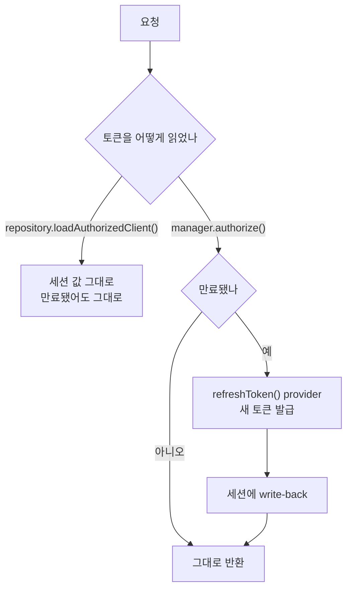

# 30. 같은 실패가 두 번 났다 — 세션에서 토큰을 꺼내는 두 가지 방법

> 문서로 남긴 실패가 다음 코드에서 되살아났다. 개별 버그가 아니라 **API 가 그렇게 생겼기 때문**이다.
> 관련: Phase 9f · 코드 `gateway/.../TenantGateFilter.kt` · `gateway/.../TokenRelayConfig.kt`
> 선행: [04](04-oauth2-authorization-code-bff.md) §6 · [05](05-token-relay.md) · [23](23-coarse-authz-tenant-gate.md) §4.6

## 1. 왜 필요했나

이 저장소는 **토큰 갱신 실패를 두 번 겪었다.** 두 번째는 첫 번째를 문서로 남긴 뒤에 일어났다.

| | 언제 | 어디서 | 증상 |
|---|---|---|---|
| 1차 | Phase 1 Step 5 | TokenRelay 도입 전 | 만료 69초 뒤에도 갱신 시도조차 없음 |
| 2차 | Phase 9f | `TenantGateFilter` | **게이트를 거는 라우트만 500** |

2차를 고치며 23 §4.6 에 이렇게 적었다:

> **이 실패는 이 저장소가 이미 한 번 겪은 것이다.** 세션에서 토큰을 직접 꺼내는 코드를 새로 쓸
> 때마다 같은 함정이 되살아난다. **문서로 남긴 것과 다음 코드가 그것을 피하는 것은 별개다.**

같은 실패가 반복되면 그건 부주의가 아니라 **구조**다. 무엇이 이걸 반복시키는지 정리한다.

## 2. 익숙한 방식과의 대조

세션에서 토큰을 꺼내는 방법이 **둘 있고, 이름이 비슷하고, 둘 다 컴파일된다.**

| | `ServerOAuth2AuthorizedClientRepository` | `ReactiveOAuth2AuthorizedClientManager` |
|---|---|---|
| 하는 일 | 저장된 것을 **그대로** 돌려준다 | 필요하면 **갱신해서** 돌려준다 |
| 만료 토큰 | 만료된 채로 준다 | refresh token 으로 새로 받아 세션에 다시 저장 |
| 이름이 주는 인상 | "저장소에서 읽는다" — 자연스럽다 | "관리자" — 뭘 관리하는지 불분명 |

JPA 감각으로 보면 `repository.findById()` 는 **가장 평범한 선택**이다. 여기서도 그렇게 읽힌다.
그런데 이 도메인에서 "저장된 값"은 **시간이 지나면 틀린 값**이 된다.

```
access token 5분  <  세션 30분
```

수명이 다르므로 세션이 살아 있는 동안 반드시 만료 구간이 생긴다.
**저장소는 그 구간을 모른다.** 알아야 할 이유도 없다 — 저장소의 계약은 "저장한 걸 준다"이다.

## 3. 동작 원리

### 3.1 누가 토큰을 갱신하는가



핵심은 **갱신에 계기가 필요하다**는 것이다. 배경 스레드가 주기적으로 도는 게 아니라,
`manager.authorize()` 호출이 곧 갱신 계기다. 그래서 04 §6 의 실측이 이렇게 나왔다 —
TokenRelay 가 없던 시점에는 **아무도 토큰을 쓰지 않아서** 갱신될 이유가 없었다.

### 3.2 provider 를 빠뜨리면 manager 도 갱신하지 않는다

manager 를 쓴다고 자동으로 되는 게 아니다. `refreshToken()` provider 가 있어야 한다.

```kotlin
ReactiveOAuth2AuthorizedClientProviderBuilder
  .builder()
  .authorizationCode()
  .refreshToken()      // ← 이게 없으면 만료를 감지해도 할 수 있는 게 없다
  .build()
```

즉 **실패 지점이 둘**이다. repository 를 쓰거나(1), manager 를 쓰되 provider 를 빠뜨리거나(2).
둘 다 증상이 "만료 후에만" 나타난다.

### 3.3 왜 게이트만 500 이었나

2차 사고가 헷갈렸던 이유다. 같은 요청 안에서 두 경로가 **다른 API 로** 토큰을 읽고 있었다.

| 경로 | 읽는 방법 | 만료 시 |
|---|---|---|
| TokenRelay 필터 | manager (Spring 제공) | 갱신 → 정상 |
| `TenantGateFilter` | repository (직접 작성) | 만료 토큰 → 검증 실패 → **500** |

그래서 "테넌트를 지정한 요청만 500, 나머지는 정상"이라는 형태가 됐다.
**프레임워크가 주는 경로는 이미 옳게 되어 있었고, 직접 쓴 코드만 틀렸다.**

## 4. 직접 확인한 것

### 4.1 1차 — 만료 69초 뒤에도 갱신 시도가 없었다

[04](04-oauth2-authorization-code-bff.md) §6 의 실측이다. TokenRelay 도입 전:

```
현재(UTC) = 2026-07-24T02:20:49Z
  authenticated = True
  issuedAt      = 2026-07-24T02:14:39.940261Z
  expiresAt     = 2026-07-24T02:19:39.940261Z
  만료까지      = -69 초 → 이미 만료됨
  refreshToken  = True

$ curl -b <쿠키> localhost:8080/api/echo
  status=200
```

`refreshToken` 은 **있는데** `issuedAt` 이 그대로다 — 갱신할 수단은 있었고 계기가 없었다.
그런데도 200 이 나온다. 게이트웨이의 인증 판단은 세션(30분)만 보기 때문이다.
**"동작하니까 맞다"가 성립하지 않는 구간**이 여기서 만들어진다.

TokenRelay 도입 후 같은 조건에서 `iat` 이 `1784866678 → 1784867065` 로 바뀌었다([05](05-token-relay.md) §4).

### 4.2 2차 — repository 로 읽으니 게이트만 500

[23](23-coarse-authz-tenant-gate.md) §4.6 의 실측이다.

```json
{"case":"GW 경유 · 내 테넌트 자원","status":500,
 "body":{"error":"Internal Server Error","path":"/api/orders/acme-1","requestId":"8391f1eb-29"}}
```

```
TokenVerificationException: 토큰이 만료되었습니다 (exp=2026-07-27T06:26:55Z)
	*__checkpoint ⇢ HTTP GET "/api/orders/acme-1" [ExceptionHandlingWebHandler]
[post] GET /api/orders/acme-1 status=500 INTERNAL_SERVER_ERROR
```

manager 로 바꾼 뒤, **만료된 세션을 그대로 둔 채** 재기동해 다시 측정:

```json
[{"case":"GW 경유 · 내 테넌트 자원","status":200,"body":{"id":"acme-1","tenantId":"acme","item":"노트북 거치대"}},
 {"case":"GW 경유 · 남의 테넌트 자원","status":404,"body":{"reasonCode":"order_not_found"}},
 {"case":"GW 경유 · 비소속 테넌트 주장","status":403,"body":{"detail":"요청한 테넌트에 소속되어 있지 않습니다"}}]
```

갱신이 실제로 일어난 근거는 `expiresAt` 이 `06:26:55Z → 06:38:08Z` 로 바뀐 것이다.

### 4.3 지금 코드에서 토큰을 읽는 곳 전수 조사

같은 실패가 세 번째로 살아날 자리가 남아 있는지 직접 세어 봤다.

```bash
grep -rn 'ServerOAuth2AuthorizedClientRepository\|ReactiveOAuth2AuthorizedClientManager' \
  gateway/src/main --include='*.kt' | grep -v import
```

```
config/TokenRelayConfig.kt:65:    authorizedClientRepository: ServerOAuth2AuthorizedClientRepository,
config/TokenRelayConfig.kt:66:  ): ReactiveOAuth2AuthorizedClientManager {
config/TokenRelayConfig.kt:74:    return DefaultReactiveOAuth2AuthorizedClientManager(
adapter/gatewayIn/AuthProbeConfig.kt:34:  private val authorizedClientRepository: ServerOAuth2AuthorizedClientRepository,
config/SecurityConfig.kt:58:    authorizedClientRepository: ServerOAuth2AuthorizedClientRepository,
config/SecurityConfig.kt:279:  fun authorizedClientRepository(): ServerOAuth2AuthorizedClientRepository =
config/SecurityConfig.kt:280:    WebSessionServerOAuth2AuthorizedClientRepository()
adapter/gatewayIn/TenantGateFilter.kt:68:  private val authorizedClientManager: ReactiveOAuth2AuthorizedClientManager,
```

네 자리를 성격별로 갈랐다:

| 위치 | 성격 | 판정 |
|---|---|---|
| `SecurityConfig:279` | repository **빈 정의** | 문제 없음 — 저장소 자체는 있어야 한다 |
| `TokenRelayConfig:65~74` | manager 를 **만들며** repository 주입 | 문제 없음 — manager 가 저장소를 감싸는 구조 |
| `TenantGateFilter:68` | 토큰 **소비** | ✅ manager (2차에서 고친 자리) |
| `AuthProbeConfig:34` | 토큰 **소비** | ⚠️ repository — 아래 참조 |

`AuthProbeConfig` 는 `@Profile("local")` 진단용이고, 목적이 **"세션에 무엇이 담겨 있나"** 를 그대로
보는 것이라 repository 가 오히려 맞다. 갱신해 버리면 관찰하려던 상태가 관찰 행위로 바뀐다.

다만 **읽는 사람에게는 함정이다.** 이 프로브가 `accessToken.present == true` 를 보여줘도
그 토큰이 유효하다는 뜻은 아니다. 1차 실측(§4.1)이 정확히 그 상태였다.

### 4.4 500 이 다시 나지 않는지는 테스트가 지킨다

```bash
./gradlew :gateway:test --tests '*TenantGate*'
```

```
suite: me.ramos.unigate.adapter.gatewayIn.TenantGateFilterTest tests: 8 failures: 0 time: 0.05
 - Then: 헤더가 **제거된 채** 통과한다
 - Then: 위조 값이 아니라 **검증된 값**이 주입된다
 - Then: 그 테넌트가 주입돼 통과한다
 - Then: 403 으로 거부된다 — 다운스트림에 닿지 않는다
 - Then: 거부된다 — 판단할 수 없으면 열어주지 않는다(fail-closed)
 - Then: 500 이 아니라 **인증 예외**가 된다 — 재로그인이 해법이기 때문
 - Then: 서버 오류로 새어나가지 않는다
 - Then: 소속을 알 수 없으므로 거부한다(fail-closed)
```

6번째가 2차 사고의 회귀 테스트다. 다만 이 테스트가 지키는 것은 **"만료 시 500 이 아니라 401"**
이지 **"만료 시 갱신된다"** 가 아니다. 갱신 자체는 여전히 수동 실측(§4.2)으로만 확인했다.

## 5. 함정 / 실패 모드

### 5.1 왜 하필 이 실패가 반복되는가

세 조건이 겹친다.

| 조건 | 결과 |
|---|---|
| 이름이 자연스러운 쪽이 **틀린 쪽**이다 | `repository` 는 아무 의심 없이 고르게 된다 |
| 컴파일·타입·테스트가 **아무 말도 안 한다** | 둘 다 `OAuth2AuthorizedClient` 를 준다 |
| 증상이 **만료 후에만** 나타난다 | 개발 중 5분 안에 끝나는 요청에서는 안 보인다 |

세 번째가 특히 나쁘다. 로컬에서 손으로 눌러 보는 동안은 **거의 항상 정상**이다.
"오래 열어둔 탭"에서만 재현되는 형태라, 재현 조건을 모르면 원인 추적이 시작되지 않는다.

### 5.2 문서화는 재발을 막지 못했다

1차를 04 §6 에 남겼고, TokenRelayConfig KDoc 에도 적었다. 그런데 2차가 났다.

이유는 **문서가 있는 곳과 실수가 일어나는 곳이 다르기 때문**이다.
2차를 저지를 때 읽고 있던 것은 `ServerOAuth2AuthorizedClientRepository` 의 시그니처였지,
`TokenRelayConfig` 의 KDoc 이 아니었다. 새 코드를 쓰는 사람은 **자기가 부르는 API 옆의 정보**만 본다.

그래서 이번에는 위치를 바꿔 적었다 — 함정이 있는 **생성자 파라미터 바로 위**다:

```kotlin
class TenantGateFilter(
  private val tokenVerifier: TokenVerifierPort,
  /**
   * **repository 가 아니라 manager 를 받는다.** repository 는 세션에 저장된 토큰을 *그대로* 꺼내
   * 주므로 만료된 토큰도 그대로 돌려준다. …
   */
  private val authorizedClientManager: ReactiveOAuth2AuthorizedClientManager,
)
```

**판단 기준:** 반복되는 실수에는 "다음엔 조심하자"가 아니라 **구조적 방어**가 필요하다.
강도 순으로 셋이다.

1. **타입으로 막기** — 가장 강하다. 다만 여기서는 둘 다 Spring 타입이라 우리가 못 바꾼다
2. **테스트로 막기** — 증상(500)은 막았지만 원인(갱신 안 됨)은 못 막는다(§4.4)
3. **호출 지점에 문서 두기** — 지금 한 것. 가장 약하지만 유일하게 가능했다

1을 못 쓸 때 2·3을 겹쳐 쌓는 것 말고 방법이 없었다. 이게 이 사건의 결론이다.

### 5.3 만료는 서버 오류가 아니다

2차의 부수 교훈이다. 만료된 토큰을 만나 예외가 나면 그대로 500 이 나간다.

```kotlin
.onErrorMap(TokenVerificationException::class.java) { e ->
  CredentialsExpiredException("세션의 토큰을 검증할 수 없습니다", e)
}
```

**500 은 "우리 잘못"이라는 뜻**이고, 클라이언트가 할 수 있는 게 없다는 신호다.
만료는 재인증하면 해결되므로 401 이어야 한다. 갱신 로직을 고쳐도 이 매핑은 남겨 뒀다 —
refresh token 자체가 만료되는 경우(세션보다 오래 방치)는 여전히 존재하기 때문이다.

## 6. 남은 의문

- **refresh token 이 만료된 경우를 실측하지 않았다.** 갱신 실패 시 401 로 떨어지는 것까지는
  코드상 맞지만, 실제로 그 상태를 만들어 확인하진 않았다. Keycloak 의 refresh token 수명
  (SSO Session Idle)을 짧게 잡아 재현해야 한다.

- **동시 요청이 같이 만료를 만나면 어떻게 되나.** 여러 요청이 동시에 `authorize()` 를 부르면
  refresh 요청이 중복 발생하는지, manager 가 직렬화하는지 모른다. Keycloak 이 refresh token
  rotation 을 켜면 한쪽이 무효화된 토큰을 받을 수 있는데, 그 구성인지도 확인하지 않았다.
  **다중 인스턴스에서는 같은 세션의 요청이 서로 다른 파드로 갈 수 있어** 더 벌어진다.

- **`AuthProbeConfig` 를 어떻게 둘지 정하지 않았다**(§4.3). 지금은 repository 가 의도지만,
  "토큰이 있다"와 "토큰이 유효하다"를 구분해 보여주지 않아 읽는 사람을 오도할 수 있다.
  만료까지 남은 시간을 함께 노출하는 편이 나을 것 같은데, 진단 도구가 상태를 바꾸지 않는다는
  성질과 어떻게 양립시킬지는 아직 답이 없다.

- **네 번째 발생을 어떻게 막을지.** §5.2 의 3번(호출 지점 문서)은 새 파일을 만드는 사람에게는
  보이지 않는다. ArchUnit 으로 "`gatewayIn` 어댑터는 `ServerOAuth2AuthorizedClientRepository` 를
  주입받을 수 없다"를 강제하는 것이 [15](15-archunit-dependency-guard.md) 의 연장으로 가능해
  보이는데, `AuthProbeConfig` 예외를 어떻게 표현할지가 걸린다.
