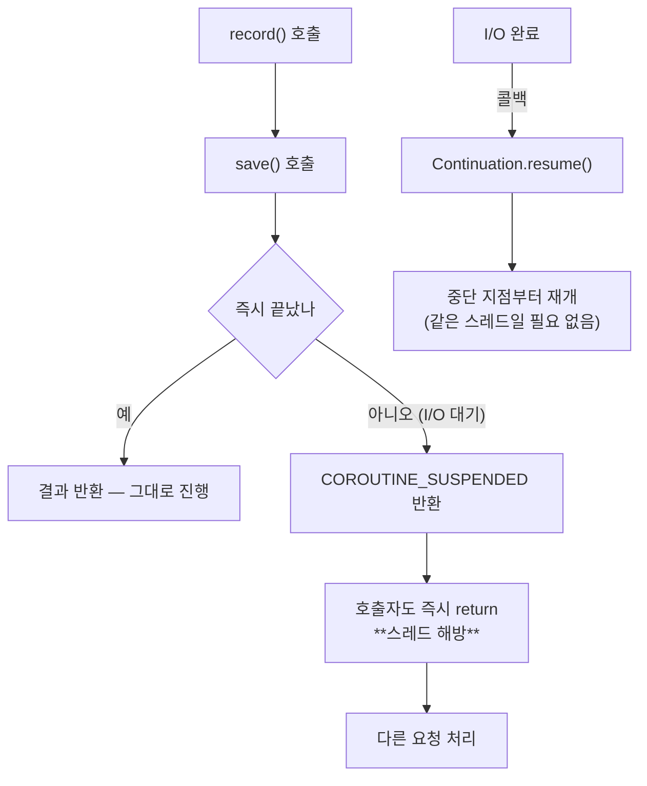

# 31. `suspend` 는 스레드를 멈추지 않는다 — 컴파일된 결과로 확인하기

> `suspend fun f()` 는 컴파일되면 `Object f(Continuation)` 이 된다.
> 이 한 줄을 이해하면 "왜 블로킹을 섞으면 안 되는가"가 규칙이 아니라 결론이 된다.
> 관련: Phase 2~5 · 코드 `gateway/.../RecordAuditEventUseCase.kt` · `gateway/.../AuditingAuthenticationHandlers.kt`

## 1. 왜 필요했나

`CLAUDE.md` §1.1 이 "처음 쓰는 기술"로 꼽은 것 중 마지막까지 문서가 없던 항목이다.
게이트웨이의 UseCase 는 전부 `suspend` 함수인데(`gateway` 모듈 규약), 정작 그게 **무엇인지**
설명한 적이 없었다. 규칙만 있었다:

> 프로덕션 코드에서 `.block()` 금지. coroutine 경계는 `mono { }` / `awaitBody()`

규칙을 지키는 것과 이유를 아는 것은 다르다. 특히 이 스택에서 규칙을 어기면
**컴파일 에러가 아니라 부하 시 장애**로 나타나기 때문에, 이유를 모르면 "왜 굳이"라는 생각이
들 수밖에 없다. 그래서 컴파일 결과를 직접 열어봤다.

## 2. 익숙한 방식과의 대조

| | 블로킹(Servlet + JDBC) | `suspend` |
|---|---|---|
| 대기 방식 | 스레드가 **멈춰 서서** 기다린다 | 함수가 **반환하고** 나중에 재개된다 |
| 동시성 비용 | 동시 요청 수 = 스레드 수 | 동시 요청 수 ≫ 스레드 수 |
| 대기 중 스레드 | 점유된 채 놀고 있다 | **다른 요청을 처리한다** |
| 코드 모양 | 순차적 | **순차적** (이게 핵심 장점) |
| 콜백 지옥 | 없음 | 없음 — 컴파일러가 변환한다 |

마지막 두 줄이 `suspend` 의 존재 이유다. 콜백이나 `flatMap` 체인 없이 **순차적으로 보이는 코드**를
쓰면서 논블로킹을 얻는 것. 그 대신 컴파일러가 코드를 상당히 바꾼다.

`iam` 모듈은 이걸 **쓰지 않는다.** Virtual Thread + JPA 라 블로킹이 정상이다([16](16-virtual-thread-vs-reactive-two-modules.md)).
같은 저장소 안에 두 모델이 공존하므로, 어느 모듈의 코드를 보고 있는지가 항상 먼저다.

## 3. 동작 원리

### 3.1 CPS 변환 — 컴파일러가 하는 일

`suspend` 함수는 **Continuation-Passing Style** 로 변환된다.

```kotlin
suspend fun record(command: RecordAuditEventCommand)      // 우리가 쓰는 것
```

```java
Object record(RecordAuditEventCommand command, Continuation<? super Unit> $completion)   // 실제 결과
```

두 가지가 바뀐다.

| 변화 | 이유 |
|---|---|
| `Continuation` 파라미터 추가 | "이 다음에 할 일"을 넘겨받는다. 재개 시점에 이걸 호출한다 |
| 반환 타입이 `Object` | `Unit` 을 반환할 수도, **"중단했음"이라는 표식**을 반환할 수도 있어야 한다 |

두 번째가 핵심이다. 반환값이 두 의미를 겸한다:

```
결과값                → 중단 없이 끝났다. 호출자는 그대로 진행
COROUTINE_SUSPENDED   → 중단했다. 호출자도 즉시 반환하고, 재개는 나중에
```

### 3.2 그래서 "스레드를 멈추지 않는다"



대기가 "스레드를 세우는 것"이 아니라 **"함수를 반환시키는 것"** 으로 바뀐다.
스레드는 콜스택을 비우고 다른 일을 하러 간다.

여기서 왜 블로킹이 치명적인지가 따라 나온다. `Thread.sleep()` 이나 JDBC 호출은
**반환하지 않고 스레드를 붙든다.** 이벤트 루프 스레드는 몇 개뿐이라(코어 수 수준),
그중 하나가 붙들리면 **그 스레드가 처리하던 모든 요청이 함께 멈춘다.**
저부하에서는 드러나지 않는다 — 요청이 적으면 남는 스레드가 있기 때문이다.

### 3.3 Reactor 와의 경계

Spring Cloud Gateway 는 `Mono`/`Flux` 로 말한다. 우리 UseCase 는 `suspend` 로 말한다.
둘 사이를 번역하는 지점이 필요하다.

| 방향 | 도구 |
|---|---|
| `suspend` → `Mono` | `mono { }` |
| `Mono` → `suspend` | `awaitSingle()` · `awaitSingleOrNull()` |

```kotlin
// Mono 세계에서 suspend 를 부른다
.flatMap { token -> mono { tokenVerifier.verify(token).tenants } }

// suspend 세계에서 Mono 를 기다린다
jwtDecoder.decode(rawToken).awaitSingle()
```

**`.block()` 은 이 목록에 없다.** `block()` 은 "Mono 가 끝날 때까지 스레드를 세워라"라서
§3.2 가 막으려던 바로 그 일을 한다. 이벤트 루프에서 부르면 `IllegalStateException` 이 나거나
데드락이 된다.

## 4. 직접 확인한 것

`gateway/build/classes/kotlin/main` 의 컴파일 산출물을 `javap` 로 열었다.

### 4.1 시그니처가 실제로 바뀐다

원본:

```kotlin
class RecordAuditEventUseCase(...) : RecordAuditEventInPort {
  override suspend fun record(command: RecordAuditEventCommand) { ... }
}
```

```bash
javap -p me/ramos/unigate/application/audit/service/RecordAuditEventUseCase.class
```

```
public class me.ramos.unigate.application.audit.service.RecordAuditEventUseCase implements ...RecordAuditEventInPort {
  private final ...SaveAuditEventOutPort saveAuditEventOutPort;
  public ...RecordAuditEventUseCase(...SaveAuditEventOutPort);
  public java.lang.Object record(...RecordAuditEventCommand, kotlin.coroutines.Continuation<? super kotlin.Unit>);
  static java.lang.Object record$suspendImpl(...RecordAuditEventUseCase, ...RecordAuditEventCommand, kotlin.coroutines.Continuation<? super kotlin.Unit>);
  private ...AuditEvent toEvent(...RecordAuditEventCommand);
}
```

관찰 세 가지:

1. **`Continuation` 파라미터가 붙었다.** 소스에는 없는 인자다.
2. **반환 타입이 `Unit` 이 아니라 `Object`** 다. Kotlin 에서는 반환값이 없는 함수인데도 그렇다.
3. `record$suspendImpl` 이라는 **static 메서드가 하나 더 생겼다.**
   (`open` 함수라 상속과 CPS 변환을 함께 처리하려고 만들어진 것)

인터페이스 쪽도 같다:

```
public interface ...SaveAuditEventOutPort {
  public abstract java.lang.Object save(...AuditEvent, kotlin.coroutines.Continuation<? super kotlin.Unit>);
}
```

### 4.2 `COROUTINE_SUSPENDED` 분기가 바이트코드에 그대로 있다

`javap -c` 로 본문을 봤다.

```
static java.lang.Object record$suspendImpl(...);
  Code:
     1: getfield      #23   // Field saveAuditEventOutPort:...
     6: invokespecial #42   // Method toEvent:(...)...AuditEvent;
    10: invokeinterface #48 // InterfaceMethod ...SaveAuditEventOutPort.save:(...AuditEvent;Lkotlin/coroutines/Continuation;)Ljava/lang/Object;
    15: dup
    16: invokestatic  #54   // Method kotlin/coroutines/intrinsics/IntrinsicsKt.getCOROUTINE_SUSPENDED:()Ljava/lang/Object;
    19: if_acmpne     23
    22: areturn                        ← 중단됨: 그대로 반환한다
    23: pop
    24: getstatic     #60   // Field kotlin/Unit.INSTANCE:Lkotlin/Unit;
    27: areturn                        ← 안 중단됨: Unit 반환
```

`save()` 의 반환값을 `COROUTINE_SUSPENDED` 와 **참조 비교**(`if_acmpne`)해서
같으면 그대로 반환하고, 다르면 `Unit` 을 반환한다.

§3.1 에서 말한 "반환값이 두 의미를 겸한다"가 추상적 설명이 아니라 **실제 바이트코드 분기**다.
그리고 이 분기 어디에도 **스레드를 세우는 명령이 없다.** 중단은 그냥 `areturn`(반환)이다.

### 4.3 `.block()` 이 정말 없는지 세어 봤다

```bash
grep -rn 'mono {\|awaitSingle()\|awaitSingleOrNull()\|awaitBody\|\.block()' gateway/src/main --include='*.kt'
```

```
adapter/gatewayIn/TenantGateFilter.kt:121:      .flatMap { token -> mono { tokenVerifier.verify(token).tenants } }
adapter/gatewayIn/AuthProbeConfig.kt:45:            .awaitSingleOrNull() as? Authentication
adapter/gatewayIn/AuthProbeConfig.kt:67:            ).awaitSingleOrNull()
adapter/gatewayIn/AuditingAuthenticationHandlers.kt:71:        mono { audit(authentication, traceId) }
adapter/gatewayIn/AuditingAuthenticationHandlers.kt:115:        mono { audit(exception, traceId) }
adapter/gatewayIn/AuditingAuthenticationHandlers.kt:163:        mono {
adapter/gatewayIn/LogoutProbeConfig.kt:33:        val authentication = request.principal().awaitSingleOrNull() as? Authentication
adapter/gatewayIn/LogoutProbeConfig.kt:45:            ?.awaitSingleOrNull()
adapter/r2dbcOut/R2dbcAuditLogAdapter.kt:50:      .awaitSingle()
adapter/keycloakOut/KeycloakTokenVerifier.kt:32:        jwtDecoder.decode(rawToken).awaitSingle()
```

**`.block()` 이 한 건도 없다.** 그리고 경계가 전부 **어댑터 계층**에만 있다 —
`application`·`domain` 에는 `mono {}` 도 `awaitX` 도 없다. Reactor 의존이 어댑터에 갇혀 있다는
뜻이고, 이건 [15](15-archunit-dependency-guard.md) 가 강제하는 방향과 같다.

### 4.4 두 모듈이 실제로 반대다

```bash
grep -rc 'suspend fun' iam/src/main --include='*.kt' | grep -v ':0' | wc -l
```

```
파일수: 0
```

`iam` 에는 `suspend` 함수가 **하나도 없다.** `gateway` 에는 8개 파일에 있다.
같은 저장소인데 동시성 모델이 정반대라는 것이 숫자로 확인된다.

## 5. 함정 / 실패 모드

### 5.1 `mono { }` 안에서 traceId 가 항상 null 이었다

실제로 겪은 실패다(Phase 4). 증상이 특히 나빴다:

**증상**: `audit_log.trace_id` 컬럼이 **전부 비어 있다.** 컴파일도 되고 예외도 없다.
**DB 를 열어보기 전까지 모른다.**

**원인**: `spring.reactor.context-propagation=auto` 의 적용 범위다.
이 설정은 **Reactor 연산자 경계**에서 ThreadLocal 을 복원하는데,
`mono { }` 의 본문은 Reactor 연산자가 아니라 **코루틴 실행 컨텍스트**다.
Reactor Context 는 코루틴으로 넘어가지만 **ThreadLocal(= Tracer 가 보는 곳)은 복원되지 않는다.**

**해결**: Reactor 연산자 안에서 먼저 읽어 **값으로** 넘긴다.

```kotlin
Mono
  .defer {
    // Reactor 연산자 경계 — 여기서는 ThreadLocal 이 복원돼 있어 traceId 가 잡힌다.
    val traceId = traceIdResolver.currentTraceId()
    mono { audit(authentication, traceId) }
  }
```

`defer` 인 이유는 **조립 시점이 아니라 구독 시점**에 읽어야 하기 때문이다.
`Mono.just(...)` 로 감싸면 조립 시점에 평가돼 다시 null 이 된다.

> 상세는 [13](13-distributed-tracing-reactor-context.md). 여기서는 "coroutine 경계를 넘을 때
> **무엇이 따라오고 무엇이 안 따라오는지**"가 요점이다 — 컨텍스트 전파는 경계마다 다르다.

### 5.2 `suspend` 인데 실제로는 중단하지 않는 함수

`LoggingAuditLogAdapter.save()` 는 `suspend` 지만 안에서 SLF4J 호출만 한다.

```kotlin
override suspend fun save(event: AuditEvent) {
  log.info("audit event_type={} ...", ...)
}
```

**이건 잘못이 아니다.** 포트 인터페이스가 `suspend` 라 구현도 `suspend` 여야 하고,
SLF4J 호출은 논블로킹(메모리 버퍼)이라 이벤트 루프를 막지 않는다.

⚠️ **다만 조건부다.** 파일 appender 를 동기(non-async)로 쓰면 그 순간 디스크 I/O 가
이벤트 루프에서 일어난다. `suspend` 라는 표시는 **"안전하다"는 보증이 아니다** —
그 안에서 무엇을 부르는지는 여전히 사람이 봐야 한다.

**판단 기준:** `suspend` 는 "중단할 수 있다"이지 "블로킹하지 않는다"가 아니다.
후자를 보증하는 것은 타입이 아니라 **호출 내용**이다.

### 5.3 컴파일러가 못 잡는 것들

| 하면 안 되는 것 | 컴파일 | 증상 |
|---|---|---|
| `suspend` 안에서 JDBC 호출 | **통과** | 저부하 정상, 고부하에서 전체 지연 폭발 |
| `suspend` 안에서 `Thread.sleep()` | **통과** | 같음 |
| `.block()` | **통과** | 런타임 `IllegalStateException` 또는 데드락 |
| `mono {}` 안에서 ThreadLocal 읽기 | **통과** | 조용히 null (§5.1) |

전부 통과한다. 이 표가 `CLAUDE.md` §4 의 함정 표가 존재하는 이유다.
**이 스택의 실수는 타입 시스템 아래로 빠져나간다.**

## 6. 남은 의문

- **`Dispatchers` 를 한 번도 지정하지 않았다.** `mono { }` 는 기본적으로 구독 스레드에서 돌지만,
  CPU 집약 작업이 생기면 `Dispatchers.Default` 로 옮겨야 하는 지점이 나올 것이다.
  지금은 그런 작업이 없어 마주치지 않았는데, 언제가 그 경계인지 기준이 없다.

- **`suspend` 함수 안의 예외가 Reactor 로 어떻게 전달되는지** 정확히 모른다.
  `mono { }` 가 예외를 `Mono.error` 로 바꿔주는 것은 동작으로 확인했지만
  (§`TenantGateFilter` 의 `onErrorMap` 이 실제로 잡는다), 취소(cancellation)가 섞이면
  어떻게 되는지 — 클라이언트가 연결을 끊으면 진행 중인 `suspend` 가 취소되는지 — 는 확인 안 했다.

- **구조적 동시성을 안 써봤다.** `coroutineScope { }` · `async` 로 병렬 호출을 만든 적이 없다.
  게이트웨이에서 두 다운스트림을 동시에 부르는 요구가 아직 없어서인데, 생기면 취소 전파와
  예외 처리가 §5 목록에 새 줄을 만들 것 같다.

- **`record$suspendImpl` 이 왜 생겼는지** 확신이 없다. `open`/`override` 함수의 CPS 변환과
  관련된 것으로 보이는데, 정확한 규칙(어떤 경우에 생기고 어떤 경우엔 안 생기는지)은 확인하지
  않았다. `R2dbcAuditLogAdapter.save` 에도 똑같이 `save$suspendImpl` 이 있었다.
