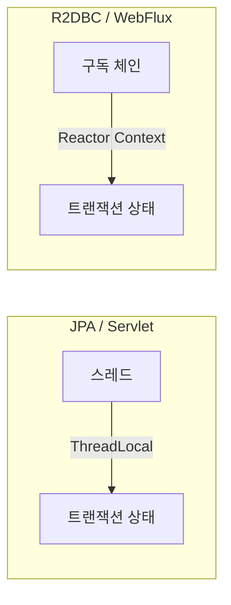

# 32. Reactive 에서 `@Transactional` — 되는데, 되는 조건이 다르다

> "reactive 에서는 `@Transactional` 이 안 된다"는 틀린 말이다. **되는데 조건이 다르고,
> 조건을 못 맞추면 예외 없이 그냥 트랜잭션이 안 걸린다.**
> 관련: Phase 5 · 코드 `gateway/.../R2dbcAuditLogAdapter.kt` · `iam/.../OutboxProcessor.kt`

## 1. 왜 필요했나

`CLAUDE.md` §4 의 함정 표에 이 줄이 있다.

| 함정 | 증상 | 규칙 |
|---|---|---|
| `@Transactional` 오용 | 트랜잭션 미적용 | reactive 는 `TransactionalOperator` 또는 reactive tx manager 기반 |

그런데 정작 `gateway` 에는 `@Transactional` 이 **하나도 없다.** 규칙만 있고 사례가 없는 상태였다.
"쓰지 않아서 안 겪은 것"인지 "쓸 수 없어서 안 쓴 것"인지 구분이 안 돼 있어서 정리했다.

결론부터: **쓸 수 없어서가 아니라 필요한 적이 없어서**다. 그리고 필요해졌을 때를 대비해
조건을 알아둬야 한다 — 이 함정은 **틀려도 조용하기** 때문이다.

## 2. 익숙한 방식과의 대조

| | JPA + Servlet | R2DBC + WebFlux |
|---|---|---|
| 트랜잭션 상태 보관 | **ThreadLocal** | **Reactor Context** |
| 경계 | 메서드 진입/이탈 | `Mono`/`Flux` **구독~종료** |
| tx manager | `DataSourceTransactionManager` | `R2dbcTransactionManager` |
| `@Transactional` 지원 | 됨 | **됨** (Spring 5.2+) |
| 반환 타입 제약 | 없음 | **있다** — §3.2 |
| 더티체킹으로 UPDATE | 있다 | **없다** |

가장 중요한 차이는 1행이다. ThreadLocal 은 "이 스레드가 지금 트랜잭션 안에 있다"를 나타내는데,
reactive 는 **한 요청이 여러 스레드를 오간다**([31](31-kotlin-coroutine-suspend.md) §3.2).
그래서 상태를 스레드가 아니라 **구독 체인**에 매달아야 한다. 그게 Reactor Context 다.

이 차이가 실패 모드를 만든다. **체인이 끊기면 트랜잭션도 끊긴다.**

## 3. 동작 원리

### 3.1 무엇이 트랜잭션을 붙드는가



블로킹에서는 "누가 실행 중인가"(스레드)가 곧 트랜잭션의 주인이다.
reactive 에서는 "어느 구독에 속하는가"가 주인이다.

따라서 **새로운 구독을 독립적으로 시작하면 그건 다른 트랜잭션**이다.
같은 메서드 안에서 호출했더라도, 부모 체인에 연결되지 않았다면 컨텍스트가 전달되지 않는다.

### 3.2 `@Transactional` 이 걸리는 조건

Spring 은 reactive `@Transactional` 을 지원한다. 다만 조건이 셋이다.

| 조건 | 못 맞추면 |
|---|---|
| `ReactiveTransactionManager` 빈이 있어야 한다(`R2dbcTransactionManager`) | 트랜잭션이 시작되지 않는다 |
| 반환 타입이 `Mono`/`Flux` 이거나 **suspend 함수**여야 한다 | 프록시가 체인을 감쌀 수 없다 |
| 호출이 **프록시를 통과**해야 한다 | 자기 호출(self-invocation)은 무시된다 — 블로킹과 같은 함정 |

세 번째는 블로킹에서도 같지만, 두 번째가 reactive 고유다.
`@Transactional fun foo(): String` 처럼 평범한 타입을 반환하면 감쌀 체인이 없다.

⚠️ **이 조건들을 못 맞춰도 예외가 나지 않는다.** 메서드는 정상 실행되고 커밋/롤백만 없다.
JPA 습관에서 오는 사람에게 가장 위험한 지점이다 — 블로킹에서도 자기 호출 함정이 있었지만,
거기서는 최소한 "트랜잭션이 필요한 코드"가 대개 예외를 냈다. 여기서는 그냥 각 SQL 이
자동커밋으로 나간다.

### 3.3 대안 — `TransactionalOperator`

어노테이션 대신 명시적으로 감싸는 방법이 있다.

```kotlin
transactionalOperator.execute { ... }        // Flux
transactionalOperator.transactional(mono)    // Mono
```

**판단 기준:**

| 상황 | 선택 |
|---|---|
| UseCase 하나가 트랜잭션 경계와 일치한다 | `@Transactional` — 선언적이라 읽기 쉽다 |
| 체인 일부만 묶고 싶다 · 경계가 조건부다 | `TransactionalOperator` — 범위가 코드에 보인다 |
| 자기 호출 구조를 피하기 어렵다 | `TransactionalOperator` — 프록시에 의존하지 않는다 |

## 4. 직접 확인한 것

### 4.1 gateway 에는 `@Transactional` 이 0개다

```bash
grep -rc '@Transactional' gateway/src/main --include='*.kt' | grep -v ':0' | wc -l
```

```
파일수: 0
```

`TransactionalOperator` 도 없다:

```bash
grep -rln 'TransactionalOperator\|@Transactional' gateway/src/main --include='*.kt'
```

```
(출력 없음)
```

반면 `iam` 은 21곳에서 쓴다:

```
application/outbox/service/OutboxRetentionService.kt:43:  @Transactional
application/outbox/service/OutboxAdminService.kt:45:  @Transactional(readOnly = true)
application/outbox/service/OutboxProcessor.kt:75:  @Transactional(propagation = Propagation.REQUIRES_NEW)
application/tenant/service/MembershipService.kt:72:  @Transactional(readOnly = true)
application/tenant/service/MembershipService.kt:98:  @Transactional
...
application/user/service/ChangeMyEmailService.kt:50:  @Transactional
```

### 4.2 쓸 수 없어서가 아니다 — 클래스패스에는 다 있다

"reactive 라서 못 쓴다"면 클래스패스에 트랜잭션 인프라가 없어야 한다. 확인해 보니 반대였다.

```bash
./gradlew :gateway:dependencies --configuration runtimeClasspath | grep -iE 'spring-tx|r2dbc'
```

```
io.r2dbc:r2dbc-pool:1.0.2.RELEASE
io.r2dbc:r2dbc-spi:1.0.0.RELEASE
org.postgresql:r2dbc-postgresql -> 1.0.7.RELEASE
org.springframework:spring-r2dbc:6.2.9
org.springframework:spring-tx:6.2.9
org.springframework.boot:spring-boot-starter-data-r2dbc:3.5.4
org.springframework.data:spring-data-r2dbc:3.5.2
```

`spring-tx` 와 `spring-r2dbc` 가 **둘 다 있다.** `spring-boot-starter-data-r2dbc` 는
`ConnectionFactory` 가 있으면 `R2dbcTransactionManager` 를 자동 구성한다.
즉 `@Transactional` 을 붙이면 **동작할 조건이 이미 갖춰져 있다.**

**결론: 안 쓰는 것은 제약이 아니라 선택이다.**

### 4.3 왜 필요가 없었나 — 쓰기가 단건뿐이다

gateway 의 유일한 DB 쓰기 경로를 확인했다.

```kotlin
override suspend fun save(event: AuditEvent) {
  databaseClient
    .sql(INSERT_SQL)
    .bind("eventType", event.type.name)
    ...
    .fetch()
    .rowsUpdated()
    .awaitSingle()
}
```

```sql
INSERT INTO audit_log (event_type, subject, client_id, audience, reason_code, trace_id, detail)
VALUES (:eventType, :subject, :clientId, :audience, :reasonCode, :traceId, CAST(:detail AS jsonb))
```

**INSERT 한 건이 전부다.** 단일 문장은 그 자체로 원자적이라 감쌀 것이 없다.
게이트웨이가 도메인 상태를 바꾸지 않는다는 설계([23](23-coarse-authz-tenant-gate.md) — coarse 인가는
claim 만 본다)가 여기까지 이어진 결과다. **트랜잭션이 필요 없는 것은 우연이 아니라 역할 분담의 결과다.**

반대로 `iam` 은 회원 가입 하나에 프로필 저장 + outbox 적재가 함께 일어나므로 경계가 반드시 필요하다.

### 4.4 `readOnly` 도 iam 에만 있다

```
application/outbox/service/OutboxAdminService.kt:45:  @Transactional(readOnly = true)
application/tenant/service/MembershipService.kt:72:  @Transactional(readOnly = true)
application/tenant/service/MembershipService.kt:257:  @Transactional(readOnly = true)
application/user/service/GetMyProfileService.kt:34:  @Transactional(readOnly = true)
```

전역 지침 §3.3("readOnly 최적화 가능하면 반영")이 지켜진 곳이 4군데다.
gateway 는 조회 경로에서 DB 를 아예 읽지 않으므로 해당 사항이 없다.

## 5. 함정 / 실패 모드

### 5.1 조용히 안 걸린다 — 이게 전부다

이 주제의 함정은 사실상 하나로 수렴한다. **틀렸을 때 아무 신호가 없다.**

| 실수 | 컴파일 | 런타임 예외 | 실제 결과 |
|---|---|---|---|
| tx manager 없음 | 통과 | 없음 | 각 SQL 자동커밋 |
| 반환 타입이 `Mono`/`Flux`/suspend 가 아님 | 통과 | 없음 | 트랜잭션 미적용 |
| 자기 호출 | 통과 | 없음 | 트랜잭션 미적용 |
| 체인 밖에서 별도 구독 | 통과 | 없음 | **다른 트랜잭션** |

정상 동작과 구분되는 순간은 **롤백이 필요할 때뿐**이다. 즉 예외 상황에서만 드러나고,
그때는 이미 부분 커밋된 데이터가 남는다.

**그래서 이 함정의 방어는 코드 리뷰가 아니라 테스트여야 한다** — "예외를 일부러 던지고
롤백됐는지 확인"하는 테스트가 없으면 걸려 있는지 알 방법이 없다.

### 5.2 JPA 습관이 남기는 것

R2DBC 에는 영속성 컨텍스트가 없다. 그래서:

```kotlin
// JPA 였다면 — 더티체킹으로 UPDATE 가 나간다
val user = repository.findById(id)
user.name = "새 이름"        // 끝. 커밋 시 반영

// R2DBC — 아무 일도 일어나지 않는다
val user = repository.findById(id)
user.name = "새 이름"        // 메모리 객체만 바뀐다
repository.save(user)        // ← 명시적으로 써야 한다
```

트랜잭션을 제대로 걸어도 이건 별개 문제다. **`@Transactional` 은 "무엇을 쓸지"를 정해주지 않는다.**
`CLAUDE.md` §4 의 "저장은 항상 명시적" 이 이 뜻이다.

### 5.3 두 모듈을 헷갈리면 정반대 조언이 된다

| | `gateway` | `iam` |
|---|---|---|
| tx manager | `R2dbcTransactionManager`(reactive) | `JpaTransactionManager`(블로킹) |
| 반환 타입 제약 | 있다 | **없다** |
| 자기 호출 함정 | 있다 | 있다 |

`iam` 에서는 평범한 블로킹 `@Transactional` 이 **정상**이다.
`CLAUDE.md` §4 의 경고가 `gateway` 한정이라는 단서가 붙어 있는 이유다.
같은 저장소에서 "reactive 니까 조심하라"를 `iam` 코드에 적용하면 틀린 지적이 된다.

## 6. 남은 의문

- **실제로 롤백을 확인한 적이 없다.** gateway 에 트랜잭션이 없으니 당연한데, 그래서
  §3.2 의 조건들을 **직접 검증하지 못했다.** 이 문서의 §3 은 코드가 아니라 이해에 기반한다.
  gateway 에 다건 쓰기가 생기면 그때 "예외 → 롤백" 테스트로 확인해야 한다.

- **`R2dbcTransactionManager` 가 실제로 자동 구성되는지 눈으로 못 봤다.**
  클래스패스에 있다는 것(§4.2)까지만 확인했다. 빈 목록을 뽑으려면 앱을 띄워
  `/actuator/beans` 를 보거나 컨텍스트 테스트를 하나 만들어야 한다.

- **Reactor Context 가 끊기는 구체적 경계를 모른다.** "새 구독은 별도 트랜잭션"이라고
  이해하고 있지만, `mono { }` 안에서 다른 reactive 호출을 하면 컨텍스트가 이어지는지
  ([31](31-kotlin-coroutine-suspend.md) §5.1 의 ThreadLocal 처럼 조용히 끊기는지) 실측하지 않았다.
  traceId 에서 겪은 일이 여기서 반복될 여지가 있어 보인다.

- **분산 트랜잭션은 아예 다루지 않았다.** `iam` 은 DB + Keycloak 을 함께 바꿔야 해서
  outbox 로 우회했다([18](18-outbox-worker-multi-instance.md) · [25](25-email-change-outbox-compensation.md)).
  gateway 에서 그런 요구가 생기면 같은 패턴을 reactive 로 만들어야 하는데,
  reactive outbox 워커가 어떤 모습일지는 생각해 본 적이 없다.
