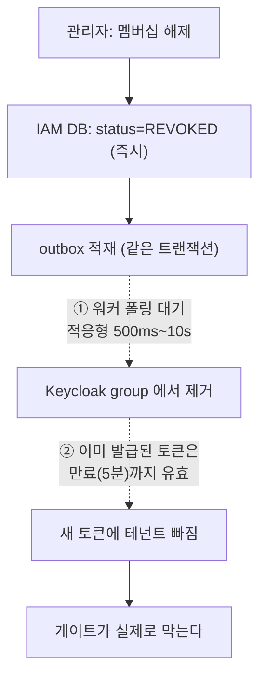

# 33. 권한을 회수해도 즉시 막히지 않는다 — claim 기반 인가의 반영 지연

> 멤버십을 해제한 순간과 그 사용자가 실제로 막히는 순간 사이에 **두 겹의 지연**이 있다.
> 버그가 아니라 구조의 대가다. 문제는 그걸 모르고 "해제했으니 됐다"고 믿는 것이다.
> 관련: Phase 9e~9f · 코드 `iam/.../MembershipService.kt` · `gateway/.../TenantGateFilter.kt`
> 선행: [23](23-coarse-authz-tenant-gate.md) · [24](24-fail-closed-by-default-tenant-guard.md)

## 1. 왜 필요했나

`TenantGateFilter` 의 KDoc 에 이 경고를 적어 뒀다.

> 토큰의 테넌트 목록은 **발급 시점의 사실**이다. 멤버십이 해제돼도 이미 발급된 토큰은 만료
> (현재 5분) 전까지 옛 소속을 담고 있어 이 게이트를 통과한다.

`MembershipService.revoke()` 에도 같은 경고가 있다. 두 곳에 나눠 적혀 있다 보니
**전체 지연이 얼마인지**는 아무 데도 없었다. 관리자가 "이 사람 내보냈다"고 한 뒤
실제로 언제부터 막히는지 — 그 숫자를 아무도 말할 수 없는 상태였다.

인가 시스템에서 이건 그냥 넘길 수 없다. **"막았다"와 "막힌다"의 시차는 보안 속성**이다.

## 2. 익숙한 방식과의 대조

| | 세션/DB 조회 기반 인가 | claim 기반 인가 (여기) |
|---|---|---|
| 권한 판단 근거 | 매 요청 **현재 상태**를 조회 | 토큰에 **박제된 발급 시점 상태** |
| 회수 반영 | **즉시** | 토큰 만료까지 지연 |
| 요청당 비용 | DB/IdP 왕복 1회 이상 | **0** (로컬 서명검증만) |
| 장애 결합 | 인가 저장소가 죽으면 전체 마비 | IdP 가 죽어도 검증은 계속됨 |

이건 트레이드오프이지 실수가 아니다. 게이트웨이가 **모든 요청마다 IAM 에 멤버십을 묻는** 구조를
일부러 피했다 — 그러면 게이트웨이가 도메인을 아는 God-gateway 로 미끄러지고, IAM 이
모든 요청 경로의 단일 장애점이 된다(`IAM_PLATFORM_DECISION.md` §8).

**대가가 지연이다.** 공짜로 얻은 게 아니라 산 것이고, 값이 얼마인지는 알아야 한다.

## 3. 동작 원리

### 3.1 지연은 한 겹이 아니라 두 겹이다

이게 이 문서의 핵심이다. "토큰 5분"만 생각하면 절반만 센 것이다.



| 겹 | 무엇을 기다리나 | 크기 |
|---|---|---|
| ① | outbox 워커가 집어 Keycloak 에 반영 | 적응형 폴링 500ms~10s + 처리 시간 |
| ② | 이미 발급된 access token 이 만료 | 최대 5분 |

**두 겹은 더해진다.** ①이 끝나야 "다음에 발급되는 토큰"이 깨끗해지고,
②는 "이미 들고 있는 토큰"의 잔여 수명이다.

### 3.2 왜 ①이 비동기인가

`revoke()` 는 IAM DB 와 Keycloak 을 **함께** 바꿔야 한다. 두 시스템에 걸친 원자성은 불가능하므로
outbox 로 나눴다([18](18-outbox-worker-multi-instance.md)).

```kotlin
membership.revoke()
val saved = tenantRepository.updateMembership(membership)

// 초대만 취소한 경우에는 group 에 넣은 적이 없으므로 제거할 것도 없다.
if (wasActive) {
  enqueueGroupSync(OutboxEventType.REMOVE_GROUP_MEMBER, command.tenantId, command.userRef)
}
```

DB 변경과 outbox 적재가 **한 트랜잭션**이라 "DB 는 바뀌었는데 지시가 유실"되는 일은 없다.
대신 지시의 **실행**이 나중이다. 이게 ①이다.

### 3.3 그럼 IAM DB 는 왜 즉시 바뀌는가

혼동하기 쉬운 지점이다. **회수는 즉시 반영된다 — 다만 반영되는 곳이 IAM DB 다.**

| 경로 | 반영 시점 |
|---|---|
| IAM 관리 API(`/tenants/{id}/members`) | **즉시** — DB 를 직접 본다 |
| 게이트웨이 테넌트 게이트 | **지연** — 토큰 claim 을 본다 |
| 다운스트림 fine 인가 | **지연** — 같은 토큰을 본다 |

그래서 관리자 화면에서는 "해제됨"으로 보이는데 그 사용자는 아직 통과한다.
**보이는 것과 막히는 것이 다르다** — 이 불일치가 이 구조에서 가장 헷갈리는 부분이다.

## 4. 직접 확인한 것

### 4.1 두 겹의 크기를 설정에서 확인

**① outbox 폴링** — `iam/src/main/resources/application.yml`:

```yaml
outbox:
  polling:
    enabled: ${IAM_OUTBOX_POLLING_ENABLED:true}
    # 기동 직후는 커넥션 풀·Flyway 가 안정되기 전이라 조금 기다린다.
    # 이후 주기는 **적응형**이라 설정값이 아니다(500ms~10s, OutboxPollingScheduler 참조).
    initial-delay-ms: ${IAM_OUTBOX_POLLING_INITIAL_DELAY_MS:10000}
```

주기가 고정값이 아니라 **적응형(500ms~10s)** 이다. 일감이 있으면 빨라지고 없으면 느려진다.
회수 직후는 대개 유휴 상태라 **느린 쪽(10s 에 가까움)에서 시작**한다고 봐야 한다.

**② 토큰 수명** — `docs/KEYCLOAK_REALM_SETUP.md`:

```
| Tokens | Access Token Lifespan | `5m` (300s) | 짧게 유지하고 refresh로 갱신 |
```

```bash
grep -rn 'accessTokenLifespan\|Access Token Lifespan' docs/KEYCLOAK_REALM_SETUP.md
```

```
docs/KEYCLOAK_REALM_SETUP.md:94:| Tokens | Access Token Lifespan | `5m` (300s) | 짧게 유지하고 refresh로 갱신 |
```

**합계: 최악의 경우 약 5분 10초 + 워커 처리 시간.**

### 4.2 회수 코드가 지연을 알고 있다

```bash
sed -n '218,245p' iam/.../MembershipService.kt
```

```kotlin
/**
 * 멤버십을 해제한다(초대 취소 · 멤버 제거 양쪽).
 *
 * ⚠️ **권한 회수에는 지연이 있다.** group 제거가 outbox 를 거치고, 이미 발급된 토큰은 만료
 * (현재 5분) 전까지 유효하다. 즉 "지금 즉시 차단" 이 아니다. 즉시성이 필요하면 다운스트림
 * introspection 이나 back-channel logout 이 필요하며, 그건 별도 결정이다
 * (`IAM_PLATFORM_DECISION.md` §14).
 */
@Transactional
fun revoke(command: RevokeMembershipCommand): MembershipResult {
```

**코드가 이미 두 겹을 다 적고 있었다.** 이 문서가 한 일은 그걸 숫자로 바꾼 것뿐이다.

### 4.3 게이트는 "지연"과 "실패"를 구분한다

지연이 있다는 것과 게이트가 허술하다는 것은 다르다. 게이트 자체의 판정은 테스트가 지킨다.

```bash
./gradlew :gateway:test --tests '*TenantGate*'
```

```
suite: me.ramos.unigate.adapter.gatewayIn.TenantGateFilterTest tests: 8 failures: 0 time: 0.05
 - Then: 헤더가 **제거된 채** 통과한다
 - Then: 위조 값이 아니라 **검증된 값**이 주입된다
 - Then: 그 테넌트가 주입돼 통과한다
 - Then: 403 으로 거부된다 — 다운스트림에 닿지 않는다
 - Then: 거부된다 — 판단할 수 없으면 열어주지 않는다(fail-closed)
 - Then: 500 이 아니라 **인증 예외**가 된다 — 재로그인이 해법이기 때문
 - Then: 서버 오류로 새어나가지 않는다
 - Then: 소속을 알 수 없으므로 거부한다(fail-closed)
```

5·8번이 fail-closed 다 — **판단할 수 없으면 거부한다.**
하지만 이 목록 어디에도 "회수된 멤버십을 막는다"는 없다.
막을 수 없기 때문이다. 토큰이 유효하고 claim 에 테넌트가 있으면 **게이트 입장에서는 정당한 요청**이다.

**게이트의 fail-closed 는 "모를 때 닫는다"이지 "옛 정보를 알아챈다"가 아니다.**

### 4.4 §14 가 대안을 이미 적어 뒀다

```bash
sed -n '525,535p' docs/IAM_PLATFORM_DECISION.md
```

```
- **로그아웃 토큰 폐기 일관성(한계)**: access token 은 stateless JWT 라 로그아웃해도 만료(현재 5분) 전까지
  다운스트림에서 유효하다. 즉시성이 필요하면 (a) 수명 추가 단축, (b) Back-Channel Logout, (c) 다운스트림
  introspection — 셋 다 트레이드오프. 현재 Access(5m)<Session(30m) 구성이 완충.
```

로그아웃 맥락으로 적혀 있지만 **같은 문제**다. 원인이 하나이기 때문이다 —
stateless JWT 는 발급 후 취소할 방법이 없다.

### 4.5 반대 방향도 같다 — **부여**도 재로그인 전까지 반영되지 않는다 (alpha 실측)

여기까지는 전부 **회수**(revoke) 이야기였다. 그런데 원인이 "토큰에 박제된 발급 시점 상태" 라면
방향은 상관없어야 한다. alpha 에서 **부여**(grant) 쪽을 실측했다.

`nativeadmin` 에게 `demo` 테넌트를 만들어 주고(① 테넌트 생성 → ② 멤버 추가 → ③ 초대 수락),
outbox 가 Keycloak group 까지 반영한 상태에서 시작한다. Admin API 로 실물을 먼저 확인했다:

```
=== realm group 최상위 ===
  /tenants  (subGroupCount=1)
  /unigate-users  (subGroupCount=0)

=== /tenants 하위 ===
  /tenants/demo
    멤버 1명
      - nati***  sub=fa17b8aa-…   (username·sub 은 실제 계정이라 마스킹했다)
```

**여기까지 해도 접근은 열리지 않는다.** 2026-07-29 기록(같은 계정·같은 게이트웨이, 재로그인 전):

```
GET /api/orders                               -> 403
GET /api/orders + X-Requested-Tenant: acme    -> 403
GET /iam/memberships                          -> 200  []
```

사용자가 **재로그인한 뒤**, 브라우저 세션에서 같은 요청을 다시 보냈다
(FE 콘솔 페이지에서 `fetch(..., {credentials:'include'})`):

| 요청 | 재로그인 후 |
|---|---|
| `GET /iam/profile` | 200 · `userRef=fa17b8aa-…` (위 group 멤버의 sub 와 일치) |
| `GET /iam/memberships` | 200 · `[{tenantId:"demo", role:"tenant-admin", status:"ACTIVE"}]` |
| `GET /api/orders` (헤더 없이) | **403** — 그대로다 |
| `GET /api/orders` + `X-Requested-Tenant: demo` | **200 `[]`** ← 열렸다 |
| `GET /api/orders` + `X-Requested-Tenant: acme` | **403** `요청한 테넌트에 소속되어 있지 않습니다` |
| `GET /api/echo` + `X-Requested-Tenant: demo` | 200 · 다운스트림이 받은 헤더에 `x-tenant-id: demo` |

**바뀐 것은 토큰뿐이다.** DB 도 Keycloak group 도 재로그인 전후로 동일했다. `/iam/memberships`
가 재로그인 **전에 이미** `demo` 를 보여줬다는 점이 이 지연의 성격을 그대로 드러낸다 —
IAM 은 DB 를 읽으니 즉시 알고, 게이트는 claim 만 보니 모른다. §3 에서 말한
**"화면과 차단이 어긋나는 구간"** 이 실제로 이렇게 생긴다.

두 개의 403 을 나란히 둔 것이 이 실측의 핵심이다:

| 403 | 거부 주체 | 의미 |
|---|---|---|
| 헤더 없이 | **다운스트림** | 테넌트 범위 자원인데 범위가 없다. 소속이 하나뿐이어도 추측해 채우지 않는다 |
| `acme` 주장 | **게이트웨이** `TenantGateFilter` | claim 에 없다. 다운스트림에 닿기도 전에 끊긴다 |

`acme` 의 403 이 없으면 `demo` 의 200 은 "게이트가 그냥 다 열렸다" 와 구분되지 않는다.
**통과 사례만으로는 인가가 동작한다는 증거가 못 된다** — 거절 사례가 같이 있어야 한다.

### 4.6 **재로그인은 필요 없었다** — refresh 만으로 열린다 (초 단위 실측)

§4.5 는 재로그인 뒤에 열린 것을 보여줬다. 그런데 그건 **하루가 지나 세션(30분)이 이미
죽어 있었기 때문**이지, 재로그인이라야 풀리는 문제였는지는 확인하지 못했다. 이번에는
**세션이 살아 있는 채로** 멤버십을 부여하고 10초 간격으로 관측했다.

관측 조건을 먼저 좁혔다 — 지연의 **첫 번째 겹(outbox)은 이미 끝난 상태**였다:

```
수락 시각            09:23:42   (joinedAt)
DB 멤버십            ACTIVE     — /iam/memberships 가 즉시 보여준다
Keycloak group       반영됨     — /tenants/demo 에 sub 가 이미 들어가 있다 (75초 시점 확인)
그런데 접근은         403
```

**남은 변수가 토큰 하나뿐인 상태**에서 `/api/orders` 를 10초마다 찔렀다:

```
 75s → 403      165s → 403      (사람 손 없음 — fetch 만 반복)
 85s → 403      175s → 403
 95s → 403      185s → 403
105s → 403      195s → 403
115s → 403      205s → 403
125s → 403      215s → 403
135s → 403      225s → 403   ← 마지막 403
145s → 403      235s → 200   ← 최초 200
155s → 403      264s → 200
```

**수락 후 약 3분 55초에 열렸다. 로그아웃도 로그인도 하지 않았다.**

### 그래서 "재로그인 강제 수단" 은 처음부터 필요 없는 항목이었다

게이트웨이는 BFF 라 refresh token 을 세션에 갖고 있고, `TokenRelayConfig` 가 provider 에
**`refreshToken()` 을 넣어 뒀다.** `TenantGateFilter` 도 토큰을 repository 가 아니라
`authorizedClientManager.authorize()` 로 읽는다(§4.3 의 그 이유) — **만료를 감지하면 자동으로
갱신하고 세션에 다시 저장하는 경로**다. Keycloak 은 토큰을 발급할 때마다 protocol mapper 를
다시 실행하므로 새 access token 에는 **갱신된 `groups` claim** 이 실린다.

관측된 225~235초는 access token 수명 5분과 정합한다. 토큰은 수락보다 **앞서** 발급됐으므로
잔여 수명이 5분보다 짧은 것이 당연하다.

| | 처음 생각 | 실제 |
|---|---|---|
| 반영에 필요한 것 | 사람이 재로그인 | **아무것도 안 해도 된다** |
| 상한 | 재로그인할 때까지 (무한) | **outbox(≤10s) + access token 잔여수명(≤5m)** |
| 대책 | back-channel logout 같은 강제 수단 | 필요 없음. 화면이 "최대 N분" 을 알리면 충분 |

> ⚠️ **그래도 지연은 지연이다.** 자동으로 풀린다는 것과 즉시 반영된다는 것은 다르다.
> 회수(revoke) 방향에서는 이 성질이 **위험**으로 뒤집힌다 — 해제해도 최대 5분간 통과한다.
> 자동 복구가 보안 속성을 없애주지는 않는다.

### 4.7 "목록엔 있는데 403" 은 **두 가지**다 — 기다려서 될 것과 안 될 것

§4.6 을 관측하고 나서 같은 증상의 다른 원인을 만났다. 초대만 받고 **수락하지 않은** 계정
(`scenario-invitee`)으로 접근하면 이렇다:

```
GET /iam/memberships                       → 200  [{tenantId:"demo", status:"INVITED", joinedAt:null}]
GET /api/orders  X-Requested-Tenant: demo  → 403
GET /api/orders  X-Requested-Tenant: demo2 → 403   ← demo2 는 초대조차 없다. 응답이 같다.
Keycloak /tenants/demo group               → 없다
```

**초대받은 테넌트와 초대조차 없는 테넌트가 게이트에는 구별되지 않는다.** 둘 다 "claim 에
없다" 는 하나의 사실이기 때문이다 — `MembershipService` 가 **INVITED 를 투영하지 않는다**
("아직 멤버가 아니다. claim 에 실리면 안 된다"). 초대는 게이트에 아무 흔적도 남기지 않는다.

| | 수락 전 (INVITED) | 수락 후 (ACTIVE) |
|---|---|---|
| `/iam/memberships` | 보인다 | 보인다 |
| 접근 | 403 | 403 |
| **기다리면** | **영원히 안 열린다** | **약 4분 뒤 열린다**(§4.6) |

증상이 "목록엔 있는데 접근은 403" 으로 **완전히 같아서**, `status` 필드를 보지 않으면
"조금 더 기다려 보자" 와 "수락을 안 했다" 를 구분할 수 없다. §3 이 말한 "화면과 차단이
어긋나는 구간" 은 실은 **두 종류**였다.

### 4.8 회수 방향 실측 — **두 저장소가 다 정리된 뒤에도 통과한다**

이 문서가 처음부터 경고하던 그것을 마침내 초 단위로 봤다. 세션 두 개를 띄우고
(일반 창 = `scenario-user`, 시크릿 창 = 관리자) 관리자가 멤버십을 **해제**했다.

```
09:43:51  멤버십=ACTIVE   접근=200      ← 정상
09:44:01  멤버십=(없음)   접근=200      ← 해제 반영. 위험 구간 시작
09:44:37  Keycloak group /tenants/demo 에서도 제거 확인 (관리자 조회)
09:45:07  멤버십=(없음)   접근=200      ← 마지막 200
09:45:11  멤버십=(없음)   접근=403      ← 차단
```

**위험 구간 ≈ 70초.** 그 사이 `/iam/memberships` 는 이미 비어 있었고 Keycloak group 에서도
빠져 있었다. **DB 도 IdP 도 "이 사람은 멤버가 아니다" 라고 말하는데 요청은 통과했다.**

지연의 첫 번째 겹(outbox)은 36초 안에 끝났다. **남은 70초는 전부 토큰 때문**이다.

#### 70초라는 숫자를 믿으면 안 된다

이 값은 **해제 시점에 토큰이 얼마나 남아 있었는가**에 달렸다. 같은 조작을 다시 하면 다른 값이
나온다 — 이론상 **0초에서 5분 사이 아무 값**이다. §4.6 의 부여 방향에서는 235초였다.

**짧게 나온 것은 안전해서가 아니라 운이 좋아서다.** "실측했더니 70초더라" 를 근거로 삼으면
안 되고, 설계상 상한인 **5분**으로 이야기해야 한다.

#### 부여와 회수는 같은 메커니즘, 정반대 의미

| | 부여 (§4.6) | 회수 (여기) |
|---|---|---|
| 관측 | 약 4분 뒤 열렸다 | 약 70초 뒤 닫혔다 |
| 기다리는 동안 | 못 쓴다 | **쓸 수 있다** |
| 성격 | 불편 | **보안 노출** |
| 사용자 체감 | "왜 아직 안 되지" | **아무 일도 없다** |

**같은 자동 갱신이 한쪽에서는 편의고 한쪽에서는 위험이다.** §4.6 을 읽고 "알아서 되니 신경 쓸
것 없다" 로 정리하면 이 방향을 놓친다. 그래서 §4.6 끝에 경고를 붙여 뒀다.

> 회수 즉시성이 필요하면 `IAM_PLATFORM_DECISION.md` §14 의 선택지로 돌아가야 한다 —
> (a) 토큰 수명 단축 (b) Back-Channel Logout (c) 다운스트림 introspection. 셋 다 대가가 있고,
> **현재 unigate 는 5분을 받아들이는 쪽을 택했다.** 그 선택을 몰라서가 아니라 알고 하도록
> 이 문서가 있다.

## 5. 함정 / 실패 모드

### 5.1 "해제했는데 아직 접근된다"를 버그로 신고하게 된다

가장 흔할 실패다. 관리자 화면에서 REVOKED 로 보이는데 그 사용자는 여전히 데이터를 본다.

**증상만 보면 회수가 안 먹은 것처럼 보인다.** 실제로는 세 상태 중 하나다:

| 상태 | 확인 방법 |
|---|---|
| outbox 가 아직 처리 안 됨 (①) | outbox 레코드 status 조회 |
| Keycloak 은 반영됐는데 옛 토큰 사용 중 (②) | 토큰의 `iat`/`exp` |
| 진짜 실패 (outbox DEAD) | outbox status = DEAD, DLQ |

세 번째만 버그다. 앞의 둘은 정상 동작인데 **겉으로는 구분되지 않는다.**
그래서 회수 API 응답이나 관리 화면에 "반영까지 최대 N분" 같은 안내가 필요한데, 지금은 없다.

### 5.2 토큰 수명을 줄이는 것은 공짜가 아니다

"5분이 길면 1분으로 줄이면 되지 않나"가 자연스러운 반응이다. 대가가 있다.

| 줄이면 | 결과 |
|---|---|
| 회수 반영 | 빨라진다 ✅ |
| refresh 호출 빈도 | **늘어난다** — Keycloak 부하 |
| 갱신 실패 지점 | **늘어난다** — [30](30-session-token-refresh-recurrence.md) 의 함정 노출 빈도 증가 |

특히 세 번째가 중요하다. 30번 문서의 실패는 **만료 구간에서만** 드러난다.
수명을 줄이면 그 구간을 자주 만나게 되므로, **갱신 경로가 견고하지 않으면 수명 단축이
장애를 앞당긴다.** 순서가 있다 — 갱신을 믿을 수 있게 만든 다음에 수명을 줄인다.

### 5.3 지연을 0으로 만들려면 구조가 바뀐다

§14 의 세 대안은 전부 **claim 기반이라는 전제를 부분적으로 포기**한다.

| 대안 | 포기하는 것 |
|---|---|
| (a) 수명 단축 | 아무것도 — 다만 지연이 0 이 되지는 않는다 |
| (b) Back-Channel Logout | IdP→앱 방향 연결이 필요. 세션 저장소가 상태를 더 가진다 |
| (c) 다운스트림 introspection | **요청당 IdP 왕복** — §2 표의 이점이 사라진다 |

(c) 는 사실상 "claim 기반을 그만둔다"에 가깝다. 그래서 §14 가 "셋 다 트레이드오프"라고만
적고 결정을 미뤄 둔 것이다.

**판단 기준**: 즉시성이 정말 필요한 자원과 그렇지 않은 자원을 나누는 게 먼저다.
전체를 introspection 으로 바꾸는 것보다, **민감한 소수 경로만** 현재 상태를 확인하는 쪽이
비용 대비 효과가 크다. 다만 이건 아직 결정된 바 없다(§6).

### 5.4 fine 인가는 지연을 물려받는다

게이트만의 문제가 아니다. 다운스트림도 **같은 토큰**을 본다.
게이트가 통과시킨 요청은 다운스트림에 도달하고, 다운스트림이 자원 소유권을 확인할 때
쓰는 `sub`·테넌트도 같은 발급 시점 정보다.

즉 **지연은 게이트에서 흡수되지 않고 뒤로 전파된다.**
다운스트림이 자체 DB 로 소유권을 확인한다면 그 부분은 즉시성이 있지만,
"이 테넌트 소속인가"는 여전히 토큰을 믿는다.

## 6. 남은 의문

- **실제 지연을 측정하지 않았다.** 이 문서의 숫자는 설정값에서 계산한 **이론값**이다.
  "해제 → 실제 403" 까지 걸린 시간을 재려면 회수 직후부터 폴링하며 상태 전이를 기록해야 한다.
  outbox 워커의 적응형 주기가 유휴 상태에서 실제로 얼마인지도 실측한 적 없다.

- **refresh 가 회수를 반영하는지 확인 안 했다.** ②는 "토큰 만료까지"라고 적었지만,
  만료 전에 refresh 가 일어나면 그때 새 토큰이 발급된다. 그 새 토큰에 회수가 반영되는지
  (= Keycloak 이 refresh 시 group claim 을 다시 계산하는지) 확인하지 않았다.
  **반영된다면 실질 지연이 ②보다 짧아진다.** 이건 꽤 중요한데 아직 모른다.

- **REVOKED 사용자의 세션은 어떻게 되나.** 게이트웨이 세션(30분)은 멤버십과 무관하게 살아 있다.
  모든 테넌트에서 해제된 사용자가 로그인 상태로 남는 게 맞는지 — 테넌트 무관 API 는
  계속 써야 하니 맞는 것 같기도 한데, 정한 적은 없다.

- **회수 지연을 사용자/관리자에게 어떻게 알릴지** 정하지 않았다(§5.1).
  API 응답에 예상 반영 시각을 넣는 방법이 있지만, 그러면 outbox 큐 길이에 따라 달라지는 값을
  약속하게 된다. 안내 문구로만 두는 게 나을 수도 있다.

- **§5.3 의 "민감 경로만 introspection"** 을 실제로 어떻게 표시할지 모르겠다.
  라우트 설정에 플래그를 두는 방식이 떠오르는데, 그러면 게이트웨이가 "무엇이 민감한지"를
  알게 돼 도메인 지식이 새어 들어온다. `IAM_PLATFORM_DECISION.md` §8 이 막으려던 방향이다.
