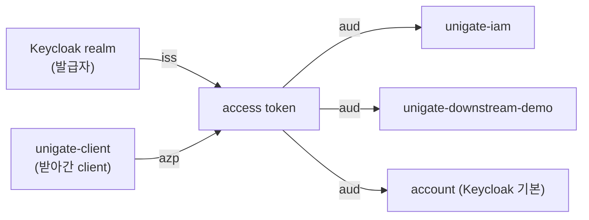

# 34. `iss` · `aud` · `azp` — 각각 무엇을 보장하는가

> 셋 다 "이 토큰이 누구와 관계있는가"를 말하는데 보장하는 것이 전혀 다르다.
> 특히 **`aud` 는 Spring 기본 검증에 들어 있지 않다.** 직접 넣지 않으면 검사되지 않는다.
> 관련: Phase 2 · Phase 8f · 코드 `gateway/.../JwtClaimValidators.kt` · `samples/downstream-demo/.../ResourceServerConfig.kt`
> 선행: [07](07-downstream-resource-server-audience.md) · [10](10-jwks-local-verification.md)

## 1. 왜 필요했나

이 저장소에는 JWT 를 검증하는 곳이 **세 군데**다.

| 검증 주체 | 무엇을 위해 |
|---|---|
| `gateway` (`TenantGateFilter`) | 세션의 토큰에서 테넌트 claim 을 읽으려고 |
| `iam` (Resource Server) | relay 된 Bearer 를 받으려고 |
| `samples/downstream-demo` | 같음 |

세 곳이 **서로 다른 코드**로 검증한다. 어느 곳이 무엇을 보고 있는지 정리한 적이 없었고,
특히 "Spring 이 알아서 해주는 것"과 "직접 넣어야 하는 것"의 경계가 불분명했다.
그 경계를 잘못 알면 **검증하고 있다고 믿으면서 안 하고 있는** 상태가 된다.

## 2. 익숙한 방식과의 대조

세션 인증이라면 "이 세션이 우리 것인가"만 확인하면 됐다. 세션은 우리가 만들었으니까.
JWT 는 **남이 만든 것**을 받는다. 그래서 확인할 것이 층으로 나뉜다.

| 질문 | claim | 없으면 |
|---|---|---|
| 위조가 아닌가 | (서명) | 아무나 토큰을 만든다 |
| **누가 발급했나** | `iss` | 다른 realm/IdP 의 토큰이 통과한다 |
| **나를 향한 것인가** | `aud` | 남에게 준 토큰을 가져와 쓸 수 있다 |
| 아직 유효한가 | `exp`/`nbf` | 만료 토큰이 영원히 통한다 |
| 누가 받아갔나 | `azp` | (인가 근거는 아님 — §3.3) |

**서명만 검증하는 것으로는 부족하다**는 게 핵심이다. 서명은 "이 realm 이 만든 진짜 토큰"까지만
말해주고, **그 토큰이 나를 위한 것인지는 말해주지 않는다.**

## 3. 동작 원리

### 3.1 세 claim 의 역할



| claim | 방향 | 의미 |
|---|---|---|
| `iss` | 발급자 → 토큰 | "이 realm 이 만들었다" |
| `azp` | 요청자 → 토큰 | "이 client 가 받아갔다" (authorized party) |
| `aud` | 토큰 → 수신자 | "이들에게 제시하라고 만들었다" |

`aud` 만 **배열**이다. 하나의 토큰이 여러 수신자를 향할 수 있기 때문이다.
게이트웨이가 받은 토큰 하나를 IAM 에도 다운스트림에도 relay 하므로, 이 구조가 필요하다.

### 3.2 `aud` 가 왜 특별히 위험한가

`iss` 와 `exp` 는 Spring 의 기본 검증(`JwtValidators.createDefaultWithIssuer`)에 들어 있다.
**`aud` 는 없다.** 그래서 직접 넣지 않으면 다음이 성립한다:

```
같은 realm 이 발급한 토큰이면 → 서명 OK, iss OK, exp OK → 통과
```

Keycloak 은 모든 토큰에 `account` audience 를 기본으로 넣는다.
즉 **그 realm 의 아무 토큰이나** 가져오면 통과한다는 뜻이다.
전혀 다른 client 를 위해 발급된 토큰이어도 서명·iss 만 맞으면 검증을 통과한다.

이걸 막는 것이 `aud` 검증이다. 각 수신자가 **자기 이름이 `aud` 에 있는지** 확인한다.

### 3.3 `azp` 는 인가 근거가 아니다

`azp` 는 "누가 이 토큰을 받아갔나"다. 진단에는 유용하지만 **인가 판단에 쓰면 안 된다.**

이유: `azp` 는 **토큰을 요청한 쪽**을 가리키므로, 그 값이 맞다고 해서 **지금 이 요청을 보낸 쪽**이
그 client 라는 보장이 없다. 토큰이 유출돼 다른 경로로 제시되어도 `azp` 값은 그대로다.

**용도는 관측이다.** IAM 의 진단 엔드포인트가 정확히 그렇게 쓴다:

```kotlin
// `azp` = 이 토큰을 받아간 client. BFF 이므로 게이트웨이 로그인 client 여야 한다.
// 여기에 다른 값이 찍히면 예상 밖의 경로로 토큰이 흘러들어온 것이다.
"authorizedParty" to jwt.getClaimAsString("azp"),
```

"예상 밖의 경로를 발견하는 단서"이지 "차단 조건"이 아니다.

## 4. 직접 확인한 것

### 4.1 실제 토큰에 무엇이 담기는가

`docs/KEYCLOAK_REALM_SETUP.md` 에 audience mapper 적용 전후의 payload 가 기록돼 있다.

다운스트림 audience 추가 후:

```json
{
  "iss": "https://<keycloak-host>/realms/test",
  "aud": ["unigate-downstream-demo", "account"],
  "azp": "unigate-client"
}
```

IAM audience 를 추가한 뒤 — **`aud` 배열의 항목이 늘어난다**:

```json
{
  "iss": "https://<keycloak-host>/realms/test",
  "aud": ["unigate-downstream-demo", "unigate-iam", "account"],
  "azp": "unigate-client"
}
```

관찰 두 가지:

1. **`account` 가 항상 있다.** Keycloak 이 기본으로 넣는다. §3.2 의 위험이 이론이 아니라
   기본값이라는 뜻이다 — `aud` 를 안 보면 `account` 만 가진 토큰도 통과한다.
2. `azp` 는 수신자가 몇이든 **`unigate-client` 하나**다. 토큰을 받아간 주체는 하나뿐이니까.

같은 문서에 왜 매퍼를 게이트웨이 client 에 붙이는지도 적혀 있다:

> Audience mapper는 *토큰을 발급받는* client의 dedicated scope에서 동작한다. 사용자 토큰을
> 발급받는 주체는 로그인 client인 `unigate-client` 하나뿐이므로, 수신자가 몇 개든 매퍼는 전부 그쪽에 붙는다.

### 4.2 Spring 기본 검증에 `aud` 가 없다 — 코드로 확인

샘플 다운스트림이 디코더를 직접 구성하는 이유가 주석에 있다.

```kotlin
/**
 * Spring Security 기본 검증(`createDefaultWithIssuer`)은 **서명·만료·iss** 만 본다.
 * **aud 는 보지 않는다.** 그래서 같은 realm 이 발급한 다른 대상(예: Keycloak `account`)용
 * 토큰도 서명·iss 만 맞으면 통과한다 — 우리를 향한 토큰이 아닌데도. 이건 인증 우회의 문이다.
 */
@Bean
fun jwtDecoder(): JwtDecoder {
    val decoder = JwtDecoders.fromIssuerLocation(issuerUri) as NimbusJwtDecoder
    decoder.setJwtValidator(
        DelegatingOAuth2TokenValidator(
            JwtValidators.createDefaultWithIssuer(issuerUri),   // 서명·exp·iss
            AudienceValidator(expectedAudience),                // ← 직접 더한다
        ),
    )
    return decoder
}
```

**`DelegatingOAuth2TokenValidator` 로 얹는 구조**가 핵심이다.
기본 검증을 대체하는 게 아니라 **더한다** — 대체하면 iss·exp 를 잃는다.

### 4.3 게이트웨이는 셋을 각각 다른 원인 코드로 검증한다

`gateway` 는 기본 검증기를 아예 쓰지 않고 셋을 직접 만들었다.

```kotlin
DelegatingOAuth2TokenValidator(
  JwtExpiryValidator(),
  JwtIssuerValidator(issuerUri),
  JwtAudienceValidator(expectedAudience),
)
```

이유가 주석에 있다:

> Spring 의 기본 검증기(`JwtValidators.createDefaultWithIssuer`)도 exp·iss 를 보지만, 실패 시
> `OAuth2Error.errorCode` 가 전부 `invalid_token` 이라 "무엇이 틀렸는지" 코드로 구분되지 않는다.

실제 구현을 보면 실패마다 다른 코드를 싣는다:

```kotlin
fail(TokenVerificationReason.TOKEN_EXPIRED, "토큰이 만료되었습니다 (exp=$expiresAt)")
fail(TokenVerificationReason.INVALID_ISSUER, "iss 불일치: ${token.issuer}")
fail(TokenVerificationReason.INVALID_AUDIENCE, "필수 audience '$expectedAudience' 가 aud 에 없습니다")
```

`aud` 검증은 `contains` 다 — 배열이므로 **포함 여부**를 본다:

```kotlin
if (token.audience.contains(expectedAudience)) { ... }
```

부수적으로 알게 된 것: 클럭 스큐 30초를 명시적으로 허용한다.

```kotlin
private const val CLOCK_SKEW_SECONDS = 30L
```

게이트웨이와 Keycloak 의 시계가 완벽히 같을 수 없으므로, 이게 없으면 경계에서
간헐적 실패가 난다. 기본 검증기도 스큐를 허용하지만 **직접 만들면 직접 넣어야 한다.**

### 4.4 IAM 의 경계 규칙은 테스트가 지킨다

```bash
./gradlew :iam:test --tests '*IamSecurityBoundary*'
```

```
suite: IamSecurityBoundaryTest tests: 13 failures: 0
 - 등록되지 않은 IAM 경로도 미인증이면 404 가 아니라 401 이다()
 - 초대 수락은 관리자가 아니어도 할 수 있다()
 - 관리 API 는 토큰이 아예 없으면 403 이 아니라 401 이다()
 - 가입은 CSRF 토큰 없이도 통과한다()
 - actuator health 는 probe 를 위해 열려 있다()
 - 인증 라우트는 토큰 없이 401 이다()
 - 가입은 인증 없이 열려 있다()
 - 초대 수락도 인증은 필요하다()
 - 관리 API 는 인증만으로는 통과하지 못한다()
 - 관리자 권한이 있으면 관리 API 를 통과한다()
 - 관리 경로는 접두사 전체가 막힌다 — 새 엔드포인트를 잊어도 안전하다()
 - 테넌트 생성도 관리자만 할 수 있다()
```

테스트가 만드는 토큰이 §4.1 의 구조를 그대로 흉내낸다:

```kotlin
builder
  .subject(CALLER_SUBJECT)
  .claim("preferred_username", "alice")
  .claim("azp", "unigate-client")
  .audience(listOf("unigate-iam"))
```

⚠️ 다만 이 13개 중 **`aud` 가 틀린 토큰을 거부하는지 확인하는 것은 없다.**
전부 "경로 규칙"(어디가 인증 필요한가, 어디가 관리자 전용인가)을 겨냥한다.
그 이유가 `IamSecurityConfig` 에 적혀 있는데, §5.5 에서 따로 다룬다 — 이 문서에서 가장 중요한 함정이다.

### 4.5 IAM 은 `JwtClaimValidator` 로 직접 검증한다

`iam` 은 Spring Boot 의 `spring.security.oauth2.resourceserver.jwt.audiences` 설정이 아니라
코드로 만든다.

```kotlin
internal fun audienceValidator(expectedAudience: String): OAuth2TokenValidator<Jwt> =
  JwtClaimValidator<List<String>?>(JwtClaimNames.AUD) { audience ->
    audience != null && expectedAudience in audience
  }
```

그리고 이 검증기만 겨냥한 테스트가 따로 있다.

```bash
./gradlew :iam:test --tests '*JwtAudienceValidation*'
```

```
suite: JwtAudienceValidationTest tests: 4 failures: 0
 - Then: 통과한다
 - Then: 통과한다 — aud 는 '유일한 수신자'가 아니라 '수신자 목록'이다
 - Then: 거부한다
 - Then: 거부한다 — 없는 것은 통과가 아니다
```

2번째가 §3.1 의 "배열" 성질을, 4번째가 "claim 자체가 없는 경우"를 겨냥한다.
`audience != null` 조건이 없으면 null 에서 `in` 이 어떻게 동작하는지에 결과가 좌우된다.

### 4.6 게이트웨이가 기대하는 audience 는 자기 이름이 아니다

```bash
grep -rn 'expected-audience' gateway/src/main/resources/application.yml
```

```yaml
# 이 게이트웨이가 검증 시 기대하는 audience. 소비자가 정해지는 시점(P8/9)에 확정한다.
expected-audience: ${TOKEN_VERIFIER_EXPECTED_AUDIENCE:unigate-downstream-demo}
```

기본값이 **`unigate-downstream-demo`** 다 — 게이트웨이 자신이 아니라 **다운스트림 이름**이다.

게이트웨이는 Resource Server 가 아니라 OAuth2 Client 이므로, "나에게 온 토큰인가"를 묻는
입장이 아니다. `TenantGateFilter` 가 토큰을 검증하는 목적은 **relay 할 토큰에서 claim 을 읽는 것**
이고, 그 토큰이 향하는 곳은 다운스트림이다. 그래서 기대값도 그쪽이 된다.

주석이 "소비자가 정해지는 시점에 확정한다"고 남아 있는데, IAM 라우트도 생긴 지금
이 값 하나로 두 대상(`unigate-iam`·`unigate-downstream-demo`)을 모두 커버하는지는 확인하지 않았다(§6).

## 5. 함정 / 실패 모드

### 5.1 "Spring 이 알아서 해주겠지"

이 주제 전체에서 가장 위험한 가정이다. 정리하면:

| claim | 기본 검증에 | 직접 넣어야 하나 |
|---|---|---|
| 서명 | ✅ 있음 | 아니오 |
| `exp`/`nbf` | ✅ 있음 | 아니오 |
| `iss` | ✅ 있음 (`createDefaultWithIssuer` 사용 시) | 아니오 |
| **`aud`** | ❌ **없음** | **예** |

`aud` 만 빠져 있고, 빠졌을 때 **아무 증상이 없다.** 정상 토큰은 그대로 통과하므로
개발 중에는 완벽히 동작하는 것처럼 보인다. 드러나는 것은 공격받을 때뿐이다.

### 5.2 기본 검증기를 "대체"하면 iss·exp 를 잃는다

```kotlin
// ❌ 위험 — 기본 검증을 날려버린다
decoder.setJwtValidator(AudienceValidator(expectedAudience))

// ✅ 더한다
decoder.setJwtValidator(
    DelegatingOAuth2TokenValidator(
        JwtValidators.createDefaultWithIssuer(issuerUri),
        AudienceValidator(expectedAudience),
    ),
)
```

`setJwtValidator` 라는 이름이 "추가"가 아니라 "설정"이라 덮어쓰기다.
`aud` 를 챙기려다 `exp` 를 잃으면 **더 나빠진다** — 만료 토큰이 영원히 통하게 된다.

### 5.3 `aud` 를 인가로 착각하기

`aud` 가 맞다는 것은 **"이 토큰을 나에게 제시해도 된다"**까지다.
"이 사용자가 이 작업을 해도 된다"는 전혀 다른 문제고, 역할·소속으로 판단한다.

| 확인 | claim | 판단 주체 |
|---|---|---|
| 나를 향한 토큰인가 | `aud` | 각 Resource Server |
| 이 테넌트 소속인가 | `groups` | 게이트웨이 coarse 게이트 |
| 이 자원을 다룰 수 있나 | (도메인) | 다운스트림 fine 인가 |

세 층이 다르다. `aud` 검증을 통과했다고 인가가 끝난 게 아니다.

### 5.4 audience mapper 를 엉뚱한 client 에 붙이기

`unigate-iam` 이 수신자니까 거기에 붙이고 싶어지는데 **아무 효과가 없다**(§4.1).
매퍼는 **토큰을 발급받는** client 에서 동작한다.

증상: 설정은 했는데 토큰 payload 의 `aud` 가 안 바뀐다. 그리고 다운스트림이 계속 401 을 낸다.
설정 화면에서는 완벽히 맞아 보이므로 원인 추적이 오래 걸린다.

### 5.5 인가 테스트는 audience 검증을 지켜주지 않는다

이 문서에서 가장 중요한 함정이다. `IamSecurityConfig` 의 주석이 정확히 짚는다:

> 이 검증기는 **가장 조용히 깨지는 보안 통제**다. 슬라이스 테스트가 쓰는 `jwt()` post-processor 는
> 디코더를 아예 호출하지 않아 여기를 지나가지 않는다 — 즉 **이 코드를 통째로 지워도 인가 경계
> 테스트는 전부 통과한다.**

§4.4 의 13개 테스트가 그 인가 경계 테스트다. 전부 통과하지만
`audienceValidator` 를 삭제해도 **여전히 전부 통과한다.**

이유는 테스트가 토큰을 만드는 방식에 있다:

```kotlin
SecurityMockMvcRequestPostProcessors.jwt().jwt { builder -> ... }
```

`jwt()` post-processor 는 **이미 검증된 `Jwt` 객체를 주입**한다. 실제 토큰 문자열을 디코딩하지
않으므로 `JwtDecoder` 도, 거기 붙은 validator 도 실행되지 않는다.
테스트에서 `.audience(listOf("unigate-iam"))` 을 넣은 것은 **검증받기 위해서가 아니라
그냥 그 값을 가진 principal 을 만들기 위해서**다.

**교훈**: 테스트가 통과하는 것과 그 코드가 실행되는 것은 다르다.
그래서 `audienceValidator` 를 `internal` 로 열어 **단위 테스트로 직접 겨냥**했다(§4.5).
`private` 로 두면 "테스트할 수 없는 보안 통제"가 된다.

같은 구조가 [28](28-k6-loadtest-silent-failures.md) §5.1 에도 있었다 —
**성공 조건만 검사하면 실패가 침묵한다.** 거기서는 부하테스트였고 여기서는 보안 통제다.

## 6. 남은 의문

- **게이트웨이의 `expected-audience` 하나로 두 대상을 커버하는지 모른다**(§4.6).
  기본값이 `unigate-downstream-demo` 인데 IAM 라우트도 생겼다. IAM 으로 가는 요청의 토큰을
  게이트가 검증할 때도 같은 값을 기대하는데, `aud` 배열에 둘 다 들어 있으니 지금은 통과한다.
  다만 이건 **두 audience 가 우연히 같은 토큰에 있어서** 성립하는 것이고,
  설계로 의도한 것인지 설정이 P8/9 를 거치며 정리되지 않은 것인지 구분이 안 된다.

- **클럭 스큐 30초가 적절한지 모른다.** 임의로 정한 값으로 보이는데, 실제 시계 오차가
  얼마인지 측정한 적 없다. NTP 가 도는 환경이면 과하고, 아니면 모자랄 수 있다.

- **`azp` 를 실제로 관측에 써 본 적이 없다.** §3.3 에서 "예상 밖의 경로를 발견하는 단서"라고
  적었지만, 그 값을 로그·메트릭으로 남기고 있지는 않다. 진단 엔드포인트를 사람이 눌러야만 보인다.
  이상 탐지로 쓰려면 감사 이벤트에 넣어야 할 것 같은데 정하지 않았다.
