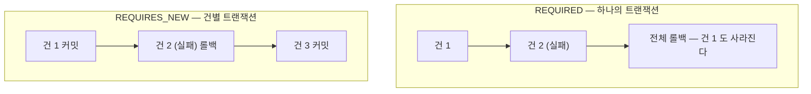

# 35. 트랜잭션 전파 — 경계를 어디에 두느냐가 곧 장애 대응 방식이다

> `REQUIRES_NEW` 를 고르는 것은 스타일이 아니라 **"워커가 죽었을 때 무슨 일이 일어나는가"** 를
> 고르는 것이다. outbox 워커에서 이 선택이 왜 그렇게 됐는지 되짚는다.
> 관련: Phase 8d · 9b · 코드 `iam/.../OutboxProcessor.kt` · `iam/.../JpaOutboxAdapter.kt`
> 선행: [18](18-outbox-worker-multi-instance.md) · [22](22-outbox-dlq-and-circuit-breaker.md)

## 1. 왜 필요했나

`iam` 에는 `@Transactional` 이 21곳 있는데, 전파 옵션을 **명시한 곳은 딱 하나**다.

```kotlin
@Transactional(propagation = Propagation.REQUIRES_NEW)
fun processOne(): Boolean
```

나머지 20곳은 기본값(`REQUIRED`)을 쓴다. 그리고 어댑터에는 **일부러 `@Transactional` 을 안 붙였다.**

세 가지 선택(기본값 / `REQUIRES_NEW` / 없음)이 한 코드베이스에 공존하는데,
각각 왜 그런지는 KDoc 에 흩어져 있었다. 전파 옵션 전체를 놓고 정리한 적이 없어서 묶었다.

## 2. 익숙한 방식과의 대조

전파는 **"이미 트랜잭션이 있을 때 어떻게 할 것인가"** 를 정하는 값이다.
트랜잭션이 없는 상태에서 호출하면 대부분의 옵션이 같은 동작(새로 시작)을 하므로 차이가 안 보인다.

| 전파 | 기존 트랜잭션이 있으면 | 없으면 |
|---|---|---|
| `REQUIRED` (기본) | **참여** | 새로 시작 |
| `REQUIRES_NEW` | **중단(suspend)하고 새로 시작** | 새로 시작 |
| `SUPPORTS` | 참여 | 트랜잭션 없이 실행 |
| `MANDATORY` | 참여 | **예외** |
| `NEVER` | **예외** | 트랜잭션 없이 실행 |
| `NOT_SUPPORTED` | 중단하고 트랜잭션 없이 | 트랜잭션 없이 |
| `NESTED` | 세이브포인트 | 새로 시작 |

실무에서 고민하게 되는 것은 사실상 위의 둘이다. 나머지는 "이 메서드는 반드시 트랜잭션 안/밖에서
불려야 한다"를 **강제하고 싶을 때**(`MANDATORY`/`NEVER`) 쓰는 계약 표현에 가깝다.

## 3. 동작 원리

### 3.1 `REQUIRED` vs `REQUIRES_NEW` — 실패가 번지는 범위가 다르다



핵심은 **실패의 격리**다. 여러 건을 순회하며 처리할 때 `REQUIRED` 로 두면
한 건의 실패가 앞서 성공한 건까지 되돌린다.

`OutboxProcessor` 의 KDoc 이 그 이유를 적고 있다:

> 여러 건을 한 트랜잭션에 묶으면 (1) 한 건의 실패가 나머지를 롤백시키고 (2) 락 유지 시간이
> 길어져 다른 인스턴스가 집을 수 있는 일감이 줄어든다. 건별로 끊으면 실패가 격리되고 락도 짧다.

(2)가 특히 이 프로젝트다운 이유다. 다중 인스턴스 전제([memory: 다중 인스턴스 배포])에서
**락 유지 시간은 다른 워커의 처리량**이다.

### 3.2 트랜잭션 경계 = 장애 복구 전략

`OutboxProcessor` 는 외부 호출(Keycloak)까지 트랜잭션 **안에** 넣는다.
DB 커넥션을 점유하는 대가를 치르는데, KDoc 에 그 교환이 표로 적혀 있다:

| | 여기서 택한 방식 (트랜잭션 내 처리) | 대안 (claim → 처리 → 반영) |
|---|---|---|
| 워커가 죽으면 | 롤백 → **락 해제 → 다른 인스턴스가 즉시 이어받음** | `IN_PROGRESS` 로 멈춤 |
| stale lock 회수 | 불필요 | 타임아웃 로직 필요 (그 자체가 버그 원천) |
| 커넥션 | 외부 호출 동안 점유 | 빨리 반납 |

> 다중 인스턴스에서는 "인스턴스가 죽는 것" 이 예외가 아니라 **일상**(롤링 배포, 오토스케일, OOM)이다.
> 그때 자동으로 다른 인스턴스가 이어받는 성질이 커넥션 점유보다 값지다.

**전파 옵션을 고르는 것은 성능 튜닝이 아니라 장애 시나리오를 고르는 것**이라는 게 여기서 드러난다.

### 3.3 어댑터에 `@Transactional` 을 안 붙이는 이유

반대 방향의 결정이다. `JpaOutboxAdapter` 에는 어노테이션이 **없다**.

```kotlin
/**
 * ## 트랜잭션을 여기서 열지 않는다
 * `@Transactional` 이 없는 것은 의도적이다. [enqueue] 는 **호출자(UseCase)의 트랜잭션에 참여**해야
 * 도메인 저장과 같은 커밋에 묶인다. 여기서 새 트랜잭션을 열면 프로필만 저장되고 outbox 지시는
 * 유실되는(또는 그 반대) 경우가 생겨 outbox 패턴 자체가 무의미해진다.
 *
 * [claimNext] 도 마찬가지다 — 행 잠금이 워커의 트랜잭션 동안 유지되어야 한다.
 */
```

**outbox 패턴의 전제가 "도메인 변경과 지시 적재가 같은 커밋"** 이다.
어댑터가 `REQUIRES_NEW` 를 쓰면 그 전제가 깨진다 — 두 개의 커밋이 되고, 사이에서 죽으면 갈라진다.

`claimNext` 는 더 직접적이다. `FOR UPDATE SKIP LOCKED` 의 잠금은 **트랜잭션이 끝나면 풀린다.**
어댑터가 자기 트랜잭션을 열고 닫으면 락이 즉시 풀려 다른 워커가 같은 행을 집는다.

### 3.4 프록시를 통과해야 적용된다

`REQUIRES_NEW` 가 실제로 동작하려면 **다른 빈에서 호출**되어야 한다.
Spring 의 `@Transactional` 은 프록시 기반이라 자기 호출(self-invocation)은 어노테이션이 무시된다.

이 코드는 그 조건을 만족한다 — 스케줄러(`schedulerIn`)가 프로세서(`application`)를 호출한다:

```kotlin
while (processed < MAX_BATCH && outboxProcessor.processOne()) {
  processed++
}
```

만약 `OutboxProcessor` 안에 `poll()` 을 두고 거기서 `processOne()` 을 불렀다면
**어노테이션이 조용히 무시되어 전부 한 트랜잭션이 됐을 것이다.**
지금 구조가 우연히 안전한 게 아니라, 어댑터/애플리케이션 분리가 이 함정을 구조적으로 피하게 했다.

## 4. 직접 확인한 것

### 4.1 21곳의 분포

```bash
grep -rn '^\s*@Transactional' iam/src/main --include='*.kt'
```

```
application/outbox/service/OutboxRetentionService.kt:43:  @Transactional
application/outbox/service/OutboxAdminService.kt:45:  @Transactional(readOnly = true)
application/outbox/service/OutboxAdminService.kt:58:  @Transactional
application/outbox/service/OutboxProcessor.kt:75:  @Transactional(propagation = Propagation.REQUIRES_NEW)
application/tenant/service/MembershipService.kt:72:  @Transactional(readOnly = true)
application/tenant/service/MembershipService.kt:98:  @Transactional
application/tenant/service/MembershipService.kt:148:  @Transactional
application/tenant/service/MembershipService.kt:190:  @Transactional
application/tenant/service/MembershipService.kt:226:  @Transactional
application/tenant/service/MembershipService.kt:257:  @Transactional(readOnly = true)
application/tenant/service/CreateTenantService.kt:67:  @Transactional
application/user/service/RegisterUserService.kt:53:  @Transactional
application/user/service/UpdateMyProfileService.kt:35:  @Transactional
application/user/service/GetMyProfileService.kt:34:  @Transactional(readOnly = true)
application/user/service/AcceptConsentService.kt:41:  @Transactional
application/user/service/ChangeMyEmailService.kt:50:  @Transactional
```

| 형태 | 개수 | 위치 |
|---|---|---|
| `@Transactional` (기본 `REQUIRED`) | 11 | UseCase 전반 |
| `@Transactional(readOnly = true)` | 4 | 조회 전용 |
| `@Transactional(propagation = REQUIRES_NEW)` | **1** | `OutboxProcessor.processOne` |

**전부 `application` 계층에만 있다.** `adapter` 에도 `domain` 에도 없다.
전역 지침 §3.3("트랜잭션은 Service 에서 관리")이 실제로 지켜진 상태다.

### 4.2 실제 PostgreSQL 에서 동시성 검증

전파와 락이 함께 동작하는지는 mock 으로 증명할 수 없다.
`SKIP LOCKED` 는 **DB 가 제공하는 것**이기 때문이다. 전용 태스크로 돌렸다.

```bash
docker compose up -d
./gradlew :iam:integrationTest --tests '*OutboxConcurrency*'
```

```
suite: OutboxConcurrencyIntegrationTest tests: 12 failures: 0 time: 0.634
 - 백오프로 미뤄진 레코드는 시간이 되기 전까지 집히지 않는다() (0.367s)
 - 여러 워커가 동시에 집어도 같은 레코드를 두 번 집지 않는다() (0.083s)
 - DEAD 가 되면 죽은 시각과 예외 클래스가 DB 에 남는다() (0.019s)
 - 게이지가 registry 에 실제로 등록되고 DB 값을 읽는다() (0.029s)
 - DEAD 는 아무리 오래돼도 정리되지 않는다() (0.019s)
 - 죽은 지시를 재처리하면 워커가 다시 집어간다() (0.022s)
 - 상태별 건수를 세어 메트릭에 낼 수 있다() (0.014s)
 - 이미 잠긴 행은 건너뛰고 다음 행을 집는다() (0.027s)
 - 보존 기간이 지난 COMPLETED 는 정리된다() (0.016s)
 - 죽지 않은 지시는 재처리할 수 없다() (0.011s)
 - 재처리는 감사에 남고 행위자가 대상과 다르다() (0.017s)
 - 없는 지시를 재처리하면 찾을 수 없다고 알린다() (0.007s)
```

```
BUILD SUCCESSFUL in 6s
```

2번째와 8번째가 §3.3 의 "락이 워커 트랜잭션 동안 유지된다"를 직접 겨냥한다.
어댑터가 자기 트랜잭션을 열었다면 이 둘이 깨진다.

### 4.3 이 테스트는 기본 `test` 태스크에서 제외돼 있다

처음에 `:iam:test` 로 돌렸더니 이렇게 나왔다:

```
> No tests found for given includes: [*OutboxConcurrency*](--tests filter)
```

찾아보니 태그로 갈라 둔 구조였다.

```kotlin
// common.gradle.kts
excludeTags("testcontainers")     // test 태스크
includeTags("testcontainers")     // integrationTest 태스크
```

```kotlin
@Tag("testcontainers")
class OutboxConcurrencyIntegrationTest
```

의도는 KDoc 에 있다 — `./gradlew build` 가 Docker 없이 통과해야 CI 가 단순해진다.
**대가는 "돌린 줄 알았는데 안 돌아간" 상태가 가능하다는 것**이다.
실제로 이번에 그걸 겪었고, `No tests found` 라는 에러가 나서 알았다.
필터 이름이 우연히 일치했다면 조용히 0건 실행으로 끝났을 것이다.

### 4.4 `readOnly` 가 붙은 4곳

```
application/outbox/service/OutboxAdminService.kt:45:  @Transactional(readOnly = true)
application/tenant/service/MembershipService.kt:72:  @Transactional(readOnly = true)
application/tenant/service/MembershipService.kt:257:  @Transactional(readOnly = true)
application/user/service/GetMyProfileService.kt:34:  @Transactional(readOnly = true)
```

전부 조회 메서드다. `readOnly` 는 JPA 에서 **더티체킹(flush)을 생략**시키고
드라이버/DB 에 읽기 전용 힌트를 준다. 쓰기가 없는 경로에서 스냅샷 비교 비용을 없애는 것이 목적이다.

## 5. 함정 / 실패 모드

### 5.1 자기 호출이면 어노테이션이 조용히 무시된다

가장 유명하고 여전히 가장 자주 나는 실수다.

```kotlin
// ❌ processOne 의 REQUIRES_NEW 가 무시된다 — 전부 하나의 트랜잭션
@Service
class OutboxProcessor {
  fun poll() {
    while (processOne()) { }      // 자기 호출 → 프록시를 안 거친다
  }

  @Transactional(propagation = Propagation.REQUIRES_NEW)
  fun processOne(): Boolean { ... }
}
```

**예외도 경고도 없다.** 한 건이 실패하면 그날 처리한 전부가 롤백되는데,
그전까지는 완벽히 정상 동작한다.

이 코드가 피한 방법은 "조심하기"가 아니라 **호출자를 다른 계층에 두는 것**이다
(스케줄러는 `schedulerIn` 어댑터, 프로세서는 `application`).
[15](15-archunit-dependency-guard.md) 의 계층 규칙이 부수적으로 이 함정도 막고 있다.

### 5.2 `REQUIRES_NEW` 는 데드락을 만들 수 있다

부모 트랜잭션이 잠근 행을 자식(새 트랜잭션)이 다시 잠그려 하면 **서로를 기다린다.**
부모는 자식이 끝나기를 기다리고, 자식은 부모가 놓아주기를 기다린다.

`processOne` 은 이 위험이 없다. **호출 시점에 부모 트랜잭션이 아예 없기 때문**이다
(스케줄러의 `poll()` 은 트랜잭션 밖). 즉 여기서 `REQUIRES_NEW` 는 실질적으로
"건별로 새 트랜잭션"이라는 뜻이지 "부모를 중단시킨다"가 아니다.

**판단 기준**: `REQUIRES_NEW` 를 트랜잭션 **안**에서 부를 때는 반드시 물어야 한다 —
두 트랜잭션이 같은 행을 건드리는가?

### 5.3 커넥션 풀 고갈

`REQUIRES_NEW` 는 부모 트랜잭션의 커넥션을 **반납하지 않은 채** 새 커넥션을 쓴다.
즉 동시에 커넥션 2개를 점유한다. 중첩이 깊어지면 풀이 마른다.

특히 `iam` 은 Virtual Thread 를 쓰므로([16](16-virtual-thread-vs-reactive-two-modules.md))
동시 요청 수가 스레드 수에 묶이지 않는다 — **커넥션 풀이 먼저 병목이 된다.**
VT 환경에서 `REQUIRES_NEW` 를 요청 경로에 넣는 것은 더 위험하다.

`processOne` 은 요청 경로가 아니라 백그라운드 워커라 이 압력이 낮다.

### 5.4 트랜잭션 안에서 외부 호출은 원칙적으로 나쁘다 — 여기선 의도적이다

일반적인 조언은 "트랜잭션 안에서 HTTP 호출하지 마라"다. 커넥션을 오래 잡고,
외부가 느려지면 DB 가 먼저 죽기 때문이다.

`OutboxProcessor` 는 **의도적으로 어긴다**(§3.2). 대신 다른 안전장치를 세웠다:

| 장치 | 역할 |
|---|---|
| 회로 차단기(`OutboxCircuit`) | 외부가 흔들리면 **클레임 자체를 멈춘다** |
| 건별 트랜잭션 | 한 건의 지연이 다른 건을 막지 않는다 |
| `SKIP LOCKED` | 잠긴 행은 기다리지 않는다 |

**원칙을 어길 때는 어긴 만큼의 방어를 세워야 한다**는 게 이 코드의 태도다.
그냥 어기면 그대로 장애가 된다.

## 6. 남은 의문

- **커넥션 풀 크기와 워커 동시성의 관계를 계산해 본 적 없다**(§5.3).
  인스턴스당 워커는 1개(폴링 루프)지만 API 요청도 같은 풀을 쓴다.
  외부 호출이 느려질 때 풀이 어디까지 버티는지 — 회로가 열리기 전까지 몇 건이 물릴 수 있는지 —
  숫자로 확인하지 않았다.

- **`NESTED` 를 검토조차 안 했다.** 세이브포인트 기반이라 커넥션을 하나만 쓰면서
  부분 롤백이 되는데, JPA/Hibernate 조합에서 실제로 잘 동작하는지 모른다.
  `REQUIRES_NEW` 의 커넥션 비용이 문제가 되면 첫 대안일 것 같다.

- **`readOnly = true` 의 실제 효과를 측정하지 않았다**(§4.4). 더티체킹 생략이
  이 규모의 조회에서 유의미한 차이를 만드는지 재 본 적 없다. 습관적으로 붙인 것에 가깝다.

- **롤백 규칙을 한 번도 지정하지 않았다.** Spring 기본은 `RuntimeException`/`Error` 에서만
  롤백하고 checked exception 에서는 커밋한다. Kotlin 은 checked exception 이 없어
  실질적으로 문제가 안 되지만, 자바 라이브러리가 던지는 checked exception 이 경계를 넘어오면
  어떻게 되는지 확인하지 않았다.

- **§4.3 의 "조용히 0건 실행"** 을 어떻게 막을지 정하지 않았다.
  `integrationTest` 를 깜빡 안 돌리면 동시성 보장이 검증되지 않은 채 머지된다.
  CI 에 Docker 를 붙이는 게 정석이지만, 그러면 `build` 가 Docker 없이 통과한다는 성질을 잃는다.
