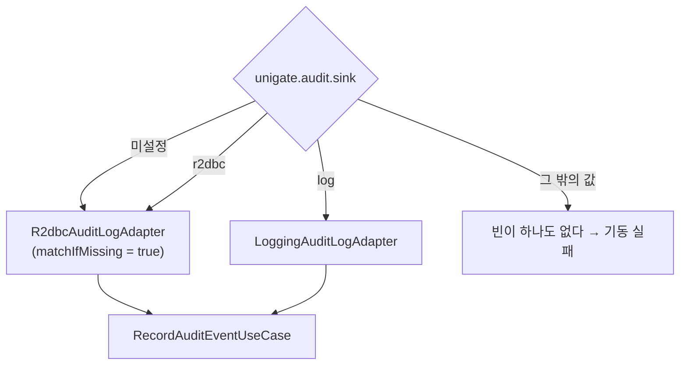

# 36. `@ConditionalOnProperty` — 설정 한 줄로 구현을 바꾸되, 빠뜨렸을 때 안전한 쪽으로

> 조건부 빈의 어려움은 문법이 아니라 **`matchIfMissing` 을 어디로 둘 것인가**다.
> 설정을 빠뜨렸을 때 무엇이 선택되는지가 곧 안전 기본값이다.
> 관련: Phase 5 · 8d · 코드 `gateway/.../R2dbcAuditLogAdapter.kt` · `iam/.../OutboxPollingScheduler.kt`
> 선행: [24](24-fail-closed-by-default-tenant-guard.md)

## 1. 왜 필요했나

이 저장소는 `@ConditionalOnProperty` 를 네 곳에서 쓴다.

| 위치 | 켜고 끄는 것 | `matchIfMissing` |
|---|---|---|
| `R2dbcAuditLogAdapter` | 감사 sink = DB | **true** |
| `LoggingAuditLogAdapter` | 감사 sink = 로그 | (없음) |
| `OutboxPollingScheduler` | outbox 워커 | **true** |
| `OutboxRetentionScheduler` | outbox 정리 | **true** |

같은 어노테이션인데 쓰임이 두 종류다 — **구현 교체**(앞의 둘)와 **기능 on/off**(뒤의 둘).
그리고 `matchIfMissing` 이 세 곳에 붙어 있는데 그 판단 근거가 각 파일에 흩어져 있었다.

조건부 빈은 **틀려도 기동은 되기 때문에** 규칙을 정리해 둘 값어치가 있다.

## 2. 익숙한 방식과의 대조

| | `if` 분기 | `@ConditionalOnProperty` |
|---|---|---|
| 결정 시점 | 실행 중 매번 | **컨텍스트 조립 시 1회** |
| 안 쓰이는 쪽 | 코드에 남아 있다 | **빈이 아예 없다** |
| 테스트 | 분기별 호출 | **컨텍스트를 두 번 조립** |
| 틀렸을 때 | 잘못된 동작 | 빈 없음 → 기동 실패 **또는 조용한 대체** |

가장 큰 차이는 2행이다. 조건에 안 맞는 구현은 **객체가 생성조차 되지 않는다.**
그래서 "둘 다 있는데 하나만 쓴다"가 아니라 "하나만 존재한다"가 된다.

이 성질이 헥사고날과 잘 맞는다. UseCase 는 포트에만 의존하므로,
어떤 어댑터가 조립됐는지 **알 필요도 없고 알 수도 없다.**

## 3. 동작 원리

### 3.1 두 어댑터가 같은 포트를 두고 갈린다

```kotlin
@Component
@ConditionalOnProperty(name = ["unigate.audit.sink"], havingValue = "r2dbc", matchIfMissing = true)
class R2dbcAuditLogAdapter(...) : SaveAuditEventOutPort

@Component
@ConditionalOnProperty(name = ["unigate.audit.sink"], havingValue = "log")
class LoggingAuditLogAdapter : SaveAuditEventOutPort
```



네 번째 분기가 중요하다. `sink=postgres` 같은 오타를 내면 **어느 조건도 맞지 않아
빈이 하나도 만들어지지 않고**, UseCase 가 주입받을 것이 없어 기동이 실패한다.

**이건 좋은 실패다.** 오타를 조용히 무시하고 기본값으로 도는 것보다 낫다.

### 3.2 `matchIfMissing` 은 안전 기본값을 정하는 자리다

`matchIfMissing = true` 는 "속성이 아예 없으면 이 빈을 만든다"이다.
**설정을 빠뜨렸을 때 무엇이 선택되는가**를 정하는 것이고, 그래서 보안·운영 판단이 들어간다.

R2DBC 쪽에 붙인 이유가 KDoc 에 있다:

> 감사는 조회·보존이 필요하므로 DB 가 기본이어야 하고, 설정을 빠뜨렸을 때 감사가
> **조용히 로그로만** 남는 상황을 막기 위해서다.

거꾸로 로그 어댑터에 `matchIfMissing = true` 를 붙였다면, 설정 실수 한 번으로
**감사 기록이 남지 않는데 아무도 모르는** 상태가 된다. 로그는 나가니까 정상처럼 보인다.

[24](24-fail-closed-by-default-tenant-guard.md) 의 "잊으면 닫히는 기본값"과 같은 사고방식이다 —
**잊었을 때의 결과가 안전한 쪽이어야 한다.**

### 3.3 기능 on/off 는 반대 방향의 판단

스케줄러 둘은 성격이 다르다.

```kotlin
@ConditionalOnProperty(name = ["unigate.iam.outbox.polling.enabled"], havingValue = "true", matchIfMissing = true)
class OutboxPollingScheduler(...)
```

여기서 `matchIfMissing = true` 는 "**켜는 것이 기본**"이라는 뜻이다.
outbox 워커가 안 돌면 Keycloak 반영이 영영 안 되므로([33](33-claim-propagation-delay.md)),
빠뜨렸을 때 꺼져 있으면 안 된다.

끄는 용도는 명시적으로만 쓴다 — 설정에 그 의도가 적혀 있다:

```yaml
# 워커를 띄우지 않는 인스턴스(API 전용 노드)를 구성할 여지. 통합 테스트도 이걸로 끈다.
enabled: ${IAM_OUTBOX_POLLING_ENABLED:true}
```

**판단 기준**: `matchIfMissing` 의 방향은 "이 기능이 없으면 무엇이 조용히 망가지는가"로 정한다.
망가지는 쪽이면 `true`(기본 켜짐), 위험한 쪽이면 `false`(명시해야 켜짐).

### 3.4 값이 설정 파일에 있어야 하는 이유

네 속성 모두 `application.yml` 에 **기본값과 같은 값으로** 적혀 있다. 중복처럼 보이는데 의도다:

```yaml
# 값 자체는 코드 기본값과 같지만 **명시해 둔다.** 설정 파일에 없는 값은 존재를 모르게 되고,
# 장애 때 "폴링 주기를 어떻게 바꾸지" 를 코드에서 찾게 된다.
```

조건부 빈의 스위치는 **장애 대응 수단**이다. 그 존재를 아는 사람만 쓸 수 있으면 수단이 아니다.

## 4. 직접 확인한 것

### 4.1 네 곳의 사용처

```bash
grep -rn 'ConditionalOnProperty' gateway/src iam/src --include='*.kt'
```

```
gateway/.../loggingOut/LoggingAuditLogAdapter.kt:34:@ConditionalOnProperty(name = ["unigate.audit.sink"], havingValue = "log")
gateway/.../r2dbcOut/R2dbcAuditLogAdapter.kt:33:@ConditionalOnProperty(name = ["unigate.audit.sink"], havingValue = "r2dbc", matchIfMissing = true)
iam/.../schedulerIn/OutboxRetentionScheduler.kt:25:@ConditionalOnProperty(name = ["unigate.iam.outbox.retention.enabled"], havingValue = "true", matchIfMissing = true)
iam/.../schedulerIn/OutboxPollingScheduler.kt:51:@ConditionalOnProperty(name = ["unigate.iam.outbox.polling.enabled"], havingValue = "true", matchIfMissing = true)
```

전부 **어댑터 계층**에 있다. `application`·`domain` 에는 없다 —
"무엇을 쓸지"는 조립의 문제이지 도메인의 문제가 아니라는 게 위치로 드러난다.

### 4.2 교체가 실제로 일어나는지 — 컨텍스트를 두 번 조립해 확인

주장("설정 한 줄로 구현이 바뀐다")은 mock 으로 증명되지 않는다.
`AuditSinkSwappabilityTest` 가 `@SpringBootTest` 를 두 벌 띄워 **주입된 실제 타입**을 본다.

```bash
./gradlew :gateway:test --tests '*AuditSinkSwappability*'
```

```
suite: unigate.audit.sink 를 설정하지 않으면 | tests: 1 failures: 0
   - R2DBC 어댑터가 주입된다()

suite: unigate.audit.sink=log 로 바꾸면 | tests: 2 failures: 0
   - 로깅 어댑터로 교체된다()
   - UseCase 는 구현이 바뀌어도 그대로 조립된다()
```

세 번째가 헥사고날의 실증이다. `sink=log` 컨텍스트에는 `R2dbcAuditLogAdapter` 빈이 **아예 없는데**
UseCase 는 정상 조립된다 — 포트에만 의존하기 때문이다.

테스트 구성 방식:

```kotlin
@Nested
@SpringBootTest                                            // 기본값
inner class DefaultSink {
  @Test fun `R2DBC 어댑터가 주입된다`() {
    assertThat(outPort).isInstanceOf(R2dbcAuditLogAdapter::class.java)
  }
}

@Nested
@SpringBootTest(properties = ["unigate.audit.sink=log"])   // 설정을 바꿔 다시 조립
inner class LogSink { ... }
```

`@SpringBootTest(properties = ...)` 가 **컨텍스트를 따로 만든다**는 점이 핵심이다.
같은 컨텍스트에서 속성만 바꾸는 것은 불가능하다 — 조건은 조립 시점에 이미 평가됐다.

### 4.3 설정 파일에 스위치가 명시돼 있다

```yaml
outbox:
  polling:
    # 워커를 띄우지 않는 인스턴스(API 전용 노드)를 구성할 여지. 통합 테스트도 이걸로 끈다.
    enabled: ${IAM_OUTBOX_POLLING_ENABLED:true}
    initial-delay-ms: ${IAM_OUTBOX_POLLING_INITIAL_DELAY_MS:10000}
  retention:
    # COMPLETED 레코드 정리. DEAD 는 지우지 않는다(사람이 봐야 할 것이므로).
    enabled: ${IAM_OUTBOX_RETENTION_ENABLED:true}
    cron: ${IAM_OUTBOX_RETENTION_CRON:0 30 4 * * *}
```

**환경변수로 덮을 수 있게 되어 있다.** 조건부 빈의 스위치가 배포 시점에 바뀌려면
`application.yml` 하드코딩이 아니라 환경변수 참조여야 한다.

⚠️ 반면 `unigate.audit.sink` 는 `gateway/src/main/resources/application.yml` 에서 찾지 못했다:

```bash
grep -rn 'sink' gateway/src/main/resources/*.yml
```

```
(출력 없음)
```

즉 §3.4 의 원칙("설정 파일에 명시한다")이 **두 스케줄러에는 지켜졌고 audit sink 에는 안 지켜졌다.**
동작에는 문제가 없지만(기본값이 코드에 있다), 운영자가 이 스위치의 존재를 알 방법이 없다.

## 5. 함정 / 실패 모드

### 5.1 `havingValue` 를 안 쓰면 의미가 달라진다

```kotlin
@ConditionalOnProperty(name = ["foo.enabled"])                        // 값이 "false" 가 아니면 활성
@ConditionalOnProperty(name = ["foo.enabled"], havingValue = "true")  // 값이 정확히 "true" 여야 활성
```

첫 번째는 `foo.enabled=anything` 에도 활성화된다. 오타를 잡지 못한다.
이 저장소는 **전부 `havingValue` 를 명시**한다.

### 5.2 조건에 아무도 안 맞으면 기동이 실패한다 — 그런데 메시지가 불친절하다

`unigate.audit.sink=postgres`(오타) 로 두면 두 어댑터 모두 조건에 안 맞아 빈이 없다.
그러면 UseCase 조립이 실패하는데, 에러는 "`SaveAuditEventOutPort` 타입 빈이 없다"로 나온다.
**"sink 값이 잘못됐다"고는 안 알려준다.**

원인이 조건부 빈이라는 걸 모르면 "왜 어댑터가 없지?" 에서 시작하게 된다.
`@ConditionalOnProperty` 를 쓴다는 사실 자체를 알아야 추적이 시작되는 구조다.

**디버깅 수단**: Spring Boot 는 조건 평가 결과를 리포트로 남긴다.

```
--debug            # 기동 로그에 condition evaluation report 출력
/actuator/conditions   # actuator 가 켜져 있으면 엔드포인트로도 확인
```

여기서 "어떤 조건이 왜 안 맞았는지"(`did not find property`, `@ConditionalOnProperty
(unigate.audit.sink=log) did not find property 'unigate.audit.sink'`)가 나온다.
⚠️ 이 두 수단은 이번에 **직접 실행해 보지 않았다**(§6).

### 5.3 조건부 빈은 테스트가 조립을 안 하면 검증되지 않는다

[34](34-jwt-iss-aud-azp.md) §5.5 와 같은 계열의 함정이다.
`@ConditionalOnProperty` 의 동작은 **컨텍스트가 실제로 조립될 때만** 확인된다.
단위 테스트로 어댑터를 직접 `new` 하면 조건은 평가조차 안 된다.

그래서 `AuditSinkSwappabilityTest` 가 `@SpringBootTest`(L4 풀 컨텍스트)를 쓴다.
느리지만 **다른 방법으로는 증명이 안 된다.**

### 5.4 켜고 끄는 스위치가 상태를 남길 수 있다

`OutboxPollingScheduler` 를 끄고 띄운 인스턴스는 outbox 를 처리하지 않는다.
그런데 **다른 인스턴스가 처리하므로 겉으로는 정상**이다.
전 인스턴스에서 실수로 꺼지면 그때서야 지시가 쌓이는데, 증상은 "권한 반영이 안 된다"로 나타난다
([33](33-claim-propagation-delay.md) §5.1 의 세 상태 중 하나와 구분이 안 된다).

**기능을 끄는 스위치는 꺼져 있다는 사실이 관측 가능해야 한다.**
지금은 기동 로그에 `outbox 폴링 시작` 이 안 찍히는 것으로만 알 수 있고,
"이 클러스터에 워커가 한 대라도 있는가"를 보는 수단은 없다.

## 6. 남은 의문

- **`--debug` 리포트와 `/actuator/conditions` 를 실제로 확인하지 않았다**(§5.2).
  오타 상황을 만들어 어떤 메시지가 나오는지 봐야 §5.2 가 실측이 된다.
  지금은 "이런 수단이 있다"까지만 아는 상태다.

- **`unigate.audit.sink` 를 `application.yml` 에 넣을지 정하지 않았다**(§4.3).
  두 스케줄러와 규칙이 다른 상태인데, 일관성을 맞추는 게 맞는지
  ("코드 기본값으로 충분한 스위치"와 "운영이 만질 스위치"를 구분하는 게 맞는지) 판단이 안 섰다.

- **`@ConditionalOnMissingBean` 과의 관계를 안 써봤다.** 자동설정에서는 그쪽이 더 흔한데,
  "사용자가 정의하면 물러난다"는 성질이 여기 네 곳에도 어울리는지 검토한 적 없다.

- **워커가 한 대도 없는 상태를 어떻게 감지할지**(§5.4) 답이 없다.
  outbox 의 `PENDING` 건수 게이지가 이미 있으므로(§`OutboxConcurrencyIntegrationTest` 의
  "상태별 건수를 세어 메트릭에 낼 수 있다") 그게 계속 증가하면 알 수 있지만,
  "증가한다"를 알람 조건으로 쓰려면 정상 변동폭을 알아야 한다. 그 기준선이 없다.

- **프로파일(`@Profile`)과 조건부 속성을 언제 나눠 쓰는지** 기준이 흐릿하다.
  `AuthProbeConfig` 는 `@Profile("local")` 이고 감사 sink 는 속성이다.
  "환경 묶음이면 프로파일, 개별 스위치면 속성" 정도로 이해했는데 정리해 본 적은 없다.
