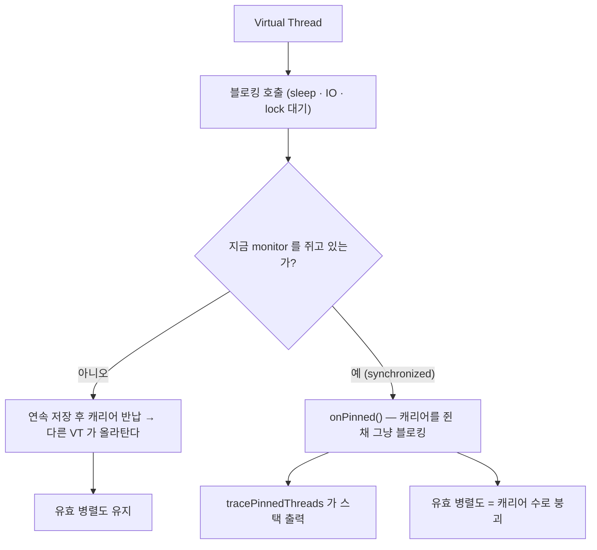

# 37. VT pinning 을 실제로 측정하기 — 안 나온 것을 근거로 삼으려면

> `ReentrantLock` 으로 pinning 을 "예방했다"고 여러 문서에 써왔지만 측정한 적은 없었다.
> 측정해 보니 **0건**이었는데, 0건이 근거가 되려면 **플래그가 실제로 보고한다는 것부터 증명**해야 했다.
> 관련: Phase 8 · 코드 `iam/src/.../ServiceAccountTokenProvider.kt` · `iam/src/.../OutboxCircuit.kt`

## 1. 왜 필요했나

`iam` 은 Virtual Thread 로 돈다. VT 의 가장 유명한 함정이 **pinning** 이다 — `synchronized` 블록 안에서
블로킹하면 캐리어(플랫폼) 스레드를 반납하지 못해, VT 를 켠 이유가 사라진다.

그래서 이 저장소는 두 곳에서 `synchronized` 를 의도적으로 피하고 `ReentrantLock` 을 썼다.

| 코드 | 무엇을 지키나 | 락 안에서 블로킹하는가 |
|---|---|---|
| `ServiceAccountTokenProvider` | service account 토큰 캐시(이중 검사) | **한다** — 토큰 발급은 네트워크 호출 |
| `OutboxCircuit` | 회로 상태 전이 | 하지 않음(상태 갱신뿐) |

문제는 **이게 전부 주석과 문서에만 있었다**는 것이다. `docs/learning/README.md` 의 Phase 8 항목에도
"`ReentrantLock` 으로 예방했으나 **실측 여전히 미완**" 이라고 1년 가까이 남아 있었다.

[15](15-archunit-dependency-guard.md) 에서 배운 것이 정확히 이 상황을 가리킨다 —
**통과만 하는 가드는 무의미하다.** "pinning 이 안 났다"도 같다. 안 났는지, 못 봤는지 구분이 안 되면
관측이 아니라 희망이다.

## 2. 익숙한 방식과의 대조

| | 플랫폼 스레드 (지금까지의 습관) | Virtual Thread (`iam`) | 왜 다른가 |
|---|---|---|---|
| `synchronized` + 블로킹 | 스레드 하나가 대기할 뿐 | **캐리어까지 묶인다** | VT 는 마운트된 캐리어를 반납해야 다음 VT 가 올라탄다. monitor 를 쥐면 반납 경로가 막힌다 |
| 동시성 한계 | 스레드풀 크기 | 캐리어 수(기본 = CPU 코어) | pin 되면 유효 병렬도가 **코어 수**로 떨어진다 |
| 증상 | 스레드 덤프에 대기 스레드가 쌓임 | **아무 예외도 없고 처리량만 안 오른다** | 로그로 안 드러난다 — 전용 진단 플래그가 필요한 이유 |
| 진단 | `jstack` | `-Djdk.tracePinnedThreads` (JDK 21) | 이벤트가 발생한 **그 순간**에만 stdout 으로 나온다 |

> `ReentrantLock` 이 안전한 이유는 "더 좋은 락이라서"가 아니다. `java.util.concurrent` 의 락은
> `LockSupport.park()` 로 대기하고, VT 런타임이 그 park 를 **연속(continuation) 중단**으로 가로챈다.
> monitor(`synchronized`)는 JVM 내부 구조라 그 경로를 탈 수 없다. [31](31-kotlin-coroutine-suspend.md) 의
> "중단은 스레드를 멈추는 게 아니라 연속을 저장하는 것" 과 같은 이야기다.

## 3. 동작 원리



핵심은 **`onPinned()` 가 호출되는 조건**이다. "monitor 를 쥐고 있다"만으로는 부족하고,
**그 상태에서 park 를 시도해야** 한다. 락을 잡고 CPU 만 쓰는 코드는 pin 으로 보고되지 않는다.

## 4. 직접 확인한 것

### 4.1 먼저 플래그가 보고한다는 것부터 증명한다

"iam 에서 pinning 이 0건" 을 근거로 쓰려면 **0건이 관측 실패가 아니라는 보장**이 필요하다.
같은 JDK·같은 플래그에서 `synchronized` 와 `ReentrantLock` 이 갈리는지 먼저 봤다.

```java
// scratchpad/PinProbe.java — 8개 VT 가 각각 락을 잡고 50ms sleep
static void blockUnderSynchronized() {
  synchronized (MONITOR) { Thread.sleep(50); }
}
static void blockUnderReentrantLock() {
  LOCK.lock();
  try { Thread.sleep(50); } finally { LOCK.unlock(); }
}
```

```bash
java -Djdk.tracePinnedThreads=full PinProbe.java synchronized
java -Djdk.tracePinnedThreads=full PinProbe.java reentrantlock
```

실제 출력:

```
=== mode=synchronized java=21.0.11+10-LTS
VirtualThread[#28]/runnable@ForkJoinPool-1-worker-1 reason:MONITOR
    java.base/java.lang.VirtualThread$VThreadContinuation.onPinned(VirtualThread.java:199)
    java.base/jdk.internal.vm.Continuation.onPinned0(Continuation.java:393)
    java.base/java.lang.VirtualThread.parkNanos(VirtualThread.java:635)
    java.base/java.lang.VirtualThread.sleepNanos(VirtualThread.java:807)
    java.base/java.lang.Thread.sleep(Thread.java:507)
    PinProbe.blockUnderSynchronized(PinProbe.java:15) <== monitors:1
    java.base/java.lang.VirtualThread.run(VirtualThread.java:329)
=== done (virtual=true)

##################
=== mode=reentrantlock java=21.0.11+10-LTS
=== done (virtual=true)
```

관찰:

- `reason:MONITOR` 와 `<== monitors:1` 이 **pinning 의 지문**이다. 이 두 문자열만 grep 하면 된다.
- **`ReentrantLock` 쪽은 한 줄도 나오지 않는다.** 같은 sleep, 같은 8개 VT, 같은 플래그인데 갈렸다.
- 화살표(`<==`)가 **monitor 를 쥔 프레임**을 직접 가리킨다. 라이브러리 안에서 pin 이 나도
  어느 메서드가 범인인지 스택에서 바로 짚힌다.

이제 "0건" 이 의미를 갖는다.

### 4.2 iam 을 pinning 트레이스와 함께 띄운다

```bash
./gradlew :iam:bootJar
source ./keycloak.secret.env && export KEYCLOAK_URL="${KEYCLOAK_ISSUER_URI%/realms/*}"
IAM_SERVER_PORT=8091 java -Djdk.tracePinnedThreads=full -jar iam/build/libs/app.jar \
  --spring.datasource.hikari.maximum-pool-size=2 \
  --management.endpoint.health.show-details=always
```

`maximum-pool-size=2` 는 실수가 아니라 **실험 조건**이다. 기본 풀(10)로는 400 동시 요청이
와도 커넥션을 기다릴 일이 거의 없어 **경합이 안 생기고, 경합이 없으면 pin 할 자리도 없다.**
풀을 2로 줄여 "커넥션을 기다리는" 상태를 강제로 만든다.

VT 가 실제로 켜졌는지부터 확인(`/debug/thread` 프로브):

```json
{"threadName":"tomcat-handler-0","virtual":true,
 "threadToString":"VirtualThread[#55,tomcat-handler-0]/runnable@ForkJoinPool-1-worker-1",
 "javaVersion":"21.0.11+10-LTS"}
```

부하 대상이 **정말 DB 를 타는지**도 확인해야 한다(안 타면 HikariCP 를 태운 게 아니다):

```json
{"status":"UP","components":{"db":{"status":"UP",
  "details":{"database":"PostgreSQL","validationQuery":"isValid()"}}, ...}}
```

`db` 컴포넌트가 `isValid()` 로 살아 있다 — health 요청 하나가 **풀에서 커넥션을 하나 꺼낸다.**

### 4.3 400 동시 요청을 걸고 pinning 을 센다

```bash
ab -n 20000 -c 400 -q http://localhost:8091/actuator/health
grep -nE "reason:|monitors:" iam-pool2b.log
```

```
Concurrency Level:      400
Complete requests:      20000
Failed requests:        0
Requests per second:    7366.51 [#/sec] (mean)
Time per request:       54.300 [ms] (mean)
  50%     48
  95%    133
  99%    200
 100%    435 (longest request)
```

```
### pinning 관련 출력 (reason: / monitors:)
(0건 — grep 이 아무것도 못 찾음)

### 로그 전체 줄수 / WARN·ERROR
     181
0
```

관찰:

- **커넥션 2개로 20,000 요청 / 400 동시성을 실패 0건으로 처리했다.** 400개 VT 가 커넥션 2개를
  놓고 줄을 서는 동안 캐리어(코어 수만큼)는 계속 다른 VT 를 처리했다는 뜻이다.
  pin 이 났다면 유효 병렬도가 캐리어 수로 떨어져 p99 가 훨씬 크게 벌어졌을 것이다.
- pinning 출력 **0건**. 4.1 에서 같은 JVM·같은 플래그가 `synchronized` 를 잡아냈으므로
  이건 관측 실패가 아니다. **HikariCP 5.x 의 커넥션 획득 경로에 monitor 블로킹이 없다.**
- WARN·ERROR 0건 — 커넥션 타임아웃으로 위장한 실패도 없었다.

### 4.4 덤으로 재현된 것 — `/actuator/prometheus` 가 401

Hikari 메트릭을 읽으려다 걸렸다.

```
{"type":"about:blank","title":"Unauthorized","status":401,
 "detail":"유효한 액세스 토큰이 필요합니다.","instance":"/actuator/prometheus",
 "reasonCode":"authentication_required"}
```

`README.md` 의 미완 항목 "management port 분리 — 스크랩이 401" 이 **그대로 재현됐다.**
`/actuator/health` 는 `PUBLIC_PATHS` 에 있지만 `prometheus` 는 없어서, deny-by-default 규칙
([24](24-fail-closed-by-default-tenant-guard.md))이 정확히 의도대로 막은 것이다. 설정 실수가 아니라
**아직 안 한 일**이 드러난 것이다.

## 5. 함정 / 실패 모드

| 함정 | 증상 | 원인 | 해결 |
|---|---|---|---|
| **경합 없이 측정** | pinning 0건인데 아무것도 증명 못 함 | 풀이 넉넉하면 대기 자체가 없다 → park 도 없다 → pin 도 없다 | 풀 크기를 줄여 **기다리게 만든 뒤** 측정 |
| **음성 결과를 그냥 믿기** | "안 나왔으니 안전" | 플래그 오타·JDK 버전 차이로 **원래 아무것도 안 나오는** 상태일 수 있다 | 반례(`synchronized`)를 먼저 돌려 **보고된다는 것**을 확인 |
| **JDK 버전 혼동** | JDK 24 에서 플래그가 통째로 무시됨 | JEP 491 로 `synchronized` pinning 자체가 없어지고 플래그도 제거됐다 | 이 프로젝트는 **JDK 21**. 상위 JDK 로 올리면 이 실험은 의미를 잃는다(그리고 `ReentrantLock` 선택의 근거도 약해진다) |
| **락을 잡고 CPU 만 쓰는 코드를 pin 으로 기대** | 아무 출력 없음 | `onPinned()` 는 **park 시도**에서만 불린다 | 블로킹(`sleep`·IO)을 반드시 락 안에 넣어야 재현된다 |
| **이름으로 VT 판별** | `tomcat-handler-N` 을 보고 플랫폼 스레드로 오인 | Tomcat 이 VT 에도 이름을 붙인다 | `Thread.isVirtual()` 로만 판단 (`ThreadProbeController`) |

> **가장 위험한 것은 두 번째 줄이다.** "안 나왔다"는 결론은 도구가 말할 수 있다는 전제 위에서만
> 성립한다. [28](28-k6-loadtest-silent-failures.md) 의 "성공만 검사하면 실패가 침묵한다" 와 같은 구조다 —
> 거기서는 check 가 전부 통과했는데 아무것도 측정하지 않았고, 여기서는 로그가 깨끗한데
> 관측기가 꺼져 있을 수 있었다.

## 6. 남은 의문

### 이번에 답이 나온 것

- [x] **`ReentrantLock` 이 정말 pin 을 막는가?** → **막는다.** 같은 조건에서 `synchronized` 는
      `reason:MONITOR` 를 찍고 `ReentrantLock` 은 한 줄도 안 찍는다(§4.1). 이제 코드 주석의
      "pinning 이 발생하지 않는다" 는 문장이 실측에 기대고 있다.
- [x] **HikariCP 가 pin 을 유발하는가?** → **하지 않는다.** 커넥션 2개 / 400 동시성으로
      20,000 요청을 태워도 0건(§4.3).

### 아직 모르는 것

- [ ] **`ServiceAccountTokenProvider` 의 락 경로는 실제로 태우지 못했다.** outbox 에 PENDING 이
      0건(`COMPLETED 12` · `DEAD 2`)이라 워커가 Keycloak Admin 을 부르지 않았다. 그 경로를 태우려면
      **공유 Keycloak(realm `test`)에 사용자를 만드는 부수효과**가 생겨 이번엔 하지 않았다.
      → 메커니즘은 §4.1 로 확정됐으니 남은 건 "그 코드가 정말 그 락을 지나는가" 뿐이다.
      통합 테스트에서 토큰 만료를 앞당겨 동시 호출을 만드는 편이 부수효과가 없다.
- [ ] **pin 이 났을 때의 처리량 손실을 수치로 못 봤다.** 0건이라 비교군이 없다. 일부러
      `synchronized` 를 넣은 빌드로 같은 부하를 걸어야 "얼마나 손해인가"가 나온다.
- [ ] **JDK 24+ 로 올리면 이 결정이 어떻게 되는가.** JEP 491 이후 `synchronized` 도 pin 하지 않는다면
      `ReentrantLock` 선택은 근거를 하나 잃는다. 다만 이중 검사 캐시에는 락 자체가 여전히 필요하므로
      **코드를 되돌릴 이유는 아니다** — 근거가 "VT 필수" 에서 "취향" 으로 바뀔 뿐이다.
- [ ] **`-Djdk.tracePinnedThreads` 는 stdout 으로만 나온다.** 운영에서 이걸 상시 켤 수는 없고
      (출력량·성능), JFR 이벤트(`jdk.VirtualThreadPinned`)로 대체해야 할 것 같은데 써본 적 없다.
