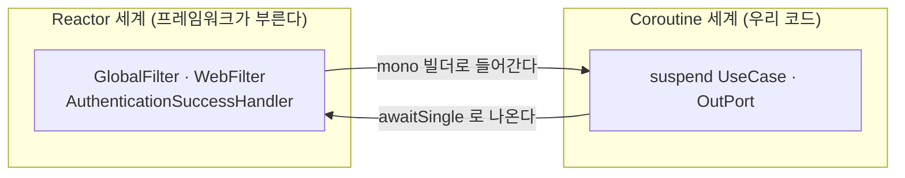

# 38. Reactor ↔ Coroutine 경계 — `mono { }` 와 `await*` 를 언제 쓰나

> 두 세계를 잇는 방향이 **두 개**고, 방향마다 도구가 다르다. 어려운 건 문법이 아니라
> **잘못 써도 컴파일되고 예외도 안 난다**는 것 — 틀리면 조용히 아무 일도 안 일어난다.
> 관련: Phase 1~9 · 코드 `gateway/src/.../AuditingAuthenticationHandlers.kt` · `.../TenantGateFilter.kt`

## 1. 왜 필요했나

`gateway` 는 Spring Cloud Gateway(WebFlux) 위에 있어 **프레임워크가 `Mono`/`Flux` 로 말한다.**
반면 이 저장소의 UseCase 는 전부 `suspend` 함수다(`CLAUDE.md` §5.1). 그래서 어댑터는 항상
두 세계의 경계에 선다.

`docs/learning/README.md` 의 Phase 1 항목이 오래 `[~]` 로 남아 있었다 —
컨텍스트 전파는 [13](13-distributed-tracing-reactor-context.md) 이 실패를 겪으며 다뤘지만,
**"언제 무엇을 쓰나"** 는 정리한 적이 없었다. 코드에는 이미 세 방향이 다 들어와 있는데
판단 기준만 머릿속에 있던 상태다.

## 2. 익숙한 방식과의 대조

| | Servlet + 블로킹 | 여기서의 방식 | 왜 다른가 |
|---|---|---|---|
| 값을 꺼내기 | `future.get()` · 그냥 리턴값 | `mono.awaitSingle()` | 스레드를 붙잡지 않고 **연속을 중단**한다([31](31-kotlin-coroutine-suspend.md)) |
| 값을 돌려주기 | `return result` | `mono { result }` | 호출자(프레임워크)가 `Mono` 를 기대한다 |
| "지금 실행" | 함수를 부르면 실행 | **구독해야 실행** | `Mono` 는 cold — 만들기만 하면 아무 일도 안 난다 |
| 예외 | `throw` 가 호출부로 튄다 | **error 신호**로 흐름에 실린다 | 구독하지 않으면 예외도 사라진다 |
| 취소 | 없음(끝까지 돈다) | 구독 취소 = 코루틴 취소 | 클라이언트가 끊으면 작업도 끊긴다 |

> 3·4행이 이 문서의 핵심이다. 나머지는 익히면 되지만, **"만들었는데 실행이 안 된다"** 는
> 컴파일러도 테스트도 잡아주지 않는다.

## 3. 동작 원리 — 방향이 두 개다



| 방향 | 도구 | 언제 |
|---|---|---|
| **Reactor → Coroutine** | `mono { }` | 프레임워크가 `Mono` 를 요구하는데 내용은 `suspend` 로 쓰고 싶을 때 |
| **Coroutine → Reactor** | `awaitSingle()` / `awaitSingleOrNull()` | `suspend` 함수 안에서 라이브러리가 준 `Mono` 값을 꺼낼 때 |
| **연산자 체인 안에서** | `.flatMap { mono { ... } }` | 이미 Reactor 체인 중간인데 그 한 단계만 `suspend` 일 때 |

### 3.1 이 저장소의 실제 사용처

| 코드 | 형태 | 왜 그 형태인가 |
|---|---|---|
| `AuditingAuthenticationHandlers` | `Mono.defer { ... mono { audit(...) } }.then(delegate...)` | 시그니처가 `Mono<Void>` 로 고정(Security 규약). `defer` 는 **구독 시점에** traceId 를 읽기 위한 것 |
| `TenantGateFilter.resolveTenants` | `.flatMap { token -> mono { tokenVerifier.verify(token).tenants } }` | 앞뒤가 Reactor 체인이고 검증 한 단계만 `suspend` |
| `R2dbcAuditLogAdapter.save` | `suspend fun` 안에서 `.rowsUpdated().awaitSingle()` | 우리가 `suspend` 를 노출하고 내부에서 드라이버의 `Mono` 를 소비 |
| `KeycloakTokenVerifier.verify` | `jwtDecoder.decode(raw).awaitSingle()` | 동일 — 라이브러리가 `Mono` 만 준다 |
| `LogoutProbeConfig` | `request.principal().awaitSingleOrNull()` | **없을 수 있는 값**이다(미인증). `awaitSingle()` 이면 터진다 |

> 마지막 줄이 `awaitSingle` 과 `awaitSingleOrNull` 의 갈림이다. §4 관찰 1 참조.

## 4. 직접 확인한 것

임시 프로브를 `gateway` 테스트 소스셋에 넣어 실행하고 지웠다(`./gradlew :gateway:test`).

```kotlin
Mono.empty<String>().awaitSingleOrNull()
Mono.empty<String>().awaitSingle()
val notSubscribed = mono { ran.incrementAndGet() }   // 구독 안 함
mono<String> { throw IllegalStateException("감사 저장 실패") }
```

실제 출력:

```
[1a] awaitSingleOrNull(empty) = null
[1b] awaitSingle(empty)       = NoSuchElementException: null
[2a] mono{} 생성 직후 실행횟수  = 0  (타입=MonoCreate)
[2b] block() 으로 구독한 뒤    = 1
[3a] mono{throw} 생성만        = 예외 안 남
[3b] 구독 시점에               = IllegalStateException: 감사 저장 실패
[4]  구독 안 한 mono{throw}    = 아무 일도 일어나지 않음
[5]  suspend fun save 시그니처 = Object save(String, Continuation)
```

관찰:

- **[1] 빈 `Mono` 에서 갈린다.** `awaitSingle()` 은 `NoSuchElementException` 을 던지는데
  **메시지가 `null`** 이다. 로그에 `NoSuchElementException: null` 만 찍히면 원인이 안 보인다 —
  "값이 없을 수 있는 자리에 `awaitSingle` 을 썼다"는 뜻으로 읽어야 한다.
  `LogoutProbeConfig` 가 `awaitSingleOrNull` 을 쓰는 이유가 정확히 이것이다(미인증이면 비어 있다).
- **[2] `mono { }` 는 cold 다.** 만들기만 하면 실행횟수가 **0** 이고, 실제 타입은 `MonoCreate` —
  "람다를 담아둔 상자"일 뿐이다. 구독해야 1이 된다.
- **[3][4] 예외도 구독을 따라간다.** 구독하면 `IllegalStateException` 이 나오지만,
  **구독하지 않으면 그 예외는 어디에도 안 나타난다.** 로그도 스택트레이스도 없다.
- **[5]** `suspend fun save(String): Long` 이 JVM 에서는 `Object save(String, Continuation)` 이다.
  [31](31-kotlin-coroutine-suspend.md) 에서 본 것과 같고, 이 시그니처 때문에 Reactor 가
  `suspend` 함수를 직접 못 부른다 — 그래서 `mono { }` 라는 어댑터가 필요하다.

## 5. 함정 / 실패 모드

| 함정 | 증상 | 원인 | 해결 |
|---|---|---|---|
| **`mono { }` 를 만들고 버린다** | 감사·메트릭이 **조용히 안 남는다.** 에러 로그 0건 | cold 라 구독이 없으면 본문이 실행조차 안 된다(§4 [2][4]) | 반드시 반환 체인에 잇는다 — `.then(...)` · `.flatMap { }`. "부르면 실행" 감각을 버릴 것 |
| **빈 `Mono` 에 `awaitSingle()`** | `NoSuchElementException: null` — 메시지가 없다 | 값이 없을 수 있는 소스(미인증 principal, 조회 결과 없음) | 없을 수 있으면 `awaitSingleOrNull()`. 있어야만 하면 `awaitSingle()` 로 **의도를 표현** |
| **`mono { }` 안에서 ThreadLocal 을 읽는다** | `traceId` 가 **항상 null** | 컨텍스트 복원은 Reactor **연산자 경계**까지다 | 경계 바깥(`Mono.defer { }`)에서 읽어 **값으로 넘긴다** — [13](13-distributed-tracing-reactor-context.md) §5 |
| **`runBlocking` 으로 때운다** | 저부하 정상, 고부하에서 전체 지연 폭발 | 이벤트 루프 스레드를 붙잡는다 = `.block()` 과 같은 죄 | 프로덕션 코드에서 금지(`CLAUDE.md` §4). 경계는 `mono { }` / `await*` 로만 |
| **`Mono.defer` 없이 값을 미리 읽는다** | 조립 시점 값이 박혀 요청마다 같은 값이 나간다 | 체인 **조립**은 한 번, **구독**은 요청마다 | 요청별 값은 `defer` 안에서 읽는다 |

> **첫 줄이 이 스택에서 가장 비싼 실수다.** 나머지는 터지거나 느려져서 알게 되는데,
> 이건 **아무 증상이 없다.** [28](28-k6-loadtest-silent-failures.md) 의 "성공만 검사하면 실패가
> 침묵한다" 와 같은 구조 — 감사가 안 남는 것을 알아차리려면 **없는 것을 세는 검사**가 필요하다.

### 5.1 판단 기준 (한 줄 요약)

```
프레임워크가 Mono 를 요구한다        → mono { }        (그리고 반드시 체인에 이어붙인다)
suspend 안에서 Mono 값이 필요하다    → awaitSingle()    (비어 있을 수 있으면 OrNull)
Reactor 체인 중간 한 단계만 suspend  → .flatMap { mono { } }
요청마다 달라지는 값을 읽어야 한다   → Mono.defer { }  로 감싼다
```

## 6. 남은 의문

### 이번에 답이 나온 것

- [x] **`mono { }` 와 `await*` 를 언제 쓰나** → 방향으로 갈린다(§3). 들어갈 때 `mono { }`,
      나올 때 `await*`, 체인 중간이면 `.flatMap { mono { } }`.
- [x] **`awaitSingle` 과 `awaitSingleOrNull` 의 차이가 실제로 무엇인가** → 빈 `Mono` 에서
      전자는 **메시지 없는** `NoSuchElementException`, 후자는 `null`(§4 [1]).

### 아직 모르는 것

- [ ] **구독하지 않은 `mono { }` 를 빌드가 잡을 수 있는가.** 지금은 사람이 리뷰로만 막는다.
      Reactor 의 `@CheckReturnValue` 나 detekt 규칙으로 "결과를 버린 `Mono`" 를 잡을 수 있을 것
      같은데 시도해 본 적 없다. [15](15-archunit-dependency-guard.md) 처럼 **테스트가 강제**하게
      만들 수 있다면 §5 첫 줄의 함정이 구조적으로 사라진다.
- [ ] **취소가 어디까지 전파되는가.** 클라이언트가 연결을 끊으면 구독이 취소되고 코루틴도
      취소된다고 알고 있는데, 그 시점에 **이미 시작된 R2DBC INSERT** 가 어떻게 되는지 확인하지 않았다.
      감사 로그가 반쯤 쓰이다 마는 경우가 있는지 모른다.
- [ ] **`Flux` 쪽 경계는 써 본 적이 없다.** 이 저장소는 전부 단건(`Mono`)이라
      `asFlow()` / `asFlux()` 를 쓸 일이 없었다. 목록 조회를 스트리밍으로 바꾸면 그때 만난다.
- [ ] **`mono { }` 의 코루틴 컨텍스트가 무엇인가.** 기본값이 `Dispatchers.Unconfined` 인지
      호출 스레드를 그대로 쓰는지 확인하지 않았다. [02](02-webflux-event-loop.md) 에서 본
      스케줄러 전환과 어떻게 맞물리는지도 모른다.
