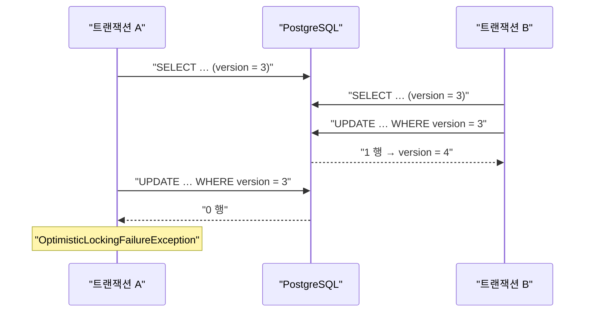

# 39. 낙관적 락 — 막는 것은 `@Version` 이 아니라 flush 시점이다

> 한 줄 요약 — `@Version` 을 붙이는 것은 시작일 뿐이고, **언제 flush 되는가**가 그 예외를 누가 잡을지를 정한다.
> 관련: Phase 8 미해결 6번 · 코드 `iam/src/main/kotlin/.../jpaOut/JpaUserProfileAdapter.kt` ·
> `iam/src/main/resources/db/migration/V7__add_user_profile_version.sql`

## 1. 왜 필요했나

Phase 8 을 마치며 "프로필 동시 수정에 낙관적 락이 없다" 를 미해결로 남겼다. 이메일 변경(`docs/learning/25`)
을 만들면서 그 빈자리가 구체적인 구멍으로 드러났다.

`UserProfile.requestEmailChange` 는 진행 중인 변경이 있으면 거절한다. 그런데 그 검사는 **읽은 시점의
`pendingEmail`** 을 본다.

```
요청 A: 프로필 로드 → pendingEmail = null   ┐
요청 B: 프로필 로드 → pendingEmail = null   ┘  둘 다 "진행 중 아님" 으로 판정
요청 B: pendingEmail = first  저장 (커밋)
요청 A: pendingEmail = second 저장 (커밋)   ← B 를 덮는다
```

도메인이 막으려던 상태(지시 두 개가 동시에 존재)가 **경합으로 그대로 뚫린다.** 도메인 코드는 잘못이
없다 — 한 트랜잭션 안에서는 옳게 판단했다. 빠진 것은 "내가 읽은 뒤 남이 바꿨는가" 를 저장 시점에
확인하는 층이다.

## 2. 익숙한 방식과의 대조

| | 지금까지 이 프로젝트에서 | 여기서의 방식 | 왜 다른가 |
|---|---|---|---|
| 동시성 방어 | outbox 는 `SELECT … FOR UPDATE SKIP LOCKED`(비관적) | `@Version`(낙관적) | outbox 는 경합이 **설계상 상시**다(워커 N개가 같은 테이블을 노린다). 프로필은 대개 본인 1명 + 워커라 충돌이 드물다 |
| 충돌 시 | 잠긴 행을 **건너뛴다** | 예외를 던지고 **호출자가 정한다** | 건너뛸 수 있는 것은 "누가 처리해도 되는 일감" 이라서다. 프로필 수정은 그 사람의 의도라 대신 처리할 수 없다 |
| 잠금 비용 | 짧다(집고 처리하고 끝) | 없다(읽을 때 아무것도 안 잠근다) | 워커는 트랜잭션 안에서 **Keycloak 을 호출**한다. 그동안 행이 잠겨 있으면 사용자 요청이 외부 응답 시간만큼 대기한다 |

## 3. 동작 원리

`@Version` 이 붙으면 Hibernate 의 UPDATE 문이 달라진다.

```sql
-- 붙기 전
UPDATE user_profile SET display_name=?, ... WHERE id=?

-- 붙은 뒤
UPDATE user_profile SET display_name=?, ..., version=? WHERE id=? and version=?
```

`WHERE` 에 로드 시점의 version 이 실린다. 그 사이 남이 커밋했다면 version 이 이미 올라가 있어
**0 행이 갱신되고**, Hibernate 는 그것을 충돌로 해석한다.



### 3.1 도메인에 `version` 을 두지 않은 이유

도메인 `UserProfile` 에는 DB id 조차 없다 — "도메인은 저장 방식을 모른다" 는 원칙 때문이다. version 은
순수하게 영속성의 관심사라 그 원칙의 예외로 둘 이유가 없다. 그래서 엔티티에만 둔다.

대신 **전제가 하나 생긴다**: 같은 트랜잭션에서 조회한 엔티티를 그대로 갱신해야 한다. 어댑터의 `save`
는 저장 전에 행을 다시 찾는데, 같은 트랜잭션이면 영속성 컨텍스트가 **로드 시점의 인스턴스**를 돌려주므로
version 이 유지된다. 이 전제가 깨지면 락은 조용히 무력해진다 — §5 참조.

### 3.2 예외를 포트 타입으로 번역한다

```
Hibernate/Spring          어댑터                     application
OptimisticLockingFailure → ProfileConcurrentlyModified → 워커: Retryable
                                                       → 컨트롤러: 409
```

`IdentityProviderPort` 가 Keycloak 의 HTTP 상태를 재시도 가능/불가로 번역한 것(`docs/learning/17`)과 같은
구조다. application 이 `org.springframework.dao` 를 직접 잡으면 저장소를 갈아끼울 때 그 `catch` 가
조용히 무의미해진다 — 예외 타입이 달라지므로 **컴파일은 되고 런타임에만 안 잡힌다.**

## 4. 직접 확인한 것

### 4.1 마이그레이션과 실제 SQL

```
o.f.core.internal.command.DbMigrate : Current version of schema "public": 6
o.f.core.internal.command.DbMigrate : Migrating schema "public" to version "7 - add user profile version"
o.f.core.internal.command.DbMigrate : Successfully applied 1 migration to schema "public", now at version v7
```

Hibernate 가 실제로 낸 UPDATE 문(테스트 로그에서):

```
            consent_tos_version=?,
            version=?
        where
            id=?
            and version=?
```

### 4.2 통합 테스트 — 실제 PostgreSQL, 결정적 경합

```
./gradlew :iam:integrationTest --tests "*ProfileConcurrencyIntegrationTest*"

ProfileConcurrencyIntegrationTest > 프로필을 고칠 때마다 version 이 올라간다() PASSED
ProfileConcurrencyIntegrationTest > 이메일 변경 요청이 겹치면 지시가 두 개 만들어지지 않는다() PASSED
ProfileConcurrencyIntegrationTest > 먼저 저장된 변경을 나중 트랜잭션이 덮지 못한다() PASSED
BUILD SUCCESSFUL in 7s
```

스레드 두 개를 던지고 운에 맡기지 않았다. 순서를 고정했다 — 트랜잭션 A 가 로드한 **뒤**, 별도 스레드의
트랜잭션 B 가 완주하고, 그다음 A 가 저장한다. B 를 별도 스레드에 둔 이유는 트랜잭션이 스레드에
바인딩되기 때문이다. 같은 스레드에서 `TransactionTemplate` 을 다시 쓰면 A 에 **참여**해버려 경합 자체가
성립하지 않는다.

### 4.3 실효성 검증 — 락을 빼면 정말 실패하는가

`docs/learning/15` 의 교훈("통과만 하는 가드는 무의미")을 그대로 적용했다. `@Version` 한 줄을 주석
처리하고 같은 테스트를 돌렸다.

```
ProfileConcurrencyIntegrationTest > 프로필을 고칠 때마다 version 이 올라간다() FAILED
    Expecting actual:
ProfileConcurrencyIntegrationTest > 이메일 변경 요청이 겹치면 지시가 두 개 만들어지지 않는다() FAILED
    Expecting code to raise a throwable.
ProfileConcurrencyIntegrationTest > 먼저 저장된 변경을 나중 트랜잭션이 덮지 못한다() FAILED
    Expecting code to raise a throwable.
BUILD FAILED in 7s
```

**`Expecting code to raise a throwable.`** — 이 한 줄이 lost update 의 정의 그 자체다. 예외가 나야 할
자리에서 아무 일도 일어나지 않았고, 그래서 앞선 변경이 조용히 사라졌다.

### 4.4 전체 회귀

```
./gradlew build          → BUILD SUCCESSFUL
./gradlew :iam:integrationTest → 61 PASSED  (기존 54 + 신규 7)
```

## 5. 함정 / 실패 모드

### 5.1 `save` 로는 예외를 잡을 수 없다 — flush 가 트랜잭션 커밋 때 일어난다

이것이 이 작업에서 가장 중요한 발견이다.

이미 영속 상태인 엔티티에 `repository.save()` 를 불러도 Hibernate 는 **그 자리에서 아무것도 하지 않는다.**
실제 UPDATE 는 트랜잭션 커밋 시점의 flush 에서 나가고, 낙관적 락 위반도 그때 터진다. 그 시점은
**유스케이스 밖**이다.

| | 커밋 시점에 터질 때 | `saveAndFlush` 로 즉시 터질 때 |
|---|---|---|
| 워커의 예외 분류 | `attempt()` 의 `try` 를 이미 빠져나가 **분류되지 못한다** | `catch` 가 정상적으로 잡는다 |
| 유스케이스의 뒷부분 | 감사까지 다 실행된 뒤 롤백된다 | 변경이 없었으므로 감사도 남지 않는다 |

첫 줄이 특히 위험하다. 분류되지 못한 예외는 `REQUIRES_NEW` 트랜잭션을 롤백시키고, 그 롤백에는
**클레임과 attempts 증가도 포함된다.** P9b 가 고쳤던 무한 재시도 루프(`docs/learning/22`)가 그대로
되살아난다.

즉 `@Version` 을 붙이는 것만으로는 부족하고, **예외가 터지는 시점을 통제**해야 비로소 처리할 수 있다.

### 5.2 워커에서 이 예외를 미분류로 두면 정상 지시가 죽는다

`OutboxProcessor.attempt()` 의 마지막 `catch (e: Exception)` 은 미분류 실패를 **`Permanent`(DEAD)** 로
보낸다. "모르는 실패는 사람이 봐야 한다" 는 옳은 기본값이지만, 낙관적 락 충돌은 모르는 실패가 아니다.

그대로 두면 아무 잘못 없는 가입 지시가 *"하필 그 순간 사용자가 자기 프로필을 수정했다"* 는 이유로
DEAD 가 되고, 운영자가 DLQ 에서 손으로 되살려야 한다. **재시도로 낫는 실패를 사람 일감으로 만드는
것은 분류 실패다.**

### 5.3 회로에 세면 안 된다 — 판정 축이 다르다

`Retryable` 로 분류하는 것만으로는 아직 부족했다. `processOne()` 은 `Retryable` 이면 무조건
`circuit.recordFailure()` 를 부르고 있었다.

`OutboxCircuit` 이 판정하는 것은 **"외부 시스템이 죽었는가"** 하나뿐이다. 우리 DB 안의 경합을 거기에
세면, 프로필 수정이 몰리는 시간대에 **워커 전체가 30초씩 멈춘다** — 정작 Keycloak 은 멀쩡한데.

그래서 `Retryable` 에 `countsTowardCircuit` 을 두어 축을 갈랐다. 처음엔 주석에만 "회로에 세지 않는다"
라고 써놓고 코드는 세고 있었다 — 주석이 코드보다 앞서 나간 전형적인 경우다.

대조군 테스트를 함께 뒀다. "동시 수정이 반복돼도 회로가 안 열린다" 만 있으면 *회로가 애초에 안 열리는
것*과 구분되지 않으므로, "같은 횟수의 외부 장애는 연다" 를 나란히 둔다. `docs/learning/23` 의 대조군
헤더, P9a 의 "전부 null 단언" 함정과 같은 이유다.

### 5.4 version 매핑을 빠뜨리면 락이 조용히 사라진다

컬럼이 테이블에 멀쩡히 있고 엔티티에 필드도 있는데 `@Version` 만 없으면, version 은 늘 0 이라
`WHERE version = 0` 이 **항상 맞는다.** 아무 에러 없이 락만 없어진다. 그래서 "고칠 때마다 version 이
올라간다" 를 별도 테스트로 먼저 고정했다.

### 5.5 반복 충돌은 결국 attempts 를 소진한다

`failedRetryable` 은 상한(`MAX_ATTEMPTS`)에 닿으면 DEAD 로 보낸다. 즉 낙관적 락 충돌이 연속 5회 나면
그 지시는 죽는다. 이것은 받아들인 대가다 — 정상 상황에서 5회 연속 충돌은 비정상이고, 그때는 사람이
보는 편이 맞다.

## 6. 남은 의문

- **재시도를 어디까지 자동화할 것인가.** 지금 워커는 "다음 폴링에 다시" 이고 사용자 요청은 409 다.
  워커 쪽은 같은 트랜잭션 안에서 즉시 한 번 더 시도해도 안전할 텐데(외부 호출이 멱등하므로),
  그러면 §5.5 의 attempts 소진이 줄어든다. 이득이 복잡도를 넘는지는 아직 모르겠다.
- **`tenant`·`membership` 에는 락이 없다.** 이번 범위는 프로필이었다. 멤버십은 역할 변경과 해제가
  겹칠 수 있어 같은 문제가 있을 텐데, 실제로 그 경합이 일어나는 경로가 있는지 확인하지 않았다.
- **FE 가 409 를 어떻게 다룰지 정하지 않았다.** `profile_modified_concurrently` 를 받으면 최신 값을
  다시 읽어 사용자에게 보여줘야 하는데, 그 화면 흐름이 아직 없다. 서버가 사유를 줘도 아무도 안 읽으면
  없는 것과 같다(`Retry-After` 와 같은 형태의 공백이다).
- **`updated_at` 과 version 이 둘 다 있는 게 맞나.** 지금은 어댑터가 `updatedAt` 을 손으로 찍고
  version 은 Hibernate 가 올린다. 역할이 겹치지는 않지만, 갱신 경로가 둘인 것이 나중에 어긋날 여지가 있다.
