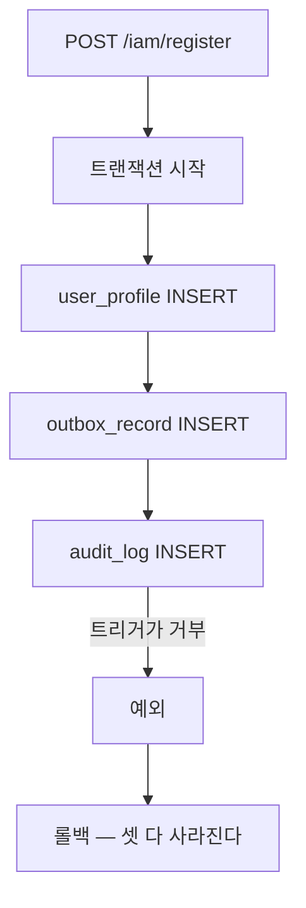

# 40. fail-closed 의 대가를 문장에서 관찰로 — 감사 저장소를 실제로 죽여봤다

> 한 줄 요약 — 트랜잭션 경계가 만든 정책은 **정상 경로에서 아무 차이도 내지 않아서**, 일부러 고장내지 않으면 지켜지는지 알 수 없다.
> 관련: Phase 8 미해결 2번 · P8g 결정 D3 · 코드 `iam/src/test/kotlin/.../integration/AuditFailClosedIntegrationTest.kt`

## 1. 왜 필요했나

P8g 에서 IAM 감사를 **fail-closed** 로 정했다(`docs/learning/21`). 감사 저장이 실패하면 업무도 롤백된다.
근거는 *"도메인 변경이 기록 없이 일어나는 편이 더 나쁘다"* 였고, 게이트웨이의 fail-open 과 정반대다.

그 대가 — **감사 저장소가 죽으면 가입도 멈춘다** — 는 그때부터 미해결 표 2번으로 남아 있었다.
"모든 구현이 끝난 뒤 테스트한다" 로 미뤄둔 항목이다.

미루는 동안 불편했던 이유는, 이 정책이 **코드에 보이지 않기 때문**이다. fail-closed 를 구현하는 것은
`@Transactional` 하나와 "감사 호출을 try/catch 로 감싸지 않았다" 는 부재뿐이다. 누군가 감사 호출을
`runCatching` 으로 감싸거나 별도 트랜잭션으로 빼면 조용히 fail-open 이 된다. 그때도 **모든 기존 테스트는
통과한다** — 정상 경로에서는 두 정책이 완전히 같은 결과를 내기 때문이다.

## 2. 익숙한 방식과의 대조

| | 흔한 방식 | 여기서의 방식 | 왜 |
|---|---|---|---|
| 감사 실패 처리 | `try { audit() } catch { log.warn() }` — 업무는 계속 | 예외를 그대로 전파해 **함께 롤백** | 관리 도메인의 변경은 기록이 곧 근거다. 기록 없는 변경은 나중에 재구성할 수 없다 |
| 장애 재현 | 포트를 mock 으로 바꿔 예외를 던지게 | **DB 트리거**로 INSERT 를 거부 | mock 은 "포트가 던지면" 을 보지만, 묻고 싶은 것은 **트랜잭션 경계가 진짜 DB 위에서 성립하는가** 다 |
| 게이트웨이(대조) | — | fail-**open** (감사 실패해도 인증은 통과) | 인증이 막히면 사용자가 아무것도 못 한다. 같은 조직의 같은 감사인데 정책이 반대인 것은 **무엇을 잃는가**가 다르기 때문 |

## 3. 동작 원리

장애를 만드는 방법으로 트리거를 골랐다.

```sql
CREATE OR REPLACE FUNCTION unigate_test_fail_audit() RETURNS trigger AS $$
BEGIN
  RAISE EXCEPTION 'audit storage unavailable (injected by test)';
END;
$$ LANGUAGE plpgsql;

CREATE TRIGGER unigate_test_fail_audit_trigger
BEFORE INSERT ON audit_log
FOR EACH ROW EXECUTE FUNCTION unigate_test_fail_audit();
```

테이블을 드롭하거나 이름을 바꾸는 방법도 있지만, 그러면 실패 시점이 스키마 검증까지 앞당겨지고 복구도
번거롭다. 트리거는 **쓰기만** 막아 실제 장애(디스크 full · 권한 회수 · 제약 위반)에 더 가깝다.



확인 대상이 **셋**인 것이 중요하다. 프로필만 보면 "저장이 안 됐다" 까지만 알 수 있고, outbox 지시가
함께 사라졌는지는 알 수 없다. 지시만 남으면 워커가 **존재하지 않는 프로필**을 채우려 든다.

## 4. 직접 확인한 것

```
./gradlew :iam:integrationTest --tests "*AuditFailClosedIntegrationTest*"

AuditFailClosedIntegrationTest > 감사 저장소가 죽으면 가입도 롤백된다 — 프로필도 outbox 지시도 남지 않는다() PASSED
AuditFailClosedIntegrationTest > 감사 저장소가 정상이면 같은 가입이 통과한다 — 대조군() PASSED
AuditFailClosedIntegrationTest > 감사 저장소가 정상이면 워커가 지시를 완료한다 — 대조군() PASSED
AuditFailClosedIntegrationTest > 감사 저장소가 죽으면 워커도 진행하지 못하고 지시가 그대로 남는다() PASSED
BUILD SUCCESSFUL in 7s
```

### 4.1 단언을 한 번 강화해야 했다

처음에는 "요청이 실패했다"(`assertThat(thrown).isNotNull()`)만 확인했다. 그러면 **DB 가 아예 안 붙어도
통과한다.** 근본 원인까지 내려가 감사 때문임을 확인하도록 바꿨다.

```kotlin
assertThat(thrown).rootCause().hasMessageContaining("audit storage unavailable")
```

대조군을 함께 둔 것도 같은 이유다. 실패 테스트만 있으면 *"감사 때문에 막혔다"* 와 *"이 환경에서는 원래
가입이 안 된다"* 가 구분되지 않는다.

### 4.2 예상과 다른 것 — 워커 경로에서는 **원인이 사라진다**

가입 경로는 예상대로 감사 예외가 근본 원인으로 남았다. 워커 경로는 달랐다. 같은 단언을 썼더니:

```
java.lang.AssertionError: Expecting actual throwable to have a root cause but it did not, actual was:
org.springframework.transaction.UnexpectedRollbackException:
    Transaction silently rolled back because it has been marked as rollback-only
```

**cause 체인이 비어 있다.** 이유를 따라가 보니 이랬다:

1. 감사 실패 예외를 `OutboxProcessor.attempt()` 의 **미분류 `catch` 가 먼저 잡는다**
2. 워커는 이것을 `unclassified_failure` 로 분류하고 레코드를 DEAD 로 확정하려 시도한다
3. 그런데 그 시점의 트랜잭션은 DB 예외로 이미 rollback-only 로 마킹돼 있어, 그 `update` 도 커밋되지 못한다
4. 밖으로 나오는 것은 원래의 SQL 예외가 아니라 `UnexpectedRollbackException` 하나뿐이다

`OutboxProcessor` KDoc 의 "남아 있는 한계" 가 정확히 이 경로를 예측하고 있었는데, 실측이 거기에 한 줄을
더했다 — **예외만 보고는 왜 롤백됐는지 알 수 없다.** 진짜 원인은 워커가 남긴 `outbox 미분류 실패`
로그에만 있다.

결과 상태는 확인한 대로다:

| 관측 대상 | 결과 |
|---|---|
| outbox 레코드 | `PENDING`, `attempts = 0` (클레임과 증가까지 롤백됐다) |
| 프로필 | `user_ref` 가 여전히 `null` (ACTIVE 전이가 롤백됐다) |
| 대조군(트리거 없음) | `COMPLETED`, `user_ref = kc-audit-ok-1` |

즉 **레코드는 죽지 않는다.** 감사 저장소가 살아나면 그대로 처리된다. 무한 재시도처럼 보이지만 이쪽이
맞는 동작이다 — DB 가 아픈 상황에서 레코드를 DEAD 로 확정하는 편이 더 위험하다.

⚠️ 다만 Keycloak 호출은 **이미 나갔다.** 롤백되는 것은 우리 DB 뿐이라, 재시도는 그 호출의 멱등성에
기댄다(`createUser` 는 조회 → 생성 → 409 면 재조회 — `docs/learning/17`).

## 5. 함정 / 실패 모드

### 5.1 트리거를 남기면 이후 모든 테스트가 깨진다

`@AfterEach` 뿐 아니라 **`@BeforeEach` 에서도** 드롭한다. 앞선 실행이 중간에 죽었을 수 있고, 그러면
다음 실행은 원인 모를 실패로 시작한다. 장애를 주입하는 테스트는 **주입보다 원복이 더 중요하다.**

### 5.2 fail-closed 의 진짜 범위는 HTTP 요청이 아니다

미해결 표 2번은 "가입이 정말 막히는지" 였지만, 실제로 막히는 것은 **워커도** 였다. 감사 저장소 장애
동안에는:

- 새 가입이 500 으로 거절되고
- 이미 접수된 지시도 반영되지 못한 채 쌓인다

두 번째는 처음에 생각하지 못했던 대가다. 감사 테이블 하나가 IAM 의 **쓰기 경로 전체**를 멈춘다.

### 5.3 정상 경로 테스트로는 이 정책을 지킬 수 없다

fail-closed 와 fail-open 은 정상 경로에서 완전히 같은 결과를 낸다. 그래서 이 테스트가 없으면 정책이
뒤집혀도 아무도 모른다. `docs/learning/15` 가 ArchUnit 에서 배운 것 — *"통과만 하는 가드는 무의미하고,
일부러 위반을 넣어 검증해야 한다"* — 와 같은 형태의 문제다.

## 6. 남은 의문

- **이 대가가 정말 받아들일 만한가.** 감사 테이블 하나가 IAM 쓰기 전체를 멈춘다는 것을 이제 관찰로
  확인했다. 결정을 바꿀 근거는 아직 없지만, "감사만 별도 DB" 같은 구성이면 장애 격리가 달라진다.
- **운영자가 이 상황을 어떻게 알아채는가.** 지금은 500 과 로그뿐이다. DEAD 카운트 게이지(P9b)는 이
  상황에서 **안 움직인다** — 레코드가 DEAD 가 되지 않으니까. 오히려 `PENDING` 이 쌓이는 것이 신호인데
  그 지표가 없다.
- **가입 실패 응답이 500 인 것이 맞나.** 클라이언트 잘못이 아니므로 5xx 가 맞지만, 503 + `Retry-After`
  가 더 정확할 수 있다. 다만 그러려면 "감사 때문에 실패했다" 를 컨트롤러가 구분해야 하는데, §4.2 처럼
  원인이 예외에서 사라지는 경로가 있어 간단하지 않다.
- **게이트웨이의 fail-open 은 반대 방향으로 재현하지 않았다.** 감사가 죽어도 인증이 통과하는지를 실제로
  확인하면 두 정책의 대조가 완성된다. 이번 범위는 IAM 이었다.
