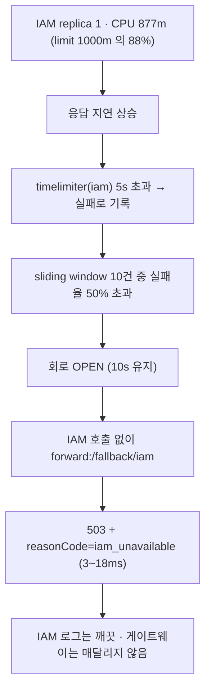
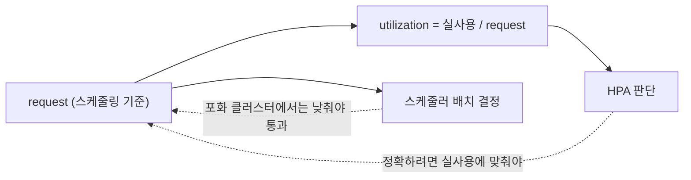
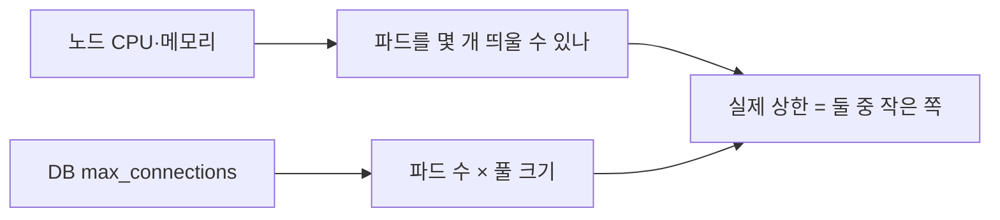

# 41. 무엇이 먼저 무너지는가 — 포화의 위치를 찾는 법

> 부하테스트의 결론은 "얼마나 처리하는가" 가 아니라 **"어디가 먼저 밀리는가"** 다.
> 게이트웨이를 8개로 늘려도 상한을 정한 것은 replica 1개짜리 IAM 이었고, 그 포화는 장애가
> 아니라 **3~18ms 짜리 거절**로 나타났다. IAM 을 풀자 다음 상한은 앱 밖 —
> **공유 DB 의 커넥션 슬롯**이었고, 이번엔 `CrashLoopBackOff` 라는 전혀 다른 얼굴로 왔다.
> 관련: Phase 6+ · 커밋 `404f767`(#56 · 노드 여유 회복 후 재측정) ·
> `518ca31`(#57 · IAM 스케일과 DB 커넥션) ·
> 코드 `loadtest/scenario-b-capacity.js` · `loadtest/lib/session.js` ·
> `gateway/src/main/resources/application.yml`(resilience4j) ·
> `deploy/helm/unigate-gateway/values-alpha-loadtest.yaml` ·
> `deploy/helm/unigate-iam/values-alpha-loadtest.yaml`

## 1. 왜 필요했나

2026-07-28 회차(→ [28](28-k6-loadtest-silent-failures.md))는 측정을 마치고 이렇게 적어 두었다.

> 최대 처리량을 알려면 노드 여유를 확보해 상한을 올리고, `request` 를 실사용에 맞게 되돌려
> HPA 기준을 정상화해야 한다.

그때는 노드 세 대의 CPU 예약이 94~99% 라 파드가 **한 노드에만** 들어갔다. `maxReplicas 4` 는
설계값이 아니라 "그 노드의 메모리 여유 ÷ 512Mi" 였고, `podAntiAffinity` 를 걸면 아예 스케줄되지
않았다. 즉 **측정 장치가 클러스터 사정에 갇혀 있었다.**

2026-08-02 에 노드가 한 대 늘고 예약이 풀려 그 조건이 사라졌다. 미뤄 둔 세 가지 —
request 정상화 · 상한 상향 · 노드 분산 — 를 한꺼번에 풀고 다시 쟀다.

그리고 그 과정에서 **예상하지 못한 것 두 가지**를 만났다. 이 문서는 그쪽이 본론이다.

- 부하를 올렸더니 무너진 곳이 게이트웨이가 아니었다
- 본 실행에 들어가기도 전에 **부하 스크립트가 먼저 죽었다** — 앱은 멀쩡한데

## 2. 익숙한 방식과의 대조

| | 익숙한 방식 (단일 앱 · 모놀리스) | 여기서의 방식 (게이트웨이 + IAM) | 왜 다른가 |
|---|---|---|---|
| "용량" 의 주체 | 앱 하나. CPU·스레드풀이 곧 상한 | **경로 위의 가장 약한 고리.** 게이트웨이가 여유로워도 뒤가 밀리면 거기가 상한 | 요청 하나가 두 앱을 지난다 |
| 포화의 증상 | 스레드풀 고갈 → 지연이 계속 늘다가 타임아웃 | **지연이 늘다가 갑자기 짧아진다.** 회로가 열리면 즉시 거절 | Circuit Breaker 가 느린 실패를 빠른 실패로 바꾼다 |
| 실패한 요청의 흔적 | 백엔드 로그에 남는다 | **백엔드 로그가 깨끗하다** — 도달조차 안 했으니 | 게이트웨이가 대신 끊었다 |
| 오토스케일 기준 | CPU 사용률(절대량) | **실사용 ÷ request** — request 를 낮추면 지표가 과민해진다 | 스케줄링과 오토스케일링이 같은 값을 공유한다 |
| 부하 스크립트 수명 | 앱 API 가 그대로면 계속 유효 | **배포 구성이 바뀌면 낡는다** (착지 URL 등) | BFF 는 로그인 흐름 자체가 배포 값에 얽혀 있다 |
| 스케일 상한 | 노드 CPU·메모리 | **거기에 더해 공유 DB 의 커넥션 슬롯** — 파드 수 × 풀 크기 | 파드가 늘면 풀도 파드 수만큼 곱해진다. 스케줄은 통과하는데 **부팅이 실패**한다 |

## 3. 동작 원리

### 3.1 포화가 거절로 바뀌는 연쇄

`/iam/**` 라우트에는 Circuit Breaker(`name=iam`)와 TimeLimiter(5s)가 걸려 있다.
IAM 이 밀리면 다음 순서로 **포화가 거절로 번역된다.**



핵심은 **E 이후로 IAM 을 부르지 않는다**는 점이다. 그래서:

- 게이트웨이 응답이 **빨라진다**(수천 ms → 한 자릿수 ms). 지연 그래프만 보면 회복처럼 보인다
- **IAM 로그에는 아무 흔적이 없다.** "백엔드가 멀쩡한데 5xx 가 난다" 로 보인다

### 3.2 HPA utilization 이 request 에 매인다는 것



같은 값 하나(`request`)를 **스케줄러와 HPA 가 공유하는데 요구 방향이 반대**다.
2026-07-28 회차는 스케줄을 통과시키려 `50m` 까지 낮췄고, 그 대가로 실사용 200m 이
**400%** 로 보였다. 앱이 아니라 지표가 먼저 포화한 것이다.

### 3.3 `topologySpreadConstraints` 의 조용한 실패

노드 분산에는 `podAntiAffinity` 대신 `topologySpreadConstraints` 를 썼다.

| | `podAntiAffinity` (required) | `podAntiAffinity` (preferred) | `topologySpreadConstraints` |
|---|---|---|---|
| replica > 노드 수 | **Pending** (스케줄 불가) | 배치는 되나 균등 보장 없음 | `maxSkew` 로 편차 제한 |
| 강제력 | 절대 | 가중치 힌트 | `whenUnsatisfiable` 로 선택 |

`ScheduleAnyway` 를 골랐다. `DoNotSchedule` 은 균등을 강제하지만 노드 여유가 어긋나면
Pending 이 쌓이고, **그 상태는 "용량 한계" 와 구분되지 않는다** — 2026-07-28 에
`podAntiAffinity(required)` 로 겪은 것과 같은 함정이다.

> ⚠️ **`labelSelector` 를 빠뜨린 제약은 에러가 아니라 무효다.** 셀렉터가 없으면 세는 대상이
> 0개라 skew 가 항상 0 이고, 제약은 걸려 있는데 스케줄러는 아무 제한도 받지 않는다.
> 매니페스트만 보면 분산이 켜져 있는 것처럼 보인다. 그래서 라이브러리 차트가
> 셀렉터를 **자동 주입**하게 만들었다(`unigate-common/templates/_deployment.tpl`).

## 4. 직접 확인한 것

> ⚠️ 이 절은 실제로 실행한 명령과 실제 출력만 담는다. 실제 호스트·계정·비밀번호는 마스킹했다.

### 확인 1 — 노드 여유가 실제로 회복됐다

```bash
# allocatable - (모든 파드의 requests 합) 을 노드별로 계산
kubectl get nodes -o json / kubectl get pods -A -o json  → python3 집계
```

```
node                                 cpu free     mem free   pods 512Mi/200m
common-default-worker-node-0           3245m       6.57Gi                13
common-default-worker-node-1           2685m       5.02Gi                10
common-default-worker-node-2            445m       1.02Gi                 2
common-default-worker-node-3           3845m       8.30Gi                16
```

관찰: 2026-07-28 에는 **총 4개**(node-1 에만)였다. 지금은 41개. `worker-node-3` 은
그때 없던 노드다.

### 확인 2 — 라이브러리가 `labelSelector` 를 자동 주입한다

values 에는 셀렉터를 쓰지 않았다.

```bash
helm template unigate-gateway deploy/helm/unigate-gateway \
  -f values-alpha.yaml -f values-alpha-loadtest.yaml
```

```yaml
      topologySpreadConstraints:
        - maxSkew: 1
          topologyKey: kubernetes.io/hostname
          whenUnsatisfiable: ScheduleAnyway
          labelSelector:
            matchLabels:
              app.kubernetes.io/name: unigate-gateway
              app.kubernetes.io/instance: unigate-gateway
```

관찰: 값에 없던 `labelSelector` 가 채워졌다. 명시로 준 경우에는 그 값이 그대로 유지되는 것도
같은 렌더로 확인했다(별도 항목에 `custom: explicit` 를 주고 확인).

### 확인 3 — 스모크 테스트가 본 실행을 살렸다 (예상 못 한 실패)

11분짜리 본 실행 전에 2초짜리 스모크를 돌렸더니 6개 계정 전부 죽었다.

```
GoError: 로그인 실패 (리다이렉트 설정(redirect_uri) 또는 realm 구성 확인 필요) status=200
	at login (file:///.../loadtest/lib/session.js:71:9(102))
```

메시지는 realm 을 가리켰지만, Keycloak 의 계정 상태는 멀쩡했다.

```bash
# 계정에 걸린 required action 확인
curl -H "Authorization: Bearer <admin-token>" \
  "$KEYCLOAK_URL/admin/realms/$REALM/users?search=loadtest&max=6"
```

```
loadtest-01@example.com | requiredActions= [] | emailVerified= False | enabled= True
... (6개 모두 동일)
```

그래서 **착지 URL 을 직접 찍어 봤다.**

```
authorize: status=200 url=https://<keycloak-host>/realms/unigate/protocol/openid-connect/auth?...
form found: true
login POST: status=200
landed url : https://<console-host>/
baseUrl    : https://<gateway-host>
startsWith(baseUrl) = false
form again = false
title      : unigate 검증 콘솔
```

관찰: **로그인은 성공했다.** 착지가 게이트웨이가 아니라 **FE 콘솔**이었을 뿐이다.
`lib/session.js` 의 판정이 `r.url.startsWith(baseUrl)` 였는데, FE 분리 배포로
`UNIGATE_FRONTEND_BASE_URI` 가 들어오면서(PR #47) 착지가 바뀐 것이다.

판정을 **세션 쿠키 유무**로 바꾼 뒤 재실행:

```
checks_succeeded...: 100.00% 36 out of 36
    ✓ 로그인 폼이 다시 나오지 않았다
    ✓ 게이트웨이 세션 쿠키가 생겼다
    ✓ 인증이 유지된다 (401/302 아님)
```

### 확인 4 — 100 VU: 분산과 스케일아웃이 실제로 동작한다

```bash
k6 run -e BASE_URL=https://<gw-host> -e USERS='<6개 계정>' \
       -e MAX_VUS=100 -e SLEEP_SECONDS=0.1 loadtest/scenario-b-capacity.js
```

```
✓ unigate_target_duration p(95)<1000   ✓ p(99)<2000
✓ http_req_failed{status:429} rate==0  ✓ checks rate>0.99

  요청 수      : 205708 (311.65 req/s)
  실패율       : 0%
  429 발생     : 0
  지연         : avg=98.13ms med=81.81ms p(95)=195.78ms max=2354.3ms
  checks       : 615822 통과 / 2 실패

  부하 생성기  : blocked p(95)=0ms · connecting p(95)=0ms · waiting p(95)=193.37ms
  VU 최대      : 100 · think time 0.1s
```

부하 중 15초 간격 관측(HPA · 노드 분포 · 파드별 CPU):

```
14:32:07 | hpa=3%/60%   replicas=2 desired=2 | nodes: 1 node-0 1 node-3
14:33:43 | hpa=131%/60% replicas=3 desired=5 | nodes: 2 node-0 2 node-1 1 node-3
14:36:11 | hpa=184%/60% replicas=8 desired=8 | nodes: 2 node-0 3 node-1 3 node-3
14:41:39 | hpa=162%/60% replicas=8 desired=8 | nodes: 2 node-0 3 node-1 3 node-3
           gw:...=309m gw:...=304m gw:...=324m gw:...=289m
           gw:...=336m gw:...=321m gw:...=287m gw:...=327m  iam:...=686m
```

관찰:

1. 8개가 `maxSkew=1` 을 지켜 **2/3/3** 으로 갈렸다. Pending 은 0.
   (2026-07-28 에는 4개가 전부 `worker-node-1` 에 있었다.)
2. HPA 가 **156~195%/60%** 다. 같은 종류의 부하에서 지난 회차는 **400%** 였다 —
   `request` 를 50m → 200m 로 되돌린 효과다.
3. 게이트웨이 파드당 ~320m 은 limit(1000m)의 32%. **아직 포화가 아니다.**
   가장 바쁜 것은 **IAM(686m)** — replica 1개, HPA 없음.
4. `blocked`·`connecting` 이 0ms 인데 `waiting` 이 193ms 다. 지연의 99%가 서버 시간이므로
   **로컬 부하 생성기는 병목이 아니다.**

> **스케일아웃 과도기에는 파드별 부하가 고르지 않다.** 새 파드가 뜨는 구간에는
> `998m` 과 `249m` 이 공존했다(4배). 8개가 다 Ready 가 된 뒤에야 287~336m 으로 고르게 갔다.
> 2026-07-28 회차에 "모든 파드가 고르게 받았다" 고 적었는데, 그건 **정상 상태의 성질**이지
> 스케일아웃 중의 성질이 아니다.

### 확인 5 — 200 VU: 여기서 무너졌다

think time 을 0으로 두면 요청률이 응답시간에만 좌우돼 앱이 버티는 만큼만 나간다.

```bash
k6 run ... -e MAX_VUS=200 -e SLEEP_SECONDS=0 loadtest/scenario-b-capacity.js
```

```
✗ checks rate>0.99
✓ http_req_failed{status:429} rate==0  ✓ p(95)<1000  ✓ p(99)<2000

  요청 수      : 380266 (576.17 req/s)
  실패율       : 21.43%
  429 발생     : 0
  지연         : avg=213.57ms med=184.76ms p(95)=475.19ms max=5115.6ms
  checks       : 1056709 통과 / 81489 실패
```

체크별로 갈라 보면 **무너진 곳이 하나뿐**이다.

```
  인증이 유지된다 (401/302 아님) ... 통과 379266 / 실패     0
  rate limit 에 걸리지 않았다 ...... 통과 379266 / 실패     0
  5xx 가 아니다 .................... 통과 297777 / 실패 81489
```

### 확인 6 — 5xx 의 정체: IAM 이 아니라 회로가 낸 것

먼저 IAM 로그를 봤다.

```bash
kubectl -n <ns> logs deploy/unigate-iam-deploy --since=15m | grep -iE "error|exception|timeout|refused"
```

```
(출력 없음)
```

관찰: **실패한 요청이 IAM 에 도달조차 하지 않았다.**

게이트웨이 로그:

```bash
kubectl -n <ns> logs -l app.kubernetes.io/name=unigate-gateway --since=15m --tail=-1 | grep 503
```

```
INFO ... [llEventLoop-5-2] RequestLoggingFilter : [post] GET /iam/profile status=503 SERVICE_UNAVAILABLE signal=onComplete elapsedMs=10
INFO ... [llEventLoop-5-2] RequestLoggingFilter : [post] GET /iam/profile status=503 SERVICE_UNAVAILABLE signal=onComplete elapsedMs=6
... (elapsedMs=3~18 범위)
```

관찰: 백엔드를 왕복한 시간이 아니다. WARN/ERROR 레벨 로그는 **한 줄도 없었다**
(resilience4j 는 회로 전이를 로그로 내지 않는다 — actuator 이벤트로만 노출된다).

그래서 **응답 본문을 직접 잡으러** 짧게 재현했다(200 VU · 105초).

```js
if (res.status >= 500 && /iam_unavailable/.test(res.body)) { console.log(res.body) }
```

```json
{"type":"about:blank","title":"IAM Unavailable","status":503,
 "detail":"IAM 서비스가 일시적으로 응답하지 않습니다. 잠시 후 다시 시도하세요.",
 "reasonCode":"iam_unavailable"}
```

관찰: `reasonCode: iam_unavailable` 은 `FallbackRoutes.iamFallbackRouter` 만 내는 값이다.
**IAM Circuit Breaker 가 열린 것이 확정됐다.** k6 가 관측한 `max=5115.6ms` 가
`timelimiter.instances.iam.timeout-duration: 5s` 와 맞아떨어지는 것이 연쇄의 시작점을 가리킨다.

### 확인 7 — 측정이 끝나고 오버레이를 원복했다

```bash
deploy/deploy-alpha.sh --yes --skip-build --tag <tag> gateway   # 오버레이 없이
```

```
(오버레이 값 없음 → application.yml 기본값 사용)
{"limits":{"cpu":"1","memory":"1536Mi"},"requests":{"cpu":"50m","memory":"512Mi"}}
unigate-gateway-hpa   Deployment/unigate-gateway-deploy   cpu: 16%/60%   2   4   4
```

관찰: `RATELIMIT_*` 환경변수가 사라져 운영 기본값(5/10/1)으로 돌아갔고,
`maxReplicas` 도 4로, 분산 제약도 제거됐다. **완화 프로파일 동안 게이트웨이는 사실상 무방비다.**

### 확인 8 — IAM 을 스케일했더니 병목이 옮겨갔다 (그리고 다른 것이 터졌다)

IAM 에 request 200m + HPA(2~6) + 노드 분산을 넣고 **같은 부하**(200 VU · think time 0)를 다시 걸었다.
부하 조건을 그대로 둔 것은 IAM 스케일의 효과만 분리하기 위해서다.

```
요청 수 : 385150 (583.53 req/s)   실패율 : 12.63%   (직전 21.43%)
```

병목은 실제로 이동했다 — IAM 은 파드당 110~316m 로 여유가 생기고, 게이트웨이가 `1008m`
(limit 1000m)에 닿았다. 여기까지는 의도한 대로였다. **그런데:**

```bash
kubectl -n <ns> get pods
```

```
unigate-gateway-deploy-...-75nmr  0/1  CrashLoopBackOff  6
unigate-gateway-deploy-...-g94kg  0/1  CrashLoopBackOff  6
unigate-gateway-deploy-...-kd5nc  0/1  CrashLoopBackOff  6
```

```bash
kubectl -n <ns> logs <pod> --previous --tail=30
```

```
FATAL: remaining connection slots are reserved for roles with the SUPERUSER attribute
SQL State  : 53300
	at org.flywaydb.core.internal.jdbc.JdbcUtils.openConnection(JdbcUtils.java:71)
	at org.flywaydb.core.FlywayExecutor.execute(FlywayExecutor.java:136)
	at org.springframework.boot.autoconfigure.flyway.FlywayMigrationInitializer.afterPropertiesSet
```

관찰: **DB 커넥션 슬롯이 소진돼 새 파드가 기동 자체를 못 했다.** 터진 곳은 런타임이 아니라
**Flyway 가 커넥션을 여는 부팅 시점**이다.

### 확인 9 — 공유 PostgreSQL 의 실제 한도

```bash
kubectl -n <ns> run pg-slot-check --rm -i --image=postgres:16-alpine -- \
  psql ... -c "SELECT current_setting('max_connections'), count(*) FROM pg_stat_activity;"
```

```
max | total
100 | 12
```

`superuser_reserved_connections=3` 이므로 **일반 슬롯은 97개**다. 그때의 산술:

| | 파드 | 풀 기본값 | 커넥션 |
|---|---|---|---|
| 게이트웨이 | 8 | R2DBC 10 | 80 |
| IAM | 6 | HikariCP 10 | 60 |
| | | 합계 | **140 > 97** |

관찰: **노드가 41개 파드를 받는다는 것이 8개로 올려도 된다는 뜻이 아니었다.**
스케줄 가능 여부만 보고 상한을 정했고, 그 판단에 DB 는 들어 있지 않았다.

### 확인 10 — 풀을 명시하고 다시: 실패가 사라졌다

```yaml
SPRING_R2DBC_POOL_MAX_SIZE: "4"                    # GW 8 × 4 = 32
SPRING_DATASOURCE_HIKARI_MAXIMUM_POOL_SIZE: "5"    # IAM 6 × 5 = 30
SPRING_DATASOURCE_HIKARI_MINIMUM_IDLE: "2"
```

```
✓ 429 rate==0   ✓ checks rate>0.99   ✓ p(95)<1000   ✓ p(99)<2000

  요청 수 : 323899 (490.75 req/s)
  실패율  : 0%
  지연    : avg=249.92ms med=201.73ms p(95)=593.85ms max=6988.44ms
  checks  : 969094 통과 / 3 실패
```

5xx 가 **81,489건 → 3건**이 됐다.

### 확인 11 — 부하 중 DB 슬롯을 실측해 산술을 검증했다

정상 상태에서 한 번 재 봤다.

```
db          | count
unigate_iam |  31      ← IAM 6파드 × 5 + 측정용 psql 1
unigate     |  23      ← GW 8파드 × 4 상한 중 실사용
(bg)        |   5
                        총 59 / 100   여유 41
```

같은 시점 파드 건강(관측 스크립트에 `ready`·`restarts` 를 되돌린 뒤):

```
16:02:31 | GW 246%/60% want=8 8/8 restarts=0 bad=0 | IAM 165%/60% want=6 6/6 restarts=0 bad=0
           gwNodes: 2 node-0  3 node-1  3 node-3 | iamNodes: 2 node-0  2 node-1  2 node-3
           gw CPU 333~594m · iam CPU 254~470m
```

관찰: 전 구간 `restarts=0`. 예측(GW 32 · IAM 30)과 실측(23 · 31)이 맞았고,
**양쪽 다 limit(1000m)에 여유가 있는 채로 threshold 를 전부 통과했다** — 즉 이번에도 포화 전이다.

### 확인 12 — 처리량이 줄었는데 결과는 나아졌다

| 회차 | 구성 | req/s | 실패율 | 판정 |
|---|---|---|---|---|
| 2차 | GW 8 · IAM 1 | 576.17 | 21.43% | IAM CB 열림 |
| 3차 | GW 8(실제 5) · IAM 6 · 풀 기본값 | **583.53** | 12.63% | GW 3개 CrashLoop |
| 4차 | GW 8 · IAM 6 · 풀 명시 | **490.75** | **0%** | 전부 통과 |

관찰: **3차가 4차보다 처리량이 높은데 3차는 실패한 회차다.** 503 은 백엔드를 타지 않아 빨리
돌아오므로 실패가 많을수록 초당 응답 수가 올라간다. 3차에서 실패분을 빼면
583 × 0.874 ≈ 510 req/s 로 4차와 비슷해진다. 지연도 4차가 더 느리다(p95 594ms vs 439ms) —
진짜로 일을 했기 때문이다.

## 5. 함정 / 실패 모드

| 함정 | 증상 | 원인 | 해결 |
|---|---|---|---|
| **백엔드 로그가 깨끗한 5xx** | 인증·429 는 정상인데 5xx 만 쏟아진다. 백엔드를 뒤져도 아무 흔적이 없다 | CB 가 열려 **백엔드를 부르지 않는다** | 응답 본문의 `reasonCode` 와 게이트웨이 `elapsedMs` 를 본다. **한 자릿수 ms 면 회로다** |
| **포화인데 응답이 빨라진다** | 지연 그래프가 회복처럼 보인다 | 회로가 열리면 즉시 거절이라 지연이 **짧아진다** | 지연만 보지 말고 **실패율과 함께** 본다 |
| **`request` 를 낮춰 HPA 가 과민해진다** | 상한에 붙었는데 응답은 멀쩡하다 | utilization = 실사용 ÷ request | 부하 창에서만 request 를 실사용에 맞춘다. 운영값은 스케줄 통과를 우선 |
| **`labelSelector` 없는 spread 제약** | 매니페스트엔 분산이 켜져 있는데 **한 노드에 몰린다.** 에러 없음 | 셀렉터가 없으면 세는 대상이 0개 → skew 항상 0 | 라이브러리가 `selectorLabels` 를 자동 주입 |
| **`DoNotSchedule` 로 균등 강제** | Pending 이 쌓이고 "용량 한계" 처럼 보인다 | 노드 여유가 어긋나면 배치 자체가 막힌다 | `ScheduleAnyway`. 재려는 건 강제력이 아니라 분산됐을 때의 거동 |
| **착지 URL 로 로그인 성공 판정** | 앱은 멀쩡한데 부하테스트만 죽는다. 메시지는 realm·redirect_uri 를 가리킨다 | 배포 구성(`UNIGATE_FRONTEND_BASE_URI`)이 바뀌면 착지가 바뀐다 | 판정을 **세션 쿠키**로. 실패 메시지에 착지 URL 을 넣어 다음엔 바로 보이게 |
| **고정 think time 으로 포화점 탐색** | VU 를 올려도 요청률이 비례해 안 오른다 | `sleep(0.5)` 가 VU 당 요청률에 천장을 만든다 | 포화 탐색에는 `SLEEP_SECONDS=0` |
| **과도기 편차를 정상 상태로 오독** | "파드마다 부하가 4배 차이난다" | 새 파드가 Ready 되기 전 구간 | Ready 수가 안정된 뒤 구간만 결론에 쓴다 |
| **스케일 상한을 노드 여유로만 정한다** | 파드는 스케줄되는데 **`CrashLoopBackOff`** 로 죽는다. 증상이 부하와 연결되지 않는다 | 공유 DB 의 커넥션 슬롯 소진. 파드 수 × 풀 크기가 `max_connections` 를 넘었다 | 상한을 정하기 전에 **파드 수 × 풀 크기 ≤ 일반 슬롯**을 계산한다. 풀을 명시하지 않으면 기본값 10이다 |
| **`minimum-idle` 을 두고 max 만 줄인다** | 풀을 줄였는데 커넥션이 안 준다 | HikariCP 의 `minimum-idle` **기본값은 `maximum-pool-size`** — 놀아도 최대치를 붙든다 | `SPRING_DATASOURCE_HIKARI_MINIMUM_IDLE` 을 함께 낮춘다 |
| **관측에서 Ready 를 뺀다** | 파드 3개가 죽어 있는데 부하가 끝날 때까지 모른다 | `desired` 는 HPA 가 **원하는 수**일 뿐 일하는 파드 수가 아니다 | 관측에 `ready=N/M` 과 `restarts` 를 반드시 남긴다 |
| **실패율 없이 처리량만 비교** | 더 나쁜 회차가 더 높은 req/s 를 낸다 | 503 은 백엔드를 타지 않아 **빨리 돌아온다** → 실패가 많을수록 초당 응답 수가 오른다 | 처리량은 항상 실패율과 짝으로 읽는다 |

### 이번에 새로 배운 판단 기준

**"처리량이 얼마인가" 를 묻기 전에 "무엇이 상한을 정하는가" 를 먼저 확인한다.**
576 req/s 는 게이트웨이의 수치가 아니라 **IAM replica 1개가 정한 전 구간 상한**이었다.
경로 위에 스케일 정책이 다른 앱이 섞여 있으면, 가장 약한 고리를 찾기 전의 수치는
"어떤 조합에서 이만큼 나왔다" 이상을 말하지 못한다.

그리고 그 "약한 고리" 는 **앱 안에만 있지 않다.** IAM 을 스케일해 앱 쪽 고리를 풀자
다음 고리가 **공유 PostgreSQL 의 커넥션 슬롯**이었다. 스케일 상한을 정하는 자원 목록은
이렇게 늘어난다:



2026-07-28 회차는 A 만 봤고(그때는 그게 실제로 병목이었다), 2026-08-02 회차는 A 가 풀리자
**C 를 보지 않은 채 상한을 올렸다가 CrashLoopBackOff 를 만났다.**
제약이 하나 풀리면 다음 제약을 다시 찾아야 하지, 이전 계산을 그대로 확장하면 안 된다.

## 6. 남은 의문

### 이번에 답이 나온 것

- [x] 노드 분산이 실제로 걸리는가 → **걸린다.** 8개가 2/3/3, Pending 0 (§4 확인 4)
- [x] `request` 정상화가 HPA 왜곡을 없애는가 → **없앤다.** 400% → 156~195% (§4 확인 4)
- [x] 로컬에서 쏘는 것이 병목인가 → **아니다.** blocked·connecting p95 = 0ms (§4 확인 4)
      → README "남은 것" 의 **클러스터 내부 k6 Job 은 이 근거로 접었다**
- [x] 576 req/s 에서 무엇이 무너졌나 → **IAM CB.** 본문 `reasonCode=iam_unavailable` 로 확정 (§4 확인 6)

- [x] IAM 을 스케일하면 CB 열림이 사라지는가 → **사라진다.** 5xx 81,489건 → **3건** (§4 확인 10)
- [x] 그러면 그 다음 상한은 무엇인가 → **공유 PostgreSQL 의 커넥션 슬롯**(max_connections=100).
      파드 수 × 풀 크기가 140 이 되어 새 파드가 부팅에 실패했다 (§4 확인 8·9)
- [x] 풀을 명시하면 몇 개가 도는가 → **14개 파드가 59 슬롯**으로 돈다 (§4 확인 11, 실측)

### 아직 모르는 것

- [ ] **게이트웨이 자체의 상한은 얼마인가** — IAM 을 풀었더니 이번엔 DB 가 막았고,
      그것까지 풀자 **포화 전에 부하가 끝났다**(GW 333~594m · IAM 254~470m, limit 1000m).
      더 밀려면 VU 를 올려야 하는데 그때 **DB 슬롯 산술을 다시 해야 한다** —
      상한을 정하는 자원이 하나 늘었으므로, 풀 크기 · replica 상한 · VU 를 함께 설계해야 한다
- [ ] **풀을 4·5로 줄인 것이 성능을 깎았는가** — 4차는 실패 0% 로 통과했지만
      p95 가 594ms 로 3차(439ms)보다 느리다. 실패분 때문이라고 해석했지만
      **커넥션 대기가 섞였을 가능성**을 분리하지 못했다. Hikari/R2DBC 풀의 대기 시간 지표
      (`hikaricp.connections.pending` 등)를 부하 중에 봐야 갈린다
- [ ] **회로가 몇 번 열렸다 닫혔나** — 실패율 21.43% 가 "계속 열려 있었다" 인지
      "열림·half-open 을 반복했다" 인지 구분하지 못했다. resilience4j 는 전이를 로그로 내지 않으므로,
      `/actuator/circuitbreakerevents` 를 부하 중 폴링하거나 상태 전이를 로그로 내는 이벤트 리스너가 필요하다.
      ⚠️ actuator 는 **인증 뒤에 있어**(`SecurityConfig`) 지금 구성으로는 부하 중 스크랩이 안 된다 —
      [27](27-helm-library-chart-and-alpha-deploy.md) 에 적힌 관측성 공백과 같은 뿌리다
- [ ] **IAM 의 포화 원인이 CPU 인가 다른 것인가** — 877m(limit 의 88%)까지 갔지만,
      JPA 커넥션 풀·VT pinning([37](37-vt-pinning-measurement.md))·Keycloak 왕복 중
      무엇이 지배적인지는 갈라 보지 않았다
- [ ] **5xx 2건(100 VU 회차)의 정체** — 205,208건 중 2건이라 CB 와 무관한 산발적 실패로 보이지만
      확인하지 않았다. 그 시각의 게이트웨이 로그를 좁혀 보면 답이 나온다
